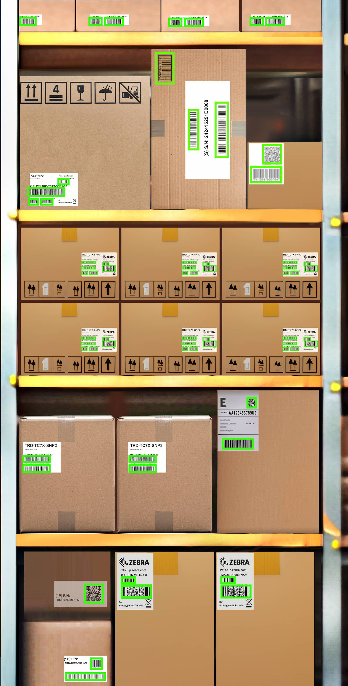
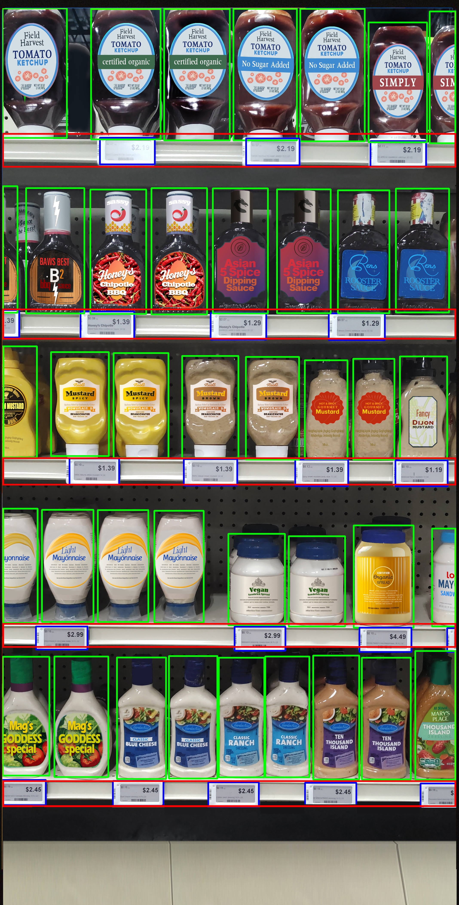
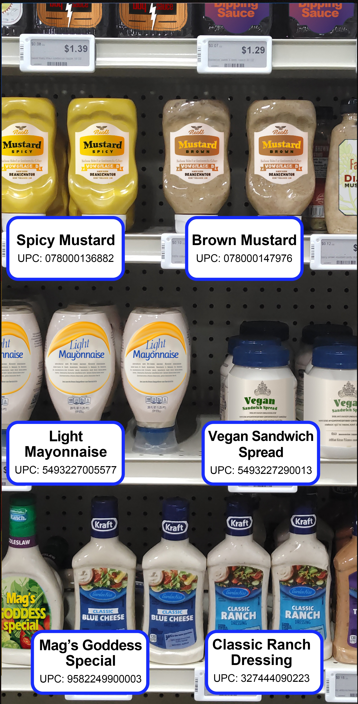
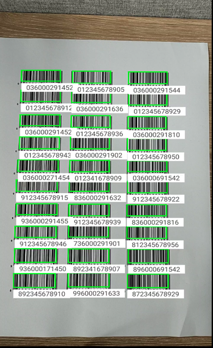
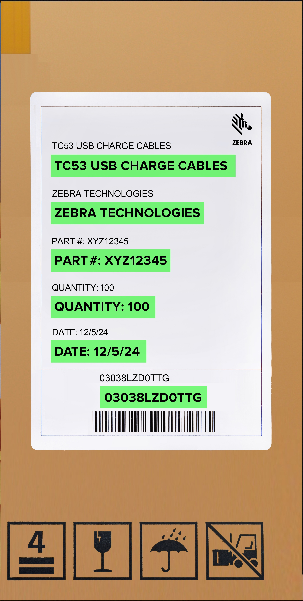
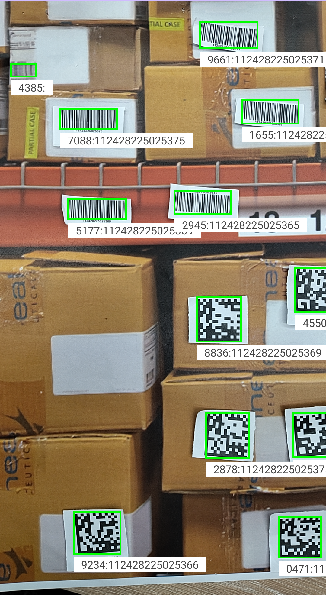
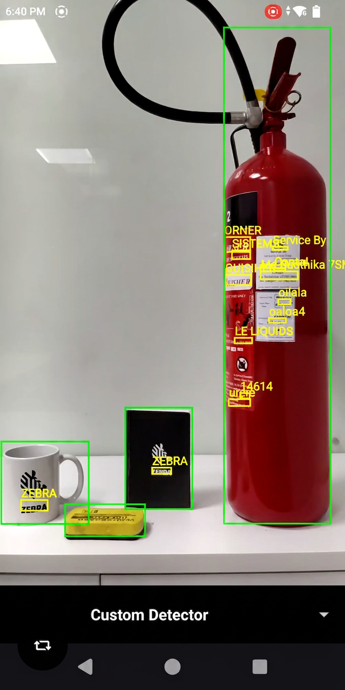
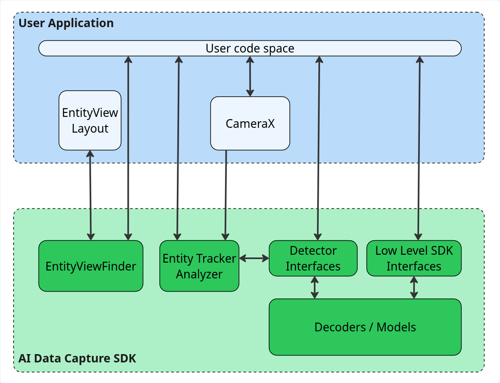
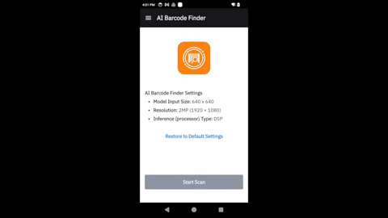
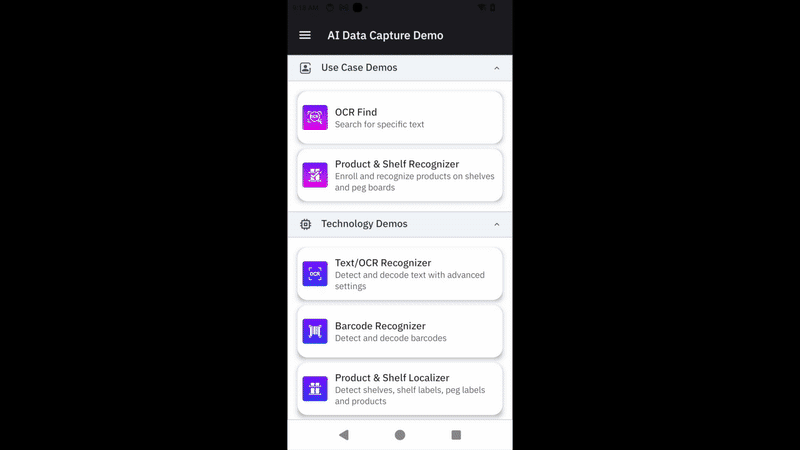

## Overview

The **AI Data Capture SDK** enables Java and Kotlin developers to create computer vision applications on Zebra mobile computers, offering tools and resources for both experienced and novice AI professionals to leverage the AI capabilities of Zebra devices.

As part of **Zebra’s Frontline AI Enablers,** which includes various AI Models tailored for enterprise use cases, the SDK offers APIs to use these models. Developers can pass frames or images from the camera or other source to the models using traditional methods or they can accelerate development with CameraX Analyzers. One such offering is the `EntityTrackerAnalyzer`, which enables developers to quickly and easily build CameraX-based applications for tracking Entities such as barcodes or text.

The AI Models include:

- **[Barcode Decoder Model](../model/barcode-localizer/) -** Detects and decodes 1D and 2D barcodes within an image.
- **[Product and Shelf Recognizer Model](../model/prod-recognizer/) -** Detects and recognizes products displayed on retail shelves from captured images. This model can also detect additional elements such as shelf labels, peg labels, and shelves themselves.
- **[TextOCR Model](../model/textocr/) -** Detects and recognizes text within an image.

While the AI Data Capture SDK provides built-in detectors for common enterprise use cases — such as [BarcodeDecoder](../barcodedecoder/), [Localizer](../localizer/), and [TextOCR](../textocr/) — specialized applications often require custom models or external SDKs. To bridge this gap, the SDK introduces **[CustomDetector](../customdetector/),** empowering developers to seamlessly integrate any third-party machine learning model directly into the existing tracking pipeline alongside Zebra's native detectors.

[Blueprints](#blueprints) are ready-made, adaptable AI frameworks, built on Zebra's edge-optimized models, that transform concepts into practical solutions for modernizing frontline work by automating tasks, reducing errors, and simplifying the adoption of AI into unique workflows.

The AI Data Capture SDK also offers a built-in **ViewFinder** (EntityViewfinder), capable of processing and rendering the interactive Entities generated during the session.

**Key Benefits:**

- **Optimized for Peak Performance on Zebra Devices -** The Frontline AI Enabler Models and the AI Data Capture SDK are specifically fine-tuned to harness the full potential of Zebra’s mobile computers, ensuring maximum efficiency and performance.
- **Effortless Integration Across Devices -** Developers can leverage trained Frontline AI Enabler Models on Zebra devices, simplifying the integration of AI vision into enterprise applications without the need for custom model training.
- **Simplified Development Workflow -** The AI Data Capture SDK integrates effortlessly with the CameraX framework, streamlining the development of vision-based applications and minimizing development complexity. For more information, refer to [EntityTrackerAnalyzer](#entitytrackeranalyzer) and [EntityViewfinder](#entityviewfinder).

**Overview Video -** This video provides an overview of Zebra's Frontline AI Enablers:

<iframe width="560" height="315" src="https://www.youtube.com/embed/9BEqcs2dSsA?si=ZUvkKcjGYWPHc1aM" title="YouTube video player" frameborder="0" allow="accelerometer; autoplay; clipboard-write; encrypted-media; gyroscope; picture-in-picture; web-share" referrerpolicy="strict-origin-when-cross-origin" allowfullscreen></iframe>

---

## SDK Capabilities

SDK capabilities:

<table class="facelift" style="width:100%" border="3" padding="10px">
  <tr bgcolor="#dce8ef">
    <th style="width: 20%">
<a href="#barcodelocalizer">Barcode Localizer</a>
</th>
    <th style="width: 20%">
<a href="#productandshelflocalizer">Product and Shelf Localizer</a>
</th>
    <th style="width: 20%">
<a href="#productrecognition">Product Recognition</a>
</th>
    <th style="width: 20%">
<a href="#barcodedecoder">Barcode Decoder</a>
</th>
  </tr>

  <tr>
	<td align="center"></td>
	<td align="center"></td>
    <td align="center"></td>
    <td align="center"></td>
  </tr>

  <tr>
    <td>Automatically detects all barcodes within an image, eliminating the need for individual scans. An augmented reality overlay highlights barcodes on labels, boxes, and shelf tags for decoding.</td>
    <td>Identifies products on shelves, enabling tasks such as locating a specific product, determining restock needs, and processing Point of Sale (POS) sales. Adapts to various aisle widths with flexible reading distances.</td>
    <td>Builds and stores detailed visual data about retail products, enhancing inventory management. This process typically follows the use of <b>Shelf Localizer,</b> which detects products in images, crops them and submits them for recognition.<!--Detects and identifies products on shelves, enabling tasks such as locating items, determining restock needs, processing sales at a POS, and more.--></td>
    <td>Detects and decodes various types of barcodes within an entire image or from specific regions.</td>
  </tr>

</table>

<table class="facelift" style="width:100%" border="3" padding="10px">
  <tr bgcolor="#dce8ef">
    <th style="width: 20%">
<a href="#textocr">Text OCR</a>
</th>
    <th style="width: 20%">
<a href="#entitytrackeranalyzer">Entity TrackerAnalyzer</a>
</th>
    <th style="width: 20%">
<a href="#entityviewfinder">Entity Viewfinder</a>
</th>
  </tr>

  <tr>
	<td align="center"></td>
	<td align="center"></td>
    <td align="center"></td>
  </tr>

  <tr>
    <td>Detects and recognizes text and characters in an image, converting it into words with high accuracy. Supports various fonts, font sizes, orientations, and lighting conditions.</td>
    <td>Detects, decodes, recognizes and tracks <code>Entities</code> such as barcodes, text, shelves or products in real-time using images or video, with built-in tracking that assigns persistent IDs for linking actions to entities.</td>
    <td>A built-in viewfinder designed to deliver a customizable and interactive camera viewfinder interface.</td>
  </tr>

</table>

<table class="facelift" style="width:100%" border="3" padding="10px">
  <tr bgcolor="#dce8ef">
    <th style="width: 20%">
<a href="../imageattributes/">Image Attributes Detector</a>
</th>
    <th style="width: 20%">
<a href="../imagetransform/">Image Transform Detector</a>
</th>
    <th style="width: 20%">
<a href="../customdetector/">Custom Detector</a>
</th>
  </tr>

  <tr>
	<td align="center"><video width="250" height="500" autoplay muted loop controls ><source src="../../images/4-1/img-attrib.mp4" type="video/mp4"></video></td>
    <td align="center"><video width="250" height="500" autoplay muted loop controls ><source src="../../images/4-1/img-transform.mp4" type="video/mp4"></video></td>
    <td align="center"></td>
  </tr>

  <tr>
    <td>Analyzes images in real-time to detect and verify their content and quality, detecting critical attributes like blur, object presence, and scene characteristics.</td>
    <td>Detects and blurs sensitive information within images, including barcodes, text, and people.</td>
    <td>Streamlines the integration of third-party machine learning models and SDKs directly into the AI Data Capture SDK pipeline, extending processing capabilities beyond native Zebra models.</td>
  </tr>

</table>

Each of these capabilities can be used individually or combined to streamline tasks across various industries.

### Barcode Localizer

**[Barcode Localizer](../localizer/)** detects 1D and 2D barcodes in images, suitable for various use cases such as identifying barcodes on product boxes, shelves and shipping labels.

### Product and Shelf Localizer

**[Product and Shelf Localizer](../localizer/)** detects and identifies objects on retail shelves, aiding inventory management, optimizing space and ensuring accurate labeling. The types of objects detected include:

- **Products -** Identifies individual products on the shelf, facilitating inventory tracking and automating stock checks.
- **Shelf Labels -** Detects and reads shelf labels, ensuring that products are accurately priced and labeled.
- **Peg Labels -** Recognizes peg labels used for hanging products, aiding in efficient product organization.
- **Shelves -** Detects the presence and structure of shelves themselves, helping in understanding shelf layouts and optimizing space usage.

These localizers are usually followed by a decoding and recognition phase:

- **Barcode Localizer -** The image, along with its localized bounding boxes, can be passed on to the `BarcodeDecoder` to decode barcode data. Both detection and decoding can be performed simultaneously with the use of the `process()` API.
- **Product and Shelf Localizer -** The bounding boxes identified by the localizer can be used to recognize the products.

---

### Product Recognition

**[Product Recognition](../productrecognition/)** builds a database of stored products (product enrollment), enabling their recognition for use cases such as inventory tracking and price compliance. The [Feature Extractor](../productrecognition/#featureextractor/) isolates key features from images, generating descriptors - vectors of float values that capture an item's characteristics - and stores them in [Feature Storage](../productrecognition/#featurestorage/) to enable product recognition. After a database of recognizable products is established, the Product Recognizer performs semantic searches to locate matching descriptors, predicting the identities of products on the shelf.

---

### Barcode Decoder

The **[Barcode Decoder](../barcodedecoder/)** detects and decodes various types of barcodes in images. It first identifies the location of barcodes within captured images, and then decodes them from either the entire image or from specific regions.

---

### Text OCR

The **[Text OCR](../textocr/)** model detects and decodes text characters in images, offering suggestions for recognized characters or words. It adapts to various fonts and input sizes, allowing for effective text recognition at different distances. Detected words can be grouped into 'lines' or 'paragraphs.'

---

### EntityTrackerAnalyzer

**[EntityTrackerAnalyzer](../camerax/#entitytrackeranalyzer)** is a CameraX-compatible implementation of the `ImageAnalysis.Analyzer` interface, designed for real-time detection, decoding, recognition, and tracking of `Entities` using still images or video frames. An `Entity` represents any element detectable by the AI Data Capture SDK, such as a barcodes, text, shelves or products, enabling various user applications. The analyzer includes built-in tracking capabilities, assigning a unique track ID to each `Entity` that persists as long as the `Entity` remains within view, allowing developers to link visual or operational actions to the tracked entities. Seamlessly integrating with CameraX, the `EntityTrackerAnalyzer` processes image frames using a series of detectors to deliver aggregated `Entity` tracking results, efficiently handling asynchronous tasks and lifecycle events for smooth operation within applications.

**Note:** Currently, `EntityTrackerAnalyzer` is designed to detect, decode, and track barcodes.

<!--
**[EntityTrackerAnalyzer](../camerax/#entitytrackeranalyzer)** is an implementation of the `ImageAnalysis.Analyzer` interface, designed for real-time [Entity](../entity/) detection and tracking of entities. It integrates seamlessly with CameraX, processing image frames using a series of detectors to deliver aggregated `Entity` tracking results. The analyzer efficiently handles asynchronous tasks and lifecycle events, ensuring smooth operation within applications.

&nbsp;&nbsp;&nbsp;&nbsp;&nbsp;&nbsp;&nbsp;&nbsp;&nbsp;&nbsp;&nbsp;&nbsp;_Sample of EntityTrackerAnalyzer_-->

---

### EntityViewfinder

The **[EntityViewfinder](../camerax/#entityviewfinder)** is a built-in, customizable viewfinder that serves as a CameraX preview, with the ability to render `Entities`. It offers an enhanced user experience compared to the default `PreviewView`. It offers seamless integration into XML-based UI layouts and configuration of attributes such as zoom levels, flash states, and button visibility. It also supports features like drag-and-drop repositioning and enforces minimum size constraints for optimal usability. It consists of two key components:

- **EntityView -** Responsible for rendering the visual UI, including essential controls such as zoom, flash, and resizing.
- **EntityViewController -** Manages operations such as camera preview, entity rendering, and user interactions.

For advanced customization, developers can use `StylePen` implementations to render bounding boxes or icons around detected entities. This makes the `EntityViewfinder` a versatile tool for applications requiring real-time visual feedback and interaction.

<table>
    <tr>
        <!-- <td></td> -->
        <td></td>
    </tr>
    <tr>
    <tr>
        <!-- <td><i>Sample of EntityViewfinder</i></td> -->
        <td><i>Components of AI Data Capture SDK</i></td>
    </tr>
</table>

<!-- &nbsp;&nbsp;&nbsp;&nbsp;&nbsp;&nbsp;&nbsp;&nbsp;&nbsp;&nbsp;&nbsp;&nbsp;_Sample of EntityViewfinder_ -->

---

### Image Attributes Detector

The [Image Attributes Detector](../imageattributes/) class offers a simple, asynchronous method for analyzing images in real-time to verify their content and quality. It detects critical attributes like blur, object presence, and scene characteristics, to instantly validate that an image is clear and contains the correct subject matter. This makes it ideal for enterprise applications in logistics and proof-of-delivery, and other workflows benefit where image integrity is critical.

---

### Image Transform Detector

The [Image Transform Detector](../imagetransform/) class transforms images by detecting and blurring sensitive information, like barcodes, text, and people. This asynchronous, real-time operation can be combined with the **Image Attributes Detector** to create a single, streamlined workflow for both image attributes analysis and transformation.

---

### Custom Detector

The [Custom Detector](../customdetector/) class offers a streamlined method for integrating third-party machine learning models and SDKs directly into the AI Data Capture SDK pipeline, extending processing capabilities beyond native Zebra models. This significantly expands the AI Data Capture SDK, allowing the seamless integration and processing of various external model frameworks.

---

## Blueprints

Blueprints transform AI concepts into practical, real-world results. Each Blueprint is a ready-made, adaptable framework that demonstrates AI modernizing high-volume, manual frontline work. They provide a proven starting point for automating repetitive tasks, reducing errors, and scaling AI solutions. Built on Zebra’s edge-optimized AI models, Blueprints make it easy to see, test, and adapt AI capabilities to unique workflows.

---

### Picture Proof of Delivery

[Picture Proof of Delivery (PPOD)](../ppod) is an on-device AI Blueprint that guides drivers to capture a compliant photo on the first try. It addresses the common challenges of time pressure, complex image requirements (showing the parcel and surroundings), and the need to avoid capturing sensitive data (like people or license plates).

**Two distinct workflows are offered:**

- **[Guided PPOD](../camerax/#guidedppod) -** Provides real-time user guidance to ensure a compliant photo is captured on the first attempt.
- **[Non-Guided PPOD](../ppod/#nonguidedppod) -** Enables flexible and efficient post-capture and redaction for images that have already been taken.

---

## Getting Started

<iframe width="560" height="315" src="https://www.youtube.com/embed/G2yTKpUKXcI?si=2aYuqdKA5cbzLW2N" title="YouTube video player" frameborder="0" allow="accelerometer; autoplay; clipboard-write; encrypted-media; gyroscope; picture-in-picture; web-share" referrerpolicy="strict-origin-when-cross-origin" allowfullscreen></iframe>

_Get Started with Zebra's Frontline AI Enablers_

Follow these steps to build applications with the AI Data Capture SDK:

1. **Download the required model** for the component you plan to use:
   - [Barcode Decoder](https://zebratech.jfrog.io/ui/repos/tree/General/emc-mvn-ext/com/zebra/ai/models/vision/barcode-localizer/)
   - [Product and Shelf Recognizer](https://zebratech.jfrog.io/ui/repos/tree/General/emc-mvn-ext/com/zebra/ai/models/vision/product-and-shelf-recognizer/)
   - [TextOCR](https://zebratech.jfrog.io/ui/repos/tree/General/emc-mvn-ext/com/zebra/ai/models/vision/text-ocr-recognizer/)
2. **Download the [AI Data Capture SDK](https://ptr.zebra.com/SDK-mobileAISuite)** to integrate the functionality into your Android project.
3. **Access the developer resources** for implementation guidance and API references:
   - **Developer guides and API references:**
     - [Localizer](../localizer/)
     - [Product Recognition](../productrecognition/)
     - [Barcode Decoder](../barcodedecoder/)
     - [Text OCR](../textocr/)
     - [CameraX](../camerax/)
   - **[Quick-start sample](https://github.com/zebradevs/AISuite_Android_Samples/tree/main/AISuite_QuickStart) -** Source code to get started with building your first Frontline AI Enabler application.
4. **Explore Demo Apps -** Test real-world scenarios using the [Zebra Showcase App](/showcase-app). For installation instructions, click [here](./zebra-frontline-ai-enablers-showcase-demo-app-installation.pdf). The source code is available to help developers build production-ready applications faster:
   - [AI Barcode Finder](https://github.com/ZebraDevs/AISuite_Android_Samples/tree/main/AISuite_Demos/AI_Barcode_Finder) - A demo showcasing multi-barcode finder application for detecting and interacting with actionable barcodes.
   - [AI Data Capture Demo](https://github.com/ZebraDevs/AISuite_Android_Samples/tree/main/AISuite_Demos/AIDataCaptureDemo) - A demo highlighting the main features and configurations of Frontline AI Enabler.
   - [Picture Proof of Delivery](https://github.com/ZebraDevs/AISuite_Android_Samples/tree/main/AISuite_Demos/AIProofOfDelivery) - Demonstrates the [Image Attributes Detector](../imageattributes/) and [Image Transform Detector](../imagetransform/) classes using their underlying AI models. Control app behavior via EMM (if enrolled) or by long-pressing the viewfinder for settings.

<table>
<tr>
    <td>&nbsp;&nbsp;&nbsp;&nbsp;&nbsp;</td>
    <td>&nbsp;&nbsp;&nbsp;&nbsp;&nbsp;</td>
    <td>&nbsp;&nbsp;&nbsp;&nbsp;&nbsp;</td>
</tr>
<tr>
    <td style="text-align:center">AI Barcode Finder Demo</td>
    <td>&nbsp;&nbsp;&nbsp;&nbsp;&nbsp;</td>
    <td style="text-align:center">AI Data Capture Demo</td>
</tr>
</table>

### Additional Developer Resource

For comprehensive guidance on building apps with this SDK, visit Zebra's [A Practical Guide to the Zebra Frontline AI Enablers](https://developer.zebra.com/blog/practical-guide-zebra-mobile-computing-ai-suite).

---

## New in v4.1

- **Added new APIs to [Product Recognition](../productrecognition/#modulerecognizersettings):** enableProductRecognition(String modelName, String productIndexZipFilePath) and enableProductRecognition(File modelFile, String productIndexZipFilePath).
- **Corrections made to enableBarcodeRecognition API in [Product Recognition](../productrecognition/#modulerecognizersettings).**
- **New [Barcode Decoder model v5.0.4](../model/barcode-localizer/) with tightened threshold configuration to eliminate partial decodes and mis-decodes.**
- **To ensure a consistently high level of performance on all supported devices, support has been removed for the following products:**
  - QC4490 Platform: TC53e, TC58e, MC9400, MC9450 (all running Android 14)
  - ET401
- **Updated the [Image Attributes Proof of Delivery Model](../imageattributes/#imageattributes) to version 2.3.3, incorporating optimized default values for enhanced detection.**

<!--
*****************
**IMPORTANT:** v4.1 updates (EXCEPT: Device support changes) are included in 4.0 folder since the changes were initially supplied for 4.0.9 then published before being notified that the version changed to 4.1 instead.
*****************
-->
<!--  // Moved to next version
- **Added a [PerformanceMode](../class/inferenceroptions/#performancemode) configuration in InferencerOptions,** allowing applications to configure the performance of DSP operations.
-->

---

## Version History

### New in v4.0.6

- **Updated and enhanced all models for compatibility with the latest SDK version:** `All models now require AI Data Capture SDK v4.0 or higher.`
  - Latest model versions: [Barcode Decoder](../model/barcode-localizer/) v5.0.3, [Product & Shelf Recognizer](../model/prod-recognizer/) v3.4.4, [Text OCR](../model/textocr/) v2.9.0, and [Pallet & Box Localizer](../model/warehouse-localizer/) v1.0.5.
  - Updated SDK artifacts, which now require the use of the new group ID: `com.zebra.ai.sdk.vision` in Gradle dependencies; see [Use Gradle](../setup/#method2usegradle).
  - Updated all model artifacts, which now require the use of the new group ID: `com.zebra.ai.models.vision` in Gradle dependencies; see [Use Gradle](../setup/#method2usegradle).
  - Replaced the Barcode Localizer Model with the [Barcode Decoder Model](../model/barcode-localizer/), combining image-based barcode detection and decoding into a single operation.
  - Renamed the Warehouse Localizer Model (warehouse-localizer) to the [Pallet and Box Localizer Model](../model/warehouse-localizer/) to better reflect its targeted capabilities.
- **New Beta Feature to support model-based barcode decoding via [enableAIBarcodeDecoding](../barcodedecoder/#enableaibarcodedecode) value from BarcodeDecoder.**
- **Updated default values for [Image Attributes](../imageattributes/#imageattributes) in the Proof of Delivery Model to enhance performance.** To review the previous default values, refer to the [Image Attributes Proof of Delivery Model](../model/image-attrib-pod/#newinv221) section.
- **New [Custom Detector](../customdetector/) that seamlessly integrates third-party machine learning models and SDKs into the AI Data Capture SDK,** expanding application processing capabilities beyond Zebra's default models.
- **Added support for TC501 and TC701 (Q-6690-platform devices); see [Device Requirements](../setup/#requirements).**

### New in v3.3

- Includes bug fixes to improve barcode decoding performance.

### New in v3.2

#### New in v3.2.3

- **Updated the [AI model for Image Attributes](../model/image-attrib-pod/)** to version 2.1.0, resulting in more precise attribute detection and new default values.
- **The [Pallet and Box Localizer Model (Beta)](../model/warehouse-localizer/)** (formerly Warehouse Localizer) detects boxes, pallets, warehouse shelves, and shelf labels from RGB images.
- **Resolved Issues:**
  - The [getCorners()](../entity/#getcorners) method in **BarcodeEntity** now correctly returns the barcode's corner points.
  - Resolved an issue where the **Module Recognizer’s** <a href="../productrecognition/#methods">process(ImageData imageData)</a> API now throws a specific exception for invalid input, enabling more precise error handling.

#### New in v3.2.8

- **New [Picture Proof of Delivery (PPOD)](../ppod/) feature ensures delivery photos are compliant and have sensitive information automatically redacted, offering two distinct workflows:**
  - **[Guided PPOD](../camerax/#guidedppod) -** Provides real-time user guidance to ensure a compliant photo is captured on the first attempt.
  - **[Non-Guided PPOD](../ppod/#nonguidedppod) -** Enables flexible and efficient post-capture and redaction for images that have already been taken.
- **New Methods:**
  - **LabelEntity:**
    - **[getBarcodes()](../entity/#labelentityclass) -** Retrieves barcode data from the label.
  - **ShelfEntity:**
    - **[getLabels()](../entity/#getlabels) -** Retrieves a list of labels associated with the shelf.
    - **[getProducts()](../entity/#getproducts) -** Retrieves a list of products associated with the shelf.
- **[ModuleRecognizer](../productrecognition/#modulerecognizer) Enhancements:**
  - **Barcode Recognition -** The recognizer can now detect and decode barcodes found on shelf labels.
  - **New enableBarcodeRecognition() Method -** Enables the recognition of products identified by matching detected products against entries in the specified index and label files.
- **The [SKUInfo](../types/#skuinfo) constructor has been updated to accept a third parameter, `normalizedAccuracy`,** in addition to the existing `productSKU` and `accuracy` parameters. This normalized accuracy score can be retrieved using `getNormalizedAccuracy()`.

### New in v3.1

- **Added Text OCR detector support for [EntityTrackerAnalyzer](../camerax/#entitytrackeranalyzer).**
- **New [DisableAllSymbologies()](../barcodedecoder/#disableallsymbologies) method** allows developers to disable decoding for all barcode symbologies, providing the flexibility to selectively enable only the required ones.
- **Updated several [entity](../entity/) classes,** including the addition and removal of multiple methods in `BarcodeEntity`, `LocalizerEntity`, `LineEntity`, `ParagraphEntity`, and `WordEntity`.
- Deprecated and removed the `DecodedTextEntity` class.

#### New in v3.1.6

- Improved stability and performance of the SDK through various fixes.
- Implemented 16kb page alignment to prevent an SDK warning.

#### New in v3.1.7

- **Added ModuleRecognizer detector support for EntityTrackerAnalyzer.** The new [ModuleRecognizer](../productrecognition/#modulerecognizer) simplifies product recognition by providing a unified, end-to-end pipeline for detection and recognition.
- Introduced new Entity classes:
  - [LabelEntity](../entity/#labelentityclass) - Detect and classify labels within a retail shelf image, identifying the specific type (shelf label or peg label) and the coordinates of each detected label.
  - [ProductEntity](../entity/#productentityclass) - Identify and locate products within a shelf image, enabling integration of product detection and recognition into retail automation workflows.
  - [ShelfEntity](../entity/#shelfentityclass) - Identify and locate shelf regions within an image, providing spatial content for analyzing product and label placement.
- Added support for [Q-6690-platform devices](../setup/#requirements), including ET401.
- Released new models for:
  - [Barcode Localizer](../model/barcode-localizer/) v5.0.2
  - [Product and Shelf Localizer](../model/prod-recognizer/) v2.4.3
  - [Text OCR](../model/textocr/) v2.8.1

#### New in v3.1.10

- **New Detector APIs:**
  - **[Image Attributes Detector API](../imageattributes/) -** Validates image integrity through real-time analysis of key attributes like blur, object presence, and scene characteristics.
  - **[Image Transform Detector API](../imagetransform/) -** Detects and blurs sensitive information like barcodes, text, and people to ensure data privacy.
- **Replaced `getSkus()` with `getSku()` for Product [Entity](../entity/).**
- **Updated the `getAccuracy()` API for the Shelf and Label [Entity](../entity/) interface.**
- **Added multi-threaded support with a queue size of 5 for the following process APIs:**
  - TextOCR: [process(ImageData imageData)](../textocr/#processimagedataimagedataexecutorexecutor)
  - TextOCR: [process(ImageData imageData, Executor executor)](../textocr/#processimagedataimagedata)
  - Barcode Decoder: [process(ImageData imageData, Executor executor)](../barcodedecoder/#processimagedataimagedataexecutorexecutor)
  - Barcode Decoder: [process(ImageData imageData)](../barcodedecoder/#processimagedataimagedata)
  - ModuleRecognizer: [process (ImageData imageData, Executor executor)](../productrecognition/#methods)
  - ModuleRecognizer: [process (ImageData imageData)](../productrecognition/#methods)
  - Localizer: [process (ImageData imageData, Executor executor)](../localizer/#processimagedataimagedataexecutorexecutor)
  - Localizer: [process (ImageData imageData)](../localizer/#processimagedataimagedata)
- AI Data Capture SDK is now supported on non-GMS builds.
- **[Index Creator API](../productrecognition/#indexcreator)** is a new feature for Product Enrollment that converts product images into searchable digital fingerprints, enabling fast and accurate recognition.

---

## Related Guides

- [Setup](../setup/)
- [Localizer](../localizer/)
  - Models: [Barcode](../model/barcode-localizer/), [Product & Shelf](../model/prod-recognizer/)
- [Product Recognition](../productrecognition/) - Model: [Model](../model/prod-recognizer/)
  - [Feature Extractor](../productrecognition/#featureextractor)
  - [Feature Storage](../productrecognition/#featurestorage)
  - [Recognizer](../productrecognition/#recognizer)
- [Barcode Decoder](../barcodedecoder/)
- [Text OCR](../textocr/)
  - [Model](../model/textocr/)
- [CameraX](../camerax/)
  - [EntityTrackerAnalyzer](../camerax/#entitytrackeranalyzer)
  - [Detectors](../camerax/#detectors)
  - [EntityViewfinder](../camerax/#entityviewfinder)
- [Image Attributes Detector](../imageattributes/)
- [Image Transform Detector](../imagetransform/)
- [Custom Detector](../customdetector/)
- [Entity](../entity/)
- [Data Types](../types/)
