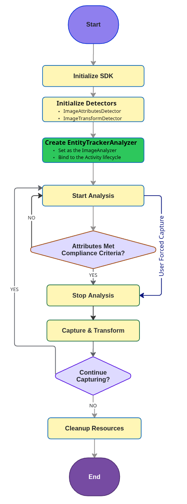
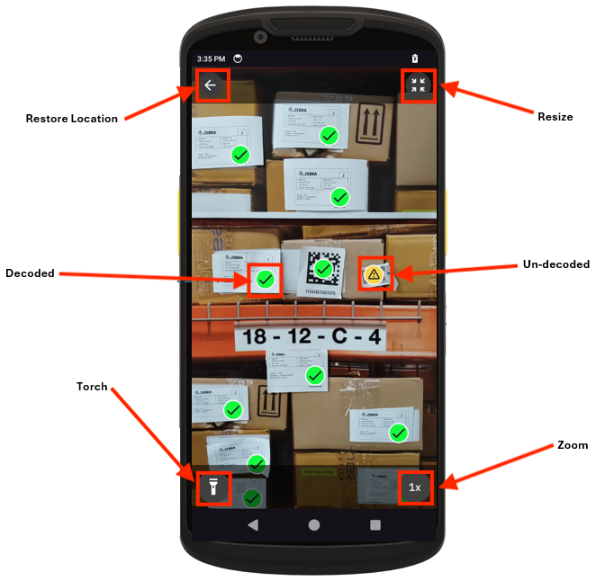
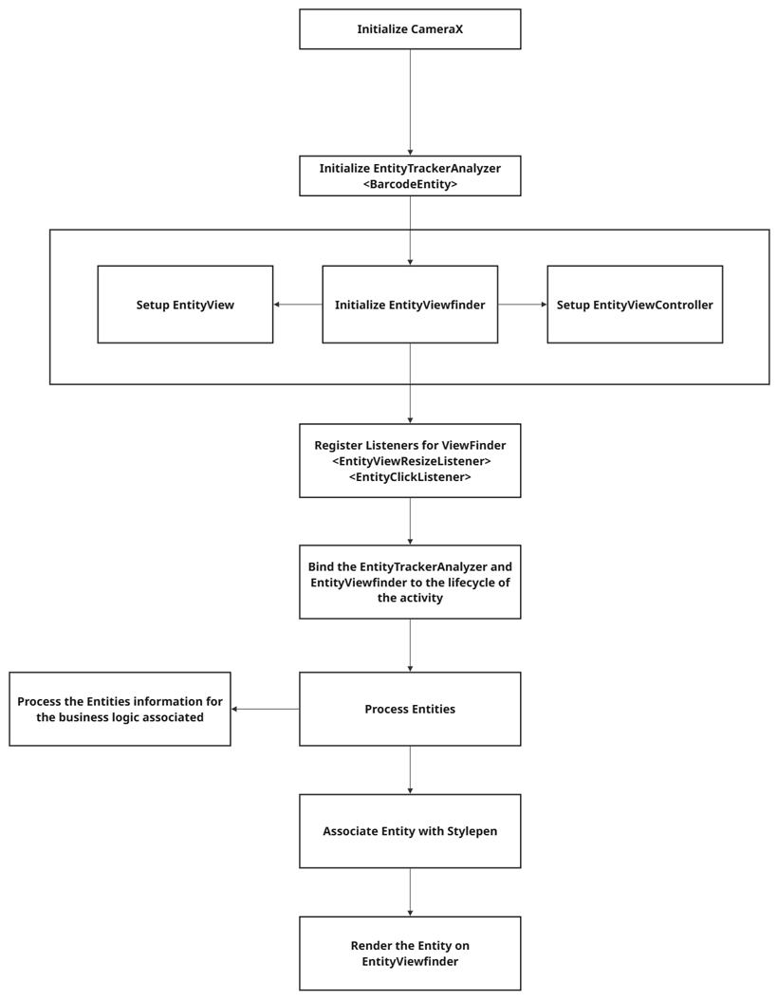

## Overview

[CameraX](https://developer.android.com/media/camera/camerax) is a Jetpack support library for Android that simplifies camera app development by providing a consistent, easy-to-use API across various Android devices. It offers backward compatibility, facilitates smoother camera operations, and integrates seamlessly with existing camera APIs. CameraX enhances the developer experience with features such as automatic lifecycle management and easy access to use cases such as preview, image capture, and image analysis.

AI Data Capture SDK supports integration with CameraX-based applications by providing:

- **EntityTrackerAnalyzer –** A CameraX `ImageAnalysis.Analyzer` that detects, decodes and tracks `Entities`.
- **Detectors for BarcodeDecoder, TextOCR, and ModuleRecognizer –** Developers can utilize these detectors to create custom Analyzers.
- **EntityViewfinder –** An integrated viewfinder designed to work alongside `EntityTrackerAnalyzer`.

For details on compatibility, refer to the [CameraX requirements](https://developer.android.com/media/camera/camerax/architecture#requirements).

---

## EntityTrackerAnalyzer

`EntityTrackerAnalyzer` implements the `ImageAnalysis.Analyzer` interface for real-time detection and tracking of [entities](../entity/). It integrates seamlessly with `CameraX`, processing image frames using a list of detectors to deliver aggregated entity tracking results.

The analyzer efficiently manages image buffers and executes detectors asynchronously, ensuring optimal performance. It also handles coordinate system transformations based on the coordinate system value passed to the constructor.

Supported Detectors:

- [BarcodeDecoder](../barcodedecoder/)
- [Text OCR](../textocr/)
- [ModuleRecognizer](../productrecognition/#modulerecognizer)
- [ImageAttributesDetector](../imageattributes/)

There are two primary ways for using the `EntityTrackerAnalyzer`, each designed for different use cases.

<table class="facelift" style="width:100%" border="1" padding="5px">
    <thead>
        <tr bgcolor="#dce8ef">
        <th>Implementation Path</th>
        <th>Use Cases</th>
        <th>Description</th>
        </tr>
    </thead>
    <tbody>
        <tr>
        <td><a href="#guidedppod">Guided Experience Workflow (PPOD)</a></td>
        <td>For the Picture Proof of Delivery (PPOD) workflow, it enables delivery drivers to quickly take a compliant, first-time picture of a parcel and its surroundings by ensuring the image is clear and excludes sensitive information like people or license plates.</td>
        <td>A comprehensive solution that guides an end-user to capture a high-quality, compliant image. It involves real-time attribute analysis followed by a post-capture transformation step.</td>
        </tr>
        <tr>
        <td><a href="#generalentitytracking">General Entity Tracking</a></td>
        <td>For applications where the main goal is live detection of entities. Examples:<ul><li><b>Real-Time Entity Tracking -</b> Use camera feeds to monitor items as they move through a warehouse or retail space.</li><li><b>Augmented Reality (AR) -</b> Overlay digital information or trigger events based on tracked objects.</li><li><b>Security & Surveillance -</b> Integrate into security systems that monitor and track entities in real-time.</ul></td>
        <td>A flexible approach for real-time detection and tracking of one or more entity types (e.g., barcodes, text, products) from a live camera feed.</td>
        </tr>
    </tbody>
</table>
<!-- 
**Use Cases:**
1. **Guided Picture Proof of Delivery (PPOD) -** Provides a guided experience for capturing high-quality Proof of Delivery images. It uses `EntityTrackerAnalyzer` to give end-users real-time feedback and ensure the package is correctly framed before the final image is taken.
    - **Live Capture Guidance -** Uses [ImageAttributesDetector](../imageattributes/), which analyzes the live camera feed to ensure the image is clear and a valid record of the delivery. It guides the user to capture an acceptable image and flags distractions like people or pets.
    - **Automated Privacy Protection -** Uses [ImageTransformDetector](../imagetransform/), which automatically applies post-capture transformations to protect sensitive data. This can include blurring faces, pets, barcodes, or specific label information before the image is saved or transmitted.
2. **Real-Time Entity Tracking -** Develop applications that require real-time entity tracking using camera feeds.
3. **Augmented Reality Experiences -** Leverage entity tracking for dynamic augmented reality (AR) experiences that respond to entity movements and interactions.
4. **Security and Surveillance Systems -** Integrate into security systems that monitor and track entities in real-time.
-->

For non-interactive image processing, see [Non-Guided PPOD](../ppod/#nonguidedppod).

**Notes:**

- **Detector Instance:** Only a single instance of each detector type should be passed in to the constructor.
- **Lifecycle handling -** Developers are responsible for managing the session throughout the Android application lifecycle since `EntityTrackerAnalyzer` does not handle this internally.
- **Threading -** The processing of image frames is efficiently managed using threads within the `EntityTrackerAnalyzer`.

---

### Guided PPOD

The Guided Picture Proof of Delivery (PPOD) workflow is built upon a sophisticated analysis pipeline that provides real-time user guidance and automated privacy protection to take a compliant picture the first time while avoiding capture of sensitive information (e.g. people, license plates, etc.).

#### Workflow

The Guided PPOD workflow integrates with the Android `CameraX` framework by leveraging the `EntityTrackerAnalyzer`, which implements the standard `ImageAnalysis.Analyzer` interface. The process requires initializing the SDK, followed by both the `ImageAttributesDetector` and the `ImageTransformDetector`.

Guided PPOD integrates three key components with the Android `CameraX` API:

<table class="facelift" style="width:100%" border="1" padding="5px">
    <thead>
        <tr bgcolor="#dce8ef">
        <th>Component</th>
        <th>Role in the Workflow</th>
        </tr>
    </thead>
    <tbody>
        <tr>
        <td><code>ImageAttributesDetector</code></td>
        <td><b>Real-time Analysis:</b> Analyzes the live camera preview for image quality and content compliance (e.g., is the package visible, are people present, is the image blurry).</td>
        </tr>
        <tr>
        <td><code>EntityTrackerAnalyzer</code></td>
        <td><b>Live Feedback Engine:</b> Hosts the <code>ImageAttributesDetector</code> and provides continuous, frame-by-frame results to the application, enabling live guidance for the user.</td>
        </tr>
        <tr>
        <td><code>ImageTransformDetector</code></td>
        <td><b>Post-Capture Redaction:</b> Used <i>after</i> the image is captured to automatically blur sensitive information like faces, barcodes, or text, ensuring privacy.</td>
        </tr>
    </tbody>
</table>

The `ImageAttributesDetector` is used to configure the `EntityTrackerAnalyzer`. This analyzer is assigned to an `ImageAnalysis` use case which is bound to the Activity's lifecycle, facilitating continuous processing of incoming streaming frames for image attributes compliance. Guided by this real-time feedback, the user can capture an image — either when criteria are met or by forcing the action. Upon capture, the analysis is stopped and the captured image is immediately processed by the `ImageTransformDetector` for redaction.

_Guided PPOD Workflow Diagram_

---

#### Developer Guide

This section provides a step-by-step guide for implementing an end-to-end Guided PPOD solution using the AI Data Capture SDK.

1.  **Initialize AI Data Capture SDK -** Before using any detector, the AI Data Capture SDK must be initialized. Use the application's context object and invoke `init()` from the AIVisionSDK class. This is typically done once in the application's lifecycle, for example, in an Activity's `onCreate()` method.

        AIVisionSDK.getInstance(getApplicationContext()).init();

2.  **Initialize Detectors -** Create `ImageAttributesDetector` and `ImageTransformDetector` objects with the desired configurations. Both detectors can be initialized in parallel as they are independent of each other. 
    **Important:** Both detectors initialize asynchronously and can be started in parallel. Ensure they are fully initialized before proceeding to the next steps.
    - **Initialize [ImageAttributesDetector](../imageattributes/) -** Configure specific image attribute metrics to track during real-time camera preview. In this example, enable detection for people visibility and package visibility. Implement proper error handling using the `exceptionally()` callback on `CompletableFuture` to handle initialization failures gracefully.

                // Initialize ImageAttributesDetector with specific image attribute metrics
                ImageAttributesDetector.Settings imageAttributeSettings = new ImageAttributesDetector.Settings();

                // Configure image attribute metrics
                imageAttributeSettings.configureImageAttributeMetrics(List.of(
                    new ImageAttributeMetricValue.Builder(ImageAttributeMetric.ImageTagPeopleVisible)
                        .setEnable(true)
                        .build(),
                    new ImageAttributeMetricValue.Builder(ImageAttributeMetric.ImageTagPackageVisible)
                        .setEnable(true)
                        .build()
                ));

                // Initialize ImageAttributesDetector object
                ImageAttributesDetector imageAttributesDetector = null;

                // Get ImageAttributesDetector
                CompletableFuture<ImageAttributesDetector> future =
                    ImageAttributesDetector.getImageAttributesDetector(imageAttributeSettings, imageAttribExecutor);

                // Use the future to implement the thenAccept() callback of CompletableFuture
                future.thenAccept(detector -> {
                    // Use the ImageAttributesDetector object returned here for detecting image attributes
                    imageAttributesDetector = detector;
                    Log.d(TAG, "ImageAttributesDetector initialized successfully");
                }).exceptionally(ex -> {
                    Log.e(TAG, "ImageAttributesDetector initialization failed", ex);
                    return null;
                });

      - **Initialize [ImageTransformDetector](../imagetransform) -** Configure the `ImageTransformDetector` with all available transformation actions. This detector will be used later to blur sensitive information in captured images.

              // Initialize ImageTransformDetector with all available transformation actions
              ImageTransformDetector.Settings transformSettings = new ImageTransformDetector.Settings();

              // Configure all transformation actions
              List<TransformationAction> actions = List.of(
                  TransformationAction.LocalizeAndBlurPeople,
                  TransformationAction.LocalizeAndBlurText,
                  TransformationAction.LocalizeAndBlurBarcode
              );

              TransformActionDescriptor descriptor = new TransformActionDescriptor.Builder()
                  .setActions(actions)
                  .build();

              transformSettings.configureTransformationActions(descriptor);

              // Initialize ImageTransformDetector object
              ImageTransformDetector imageTransformDetector = null;

              // Get ImageTransformDetector
              CompletableFuture<ImageTransformDetector> transformFuture =
                  ImageTransformDetector.getImageTransformDetector(transformSettings, imageTransformExecutor);

              // Use the transformFuture to implement the thenAccept() callback of CompletableFuture
              transformFuture.thenAccept(transformDetector -> {
                  // Use the ImageTransformDetector object returned here for transforming images
                  imageTransformDetector = transformDetector;
                  Log.i(TAG, "ImageTransformDetector initialized successfully");
              }).exceptionally(ex -> {
                  Log.e(TAG, "ImageTransformDetector initialization failed", ex);
                  return null;
              });

3.  **Create EntityTrackerAnalyzer:** Create an `EntityTrackerAnalyzer` with the `ImageAttributesDetector`. This analyzer processes camera frames in real-time and provides callbacks with attribute compliance results. The callback checks if all attribute results are compliant, at which point the user can proceed with image capture. This real-time compliance check allows guidance to users to position the camera correctly before capturing the image, ensuring optimal image quality and required content visibility.

        EntityTrackerAnalyzer entityTrackerAnalyzer = new EntityTrackerAnalyzer(
            List.of(imageAttributesDetector),
            ImageAnalysis.COORDINATE_SYSTEM_ORIGINAL,
            entityExecutor,
            results -> {
                // Check if all attribute results are compliant
                boolean allCompliant = results.getValue(imageAttributesDetector).stream()
                    .map(entity -> (ImageAttributeResult) entity)
                    .allMatch(ImageAttributeResult::isCompliant);

                if (allCompliant) {
                    Log.i(TAG, "All image attributes are compliant");
                    // Enable capture button or notify user
                }
            }
        );

4.  **Configure Camera and Bind Lifecycle -** Set the `EntityTrackerAnalyzer` to an `ImageAnalysis` use case in `CameraX` and bind it to the lifecycle. This enables real-time frame analysis using the configured detectors. The `EntityTrackerAnalyzer` is set as the image analyzer for the camera controller. This allows the camera to analyze each frame and return results through the callback configured in Step 3.
    **Alternative Approach:** Instead of using real-time analysis, the user can simply do an image capture regardless of the attribute compliance and run it through the ImageTransformDetector to
    transform the image and get its attributes.

            LifecycleCameraController cameraController = new LifecycleCameraController(this);
            cameraController.bindToLifecycle(this);

            // Create resolution selector
            ResolutionSelector resolutionSelector = new ResolutionSelector.Builder()
                .setAspectRatioStrategy(
                    new AspectRatioStrategy(
                        AspectRatio.RATIO_16_9,
                        AspectRatioStrategy.FALLBACK_RULE_NONE
                    )
                )
                .setResolutionStrategy(
                    new ResolutionStrategy(
                        new Size(1920, 1080),
                        ResolutionStrategy.FALLBACK_RULE_CLOSEST_HIGHER_THEN_LOWER
                    )
                )
                .build();

            // Configure camera controller
            cameraController.setImageAnalysisResolutionSelector(resolutionSelector);
            cameraController.setImageAnalysisBackpressureStrategy(ImageAnalysis.STRATEGY_KEEP_ONLY_LATEST);

            // Set the EntityTrackerAnalyzer as the image analyzer
            cameraController.setImageAnalysisAnalyzer(
                cameraExecutor,
                (ImageAnalysis.Analyzer) entityTrackerAnalyzer
            );

5.  **Capture and Transform Image -** The user can capture the image at any point. They can either wait until all attributes are compliant to trigger the capture, or they can trigger it at will, even if some attributes are non-compliant. Once the user captures the image, it is transformed using `ImageTransformDetector`. For the Guided PPOD use case, the `ImageAttributeResult` for the transformed image is also provided.

    The same `ImageAttributesDetector` instance can be used with the `ImageTransformDetector's` `process()` API overload with 3 arguments. However, the user must stop the `EntityTrackerAnalyzer` before doing the image capture and transformation, as it is using the same `ImageAttributesDetector` instance. The user can restart the analyzer once the capture results are available to continue the analysis and capturing process.

    **Important Threading Consideration:**
    When using the process API overload with 3 arguments (image, executor, AttributeDetector), ensure that the provided executor has enough threads to handle parallel processing of image transformation and attribute detection.A thread pool of 3 or more threads is required depending on the Transform Actions set by the user. If all three transformation actions are enabled, a pool of 4 threads is recommended to handle the 4 parallel actions (Attributes detection + 3 Transformation actions).

    **Result Handling APIs:**
    The user can use the following APIs from `ImageTransformResult`:

    <table class="facelift" style="width:70%" border="1" padding="5px">
    <thead>
        <tr bgcolor="#dce8ef">
        <th>API Method</th>
        <th>Description</th>
        </tr>
    </thead>
    <tbody>
        <tr>
        <td><code>isImageAttributeResultAvailable()</code></td>
        <td>Returns true if attribute results are available.</td>
        </tr>
        <tr>
        <td><code>getImageAttributeResults()</code></td>
        <td>Returns <code>List<ImageAttributeResult></code> on success and null on fail.</td>
        </tr>
        <tr>
        <td><code>getBitmapImage()</code></td>
        <td>Returns the transformed image as an Android Bitmap.</td>
        </tr>
    </tbody>
    </table>

    **Image Capture Implementation:**

        // Stop image analysis before capturing
        cameraController.clearImageAnalysisAnalyzer();

        // Take picture with in-memory callback
        cameraController.takePicture(
            ContextCompat.getMainExecutor(this),
            new ImageCapture.OnImageCapturedCallback() {
                @Override
                public void onCaptureSuccess(@NonNull androidx.camera.core.ImageProxy imageProxy) {
                    ImageData imgData = ImageData.fromImageProxy(image);
                    ExecutorService executor = Executors.newFixedThreadPool(4);
                    imageTransformDetector.process(imgData, executor, imageAttributesDetector).thenAccept(result -> {
                        Bitmap outputImage = result.getBitmapImage();
                        // Get the image attribute results for the transformed image
                        List<ImageAttributeResult> attributeResults = result.getImageAttributeResults();

                        // Check if all attributes are compliant for the transformed image
                        boolean allCompliant = attributeResults.stream()
                            .allMatch(ImageAttributeResult::isCompliant);

                        if (allCompliant) {
                            Log.i(TAG, "All image attributes are compliant for the transformed image");
                        }
                        executor.shutdown(); // Shutdown after successful completion
                    }).exceptionally(ex -> {
                        Log.e(TAG, "Error during image transformation with attributes: ", ex);
                        executor.shutdown(); // Ensure executor is shutdown on error
                        return null;
                    });
                }

                @Override
                public void onError(@NonNull ImageCaptureException exception) {
                    // Restart image analysis on error
                    restartImageAnalysis();
                }
            }
        );

6.  **Resource Cleanup:** After the Guided PPOD use case is complete, dispose of the detectors and shutdown executors to free up resources. This prevents memory leaks and ensures proper resource management. This method should be called in your Activity's `onDestroy()` or when the feature is no longer needed.
    **Important:** Always call `dispose()` on detector instances and `shutdown()` on executors when they are no longer needed. Failure to do so may result in resource leaks.

            protected void dispose() {
                imageAttribExecutor.shutdown();
                if (imageAttributesDetector != null) {
                    imageAttributesDetector.dispose();
                }
                imageTransformExecutor.shutdown();
                if (imageTransformDetector != null) {
                    imageTransformDetector.dispose();
                }
            }

---

### General Entity Tracking

This guide demonstrates how to set up a flexible, real-time tracking system for use cases like Augmented Reality (AR), security, or asset tracking. It provides a step-by-step guide to setting up a barcode detection system using the [Barcode Decoder](../barcodedecoder/), [Text OCR](../textocr/), [Product Recognition](../productrecognition/), and [EntityTrackerAnalyzer](#entitytrackeranalyzer).

1.  **Initialize AI Data Capture SDK -** Initialize the AI Data Capture SDK to enable Zebra-specific features in the application. This initialization should be performed in `MainActivity`. _Ensure this initialization step is completed <u>before</u> making any other calls to the AI Data Capture SDK._ If the initialization fails, it indicates a critical problem, and the application should not proceed further.

        try {
            aiVisionSDK = AIVisionSDK.getInstance(application)
            if (aiVisionSDK!!.init()) {
                // Initialize Barcode Decoder with default settings
                initializeBarcodeDecoder()

                // Initialize Text OCR with default settings
                initializeTextOCR()

                // Initialize Product Recognition with default settings
                initializeProductRecognition()
            }
            else {
                Log.e(TAG, "SDK initialization failed")
            }
        }
        catch (e: Exception) {
            Log.e(TAG, "SDK initialization exception: ${e.message}", e)
        }

2.  Select one or more the following options to initialize the detectors:
    - **Initialize Barcode Decoder -** Configure the barcode decoder settings and obtain an instance:

        <pre>
        try {
            val barcodeSettings = BarcodeDecoder.Settings("barcode-decoder")
            BarcodeDecoder.getBarcodeDecoder(barcodeSettings, Executor)
                .thenAccept { decoderInstance -> 
                    barcodeDecoder = decoderInstance
                }
                .exceptionally { ex ->
                    Log.e(TAG, "BarcodeDecoder initialization failed : ${ex.message}", ex)
                    null
                }
        } 
        catch (e: Exception) {
            e.printStackTrace()
        }
        </pre>

    - **Initialize Text OCR -** Configure the TextOCR settings and obtain an instance:

      try {
      val textOCRSettings = TextOCR.Settings("text-ocr-recognizer")

            // (Optional) Configure settings as needed, e.g. runtime processor order, dims, etc.
            TextOCR.getTextOCR(textOCRSettings, ocrExecutor)
                .thenAccept { ocrInstance ->
                    textOCR = ocrInstance
                    ocrAnalyzer = TextOCRAnalyzer(callback, ocrInstance)
                    }

                .exceptionally { ex ->
                    Log.e(TAG, "TextOCR initialization failed: ${ex.message}", ex)
                    null
                }

      }
      catch (e: Exception) {
      Log.e(TAG, "TextOCR initialization exception: ${e.message}", e)
      }

    - **Initialize Product Recognition -** Configure the product recognition settings and obtain an instance:

            try {
                val moduleRecognizerSettings = ModuleRecognizer.Settings("product-and-shelf-recognizer")

                ModuleRecognizer.getModuleRecognizer(moduleRecognizerSettings, productExecutor)
                    .thenAccept { recognizerInstance ->
                        moduleRecognizer = recognizerInstance
                        productRecognitionAnalyzer = ProductRecognitionAnalyzer(callback, recognizerInstance)
                    }

                    .exceptionally { ex ->
                        Log.e(TAG, "Product Recognition initialization failed: ${ex.message}", ex)
                        null
                    }

            } catch (e: Exception) {
                Log.e(TAG, "Product Recognition initialization exception: ${e.message}", e)
            }

3.  **Create `EntityTrackerAnalyzer` -** This is used for processing image frames.

        entityTrackerAnalyzer = EntityTrackerAnalyzer(listOf(barcodeDecoder), ImageAnalysis.COORDINATE_SYSTEM_VIEW_REFERENCED, entityExecutor)
        { result ->
            // User Logic
            result.getValue(barcodeDecoder)?.forEach {entity ->
                if (entity is BarcodeEntity) {
                    Log.d(TAG, "Detected barcode: ${entity.value} with id: ${entity.hashCode()} at ${entity.boundingBox}")
                }
            }
        }

        // Create EntityTrackerAnalyzer for TextOCR
        entityTrackerAnalyzer = EntityTrackerAnalyzer(listOf(textOCR), ImageAnalysis.COORDINATE_SYSTEM_VIEW_REFERENCED, entityExecutor) { result ->
            // User Logic
            result.getValue(textOCR)?.forEach { entity ->

            If(entity is ParagraphEntity ){
                    Log.d(TAG, "Detected text: ${entity.text} at ${entity.boundingBox}")
                }
            }
        }

        // Create EntityTrackerAnalyzer for Product Recognition
        entityTrackerAnalyzer = EntityTrackerAnalyzer(listOf(moduleRecognizer), ImageAnalysis.COORDINATE_SYSTEM_VIEW_REFERENCED, entityExecutor) { result ->
            result.getValue(moduleRecognizer)?.forEach { entity ->
                when (entity) {
                    is ShelfEntity -> {
                        val shelfBox = entity.boundingBox
                        val shelfConfidence = entity.accuracy
                        val shelfCorners = entity.corners
                        Log.d(TAG, "Detected shelf: box=$shelfBox, confidence=$shelfConfidence, corners=$shelfCorners")
                    }

                    is LabelEntity -> {
                        val labelBox = entity.boundingBox
                        val classId = entity.classId
                        val labelConfidence = entity.accuracy
                        val labelCorners = entity.corners

                        Log.d(TAG, "Detected label: box=$labelBox, classId=$classId, confidence=$labelConfidence, corners=$labelCorners")
                    }

                    is ProductEntity -> {
                        val productBox = entity.boundingBox
                        val topKSKUs = entity.topKSKUs
                        val accuracy = entity.accuracy
                        val productCorners = entity.corners
                        Log.d(TAG, "Detected product: box=$productBox, topKSKUs=$topKSKUs, accuracy=$accuracy, corners=$productCorners")
                    }
                }
            }
        }

4.  **Set `EntityTrackerAnalyzer` as the `ImageAnalysis.Analyzer`:**

        // EntityTrackerAnalyzer Usecase
        val resolutionSelector = ResolutionSelector.Builder()
            .setAspectRatioStrategy(
                AspectRatioStrategy(
                    AspectRatio.RATIO_16_9,
                    AspectRatioStrategy.FALLBACK_RULE_NONE
                )
            )
            .setResolutionStrategy(
                ResolutionStrategy(
                    Size(1920, 1080),
                    ResolutionStrategy.FALLBACK_RULE_CLOSEST_HIGHER_THEN_LOWER
                )
            )
            .build()

        // Image analysis use case
        imageAnalysis = ImageAnalysis.Builder()
            .setResolutionSelector(resolutionSelector)
            .setBackpressureStrategy(ImageAnalysis.STRATEGY_KEEP_ONLY_LATEST)
            .build()

        // Set the analyzer
        imageAnalysis?.setAnalyzer(
            cameraExecutor,
            entityTrackerAnalyzer as ImageAnalysis.Analyzer
        )

5.  **Configure the Camera Lifecycle -** Integrate CameraX with the activity’s lifecycle.

        val cameraProviderFuture = ProcessCameraProvider.getInstance(application)
        cameraProviderFuture.addListener({
            try {
                cameraProvider = cameraProviderFuture.get()
            }
            catch (e: Exception) {
                Log.e(TAG, "Camera initialization failed", e)
            }
        }, ContextCompat.getMainExecutor(application)).

        // Initialize Preview use case
        preview = Preview.Builder()
            .build()

        // Connect the preview to the PreviewView
        preview?.surfaceProvider = previewView.surfaceProvider;

        // Update EntityTrackerAnalyzer transform when PreviewView is ready
        previewView.previewStreamState.observe(lifecycleOwner) { streamState ->
            if (streamState == PreviewView.StreamState.STREAMING) {
                entityTrackerAnalyzer?.updateTransform(previewView.sensorToViewTransform)
            }
        }

        // Bind use cases to camera
        provider.bindToLifecycle(
            lifecycleOwner,
            CameraSelector.DEFAULT_BACK_CAMERA,
            preview,
            imageAnalysis
        )

6.  **Resource Cleanup After Usage -** Properly dispose of resources after use to prevent memory leaks and ensure that all resources are released after use:

    Barcode Decoder:

        fun dispose() {
            // Shutdown executor to release threads
            executor.shutdownNow()

            // Dispose the BarcodeDecoder instance
            barcodeDecoder?.dispose()
            barcodeDecoder = null
        }

    Text OCR:

        fun dispose() {
            // Shutdown executor to release threads
            ocrExecutor.shutdownNow()

            // Dispose the TextOCR instance
            textOCR?.dispose()
            textOCR = null
        }

    Product Recognition:

        fun dispose() {
            // Shutdown executor to release threads
            productExecutor.shutdownNow()

            // Dispose the ModuleRecognizer instance
            moduleRecognizer?.dispose()
            moduleRecognizer = null
        }

---

### Methods

#### Constructor: public EntityTrackerAnalyzer()

        public EntityTrackerAnalyzer(
                @NonNull List<Detector<? extends List<? extends Entity>>> detectors,
                int targetCoordinateSystem,
                @NonNull Executor executor,
                @NonNull Consumer<EntityTrackerAnalyzer.Result> consumer
        )

Constructs an `EntityTrackerAnalyzer` using specified entity detectors, target coordinate system, an executor, and an [Entity](../entity/) consumer. It initializes components for entity tracking, including a buffer manager and an entity tracker, using specified detectors. The analyzer configures entity processing and sets the coordinate system for analysis. The executor is used to execute the consumer.

Currently, only [BarcodeDecoder](../barcodedecoder/), [Text OCR](../textocr/), and [ModuleRecognizer](../productrecognition/#modulerecognizer) are supported as detectors in `EntityTrackerAnalyzer`. **Only one instance of each detector type is accepted.** Providing multiple detectors of the same type results in undefined behavior.

The `EntityTrackerAnalyzer` calculates the output bounding box coordinates based on the `targetCoordinateSystem` set by the user:

- `COORDINATE_SYSTEM_ORIGINAL` - Bounding boxes are delivered in the Analyzer's coordinate system.
- `COORDINATE_SYSTEM_SENSOR` (default) - Bounding boxes are delivered in the Sensor's coordinate system.
- `COORDINATE_SYSTEM_VIEW_REFERENCE` - Bounding boxes are delivered in the PreviewView coordinate system.

During transformations, the Analyzer manages image rotation. All transformations then take the image rotations from the `ImageInfo.getRotationDegrees().ImageAnalysis.Analyzer` interface.

<!--
**Parameters:**
- **Detectors -** A list of entity detectors to be utilized for detection and tracking.
- **TargetCoordinateSystem -** The coordinate system used for image analysis: `COORDINATE_SYSTEM_ORIGINAL`, `COORDINATE_SYSTEM_SENSOR` or `COORDINATE_SYSTEM_VIEW_REFERENCED`; see Android Developers [ImageAnalysis API reference](https://developer.android.com/reference/androidx/camera/core/ImageAnalysis).
- **executor -** The executor responsible for executing the consumer.
- **consumer -** A consumer function to handle the processing of detected entities.
-->

#### analyze(ImageProxy image)

        public void analyze(@NonNull ImageProxy image)

Analyzes the image with the Detectors. This method delivers the image to the detector. Typically, this method is called by ImageAnalysis when a new frame becomes available.

**Parameters:**

- **image -** An `ImageProxy` object representing the image to be analyzed.

#### getDefaultTargetResolution()

        public Size getDefaultTargetResolution()

Returns the default target resolution for image analysis in the `EntityTrackerAnalyzer`.

**Return Value:** A Size object representing the default resolution for target images.

#### getTargetCoordinateSystem

        public int getTargetCoordinateSystem()

Returns the current coordinate system used inside the Analyzer. This is passed to the analyzer when it is created via the constructor.

**Returns:** An integer representing the coordinate system type.

#### updateTransform(Matrix matrix)

        public final void updateTransform(@Nullable Matrix matrix)

Receive a transformation matrix, which converts coordinates from the camera sensor’s system to the target system which was passed as targetCoordinateSystem in the constructor.

**Parameters:**

- **matrix -** A Matrix object for transformation adjustments.

#### setCropRect(RectF cropRect)

        public void setCropRect(RectF cropRect)

Sets the crop rectangle. The crop rectangle specifies the region of the image that the analyzer process for entities.

**Parameters:**

- **cropRect -** A `RectF` object with crop rectangle.

<!--

### ImageAnalysis.Analyzer Interface

#### void analyze(ImageProxy image)

        public void analyze(@NonNull ImageProxy image)

Analyzes the image with the Detectors. This method forwards the image to the detectors. Typically, this method is called by ImageAnalysis when a new frame becomes available:

        void camerax.EntityTrackerAnalyzer.analyze(ImageProxy image)

**Parameters:**

- **image -** An `ImageProxy` object representing the image to be analyzed.

 

#### GetDefaultTargetResolution()

        public Size getDefaultTargetResolution()

Returns the default target resolution for image analysis in the `EntityTrackerAnalyzer`.

**Return Value:**
A Size object representing the default resolution for target images.

 

#### getTargetCoordinateSystem()

        public int getTargetCoordinateSystem()

Returns the current coordinate system used inside the Analyzer. This is passed to the analyzer when it is created via the constructor.

**Returns:**
An integer representing the coordinate system type.

 

#### final void updateTransform()

        final EntityTrackerAnalyzer.updateTransform()

This method should be implemented to receive a transformation matrix that converts coordinates from the camera sensor’s system to the target system defined in `getTargetCoordinateSystem()`. It is used for transforming detected coordinates, such as those of a detected face. If the matrix is `null`, it indicates no valid transformation is available. This can occur if the target system is set to `COORDINATE_SYSTEM_ORIGINAL` or if the target system is unavailable, such as when the viewfinder is not visible. The method is invoked whenever a new transformation is ready, for example, when the viewfinder is launched or resized.

**Returns:**
A `Matrix` object for transformation adjustments.

 

#### updateTransform()

        public final void updateTransform(@Nullable Matrix matrix)

Receives a transformation matrix that converts coordinates from the camera sensor’s system to the target system, which was passed as `targetCoordinateSystem` in the constructor.

**Parameters:**

- **matrix -** A `Matrix` object for transformation adjustments.

 

#### setCropRect(RectF cropRect)

        public void setCropRect(RectF cropRect)

Sets the crop rectangle, which specifies the region of the image that the analyzer process for entities. It should be specified in `COORDINATE_SYSTEM_SENSOR` from `ImageAnalysis`.

Parameters:

- **cropRect -** A `RectF` object with crop rectangle.
-->

---

### EntityTrackerAnalyzer.Result

        public static final class EntityTrackerAnalyzer.Result

The `Result` class is a static nested class within `EntityTrackerAnalyzer` that encapsulates the output of entity detection and tracking operations. It serves as a container for detected entities, error information, and timing metadata from the analysis process.

**Sample Code:**

<pre>
Result result = // obtained from EntityTrackerAnalyzer 
for (Detector detector : detectors) { 
    List<? extends Entity> entities = result.getValue(detector); 
    if (entities != null) { 
        // Process detected entities 
        for (Entity entity : entities) { 
            // Handle individual entity 
        } 
    } 
    
Throwable error = result.getThrowable(detector); 
    if (error != null) { 
        // Handle detection error 
    } 
} 
</pre>

**Error Handling:**

<pre>
Result result = // obtained from EntityTrackerAnalyzer 
if (result.getThrowable(barcodeDetector) != null) { 
    Log.e(TAG, "Barcode detection failed", result.getThrowable(barcodeDetector)); 
} 
</pre>

#### Methods

##### Constructor

        public Result(@NonNull Map<Detector<? extends List<? extends Entity>>, List<? extends Entity>> values, long timestamp, @NonNull Map<Detector<? extends List<? extends Entity>>, Throwable> throwables)

**Parameters:**

- **values -** Map of detectors to their detected entities.
- **timestamp -** Time when the result was generated.
- **throwables -** Map of detectors to any errors that occurred.

##### getValue(Detector&lt;? extends List&lt;? extends Entity&gt;&gt; detector)

        @Nullable
        public List<? extends Entity> getValue(@NonNull Detector<? extends List<? extends Entity>> detector)

Retrieves the list of entities detected by a specific detector

**Parameters:**

- **detector -** The detector for which the results are to be retrieved.

**Returns:**
List of detected entities if results are received, otherwise `null`.

##### getThrowable(Detector &lt;? extends List &lt;? extends Entity&gt;&gt; detector)

        @Nullable
        public Throwable getThrowable(@NonNull Detector<? extends List<? extends Entity>> detector)

Retrieves any exception that occurred for a specific detector.

**Parameters:**

- **detector -** The detector used to check for errors.

**Returns:**
The exception that occurred if any error occurred, otherwise `null` if there are no errors.

##### public long getTimestamp()

        public long getTimestamp()

Retrieves the timestamp when this result was created.

**Returns:**
The timestamp in milliseconds since the epoch.

##### public Result copy()

        @NonNull
        public Result copy()

Creates a shallow copy of the Result object

**Returns:**
A new `Result` instance with copied data.

- Sample Code for `Result` Iteration:

    <pre class="prettify">
    <code>
        Result result = /* obtained from EntityTrackerAnalyzer */
  
        for (Detector detector : detectors) { 
            List<? extends Entity> entities = result.getValue(detector); 
            if (entities != null) { 
                // Process detected entities 
                for (Entity entity : entities) { 
                    // Handle individual entity 
                } 
            } 
  
            Throwable error = result.getThrowable(detector); 
            if (error != null) { 
                // Handle detection error 
            } 
        } 
    </code>
    </pre>

---

## Detectors

The `BarcodeDecoder`, `TextOCR`, and `ModuleRecognizer` classes implement Zebra's AI Data Capture SDK's `Detector` interface, which defines the core contract for all detection modules in the AI Data Capture SDK. A detector processes image data and returns detection results asynchronously, enabling efficient and non-blocking image analysis for applications such as barcode scanning, object detection, and text recognition.

Type Parameters:

- `<T>`: The generic type parameter `<T>` represents the type of detection result returned by the detector implementation. The actual type varies based on the detector being used:
  - **Barcode Detection:** Processes `ImageData` and generates a `List<BarcodeEntity>` containing detected barcode entities.
  - **Text Recognition (OCR):** Processes `ImageData` and generates a `List<ParagraphEntity>` containing detected text paragraphs.
  - **Product Recognition:** Processes `ImageData` and generates a `List<Entity>` containing detected shelf, label, and product entities. If product recognition is enabled, each `ProductEntity` may include associated SKU predictions (`SKUInfo`).

<!--
Available detectors:
- [BarcodeDecoder](../barcodedecoder/) – Processes `ImageData` and generates a list of `BarcodeEntity` objects. It uses the [process()](../barcodedecoder/#processimagedataimagedataexecutorexecutor) method from **BarcodeDecoder:**

        process (ImageData imageData)

- [TextOCR](../textocr/) - Processes `ImageData` and generates a list of `ParagraphEntity` objects. It uses the [process()](../textocr/#processimagedataimagedataexecutorexecutor) method from TextOCR:

        process (ImageData imageData)
-->

### Methods

#### CompletableFuture&lt;T&gt; process(ImageData imageData)

        CompletableFuture<T> process(ImageData imageData)

Processes the provided image data and returns the detection results asynchronously. This method nalyzes the given image data according to the detector’s implementation and returns a `CompletableFuture` that completes with the detection results. Processing is performed asynchronously to avoid blocking the UI thread.

**Parameters:**

- **imageData:** The image data to be processed.

**Returns:**
A `CompletableFuture` that will complete with the detection results.

**Throws:**

- **AIVisionSDKException:** Thrown if the image data is invalid or if processing fails.

#### CompletableFuture&lt;T&gt; process(ImageData imageData, Executor executor)

        CompletableFuture<T> process(ImageData imageData, Executor executor)

Processes the provided image data and returns the detection results asynchronously in the specified executor thread. This method analyzes the given image data and returns a `CompletableFuture` that completes with the detection results. The result is delivered asynchronously using the provided executor, allowing control over the threading context.

**Parameters:**

- **imageData:** The image data to be processed.
- **executor:** The executor used to return the results of detector.

**Returns:**
A `CompletableFuture` that completes with the detection results.

**Throws:**

- **AIVisionSDKException:** If the image data is invalid or if processing fails.

---

### Developer Guide

Follow the steps below to build a custom CameraX Analyzer using the **BarcodeDecoder's Detector interface:**

#### Step 1: Create a Custom Analyzer

1. **Implement ImageAnalysis.Analyzer -** Implement the `ImageAnalysis.Analyzer` interface and override the `analyze()` method.

#### Step 2: Set Up Decoder and Localizer Settings

1. **Create BarcodeDecoder Settings:** Instantiate a `Settings` object for the BarcodeDecoder and enable the desired symbologies.
2. **Initialize BarcodeDecoder:** Obtain a BarcodeDecoder instance asynchronously using `CompletableFuture`.

#### Step 3: Process Frames

1. **Override analyze() -** CameraX continuously feeds frames to the Analyzers bound to it. Override the `analyzer()` interface for their specific functionalities.
2. **Convert ImageProxy to ImageData -** The `process()` interface requires `ImageData`. Use the `fromImageProxy()` method to convert from `ImageProxy`.
3. **Call process() -** Invoke the `process()` method on the `ImageData` object to initiate barcode detection.
4. **Success Handling -** Upon successful detection, `addOnSuccessListener` is activated, retrieving the barcode value and symbology type.
5. **Failure Handling -** If detection fails, `addOnFailureListener` logs the error and closes the image.
6. **Exception Handling -** Handle exceptions such as `InvalidInputException` and `AIVisionSDKException` by logging issues during processing and properly closing the image.

**Sample Code:**

        //import necessary packages

        public class CompositeAnalyzer implements ImageAnalysis.Analyzer {
            @Override
            public void analyze(@NonNull ImageProxy image) {
                try {
                    barcodeDecoder.process(ImageData.fromImageProxy(image)).addOnSuccessListener(result ->{

                        for(Entity<?> bb:result){
                            // Access bounding box and confidence
                            BoundingBox boundingBox = bb.getBoundingBox();
                            float confidence = bb.accuracy();

                            // Type cast Entity to BarcodeEntity for specific operations
                            BarcodeEntity barcodeEntity = (BarcodeEntity) bb;

                            // Access barcode-specific data
                            String barcodeValue = barcodeEntity.getValue();
                            String barcodeType = barcodeEntity.getSymbology();
                        }
                        image.close();
                    })

                    .addOnFailureListener(e ->{
                        image.close();
                    });
                }
                catch (Exception e) {
                    Log.e(TAG, "Analysis failed: " + e.getMessage());
                }
            }
        }

---

## EntityViewfinder

`EntityViewfinder` is a built-in viewfinder designed for seamless integration with CameraX as a preview component. It enhances the default PreviewView by offering advanced features, such as rendering and interacting with [Entities](../entity/), making it a suitable choice for developers seeking to deliver a high-performance, intuitive user experience.

This viewfinder is utilized in applications requiring a visual interface for camera operations and entity detection, such as augmented reality applications, barcode scanners, and image recognition systems. It offers user interaction capabilities with camera controls, including zoom levels, flash settings, and draggable viewfinder functionality.

_Sample EntityViewfinder Screen_

**Key Features:**

- **Entity Rendering -** The viewfinder is optimized to display Entities directly within the camera preview, eliminating the need for additional layers or complex integrations.
- **Simplified Styling -** Developers can leverage prebuilt StylePens, making it easy to associate visual styles with generated Entities.
- **Integrated Camera Controls -** The `EntityViewfinder` includes built-in camera controls such as zoom and flash, minimizing the need for manual implementation of these features.
- **Adjustable and Movable Viewfinder -** The `EntityViewfinder` can be expanded to full-screen mode and reverted to its original dimensions using onscreen buttons. Additionlly, users can reposition the viewfinder by dragging it anywhere within the screen boundaries.

The EntityViewfinder mainly consists of three parts:

- **[EntityView](#entityview) -** A visual interface that allows for customization of the viewfinder’s appearance and behavior.
- **[EntityViewController](#entityviewcontroller) -** A functional interface that manages and implements the operational features of the viewfinder.
- **[StylePen](#stylepen) -** A visual representation of the entities of the `EntityViewfinder`.

---

### Developer Guide

This guide illustrates the integration and configuration of `EntityViewfinder` with a camera system using CameraX in an Android application. It covers setting up a viewfinder for camera preview and rendering entities with customizable styles. The guide also demonstrates how to manage user interactions and dynamically update the viewfinder with detected entities.

1.  **Integrate EntityView in XML Layout -** Define `EntityView` in your XML layout file, specifying attributes to configure its initial behavior and appearance.

        //  Integrate EntityView in XML Layout
        <com.zebra.ai.vision.viewfinder.EntityView
            android:id="@+id/entity_view"
            android:layout_width="match_parent"
            android:layout_height="match_parent"
            app:zoom="x2"
            app:draggable="false" />

2.  **Initialize EntityView and EntityViewController -** Use `findViewById()` to obtain a reference to the `EntityView`, and instantiate an `EntityViewController` with this `EntityView` instance and the current context as a lifecycleOwner. The controller manages the viewfinder’s operations and interactions.
3.  **Setup Camera -** Use `ProcessCameraProvider` to manage the camera lifecycle and `CameraSelector` to select the back-facing camera.
4.  **Create a Preview Case -** Create a `Preview` use case and set its surface provider using the `EntityViewController`.
5.  **Set Up Image Analysis -** Define an `ImageAnalysis` use case to analyze the camera feed. Set the resolution and necessary configuration and assign an `EntityTrackerAnalyzer` to process the images.
6.  **Bind Camera to Lifecycle -** Unbind any previous use cases before binding the camera to the lifecycle with the configured preview and image analysis use cases. Set the camera controller in the `EntityViewController`.
7.  **Register Event Listeners -** Register listeners to handle user interactions, such as entity click events, and to manage dynanmic layout changes, like viewfinder resize events. The resize listener allows users to establish field of view and entity coordinates between the preview and analyzer.  

    Sample code for steps 2 to 6:

        // Initialize EntityView
        EntityView entityView = findViewById(R.id.entity_view);

        // Initialize the EntityViewController
        EntityViewController entityViewController = new EntityViewController(entityView, this);

        // Setup Camera
        ProcessCameraProvider cameraProvider = ProcessCameraProvider.getInstance(this).get();
        CameraSelector cameraSelector = new CameraSelector.Builder()
            .requireLensFacing(CameraSelector.LENS_FACING_BACK)
            .build();

        // Setup a Preview usecase
        Preview preview = new Preview.Builder().build();

        // Set SurfaceProvider to preview usecase by retrieving it from the entityViewController
        preview.setSurfaceProvider(entityViewController.getSurfaceProvider());

        // Set up image analysis use case
        ImageAnalysis imageAnalysis = new ImageAnalysis.Builder().setBackpressureStrategy(ImageAnalysis.STRATEGY_KEEP_ONLY_LATEST).build();
        imageAnalysis.setAnalyzer(cameraExecutor, entityTrackerAnalyzer);

        // Unbind previous use cases before rebinding
        cameraProvider.unbindAll();

        // Bind camera to lifecycle and get session camera instance
        camera = cameraProvider.bindToLifecycle(this, cameraSelector, preview, imageAnalysis);

        // Configure entity view controller with camera
        entityViewController.setCameraController(camera);

        // Register listener for entity click events
        entityViewController.registerEntityClickListener(entity -> {
            // Handle entity click events
        });

        // Register Listener for Viewfinder Resize Events
        entityViewController.registerViewfinderResizeListener(specs -> {
            // Handle viewfinder size changes
        });

8.  **Initialize StylePens for Entity Visualization -** Create various `StylePen` instances for visualizing different entities as required. Configure these pens with desired styles, such as stroke width and icon type.

        // Initialize various style pens as per the use case

        private void initializeStylePens() {
            StylePen qrCodeBoundingBoxPen = BoundingBoxDrawPen.builder()
                .setStroke(8f, Color.BLUE)
                .build();

            StylePen upcaIconPen = IconDrawPen.builder()
                .setIconStyle(IconStyle.SUCCESSFUL_DECODE)
                .setClickable(true)
                .build();
        }

9.  **Apply StylePens and Render Entities -** In the analyzer results consumer method, clear previous entities and retrieve detected entities. Apply the appropriate `StylePen` to each entity based on your application use case and add them to the `EntityViewController`. Finally, render all entities on the viewfinder at once for optimized performance.

<pre>
    <code>
    // Analyzer results consumer method
    private void handleEntities(EntityTrackerAnalyzer.Result result) { 

        // Clear previous entities 
        entityViewController.removeAll(); 

        // Get detected entities 
        List&lt;? extends Entity&gt; entities = result.getValue(barcodeDecoder); 

        if (entities != null) { 
            Log.i(TAG, "Handle entities: " + entities.size()); 
            // Process each entity 
            for (Entity entity : entities) { 
                if (!(entity instanceof BarcodeEntity)) { 
                    continue; 
                } 

                BarcodeEntity barcodeEntity = (BarcodeEntity) entity;       

                int symbology = barcodeEntity.getSymbology(); 

                // QR Code symbology 
                if (isQRCodeSymbology(symbology)) { 
                    // Associate style pen initialized for QR codes 
                    entityViewController.add(barcodeEntity, qrCodeBoundingBoxPen); 
                } 

                // UPCA symbology 
                if (isUPCASymbology(symbology)) { 
                    // Associate style pen initialized for UPCA barcodes 
                    entityViewController.add(barcodeEntity, upcaIconPen); 
                }             
            } 
        } 

        // Render all entities at once 
        entityViewController.render(); 
    } 
    </code>
</pre>

_Workflow for integrating EntityViewfinder with EntityTrackerAnalyzer_

---

### EntityView

The `EntityView` is a custom view designed to render the visual interface of a viewfinder. It is the UI representation of the `EntityViewfinder`, displaying the camera preview along with interactive controls. It includes camera controls such as zoom and flash, as well as viewfinder-related features like a full-screen toggle button and a reset position button, providing essential functionality for managing the viewfinder and camera operations.

This view is meant to be integrated into your XML layout file to define the display area for the viewfinder interface. The `EntityView` should be used in conjunction with the `EntityViewController` to ensure proper operational management and seamless integration within your application.

Currently the programmatic instantiation of the viewfinder is not supported. It is recommended to integrate it in the application using XML-based UI layouts.

#### Configurations

##### Zoom Level

The **zoom** attribute sets the default zoom level for the viewfinder. It supports the following enum values:

<table class="facelift" style="width:50%" border="1" padding="5px">
  <thead>
    <tr bgcolor="#dce8ef">
      <th>Attribute</th>
      <th>Description</th>
    </tr>
  </thead>
  <tbody>
    <tr>
      <td><code>zoom="x1"</code></td>
      <td>Sets the zoom level to 1x (default level).</td>
    </tr>
    <tr>
      <td><code>zoom="x2"</code></td>
      <td>Sets the zoom level to 2x.</td>
    </tr>
    <tr>
      <td><code>zoom="x4"</code></td>
      <td>Sets the zoom level to 4x.</td>
    </tr>
    <tr>
      <td><code>zoom="x8"</code></td>
      <td>Sets the zoom level to 8x.</td>
    </tr>
  </tbody>
</table>

##### Flash State

The **flash** attribute specifies whether the flash is enabled or disabled by default.

<table class="facelift" style="width:50%" border="1" padding="5px">
  <thead>
    <tr bgcolor="#dce8ef">
      <th>Attribute</th>
      <th>Description</th>
    </tr>
  </thead>
  <tbody>
    <tr>
      <td><code>flash="true"</code></td>
      <td>Flash is enabled.</td>
    </tr>
    <tr>
      <td><code>flash="false"</code></td>
      <td>Flash is disabled (default).</td>
    </tr>
  </tbody>
</table>

##### Visibility of Buttons

These attributes allows controls the visibility of specific UI buttons on the viewfinder.

<table class="facelift" style="width:80%" border="1" padding="5px">
  <thead>
    <tr bgcolor="#dce8ef">
      <th>Attribute</th>
      <th>Description</th>
      <th>Value</th>
      <th>Default</th>
    </tr>
  </thead>
  <tbody>
    <tr>
      <td><code>hide_reset_position_button</code></td>
      <td>Shows or hides the reset position button.</td>
      <td><code>true</code> or <code>false</code></td>
      <td><code>false</code></td>
    </tr>
    <tr>
      <td><code>hide_flash_button</code></td>
      <td>Shows or hides the flash button.</td>
      <td><code>true</code> or <code>false</code></td>
      <td><code>false</code></td>
    </tr>
    <tr>
      <td><code>hide_zoom_button</code></td>
      <td>Shows or hides the zoom button.</td>
      <td><code>true</code> or <code>false</code></td>
      <td><code>false</code></td>
    </tr>
    <tr>
      <td><code>hide_resize_button</code></td>
      <td>Shows or hides the resize button.</td>
      <td><code>true</code> or <code>false</code></td>
      <td><code>false</code></td>
    </tr>
  </tbody>
</table>

##### Draggable Viewfinder

The **draggable** attribute determines whether the viewfinder can be dragged or repositioned by the user.

<table class="facelift" style="width:80%" border="1" padding="5px">
  <thead>
    <tr bgcolor="#dce8ef">
      <th>Attribute</th>
      <th>Description</th>
    </tr>
  </thead>
  <tbody>
    <tr>
      <td><code>draggable="true"</code></td>
      <td>Enables dragging functionality.</td>
    </tr>
    <tr>
      <td><code>draggable="false"</code></td>
      <td>Disables dragging functionality (default).  <strong>Note:</strong> This automatically hides the reset position button and resize button by default.</td>
    </tr>
  </tbody>
</table>

##### Viewfinder Size

The Viewfinder is designed to integrate seamlessly into Android applications, delivering consistent and reliable performance across supported devices. This widget adheres to specific minimum size constraints to ensure optimal functionality and display fidelity. Developers can integrate the Viewfinder into their layouts using standard Android XML attributes.

**Examples:**

- Match Parent:

        <com.zebra.ai.vision.viewfinder.EntityView
            android:id="@+id/entity_view"
            android:layout_width="match_parent"
            android:layout_height="match_parent" />

- Using Constraint Percentage (%):

        <com.zebra.ai.vision.viewfinder.EntityView
            android:id="@+id/entity_view"
            app:layout_constraintWidth_percent="1.0"
            app:layout_constraintHeight_percent="0.5"
            app:layout_constraintStart_toStartOf="parent"
            app:layout_constraintEnd_toEndOf="parent"
            app:layout_constraintTop_toBottomOf="@id/otherWidget" />

- Fixed Dimensions:

        <com.zebra.ai.vision.viewfinder.EntityView
            android:id="@+id/entity_view"
            android:layout_width="600dp"
            android:layout_height="400dp" />

  - **Note:** The Viewfinder cannot be resized smaller than the specified dimensions due to enforced minimum size constraints based on the device model. If the layout specifies a size below the minimum, the Viewfinder automatically defaults to its minimum size.

<table class="facelift" style="width:80%" border="1" padding="5px">
  <thead>
    <tr bgcolor="#dce8ef">
      <th>Device Model</th>
      <th>Minimum Viewfinder Size (Width x Height in Pixels)</th>
    </tr>
  </thead>
  <tbody>
    <tr>
      <td>EM45</td>
      <td>1052 x 542</td>
    </tr>
    <tr>
      <td>TC53/TC58, TC73/TC78, TC22/TC27, HC50</td>
      <td>1076 x 554</td>
    </tr>
    <tr>
      <td>ET6X, L10ax, ET5X 10-inch, ET4X 10-inch</td>
      <td>600 x 309</td>
    </tr>
  </tbody>
</table>

<!--

#### Methods

##### EntityView(Context context)

        EntityView(Context context) throws AIVisionSDKException

Constructor that creates a new EntityView with the given context.

**Parameters:**

- **context -** The activity context.

**Exceptions:**

- **AIVisionSDKException -** Thrown if the context is null.

##### EntityView(Context context, AttributeSet attrs)

        EntityView(Context context, AttributeSet attrs) throws AIVisionSDKException

Constructor that initializes the view with XML attributes.

**Parameters:**

- **context -** The activity context. 
- **attrs -** The XML attributes for configuration.

**Exceptions:**

- **AIVisionSDKException -** Thrown if the context is null.

##### EntityView(Context context, AttributeSet attrs, int defStyleAttr)

        EntityView(Context context, AttributeSet attrs, int defStyleAttr)

Constructor that initializes the view with XML attributes and a default style.

**Parameters:**

- **context -** The activity context. 
- **attrs -** The XML attributes for configuration.
- **defStyleAttr -** Default style attribute.

##### EntityView(Context context, AttributeSet attrs, int defStyleAttr, int defStyleRes)

        EntityView(Context context, AttributeSet attrs, int defStyleAttr, int defStyleRes)

Constructor that initializes the view with XML attributes, default style, and default resources.

**Parameters:**

- **context -** The activity context.
- **attrs -** The XML attribute set for configuration.
- **defStyleAttr -** The default style attribute.

##### EntityView(Context context, AttributeSet attrs, int defStyleAttr, int defStyleRes)

        EntityView(Context context, AttributeSet attrs, int defStyleAttr, int defStyleRes)

Constructor that initializes the view with XML attributes, a default style, and default resources.

**Parameters:**

- **context -** The activity context.
- **attrs -** The XML attribute set for configuration.
- **defStyleAttr -** The default style attribute.
- **defStyleRes -** The default style resource.

##### IViewfinderController getViewfinderController()

        IViewfinderController getViewfinderController()

Returns the viewfinder controller instance.

**Return Value:** Returns either an instance of `IViewfinderController` or `null` if the view is not properly initialized.

NOTE: This API is not intended for developer use.
--->

---

### EntityViewController

`EntityViewController` is a key component of the `EntityViewfinder`, providing a high-level interface for managing the camera preview, rendering detected entities, handling user interactions, and controlling viewfinder behavior.

#### Methods

##### EntityViewController(EntityView entityView, LifecycleOwner lifecycleOwner)

        EntityViewController(EntityView entityView, LifecycleOwner lifecycleOwner)

Constructor: Creates and initializes a new `EntityViewController`.

**Parameters:**

- **entityView -** The `EntityView` container for the viewfinder.
- **lifecycleOwner -** The `LifecycleOwner` responsible for automatic resource management.

**Exceptions:**

- **InvalidInputException -** Thrown if `entityView` or `lifecycleOwner` is null.
- **AIVisionSDKException -** Thrown if internal initialization fails.

##### setCameraController(Camera sessionCamera)

        void setCameraController(Camera sessionCamera)

Associates a `Camera` instance with the viewfinder after successfully invoking the `bindToLifecycle` API. This method ensures proper configuration of the viewfinder to display preview frames and enables effective use of camera controls. It is intended for CameraProvider-based CameraX applications.

**Parameters:**

- **sessionCamera -** The Camera instance.

**Exceptions:**

- **InvalidInputException -** Thrown if input session camera is null.
- **AIVisionSDKException -** Thrown if the camera cannot be set.

##### show()

        void show()

Makes the viewfinder visible.

**Exceptions:**

- **AIVisionSDKException -** Thrown if the viewfinder cannot be shown.

##### hide()

        void hide()

Hides the viewfinder from the display while maintaining its internal state. The camera stream continues running even if the viewfinder is hidden.

**Exceptions:**

- **AIVisionSDKException -** Thrown if the viewfinder cannot be hidden.

##### getSurfaceProvider()

        public Preview.SurfaceProvider getSurfaceProvider()

Provides the `SurfaceProvider` required for integrating the CameraX Preview use case.

**Return Value:** Returns a `Preview.SurfaceProvider` for camera preview integration.

**Exceptions:**

- **AIVisionSDKException -** Thrown if the surface provider cannot be retrieved.

##### getWidth()

        int getWidth()

Retrieves the current width of the viewfinder display area.

**Return Value:** Returns the current width of the viewfinder in pixels.

**Exceptions:**

- **AIVisionSDKException -** Thrown if the width cannot be retrieved.

##### getHeight()

        int getHeight()

Retrieves the current height of the viewfinder display area.

**Return Value:** Returns the current height of the viewfinder in pixels.

**Exceptions:**

- **AIVisionSDKException -** Thrown if the height cannot be retrieved.

##### getSensorToViewTransform()

        public Matrix getSensorToViewTransform()

Retrieves the transformation matrix used to map sensor coordinates to view coordinates.

**Return Value:** Returns a `Matrix` object representing the transformation from sensor coordinates to view coordinates.

**Exceptions:**

- **AIVisionSDKException-** Thrown if the transformation cannot be retrieved.

##### add(Entity entity, StylePen stylePen)

        void add(Entity entity, StylePen stylePen)

Adds an entity to be rendered on the viewfinder.

**Parameters:**

- **entity -** The `Entity` to add.
- **stylePen -** The `StylePen` used for rendering the entity.

**Exceptions:**

- **InvalidInputException -** Thrown if entity or stylePen is null.
- **AIVisionSDKException -** Thrown if adding the entity fails.

##### remove(Entity entity)

        void remove(Entity entity)

Removes a specific entity from the viewfinder.

**Parameters:**

- **entity -** The `Entity` to remove.

**Exceptions:**

- **InvalidInputException -** Thrown if the Entity is null.
- **AIVisionSDKException -** Thrown if removing the entity fails.

##### removeAll()

        void removeAll()

Removes all entities from the viewfinder.

**Exceptions:**

- **AIVisionSDKException -** Thrown if removing all entities fails.

##### render()

        void render()

Renders all added entities onto the viewfinder.

**Exceptions:**

- **AIVisionSDKException -** Thrown if rendering fails.

##### registerEntityClickListener(EntityClickListener entityClickListener)

        void registerEntityClickListener(EntityClickListener entityClickListener)

Registers a listener to handle entity click events.

**Parameters:**

- **entityClickListener -** The listener to register for entity click events.

**Exceptions:**

- **AIVisionSDKException -** Thrown if the click listener registration fails.

##### registerViewfinderResizeListener(EntityViewResizeListener listener)

        void registerViewfinderResizeListener(EntityViewResizeListener listener)

Registers a listener to handle viewfinder resize events.

Parameters:

- **listener -** The listener to register for resize events.

**Exceptions:**

- **AIVisionSDKException -** Thrown if the listener registration fails.

---

#### Listeners

##### EntityClickListener

The `EntityClickListener` interface offers a callback mechanism for handling user interactions with entities rendered in a viewfinder. By implementing this interface, developers can define custom behaviors that are triggered when an entity is clicked, enabling applications to respond effectively to user inputs.

Implementation:

1.  **Implement the EntityClickListener Interface -** Define an instance of `EntityClickListener` by implementing its `onEntityClicked()` method. This method is invoked whenever a user clicks on an entity, allowing specific actions or logic to be defined in response to the click event.

        EntityClickListener entityClickListener = new EntityClickListener() {
            @Override
            public void onEntityClicked(Entity entity) {
                // Define actions to perform on the clicked entity
            }
        };

2.  **Register the listener -** When a user clicks on an entity rendered by the viewfinder, the `onEntityClicked(Entity entity)` method is called with the associated entityRegister, the listener with the `EntityViewController`.  Use the `registerEntityClickListener()` method from `EntityViewController` to register the `EntityClickListener` instance. This connects the listener to the viewfinder, enabling it to receive click event notifications for entities displayed within the viewfinder.

        entityViewController.registerEntityClickListener( entityClickListener);

###### registerEntityClickListener(EntityClickListener listener):

        void registerEntityClickListener(EntityClickListener listener):

This method takes the listener as a parameter and ensures that it will be notified of any click events on entities within the viewfinder.

**Parameters:**

- **listener -** The EntityClickListener instance to register.

###### onEntityClicked(Entity entity)

        void onEntityClicked(Entity entity)

Callback method invoked when a user clicks on an entity.

**Parameters:**

- **entity -** The `Entity` that was clicked.

---

##### EntityViewResizeListener

The `EntityViewResizeListener` interface provides a callback mechanism to manage changes in the size and transformations of the viewfinder. It plays a crucial role in maintaining synchronization between the camera’s sensor coordinates and display coordinates, ensuring that detected entities are accurately positioned and rendered. By implementing this listener, developers can dynamically adapt their applications to changes in the viewfinder’s dimensions, ensuring proper layout adjustments and entity synchronization.

Implementing the EntityViewResizeListener Interface:

1.  **Implement the EntityViewResizeListener Interface -** Define an instance of `EntityViewResizeListener` by implementing its `onViewfinderResized()` method. This method is called whenever the viewfinder undergoes a resize or transformation, allowing to define specific actions or adjustments that should be made in response.

        EntityViewResizeListener resizeListener = new EntityViewResizeListener() {
            @Override
            public void onViewfinderResized(EntityViewResizeSpecs specs) {
                // Handle changes in viewfinder size or transformation
                // This is where you can update layouts, adjust UI elements, or synchronize entities
            }
        };

2.  **Register the Listener with the EntityViewController -** Use the `registerViewfinderResizeListener()` method from `EntityViewController` to register the `EntityViewResizeListener` instance. This connects the listener to the viewfinder, enabling it to receive notifications of any resize events.

        // Register the listener with the EntityViewController
        entityViewController.registerViewfinderResizeListener(resizeListener);

###### onViewfinderResized(EntityViewResizeSpecs specs)

        void onViewfinderResized(EntityViewResizeSpecs specs)

This method is invoked whenever there are changes in the viewfinder’s dimensions or transformations. It can be used to adjust layouts, update UI elements, or synchronize entities to match the new viewfinder size or transformation. It provides the necessary information to maintain synchronization between the camera’s detection systems and the Viewfinder.

**Parameters:**

- **specs -** An `EntityViewResizeSpecs` object that contains comprehensive details of the new state and transformations of the viewfinder.

###### registerViewfinderResizeListener(EntityViewResizeListener listener)

        void registerViewfinderResizeListener(EntityViewResizeListener listener)

This method takes the listener as a parameter and ensures that it will be notified of any changes in the viewfinder’s dimensions or transformations.

**Parameters:**

- **listener -** An `EntityViewResizeListener` object that contains the listener.

---

##### EntityViewResizeSpecs

The `EntityViewResizeSpecs` class is an immutable data container that provides detailed specifications for viewfinder resize events, including the viewfinder’s dimensions, a transformation matrix from sensor to view coordinates, and the calculated field-of-view (FOV) crop region in sensor space.

`EntityViewResizeSpecs` is primarily used in conjunction with the `EntityTrackerAnalyzer` to maintain accurate coordinate synchronization when the viewfinder undergoes size or transformation changes. It provides essential data to update entity detection systems, ensuring that the field of view and entity positioning remain consistent with the viewfinder’s current state.

Methods for `EntityViewResizeSpecs` are provided below.

###### getHeight()

        int getHeight()

**Return Value:** Returns the height of the viewfinder in pixels.

###### getWidth()

        int getWidth()

**Return Value:** Returns the width of the viewfinder in pixels.

###### getSensorToViewMatrix()

        Matrix getSensorToViewMatrix()

Returns a copy of the sensor-to-view coordinate transformation matrix.

**Return Value:**
A Matrix representing the transformation from sensor to view coordinates.

###### getViewfinderFOVCropRegion()

        RectF getViewfinderFOVCropRegion()

Calculates and returns the viewfinder’s field-of-view crop region in sensor coordinates.

**Return Value:** A `RectF` representing the viewfinder FOV in sensor coordinate space, or `null` if the calculation fails.

---

### StylePen

`StylePen` is an interface that visually represents entities on the `EntityViewfinder`. It provides predefined styling options that allow developers to customize the appearance of entities.

The following built-in StylePen’s are supported:

- [BoundingBoxDrawPen](#boundingboxdrawpen)
- [IconDrawPen](#icondrawpen)

The methods and properties available for each are provided in the subsections below.

#### Developer Guide

Follow these steps utilize a StylePen:

1. **Create and customize a StylePen -** These pens allow for customization of stroke, fill, icon styles, and other visual attributes. Create a `BoundingBoxDrawPen` or `IconDrawPen` based on your use case.
2. **Associate Entities with the StylePen -** Use the configured `BoundingBoxDrawPen` or `IconDrawPen` to add multiple entities to the controller. This applies the defined style to each entity.
3. **Render Entities -** Call the `render()` method on the controller to draw all the entities on the viewfinder. This method processes the added entities and applies the styles, displaying them with the configured visual attributes.

Sample Code:

        //Create Stylepens
        StylePen boundingBoxPen = BoundingBoxDrawPen.builder()
            .setStroke(3f, Color.RED)
            .setFill(Color.YELLOW)
            .setClickable(true)
            .build();

        IconDrawPen iconPen = IconDrawPen.builder()
            .setIconStyle(IconStyle.ACTION)
            .setclickable(true)
            .setIconSizes(50, 100)
            .build();

        // Associate the stylepens with Entities
        entityViewController.add(detectedEntity1, boundingBoxPen);
        entityViewController.add(detectedEntity2, iconPen);
        entityViewController.add(detectedEntity3, iconPen);

        // Render Entities
        entityViewController.render();

---

#### BoundingBoxDrawPen

The `BoundingBoxDrawPen` class enables the drawing of bounding boxes around detected entities on a viewfinder, implementing the `StylePen` interface. It allows the customization of the bounding box appearance through a builder pattern, offering features such as adjustable stroke width and color, fill options, and clickability.

`BoundingBoxDrawPen` methods and properties are provided in the following subsections.

##### Builder builder()

        Builder builder()

Creates a new `Builder` instance for constructing a `BoundingBoxDrawPen`.

**Return Value:** A new `Builder` instance.

**Exceptions:**

- **AIVisionSDKException -** Thrown if the `BoundingBoxDrawPen` cannot be created.

##### setStroke(float width, @ColorInt int color)

        setStroke(float width, @ColorInt int color)

Sets the stroke width and color for the bounding box.

**Parameters:**

- **width -** The stroke width.
- **color -** The stroke color.

**Return Value:** The `Builder` instance.

**Exceptions:**

- **IllegalArgumentException -** Thrown if the width is less than or equal to 0.

##### setFill(@ColorInt int color)

        setFill(@ColorInt int color)

Sets the fill color for the bounding box.

**Parameters:**

- **color -** The fill color.

**Return Value:** The `Builder` instance.

##### setClickable(boolean clickable)

        setClickable(boolean clickable)

Sets whether the bounding box is clickable.

**Parameters:** 

- **clickable -** Set to `true` if clickable, otherwise set to `false`.

**Return Value:** The `Builder` instance.

##### StylePen build()

        StylePen build()

Builds and returns a `BoundingBoxDrawPen` instance.

**Exceptions:**

- **AIVisionSDKException -** Thrown if the BoundingBoxDrawPen cannot be created due to internal errors.

**Return Value:** A `BoundingBoxDrawPen` instance.

---

#### IconDrawPen

The `IconDrawPen` class offers the ability to draw built-in icons on a viewfinder for the detected entities, implementing the `StylePen` interface. It uses a builder pattern to create instances with predefined icon styles, supporting configuration options such as icon size constraints and clickability.

`IconDrawPen` methods and properties are provided in the following subsections.

---

##### Builder builder()

        Builder builder()

Creates a new `Builder` instance for constructing an `IconDrawPen`.

**Return Value:** A new `Builder` instance.

##### setClickable(boolean clickable)

        setClickable(boolean clickable)

Sets whether the icon is clickable.

**Parameters:**

- **clickable -** Set to `true` if clickable, otherwise set to `false`.

**Return Value:** The `Builder` instance.

##### setIconStyle(@NonNull IconStyle style)

        setIconStyle(@NonNull IconStyle style)

Sets the icon style.

**Parameters:**

- **style -** Specify the `IconStyle` to use. The `IconStyle` enum defines a set of built-in visual styles for icons rendered on a viewfinder. The `IconStyle` enum is used in conjunction with the `IconDrawPen` to specify the visual representation of icons on a viewfinder. Each style indicates a different state or action related to an entity,

IconStyle Enum Description:

<table class="facelift" style="width:100%" border="1" padding="5px">
  <thead>
    <tr bgcolor="#dce8ef">
      <th>Enum</th>
      <th>Description</th>
    </tr>
  </thead>
  <tbody>
    <tr>
      <td><code>NO_ACTION</code></td>
      <td>Represents a neutral state with no specific action associated.</td>
    </tr>
    <tr>
      <td><code>ACTION_OPERATE</code></td>
      <td>Indicates an actionable item, typically for entities that can be interacted with.</td>
    </tr>
    <tr>
      <td><code>ACTION_RECALL</code></td>
      <td>Used for items that can be recalled or reverted.</td>
    </tr>
    <tr>
      <td><code>ACTION_TAKEN</code></td>
      <td>Indicates that an action has been taken, showing a completed state.</td>
    </tr>
    <tr>
      <td><code>DETECTION_ONLY</code></td>
      <td>Represents a detected entity without any specific action.</td>
    </tr>
    <tr>
      <td><code>SUCCESSFUL_DECODE</code></td>
      <td>Indicates a successful decode or operation.</td>
    </tr>
  </tbody>
</table>

**Return Value:** Returns the `Builder` instance for chaining.

**Exceptions:**

- **AIVisionSDKException -** Thrown if the style is null or invalid.

##### setIconSizes(int minSize, int maxSize)

        setIconSizes(int minSize, int maxSize)

Sets the size constraints for dynamic scaling.

**Parameters:**

- **minSize -** The minimum size in pixels.
- **maxSize -** The maximum size in pixels.

**Return Value:** The `Builder` instance.

**Exceptions:**

- **AIVisionSDKException -** Thrown if the size constraints are invalid.

##### StylePen build()

        StylePen build()

Builds and returns an `IconDrawPen` instance.

**Return Value:** A `StylePen` instance configured with the specified properties.

**Exceptions:**

- **AIVisionSDKException:** Thrown if the pen cannot be created due to internal errors.

---

## Sample Apps

Refer to the following resources:

- **Start building your first product and shelf recognizer application** with the [QuickStart Sample](https://github.com/zebradevs/AISuite_Android_Samples/tree/main/AISuite_QuickStart) application source.
- **Consult the [Java/Kotlin snippets](https://github.com/zebradevs/AISuite_Android_Samples/tree/main/AISuite_Snippets),** which demonstrate the SDK's capabilities and can be easily integrated into your applications.
- **Access advanced use case and technology-based demos through the Showcase Application,** including he [AI DataCapture demo](https://github.com/zebradevs/AISuite_Android_Samples/tree/main/AISuite_Demos/AIDataCaptureDemo), which outlines how users can enroll and recognize products in real-time.
  - For instructions on accessing these demo apps, refer to the [installation guide](../about/zebra-frontline-ai-enablers-showcase-demo-app-installation.pdf)
  - Access source code for these demos in the [ZebraDevs github repo](https://github.com/zebradevs/AISuite_Android_Samples/tree/main/AISuite_Demos), including the [AI Barcode Finder](https://github.com/zebradevs/AISuite_Android_Samples/tree/main/AISuite_Demos/AI_Barcode_Finder) demo source, to easily build these capabilities into your application.
- **Refer to the Guided PPOD sample app's [source code](https://github.com/ZebraDevs/AISuite_Android_Samples)** for a demonstration of `EntityTrackerAnalyzer` being used with two PPOD Detectors and AI Models to implement the guided use case.

---

## Related Guides

- [About](../about/)
- [Setup](../setup/)
- [Localizer](../localizer/)
  - Models: [Barcode](../model/barcode-localizer/), [Product & Shelf](../model/prod-recognizer/)
- [Product Recognition](../productrecognition/) - Model: [Model](../model/prod-recognizer/)
  - [Feature Extractor](../productrecognition/#featureextractor)
  - [Feature Storage](../productrecognition/#featurestorage)
  - [Recognizer](../productrecognition/#recognizer)
- [Barcode Decoder](../barcodedecoder/)
- [Text OCR](../textocr/)
  - [Model](../model/textocr/)
- [Image Attributes Detector](../imageattributes/)
- [Image Transform Detector](../imagetransform/)
- [Custom Detector](../customdetector/)
- [Entity](../entity/)
- [Data Types](../types/)
