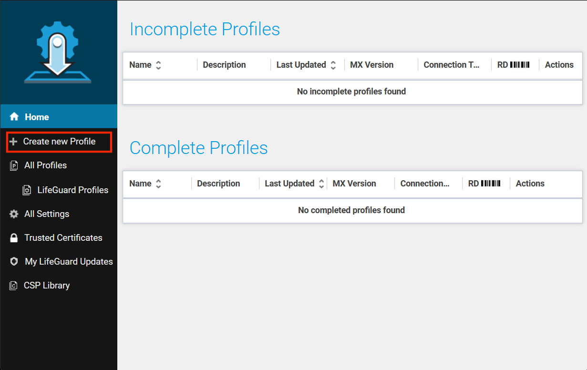
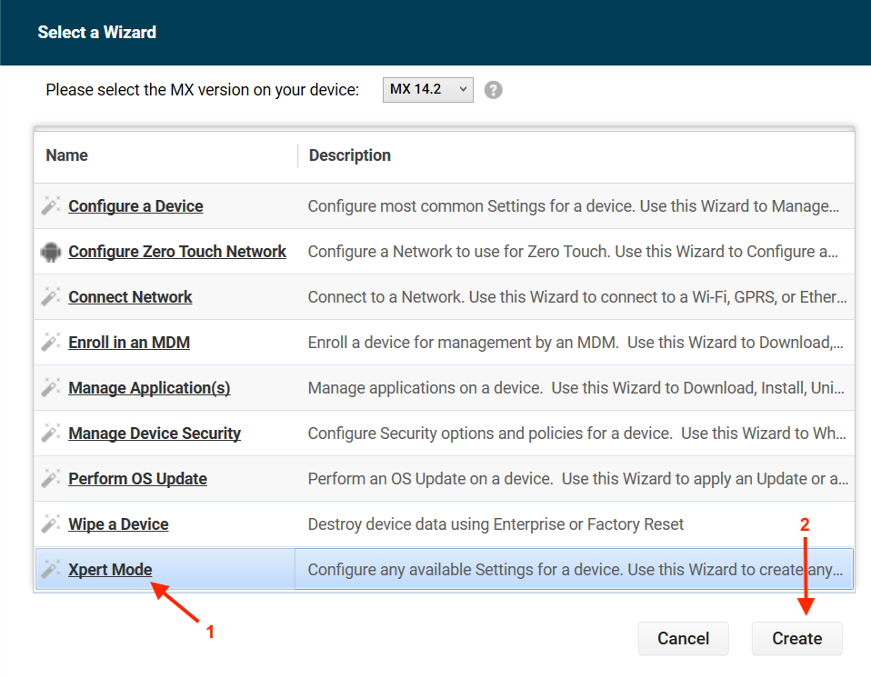
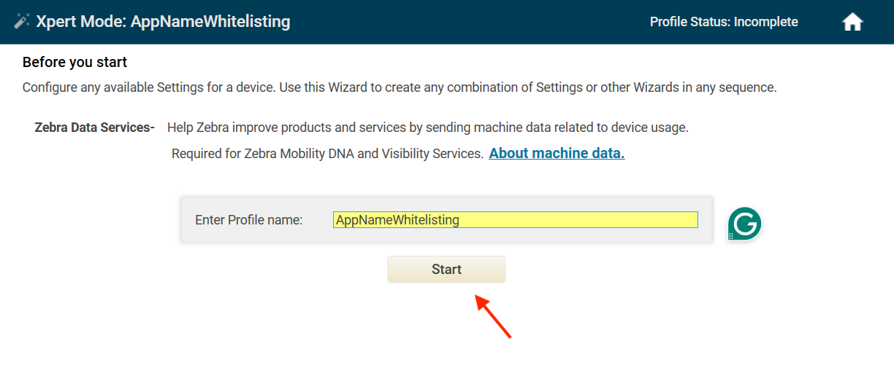
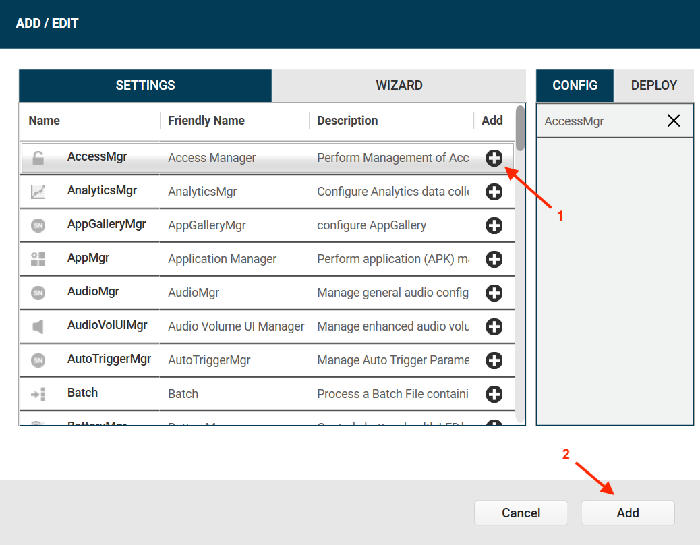
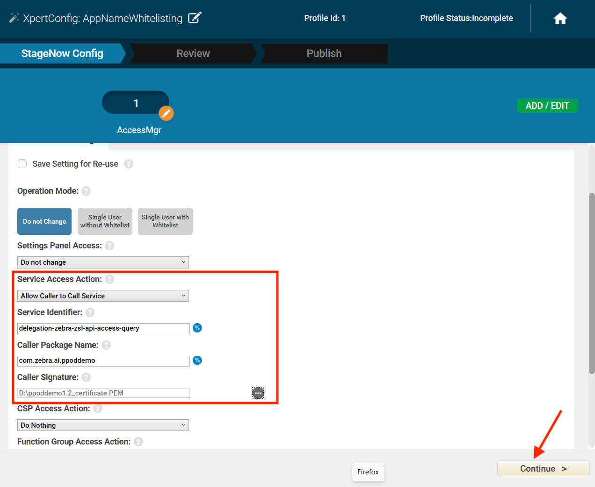
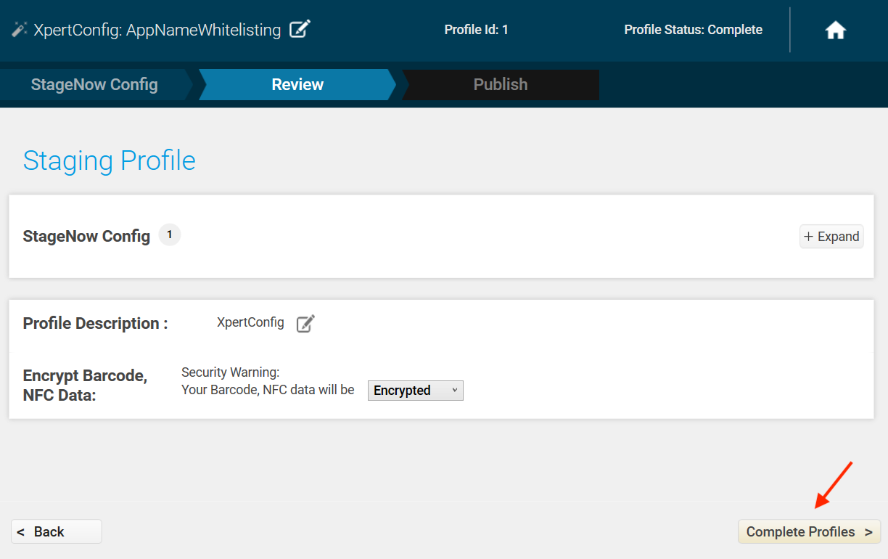
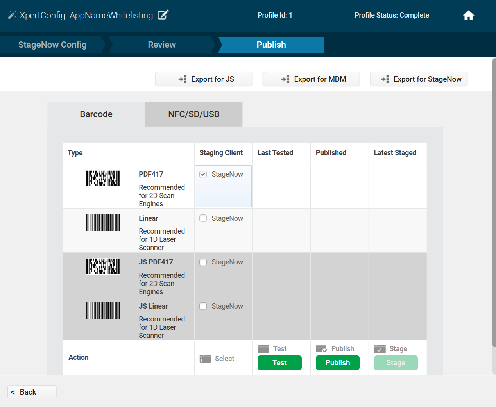

## Overview

Certain AI Data Capture SDK models, such as the Picture Proof of Delivery AI Model, require software licenses that must be procured and deployed to all target devices.

---

## I. Procure License

The first step is to complete the [License Request form](https://ptr.zebra.com/SDK-FrontlineAI-Blueprints). This brief form captures the following details:

- Use Case (e.g., Picture Proof of Delivery AI Blueprint)
- Quantity
- Email Address
- Country

<!--
The first step is to engage with your Zebra representative (Accounts or Sales) or a Zebra reseller to purchase the necessary licenses. The following resources are available to find a partner or contact Zebra:

- **[Find a Zebra Partner](https://www.zebra.com/us/en/partners/partner-application-locator.html) -** Submit an inquiry via the web.
- **[How to Select a Channel Partner](https://www.zebra.com/us/en/partners/find-a-zebra-partner/selecting-the-right-channel-partner.html) -** Describes the types of partners that engage with Zebra and highlights their technologies and specialties.
- **[Partner Interaction Center](https://www.zebra.com/us/en/partners/partner-interaction-center.html) -** Provides contact information for Zebra's global partner network.
- **[Zebra Corporate Numbers and Links](https://www.zebra.com/us/en/about-zebra/contact-zebra.html) -** Lists contact information organized by global region.
- **[Global Marketing Contact Center](https://www.zebra.com/us/en/about-zebra/contact-zebra/marketing-contact-center.html) -** Lists contact information organized by global region and country.

When purchasing, place an order with the required quantity using the correct SKU/product name (e.g. ZEBRA-AI-BP-PPOD for the Picture Proof of Delivery AI Blueprint license.)
-->

---

## II. Deploy & Activate License

After the license is procured, a confirmation email is sent containing the necessary activation details. The following steps outline the license deployment and activation process:

1. **Verify Prerequisites -** All target devices must have the **License Manager** application, version 15.0.4 or higher. The application may be pre-installed; if not, it can be download from the [License Manager Application Support](https://www.zebra.com/us/en/support-downloads/software/mobile-computer-software/license-manager.html) page.
2. **Deploy and Activate -** The license is deployed using an Enterprise Mobility Management (EMM) tool (e.g., Zebra StageNow, SOTI MobiControl). Activation requires the "Badge ID" and "Product Name" provided in the confirmation email. For detailed instructions, refer to the guides and videos on the support page.

Additional Resources:

- **[License Manager User Guide](https://www.zebra.com/content/dam/support-dam/en/documentation/unrestricted/guide/software/license-manager_guide.pdf) -** Provides comprehensive information on license activation.
- **[Software Licensing Support](https://www.zebra.com/us/en/support-downloads/software-licensing.html) -** Offers manuals, "how-to" videos, and knowledge articles for Zebra Software Licensing.
- **[Zebra Technical Support](https://support.zebra.com/) -** Available for assistance with any technical issues.

---

## III. Generate App Signature Certificate

To be added to the allowlist, the application signature requires a signature certificate. This allows Zebra's Access Manager (configured via StageNow) to identify and grant permissions to the application.

Use the following steps to generate a signature certificate encoded as a binary DER (`.pem`):

1.  **Download the [App Signature Tool](/sigtools/)** as a `.zip` file and extract the `.jar` file.
2.  **Open the command line interface (CLI).** Navigate to the directory where the extracted `.jar` file is located.
3.  **Generate the certificate.** Execute the following command. Replace `<app_name.apk>` with the file path to the application .APK and `<appname_certificate.PEM>` with the desired output file name:

        java -jar SigTools.jar GETCERT -INFORM APK -OUTFORM DER -IN <appname.apk> -OUTFILE <appname_certificate.PEM>

4.  The `.pem` file is created in the folder specified in the command.

For further reference, see [App Signature](/mx/accessmgr/#app-signature) in Access Manager.

<i class="fa fa-exclamation-triangle" style="color:#FFA500;"></i> **Important:** Ensure that the paths for `SigTools.jar` and `<app_name.apk>` are correctly specified. Incorrect paths will result in errors.

---

## IV. Allowlist the App

Applications must be added to the allowlist to enable use of the AI Suite SDK and communication between the SDK with the on-device Licensing Manager. This is configured using Zebra's [StageNow](/stagenow) device staging solution.

1. Install and launch [StageNow](https://www.zebra.com/us/en/support-downloads/software/mobile-computer-software/stagenow.html) on the host computer.

2. In the StageNow home screen, click **Create New Profile** from the left menu.
   

3. Perform the following:
   - Select **MX version 14.2 or higher.** _The MX version on the device should match this version selected._ See [MX documentation](/mx/mx-version-on-device/) for instructions on how to check the version.
   - Select **Xpert Mode.**
   - Click **Create.**
     

4. Enter the a profile name and click **Start.**
   

5. Scroll down and click the plus (+) sign next to **AccessMgr.** This adds **AccessMgr** to the Config tab on the right side. Click **Add.**
   

6. In the AccessMgr settings, enter/select the following values, then scroll down and click **Continue.**:
   - **Server Access Action:** Allow Caller to Call Service
   - **Service Identifier:** delegation-zebra-zsl-api-access-query
   - **Caller Package Name:** [Enter the app's package name, e.g. `com.zebra.ai.ppoddemo`]
   - **Caller Signature:** [Browse to the app's `.pem` signature certificate created in [Step III](#iiigenerateappsignaturecertificate).]

   

7. Click **Complete Profile.**
   

8. Select a deployment method::
   - **StageNow -** Generate the barcode from the profile. Open StageNow client on the device and scan the barcode.
   - **EMM -** Click **Export for MDM** to export the `.xml` file to deploy via EMM.

   

---

## Related Guides

- [About](../about/)
- [Setup](../setup/)
- [Localizer](../localizer/)
  - Models: [Barcode](../model/barcode-localizer/), [Product & Shelf](../model/prod-recognizer/)
- [Product Recognition](../productrecognition/) - Model: [Model](../model/prod-recognizer/)
  - [Feature Extractor](../productrecognition/#featureextractor)
  - [Feature Storage](../productrecognition/#featurestorage)
  - [Recognizer](../productrecognition/#recognizer)
- [Text OCR](../textocr/)
  - [Model](../model/textocr/)
- [CameraX](../camerax/)
  - [EntityTrackerAnalyzer](../camerax/#entitytrackeranalyzer)
  - [Detectors](../camerax/#detectors)
  - [EntityViewfinder](../camerax/#entityviewfinder)
- [Image Attributes Detector](../imageattributes/)
- [Image Transform Detector](../imagetransform/)
- [Custom Detector](../customdetector/)
- [Entity](../entity/)
- [Data Types](../types/)
