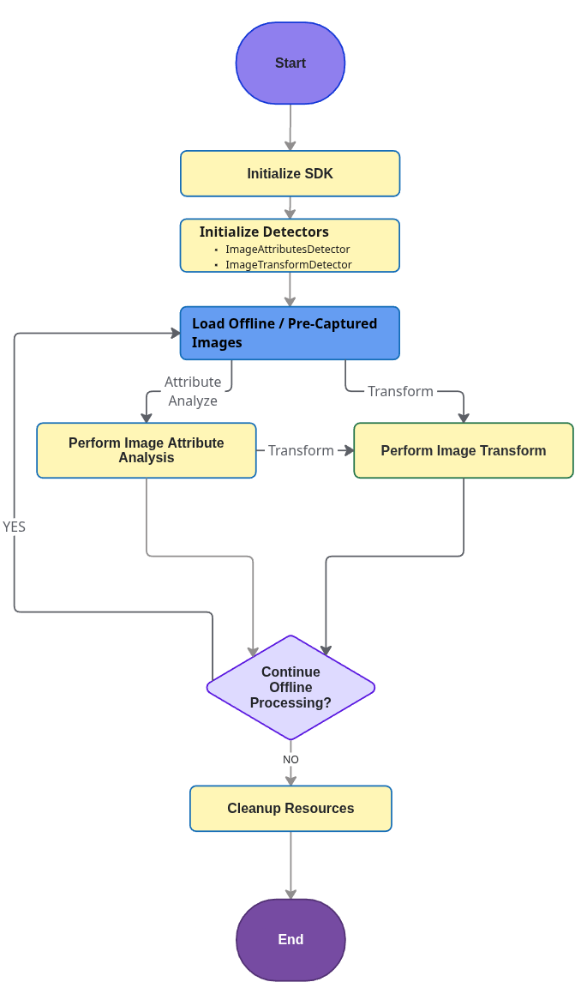

## Overview

Picture Proof of Delivery (PPOD) is an on-device AI Blueprint that solves common challenges for delivery drivers. Under constant time pressure, drivers must capture clear, compliant images that show both the parcel and its surroundings, while simultaneously avoiding sensitive data like faces or license plates. This Blueprint simplifies the process, guiding the driver to get a compliant picture on the first attempt.

The Blueprint operates in two distinct stages:

1. **Compliance Check:** Verifies the image meets compliance criteria (e.g., parcel is within the image).
2. **Image Enhancement:** Post-processes the captured image (e.g. blur text) to ensure privacy and data security.

The specific options available for each stage are outlined below:

<table class="facelift" style="width:60%" border="1" padding="5px">
    <thead>
        <tr bgcolor="#dce8ef">
        <th>Stage</th>
        <th>Available Options</th>
        </tr>
    </thead>
    <tbody>
        <tr>
            <td>Compliance Check</td>
            <td>• Ensure parcel is present • Ensure surroundings are shown • Ensure image is NOT blurry • Ensure people are NOT in image</td>
        </tr>
        <tr>
            <td>Image Enhancement</td>
            <td>• Blur People in Image • Blur Text in image • Blur Barcodes in Image</td>
        </tr>
    </tbody>
</table>

The Blueprint is ready to be integrated into an Android application through a simplified pipeline exposed in Zebra’s AI Suite SDK.

---

## Non-Guided vs. Guided PPOD

The PPOD Blueprint offers two operational modes: a **Non-Guided** mode for post-capture analysis and a **Guided** mode for live, interactive feedback.

Choosing the right approach depends on the application's requirements for user interaction and workflow integration. The table below outlines the key differences.

<table class="facelift" style="width:100%" border="1" padding="5px">
    <thead>
        <tr bgcolor="#dce8ef">
        <th>Aspect</th>
        <th>Non-Guided PPOD (Non-Interactive)</th>
        <th>Guided PPOD (Live Feedback)</th>
        </tr>
    </thead>
    <tbody>
        <tr>
            <td>Interaction Model</td>
            <td><b>Post-capture & Non-interactive.</b> Analysis happens after the image is taken.</td>
            <td><b>Live & Interactive.</b> Provides real-time guidance before the image is taken.</td>
        </tr>
        <tr>
            <td>Primary Use Case</td>
            <td>Fast capture and non-disruptive batch processing of existing images.</td>
            <td>Prioritizing first-time image quality and compliance through live guidance.</td>
        </tr>
        <tr>
            <td>Core Technology</td>
            <td><code>ImageAttributesDetector</code> & <code>ImageTransformDetector</code> on a static image.</td>
            <td><code>EntityTrackerAnalyzer</code> processing a live camera feed.</td>
        </tr>
    </tbody>
</table>

---

## Guided PPOD

For more information on the live feedback approach, see [Guided PPOD](../camerax/#guidedppod) within the `CameraX` section.

---

## Non-Guided PPOD

The **Non-Guided Picture Proof of Delivery (PPOD)** is a flexible method for processing images after they have been captured. Unlike the guided (live feedback) model, this workflow focuses on analyzing pre-existing or newly captured images without real-time user guidance.

This method allows developers to embed an analysis and transformation pipeline into an existing application with minimal disruption to the established user workflow. The core process involves taking an image and passing it to one or more detectors to verify its compliance and redact sensitive information.

**Key Characteristics:**

- **Post-Capture Analysis:** Operates on images already captured from any source (camera, gallery, etc.).
- **No Live Feedback:** Does not use a live camera preview to provide real-time guidance.
- **Minimal Disruption:** Easily integrates as a background step in an existing application workflow (e.g., after a driver captures all their delivery photos).
- **Component-Based:** Primarily uses [ImageAttributesDetector](../imageattributes/) for compliance checks and the [ImageTransformDetector](../imagetransform/) for privacy redaction on a static image.

---

### Workflow

The Non-Guided PPOD workflow provides a flexible pipeline for processing static images after capture. The process begins by initializing the SDK and the required detectors (ImageAttributesDetector, ImageTransformDetector). Once the image is loaded, there are two distinct processing paths available:

- **Analyze then Transform:** First, analyze the image with `ImageAttributesDetector`, and then optionaally apply privacy redaction with `ImageTransformDetector`.
- **Direct Transformation:** Use `ImageTransformDetector` to directly apply privacy redaction without any prior analysis.

_Non-Guided PPOD Workflow_

---

## Sample App

A sample application and source code are available to demonstrate both the Guided and Non-Guided Picture Proof of Delivery (PPOD) workflows.

- **Zebra Showcase App:** Download and install the [Zebra Showcase App](/showcase-app) to see demonstrations of both the Guided and Non-Guided workflows.
- **Source Code:** The [sample app source code](https://github.com/ZebraDevs/AISuite_Android_Samples/tree/main/AISuite_Demos/AIProofOfDelivery) demonstrates how to use the [Image Attributes Detector](../imageattributes/) and [Image Transform Detector](../imagetransform/) classes with their underlying AI models to build a PPOD solution.
- **Licensing:** The Zebra Showcase App provides a pre-licensed, ready to run demo app. To compile the sample app from source code, a Picture Proof of Delivery License (AI Blueprint, Annual) is required. The SKU for this annual license is **ZEBRA-AI-BP-PPOD.** See [Licensing](../license/) for procurement and deployment instructions.

---

## Related Guides

- [About](../about/)
- [Setup](../setup/)
- [Localizer](../localizer/)
  - Models: [Barcode](../model/barcode-localizer/), [Product & Shelf](../model/prod-recognizer/)
- [Product Recognition](../productrecognition/) - Model: [Model](../model/prod-recognizer/)
  - [Feature Extractor](../productrecognition/#featureextractor)
  - [Feature Storage](../productrecognition/#featurestorage)
  - [Recognizer](../productrecognition/#recognizer)
- [Text OCR](../textocr/)
  - [Model](../model/textocr/)
- [CameraX](../camerax/)
  - [EntityTrackerAnalyzer](../camerax/#entitytrackeranalyzer)
  - [Detectors](../camerax/#detectors)
  - [EntityViewfinder](../camerax/#entityviewfinder)
- [Image Attributes Detector](../imageattributes/)
- [Image Transform Detector](../imagetransform/)
- [Custom Detector](../customdetector/)
- [Entity](../entity/)
- [Data Types](../types/)
