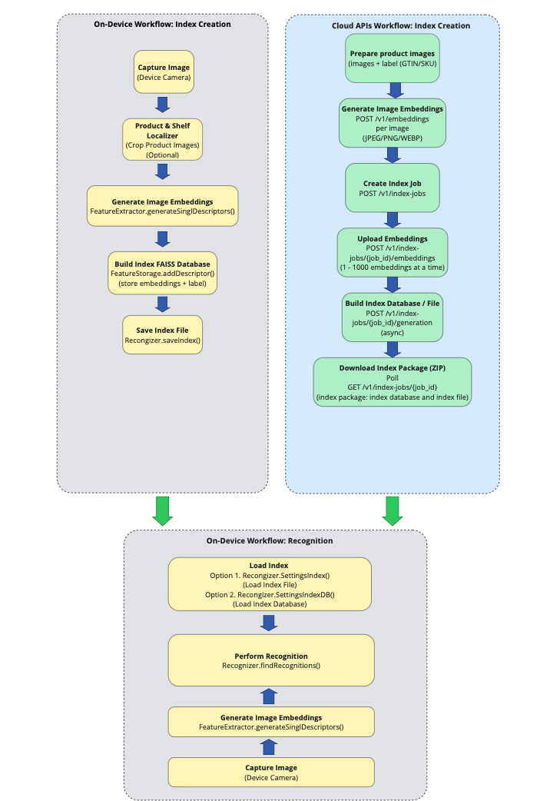

## Overview

**Product Recognition** identifies enrolled products from an image by detecting them, extracting their visual features, and matching those features against a product database. This workflow is optimized for retail scenarios such as inventory tracking, shelf intelligence, and automated checkout.

Product recognition follows a three-step process:

1. **Localize -** A detector finds shelves, labels, and products within the image. This is performed by either the [ModuleRecognizer’s](#modulerecognizer) built-in detector (Unified Workflow) or the stand-alone [Shelf and Product Localizer](../localizer/) (Modular workflow).
2. **Extract -** Detected product locations are sent along with the image to the [Feature Extractor](#featureextractor), which generates a unique digital signature (features) for each product.
3. **Match -** The extracted features are matched against the product database to find the corresponding product SKU and accurately identify the product.

<!--
**Product Recognition** utilizes the **Feature Extractor, Feature Storage,** and **Recognizer** classes to identify products that have been enrolled for recognition. Typically used alongside the [Localizer](../localizer/) class, this approach builds a comprehensive knowledge base that enhances inventory tracking and facilitates automated checkouts.
-->

Two methods for implementation:

1. **Unified Workflow (Recommended) -** Uses the **ModuleRecognizer** - a single, high-level pipeline that handles all three steps automatically, from detection to recognition. **This is best for most uses cases,** simplifying integration by combining all steps into one configurable module, while still allowing configuration of detection-only or detection-plus-recognition modes.
2. **Modular Workflow -** Provides direct access to the low-level components to build a custom pipeline for each step. This is best for advanced or highly customized use cases requiring full control over each step of the process. Low–level components:
   - **[Feature Extractor](#featureextractor) –** Generates descriptors from detected product images.
   - **[Feature Storage](#featurestorage) -** Stores these descriptors in a vector database, creating a product knowledge base.
   - **[Recognizer](#recognizer) -** Searches the database to find the most similar product and predict its SKU.
   - **[Localizer](../localizer/) –** Detects shelves, labels, and products; cropped product regions can then be passed to the recognizer.

**Product Enrollment,** the process of equipping an AI system with the data to recognize items, requires a searchable product index. The Product Recognition **<a href="#indexcreatorapi">Index Creator</a>** builds this index by converting product images into searchable digital fingerprints using advanced computer vision, enabling seamless recognition through the AI Data Capture SDK.

---

## AI Model

The **product-and-shelf-recognizer** model is designed specifically for product and shelf recognition tasks. For more information and to download the model, refer to [Product and Shelf Recognizer Model](../model/prod-recognizer/).

---

## Index Creator

The Product Recognition **Index Creator API** is Zebra's cloud-based API for building the searchable index essential for any AI product recognition system. Using advanced computer vision, the API analyzes product images to classify items and generate a digital index. This index is then used by the Zebra Frontline AI Enabler to perform fast and accurate product identification in the field.

Key Features:

- **Digital Fingerprints -** Converts product images into unique digital identifiers, enabling users to search and retrieve items by uploading similar images.
- **Automated Catalog Management -** Groups similar products, categorizes them, and detects duplicates, streamlining catalog organization and improving inventory accuracy.
- **Optimized Search Indexes -** Builds efficient search tools for visual search, reducing catalog management time and improving inventory accuracy.
- **Enhanced Workflow Efficiency -** Automates tasks from image capture to index creation, minimizing manual effort and resource usage.

### Product Enrollment and Indexing

Product enrollment is the foundational process of registering products into an AI system to make them recognizable. It involves collecting product attributes and processing them in three main steps:

1. Uploading product data (e.g., images, descriptions, metadata).
2. Extracting features from that data.
3. Organizing and storing these features in a structured format for efficient retrieval.

The output of enrollment is an index, which serves as the backbone of the recognition system. The index is a highly optimized database that enables the AI to efficiently retrieve and recognize products based on user input. It is specifically designed for:

- **Fast retrieval:** Matching user inputs (like a photo) against products in the database.
- **Similarity comparisons:** Finding the closest match by comparing features of enrolled products with new data.
- **Categorization:** Grouping products into logical categories or hierarchies for better organization.

**Product Recognition Index Creator Workflow:**

Additional resources:

- **API Reference -** For information on the available cloud APIs, visit [Frontline AI Enabler Product Recognition Index Creator](https://developer.zebra.com/apis/zebra-frontline-ai-enablers-product-recognition-index-creator).
- **Sample Application -** To see a practical implementation, see the [sample application](#sampleapps).

---

## ModuleRecognizer

The **ModuleRecognizer** class provides a unified pipeline for detecting shelves, labels, and optionally recognizing products (SKUs) using feature extraction and database/index matching. It combines localization and recognition into a single workflow, supporting both bounding box detection and product identification.

Key Features:

- **Shelf, Label, and Product Detection -** Detects shelves, labels, and products in an image, returning bounding boxes for each entity.
- **Product Recognition (Optional) -** When enabled, recognizes products (SKUs) by extracting features and matching them against a product database or index.
- **Barcode Recognition (Optional) -** When enabled, detects and decodes barcodes present on shelf labels.
- **Configurable Pipeline -** Supports localization-only mode for shelves, labels and products or full recognition mode, if the following APIs are called: enableProductRecognitionWithIndex, enableProductRecognitionWithDb.

---

### Developer Guide

This guide demonstrates how to detect shelves, labels, products, and optionally recognize products (SKUs) and decode barcodes on shelf labels using the unified ModuleRecognizer pipeline.

#### Step 1: Initialization

1. **Import the ModuleRecognizer class:** Use `com.zebra.ai.vision.detector.ModuleRecognizer`.
2. **Initialize the SDK:** Use your application's context object and invoke `init()` from the AIVisionSDK class.
3. **Initialize Settings:** Create a `ModuleRecognizer.Settings` object with the model name or model file for localization. Optionally, enable product recognition by providing a feature product recognition model and either an index with label file or a database file.
4. **Instantiate ModuleRecognizer:** Use the `Settings` object to create an instance of `ModuleRecognizer` with a `CompletableFuture`.
   The thenAccept() method allows handling of the instantiated ModuleRecognizer for further operations.

Sample Code:

        import com.zebra.ai.vision.detector.ModuleRecognizer;

        // Developer must Initialize SDK by calling below API:
        AIVisionSDK.getInstance(this.getApplicationContext()).init();

        // Context refers to application context object.
        String mavenModelName = "product-and-shelf-recognizer";

        // Create settings for localization only
        ModuleRecognizer.Settings settings = new ModuleRecognizer.Settings(mavenModelName);

        // Optional – Enable product recognition with a database file
        String productDbFile = "/path/to/product-db-file";
        mrSettings settings.enableProductRecognitionWithDb(mavenModelName, productDbFile);

        // Optional – Set runtime processor order to load the model
        Integer[] rpo = new Integer[3];
        rpo[0] = InferencerOptions.DSP;
        rpo[1] = InferencerOptions.CPU;
        rpo[2] = InferencerOptions.GPU;

        mrSettings settings.inferencerOptions.runtimeProcessorOrder = rpo;
        settings.inferencerOptions.defaultDims.height = 640;
        settings.inferencerOptions.defaultDims.width = 640;

        // Initialize ModuleRecognizer object
        final ModuleRecognizer moduleRecognizer = null;

        CompletableFuture<ModuleRecognizer> futureObject = ModuleRecognizer.getModuleRecognizer(mrSettings settings, executor);

        // Use the futureObject to implement thenAccept() callback of CompletableFuture
        futureObject.thenAccept(moduleRecognizerInstance -> {

                // Use the moduleRecognizer object returned here for detection and recognition
                moduleRecognizer = moduleRecognizerInstance;

            }).exceptionally(e -> {

            if (e instanceof AIVisionSDKException) {

                Log.e(TAG, "[AIVisionSDKException] ModuleRecognizer object creation failed: " + e.getMessage());
            }

            return null;

        });

#### Step 2: Detect and Recognize Entities

1. **Detection and Recognition:** Call `process(imageData, executor)` to detect shelves, labels, and products in the image.
   - If product recognition is enabled, the returned products will include top-K SKU predictions.
   - If barcode recognition is enabled, the returned products will also include the list of barcode entities on shelf labels.
2. **Asynchronous Processing:** Use the `thenAccept` method of `CompletableFuture` to handle the result once entity detection and recognition is complete. This allows processing without blocking the main thread.
3. **Resource Management:** After processing is complete, call `dispose()` on the `ModuleRecognizer` object to free resources and memory used during detection and recognition.

Sample Code:

        import com.zebra.ai.vision.detector.ImageData;
        import com.zebra.ai.vision.entity.Entity;
        import com.zebra.ai.vision.entity.ShelfEntity;
        import com.zebra.ai.vision.entity.LabelEntity;
        import com.zebra.ai.vision.entity.ProductEntity;
        import com.zebra.ai.vision.detector.SKUInfo;

        // Prepare image data and executor
        ImageData imageData = ImageData.fromBitmap(bitmap);

        // Input params: imageData and an executor thread object for running the recognizer functionality

        CompletableFuture<List<Entity>> futureEntities = moduleRecognizer.process(imageData, executor);

        futureEntities.thenAccept(entities -> {

            for (Entity entity : entities) {
                if (entity instanceof ShelfEntity) {
                    ShelfEntity shelf = (ShelfEntity) entity;
                    // Access shelf bounding box and detection confidence
                    android.graphics.Rect shelfBox = shelf.getBoundingBox();
                    float shelfConfidence = shelf.getAccuracy();

                    // Access corner points if needed to draw on screen
                    List<Point> shelfCorners = shelf.getCorners();
                }

                else if (entity instanceof LabelEntity) {
                    LabelEntity label = (LabelEntity) entity;

                    // Access label bounding box and class ID
                    android.graphics.Rect labelBox = label.getBoundingBox();
                    LabelEntity.ClassId classId = label.getClassId();

                    float labelConfidence = label.getAccuracy();
                    List<Point> labelCorners = label.getCorners();

                }

                else if (entity instanceof ProductEntity) {
                    ProductEntity product = (ProductEntity) entity;

                    // Access product bounding box and SKU predictions
                    android.graphics.Rect productBox = product.getBoundingBox();
                    List<SKUInfo> topKSKUs = product.getTopKSKUs();

                    float accuracy = product.getAccuracy();
                    List<Point> productCorners = product.getCorners();
                }
            }

        }).exceptionally(e -> {
            if (e instanceof AIVisionSDKException) {
                Log.e(TAG, "[AIVisionSDKException] Failed to process image : " + e.getMessage());
            }
            return null;

        });

        // Once done using the moduleRecognizer object, dispose the object to release the resources and memory used for detection and recognition
        moduleRecognizer.dispose();

**Notes:**

- **Localization Only -** If product recognition is not enabled `ProductEntity` objects will contain only bounding box information.
- **Full Recognition -** If product recognition is enabled, `ProductEntity` objects will include top-K SKU predictions and accuracy scores.
- **Thread Safety -** The `ModuleRecognizer` class is thread-safe; however, always dispose of the instance when finished.

---

### Methods

#### getModuleRecognizer(Settings settings, Executor executor)

        CompletableFuture<ModuleRecognizer> getModuleRecognizer(Settings settings, Executor executor) throws IOException, InvalidInputException, AIVisionSDKLicenseException, AIVisionSDKSNPEException, AIVisionSDKModelException, AIVisionSDKException

**Description:** Asynchronously loads the localization model and, if configured, the product recognition models and resources. Returns a `ModuleRecognizer` object that can detect shelves, labels, and products in images, and optionally recognize products (SKUs).

**Parameters:**

- **settings -** The `ModuleRecognizer.Settings` object containing configuration for localization and optional product recognition.
- **executor -** Executor for delivering the result; if null, the SDK default executor is used.

**Return Value:** Returns a `CompletableFuture` that resolves to a `ModuleRecognizer` object.

**Exceptions:**

- **InvalidInputException -** Thrown if the `Settings` object is null or required fields are missing.
- **AIVisionSDKLicenseException -** Thrown if there are licensing issues related to the model.
- **AIVisionSDKSNPEException -** Thrown if SNPE fails to initialize.
- **AIVisionSDKModelException -** Thrown if the current SDK version is below the minimum required version. To resolve this, update the SDK to a newer or the latest version.
- **AIVisionSDKException -** Thrown if the AI Data Capture SDK is not initialized or if other SDK error occur.
- **IOException -** Thrown if the model or resource fails to load during initialization.

---

#### process (ImageData imageData, Executor executor)

        CompletableFuture<List<Entity>> process(ImageData imageData, Executor executor) throws InvalidInputException, AIVisionSDKException

**Description:** Processes an `ImageData` object, detecting shelves, labels, and products, performing product-to-shelf and label-to-shelf association, and optionally recognizing product SKUs and barcodes on shelf labels.

**Parameters:**

- **ImageData imageData -** Data representing the image to be processed.
- **Executor executor -** Results are returned in this executor.

**Return Value:** A `CompletableFuture<List<Entity>>` containing ShelfEntity, LabelEntity, ProductEntity (with SKU information when product recognition is enabled) and BarcodeEntity instances (when barcode recognition is enabled).

**Exceptions:**

- **InvalidInputException -** Thrown if imageData is null.
- **AIVisionSDKException -** Thrown if the image queue size limit of 5 is exceeded.

---

#### process (ImageData imageData)

        CompletableFuture<List<Entity>> process(ImageData imageData) throws AIVisionSDKException, InvalidInputException

**Description:** Processes an `ImageData` object, detecting shelves, labels, and products, performing product-to-shelf and label-to-shelf association, and optionally recognizing product SKUs and barcodes on shelf labels.

**Parameters:**

- **ImageData imageData -** Data representing the image to be processed.

**Return Value:** A `CompletableFuture<List<Entity>>` containing ShelfEntity, LabelEntity, ProductEntity (with SKU information when product recognition is enabled) and BarcodeEntity instances (when barcode recognition is enabled).

**Exception:**

- **AIVisionSDKException -** Thrown if the image queue size limit of 5 is exceeded.
- **InvalidInputException -** Thrown if `imageData` or its bitmap is null.

---

#### void Dispose()

        void ModuleRecognizer.dispose()

**Description:** Releases all internal resources used by the ModuleRecognizer object, including models and native handles for localization, feature extraction, recognition and barcode decoding. This method should be called manually when the recognizer is no longer needed to free resources and prevent memory leaks.

---

### ModuleRecognizer.Settings

The `ModuleRecognizer.Settings` class is a nested class within the `ModuleRecognizer` class. It provides configuration options for the module recognizer, allowing the ability to specify localization models and optionally enable product recognition using various sources. Multiple constructors and methods are available to tailor the configuration for different use cases.

---

#### Settings (String modelName)

        ModuleRecognizer.Settings settings = new ModuleRecognizer.Settings(modelName) throws InvalidInputException, AIVisionSDKException;

**Description:** Constructor for the `Settings` object using the model name (e.g."product-and-shelf-recognizer"). This sets up the configuration for shelf, label, and product localization. Product recognition can be enabled later using the provided methods.

**Parameters:**

- **ModelName -** The name of the model to be used for product recognition. Refer to [feature models](../setup/#featuresmodels).

**Exceptions:**

- **InvalidInputException -** Thrown if the `ModelName` is invalid.
- **AIVisionSDKException -** Thrown if an error occurs while reading the specified model or if the SDK is not initialized.

---

#### Settings (File modelFile)

        ModuleRecognizer.Settings settings = new ModuleRecognizer.Settings(modelFile) throws InvalidInputException, AIVisionSDKException;

**Description:** Constructs a new `Settings` object using a `File` object for the localization model. Product recognition can be enabled later using the provided methods.

**Parameters:**

- **modelFile –** The file object containing the localization model.

**Exceptions:**

- **InvalidInputException –** Thrown if the `modelFile` is invalid.
- **AIVisionSDKException –** Thrown if an error occurs while reading the model or if the SDK is not initialized.

---

#### enableProductRecognitionWithDb(String modelName, String productDB_Filepath)

        void enableProductRecognitionWithDb(String modelName, String productDB_Filepath) throws InvalidInputException, AIVisionSDKException

**Description:** Enables product recognition using a feature extractor model (by name) and a product database file. This configures the recognizer to match detected products against entries in the specified database.

**Parameters:**

- **modelName -** The name of the model to be used for product recognition. Refer to [feature models](../setup/#featuresmodels).
- **productDB_Filepath -** The file path to the product database.

**Exceptions:**

- **InvalidInputException -** Thrown if the `productDB_Filepath` is null, empty, or refers to an empty or invalid database file.
- **AIVisionSDKException -** Thrown if an error occurs during processing.

---

#### enableProductRecognitionWithDb(File modelFile, String productDB_Filepath)

        void enableProductRecognitionWithDb(File modelFile, String productDB_Filepath) throws InvalidInputException, AIVisionSDKException

**Description:** Enables product recognition using a feature extractor model (as a file) and a product database file. This configures the recognizer to match detected products against entries in the specified database.

**Parameters:**

- **modelFile -** The feature extractor model file to use for product recognition.
- **productDB_Filepath -** The file path to the product database.

**Exceptions:**

- **InvalidInputException -** Thrown if `modelFile` is invalid or if `productDB_Filepath` is null,empty, or refers to an empty or invalid database file.
- **AIVisionSDKException -** Thrown if an error occurs during processing.

---

#### enableProductRecognition(String modelName, String productIndexZipFilePath)

        void enableProductRecognition(String modelName, String productIndexZipFilePath) throws InvalidInputException, AIVisionSDKException

**Description:** Enables product recognition using a feature extractor model (by name) and a product index zip file. This configures the recognizer to match detected products against entries in the specified index, label and database files.

**Parameters:**

- **modelName -** The name of the model to be used for feature extraction.
- **productIndexZipFilePath-** The file path to the .ZIP file containing the product index data.

**Exceptions:**

- **InvalidInputException -** Thrown if `productIndexZipFilePath` is null, refers to a non-existent file, or is not a .ZIP file; if the .ZIP file is corrupted or invalid; or if `modelName` is null or empty.
- **AIVisionSDKException -** Thrown if the model version validation fails or an error occurs during processing.

---

#### enableProductRecognition(File modelFile, String productIndexZipFilePath)

        void enableProductRecognition(File modelFile, String productIndexZipFilePath) throws InvalidInputException, AIVisionSDKException

**Description:** Enables product recognition using a feature extractor model (by file) and a product index zip file. This configures the recognizer to match detected products against entries in the specified index, label and database files.

**Parameters:**

- **modelFile -** The model file to be used for feature extraction.
- **productIndexZipFilePath-** The file path to the .ZIP file containing the product index data.

**Exceptions:**

- **InvalidInputException -** Thrown if `productIndexZipFilePath` is null, refers to a non-existent file, or is not a .ZIP file; if the .ZIP file is corrupted or invalid; or if `modelFile` is null or is not a valid file.
- **AIVisionSDKException -** Thrown if the model version validation fails or an error occurs during processing.

---

#### enableProductRecognitionWithIndex(String modelName, String indexFilePath, String labelFilePath)

        void enableProductRecognitionWithIndex(String modelName, String indexFilePath, String labelFilePath) throws InvalidInputException, AIVisionSDKException

**Description:** Enables product recognition using a feature extractor model (by name), a product index file, and a label file. This configures the recognizer to match detected products against entries in the specified index and label files.

**Parameters:**

- **modelName -** The name of the model to be used for product recognition. Refer to [feature models](../setup/#featuresmodels).
- **indexFilePath –** The file path to the product index file.
- **labelFilePath –** The file path to the product label file.

**Exceptions:**

- **InvalidInputException -** Thrown if `indexFilePath` or `labelFilePath` is null or empty.
- **AIVisionSDKException -** Thrown if an error occurs during processing.

---

#### enableProductRecognitionWithIndex(File modelFile, String indexFilePath, String labelFilePath)

        void enableProductRecognitionWithIndex(File modelFile, String indexFilePath, String labelFilePath) throws InvalidInputException, AIVisionSDKException

**Description:** Enables product recognition using a feature extractor model (as a file), a product index file, and a label file. This configures the recognizer to match detected products against entries in the specified index and label files.

**Parameters:**

- **modelFile -** The feature extractor model file to use for product recognition.
- **indexFilePath –** The file path to the product index file.
- **labelFilePath –** The file path to the product label file.

**Exceptions:**

- **InvalidInputException -** Thrown if `modelFile` is invalid or `indexFilePath` or `labelFilePath` is null or empty.
- **AIVisionSDKException -** Thrown if an error occurs during processing.

---

#### enableBarcodeRecognition(Map entitySettingsMap) throws InvalidInputException

        void enableBarcodeRecognition(Map<EntityType, BarcodeDecoder.Settings> entitySettingsMap) throws InvalidInputException

**Description:** Enables barcode recognition using a map of entity-specific decoder settings. This configures the recognizer to decode barcodes according to the `BarcodeDecoder.Settings` associated with each `EntityType(LABEL)`.

**Parameters:**

- **entitySettingsMap -** A map that associates an `EntityType` with its specific `BarcodeDecoder.Settings`. The key is the EntityType (LABEL) to which the barcode settings will apply, and the value contains the settings for the decoder.

**Exceptions:**

- **InvalidInputException -** Thrown if `entitySettingsMap` is null, empty, or if any entry within the map contains a null key (EntityType) or a null value (BarcodeDecoder.Settings).

---

#### InferencerOptions inferencerOptions

        InferencerOptions = new InferencerOptions()

**Description:** An instance of `InferencerOptions` that provides additional configuration for the inferencer's behavior. The options include:

- **Runtime processor order -** Applies internally to the localizer and feature extractor, but not to the recognizer.
- **Input dimensions -** Applies only to the localizer.

---

## Feature Extractor

The `FeatureExtractor` class generates a set of [Descriptors](../types/#descriptor), vectors of float numbers that offer a meaningful representation of the features of items identified within an image. It supports processing both entire images and specific regions defined by [bounding boxes](../types/#bbox/), accommodating various input formats and orientations. After the descriptors are generated, integration with Feature Storage allows for storage and retrieval of the descriptors for use.

Common Applications:

- **Image Classification:** Use descriptors that help classify images into categories, enhancing systems that sort or tag images based on visual content.
- **Object Detection and Recognition:** Extract features and generate descriptors from a whole image or specific regions of an image to help identify objects. This could be useful for surveillance, automated inspections or facial recognition within a crowd.
- **Image Search and Retrieval:** Implement image search functionality allowing to match objects to similar known entities from a database based on their descriptors, allowing for efficient and accurate visual searches. This could be useful to analyze specific areas of product images to detect defects or inconsistencies in manufacturing, ensuring high-quality standards.
- **Oriented Object Detection:** Extract features from specific image regions at known angles to improve object detection accuracy across various camera orientations. This is particularly useful in security systems.

Configuration options for Feature Extractor are offered through [FeatureExtractor.Settings](#featureextractorsettings).

---

### Developer Guide

This guide demonstrates how to create descriptors for entire images or specific regions, with the option to adjust for orientation if necessary.

#### Step 1: Initialization

1. **Import the FeatureExtractor class:** Use `com.zebra.ai.vision.detector.FeatureExtractor`.
2. **Initialize the SDK:** Use your application's context object and invoke `init()` from the [AIVisionSDK](../class/aivisionsdk/) class.
3. **Initialize Settings:** Create a `Settings` object with the model file path and model name.
4. **Instantiate FeatureExtractor:** Use the `Settings` object to create an instance of `FeatureExtractor` with a [CompletableFuture](../types/#completablefuture). The `thenAccept()` method allows handling of the instantiated `FeatureExtractor` for further operations.

Sample Code:

        import com.zebra.ai.vision.detector.FeatureExtractor;

        // Developer must Initialize SDK by calling below API:
        AIVisionSDK.getInstance(this.getApplicationContext()).init();

        // Context refers to application context object.

        String mavenModelName = "product-and-shelf-recognizer";

        FeatureExtractor.Settings feSettings = new FeatureExtractor.Settings ( mavenModelName);

        // Optional – Set runtime processor order to load the model
        Integer[] rpo = new Integer[3];
        rpo[0] = InferencerOptions.DSP;
        rpo[1] = InferencerOptions.CPU;
        rpo[2] = InferencerOptions.GPU;
        feSettings.inferencerOptions.runtimeProcessorOrder = rpo;

        // Initialize FeatureExtractor object
        final FeatureExtractor featureExtractor = null;

        CompletableFuture<FeatureExtractor> futureObject = FeatureExtractor.getFeatureExtractor (settings, executor);

        // Use the futureObject to implement thenAccept() callback of CompletableFuture
        futureObject.thenAccept(featureExtractorInstance -> {
            // Use the featureExtractor object returned here for the detection of products
            featureExtractor = featureExtractorInstance;
        }).exceptionally(e ->{
            if (e instanceof AIVisionSDKException) {
                Log.e(TAG, "[AIVisionSDKException] FeatureExtractor object creation failed: " + e.getMessage());
            }
            return null;
        });

---

#### Step 2: Generate Descriptors

Generate descriptors for either whole images or specific image regions, with the option to adjust orientation if required.

##### For a Whole Image

1.  **Initialization:** Ensure that the `FeatureExtractor` is properly initialized with the necessary settings. Prepare the bitmap image and executor for processing.
2.  **Descriptor Generation:** Call `generateSingleDescriptor` with the bitmap and executor. This method returns a `CompletableFuture` that contains the image's descriptors.
    - **Without orientation adjustment:**

            CompletableFuture<Descriptor> futureObject = featureExtractor.generateSingleDescriptor (bitmap, executor);

    - **With orientation adjustment:** Include the orientation angle at which the image was captured:

            CompletableFuture<Descriptor> futureObject = featureExtractor.generateSingleDescriptor(bitmap, orientation, executor);

3.  **Asynchronous Processing:** Use the `thenAccept` method of `CompletableFuture` to handle the result once the descriptor generation is complete. This allows the descriptors for processing without blocking the main thread.
4.  **Resource Management:** After processing is complete, call `dispose()` on the `FeatureExtractor` object to free resources and memory used during feature extraction.

        // Input params: bitmap image and an executor thread object for running the feature extractor functionality
        CompletableFuture<Descriptor> futureObject = featureExtractor.generateSingleDescriptor (bitmap, executor);

        // If orientation adjustment is required, pass the orientation angle from which the image was taken
        // Comment out the code line above and use this line instead:
        // CompletableFuture<Descriptor> futureObject = featureExtractor.generateSingleDescriptor(bitmap, orientation, executor);
        futureObject.thenAccept (results -> {
            // Process the returned descriptor object
        }).exceptionally(e -> {
            if (e instanceof AIVisionSDKException) {
                Log.e(TAG, "[AIVisionSDKException] Failed to generate descriptor : " + e.getMessage());
            }
            return null;
        });

        // Once done using the featureExtractor object, dispose the object to release the resources and memory used for feature extraction
        featureExtractor.dispose();

##### For Specific Image Regions

1.  **Initialization:** Ensure that the `FeatureExtractor` is initialized. Prepare the bitmap image and define the array of bounding boxes (detections) that indicate the specific regions of interest. _If applicable,_ determine the orientation angle of the image. Set up an executor to manage asynchronous task execution.
2.  **Descriptor Generation for Regions:** Call `generateDescriptors`, passing the [bounding boxes](../types/#bbox/), bitmap, and executor. This returns a `CompletableFuture` that outputs a descriptor object for each item specified by the bounding boxes.
    - **Without orientation adjustment:**

            CompletableFuture<Descriptor> futureObject = featureExtractor.generateDescriptors(detections, bitmap, executor);

    - **With orientation adjustment:** Include the orientation angle at which the image was captured:

            CompletableFuture<Descriptor> futureObject = featureExtractor.generateDescriptors(detections, bitmap, orientation, executor);

3.  **Asynchronous Processing:** Use the `thenAccept` method of `CompletableFuture` to process the descriptors as they are generated.
4.  **Resource Management:** After processing is complete, call `dispose()` on the `FeatureExtractor` to release resources and memory used during extraction. This is essential for optimal performance and preventing memory leaks.

Sample Code:

        // Input params: bitmap image; array of bounding boxes; an executor thread object thread object for running the feature extractor functionality
        CompletableFuture<Descriptor> futureObject = featureExtractor.generateDescriptors(detections, bitmap, executor);

        // If orientation adjustment is required, pass the orientation angle from which the image was taken
        // Comment out the code line above and use this line instead:
        // CompletableFuture<Descriptor> futureObject = featureExtractor.generateDescriptors(detections, bitmap, orientation, executor);
        futureObject.thenAccept (results -> {
            // Process the Descriptor object     }).exceptionally(e -> {
            if (e instanceof AIVisionSDKException) {
                Log.e(TAG, "[AIVisionSDKException] generateSingleDescriptor Failed to generate descriptor : " + e.getMessage());
            }
            return null;
        });

        // Once done using the featureExtractor object dispose the object to release the resources and memory used for feature extraction
        featureExtractor.dispose();

---

### Methods

#### getFeatureExtractor(Settings settings, Executor executor)

        CompletableFuture<FeatureExtractor> getFeatureExtractor(Settings settings, Executor executor) throws IOException, InvalidInputException, AIVisionSDKLicenseException, AIVisionSDKSNPEException, AIVisionSDKModelException, AIVisionSDKException

**Description:** Asynchronously loads the model and returns a `FeatureExtractor` object.

**Parameters:**

- **settings -** The `Settings` object containing configuration for the feature extractor.
- **executor -** Executor for delivering the result; if null, the SDK default executor is used.

**Return Value:** Returns a `CompletableFuture` that resolves to a `FeatureExtractor` object.

**Exceptions:**

- **InvalidInputException -** Thrown if the `Settings` object is null.
- **AIVisionSDKLicenseException -** Thrown if there are licensing issues related to the product-and-shelf-recognizer model.
- **AIVisionSDKSNPEException -** Thrown if SNPE fails to initialize.
- **AIVisionSDKModelException -** Thrown if the current SDK version is below the minimum required version. To resolve this, update the SDK to a newer or the latest version.
- **AIVisionSDKException -** Thrown if the AI Data Capture SDK is not initialized.

---

#### void Dispose()

        void FeatureExtractor.dispose()

**Description:** Releases all internal resources used by the feature extractor object. This method should be called manually to free resources.

---

#### generateSingleDescriptor (Bitmap bmp, int orientation, Executor executor)

        CompletableFuture<Descriptor> generateSingleDescriptor(Bitmap bmp, int orientation, Executor executor) throws InvalidInputException, AIVisionSDKException

**Description:** Generates a descriptor for a whole image with a specified orientation.

**Parameters:**

- **bmp -** The image to process.
- **orientation -** This refers to the orientation angle, which is of the Integer type:
  - **0 -** 0 degrees
  - **1 -** 90 degrees
  - **2 -** 180 degrees
  - **3 -** 270 degrees
- **executor -** Results are returned in this executor.

**Return Value:** A `CompletableFuture` with a Descriptor object as the output for a given input image.

**Exceptions:**

- **InvalidInputException -** Thrown if bmp is null or the orientation is invalid.
- **AIVisionSDKException -** Thrown if the image queue size is exceeded.

---

#### generateSingleDescriptor (Bitmap bmp, Executor executor)

        CompletableFuture<Descriptor> generateSingleDescriptor(Bitmap bmp, Executor executor) throws InvalidInputException, AIVisionSDKException

**Description:** Generates a descriptor for a whole image without specifying orientation.

**Parameters:**

- **bmp -** The image to process.
- **executor -** Results are returned in this executor.

**Return Value:** A `CompletableFuture` with a Descriptor object as the output for a given input image.

**Exceptions:**

- **InvalidInputException -** Thrown if bmp is null or the orientation is invalid.
- **AIVisionSDKException -** Thrown if the image queue size is exceeded.

---

#### generateDescriptors (BBox[ ] detections, Bitmap bmp, int orientation, Executor executor)

        CompletableFuture<Descriptor> generateDescriptors(BBox[] detections, Bitmap bmp, int orientation, Executor executor) throws InvalidInputException, AIVisionSDKException

**Description:** Generates a set of descriptors for each item in an image determined by an array of bounding boxes with a specified orientation.

**Parameters:**

- **detections -** Array of bounding boxes determining the location of items.
- **bmp -** The image to process.
- **orientation -** This refers to the orientation angle, which is of Integer type:
  - **0 -** 0 degrees
  - **1 -** 90 degrees
  - **2 -** 180 degrees
  - **3 -** 270 degrees
- **executor -** An `Executor` for asynchronous task execution.

**Return Value:** A `CompletableFuture` with a Descriptor object as the output for each of the items defined by the bounding boxes adjusted for the specified orientation.

**Exceptions:**

- **InvalidInputException -** Thrown if `bmp` or `detections` is null or `orientation` is invalid.
- **AIVisionSDKException -** Thrown if a the image queue size is exceeded.

---

#### generateDescriptors (BBox[ ] detections, Bitmap bmp, Executor executor)

        CompletableFuture<Descriptor> generateDescriptors(BBox[] detections, Bitmap bmp, Executor executor) throws InvalidInputException, AIVisionSDKException

**Description:** Generates a set of descriptors for each item in an image determined by an array of bounding boxes without specifying orientation.

**Parameters:**

- **detections -** Array of bounding boxes determining the location of items.
- **bmp -** The image to process.
- **executor -** Results are returned in this executor.

**Return Value:** A `CompletableFuture` with a Descriptor object as the output for each of the items defined by the bounding boxes adjusted for the specified orientation.

**Exceptions:**

- **InvalidInputException -** Thrown if `bmp` or `detections` is null.
- **AIVisionSDKException -** Thrown if the image queue size is exceeded.

---

#### getFeatureExtractor (Settings settings, Executor executor)

         CompletableFuture<FeatureExtractor> getFeatureExtractor(Settings settings, Executor executor) throws IOException, InvalidInputException, AIVisionSDKLicenseException, AIVisionSDKSNPEException, AIVisionSDKModelException, AIVisionSDKException

**Description:** Asynchronously loads the model and returns a `FeatureExtractor` object.

**Parameters:**

- **settings -** Settings to construct a `FeatureExtractor` object.
- **executor -** A `FeatureExtractor` object is returned in this executor.

**Return Value:** A `CompletableFuture` containing the initialized `FeatureExtractor` object.

**Exceptions:**

- **InvalidInputException -** Thrown if `settings` is null.
- **AIVisionSDKLicenseException -** Thrown if there is a licensing issue related to the product-and-shelf-recognizer model.
- **AIVisionSDKSNPEException -** Thrown if SNPE fails to initialize.
- **AIVisionSDKModelException -** Thrown if the current SDK version is below the minimum required version. To resolve this, update the SDK to a newer or the latest version.
- **AIVisionSDKException -** Thrown if the AI Data Capture SDK is not initialized.

---

### FeatureExtractor.Settings

The `FeatureExtractor.Settings` class is a nested class within the `FeatureExtractor` class. It provides configuration options for the feature extractor, offering multiple constructors to initialize the settings with varying levels. This flexibility allows developers to tailor configurations according to their specific requirements.

---

#### Settings (String mavenModelName)

        FeatureExtractor.Settings feSettings = new FeatureExtractor.Settings(mavenModelName) throws InvalidInputException,AIVisionSDKException;

**Description:** Constructor for the `Settings` object with the model name, in this case, "product-and-shelf-recognizer".

**Parameters:**

- **mavenModelName -** Name of the model specified in the Maven repository.

**Exceptions:**

- **InvalidInputException -** Thrown if the mavenModelName is invalid.
- **AIVisionSDKException -** Thrown if an error occurs while reading the specified model or if the SDK is not initialized.

---

#### Settings (File ModelFile)

        FeatureExtractor.Settings feSettings = new FeatureExtractor.Settings(modelFile) throws InvalidInputException, AIVisionSDKException;

**Description:** Constructs a new `Settings` object with a `File` object passed.

**Parameters:**

- **ModelFile -** The file object that contains the Product and Shelf Localizer model.

**Exceptions:**

- **InvalidInputException -** Thrown if the ModelFile is invalid.
- **AIVisionSDKException -** Thrown if an error occurs while reading the model of if the SDK is not initialized.

---

#### Attributes

##### String modelName

**Description:** Name of the model in the compressed file, identifying which model to use from the provided resources.

##### InferencerOptions = new InferencerOptions()

**Description:** An instance of [InferencerOptions](../class/inferenceroptions/), providing additional configuration options for the inferencer’s behavior.

---

## Feature Storage

**Feature Storage** is primarily responsible for storing and updating the descriptors of items generated by the `FeatureExtractor`. It stores them in a database along with their corresponding class names to be used for detection by the [Recognizer](#recognizer).

### Developer Guide

This guide demonstrates how to retrieve descriptors from Feature Extractor and store them into the database.

#### Step 1: Initialization

1. **Import the `FeatureStorage` class:** Use com.zebra.ai.vision.detector.FeatureStorage.
2. **Initialize the SDK:** Use your application's context object and invoke `init()` from the [AIVisionSDK](../class/aivisionsdk/) class.
3. **Initialize Settings:** Create a `Settings` object with the database file path (e.g., file_path/product.db) as the input parameter
4. **Set up an Executor:** Create an `Executor` to receive the `FeatureStorage` object.
5. **Instantiate `FeatureStorage`:** Use the `Settings` object to create an instance of `FeatureStorage` with a `CompletableFuture`. The `thenAccept()` method allows handling of the `FeatureStorage` for further operations.

Sample Code:

        import com.zebra.ai.vision.detector.FeatureStorage;

        // initialize AI Vision SDK
        AIVisionSDK.getInstance(this.getApplicationContext()).init();

        // Create settings
        FeatureStorage.Settings settings = new FeatureStorage.Settings(“data_base_file_path/product.db”);
        FeatureStorage featureStorage = null;

        // Initialize executor
        Executor executor = Executors.newFixedThreadPool(1);

        // Initialize FeatureStorage object
        CompletableFuture<FeatureStorage> futureObject = FeatureStorage.getFeatureStorage(settings , executor);
        futureObject.thenAccept(featureStorageInstance -> {
            // Use the featureStorageInstance returned here for storing Feature descriptors generated by Feature Extractor.
            featureStorage =  featureStorageInstance;
        }).exceptionally( e -> {
            if (e instanceof AIVisionSDKException) {
                Log.e(TAG, "[AIVisionSDKException] FeatureStorage object creation failed: " + e.getMessage());
            }
            return null;
        });

---

#### Step 2: Store Feature Descriptors

1.  **Retrieve the feature descriptors:** Use the `FeatureExtractor` to obtain a Descriptor object, which contains descriptors of type float[][] from the provided bitmap image.
2.  **Store descriptors:** Store these descriptors from the Descriptor object into the database. The `label_file` parameter serves as the identifier for the product represented by the descriptors, and `descriptorObj` contains product's descriptors.

        // Obtain descriptorObj from FeatureExtractor and store the descriptors in the database using FeatureStorage
        featureStorage.addDescriptors(label_file , descriptorObj);

        // Dispose of the FeatureStorage object once it is no longer needed
        featureStorage.dispose();

---

### Methods

<!--
#### FeatureStorage(Settings settings)

        FeatureStorage (Settings settings) throws FileNotFoundException, IOException, RuntimeException

**Description:** Constructs a new `FeatureStorage` object with the provided settings. Throws exceptions if the model is not found, the archive is corrupted, or if the SDK is not initialized.

**Parameters:**

- **settings:** Configuration settings used to initialize the feature storage.

**Exceptions:**

- **FileNotFoundException:** Thrown if the configuration file specified in the settings is not found.
- **IOException:** Thrown if there is an issue reading or writing to the underlying storage.
- **RuntimeException:** Thrown if the AI Data Capture SDK is not initialized.
-->

#### getFeatureStorage(Settings settings, Executor executor)

        CompletableFuture<FeatureStorage> getFeatureStorage(Settings settings, Executor executor) throws InvalidInputException, AIVisionSDKSNPEException, AIVisionSDKException

**Description:** Asynchronously loads the model and returns a `FeatureStorage` object.

**Parameters:**

- **settings -** Configuration options for the FeatureStorage.
- **executor -** `FeatureStorage` object is returned in this executor.

**Return Value:** Returns a `CompletableFuture<FeatureStorage>` object.

**Exceptions:**

- **InvalidInputException -** Thrown if the `Settings` object is null.
- **AIVisionSDKSNPEException -** Thrown if SNPE fails to initialize.
- **AIVisionSDKException -** Thrown if the AI Data Capture SDK is not initialized.

---

#### dispose()

        void dispose()

**Description:** Releases all internal resources used by the `FeatureStorage` object. This method should be called manually to free resources.

---

#### addDescriptors (String label, Descriptor descriptorObj, boolean forceSupport, boolean randomTrim)

        void addDescriptors(String label, Descriptor descriptorObj, boolean forceSupport, boolean randomTrim) throws InvalidInputException

**Description:** Adds descriptors for a product with options to support flagging and random trimming.

**Parameters:**

- **label -** Identifier of the product represented by the descriptors.
- **descriptorObj -** A `Descriptor` object containing the descriptors to add.
- **forceSupport -** When set to `true`, this flag marks the descriptors as support descriptors. It directly inserts a descriptor into the database, bypassing the clustering algorithm. This approach ensures more efficient processing and prepares the product database for immediate use with a new product. A support descriptor specifically represents a product and can be instantly utilized for various use cases.
- **randomTrim -** When set to `true`, random descriptors are removed when exceeding the maxUpdateN value; otherwise, descriptors at the back are removed.

**Exceptions:**

- **InvalidInputException:** Thrown when `descriptorObj` or `label` is null.

---

#### addDescriptors(String label, Descriptor descriptorObj, boolean forceSupport)

        void addDescriptors(String label, Descriptor descriptorObj, boolean forceSupport) throws InvalidInputException

**Description:** Adds descriptors for a product with an option to force support.

**Parameters:**

- **label -** Identifier of the product represented by the descriptors.
- **descriptorObj -** A `Descriptor` object containing the descriptors to add.
- **forceSupport -** When set to `true`, this flag marks the descriptors as support descriptors. It directly inserts a descriptor into the database, bypassing the clustering algorithm. This approach ensures more efficient processing and prepares the product database for immediate use with a new product. A support descriptor specifically represents a product and can be instantly utilized for various use cases.

**Exceptions:**

- **InvalidInputException:** Thrown when `descriptorObj` or `label` is null.

---

#### addDescriptors(String label, Descriptor descriptorObj)

        void addDescriptors(String label, Descriptor descriptorObj) throws InvalidInputException

**Description:** Adds descriptors for a product without additional flags.

**Parameters:**

- **label:** Identifier of the product represented by the descriptors..
- **descriptorObj:** A `Descriptor` object consisting the descriptors to add.

**Exceptions:**

- **InvalidInputException:** Thrown when `descriptorObj` or `label` is null.

---

#### addDescriptorsWithImages(String label, Descriptor descriptorObj, byte[ ][ ] images, boolean forceSupport)

        void addDescriptorsWithImages(String label, Descriptor  descriptorObj, byte[][] images, boolean forceSupport) throws InvalidInputException

**Description:** Adds descriptors and associated images for a product with an option to force support.

**Parameters:**

- **label -** Identifier of the product represented b the descriptors.
- **descriptorObj -** A `Descriptor` object containing the descriptors to add.
- **images -** An array of images to add.
- **forceSupport -** When set to `true`, this flag marks the descriptors as support descriptors. It directly inserts a descriptor into the database, bypassing the clustering algorithm. This approach ensures more efficient processing and prepares the product database for immediate use with a new product. A support descriptor specifically represents a product and can be instantly utilized for various use cases.

**Exceptions:**

- **InvalidInputException:** Thrown when `descriptorObj` or `label` is null.

---

#### addDescriptorsWithImages(String label, Descriptor descriptorObj, byte[ ][ ] images)

        void addDescriptorsWithImages(String label, Descriptor descriptor, byte[][] images) throws InvalidInputException

**Description:** Adds descriptors and associated images for a product without forcing support.

**Parameters:**

- **label -** Identifier of the product represented by the descriptors.
- **descriptorObj -** A `Descriptor` object containing the descriptors to add.
- **images -** An array of images to add.

**Exceptions:**

- **InvalidInputException:** Thrown when `descriptorObj` or `label` is null.

---

#### incrementDescriptorHitCount(String label, Descriptor descriptorObj)

        void incrementDescriptorHitCount(String label, Descriptor descriptorObj) throws InvalidInputException

**Description:** Increments the hit count for a specific product descriptor.

**Parameters:**

- **label -** Identifier of the product for which the hit count is updated.
- **descriptorObj -** The descriptor for which to update the hit count.

**Exceptions:**

- **InvalidInputException -** Thrown if `descriptorObj` or label is null.

---

#### getSupportDescriptorsForProduct(String label)

        float[][] getSupportDescriptorsForProduct(String label)

**Description:** Retrieves all support descriptors for a specified class.

**Parameters:**

- **label -** The product identifier for which to retrieve support descriptors.

**Returns:** Array of support descriptors for the specified product.

---

#### getAvailableClassNames()

        String[] getAvailableClassNames()

**Description:** Retrieves the product labels from database with at least one supported descriptor.

**Returns:** List of product labels with support descriptors.

---

### FeatureStorage.Settings

The `FeatureStorage.Settings` class provides options to configure the behavior of `FeatureStorage`.

#### String dbSource

**Description:** Specifies the location of the database.

#### int maxUpdateN

**Description:** Specifies the maximum number of descriptors that can be added from an image.

---

## Recognizer

The `Recognizer` class offers methods to identify patterns from descriptors produced by the [Feature Extractor](#feature-extractor) and stored in [Feature Storage](#featurestorage). It determines the top matches for a given set of descriptors and manages the loading and saving of indices and labels for persistent storage. The class supports both synchronous and asynchronous result retrieval.

This guide begins with initial instructions for basic setup of the Recognizer after implementing Feature Extractor and Feature Storage. Subsequent sections offer a comprehensive list of Recognizer settings that can be fine-tuned for specific needs:

- [Recognition](#recognizerrecognition)
- [SettingsDb](#settingsdb)
- [SettingsIndex](#settingsindex)

---

### Developer Guide

This guide demonstrates how use the `Recognizer` to find recognitions based on the descriptors generated. Setup the database to store feature descriptors. Initialize the Recognizer with an index.

#### Step 1: Initialize Database

1.  **Import Necessary Classes:** Import the `Recognizer` class and other necessary classes such as `CompletableFuture` and `Executor`.
2.  **Initialize SDK:** Call `AIVisionSDK.getInstance(Context).init()` from the [AIVisionSDK](../class/aivisionsdk/) class to initialize the SDK. Here, `Context` refers to the application context object.
3.  **Configure SettingsDb Instance:** Initialize a `Recognizer.SettingsDb` object and set the `dbSource` attribute to the path of the SQLite database file containing the feature descriptors.
4.  **Initialize Executor:** Use `Executors.newFixedThreadPool(1)` to create an Executor for managing asynchronous tasks efficiently.
5.  **Instantiate Recognizer:** Use the `getRecognizer(dbSettings, executor)` method to get a `CompletableFuture<Recognizer>` object, initializing the recognizer with the database settings.
6.  **Handle Asynchronous Result:** Use `thenAccept()` on the `CompletableFuture` to handle the `Recognizer` object once it becomes available. Assign the recognizer instance to a variable for further use.

        import com.zebra.aivision.detector.Recognizer;

        // Initialize SDK
        AIVisionSDK.getInstance(this.getApplicationContext()).init(); // Context refers to application context object.

        // Initialize Recognizer settings object
        Recognizer.SettingsDb dbSettings = new Recognizer.SettingsIndex();
        String database_file_path  = “path_of_db_file”; // Full path to the SQLite database file
        dbSettings.dbSource = database_file_path ;

        // Initialize Recognizer object
        Recognizer recognizer = null;

        // Initialize recognizer from a database
        // settings = Recognizer.SettingsDb object created above

        // Initialize executor
        Executor executor = Executors.newFixedThreadPool(1);

        CompletableFuture<Recognizer> futureObject = Recognizer.getRecognizer(dbSettings, executor);

        // Use the futureObject to implement thenAccept() callback of CompletableFuture.
        futureObject.thenAccept (recognizerInstance -> {
            // Use the recognizer object returned here to recognize products
            recognizer = recognizerInstance;
        }).exceptionally( e -> {
            if (e instanceof AIVisionSDKException) {
                Log.e(TAG, "[AIVisionSDKException] Recognizer object creation failed: " + e.getMessage());
            }
            return null;
        });

---

#### Step 2: Initialize Search Indexes

1.  **Import Necessary Classes:** Import the `Recognizer` class and necessary concurrent utilities such as `CompletableFuture` and `Executor`.
2.  **Configure SettingsIndex:** Create an instance of `Recognizer.SettingsIndex` and set the `indexFilename` and `labelFilename` attributes to the paths of the FAISS (Facebook AI Similarity Search) index and label files, respectively.
3.  **Prepare Executor:** Instantiate an `Executor` using `Executors.newFixedThreadPool(1)` to handle asynchronous tasks efficiently.
4.  **Initialize Recognizer:** Use `Recognizer.getRecognizer(reSettings, executor)` to obtain a `CompletableFuture<Recognizer>` object, which initializes the recognizer with the specified index settings.
5.  **Handle Asynchronous Result:** Use `thenAccept()` on the `CompletableFuture` to handle the `Recognizer` object once it’s ready. Assign the recognizer instance to a variable for further operations, such as product or shelf detection.

        import com.zebra.CVSDK.Recognizer;

        // Initialize Recognizer
        Recognizer.SettingsIndex reSettings = new Recognizer.SettingsIndex()

        //set product index file and product label file
        reSettings.indexFilename =  “path_to_product.index”;  // Fully qualified file path to FAISS index object for descriptors
        reSettings.labelFilename = “path_to_product.txt file”; // Fully qualified file path to FAISS index object for labels

        // Initialize Recognizer object
        Recognizer recognizer = null;

        // Initialize executor
        Executor executor = Executors.newFixedThreadPool(1);

        //Initialize recognizer from an index file
        CompletableFuture<Recognizer> futureObject = Recognizer.getRecognizer(reSettings,executor);

        //Use the futureObject to implement thenAccept() callback of CompletableFuture.
        futureObject.thenAccept (recognizerInstance -> {
            //Use the recognizer object returned here for the detection of Shelves/products
            recognizer = recognizerInstance;
        }).exceptionally( e -> {
            if (e instanceof AIVisionSDKException) {
                Log.e(TAG, "[AIVisionSDKException] Recognizer object creation failed: " + e.getMessage());
            }
            return null;
        });

---

#### Step 3: Perform Recognition

1.  **Generate Descriptors:** Use `FeatureExtractor.generateDescriptors()` to obtain descriptors required for the recognition process.
2.  **Perform Recognition:** Invoke one of the following methods to find the appropriate matches for each descriptor:
    - **Top 5 matches:** `recognizer.findRecognitions(descriptors, executor)`
    - **Top-k matches:** `recognizer.findRecognitions(descriptors, k, executor)`

3.  **Process Results:** The results are handled asynchronously using `thenAccept()`. Iterate through the returned Recognition[] to process each recognition result.
4.  **Dispose Recognizer:** After completing the recognition tasks, call recognizer.dispose() to release resources and memory utilized during the process.

        // Initializing the AIVision SDK
        AIVisionSDK.getInstance(this.getApplicationContext()).init();

        // Create an instance of SettingsDb
        Recognizer.SettingsDb settingsDb = new Recognizer.SettingsDb();

        // Instantiate the Recognizer
        //settings = Recognizer.SettingsDb object created above

        // Initialize executor
        Executor executor = Executors.newFixedThreadPool(1);

        CompletableFuture<Recognizer> futureObject = Recognizer.getRecognizer(settings,executor);

        // Use the futureObject to implement thenAccept() callback of CompletableFuture.
        futureObject.thenAccept (recognizerInstance -> {
            // Use the recognizer object returned here for the detection of barcodes/Shelves/products
            recognizer = recognizerInstance;
        }).exceptionally( e -> {
            if (e instanceof AIVisionSDKException) {
                Log.e(TAG, "[AIVisionSDKException] Recognizer object creation failed: " + e.getMessage());
            }
            return null;
        });

        // Get the Descriptors from FeatureExtractor.generateDescriptors()
        // Perform Recognition
        // Find top-k recognitions for each item represented by a descriptor

        CompletableFuture<Recognition[]> futureObject = recognizer.findRecognitions(descriptors, k, executor);

        // Perform Recognition
        // Find top 5 recognitions for each item represented by a descriptor
        // CompletableFuture<Recognition[]> futureObject = recognizer.findRecognitions(descriptors, executor);
        futureObject.thenAccept (results -> {
            // Process the returned array of recognitions.
        } );

        // Dispose resources
        // Once done using the recognizer object, dispose the object to release the resources and memory used for recognition
        recognizer.dispose();

---

### Methods

#### getRecognizer (SettingsDb settings, Executor executor)

        CompletableFuture<Recognizer> getRecognizer(SettingsDb settings, Executor executor) throws InvalidInputException, AIVisionSDKException

**Description:** Asynchronously retrieves a Recognizer using database settings.

**Parameters:**

- **SettingsDb settings -** Settings for initialization from a database.
- **Executor executor -** The `Recognizer` object is returned in this executor.

**Return Value:** A `CompletableFuture<Recognizer>` object.

**Exceptions:**

- **InvalidInputException -** Thrown if `SettingsIndex` object is null.
- **AIVisionSDKException -** Thrown if the AI Data Capture SDK is not initialized.

---

#### getRecognizer (SettingsIndex settings, Executor executor)

        CompletableFuture<Recognizer> getRecognizer (SettingsIndex settings, Executor executor) throws  InvalidInputException, AIVisionSDKException

**Description:** Asynchronously retrieves a `Recognizer` object using index file settings.

**Parameters:**

- **SettingsIndex settings -** Settings for initialization from an index file.
- **Executor executor -** The `Recognizer` object is returned in this executor.

**Return Value:** A `CompletableFuture<Recognizer>` object.

**Exceptions:**

- **AIVisionSDKException -** Thrown if the AI Data Capture SDK is not initialized.
- **InvalidInputException -** Thrown if the `SettingsIndex` object is null.

---

#### Dispose()

        void Recognizer.dispose()

**Description:** Frees or releases resources by the `Recognizer`; must be when the `Recognizer` is no longer needed.

---

#### findRecognitions(Descriptor descriptorObj, int k, Executor executor)

        CompletableFuture<Recognition[]> findRecognitions(Descriptor descriptorObj, int k,Executor executor) throws InvalidInputException, AIVisionSDKException

**Description:** Finds the top-k recognitions for the given descriptors asynchronously.

**Parameters:**

- **descriptorObj -** Descriptor to use for recognitions.
- **k -** Number of maximum top recognitions to return.
- **executor -** Results are returned in this executor..

**Return Value:** A `CompletableFuture<Recognition[]>` array of recognitions.

**Exceptions:**

- **AIVisionSDKException -** Thrown if the image queue is exceeded.
- **InvalidInputException -** Thrown if `descriptorObj` is null or `k` is not positive.

---

#### findRecognitions(Descriptor descriptorObj, Executor executor)

        CompletableFuture<Recognition[]> findRecognitions( Descriptor descriptorObj, Executor executor) throws InvalidInputException, AIVisionSDKException

**Description:** Finds the top 5 classes for each item represented by a descriptor. A class is the product category of an item.

**Parameters:**

- **descriptorObj -** `Descriptor` to use for recognitions.
- **executor -** Results are returned in this executor.

**Return Value:** A `CompletableFuture` containing an array of `Recognition` objects.

**Exceptions:**

- **InvalidInputException -** Thrown if `descriptorObj` is null.
- **AIVisionSDKException -** Thrown if the image queue size is exceeded.

---

#### findRecommendations (Descriptor descriptorObj, int k)

        Recommendation[] Recognizer.findRecommendations(Descriptor descriptorObj, int k) throws InvalidInputException

**Description:** This method identifies the top-k labels that match a set of descriptors as a whole.

**Parameters:**

- **descriptorObj -** The descriptor object used for recognition.
- **k -** The maximum number of top matches to return.

**Return Value:** An array of `Recommendation` objects.

**Exceptions:**

- **InvalidInputException -** Thrown if `descriptorObj` is null or `k` is not positive.

---

#### saveIndex(String labelFilename, String indexFilename)

        void Recognizer.saveIndex (String labelFilename, String indexFilename)

**Description:** Write the index state and labels to a file.

**Parameters:**

- **labelFilename -** Filename to write labels to.
- **indexFilename -** Filename to write indices to.

---

#### loadIndex()

        void Recognizer.loadIndex (String labelFilename, String indexFilename)

**Description:** Read the index state and labels from a file.

**Parameters:**

- **labelFilename -** The filename to read labels from.
- **indexFilename -** The filename to read indices from.

---

### Recognizer.Recognition

The `Recognition` class serves as a container for results from a product recognition process. Each instance of this class contains three parallel arrays: `similarity`, `normalizedSimilarity`, and `sku`. These arrays provide a comprehensive overview of the recognition results, including both the raw and normalized similarity scores, as well as the unique SKUs of the recognized products.

#### similarity

        float Recognizer.Recognition.similarity[]

**Description:** This attribute stores the raw similarity scores, indicating the degree of similarity between the input data and each recognized product.

#### normalizedSimilarity

        float Recognizer.Recognition.normalizedSimilarity[]

**Description:** This array contains the normalized similarity scores for each recognized product, allowing for a more uniform comparison across different recognition tasks.

#### sku

        float Recognizer.Recognition.sku[]

**Description:** This attribute contains the SKU identifiers for each recognized product, facilitating product identification and inventory management.

---

### Recognizer.SettingsDb

The `Recognizer.SettingsDb` class encapsulates the settings required for initializing a recognizer using a database. It provides mechanisms to define the database source, specify FAISS index parameters, and filter labels, among other configurations.

---

#### SettingsDb()

        Recognizer.SettingsDb.SettingsDb() throws AIVisionSDKException

**Description:** Constructs a new `SettingsDb` object for initializing a `Recognizer` using database settings.

**Exceptions:**

- **AIVisionSDKException -** Thrown if the AI Data Capture SDK is not initialized.

---

#### SettingsDb(String modelFilePath)

        Recognizer.SettingsDb.SettingsDb (String modelFilePath) throws AIVisionSDKException

**Description:** Constructs a new `SettingsDb` object with a specified model file path for configuring a `Recognizer`.

**Parameters:**

- **filename -** The file location containing resources for the recognizer, such as a meta file with configuration values.

---

#### resourceName

        String Recognizer.SettingsDb.resourceName

**Description:** An optional parameter specifying the location of the file containing resources for the recognizer (i.e., meta files with configuration values). This allows for configuration overrides.

---

#### dbSource

        String Recognizer.SettingsDb.dbSource

**Description:** Specifies the location of the database. This attribute is crucial for determining where the recognizer should source its data.

---

#### faissIndexString

        String Recognizer.SettingsDb.faissIndexString

**Description:** Defines the type of the FAISS (Facebook AI Similarity Search) index, used to select the appropriate indexing strategy for the database.

---

#### faissParamsString

    String Recognizer.SettingsDb.faissParamsString

**Description:** Additional parameters for the FAISS index, allowing for fine-tuning the index settings beyond the default configuration.

---

#### labelFilter

        String[] Recognizer.SettingsDb.labelFilter

**Description:** A list of labels to ignore from the database, helping in filtering out unwanted data during the recognition process.

---

#### indexDimensions

        Integer Recognizer.SettingsDb.indexDimensions

**Description:** Specifies the dimension of the vectors stored in the search index, ensuring compatibility between the data and the indexing method.

---

### Recognizer.SettingsIndex

The `Recognizer.SettingsIndex` class manages settings for initializing a system from an index file. It provides constructors to create instances with default settings or with specified index and label file locations, making it useful for applications that require structured input data and label information for AI vision processing tasks.

---

#### SettingsIndex()

        Recognizer.SettingsIndex.SettingsIndex()

**Description:** Constructs a new `SettingsIndex` object for initializing a `Recognizer` using default settings.

---

#### SettingsIndex(String index filename, String labelFilename)

        Recognizer.SettingsIndex.SettingsIndex (String IndexFilePath, String LabelFilePath) throws InvalidInputException, AIVisionSDKException

**Description:** This constructor creates a new `SettingsIndex` object with specified file locations for both the index and label files. This is useful when specific files are needed to initialize the system.

**Parameters:**

- **String IndexFilePath -** The location of the file to read the index data.
- **String LabelFilePath -** The location of the file to read the label data.

**Exceptions:**

- **InvalidInputException -** Thrown if `IndexFilePath` or `LabelFilePath` is null or empty.
- **AIVisionSDKException -** Thrown if the AI Data Capture SDK is not initialized.

---

#### indexFilename

        String Recognizer.SettingsIndex.indexFilename

**Description:** A string attribute that specifies the location of the path to the index file, facilitating the system's initialization with structured input data.

---

#### labelFilename

        String Recognizer.SettingsIndex.labelFilename

**Description:** A string attribute that specifies the path to the label file, enabling the system to effectively associate labels with the indexed data.

---

## Sample Apps

Refer to the following resources:

- **Start building your first product and shelf recognizer application** with the [QuickStart Sample](https://github.com/zebradevs/AISuite_Android_Samples/tree/main/AISuite_QuickStart) application source.
- **Consult the [Java/Kotlin snippets](https://github.com/zebradevs/AISuite_Android_Samples/tree/main/AISuite_Snippets)**, which demonstrate the SDK's capabilities and can be easily integrated into your applications.
- **Access advanced use case and technology-based demos through the Showcase Application,** including the [AI DataCapture demo](https://github.com/zebradevs/AISuite_Android_Samples/tree/main/AISuite_Demos/AIDataCaptureDemo), which outlines how users can enroll and recognize products in real-time.
  - For instructions on accessing these demo apps, refer to the [installation guide](../about/zebra-frontline-ai-enablers-showcase-demo-app-installation.pdf)
  - Access source code for these demos in the [ZebraDevs github repo](https://github.com/zebradevs/AISuite_Android_Samples/tree/main/AISuite_Demos) to easily build these capabilities into your application

---

## Related Guides

- [About](../about/)
- [Setup](../setup/)
- [Localizer](../localizer/)
  - Models: [Barcode](../model/barcode-localizer/), [Product & Shelf](../model/prod-recognizer/)
- [Barcode Decoder](../barcodedecoder/)
- [Text OCR](../textocr/)
  - [Model](../model/textocr/)
- [CameraX](../camerax/)
  - [EntityTrackerAnalyzer](../camerax/#entitytrackeranalyzer)
  - [Detectors](../camerax/#detectors)
  - [EntityViewfinder](../camerax/#entityviewfinder)
- [Image Attributes Detector](../imageattributes/)
- [Image Transform Detector](../imagetransform/)
- [Custom Detector](../customdetector/)
- [Entity](../entity/)
- [Data Types](../types/)
