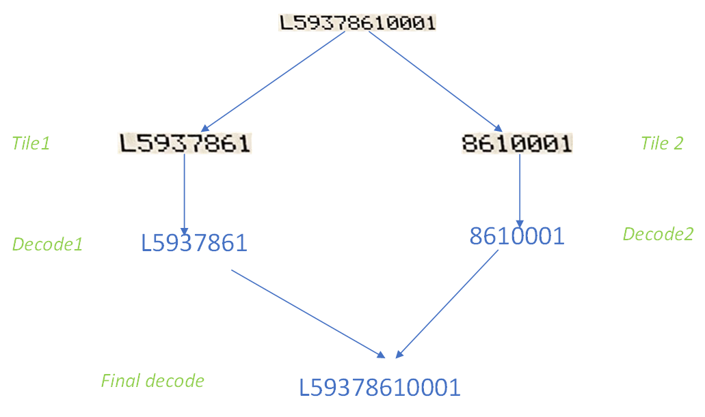
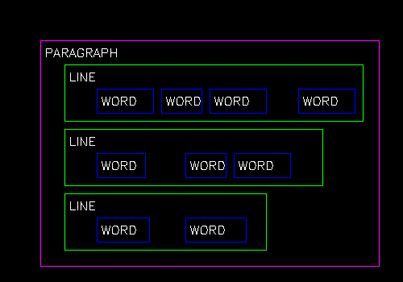
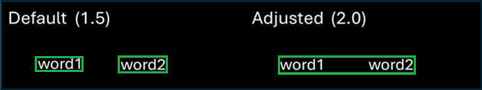
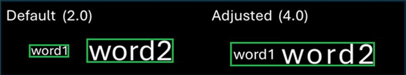
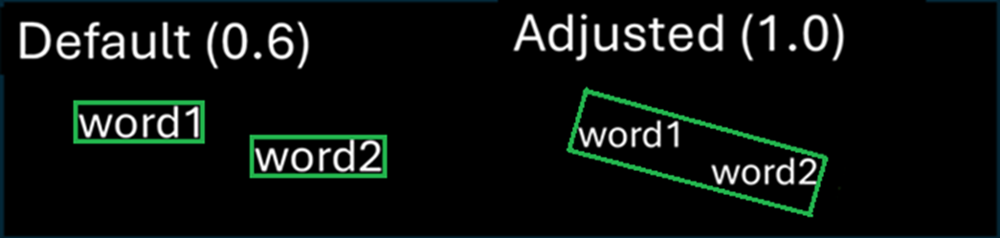
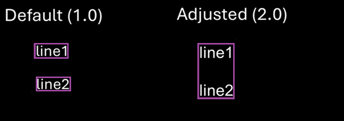
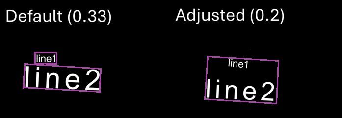

## Overview

The `TextOCR` class leverages Optical Character Recognition (OCR) to detect, recognize, and group text from images. The Text OCR process consists of three stages:

1. **[Text Detection](#textdetecdtion) -** Identifies and filters text boxes within the image.
2. **[Text Recognition](#textrecognition) -** Reads and extracts text content from each identified text box.
3. **[Text Grouping](#textgrouping) -** Organizes recognized words into lines or paragraphs.

This guide begins with initial instructions for basic setup of OCR. Subsequent sections offer a comprehensive list of OCR settings that can be fine-tuned for specific needs:

- [Inferencer Options](../class/inferenceroptions/)
- [Detection Parameters](#detectionparameters)
- [Recognition Parameters](#recognitionparameters)
  - [Tiling Settings](#tilingsettings)
- [Grouper Settings](#groupersettings)

For non-standard use cases, particularly for [Grouper Settings](#groupersettings), developers are encouraged to experiment with and adjust these parameters to optimize performance.

Additionally, the process() method of the `TextOCR` class can be utilized to detect and recognize text within images. This interface enables developers to build CameraX analyzers that integrate with other detectors.

---

## AI Model

The **text-ocr-recognizer** model is designed for text recognition tasks. For more information and to download the model, refer to [Text OCR Model](../model/textocr).

---

## Capabilities

### Supported Characters

TextOCR recognizes a range of characters, including:

        *0123456789abcdefghijklmnopqrstuvwxyzABCDEFGHIJKLMNOPQRSTUVWXYZ!\"#$%&'()*+,-./:;<=>?@[\\]^_`{|}~*

By default, it supports a maximum word length of approximately 15 characters, though this limit may decrease with the use of uncommon fonts. Enabling [tiling](#tilingsettings) removes this restriction.

### Input/Output

**Input Parameters:** The default model input size is 640x640 pixels, but this can be adjusted during runtime initialization.

**Output Parameters:** The output consists of a list of text detections, each accompanied by a list of [complex bounding boxes](../types/#complexbbox) that define the location and content of the detected text.

---

## Configuration

Before starting with TextOCR, configure key settings such as model input size, resolution, and inference type. Changes to these settings will require reinitializing the models. Information on configuring these settings are provided in the sections that follow.

### Model Input Size

The Model Input Size defines the resolution at which the AI processes images. Before analysis, images are resized to this dimension. Adjusting this size balances speed and accuracy.

**Key Considerations:**

- Start with the default resolution 640x640 for optimal processing.
- If the results are not sufficiently accurate for small text, increasing the resolution can improve precision.

<table class="facelift" style="width:20" border="1" padding="5px">  
  <thead>
    <tr bgcolor="#dce8ef">
      <th>Input Size</th>
      <th>Best For</th>
      <th>Use Case</th>
      <th>Consideration</th>
    </tr>
  </thead>
  <tbody>
    <tr>
      <td>Smaller (e.g., 640x640)</td>
      <td>Speed: Faster processing</td>
      <td>Large or close text</td>
      <td>Reduced accuracy for small text</td>
    </tr>
    <tr>
      <td>Larger (e.g., 1600x1600)</td>
      <td>Accuracy: Better for details</td>
      <td>Fine print, distant, or dense text</td>
      <td>Slower processing, higher memory usage</td>
    </tr>
    <tr>
      <td>Custom (Multiples of 32, e.g., 800x800)</td>
      <td>Balancing speed and accuracy</td>
      <td>Low-contrast or medium-sized text</td>
      <td>Requires experimentation to find the optimal setting</td>
    </tr>
  </tbody>
</table>

 

### Resolution

Camera resolution refers to the number of pixels the device’s camera sensor can capture (e.g., 1MP = 1280x720, 8MP = 3840x2160). It determines the quality of the source image before any resizing occurs for AI processing.

Higher camera resolution provides a more detailed and higher-quality original image, which can significantly enhance the AI model's ability to detect and recognize small, faint, or distant text. However, this increased detail comes at the cost of greater processing power and memory usage.

**Key Considerations:**

- **Impact of Camera Resolution -** Higher resolutions enhance input image detail, aiding in recognizing small, low-contrast, or distant text. However, images are downscaled to the model's input size for processing, so the benefits of high-resolution cameras diminish with low model input sizes.
- **General Guidance -** Aim for a minimum text height of 16 pixels in the input image, adjusting for font size and camera distance from the target.

<table class="facelift" style="width:20" border="1" padding="5px">  
  <thead>
    <tr bgcolor="#dce8ef">
      <th>Resolution</th>
      <th>Best For</th>
      <th>Use Case</th>
      <th>Consideration</th>
    </tr>
  </thead>
  <tbody>
    <tr>
      <td>1MP (1280x720)</td>
      <td>Speed, power efficiency</td>
      <td>Large/simple text</td>
      <td>May miss fine details</td>
    </tr>
    <tr>
      <td>2MP (1920x1080)</td>
      <td>General use</td>
      <td>Stylized or moderately detailed text</td>
      <td>Balanced performance</td>
    </tr>
    <tr>
      <td>4MP (2688x1512)</td>
      <td>Detailed scans</td>
      <td>Contracts, forms, dense text</td>
      <td>Higher memory and battery use</td>
    </tr>
    <tr>
      <td>8MP (3840x2160)</td>
      <td>Maximum detail</td>
      <td>Archival purposes</td>
      <td>Large files, diminishing returns for low input sizes</td>
    </tr>
  </tbody>
</table>

 

**Relationship Between Model Input Size and Camera Resolution:**

<table class="facelift" style="width:20" border="1" padding="5px">  
  <thead>
    <tr bgcolor="#dce8ef">
      <th>Resolution</th>
      <th>Low Input Size (e.g., 640x640)</th>
      <th>High Input Size (e.g., 1600x1600)</th>
    </tr>
  </thead>
  <tbody>
    <tr>
      <td><strong>Low Resolution (e.g., 1MP / 1280x720)</strong></td>
      <td>
        <strong>Speed:</strong> Fastest 
        <strong>Accuracy:</strong> Lowest 
        <strong>Use Case:</strong> Large, clear text close to the camera 
        <strong>Note:</strong> Small/fine details may be lost
      </td>
      <td>
        <strong>Not Recommended:</strong> Wasted computation with little accuracy gain
      </td>
    </tr>
    <tr>
      <td><strong>High Resolution (e.g., 8MP / 3840x2160)</strong></td>
      <td>
        <strong>Speed:</strong> Fast 
        <strong>Accuracy:</strong> Moderate 
        <strong>Use Case:</strong> Large/medium text, quick scans 
        <strong>Note:</strong> High-resolution source is downsampled for AI, so small text may still be missed
      </td>
      <td>
        <strong>Speed:</strong> Slowest 
        <strong>Accuracy:</strong> Highest 
        <strong>Use Case:</strong> Detailed, small, dense, or distant text 
        <strong>Note:</strong> High memory and battery usage; may stress low-end devices
      </td>
    </tr>
  </tbody>
</table>

 

### Inferencer Type (Processor)

The **Inferencer Type** specifies which chip on the device is responsible for performing AI computations (referred to as "inference"). This choice directly impacts the speed and efficiency of image processing.

**Key Considerations:**

- **DSP (Digital Signal Processor) -** Use DSP if available, as it is specifically designed for real-time, energy-efficient AI tasks and provides optimal performance.
- **GPU (Graphics Processing Unit) -** If DSP is not available, the GPU serves as an alternative for handling AI workloads efficiently.

<table class="facelift" style="width:20" border="1" padding="5px">  
  <thead>
    <tr bgcolor="#dce8ef">
      <th>Processor</th>
      <th>Description</th>
      <th>Performance</th>
      <th>Use Case</th>
      <th>Device Platform</th>
    </tr>
  </thead>
  <tbody>
    <tr>
      <td><strong>DSP (Digital Signal Processor)</strong></td>
      <td>
        Optimized for real-time, energy-efficient tasks. Ideal for specific AI workloads where battery life and efficiency are critical.
      </td>
      <td>
        <ul>
          <li><strong>Best:</strong> Fastest and most efficient.</li>
          <li>Preserves battery life during continuous use.</li>
        </ul>
      </td>
      <td>
        Best choice for real-time, low-energy tasks such as edge AI inference.
      </td>
      <td><strong>Best for:</strong> SD6490, SD5430 FP2; for relevant device models, visit <a href="https://support.zebra.com/article/000022440">Zebra Platform Devices</a></td>
    </tr>
    <tr>
      <td><strong>GPU (Graphics Processing Unit)</strong></td>
      <td>
        Designed for heavy, parallel AI tasks and complex models. Suitable for computationally intensive workloads.
      </td>
      <td>
        <ul>
          <li><strong>Good:</strong> High-speed performance but consumes more power than DSP.</li>
          <li>Handles large-scale parallel tasks effectively.</li>
        </ul>
      </td>
      <td>
        Best for handling complex AI models or tasks requiring significant computational power.
      </td>
      <td><strong>Best for:</strong> SD4490, SD5430 FP1 <strong>Good for:</strong> SD6490, SD5430 FP2; for relevant device models, visit <a href="https://support.zebra.com/article/000022440">Zebra Platform Devices</a></td>
    </tr>
    <tr>
      <td><strong>CPU (Central Processing Unit)</strong></td>
      <td>
        Acts as the fallback processor for AI inference tasks. Always available but less efficient compared to DSP and GPU.
      </td>
      <td>
        <ul>
          <li><strong>Fallback:</strong> Slower and less efficient but always available.</li>
          <li>Consumes more power, making it less suitable for continuous tasks.</li>
        </ul>
      </td>
      <td>
        Suitable for lightweight tasks or as a fallback when DSP or GPU are unavailable or causing issues.
      </td>
      <td><strong>Fallback for:</strong> SD6490, SD4490, SD5430 FP2, SD5430 FP1; for relevant device models, visit <a href="https://support.zebra.com/article/000022440">Zebra Platform Devices</a></td>
    </tr>
  </tbody>
</table>

## <!--

## Stages of TextOCR

The **Text OCR** process consists of three stages:

1. **Text Detection -** Identifies and filters text boxes within the image
2. **Text Recognition -** Reads and extracts text content from each identified text box.
3. **Text Grouping -** Organizes recognized words into lines or paragraphs.

Information about each stage is provided in the subsequent sections.

### Stage 1: Text Detection

The text detection process occurs in two main stages:

1. **Heatmap Threshold (Pixel-Level Filtering) -** A heatmap is generated where each pixel is assigned a score indicating the likelihood of it being part of a text character. The **Heatmap Threshold** filters out individual pixels based on these scores, retaining only the most probable candidates.
2. **Box Threshold (Box-Level Filtering) -** After pixel filtering, the system identifies groups of pixels and draws bounding boxes around them. Each box is assigned a confidence score, and the **Box Threshold** filters out boxes with low confidence, retaining only those likely to contain text.

#### Filtering Parameters

Once potential text boxes are identified, additional filtering can be applied to refine results by eliminating noise or unwanted detections. These filters also allow adjustments to the image and bounding box handling:

- **Min Box Size (Filtering Narrow Boxes) -** Removes text boxes that are too narrow or short, such as underscores, divider lines, or other elongated shapes that are unlikely to contain text.
- **Min Box Area (Filtering Small Boxes) -** Excludes text boxes with a total area (width × height) that is too small. This is particularly effective for ignoring noise such as tiny specks or dots in the image.
- **Unclip Ratio (Expanding Box Size) -** Expands the bounding boxes after they are detected but before text recognition occurs. Initial bounding boxes are often tightly fitted to the text, and this parameter increases their size to include some background, improving text recognition accuracy.
- **Min Ratio for Rotation (Handling Vertical Text) -** Rotates vertically oriented boxes (e.g., bottom-up or top-down text) to a horizontal orientation for better recognition. Applies only to boxes with a height-to-width ratio exceeding the specified value, rotating them 90 degrees to facilitate decoding.

<table class="facelift" style="width:20" border="1" padding="5px">  
  <thead>
    <tr bgcolor="#dce8ef">
      <th>Parameter</th>
      <th>Description</th>
      <th>Guidance</th>
    </tr>
  </thead>
  <tbody>
    <tr>
      <td><strong>Heatmap Threshold</strong></td>
      <td>
        Minimum pixel confidence for potential text regions. (Pixel-level filtering)
      </td>
      <td>
        <ul>
          <li><strong>↑</strong> To cut noise, best for clear text or high contrast.</li>
          <li><strong>↓</strong> To capture faint, curved, or blurred text with low contrast.</li>
        </ul>
      </td>
    </tr>
    <tr>
      <td><strong>Box Threshold</strong></td>
      <td>
        Filters detected boxes by their overall confidence. (Box-level filtering)
      </td>
      <td>
        <ul>
          <li><strong>↑</strong> To reduce false positives.</li>
          <li><strong>↓</strong> To catch weak detections.</li>
        </ul>
      </td>
    </tr>
    <tr>
      <td><strong>Min Box Size</strong></td>
      <td>
        Filters out text boxes that are too narrow or too short. (Filtering "skinny" boxes)
      </td>
      <td>
        <ul>
          <li><strong>↑</strong> To ignore divider lines, underscores, or non-text lines.</li>
          <li><strong>↓</strong> To detect smaller text.</li>
        </ul>
      </td>
    </tr>
    <tr>
      <td><strong>Min Box Area</strong></td>
      <td>
        Filters out text boxes if their total area (width × height) is too small. (Filtering "tiny" boxes)
      </td>
      <td>
        <ul>
          <li><strong>↑</strong> To eliminate dust, dots, or tiny artifacts.</li>
          <li><strong>↓</strong> To allow smaller text or marks.</li>
        </ul>
      </td>
    </tr>
    <tr>
      <td><strong>Unclip Ratio</strong></td>
      <td>
        Expands or "stretches" detected boxes outward to include full characters and some background. (Expands box size)
      </td>
      <td>
        <ul>
          <li><strong>↑</strong> For curved, rotated, or incomplete detections.</li>
          <li><strong>↓</strong> To avoid overlapping with neighboring text regions or noisy regions.</li>
        </ul>
      </td>
    </tr>
    <tr>
      <td><strong>Min Ratio for Rotation</strong></td>
      <td>
        Rotates vertically (high height, low width) oriented boxes so they become horizontal. (Rotates vertical boxes)
      </td>
      <td>
        Only adjust if the images contain many rotated texts (e.g., upright or vertical text).
      </td>
    </tr>
  </tbody>
</table>

**Legend:**

- **↑:** Increase the value of the parameter.
- **↓:** Decrease the value of the parameter.

### Stage 2: Text Recognition

After text boxes are detected, the next step is to extract and accurately read the text within each bounding box.
Frontline AI Enabler uses the **"Total" decoder** to convert character predictions into meaningful words, even in cases where the model is uncertain about specific characters.

The **"Total" decoder** evaluates all possible character options for each position and balances confidence and flexibility using two key parameters: **TopK Ignore Cutoff, Total Prob Threshold,** and **Max Word Combinations.** These parameters act as filters to refine predictions and determine the final output.

#### Decoder Parameters

<table class="facelift" style="width:20" border="1" padding="5px">  
  <thead>
    <tr bgcolor="#dce8ef">
      <th>Parameter</th>
      <th>Description</th>
      <th>Guidance</th>
      <th>Example</th>
    </tr>
  </thead>
  <tbody>
    <tr>
      <td><strong>TopK Ignore Cutoff</strong>   <i>The Gatekeeper</i></td>
      <td>
        The maximum number of highest-confidence character predictions the "Total" decoder considers for each character position. If additional are needed to meet the <b>Total Prob Threshold,</b> the model outputs a replacement character (e.g., "�").
      </td>
      <td>
        <ul>
          <li><strong>↑</strong> If the desired character isn’t appearing, allow more guesses.</li>
          <li>Leave at default for most cases; adjust only if necessary.</li>
        </ul>
      </td>
      <td>
        <strong>Example:</strong>  
        If predictions are: 'S' (40%), 's' (30%), '5' (15%), 'B' (5%), '8' (2%) And the cutoff is set to 4, only the top four predictions ('S', 's', '5', 'B') are retained. '8' and lower-ranked options are discarded.
      </td>
    </tr>
    <tr>
      <td><strong>Total Prob Threshold</strong>   <i>The Quality Check</i></td>
      <td>
        The minimum cumulative confidence score required for a word prediction to be accepted. If the total score is below the threshold, the model outputs a replacement character (e.g., "�").
      </td>
      <td>
        <ul>
          <li><strong>↑</strong> For more flexible but potentially noisier results.</li>
          <li><strong>↓</strong> For more trustworthy, reliable outputs.</li>
        </ul>
      </td>
      <td>
        <strong>Example:</strong> Using the predictions above, their combined confidence is:  
        0.40 (S) + 0.30 (s) + 0.15 (5) + 0.05 (B) = 0.90. If the threshold is 0.85, the decoder proceeds. If the combined score is less, it outputs a replacement character (e.g., "�").
      </td>
    </tr>
    <tr>
      <td><strong>Max Word Combinations</strong>   <i>Result Limiter</i></td>
      <td>
        Restricts the number of valid word outputs generated from possible character combinations for each detection. This helps avoid overwhelming results, particularly for ambiguous inputs, by limiting the model’s consideration of all potential character combinations across all positions in the word.
      </td>
      <td>
        <ul>
          <li><strong>↑</strong> For tougher, longer words to see more possible outputs.</li>
          <li><strong>↓</strong> For faster processing and fewer alternatives.</li>
        </ul>
      </td>
      <td>
        <strong>Example:</strong> Suppose there are 20 possible valid word combinations after applying the above filters. If Max Word Combinations is set to 5, only the top 5 most confident word outputs are returned. The other 15 combinations are ignored, even if valid.
      </td>
    </tr>
  </tbody>
</table>

**Legend:**

- **↑:** Increase the value of the parameter.
- **↓:** Decrease the value of the parameter.

#### Recognition: Special Cases

These features are designed for specific scenarios and are generally not required for most OCR tasks. Use them only when needed to address unique text recognition challenges.

##### Flip

Runs recognition in multiple orientations to improve accuracy for rotated or flipped text. While this increases accuracy for text in varying orientations, it also adds processing time.

<table class="facelift" style="width:20" border="1" padding="5px">  
  <thead>
    <tr bgcolor="#dce8ef">
      <th>What It Does</th>
      <th>When/How to Adjust It</th>
    </tr>
  </thead>
  <tbody>
    <tr>
      <td>
        Runs recognition in multiple orientations to handle rotated or flipped text.
      </td>
      <td>
        <ul>
          <li><strong>Enable:</strong> If text orientation varies significantly.</li>
          <li><strong>Disable:</strong> For standard horizontal text to reduce processing time.</li>
        </ul>
      </td>
    </tr>
  </tbody>
</table>

##### Tiling

Splits very long, thin lines of text (e.g., serial numbers, document titles, part numbers) into smaller, manageable "tiles" for better recognition. This is useful when a word box exceeds the recognition limit (15 characters). While tiling improves accuracy, it also adds processing time, so it should be used only when necessary.

<table class="facelift" style="width:20" border="1" padding="5px">  
  <thead>
    <tr bgcolor="#dce8ef">
      <th>Parameter</th>
      <th>What It Does</th>
      <th>When/How to Adjust It</th>
    </tr>
  </thead>
  <tbody>
    <tr>
      <td><strong>Aspect Ratio Lower Threshold</strong></td>
      <td>
        Sets the minimum width-to-height ratio for boxes to be tiled. Only boxes wider than this value are tiled, helping to control which boxes are considered "elongated."
      </td>
      <td>
        <ul>
          <li><strong>↑</strong> To tile only very long boxes.</li>
          <li><strong>↓</strong> To tile shorter boxes, resulting in more tiled boxes.</li>
        </ul>
      </td>
    </tr>
    <tr>
      <td><strong>Aspect Ratio Upper Threshold</strong></td>
      <td>
        Sets the maximum width-to-height ratio for boxes to be tiled. Only boxes up to this ratio get tiled. This prevents extremely long or oddly shaped boxes from being tiled.
      </td>
      <td>
        <ul>
          <li><strong>↑</strong> To allow longer boxes to be tiled.</li>
          <li><strong>↓</strong> To avoid tiling very stretched or oddly shaped boxes.</li>
        </ul>
      </td>
    </tr>
    <tr>
      <td><strong>TopK Merged Predictions</strong></td>
      <td>
        Limits the number of "best guess" decodes returned after tiling.
      </td>
      <td>
        <ul>
          <li><strong>↑</strong> To see more possible results for review.</li>
          <li><strong>↓</strong> For fewer, faster results.</li>
        </ul>
      </td>
    </tr>
  </tbody>
</table>

**Legend:**

- **↑:** Increase the value of the parameter.
- **↓:** Decrease the value of the parameter.

### Stage 3: Text Grouping

**Text grouping** is used to organize OCR results into logical chunks, such as lines and paragraphs, for better structure and readability. The grouping process relies on several parameters that define spacing, alignment, and font size differences.

<table class="facelift" style="width:20" border="1" padding="5px">  
  <thead>
    <tr bgcolor="#dce8ef">
      <th>Parameter</th>
      <th>What It Does</th>
      <th>When/How to Adjust It</th>
    </tr>
  </thead>
  <tbody>
    <tr>
      <td><strong>Width Distance Ratio</strong></td>
      <td>
        Defines how much space is allowed between words before they are considered part of separate lines.
      </td>
      <td>
        <ul>
          <li><strong>↑</strong> If wide spaces between words should still be grouped in the same line.</li>
          <li><strong>↓</strong> If words are being incorrectly joined into the same line.</li>
        </ul>
      </td>
    </tr>
    <tr>
      <td><strong>Height Distance Ratio</strong></td>
      <td>
        Allows grouping of words into a single line even if their font sizes are significantly different.
      </td>
      <td>
        <ul>
          <li><strong>↑</strong> If words with different font sizes should be grouped together in a line.</li>
          <li><strong>↓</strong> If large font-size differences are causing messy groupings.</li>
        </ul>
      </td>
    </tr>
    <tr>
      <td><strong>Center Distance Ratio</strong></td>
      <td>
        Enables grouping of words into a single line even if they are not perfectly aligned (e.g., curved or wavy text).
      </td>
      <td>
        <ul>
          <li><strong>↑</strong> If curved or zigzag text should be grouped in the same line.</li>
          <li><strong>↓</strong> If only straight lines should be grouped together.</li>
        </ul>
      </td>
    </tr>
    <tr>
      <td><strong>Paragraph Height Distance</strong></td>
      <td>
        Specifies the maximum distance between lines that can still be grouped into the same paragraph.
      </td>
      <td>
        <ul>
          <li><strong>↑</strong> If lines spaced far apart should still be grouped into one paragraph.</li>
          <li><strong>↓</strong> If too many lines are being grouped into a single paragraph.</li>
        </ul>
      </td>
    </tr>
    <tr>
      <td><strong>Paragraph Height Ratio Threshold</strong></td>
      <td>
        Allows lines with very different heights (font sizes) to be grouped into the same paragraph.
      </td>
      <td>
        <ul>
          <li><strong>↑</strong> If lines with similar font sizes should be grouped.</li>
          <li><strong>↓</strong> To allow lines with very different font sizes to be grouped together.</li>
        </ul>
      </td>
    </tr>
  </tbody>
</table>

**Legend:**

- **↑:** Increase the value of the parameter.
- **↓:** Decrease the value of the parameter.

## -->

## Developer Guide

This guide outlines the process for using TextOCR to detect and recognize text within images, from initialization to outputting the identified text.

### Step 1: Initialization

Follow these steps to set up and initialize a `TextOCR` object:

1.  **Import the TextOCR class:** Use `com.zebra.ai.vision.detector.TextOCR`.
2.  **Initialize the SDK:** Use your application's context object and invoke `init()` from the [AIVisionSDK](../class/aivisionsdk/) class.
3.  **Configure OCR Settings:** Create a `TextOCR.Settings` object.
4.  **Optional: Set model input dimensions:** If needed, customize the model input dimensions (height and width). These should be multiples of 32 (e.g., 640). For guidance, see [Model Input Size](#modelinputsize).

        settings.detectionInferencerOptions.defaultDims.width = [your value];
        settings.detectionInferencerOptions.defaultDims.height = [your value];

    - **Smaller Input Sizes -** Reduce processing time and increase speed, but may decrease accuracy. Ideal for larger or closer text.
    - **Larger Input Sizes -** Improve accuracy for smaller or more distant text, but increase inference time. An input size that is too large may cause out-of-memory errors and potentially cause an application crash at run-time.

5.  **Optional: Configure the additional OCR settings to optimize detection and recognition:**
    - [Inferencer Options](../class/inferenceroptions/)
    - [Detection Parameters](#detectionparameters)
    - [Recognition Parameters](#recognitionparameters)
      - [Grouper Settings](#groupersettings)
    - [Tiling Settings](#tilingsettings)

6.  **Initialize the OCR object -** Declare a `TextOCR` object. Use `CompletableFuture` to initialize it asynchronously with an `Executor` for concurrent processing.
7.  **Callback Handling -** Use `thenAccept()` to assign the initialized `TextOCR` object to the `textocr` variable, enabling it for text detection tasks like barcodes and products in images.

#### Sample Code

Initialization sample code:

        import com.zebra.ai.vision.detector.TextOCR;

        // Initialize the SDK
        AIVisionSDK.getInstance(Context).init(); // Context refers to application context object.

        //Initialize TextOCR settings object
        String mavenModelName = "text-ocr-recognizer";
        TextOCR.Settings  settings = new TextOCR.Settings(mavenModelName);

        // Optional: Override the default model input size
        settings.detectionInferencerOptions.defaultDims.width = 1280;
        settings.detectionInferencerOptions.defaultDims.height = 1280;

        // Optional – Set runtime processor order to load the model
        Integer[] rpo = new Integer[3];
        rpo[0] = InferencerOptions.DSP;
        rpo[1] = InferencerOptions.CPU;
        rpo[2] = InferencerOptions.GPU;
        settings.detectionInferencerOptions.runtimeProcessorOrder = rpo;
        settings.recognitionInferencerOptions.runtimeProcessorOrder = rpo;

        // Initialize OCR object
        TextOCR textocr = null;

        // Initialize textocr
        // settings = TextOCR.Settings object created above
        // Executor = An executor thread for returning results
        CompletableFuture<TextOCR> futureObject = TextOCR.getTextOCR(settings, executor);

        // Use the futureObject to implement the thenAccept() callback of CompletableFuture
        futureObject.thenAccept (OCRInstance -> {
            // Use the Textocr object returned here for detecting barcodes/shelves/products
            textocr = OCRInstance;
        }).exceptionally(e ->{
            if (e instanceof AIVisionSDKException) {
                Log.e(TAG, "[AIVisionSDKException] TextOCR object creation failed: " + e.getMessage());
            }
            return null;
        });

### Step 2: Capture Image

Capture the image and ensure the image is in the form of a Bitmap. For CameraX-based applications, developers may build their own custom ImagerAnalyzers to feed a sequence of frames to the TextOCR interface. For more information, refer to [CameraX](../camerax).

### Step 3: Recognize Text

There are two methods to recognize text within an image:

- **`process()` API Method:** Suitable for applications requiring both text localization and recognition in a single operation. This method is particularly well-suited for integration with frameworks like CameraX to enable a streamlined workflow where image analysis and text detection occur simultaneously. Typical Use Cases:
  - **Integration with CameraX -** Used for application that utilize CameraX for image analysis. The process() method can serve as a detector for CameraX analyzers, enabling real-time text detection directly from camera feeds.
  - **ImageData Objects -** Accepts `ImageData` objects from various sources, including CameraX, Camera2 APIs, or local storage, offering flexibility in handling input images.
  - **Organized Text Output -** In addition to detecting text, the process() method organizes the recognized text into paragraphs, lines, and words, returning detailed `ParagraphEntity` objects.
  - **Localization and Recognition -** Ideal for scenarios where detecting and recognizing text paragraphs in one step is required, simplifying the process and improving efficiency.
- **`detect()` API Method:** Suitable for applications that require straightfoward text detection without detailed structural information or for those working directly with bitmap images. This method offers a simpler interface for retrieving processed results asynchronously. Typical Use Cases:
  - **Bitmap Images-** For applications that primarily handle bitmap images, the `detect()` method enables direct input of bitmap data for text detection.
  - **Basic Detection Requirements -** Suitable for scenarios where generic text, words, or paragraphs required to be detected without additional structural details.
  - **Asynchronous Processing -** Supports asynchronous detection operations using executors, making it well-suited for applications that perform background processing.

Choose one of these methods to recognize text within an image.

#### > Method 1: Using Process() API

The `process()` method in the TextOCR class enables applications to pass an `ImageData` object and perform both text localization and recognition in a single operation, based on the provided settings. This interface is designed to function as a "detector" for CameraX analyzers and can be used alongside other detectors, such as the `BarcodeDecoder`.

Note:
Applications can use the process() API even if they are not implementing the CameraX ImageAnalyzer interface. ImageData objects from other sources, such as Camera2 APIs or local storage, can also be passed to the process() API. In such cases, skip steps a and b below.

**Steps to Use the process() Method:**

1. **Implement `ImageAnalysis.Analyzer` -** Develop a custom CameraX analyzer by implementing the `ImageAnalysis.Analyzer` interface.
2. **Override `analyze()` -** CameraX continuously feeds frames to the analyzers that are bound to it. Override the analyze() method to define the specific functionalities required for your application.
3. **Prepare Inputs -** The `process()` method requires an `ImageData` object. Use the helper methods provided by `ImageData` to convert source image types (e.g., ImageProxy, Android.media.image, or Bitmap) into the required format.
4. **Localize and Decode Paragraphs -** Use the `process()` method to detect and decode paragraphs. The method outputs a `ParagraphEntity` object.
5. **Handle Results -** Once the CompletableFuture completes, process the decoded paragraph. From the `ParagraphEntity` object, extract `LineEntity` lines using the `getLineEntities()` method. Similarly, extract words from the `LineEntity` object using the `getWordEntities()` method.
6. **Dispose of the Decoder -** After decoding is complete and the `TextOCR` instance is no longer needed, dispose of the instance to release resources.

Sample Code:

        List<ParagraphEntity> resultList = textocr.process(ImageData.fromImageProxy(image)).get();
        for (ParagraphEntity entity: resultList) {

            // Access detection confidence
            float confidence = entity.getAccuracy();

            // Access bounding box
            Rect boundingBox = entity. getBoundingBox();

            // Iterate over list of paragraph entity
            for (ParagraphEntity entity : list) {
                // Access lines from paragraph entity
                Line[] lines = entity.getTextParagraph().lines;

                // Iterate over list of lines
                for (Line line : lines) {
                    // Access words from lines entity
                    for (Word word : line.words) {
                        //Access the Bounding Box of the Word
                        ComplexBBox bbox = word.bbox;

                        //Access the text of the Word
                        DecodedText[] decodedTexts = word.decodes;

                        // Get the decoded text with highest accuracy at first index
                        String decodedValue = word.decodes[0].content;
                    }
                }
            }
        }

#### > Method 2: Using detect() API

Use of detect() API allows a bitmap image to be passed and the processed results to be retrieved asynchronously as [ComplexBoundingBox](../types/#complexbbox) objects. This can then be parsed in the desired format – as generic text, words or paragraphs.

- **Generic Text -** Outputs text in [complex bounding boxes](../types/#complexbbox).

  Sample code:

        Bitmap image = ... // Your bitmap image here

        // Initialize executor
        Executor executor = Executors.newFixedThreadPool(1);

        // Input parameters include a bitmap image and an executor thread object for performing detections
        CompletableFuture<OCRResult[]> futureResult = textocr.detect(bitmap,executor);

        futureResult.thenAccept (ocrResults -> {
            // Process the returned output that contains complex bounding boxes and text within

            if (e instanceof AIVisionSDKException) {
                Log.e(TAG, "[AIVisionSDKException] Error in text detection: " + e.getMessage());
            }
            return null;
        });

        // Once finished with the textOCR object, dispose of it to release resources and memory used during detection.
        textOCR.dispose();

- **Words –** Outputs an array of [words](../types/#word). A word is a discrete unit of text identified within an image, typically separated by spaces or punctuation.

  Sample code:

        Bitmap image = ... // Your bitmap image here

        // Initialize executor
        Executor executor = Executors.newFixedThreadPool(1);

        // Input parameters include a bitmap image and an executor thread object for performing detections
        CompletableFuture<Word[]> futureWords = textocr.detectWords(bitmap,executor);

        futureWords.thenAccept (words -> {
            // Process the returned array of detected words

            if (e instanceof AIVisionSDKException) {
                    Log.e(TAG, "[AIVisionSDKException] Error in text detection: " + e.getMessage());
            }
            return null;
        });

        // Once finished with the textOCR object, dispose of it to release resources and memory used during detection
        textOCR.dispose();

- **Paragraphs -** Outputs a hierarchical structure of [paragraphs](../types/#textparagraph) using the grouping mechanism described in [Grouper Settings](#textocrgroupersettings). A paragraph is formed by grouping words that appear on the same line, and these lines are then organized into paragraphs. The process is parameterized, with relevant parameters detailed in the Grouper Settings.

  Sample code:

        Bitmap image = ... // Your bitmap image here

        // Initialize executor

        Executor executor = Executors.newFixedThreadPool(1);

        // Input parameters include a bitmap image and an executor thread object for performing detection
        CompletableFuture<Paragraph[]> futureTextParagraph = textOCR.detectParagraphs(bitmap,executor);

        futureTextParagraph.thenAccept (paragraphs -> {
            // Process the returned array of detected paragraphs.

            if (e instanceof AIVisionSDKException) {
                    Log.e(TAG, "[AIVisionSDKException] Error in text detection: " + e.getMessage());
            }
            return null;
        });

        // Once finished with the textOCR object, dispose of it to release resources and memory used during detection
        textOCR.dispose();

---

### Best Practices

This section provides recommendations to improve recognition accuracy across a variety of use cases, from special characters and long words to handwritten text and numeric data. Strategic adjustments to input size, tiling, ROI, and other OCR settings can significantly enhance performance while balancing processing time and application requirements.

- **Improving Recognition Accuracy of Special Characters (e.g., '$') -** Enable tiling and use higher resolutions to provide the model with more detailed input for processing.

- **Recognizing Isolated Characters in Confined Spaces -** Increase the model input size and enable tiling for reliable detection of isolated characters, such as those within square boxes.

- **Handling Long Words and Numbers -** Use larger input sizes and enable tiling to ensure complete detection of lengthy text strings (e.g., 20 to 45 characters) and improve recognition accuracy. Although enabling tiling may increase processing time, its benefits are: - Enhances detection of numbers, such as images of analog meters by helping to align and cover text within the display more accurately. - Reduces noise and improves accuracy if the OCR feature outputs junk data, especially in images with cluttered or overlapping text elements. - Enhances the mode's ability to handle text beyond typical recognition limits.
  Balancing higher resolutions and larger input sizes with processing time is crucial to meet application needs without unnecessary delays. Increased accuracy often requires longer processing, so finding the right balance is essential.

- **Improving Text Detection on Cylindrical Objects (e.g., Coca-Cola tin bottle)-** Use the Region of Interest (ROI) technique to focus on specific areas of uneven surfaces, enhancing accuracy. If values are not accurate when reading from a distance (e.g., 3 feet or more), increase the input size for better precision, ensuring the model captures finer details necessary for accurate recognition at greater distances. If special characters and alphabets are not consistently appearing, adjust the minimum box size and box threshold to improve the detection of isolated characters and reduce ambiguity.

- **Improving Accuracy for Consecutive Handwritten Characters -** Modify the unclip ratio to ensure accurate alignment and representation of character sequences. For incorrect numeric values decoded in OCR (e.g., tires), review and fine-tune OCR settings for numeric data accuracy.

---

## Methods

### TextOCR (Settings settings)

        TextOCR.TextOCR(Settings settings) throws IOException

**Description:** Initializes the OCR with the specified settings, allowing subsequent text detection and analysis on image inputs. It checks for the necessary model file and verifies the integrity of the archive. If issues are detected, appropriate exceptions are thrown.

**Parameters:**

- **settings TextOCR.Settings -** An instance of the `Settings` class containing configuration options for the OCR engine.

**Return Value:** `CompletableFuture`&lt;TextOCR&gt;

**Exceptions:**

- **IOException -** Thrown if the archive is corrupted.

---

### detect (Bitmap srcImg, Executor executor)

        CompletableFuture<OCRResult[]> detect (Bitmap srcImg, Executor executor) throws InvalidInputException, AIVisionSDKException

**Description:** Performs Optical Character Recognition (OCR) on the provided Bitmap image, using the specified executor for asynchronous execution.

**Parameters:**

- **srcImg (Bitmap srcImg) -** The Bitmap image to perform OCR on.
- **executor -** Manages asynchronous task execution.

**Return Value:** A `CompletableFuture` that resolves to an array of [OCRResult](../types/#ocrresult), each containing [complex bounding boxes](../types/#complexbbox) and recognized text.

**Exceptions:**

- **InvalidInputException -** Thrown if the Bitmap is null.
- **AIVisionSDKException -** Thrown if error in detection or image queue is full.

---

### detectWords (Bitmap srcImg, Executor executor)

        CompletableFuture<Word[]> TextOCR.detectWords (Bitmap srcImg, Executor executor) throws InvalidInputException, AIVisionSDKException

**Description:** Detects individual words in the provided Bitmap image using the specified executor for asynchronous execution.

**Parameters:**

- **srcImg (Bitmap srcImg) -** The image to analyze for word detection.
- **Executor -** Manages asynchronous task execution.

**Return Value:** A `CompletableFuture` that resolves to an array of Word objects, each containing [complex bounding boxes](../types/#complexbbox) and possible text decodes.

**Exceptions:**

- **InvalidInputException -** Thrown if the Bitmap is null.
- **AIVisionSDKException -** Thrown if there is an error in detection or the image queue is full.

---

### detectParagraphs (Bitmap srcImg, Executor executor)

        CompletableFuture<TextParagraph[]> detectParagraphs(Bitmap srcImg, Executor executor) throws InvalidInputException, AIVisionSDKException

**Description:** Detects paragraphs in the provided Bitmap image using the specified executor for asynchronous execution.

**Parameters:**

- **srcImg (Bitmap srcImg) -** The image to analyze for paragraph detection.
- **executor -** Manages asynchronous task execution.

**Return Value:** A `CompletableFuture` that resolves to an array of TextParagraph objects, representing detected paragraphs.

**Exceptions:**

- **InvalidInputException -** Thrown if the Bitmap is null.
- **AIVisionSDKException -** Thrown if the AI Data Capture SDK is not initialized.

---

### getTextOCR (Settings settings, Executor executor)

        CompletableFuture<TextOCR> getTextOCR(Settings settings, Executor executor) throws InvalidInputException, AIVisionSDKSNPEException, AIVisionSDKException, AIVisionSDKModelException, AIVisionSDKLicenseException

**Description:** Asynchronously initializes and retrieves a TextOCR instance using the specified settings and executor.

**Parameters:**

- **Settings -** An instance of `TextOCR.Settings` containing configuration options for the OCR engine.
- **executor -** Manages asynchronous task execution.

**Return Value:** A `CompletableFuture` that resolves to an initialized TextOCR instance.

**Exceptions:**

- **InvalidInputException -** Thrown if the settings are invalid or null.
- **AIVisionSDKSNPEException -** Thrown if SNPE fails to initialize.
- **AIVisionSDKException -** Thrown if the AI Vision SDK is not initialized.
- **AIVisionSDKModelException -** Thrown if the current SDK version is below the minimum required version. To resolve this, update the SDK to a newer or the latest version.
- **AIVisionSDKLicenseException -** Thrown if there are licensing issues related to the text-ocr-recognizer model.

---

### process (ImageData imageData, Executor executor)

        CompletableFuture<List<ParagraphEntity>> process(ImageData imageData, Executor executor) throws AIVisionSDKException

Processes an image to detect text paragraphs, organizing the detected text into words, lines, and paragraphs. This method executes asynchronously and returns a CompletableFuture that can be used to retrieve the results once they are available.

**Parameters:**

- **imageData -** The image data to be processed for text detection.
- **executor -** Results are returned in this executor.

**Return Value:**

- **CompletableFuturet&lt;List&lt;ParagraphEntity&gt;&gt; -** A future that completes with a list of `ParagraphEntity` objects representing the detected text.

**Exceptions:**

- **AIVisionSDKException -** Thrown if the image queue size limit of 5 is exceeded.

---

### process(ImageData imageData)

        CompletableFuture<List<ParagraphEntity>> process(ImageData imageData) throws InvalidInputException, AIVisionSDKException

Processes an image to detect text paragraphs and organizes text into words, lines, and paragraphs.

**Parameters:**

- **imageData -** The image data to be processed.

**Return Value:**
Returns a CompletableFuture&lt;List&lt;ParagraphEntity&gt;&gt; containing the detected text.

**Exceptions:**

- **InvalidInputException -** Thrown if `imageData` is null.
- **AIVisionSDKException -** Thrown if the image queue size limit of 5 is exceeded.

---

### dispose()

        void dispose()

**Description:** Releases all internal resources used by the TextOCR object. This function must be called manually to free up resources.

---

## TextOCR.Settings

The `Settings` class is a nested class within the `TextOCR class`, which leverages Optical Character Recognition (OCR) to detect, recognize, and group text from images. The flexibility of its parameters allows developers to fine-tune performance for diverse use cases, including document scanning, real-time recognition, and automated data entry.

---

### Constructors

#### Settings(String mavenModelName)

        TextOCR.Settings textOCRSettings = new TextOCR.Settings(mavenModelName) throws InvalidInputException,AIVisionSDKException;

**Description:** Constructor for the `Settings` object with model name.

**Parameters:**

- **mavenModelName -** The name of the model specified in the Maven repository.

**Exceptions:**

- **InvalidInputException -** Thrown if the mavenModelName is invalid.
- **AIVisionSDKException -** Thrown if an error occurs while reading the specified model or the AI Data Capture SDK is not initialized.

#### Settings(File ModelFile)

        TextOCR.Settings textOCRSettings = new TextOCR.Settings(modelFile) throws InvalidInputException,AIVisionSDKException;

**Description:** Constructs a new Settings object with File object passed.

**Parameters:**

- **ModelFile -** The file object that contains the Text OCR model.

**Exceptions:**

- **InvalidInputException -** Thrown if the modelFile is invalid.
- **AIVisionSDKException -** Thrown if an error occurs while reading the specified model or the AI Data Capture SDK is not initialized.

---

## Text Detection

The Detection phase processes the input image to create [complex bounding boxes](../types/#complexbbox), or text boxes. Each text box is represented by a list of points forming a rotated rectangle, which may not be perfectly aligned with the screen’s edges. There may be more than four points if the rectangle is clipped at the edges of the screen. Adjusting Detection Parameters allows for improved accuracy, catering to specific use cases like document scanning, real-time text recognition, or automated data entry.

Typical scenarios for adjusting Detection Parameters:

- **Document Scanning:** Digitize documents by extracting text for storage and retrieval.
- **Real-Time Text Recognition:** Integrate into applications requiring immediate text recognition from images or video streams.
- **Automated Data Entry:**  Simplify workflows by pulling text from forms, invoices, or other structured documents.

---

### Detection Parameters

To refine detection accuracy, adjust the **Detection Parameters**.

---

#### detectionInferencerOptions

        InferencerOptions TextOCR.Settings.detectionInferencerOptions = new InferencerOptions()

**Description:** Allows developers to specify a different input shape for the detection stage inferencer.

---

#### recognitionInferencerOptions

        InferencerOptions TextOCR.Settings.recognitionInferencerOptions = new InferencerOptions()

**Description:** Typically remains unchanged as the input size is fixed for the recognition model. If needed, Recognition results can be adjusted using parameters in the [Recognition Parameters](#recognitionparameters) section.
**Note:** These options should not be changed by the developer.

---

### Detection Process

The detection process operates in two main stages:

1. **Heatmap Threshold (Pixel-Level Filtering) -** Filters pixels based on their likelihood of being part of text. A heatmap is generated where each pixel is assigned a score indicating the likelihood of it being part of a text character. The Heatmap Threshold filters out pixels with low scores, retaining only the most probable candidates for further processing.
2. **Box Threshold (Box-Level Filtering) -** Groups filtered the pixels into bounding boxes and removes low-confidence detections. After pixel filtering, the system identifies groups of pixels and draws bounding boxes around them. Each box is assigned a confidence score, and the Box Threshold filters out boxes with low confidence, retaining only those likely to contain text.

Once potential text boxes are identified, additional filtering can be applied to refine results. This includes adjusting box size, area, and orientation to eliminate noise or unwanted detections and optimizing the detection for accurate text recognition. These refinements are acheived using [Filtering Parameters](#filteringparameters).

---

#### heatmapThreshold

        Float TextOCR.Settings.heatmapThreshold

**Description:** Sets a cutoff to identify potential areas likely to contain text, converting them into text boxes. (Internally, the detector model creates a grayscale image, or heatmap, that represents text confidence.)

**Tuning effect:**

- **Increase Threshold -** Reduces areas identified as text and reduces noise. Useful for high-contrast clear text such as scanned documents.
- **Decrease Threshold -** Expands areas identified as text. Useful for faint, curved, or blurred text with low contrast.

**Default:** 0.5f

**Valid range:** [0.0f, 1.0f]

---

#### boxThreshold

        Float TextOCR.Settings.boxThreshold

**Description:** Sets the minimum confidence score required for a text box to be included in the OCR output. After pixel filtering, the system identifies pixel groups and draws bounding boxes around them, assigning each box a confidence score. The **Box Threshold** is then applied to filter out boxes with low confidence, retaining only those likely to contain text, thereby improving detection accuracy.

<!--
Sets the minimum confidence score required for a text box to be included in the OCR output. Boxes with confidence scores below this threshold are excluded, helping to filter out less certain text detections.
-->

**Tuning effect:**

- **Increase Threshold:** Excludes less-confident text boxes (reduces false positives), useful when too many boxes are detected.
- **Decrease Threshold:** Includes more text boxes (catches weak detections), which might be necessary when important text is being missed.

**Default:** 0.85f

**Valid range:** [0, 1.0]

---

### Filtering Parameters

#### minBoxArea

        Integer TextOCR.Settings.minBoxArea

**Description:** Filters out text boxes if their total area (width × height) is too small, filtering "tiny" boxes. This helps remove unimportant boxes from the OCR output.

**Tuning effect:**

- **Increase Parameter:** Filters out boxes with small areas and eliminate dust, dots, or tiny artifacts.
- **Decrease Parameter:** Helps to detect smaller text.

**Default:** 10

**Valid range:** [0, max(int)]

---

#### minBoxSize

        Integer TextOCR.Settings.minBoxSize

**Description:** Filters out text boxes that are too narrow ("skinny") or too short that likely do not contain real text.

**Tuning effect:**

- **Increase Parameter:** Filters out very narrow boxes and helps ignore divider lines, underscores, or non-text lines
- **Decrease Parameter:** Helps to detect smaller text.

**Default:** 1

**Valid range:** [0, max(int)]

---

#### minRatioForRotation

        Float TextOCR.Settings.minRatioForRotation

**Description:** Rotates vertically (high height, low width) oriented boxes so they become horizontal.  
**Note:** Words are generally wider than they are tall, so their ratio should exceed the default value. Therefore, avoid changing this parameter for words, since word complex bounding boxes should be horizontally oriented before recognition.

**Tuning effect:** Setting this parameter to 0 disables rotation. Otherwise, rotate boxes with a height-to-width ratio exceeding this value 90 degrees counterclockwise before recognition.

**Default:** 1.5f

**Valid range:** [0.0f, inf] (where ‘inf’ denotes infinity)

---

#### unclipRatio

        float TextOCR.Settings.unclipRatio

**Description:** Expands or "stretches" detected boxes outward to include full characters and some background. Expands box size before recognition to improve results. Tight-fitting boxes might benefit from some extra background for better decoding.

**Tuning effect:** Increasing this parameter enlarges text boxes, potentially improving recognition.

- **Increase Parameter:** For curved, rotated, or incomplete detections
- **Decrease Parameter:** To avoid overlapping with neighboring text regions or noisy regions

**Default:** 0.6f

<!-- **Valid range:** [1.0f, inf] -->

---

### Sample Code

This sample code demonstrates how to adjust detection parameter settings:

1.  **Configure Settings:** Initialize a `TextOCR.Settings` object and customize parameters such as `heatmapThreshold` and `boxThreshold` to improve detection accuracy based on your specific needs.
2.  **Asynchronous Initialization:** Use an `Executor` to initialize the `TextOCR` instance asynchronously, allowing for efficient resource management and responsiveness.
3.  **Load Bitmap Image:** Prepare the image for OCR by converting it to a Bitmap object.
4.  **Perform OCR:** Use the `detect` method to analyze the image and retrieve an array of [OCRResult](../types/#ocrresult) objects with complex bounding boxes and recognized text.
5.  **Process OCR Results:** Handle the results by iterating over the `OCRResult` array, outputting the recognized text or using it for further processing.
6.  **Dispose Resources:** After completing OCR operations, call `dispose()` to release resources and prevent memory leaks.

        import com.zebra.ai.vision.TextOCR;
        import com.zebra.ai.vision.TextOCR.Settings;
        import android.graphics.Bitmap;

        // Initialize settings with a custom heatmap threshold
        String mavenModelName = "text-ocr-recognizer";
        TextOCR.Settings textOCRSettings settings = new TextOCR.Settings (mavenModelName);
        settings.heatmapThreshold = 0.3f; // Lower threshold for low-contrast text
        settings.boxThreshold = 0.9f; // Higher threshold for more confident text boxes
        settings.minBoxSize = 10; // Set minimum box size to 10 pixels
        settings.minBoxArea = 50; // Set minimum box area to 50 pixels
        settings.unclipRatio = 2.0f; // Enlarge text boxes by 100%
        settings.minRatioForRotation = 2.0f; // Rotate boxes with height-to-width ratio exceeding 2.0

        // Optional – set runtime processor order, by default {DSP, CPU, GPU} is used
        Integer[] rpo = new Integer[3];
        rpo[0] = InferencerOptions.DSP;
        rpo[1] = InferencerOptions.CPU;
        rpo[2] = InferencerOptions.GPU;
        settings.detectionInferencerOptions.runtimeProcessorOrder = rpo;
        settings.recognitionInferencerOptions.runtimeProcessorOrder = rpo;

        // Initialize executor
        Executor executor = Executors.newFixedThreadPool(1);

        CompletableFuture<TextOCR> futureObject = TextOCR. getTextOCR(settings, executor);

        // Use the futureObject to implement thenAccept() callback of CompletableFuture
        futureObject.thenAccept (OCRInstance -> {
            // Use the Textocr object returned here for the detection of barcodes/shelves/products
            textocr = OCRInstance;
        });

        // Load your Bitmap image
        Bitmap image = ...; // Your input image

        // Perform OCR
        CompletableFuture<Result[]> futureResult = textocr.detect(bitmap,executor);
        futureResult.thenAccept (ocrResults -> {
            // Process the returned output that contains complex bounding boxes and text in it
        });

        // Dispose resources
        // Once use of the textOCR object is done, dispose it to release the resources and memory used for detection
        textOCR.dispose();

## Text Recognition

The Recognition stage analyzes the text within each [complex bounding box](../types/#complexbbox), or text box, produced during the Detection Stage to identify the text content. Each text box results in a list of potential text decodes.

After text boxes are detected, the next step is to extract and accurately read the text within each bounding box. Frontline AI Enabler uses the **"Total" decoder** to convert character predictions into meaningful words, even in cases where the model is uncertain about specific characters.

The **"Total" decoder** employs a systematic filtering process to refine character predictions, focusing on balancing accuracy and efficiency while assembling words. Adjusting the Decoder Parameters TopK Ignore Cutoff, Total Prob Threshold, and Max Word Combinations, act as filters to refine predictions and determine the final output.

Step-by-Step Process:

1. **Generate a Ranked List of Predictions for Each Character:** For every character slot (e.g., a space in a word), the system creates a list of possible characters, ranked by confidence scores.
   - To explain how the parameters work together, consider the following example predictions to apply for this process: 'S' at 40%, 's' at 30%, '5' at 15%, 'B' at 5%, '8' at 2%
2. **Apply Two Filters to Refine Predictions:**
   - **First Filter -** TopK Ignore Cutoff (The Gatekeeper): Limits how many of the highest-confidence character predictions are considered for each character slot.
     - **Example:** If the cutoff is 4, only the top 4 predictions ('S', 's', '5', 'B') are kept. Predictions below the cutoff (like '8') are discarded.
   - **Second Filter -** Total Prob Threshold (The Quality Check): Ensures the cumulative confidence of the retained predictions meets a defined minimum threshold (e.g., 90%).
     - **Example:** Using the top predictions ('S', 's', '5', 'B'), their combined confidence is: 0.40 + 0.30 + 0.15 + 0.05 = 0.90.
       - If the combined score is below the threshold (e.g., 85%), the system gives up on this character slot and outputs a placeholder like "".
       - If the score meets or exceeds the threshold, the decoder narrows down predictions further (e.g., keeping only 'S' and 's' if a stricter threshold like 0.50 is used).
3. **Word Assembly:** Once character predictions pass the filters, they are sent to the next stage: assembling them into valid words. This limits the number of full-word combinations generated from the remaining character predictions after filtering.
   - **Example:** After filtering, 20 valid word combinations remain. If Max Word Combinations is set to 5, only the top 5 most confident word results are returned. The remaining 15 combinations are ignored, even if they are valid.

---

### Recognition Parameters

This section provides the **Recognition Parameters** to help refine the recognition process.

---

#### decodingTopkIgnoreCutoff

        Integer TextOCR.Settings.decodingTopkIgnoreCutoff

**Description:** The maximum number of highest-confidence character predictions the "Total" decoder considers for each character position, impacting the accuracy and completeness of text recognition. If additional characters are needed to meet the Total Prob Threshold, the model outputs a replacement character (e.g., "�"). This parameter is applicable for the following scenarios:

- **Complex Text Recognition -** Increase this parameter for documents with complex or ambiguous text where capturing all character variations is crucial.
- **Improving Character Accuracy -** Use this setting in scenarios where critical text components are consistently missing, ensuring thorough character analysis.
- **Adaptive Text Processing -** Adjust dynamically based on the complexity and quality of input text to optimize OCR performance.

**Tuning effect:** Generally, keep this at the default value. If the expected character does not appear in the OCR output, increasing this value allows for more less confident decodes.

**Default:** 4

**Valid range:** [1, max(int)]

---

#### decodingTotalProbThreshold

        Float TextOCR.Settings.decodingTotalProbThreshold

**Description:** Sets the minimum cumulative confidence score that character decodes must achieve to be accepted. This setting is crucial in the total decoding strategy of the OCR recognition process, as it balances accuracy and coverage in text recognition. If the threshold is not reached, no high-confidence decode exists, resulting in a placeholder character (�) appearing in the output.

Relevant scenarios:

- **Improving Decode Coverage -** Lower the threshold when critical text characters are missing, to capture a wider range of more potential decodes.
- **Analyzing Complex Documents -** Apply this setting for documents with ambiguous or low-quality text to ensure more comprehensive character recognition.
- **Adaptive Recognition -** Adjust dynamically based on the quality and complexity of input documents to optimize OCR performance for specific needs.

**Tuning effect:** If many characters are not decoded, evidenced by multiple � characters, decreasing this value may improve results. Increase this parameter for more flexible but potentially noisier results. Decrease this parameter for more trustworthy, reliable outputs.

**Default:** 0.9f

**Valid range:** [0.0f, 1.0f]

---

#### decodingMaxWordCombinations

        Integer TextOCR.Settings.decodingMaxWordCombinations

**Description:** Restricts the number of valid word outputs generated from possible character combinations for each detection. This helps avoid overwhelming results, particularly for ambiguous inputs, by limiting the model’s consideration of all potential character combinations across all positions in the word. It is applicable for the following scenarios:

- **Detailed Text Analysis -** Increase this parameter for applications that require a thorough analysis of text.
- **Data Extraction -** Adjust this parameter to optimize the extraction of comprehensive data from documents with complex or ambiguous text.

**Tuning effect:** Increasing this number returns more decodes, but potentially with lower confidence. Decreasing this parameter results to faster processing and fewer alternatives.

**Default:** 10

**Valid range:** [1, max(int)]

---

### Recognition: Special Cases

These features are intended only for special scenarios and are usually not needed for most OCR tasks.

---

#### flip

        boolean TextOCR.Settings.flip

**Description:** Runs recognition in multiple orientations to boost accuracy on rotated or flipped text. If set to true, performs recognition twice - once in the regular orientation and once rotated by 180 degrees. Enable only if text orientation varies, as it increases processing time.

#### Tiling

[Tiling](#tiling-1) helps OCR handle very long, thin lines of text (like serial numbers, document titles, or part numbers) by splitting them into smaller, manageable pieces ("tiles") for better recognition. This is useful when a word box exceeds the recognition limit (15 characters). Tiling adds processing time and should only be used as needed.

---

### Sample Code

Sample code demonstrating use of recognition parameters:

1.  **Initialize Settings:** Configure the OCR settings, including additional parameters such as `heatmapThreshold` and `tiling`.
2.  **Create TextOCR Instance:** Use an executor to initialize the `TextOCR` instance asynchronously with the configured settings.
3.  **Load Bitmap Image:** Prepare the bitmap image that you want to analyze using OCR.
4.  **Perform OCR:** Invoke the `detect` method on the `TextOCR` instance to analyze the bitmap image, managing the asynchronous processing with the executor.
5.  **Process OCR Results:** Handle the results, which include complex bounding boxes and recognized text.
6.  **Dispose Resources:** After completing OCR operations, call the `dispose` method on the `TextOCR` instance to release resources and prevent memory leaks.

        import com.zebra.ai.vision.TextOCR;
        import com.zebra.ai.vision.TextOCR.Settings;
        import android.graphics.Bitmap;

        // Initialize settings
        String mavenModelName = "text-ocr-recognizer";
        TextOCR.Settings textOCRSettings = new TextOCR.Settings (mavenModelName);
        textOCRSettings.heatmapThreshold = 0.5f;
        textOCRSettings.decodingTotalProbThreshold = 0.9f;
        textOCRSettings.tiling.enable = true;

        // Optional : set runtime processing order, by default DSP will be used
        Integer[] rpo = new Integer[]{InferencerOptions.DSP};
        textOCRSettings.detectionInferencerOptions.runtimeProcessorOrder = rpo;
        textOCRSettings.recognitionInferencerOptions.runtimeProcessorOrder = rpo;

        // Instantiate TextOCR with the configured settings
        // settings = TextOCR.Settings object created above
        // Executor = An executor thread for processing API calls and returning results

        // Initialize executor
        Executor executor = Executors.newFixedThreadPool(1);

        CompletableFuture<TextOCR> futureObject = TextOCR.getTextOCR(textOCRSettings, executor);

        // Use the futureObject to implement thenAccept() callback of CompletableFuture.
        futureObject.thenAccept (OCRInstance -> {
            // Use the textocr object returned here detecting barcodes, shelves, or products
            textocr = OCRInstance;
        });

        // Load your Bitmap image
        Bitmap image = ...;

        // Perform OCR
        CompletableFuture<Result[]> futureResult = textocr.detect(bitmap,executor);
        futureResult.thenAccept (Result -> {
            // Process the returned output that contains complex bounding boxes and recognized text
        });

        // Dispose resources
        // Once done using the textOCR object, dispose it to release resources and memory used for detection.
        textOCR.dispose();

---

### Tiling

The OCR Recognition stage limits Word boxes to 15 characters. To achieve good results with “Words” containing more than 15 characters, such as ID numbers or VINs, enable Tiling. Tiling splits text boxes generated at the localization stage into overlapping crops, performs recognition on each, and uses a correlation-based merging algorithm to prepare a unified decode. Tiling increases processing time, so use it only when needed. Not all “Words” will be tiled; only those meeting threshold criteria specified by the developer will be tiled.

_This diagram illustrates the process of tiling for OCR recognition of long text regions. At the top, the original image contains a lengthy alphanumeric string ('L59378610001') that exceeds the character limit of the recognizer. To address this, the text region is divided into two overlapping tiles: Tile 1 and Tile 2. Each tile is processed independently by the recognizer, generating partial outputs ('L5937861' and '8610001'). These individual results are then combined using a correlation-based algorithm, resulting in the final unified decode: 'L59378610001'._

---

#### Tiling Settings

The `TilerSettings` class is a configuration component within the `TextRecognizer.Settings` framework of the AI Data Capture SDK. It provides parameters to fine-tune the behavior of the tiling feature, which is used during the text detection and recognition process. These settings primarily control how boxes are merged and processed based on their aspect ratios and correlation thresholds.

<i class="fa fa-exclamation-triangle" style="color:#FFA500;"></i> **Caution:** Tiling adds processing time and should only be used as needed.

Configure `TilerSettings` in the following scenarios:

- **Large Document Processing:** Enable tiling to process large documents efficiently, especially when sections require individual handling due to size limitations.
- **Complex Layout Handling:** Adjust tiling settings for documents with complex layouts to improve the accuracy of text recognition.
- **Performance Tuning:** Fine-tune parameters to achieve an optimal balance between processing speed and accuracy, based on specific application requirements.

<!--

#### Tiling

        TilerSettings TextOCR.Settings.tiling

**Description:** Tiling involves dividing a large image into smaller, manageable sections called "tiles" to analyze text more accurately. This structure contains parameters for handling very long text boxes.
-->

---

#### enable

        Boolean TextOCR.Settings.TilerSettings.enable

**Description:** Enables or disables the tiling feature. When true, `TextOCR` performs tiling operations on detected text regions, splitting boxes that meet aspect ratio criteria into multiple tiles, recognizing text, and merging results using a correlation method.

**Default:** false

---

#### aspectRatioLowerThr

        Float TextOCR.Settings.TilerSettings.aspectRatioLowerThr

**Description:** A float attribute that raises the threshold for tiling boxes with smaller aspect ratios. Defines the lower limit - only boxes wider than this value get tiled (controls which boxes are considered "elongated"), since they likely contain long text strings. Tune this parameter together with `aspectRatioUpperThr`.

**Tuning effect:** Decreasing this threshold results in more rectangular-shaped (low-aspect ratio) boxes being tiled. If the desired text box is not tiled, decreasing this parameter may help. Increase this threshold to tile only very long boxes.

**Default:** 10.0f

**Valid range:** [1.0f, inf]

**Return Value:** Float value representing the lower threshold for aspect ratios.

---

#### aspectRatioUpperThr

        float TextOCR.Settings.TilerSettings.aspectRatioUpperThr

**Description:** Defines the upper limit – only boxes up to this width/height ratio get tiled (prevents superlong, odd boxes being tiled). Filters boxes with very high aspect ratios, may rarely occur and be false positives from the text detector model. Tune this parameter together with `aspectRatioLowerThr`. A similar effect can be achieved with the `minBoxSize` parameter.

**Tuning effect:** Increasing this parameter allows tiling of more long and narrow boxes. Decreasing this parameter avoids tiling extremely stretched or odd-shaped boxes.

**Default:** 40.0f

**Valid range:** [1.0f, inf]

**Return Value:** Float value representing the upper threshold for aspect ratios.

---

#### topkMergedPredictions

    Integer TextOCR.Settings.TilerSettings.topkMergedPredictions

**Description:** Limits the number of decodes returned based on confidence scores. This affects how many merged combinations are returned during the tiling stage.

**Tuning effect:** Increasing this parameter increases the number of possible results to review. Decreasing this parameter results to fewer, faster results.

**Default:** 5

**Valid range:** [1, max(int)]

**Return Value:** Integer representing the top merged predictions to return.

---

#### Advanced Tiling Parameters

These advanced tiling parameters are only intended to be utilized in edge cases that are difficult to solve. Zebra recommends not to change these parameters unless necessary.

---

##### topCorrelationThr

        Float TextOCR.Settings.TilerSettings.topCorrelationThr

**Description:** Sets the threshold for correlation to consider merging boxes. Increasing this value decreases the number of merge points considered.

**Tuning effect:** Increasing this value restricts the internal merging mechanism to use only points with a correlation score higher than this value. Setting it to 0 removes the limit. If incorrect tiling occurs, increasing this parameter may help.

**Default:** 0.0f

**Valid range:** `[0.0f, 1.0f]`

**Return Value:** Float value representing the correlation threshold value.

---

##### mergePointsCutoff

        Integer TextOCR.Settings.TilerSettings.mergePointsCutoff

**Description:** Determines the cutoff for the number of merge points. If the number exceeds this value, merging is not performed. This internal parameter limits the number of possible combinations used for tile merging.

**Tuning effect:** Increasing this value results in more combinations being used, increasing processing time but potentially generating more accurate results.

**Default:** 5

**Valid range:** [1, max(int)]

**Return Value:** Integer representing the maximum number of merge points allowed.

---

##### splitMarginFactor

        Float TextOCR.Settings.TilerSettings.splitMarginFactor

**Description:** Reduces the probability of characters appearing at the end due to splitting.

**Default**: 0.1f

**Valid range**: `[0.0f, 1.0f]`

**Return Value:** Float value representing the factor applied to margin splitting.

---

#### Sample Code

The `TilerSettings` object is part of the `TextOCR.Settings` configuration. Access and modify `TilerSettings` through the `TextOCR.Settings` object.

This sample code demonstrates how to configure `TilerSettings` and process the image for text detection and recognition:

1.  **Initialize Settings:** Begin by creating a `TextOCR.Settings` instance.
2.  **Configure TilerSettings:** Access the `TilerSettings` within the `TextOCR.Settings` instance and set custom values for tiling parameters to control how the image is divided and processed.
3.  **Instantiate TextOCR:** Use the configured settings to create a `TextOCR` instance. This object will handle the text detection and recognition processes.
4.  **Load Bitmap Image:** Prepare the image for OCR by converting it to a `Bitmap` object.
5.  **Perform Detection:** Use the detect method to analyze the image and retrieve an array of [OCRResult](../types/#ocrresult) objects containing the detected text.
6.  **Print Results:** Iterate over the `OCRResult` array to output the recognized text to the console.
7.  **Dispose Resources:** Free up system resources by calling the dispose method on the TextOCR object after usage.

        import com.zebra.aivision.TextOCR;
        import com.zebra.aivision.TextOCR.Settings;
        import com.zebra.aivision.TextOCR.Settings.TilerSettings;
        import android.graphics.Bitmap;

        // Initialize settings with custom tiling options
        TextOCR.Settings.TilerSettings tilerSettings = new TextOCR.Settings.TilerSettings();
        tilerSettings.tiling.enable = true;
        tilerSettings.tiling.aspectRatioLowerThr = 8.0f;
        tilerSettings.tiling.aspectRatioUpperThr = 35.0f;
        tilerSettings.tiling.mergePointsCutoff = 10;

        // Initialize executor
        Executor executor = Executors.newFixedThreadPool(1);

        // Input params: bitmap image (to perform detection) and an executor thread object (in which the detection happens and the results are returned)
        CompletableFuture<OCRResult[]> futureResult = textocr.detect(bitmap,executor);

        futureResult.thenAccept (ocrResults -> {
            //Process the returned output that contains complex bounding boxes and text in it.
        });

        // Dispose resources
        // Once done using the textOCR object, dispose it to release resources and memory used for detection.
        textOCR.dispose()

---

## Text Grouping

After Words are identified and decoded from the Text Recognition stage, the Text Grouping stage organizes them into lines or paragraphs. This process is carried out in 2 steps:

1. [Words](../types/#word) detected by OCR are grouped into [Lines](../types/#textline).
2. The Lines are further grouped into [Paragraphs](../types/#textparagraph).

In the graphic representation below, Words, Lines and Paragraphs are represented by blue, green and fuchsia borders, respectively.

---

### Grouper Settings

The `GrouperSettings` class provides parameters for customizing the behavior of the OCR text grouping algorithm. It offers control over how text elements are spatially organized based on their geometric properties. By adjusting these settings, developers can fine-tune how text boxes are grouped into lines, paragraphs, or other structures based on their spatial relationships.

---

#### widthDistanceRatio

        Float TextOCR.Settings.GrouperSettings.widthDistanceRatio

**Description:** Determines the threshold for joining Words into Lines. Adjusting this parameter allows control over acceptable spacing between Words in a Line. Words spaced beyond this threshold are treated as separate Lines. The default value of 1.5f indicates that the acceptable space between Words should not exceed 50% of their average width. Increasing this value to 2.0f allows for a maximum acceptable space of 100% of the average Word width.

For example, if the average Word width is 90 pixels, widthDistanceRatio of 2.0 allows words with centers up to 180 pixels apart to be grouped into the same Line.

**Tuning effect:** Increasing this parameter causes horizontally spaced Words to join into a Line. Set this value higher if Words are spaced further apart and should be joined into a Line, such as in artistic layouts.

**Default:** 1.5f

**Valid range:** [0.0f, inf]

---

#### heightDistanceRatio

        Float TextOCR.Settings.GrouperSettings.heightDistanceRatio

**Description:** Affects the grouping of Words into Lines, particularly in scenarios where text undergoes a sudden change in font size but should still be grouped together. Although the algorithm has no knowledge of the actual font size, it uses the height of the complex bounding box to approximate it. The default value of 2.0f indicates that Words will be grouped together even if their font size differs by up to twice the height.

For example, setting this parameter to 4.0 allows words with height differences up to 4 times to be grouped into the same Line.

**Tuning effect:** Increasing this parameter allows words of varying heights to join into a single Line. Raise this value higher when there is significant variation in text sizes within the same line, such as in documents with mixed fonts. Decrease this parameter if strange font-size jumps are creating messy lines.

**Default**: 2.0f

**Valid range:** [1.0f, inf]

---

#### centerDistanceRatio

    Float TextOCR.Settings.GrouperSettings.centerDistanceRatio

**Description:** Affects the joining of Words into Lines, particularly in scenarios where lines of text are not perfectly straight, such as in curved lines of text. The threshold value should be adjusted empirically, as it mathematically represents the relationship between the positions of two consecutive Words.

For example, if the average Word height is 20 pixels, setting centerDistanceRatio to 1.0 allows Words with centers up to 20 pixels apart vertically to be grouped into the same Line.

**Tuning effect:** Increasing this parameter allows Words that are not vertically aligned to be joined into the same Line. Decrease this value if only straight lines should be grouped.

**Default:** 0.6f

        
---

#### paragraphHeightDistance

        Float TextOCR.Settings.GrouperSettings.paragraphHeightDistance

**Description:** Determines the difference in vertical spacing between the center of two Lines to determine if they should be grouped into a Paragraph. It is particularly useful when the Lines of text have unusually large "leading", which refers to the distance between consecutive Lines in a Paragraph. The default value of 1.0f indicates that the Lines can be grouped into a paragraph if their centers are spaced apart by 100% of their average height.

For example, if the average Line height is 30 pixels, setting this parameter to 2 allows Lines with centers up to 60 pixels apart to be grouped into a Paragraph.

**Tuning effect:** Increasing this parameter allows Lines that are spaced farther apart vertically to be joined into a Paragraph. Consider raising this value higher for documents with widely spaced Lines. Decrease this value if too many lines are getting grouped.

**Default:** 1.0f

**Valid range:** [0.0f, inf]

        
---

#### paragraphHeightRatioThreshold

        Float TextOCR.Settings.GrouperSettings.paragraphHeightRatioThreshold

**Description:** Determines if there is a significant height difference between two rows, expressed as a ratio of the heights of two adjacent Lines, to decide whether they should be joined into a Paragraph. This can be useful in scenarios when Lines of varying font sizes should be joined into a single Paragraph. Although the algorithm has no knowledge of actual font sizes, it uses the height of the complex bounding box as an approximation. The default value of 1.0/3.0f (approximately 0.33) indicates that if consecutive Lines differ in height by a facotr of up to 3, they will still be grouped together into a single Paragraph.

For example, if the average Line height is 50 pixels, setting this parameter to 0.2 allows Lines with heights ranging from approximately 10 pixels to 250 pixels to be grouped into the same Paragraph.

**Tuning effect:** Decreasing this parameter allows Lines with larger height differences to be joined into a Paragraph, which can be useful for documents with diverse fonts. Increase this parameter to only group similar-sized lines.

**Default:** 0.33f

**Valid range:** [0.0f, 1.0f]

---

#### Sample Code

To utilize the OCR capabilities of the `TextOCR` library, follow these steps to configure settings, prepare your image, and perform text detection:

1.  **Configure Settings:** Initialize a `TextOCR.Settings` object and customize the `GrouperSettings` parameters for text grouping.
2.  **Asynchronous Initialization:** Use an `Executor` to initialize the `TextOCR` instance asynchronously, allowing for efficient resource management and responsiveness.
3.  **Load Bitmap Image:** Prepare the image for OCR by converting it to a Bitmap object.
4.  **Perform OCR:** Use the `detect` method to analyze the image, retrieving an array of [OCRResult](../types/#ocrresult) objects with complex bounding boxes and recognized text.
5.  **Process OCR Results:** Handle the results by iterating over the `OCRResult` array, outputting the recognized text or using it for further processing.
6.  **Dispose Resources:** After completing OCR operations, call `dispose()` to release resources and prevent memory leaks.

        import com.zebra.ai.vision.TextOCR;

        // Initialize TextOCR settings
        String mavenModelName = "text-ocr-recognizer";
        textOCRSettings = TextOCR.Settings(mavenModelName)

        // Access the GrouperSettings and set custom values for grouping parameters
        textOCRSettings.grouping.widthDistanceRatio = 1.5f;
        textOCRSettings.grouping.heightDistanceRatio = 2.0f;
        textOCRSettings.grouping.centerDistanceRatio = 0.6f;
        textOCRSettings.grouping.paragraphHeightDistance = 1.0f;
        textOCRSettings.grouping.paragraphHeightRatioThreshold = 0.33f;

        // Initialize executor
        Executor executor = Executors.newFixedThreadPool(1);

        // Input params include the bitmap image (to perform detection on) and an executor thread object (in which the detection happens)
        CompletableFuture<OCRResult[]> futureResult = textocr.detect(bitmap,executor);

        futureResult.thenAccept (ocrResults -> {
            // Process the returned output that contains complex bounding boxes and text within it
        });

        // Dispose resources
        // Once done using the textOCR object, dispose it to release resources and memory used for detection.
        textOCR.dispose();

---

## Troubleshooting Guide

**Note:**

- ↑ indicates an **increase** in the value or parameter
- ↓ indicates a **decrease** in the value or parameter

### Quick Tips for Detection

If the following issues are encountered, try these adjustments:

<table class="facelift" style="width:60%" border="1" padding="5px">
  <thead>
    <tr bgcolor="#dce8ef">
      <th>Issue</th>
      <th>Suggested Adjustment</th>
    </tr>
  </thead>
  <tbody>
    <tr>
      <td>Missing faint/small text</td>
      <td>↓ Heatmap and Box Threshold or ↓ Min Box Size/Area</td>
    </tr>
    <tr>
      <td>Too much junk/noise</td>
      <td>↑ Heatmap and Box Threshold or ↑ Min Box Size/Area</td>
    </tr>
    <tr>
      <td>Boxes are too tight, cutting off letters</td>
      <td>↑ Unclip Ratio</td>
    </tr>
    <tr>
      <td>Boxes overlap too much</td>
      <td>↓ Unclip Ratio</td>
    </tr>
    <tr>
      <td>Weird rotations on lines or rules</td>
      <td>↑ Min Ratio for Rotation</td>
    </tr>
    <tr>
      <td>Elongated or tall font styles</td>
      <td>↑ Min Ratio for Rotation</td>
    </tr>
    <tr>
      <td>Need to detect tilted/angled/curved text</td>
      <td>↓ Min Ratio for Rotation and ↑ Unclip Ratio</td>
    </tr>
  </tbody>
</table>

### Quick Tips for Recognition

If the following issues are encountered, try these adjustments:

<table class="facelift" style="width:60%" border="1" padding="5px">
  <thead>
    <tr bgcolor="#dce8ef">
      <th>Issue</th>
      <th>Suggested Adjustment</th>
    </tr>
  </thead>
  <tbody>
    <tr>
      <td>Too many mistakes or incorrect guesses</td>
      <td>↑ Total Probability Threshold</td>
    </tr>
    <tr>
      <td>Missing letters or "�" characters in output</td>
      <td>↓ Total Probability Threshold and ↑ TopK Ignore Cutoff</td>
    </tr>
    <tr>
      <td>Unclear or handwritten text</td>
      <td>↑ TopK Ignore Cutoff and ↓ Total Probability Threshold</td>
    </tr>
    <tr>
      <td>Too many uncertain or incorrect decodes</td>
      <td>↑ Total Probability Threshold</td>
    </tr>
    <tr>
      <td>Missing faint or ambiguous characters</td>
      <td>↓ Total Probability Threshold and ↑ Max Word Combinations</td>
    </tr>
    <tr>
      <td>Need alternatives for post-processing</td>
      <td>↑ Max Word Combinations</td>
    </tr>
  </tbody>
</table>

### Quick Tips for Grouping

If the following issues are encountered, try these adjustments:

<table class="facelift" style="width:60%" border="1" padding="5px">
  <thead>
    <tr bgcolor="#dce8ef">
      <th>Issue</th>
      <th>Suggested Adjustment</th>
    </tr>
  </thead>
  <tbody>
    <tr>
      <td>Words that should be on one line are not</td>
      <td>↑ Width Distance Ratio</td>
    </tr>
    <tr>
      <td>Lines with different font sizes are not grouping</td>
      <td>↑ Height Distance Ratio or ↓ Paragraph Height Ratio Threshold</td>
    </tr>
    <tr>
      <td>Curved or wavy text splits into separate groups</td>
      <td>↑ Center Distance Ratio</td>
    </tr>
    <tr>
      <td>Lines in a paragraph are not grouping</td>
      <td>↑ Paragraph Height Distance</td>
    </tr>
    <tr>
      <td>Lines of different heights are not grouping</td>
      <td>↓ Paragraph Height Ratio Threshold</td>
    </tr>
  </tbody>
</table>

### Quick Tips for Tiling (Special Cases)

If the following issues are encountered, try these adjustments:

<table class="facelift" style="width:60%" border="1" padding="5px">
  <thead>
    <tr bgcolor="#dce8ef">
      <th>Issue</th>
      <th>Suggested Adjustment</th>
    </tr>
  </thead>
  <tbody>
    <tr>
      <td>Long, narrow text is not read correctly</td>
      <td>Enable tiling</td>
    </tr>
    <tr>
      <td>Errors appear at the edges of tiles</td>
      <td>Adjust Split Margin Factor (usually leave at default)</td>
    </tr>
    <tr>
      <td>Tiling merges boxes that should not be merged</td>
      <td>↑ Top Correlation Threshold</td>
    </tr>
    <tr>
      <td>Results are slow and perfect accuracy is not needed</td>
      <td>↓ Merge Points Cutoff and ↓ TopK Merged Predictions</td>
    </tr>
    <tr>
      <td>Results on very long text lines are inaccurate</td>
      <td>↑ Merge Points Cutoff and ↑ Aspect Ratio Upper Threshold</td>
    </tr>
  </tbody>
</table>

---

## Sample Apps

Refer to the following resources:

- **Start building your first product and shelf recognizer application** with the [QuickStart Sample](https://github.com/zebradevs/AISuite_Android_Samples/tree/main/AISuite_QuickStart) application source.
- **Consult the [Java/Kotlin snippets](https://github.com/zebradevs/AISuite_Android_Samples/tree/main/AISuite_Snippets),** which demonstrate the SDK's capabilities and can be easily integrated into your applications.
- **Access advanced use case and technology-based demos through the Showcase Application,** including he [AI DataCapture demo](https://github.com/zebradevs/AISuite_Android_Samples/tree/main/AISuite_Demos/AIDataCaptureDemo), which outlines how users can enroll and recognize products in real-time.
  - For instructions on accessing these demo apps, refer to the [installation guide](../about/zebra-frontline-ai-enablers-showcase-demo-app-installation.pdf)
  - Access source code for these demos in the [ZebraDevs github repo](https://github.com/zebradevs/AISuite_Android_Samples/tree/main/AISuite_Demos), including the [AI Data Capture Demo](https://github.com/zebradevs/AISuite_Android_Samples/tree/main/AISuite_Demos/AIDataCaptureDemo) source, to easily build these capabilities into your application.

---

## Related Guides

- [About](../about/)
- [Setup](../setup/)
- [Localizer](../localizer/)
  - Models: [Barcode](../model/barcode-localizer/), [Product & Shelf](../model/prod-recognizer/)
- [Product Recognition](../productrecognition/) - Model: [Model](../model/prod-recognizer/)
  - [Feature Extractor](../productrecognition/#featureextractor)
  - [Feature Storage](../productrecognition/#featurestorage)
  - [Recognizer](../productrecognition/#recognizer)
- [Barcode Decoder](../barcodedecoder/)
- [CameraX](../camerax/)
  - [EntityTrackerAnalyzer](../camerax/#entitytrackeranalyzer)
  - [Detectors](../camerax/#detectors)
  - [EntityViewfinder](../camerax/#entityviewfinder)
- [Image Attributes Detector](../imageattributes/)
- [Image Transform Detector](../imagetransform/)
- [Custom Detector](../customdetector/)
- [Entity](../entity/)
- [Data Types](../types/)
