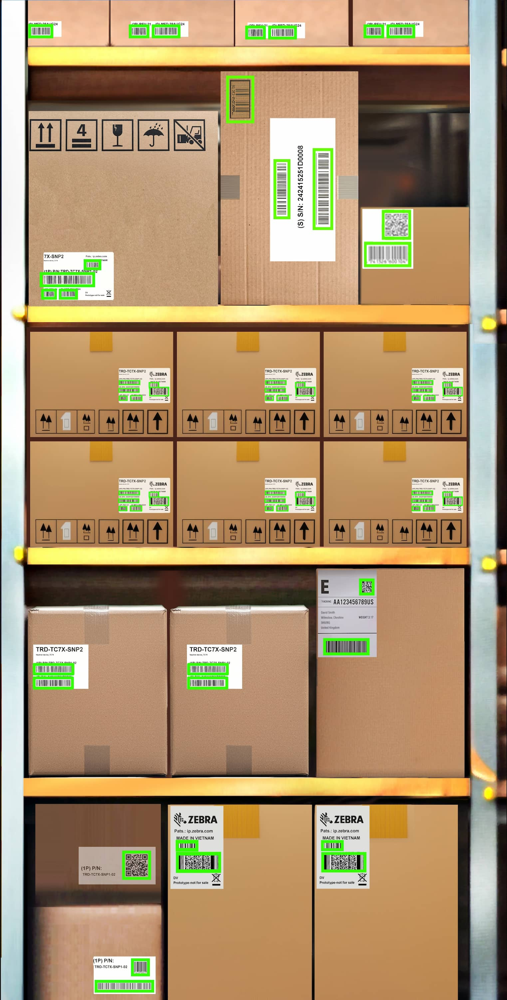
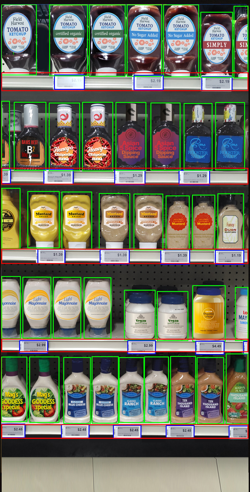
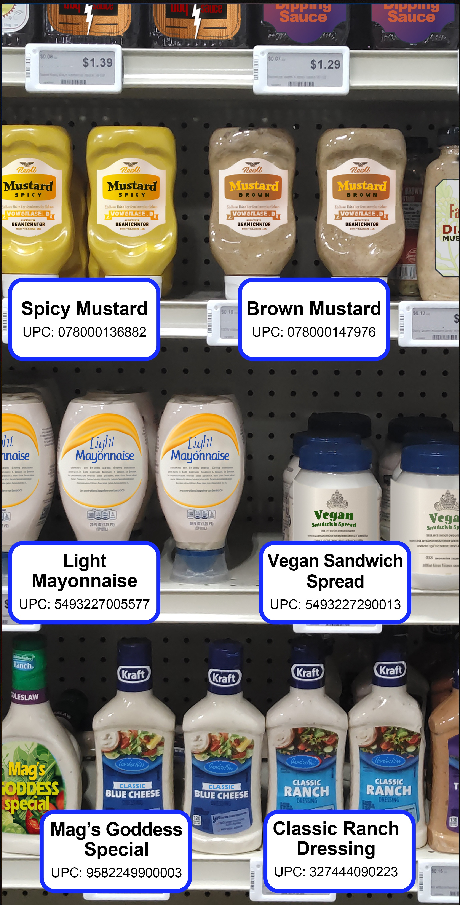
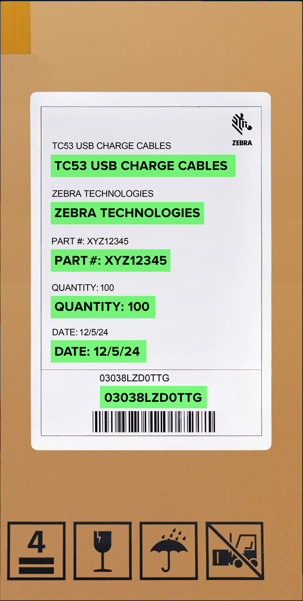
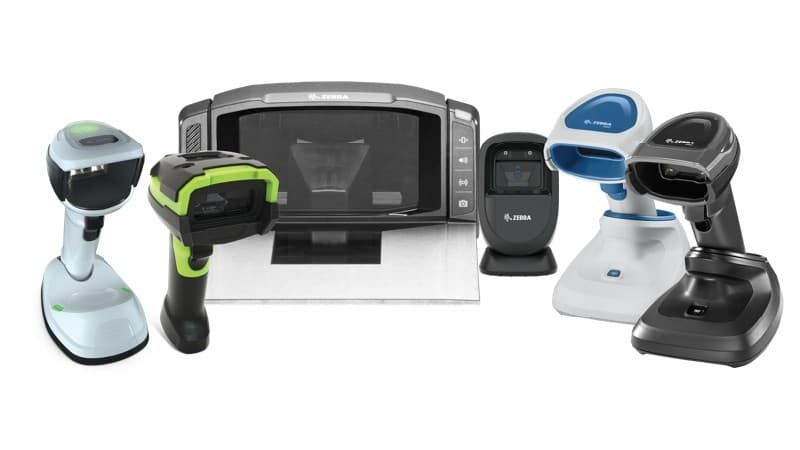

## Overview

The Zebra AI Data Capture SDK enables Java/Kotlin developers to create and deploy computer vision applications on Zebra mobile computing devices. Designed for both seasoned AI professionals and beginners, the SDK offers the tools and resources to leverage the AI capabilities offered on Zebra devices.

SDK capabilities:

- **[Localizer](#localizer) -** Detects objects in images:
  - **Barcode Localizer -** Locates the barcodes within an image for decode.
  - **Shelf and Product Localizer -** Finds products, shelves, price labels, and shelf labels within an image.
- **[Product Recognition](#productrecognizer) -** Utilizes **Feature Extractor, Feature Storage** and **Recognizer** components to build and store detailed visual data about retail products, enhancing inventory management. This process typically follows the use of **Shelf Localizer,** which detects products in images, crops them and submits them for recognition.
- **[Barcode Decoder](#barcodedecoder) -** Decodes single and multiple barcodes within images, generally after the **Barcode Localizer** detects and crops them for recognition.
- **[Text OCR](#textocr) -** Detects and recognizes text characters in images, capturing them as words or paragraphs.
- **[EntityTrackerAnalyzer](../camerax/) –** CameraX compatible `ImageAnalysis.Analyzer`, that can detect, decode, recognize and track Entities.
- **[EntityView](../camerax/) –** An inbuilt viewfinder that can be used as a CameraX preview, with inherent capabilities to process Entities.

Each of these capabilities can be used individually or combined to streamline tasks across different industries.

<!--
<table class="facelift" style="width:100%" border="3" padding="10px">
  <tr bgcolor="#dce8ef">
    <th style="width: 20%">
<a href="#localizer">Barcode Localizer</a>
</th>
    <th style="width: 20%">
<a href="#localizer">Shelf and Product Localizer</a>
</th>
    <th style="width: 20%">
<a href="#productrecognizer">Product Recognizer</a>
</th>
    <th style="width: 20%">
<a href="#productrecognizer">Feature Extractor</a>
</th>
    <th style="width: 20%">
<a href="#textocr">OCR/Text Recognizer</a>
</th>
  </tr>

  <tr>
	<td></td>
	<td></td>
    <td></td>
    <td></td>
    <td></td>
  </tr>

  <tr>
    <td>Automatically detects all barcodes in an image, eliminating the need for individual scans. An augmented reality overlay highlights barcodes on labels, boxes, and shelf tags for decoding.</td>
    <td>Identifies products on shelves, enabling tasks such as locating a specific product, determining restock needs, and processing Point of Sale (POS) sales. Adapts to various aisle widths with flexible reading distances.</td>
    <td>Detects and identifies products on shelves, enabling tasks such as locating items, determining restock needs, processing sales at a POS, and more.</td>
    <td>Extracts and stores key product descriptors in a database, allowing the <b>Product Recognizer</b> model to identify products within an image.</td>
    <td>Detects and recognizes text and characters in an image, converting it into words with high accuracy. Supports various fonts, font sizes, orientations, and lighting conditions.</td>
  </tr>

</table>
-->

<!-- 
<section class="uk-section whats-new">
    

        

            

                

                    
                    
  
                    
                    

                    

                        

                            <b>Barcode Localizer</b>
                        

                        <h5 class="text-blue uk-margin-small-top">Automatically detects barcodes in an image and highlights them using an AR overlay.</h5> 
                    

                    

                        More
                        
                    
                                    
                    
                                       
                        
                    

                

            

            

                

                    
                    
  
                    
                    

                    

                        

                            <b>Shelf and Product Localizer</b>
                        

                        <h5 class="text-blue uk-margin-small-top">Identifies products on shelves for locating items, restocking, and processing POS sales.</h5>
                    

                    

                        More
                        
                    

                    
                                  
                        
                    

                

            

            

                

                    
                    
  
                    
                    

                    

                        

                            <b>Product Recognizer</b> 
                        

                        <h5 class="text-blue uk-margin-small-top">Detects products on shelves for locating items, restocking, and processing POS sales.</h5>
                    
                                        
                    

                        More
                        
                    

                    

                        
                    

                

            

            

                

                    
                    
  
                    
                    

                    

                        

                            <b>Feature Extractor</b>
                        

                        <h5 class="text-blue uk-margin-small-top">Extracts and stores product descriptors in a database for image-based identification by the Product Recognizer model.</h5>
                    

                    

                        More
                        
                    

                    
                                         
                        
                    

                

            

            

                

                    
                    
  
                    
                    

                    

                        

                            <b>OCR/Text Recognizer</b>
                        

                        <h5 class="text-blue uk-margin-small-top">Recognizes text in images, converting it to words with high accuracy.</h5>
                    

                    

                        More
                        
                    

                    
                                         
                        
                    

                

            

        
                                 
    

</section>

<form action="https://www.zebra.com/us/en/software/mobile-computer-software/zebra-mobile-computing-ai-suite.html" method="get" target="_blank">
    <button type="submit" style="background-color: blue; color: white; border: none; padding: 10px 20px; border-radius: 5px; cursor: pointer;">Download</button>
</form>

<form action="https://www.zebra.com/us/en/software/mobile-computer-software/zebra-mobile-computing-ai-suite.html" method="get" target="_blank">
    <button type="submit" style="background-color: black; color: white; border: none; padding: 10px 20px; border-radius: 5px; cursor: pointer;">Documentation</button>
</form>

<section class="uk-section whats-new">
    

        
                                
            

                

                    
                    
  
                    
                    

                    

                        

                            <b>Mobile Computers & Tablets</b>
                        

                        <h5 class="text-blue uk-margin-small-top">SDKs, APIs, management and config tools, productivity apps and more</h5>
                    

                    

                        More
                        
                    
                                    
                    
                                       
                        
                    

                

            

            

                

                    
                    
  
                    
                    

                    

                        

                            <b>Barcode Scanners</b>
                        

                        <h5 class="text-blue uk-margin-small-top">SDKs and tools for Android, iOS, Windows and Linux</h5>
                    

                    

                        More
                        
                    

                    
                                  
                        
                    

                

            

            

                

                    
                    
  
                    
                    

                    

                        

                            <b>PRINTERS</b> 
                        

                        <h5 class="text-blue uk-margin-small-top">SDKs and sample apps for Android, iOS, Windows and Linux</h5>
                    
                                        
                    

                        More
                        
                    

                    

                        
                    

                

            

            

                

                    
                    
  
                    
                    

                    

                        

                            <b>RFID READERS</b>
                        

                        <h5 class="text-blue uk-margin-small-top">SDKs for Android, iOS and Windows</h5>
                    

                    

                        More
                        
                    

                    
                                         
                        
                    

                

            

        
                                 
    

</section>
-->
<!-- 
---

## New in v2.22.10

- Added ability to configure options in [barcode symbologies](../barcodedecoder/#barcodesymbologies).
-->
---

## Localizer

[Localizer](../localizer/) detects objects in images using supported models and outputs the location of the detected objects.

- **Barcode Localizer -** Detects 1D and 2D barcodes in images, suitable for various use cases such as identifying barcodes on product boxes, shelves and shipping labels.

    

  _Sample of detected barcodes_

- **Shelf and Product Localizer** Detects and identifies objects on retail shelves, aiding inventory management, optimizing space and ensuring accurate labeling. The types of objects detected include:

  - **Products -** Identifies individual products on the shelf, facilitating inventory tracking and automating stock checks.
  - **Shelf Labels -** Detects and reads shelf labels, ensuring that products are accurately priced and labeled.
  - **Peg Labels -** Recognizes peg labels used for hanging products, aiding in efficient product organization.
  - **Shelves -** Detects the presence and structure of shelves themselves, helping in understanding shelf layouts and optimizing space usage.

    

  _Sample of objects detected on a retail shelf_

---

## Product Recognizer

[Product Recognition](../productrecognition/) builds a database to facilitate inventory tracking and automated checkouts. The [Feature Extractor](../productrecognition/#featureextractor/) isolates key features from images, generating descriptors - vectors of float values that capture an item's characteristics - and stores them in [Feature Storage](../productrecognition/#featurestorage/) to enable product recognition. After a database of recognizable products is established, the [Product Recognizer](../productrecognition/#recognizer/) performs semantic searches to locate matching descriptors, predicting the identities of products on the shelf.

<table>
    <tr>
        <td></td>
        <td>&nbsp;&nbsp;&nbsp;&nbsp;&nbsp;&nbsp;</td>
        <td></td>
    </tr>
    <tr>
        <td><i>&nbsp;&nbsp;&nbsp;&nbsp;&nbsp;&nbsp;&nbsp;&nbsp;&nbsp;Sample of extracted item</i></td>
        <td>&nbsp;&nbsp;&nbsp;&nbsp;&nbsp;&nbsp;</td>
        <td><i>&nbsp;&nbsp;&nbsp;&nbsp;&nbsp;&nbsp;&nbsp;&nbsp;&nbsp;Sample of items recognized in the image and displayed with their corresponding data</i></td>
    <tr>
</table>

 

---

## Barcode Decoder

The **[Barcode Decoder](../barcodedecoder/)** is designed to decodes various types of barcodes detected within images. It utilizes the **[Barcode Localizer](#barcodelocalizer)** to first identify barcode locations and can decode barcodes from either entire images or specific regions, accommodating both single and multiple barcodes per image. Barcode Decoder methods facilitate simultaneous localization and decoding in a single operation. Additionally, the SDK includes a CameraX-compatible EntityTrackerAnalyzer, which detects, decodes, and tracks Entities such as Barcodes.

---

## Text OCR

The **[Text OCR](../textocr/)** model detects and decodes text characters in images, offering suggestions for recognized characters or words. It adapts to various fonts and input sizes, allowing for effective text recognition at different distances. Detected words can be grouped into 'lines' or 'paragraphs.'

&nbsp;&nbsp;&nbsp;&nbsp;&nbsp;&nbsp;&nbsp;&nbsp;&nbsp;&nbsp;&nbsp;&nbsp;_Sample of OCR detection_

---

## EntityTrackerAnalyzer

EntityTrackerAnalyzer is an implementation of the `ImageAnalysis.Analyzer` interface, designed for real-time entity detection and tracking of entities. It integrates seamlessly with CameraX, processing image frames using a series of detectors to deliver aggregated entity tracking results. The analyzer efficiently handles asynchronous tasks and lifecycle events, ensuring smooth operation within applications.

---

## Sample Apps

Refer to the [AISuite Sample Application](https://github.com/zebratechnologies/Zebra_AISuite_SDK_Sample_Apps/tree/main), which showcases all the features of the AI Data Capture SDK within a single app.

---

## Related Guides

- [Setup](../setup/)
- [Localizer](../localizer/)
- [Product Recognition](../productrecognition/)
  - [Feature Extractor](../productrecognition/#featureextractor)
  - [Feature Storage](../productrecognition/#featurestorage)
  - [Recognizer](../productrecognition/#recognizer)
- [Barcode Decoder](../barcodedecoder/)
- [Text OCR](../textocr/)
