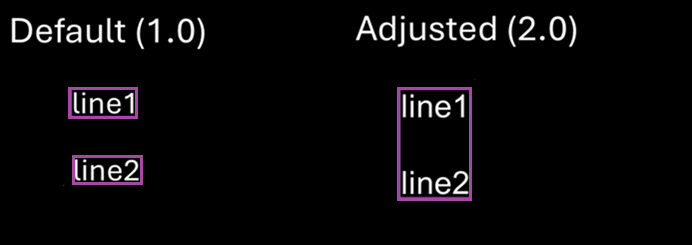

## Overview

The `TextOCR` class leverages Optical Character Recognition (OCR) to detect and recognize text within images. It offers methods for identifying text, words, and paragraphs across various image formats, with options to customize the output, such as grouping detected words into "lines" or grouping lines into "paragraphs."

**Text OCR** operates through a seamless two-stage process:

1. **Detection Stage -** Processes the input image to generate text boxes (complex bbox), represented by rectangular frames that enclose detected objects within an image. [Detection Parameters](#detectionparameters) can be adjusted to fine-tune what is detected.
2. **Recognition Stage -** Analyzes the text within each text box to recognize the text content. Each text box yields a list of potential text decodes. [Recognition Parameters](#recognitionparameters) can be adjusted to refine the recognition process.

This guide begins with initial instructions for basic setup of OCR. Subsequent sections offer a comprehensive list of OCR settings that can be fine-tuned for specific needs:

- [Grouper Settings](#groupersettings)
- [Tiler Settings](#tilersettings)
- [Recognition Parameters](#recognitionparameters)
- [Detection Parameters](#detectionparameters)
- [Inferencer Options](../class/inferenceroptions/)

For non-standard use cases, particularly for [Grouper Settings](#groupersettings), developers are encouraged to experiment with and adjust these parameters to optimize performance.

---

## Capabilities

### Supported Characters

TextOCR recognizes a range of characters, including:

        *0123456789abcdefghijklmnopqrstuvwxyzABCDEFGHIJKLMNOPQRSTUVWXYZ!\"#$%&'()*+,-./:;<=>?@[\\]^_`{|}~*

By default, it supports a maximum word length of approximately 15 characters, though this limit may decrease with the use of uncommon fonts. Enabling [tiling](#tilersettings) removes this restriction.

### Input/Output

**Input Parameters:** The default model input size is 640x640 pixels, but this can be adjusted during runtime initialization.

**Output Parameters:** The output consists of a list of text detections, each accompanied by a list of [complex bounding boxes](../types/#complexbbox) that define the location and content of the detected text.

---

## Developer Guide

This guide outlines the process for using TextOCR to detect and recognize text within images, from initialization to outputting the identified text.

### Step 1: Initialization

Follow these steps to set up and initialize a `TextOCR` object:

1.  **Import the TextOCR class** using `com.zebra.ai.vision.TextOCR`.
2.  **Configure OCR Settings:** Create a `TextOCR.Settings` object.
3.  **Optional: Set model input dimensions:** If needed, customize the model input dimensions (height and width). These should be multiples of 32 (e.g., 640).

        settings.detectionInferencerOptions.defaultDims.width = [your value];
        settings.detectionInferencerOptions.defaultDims.height = [your value];

    - **Smaller Input Sizes -** Reduce processing time and increase speed, but may decrease accuracy. Ideal for larger or closer text.
    - **Larger Input Sizes -** Improve accuracy for smaller or more distant text, but increase inference time. An input size that is too large may cause out-of-memory errors and potentially cause an application crash at run-time.

4.  **Optional: Configure the additional OCR settings to optimize detection and recognition:**

    - [Grouper Settings](#groupersettings)
    - [Tiler Settings](#tilersettings)
    - [Recognition Parameters](#recognitionparameters)
    - [Detection Parameters](#detectionparameters)
    - [Inferencer Options](../class/inferenceroptions/)

5.  **Initialize the OCR object -** Declare a `TextOCR` object. Use `CompletableFuture` to initialize it asynchronously with an `Executor` for concurrent processing.
6.  **Callback Handling -** Use `thenAccept()` to assign the initialized `TextOCR` object to the `textocr` variable, enabling it for text detection tasks like barcodes and products in images.

#### Sample Code

Initialization sample code:

        import com.zebra.ai.vision.TextOCR;

        TextOCR.Settings settings = new TextOCR.Settings();

        // Optional: Override the default model input size
        settings.detectionInferencerOptions.defaultDims.width = 1280;
        settings.detectionInferencerOptions.defaultDims.height = 1280;

        // Initialize OCR object
        TextOCR textocr = null;

        // Initialize textocr
        // settings = TextOCR.Settings object created above
        // Executor = An executor thread for processing API calls and returning results
        CompletableFuture<TextOCR> futureObject = getTextOCR(settings, executor);

        // Use the futureObject to implement the thenAccept() callback of CompletableFuture
        futureObject.thenAccept (OCRInstance -> {
            // Use the Textocr object returned here for detecting barcodes/Shelves/products
            textocr = OCRInstance;
        });

### Step 2: Capture Image

Capture the image and ensure the image is in the form of a Bitmap.

### Step 3: Detect Text

Use one of the following methods to detect text within an image, based on the type of text to detect:

- **Generic Text -** Outputs text in [complex bounding boxes](../types/#complexbbox). Sample code:

        Bitmap image = ... // Your bitmap image here

        // Initialize executor
        Executor executor = Executors.newFixedThreadPool(1);

        // Input parameters include a bitmap image and an executor thread object for performing detections
        CompletableFuture<OCRResult[]> futureResult = textocr.detect(bitmap,executor);

        futureResult.thenAccept (ocrResults -> {
            // Process the returned output that contains complex bounding boxes and text within
        });

        // Once finished with the textOCR object, dispose of it to release resources and memory used during detection.
        textOCR.dispose();

- **Words –** Outputs an array of [words](../types/#word). A word is a discrete unit of text identified within an image, typically separated by spaces or punctuation. Sample code:

        Bitmap image = ... // Your bitmap image here

        // Initialize executor
        Executor executor = Executors.newFixedThreadPool(1);

        // Input parameters include a bitmap image and an executor thread object for performing detections
        CompletableFuture<Word[]> futureWords = textocr.detectWords(bitmap,executor);

        futureWords.thenAccept (words -> {
            // Process the returned array of detected words
        });

        // Once finished with the textOCR object, dispose of it to release resources and memory used during detection
        textOCR.dispose();

- **Paragraphs -** Outputs a hierarchical structure of [paragraphs](../types/#textparagraph) using the grouping mechanism described in [Grouper Settings](#textocrgroupersettings). A paragraph is formed by grouping words that appear on the same line, and these lines are then organized into paragraphs. The process is parameterized, with relevant parameters detailed in the Grouper Settings. Sample code:

        Bitmap image = ... // Your bitmap image here

        // Initialize executor
        Executor executor = Executors.newFixedThreadPool(1);

        // Input parameters include a bitmap image and an executor thread object for performing detection
        CompletableFuture<TextParagraph[]> futureTextParagraph = textOCR.detectParagraphs(bitmap,executor);

        futureTextParagraph.thenAccept (paragraphs -> {
            // Process the returned array of detected paragraphs.
        });

        // Once finished with the textOCR object, dispose of it to release resources and memory used during detection
        textOCR.dispose();

---

## Methods

### TextOCR (Settings settings)

        TextOCR.TextOCR(Settings settings) throws IOException

**Description:** Initializes the OCR engine with the specified settings, allowing subsequent text detection and analysis on image inputs. It checks for the necessary model file and verifies the integrity of the archive. If issues are detected, appropriate exceptions are thrown.

**Parameters:**

- **settings TextOCR.Settings -** An instance of the `Settings` class containing configuration options for the OCR engine.

**Return Value:** [CompletableFuture](https://docs.oracle.com/javase/8/docs/api/java/util/concurrent/CompletableFuture.html)&lt;TextOCR&gt;

**Exceptions:**

- **IOException -** Thrown if the archive is corrupted.

---

### detect (Bitmap srcImg, Executor executor)

        CompletableFuture<OCRResult[]> detect (Bitmap srcImg, Executor executor) throws InvalidInputException, IllegalStateException

**Description:** Performs Optical Character Recognition (OCR) on the provided Bitmap image, using the specified executor for asynchronous execution.

**Parameters:**

- **srcImg (Bitmap srcImg) -** The Bitmap image to perform OCR on.
- **executor -** Manages asynchronous task execution.

**Return Value:** A [CompletableFuture](https://docs.oracle.com/javase/8/docs/api/java/util/concurrent/CompletableFuture.html) that resolves to an array of [OCRResult](../types/#ocrresult), each containing [complex bounding boxes](../types/#complexbbox) and recognized text.

**Exceptions:**

- **InvalidInputException -** Thrown if the Bitmap is null.
- **IllegalStateException -** Thrown if the OCR engine is in an invalid state for detection.

---

### detectWords (Bitmap srcImg, Executor executor)

        CompletableFuture<Word[]> TextOCR.detectWords (Bitmap srcImg, Executor executor) throws InvalidInputException, IllegalStateException

**Description:** Detects individual words in the provided Bitmap image using the specified executor for asynchronous execution.

**Parameters:**

- **srcImg (Bitmap srcImg) -** The image to analyze for word detection.
- **Executor -** Manages asynchronous task execution.

**Return Value:** A [CompletableFuture](https://docs.oracle.com/javase/8/docs/api/java/util/concurrent/CompletableFuture.html) that resolves to an array of Word objects, each containing [complex bounding boxes](../types/#complexbbox) and possible text decodes.

**Exceptions:**

- **InvalidInputException -** Thrown if the Bitmap is null.
- **IllegalStateException -** Thrown if the OCR engine is in an invalid state for performing word detection.

---

### detectParagraphs (Bitmap srcImg, Executor executor)

        CompletableFuture<TextParagraph[]> detectParagraphs(Bitmap srcImg, Executor executor) throws InvalidInputException, IllegalStateException

**Description:** Detects paragraphs in the provided Bitmap image using the specified executor for asynchronous execution.

**Parameters:**

- **srcImg (Bitmap srcImg) -** The image to analyze for paragraph detection.
- **executor -** Manages asynchronous task execution.

**Return Value:** A [CompletableFuture](https://docs.oracle.com/javase/8/docs/api/java/util/concurrent/CompletableFuture.html) that resolves to an array of TextParagraph objects, representing detected paragraphs.

**Exceptions:**

- **InvalidInputException -** Thrown if the Bitmap is null.
- **IllegalStateException -** Thrown if the OCR engine is in an invalid state for performing paragraph detection.

---

### getTextOCR (Settings settings, Executor executor)

        CompletableFuture<TextOCR> getTextOCR(Settings settings, Executor executor) throws InvalidInputException, RuntimeException

**Description:** Asynchronously initializes and retrieves a TextOCR instance using the specified settings and executor.

**Parameters:**

- **Settings -** An instance of `TextOCR.Settings` containing configuration options for the OCR engine.
- **executor -** Manages asynchronous task execution.

**Return Value:** A [CompletableFuture](https://docs.oracle.com/javase/8/docs/api/java/util/concurrent/CompletableFuture.html) that resolves to an initialized TextOCR instance.

**Exceptions:**

- **InvalidInputException -** Thrown if the settings are invalid or null.
- **RuntimeException -** Thrown if an unexpected error occurs during initialization.

---

### Dispose()

        void dispose()

**Description:** Releases all internal resources used by the TextOCR object. This function must be called manually to free up resources.

---

## TextOCR.Settings

The `Settings` class is a nested class within the `TextOCR` class, designed to configure various parameters required for performing Optical Character Recognition (OCR). It allows for fine-tuning of the OCR process through settings related to detection, recognition, and decoding.

---

### Constructors

#### Settings()

        TextOCR.Settings settings = new TextOCR.Settings();

**Description:** Constructs a new `Settings` object with default values for all parameters.

---

### Grouper Settings

The `GrouperSettings` class provides parameters for customizing the behavior of the OCR text grouping algorithm. It offers control over how text elements are spatially organized based on their geometric properties. By adjusting these settings, developers can fine-tune how text boxes are grouped into lines, paragraphs, or other structures based on their spatial relationships.

Grouping occurs in two stages. [Words](../types/#word) detected by OCR are grouped into [Lines](../types/#textline) that are further grouped into [Paragraphs](../types/#textparagraph). In the graphic representation below, Words, Lines and Paragraphs are represented by blue, green and fuchsia borders, respectively.

---

#### widthDistanceRatio

        float TextOCR.Settings.GrouperSettings.widthDistanceRatio

**Description:** Determines the threshold for joining Words into Lines. Adjusting this parameter allows control over acceptable spacing between Words in a Line. Words spaced beyond this threshold are treated as separate Lines. The default value of 1.5f indicates that the acceptable space between Words should not exceed 50% of their average width. Increasing this value to 2.0f allows for a maximum acceptable space of 100% of the average Word width.

For example, if the average Word width is 90 pixels, widthDistanceRatio of 2.0 allows words with centers up to 180 pixels apart to be grouped into the same Line.

**Tuning effect:** Increasing this parameter causes horizontally spaced Words to join into a Line. Set this value higher if Words are spaced further apart and should be joined into a Line, such as in artistic layouts.

**Default:** 1.5f

**Valid range:** [0.0f, inf]

---

#### heightDistanceRatio

        float TextOCR.Settings.GrouperSettings.heightDistanceRatio

**Description:** Affects the grouping of Words into Lines, particularly in scenarios where text undergoes a sudden change in font size but should still be grouped together. Although the algorithm has no knowledge of the actual font size, it uses the height of the complex bounding box to approximate it. The default value of 2.0f indicates that Words will be grouped together even if their font size differs by up to twice the height.

For example, setting this parameter to 4.0 allows words with height differences up to 4 times to be grouped into the same Line.

**Tuning effect:** Increasing this parameter allows words of varying heights to join into a single Line. Raise this value higher when there is significant variation in text sizes within the same line, such as in documents with mixed fonts.

**Default**: 2.0f

**Valid range:** [1.0f, inf]

---

#### centerDistanceRatio

    float TextOCR.Settings.GrouperSettings.centerDistanceRatio

**Description:** Affects the joining of Words into Lines, particularly in scenarios where lines of text are not perfectly straight, such as in curved lines of text. The threshold value should be adjusted empirically, as it mathematically represents the relationship between the positions of two consecutive Words.

For example, if the average Word height is 20 pixels, setting centerDistanceRatio to 1.0 allows Words with centers up to 20 pixels apart vertically to be grouped into the same Line.

**Tuning effect:** Increasing this parameter allows Words that are not vertically aligned to be joined into the same Line.

**Default:** 0.6f

        
---

#### paragraphHeightDistance

        float TextOCR.Settings.GrouperSettings.paragraphHeightDistance

**Description:** Determines the difference in vertical spacing between the center of two Lines to determine if they should be grouped into a Paragraph. It is particularly useful when the Lines of text have unusually large "leading", which refers to the distance between consecutive Lines in a Paragraph. The default value of 1.0f indicates that the Lines can be grouped into a paragraph if their centers are spaced apart by 100% of their average height.

For example, if the average Line height is 30 pixels, setting this parameter to 2 allows Lines with centers up to 60 pixels apart to be grouped into a Paragraph.

**Tuning effect:** Increasing this parameter allows Lines that are spaced farther apart vertically to be joined into a Paragraph. Consider raising this value higher for documents with widely spaced Lines.

**Default:** 1.0f

**Valid range:** [0.0f, inf]

        
---

#### paragraphHeightRatioThreshold

        float TextOCR.Settings.GrouperSettings.paragraphHeightRatioThreshold

**Description:** Determines if there is a significant height difference between two rows, expressed as a ratio of the heights of two adjacent Lines, to decide whether they should be joined into a Paragraph. This can be useful in scenarios when Lines of varying font sizes should be joined into a single Paragraph. Although the algorithm has no knowledge of actual font sizes, it uses the height of the complex bounding box as an approximation. The default value of 1.0/3.0f (approximately 0.33) indicates that if consecutive Lines differ in height by a facotr of up to 3, they will still be grouped together into a single Paragraph.

For example, if the average Line height is 50 pixels, setting this parameter to 0.2 allows Lines with heights ranging from approximately 10 pixels to 250 pixels to be grouped into the same Paragraph.

**Tuning effect:** Decreasing this parameter allows Lines with larger height differences to be joined into a Paragraph, which can be useful for documents with diverse fonts.

**Default:** 0.33f

**Valid range:** [0.0f, 1.0f]

---

#### Sample Code

To utilize the OCR capabilities of the `TextOCR` library, follow these steps to configure settings, prepare your image, and perform text detection:

1.  **Configure Settings:** Initialize a `TextOCR.Settings` object and customize the `GrouperSettings` parameters for text grouping.
2.  **Asynchronous Initialization:** Use an `Executor` to initialize the `TextOCR` instance asynchronously, allowing for efficient resource management and responsiveness.
3.  **Load Bitmap Image:** Prepare the image for OCR by converting it to a Bitmap object.
4.  **Perform OCR:** Use the `detect` method to analyze the image, retrieving an array of [OCRResult](../types/#ocrresult) objects with complex bounding boxes and recognized text.
5.  **Process OCR Results:** Handle the results by iterating over the `OCRResult` array, outputting the recognized text or using it for further processing.
6.  **Dispose Resources:** After completing OCR operations, call `dispose()` to release resources and prevent memory leaks.

        import com.zebra.ai.vision.TextOCR;

        // Initialize TextOCR settings
        TextOCR.Settings.GrouperSettings grouperSettings = new TextOCR.Settings.GrouperSettings();

        // Access the GrouperSettings and set custom values for grouping parameters
        textOCRSettings.grouping.widthDistanceRatio = 1.5f;
        textOCRSettings.grouping.heightDistanceRatio = 2.0f;
        textOCRSettings.grouping.centerDistanceRatio = 0.6f;
        textOCRSettings.grouping.paragraphHeightDistance = 1.0f;
        textOCRSettings.grouping.paragraphHeightRatioThreshold = 0.33f;

        // Initialize executor
        Executor executor = Executors.newFixedThreadPool(1);

        // Input params include the bitmap image (to perform detection on) and an executor thread object (in which the detection happens)
        CompletableFuture<OCRResult[]> futureResult = textocr.detect(bitmap,executor);

        futureResult.thenAccept (ocrResults -> {
            // Process the returned output that contains complex bounding boxes and text within it
        });

        // Dispose resources
        // Once done using the textOCR object, dispose it to release resources and memory used for detection.
        textOCR.dispose()

---

### Tiler Settings

The `TilerSettings` class provides a comprehensive set of parameters for controlling the tiling behavior of the `TextOCR` system. These settings are important for optimizing the detection and recognition of text in images, allowing for adjustments based on specific application needs and dataset characteristics. By fine-tuning these parameters, developers can significantly impact the performance and reliability of OCR processes.

Configure `TilerSettings` in the following scenarios:

- **Large Document Processing:** Enable tiling to process large documents efficiently, especially when sections require individual handling due to size limitations.
- **Complex Layout Handling:** Adjust tiling settings for documents with complex layouts to improve the accuracy of text recognition.
- **Performance Tuning:** Fine-tune parameters to achieve an optimal balance between processing speed and accuracy, based on specific application requirements.

---

#### Tiling

        TilerSettings TextOCR.Settings.tiling

**Description:** Tiling involves dividing a large image into smaller, manageable sections called "tiles" to analyze text more accurately. This structure contains parameters for handling very long text boxes.

---

#### enable

        boolean TextOCR.Settings.TilerSettings.enable

**Description:** Enables or disables the tiling feature. When true, `TextOCR` performs tiling operations on detected text regions, splitting boxes that meet aspect ratio criteria into multiple tiles, recognizing text, and merging results using a correlation method.

**Default:** false

---

#### topCorrelationThr

        float TextOCR.Settings.TilerSettings.topCorrelationThr

**Description:** Limits the number of potential merging points used internally based on their correlation score.

**Tuning effect:** Increasing this value restricts the merging mechanism to points with a correlation score higher than this value. Setting it to 0 removes the limit. If incorrect tiling occurs, increasing this parameter may help.

**Default:** 0.0f

**Valid range:** `[0.0f, 1.0f]`

---

#### mergePointsCutoff

        int TextOCR.Settings.TilerSettings.mergePointsCutoff

**Description:** Limits the number of possible combinations used for tile merging.

**Tuning effect:** Increasing this value results in more combinations being used, increasing processing time but potentially generating more accurate results.

**Default:** 5

**Valid range:** [1, max(int)]

---

#### splitMarginFactor

        float TextOCR.Settings.TilerSettings.splitMarginFactor

**Description:** Scales the confidence values for characters at the borders of consecutive tiles, assuming character deformation due to tiling. This value should not be modified.

**Default**: 0.1f

**Valid range**: `[0.0f, 1.0f]`

---

#### aspectRatioLowerThr

        float TextOCR.Settings.TilerSettings.aspectRatioLowerThr

**Description:** Controls which text boxes will be tiled. Generally, only elongated boxes (high width/height aspect ratio) are tiled, since they likely contain long text strings. Only boxes with an aspect ratio higher than this threshold will be tiled. Tune this parameter together with `aspectRatioUpperThr`.

**Tuning effect:** Decreasing this threshold results in more rectangular-shaped (low-aspect ratio) boxes being tiled. If the desired text box is not tiled, decreasing this parameter may help.

**Default:** 10.0f

**Valid range:** [1.0f, inf]

---

#### aspectRatioUpperThr

        float TextOCR.Settings.TilerSettings.aspectRatioUpperThr

**Description:** Filters boxes with very high aspect ratios, may rarely occur and be false positives from the text detector model. Tune this parameter together with `aspectRatioLowerThr`. A similar effect can be achieved with the `minBoxSize` parameter.

**Tuning effect:** Increasing this parameter allows tiling of more long and narrow boxes.

**Default:** 40.0f

**Valid range:** [1.0f, inf]

---

#### topkMergedPredictions

    int TextOCR.Settings.TilerSettings.topkMergedPredictions

**Description:** Limits the number of decodes returned based on confidence scores.

**Default:** 5

**Valid range:** [1, max(int)]

---

#### Sample Code

The `TilerSettings` object is part of the `TextOCR.Settings` configuration. Access and modify `TilerSettings` through the `TextOCR.Settings` object.

This sample code demonstrates how to configure `TilerSettings` and process the image for text detection and recognition:

1.  **Initialize Settings:** Begin by creating a `TextOCR.Settings` instance.
2.  **Configure TilerSettings:** Access the `TilerSettings` within the `TextOCR.Settings` instance and set custom values for tiling parameters to control how the image is divided and processed.
3.  **Instantiate TextOCR:** Use the configured settings to create a `TextOCR` instance. This object will handle the text detection and recognition processes.
4.  **Load Bitmap Image:** Prepare the image for OCR by converting it to a `Bitmap` object.
5.  **Perform Detection:** Use the detect method to analyze the image and retrieve an array of [OCRResult](../types/#ocrresult) objects containing the detected text.
6.  **Print Results:** Iterate over the `OCRResult` array to output the recognized text to the console.
7.  **Dispose Resources:** Free up system resources by calling the dispose method on the TextOCR object after usage.

        import com.zebra.aivision.TextOCR;
        import com.zebra.aivision.TextOCR.Settings;
        import com.zebra.aivision.TextOCR.Settings.TilerSettings;
        import android.graphics.Bitmap;

        // Initialize settings with custom tiling options
        TextOCR.Settings.TilerSettings tilerSettings = new TextOCR.Settings.TilerSettings();
        tilerSettings.tiling.enable = true;
        tilerSettings.tiling.aspectRatioLowerThr = 8.0f;
        tilerSettings.tiling.aspectRatioUpperThr = 35.0f;
        tilerSettings.tiling.mergePointsCutoff = 10;

        // Initialize executor
        Executor executor = Executors.newFixedThreadPool(1);

        // Input params: bitmap image (to perform detection) and an executor thread object (in which the detection happens and the results are returned)
        CompletableFuture<OCRResult[]> futureResult = textocr.detect(bitmap,executor);

        futureResult.thenAccept (ocrResults -> {
            //Process the returned output that contains complex bounding boxes and text in it.
        });

        // Dispose resources
        // Once done using the textOCR object, dispose it to release resources and memory used for detection.
        textOCR.dispose()

---

### Detection Parameters

The Detection phase processes the input image to create [complex bounding boxes](../types/#complexbbox), or text boxes. Each text box is represented by a list of points forming a rotated rectangle, which may not be perfectly aligned with the screen’s edges. There may be more than four points if the rectangle is clipped at the edges of the screen. To refine detection accuracy, adjust the **Detection Parameters** accordingly.

Typical scenarios for adjusting Detection Parameters:

- **Document Scanning:** Digitize documents by extracting text for storage and retrieval.
- **Real-Time Text Recognition:** Integrate into applications requiring immediate text recognition from images or video streams.
- **Automated Data Entry:** Streamline data entry by automatically extracting text from forms or invoices.

<!--
#### detectionModelName

        TextOCR.Settings.detectionModelName

**Description:** Name of the detector model within the OCR resource archive.
-->

---

#### flip

        boolean TextOCR.Settings.flip

**Description:** If set to true, performs recognition twice - once in the regular orientation and once rotated by 180 degrees.

<!--

#### recognitionModelName

        TextOCR.Settings.recognitionModelName

**Description:** Name of the recognition model within the OCR resource archive.

---

#### resourceName

        TextOCR.Settings.resourceName

**Description:** File path to the OCR resources, including models.

---

-->

#### detectionInferencerOptions

        InferencerOptions TextOCR.Settings.detectionInferencerOptions = new InferencerOptions()

**Description:** Allows developers to specify a different input shape for the detection stage inferencer.

---

#### recognitionInferencerOptions

        InferencerOptions TextOCR.Settings.recognitionInferencerOptions = new InferencerOptions()

**Description:** Typically remains unchanged as the input size is fixed for the recognition model. If needed, Recognition results can be adjusted using parameters in the [Recognition Parameters](#recognitionparameters) section.
**Note:** These options should not be changed by the developer.

---

#### heatmapThreshold

        float TextOCR.Settings.heatmapThreshold

**Description:** Sets a cutoff to identify potential areas likely to contain text, converting them into text boxes. (Internally, the detector model creates a grayscale image, or heatmap, that represents text confidence.)

**Tuning effect:**

- **Increase Threshold -** Reduces areas identified as text, useful for high-contrast images like scanned documents.
- **Decrease Threshold -** Expands areas identified as text, useful for low-contrast or barely visible text.

**Default:** 0.5f

**Valid range:** [0.0f, 1.0f]

---

#### minBoxArea

        int TextOCR.Settings.minBoxArea

**Description:** Filters out small, unimportant boxes from the OCR output.

**Tuning effect:** Increasing this parameter filters out boxes with small areas.

**Default:** 10
**Valid range:** [0, max(int)]

---

#### boxThreshold

        float TextOCR.Settings.boxThreshold

**Description:** Sets the minimum confidence score required for a text box to be included in the OCR output. Boxes with confidence scores below this threshold are excluded, helping to filter out less certain text detections.

**Tuning effect:**

- **Increase Threshold:** Excludes less-confident text boxes, useful when too many boxes are detected.
- **Decrease Threshold:** Includes more text boxes, which might be necessary when important text is being missed.

**Default:** 0.85f

**Valid range:** [0, 1.0]

---

#### minBoxSize

        int TextOCR.Settings.minBoxSize

**Description:** Filters out very narrow boxes (low height or width) that likely do not contain real text.

**Tuning effect:** Increasing this parameter filters out very narrow boxes.

**Default:** 1

**Valid range:** [0, max(int)]

---

#### minRatioForRotation

        float TextOCR.Settings.minRatioForRotation

**Description:** Rotates vertically oriented text boxes to horizontal to improve recognition. Adjust this value for images with significant rotated text. **Note:** Words are generally wider than they are tall, so their ratio should exceed the default value. Therefore, avoid changing this parameter for words, since word complex bounding boxes should be horizontally oriented before recognition.

**Tuning effect:** Setting this parameter to 0 disables rotation. Otherwise, rotate boxes with a height-to-width ratio exceeding this value 90 degrees counterclockwise before recognition.

**Default:** 1.5f

**Valid range:** [0.0f, inf] (where ‘inf’ denotes infinity)

---

#### unclipRatio

        float TextOCR.Settings.unclipRatio

**Description:** Slightly stretches text boxes before recognition to improve results. Tight-fitting boxes might benefit from some extra background for better decoding.

**Tuning effect:** Increasing this parameter enlarges text boxes, potentially improving recognition. An `unclipRatio` of 1 keeps boxes unchanged, while 1.5 enlarges them by 50%.

**Default:** 1.5f

**Valid range:** [1.0f, inf]

---

#### Sample Code

This sample code demonstrates how to adjust detection parameter settings:

1.  **Configure Settings:** Initialize a `TextOCR.Settings` object and customize parameters such as `heatmapThreshold` and `boxThreshold` to improve detection accuracy based on your specific needs.
2.  **Asynchronous Initialization:** Use an `Executor` to initialize the `TextOCR` instance asynchronously, allowing for efficient resource management and responsiveness.
3.  **Load Bitmap Image:** Prepare the image for OCR by converting it to a Bitmap object.
4.  **Perform OCR:** Use the `detect` method to analyze the image and retrieve an array of [OCRResult](../types/#ocrresult) objects with complex bounding boxes and recognized text.
5.  **Process OCR Results:** Handle the results by iterating over the `OCRResult` array, outputting the recognized text or using it for further processing.
6.  **Dispose Resources:** After completing OCR operations, call `dispose()` to release resources and prevent memory leaks.

        import com.zebra.ai.vision.TextOCR;
        import com.zebra.ai.vision.TextOCR.Settings;
        import android.graphics.Bitmap;

        // Initialize settings with a custom heatmap threshold
        TextOCR.Settings textOCRSettings = new TextOCR.Settings ();
        settings.heatmapThreshold = 0.3f; // Lower threshold for low-contrast text
        settings.boxThreshold = 0.9f; // Higher threshold for more confident text boxes
        settings.minBoxSize = 10; // Set minimum box size to 10 pixels
        settings.minBoxArea = 50; // Set minimum box area to 50 pixels
        settings.unclipRatio = 2.0f; // Enlarge text boxes by 100%
        settings.minRatioForRotation = 2.0f; // Rotate boxes with height-to-width ratio exceeding 2.0

        // Initialize executor
        Executor executor = Executors.newFixedThreadPool(1);

        CompletableFuture<TextOCR> futureObject = getTextOCR(textOCRSettings, executor);

        // Use the futureObject to implement thenAccept() callback of CompletableFuture
        futureObject.thenAccept (OCRInstance -> {
            // Use the Textocr object returned here for the detection of barcodes/shelves/products
              textocr = OCRInstance;
        });

        // Load your Bitmap image
        Bitmap image = ...; // Your input image

        // Perform OCR
        CompletableFuture<OCRResult[]> futureResult = textocr.detect(bitmap,executor);
        futureResult.thenAccept (ocrResults -> {
              // Process the returned output that contains complex bounding boxes and text in it
        });

        // Dispose resources
        // Once use of the textOCR object is done, dispose of it to release the resources and memory used for detection
        textOCR.dispose();

---

### Recognition Parameters

The Recognition stage analyzes the text within each [complex bounding box](../types/#complexbbox), or text box, produced during the Detection Stage to identify the text content. Each text box results in a list of potential text decodes. Adjusting the **Recognition Parameters** can help refine the recognition process.

#### decodingMaxWordCombinations

        int TextOCR.Settings.decodingMaxWordCombinations

**Description:** Specifies the maximum number of possible text decodes returned in the output. This parameter helps balance the quantity and confidence of text outputs. It is applicable for the following scenarios:

- **Detailed Text Analysis -** Increase this parameter for applications that require a thorough analysis of text.
- **Data Extraction -** Adjust this parameter to optimize the extraction of comprehensive data from documents with complex or ambiguous text.

**Tuning effect:** Increasing this number returns more decodes, but potentially with lower confidence.

**Default:** 10

**Valid range:** [1, max(int)]

---

#### decodingTotalProbThreshold

        float TextOCR.Settings.decodingTotalProbThreshold

**Description:** Sets the minimum cumulative confidence score that character decodes must achieve to be considered valid. This setting is crucial in the total decoding strategy of the OCR recognition process, as it balances accuracy and coverage in text recognition. If the threshold is not reached, no high-confidence decode exists, resulting in a placeholder character (�) appearing in the output.

Relevant scenarios:

- **Improving Decode Coverage -** Lower the threshold when critical text characters are missing, to capture a wider range of more potential decodes.
- **Analyzing Complex Documents -** Apply this setting for documents with ambiguous or low-quality text to ensure more comprehensive character recognition.
- **Adaptive Recognition -** Adjust dynamically based on the quality and complexity of input documents to optimize OCR performance for specific needs.

**Tuning effect:** If many characters are not decoded, evidenced by multiple � characters, decreasing this value may improve results.

**Default:** 0.9f

**Valid range:** [0.0f, 1.0f]

---

#### decodingTopkIgnoreCutoff

        int TextOCR.Settings.decodingTopkIgnoreCutoff

**Description:** Sets the maximum number of decodes considered for each character before calculating the cumulative probability, impacting the accuracy and completeness of text recognition. It is used specifically within the Total decoding strategy of the OCR recognition process. This parameter is applicable for the following scenarios:

- **Complex Text Recognition -** Increase this parameter for documents with complex or ambiguous text where capturing all character variations is crucial.
- **Improving Character Accuracy -** Use this setting in scenarios where critical text components are consistently missing, ensuring thorough character analysis.
- **Adaptive Text Processing -** Adjust dynamically based on the complexity and quality of input text to optimize OCR performance.

**Tuning effect:** Generally, keep this at the default value. If the expected character does not appear in the OCR output, increasing this value allows for more less confident decodes.

**Default:** 4

**Valid range:** [1, max(int)]

---

#### Sample Code

Sample code demonstrating use of recognition parameters:

1.  **Initialize Settings:** Configure the OCR settings, including additional parameters such as `heatmapThreshold` and `tiling`.
2.  **Create TextOCR Instance:** Use an executor to initialize the `TextOCR` instance asynchronously with the configured settings.
3.  **Load Bitmap Image:** Prepare the bitmap image that you want to analyze using OCR.
4.  **Perform OCR:** Invoke the `detect` method on the `TextOCR` instance to analyze the bitmap image, managing the asynchronous processing with the executor.
5.  **Process OCR Results:** Handle the results, which include complex bounding boxes and recognized text.
6.  **Dispose Resources:** After completing OCR operations, call the `dispose` method on the `TextOCR` instance to release resources and prevent memory leaks.

        import com.zebra.ai.vision.TextOCR;
        import com.zebra.ai.vision.TextOCR.Settings;
        import android.graphics.Bitmap;

        // Initialize settings
        TextOCR.Settings textOCRSettings = new TextOCR.Settings ();
        textOCRSettings.heatmapThreshold = 0.5f;
        textOCRSettings.decodingTotalProbThreshold = 0.9f;
        textOCRSettings.tiling.enable = true;

        // Instantiate TextOCR with the configured settings
        // settings = TextOCR.Settings object created above
        // Executor = An executor thread for processing API calls and returning results

        // Initialize executor
        Executor executor = Executors.newFixedThreadPool(1);

        CompletableFuture<TextOCR> futureObject = getTextOCR(textOCRSettings, executor);

        // Use the futureObject to implement thenAccept() callback of CompletableFuture.
        futureObject.thenAccept (OCRInstance -> {
            // Use the textocr object returned here detecting barcodes, shelves, or products
            textocr = OCRInstance;
        });

        // Load your Bitmap image
        Bitmap image = ...;

        // Perform OCR
        CompletableFuture<OCRResult[]> futureResult = textocr.detect(bitmap,executor);
        futureResult.thenAccept (ocrResults -> {
            // Process the returned output that contains complex bounding boxes and recognized text
        });

        // Dispose resources
        // Once done using the textOCR object, dispose it to release resources and memory used for detection.
        textOCR.dispose()

---

## Sample App

Consult the [TextOCR Sample App](https://github.com/zebratechnologies/Zebra_AISuite_SDK_Sample_Apps/tree/main/TextOCR_Sample_app), which demonstrates how to detect and display text from images, offering options for text overlay, text grouping, region of interest adjustments, and other configurable settings.

---

Related Guides:

- [About](../about/)
- [Setup](../setup/)
- [Localizer](../localizer/)
- [Product Recognition](../productrecognition/)
  - [Feature Extractor](../productrecognition/#featureextractor)
  - [Feature Storage](../productrecognition/#featurestorage)
  - [Recognizer](../productrecognition/#recognizer)
- [Barcode Decoder](../barcodedecoder/)
