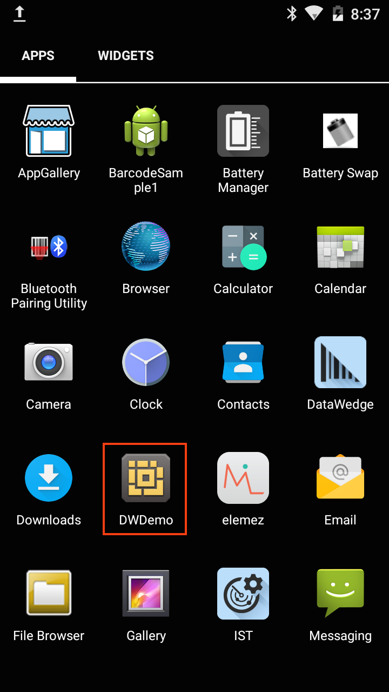
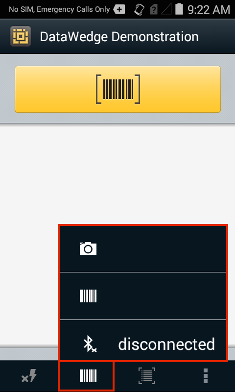
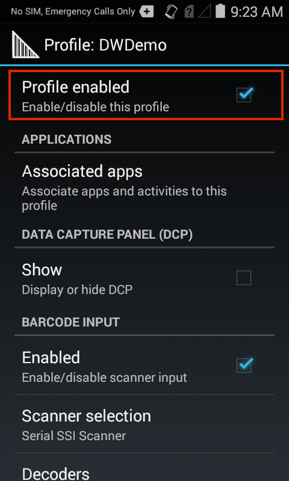

<h2 id="dwdemoapp">DWDemo App</h2>

DWDemo is an app that demonstrates how data is acquired by an application using the DataWedge service. A DataWedge Profile called "DWDemo" is installed along with DataWedge and associated with the demo app. Disabled by default, the Profile can be modified as needed for testing and demo purposes. Once the demo Profile is enabled (see below), pressing the app's Scan button or a device trigger initiates a barcode scan and decoded data is displayed on the screen. The DWDemo app supports scanning with the imager, camera, Bluetooth device or a magstripe reader (MSR), if one is connected. 

This guide requires a working knowledge of DataWedge Profiles. For more information about Profile settings, see the <a href="../setup">DataWedge Setup Guide</a>.  

<em>The DWDemo app as it appears in the Android App Drawer</em>. 
 

<h4 id="deviceselector">Device Selector</h4>

The DWDemo app provides a menu of available scanning input devices, making it easy to switch from one to another for testing purposes. This and other DataWedge settings and preferences also can be configured in the DWDemo Profile, shown below. For information about Profile settings, see the <a href="../setup">DataWedge Setup Guide</a>.  

 
<strong>Device controls</strong> (from left to right):

<ul>
<li><strong>Lightning Bolt -</strong> toggles the Camera Flash on and off (active when Camera is selected); controls illumination mode for other devices. </li>
<li><strong>Input Device -</strong> permits selection of Camera, Scanner or Bluetooth device (if no Bluetooth device is connected, selecting Bluetooth will attempt to pair). </li>
<li><strong>Camera input type -</strong> toggles between image and barcode data capture (active when Camera is selected; varies by device).</li>
<li><strong>DWDemo "hamburger" menu -</strong> invokes "About" panel and DWDemo Profile (see below).</li>
</ul>

<h4 id="dwdemosettings">DWDemo Settings</h4>

 
DWDemo's "hamburger" menu (above) provides access to "Settings," which invoke the DWDemo Profile screen (below). 

<strong>To activate scanning in the DWDemo app, the "Profile enabled" checkbox must be checked</strong> (as shown). Additional settings can be changed as required. 

 

<strong>To perform a test scan, tap the orange Scan button</strong> or <strong>press the device Scan trigger</strong> while pointing at an object to be scanned. 

Acquired data appears in the window, as below.

<em>The DWDemo app showing two acquired values</em>. 
 

By making changes in the DWdemo Profile, the DWDemo app can be used to test different decoders, rules for processing acquired data and other DataWedge configuration variations. For information about changing Profile settings, see the Profiles section of the <a href="../setup">DataWedge Setup Guide</a> and the Advanced Data Formatting section of the <a href="../advanced">Advanced Settings Guide</a>.  
