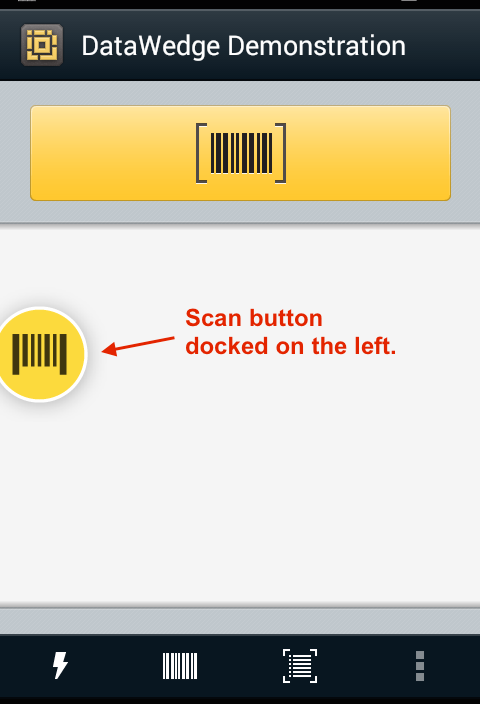

<h2 id="overview">Overview</h2>

Data Capture Plus (formerly known as the "Data Capture Panel") enables areas of the device screen to be designated as scan triggers. By tapping on such a screen area, DataWedge will respond as it would to a scanner button-press or other hardware trigger. DCP is disabled by default. 

The DataWedge profile configuration screen allows an app user to configure the appearance of DCP on the screen after a particular Profile is loaded. If the user checks the option to enable the DCP, the five parameters shown below appear on the preference screen and can be configured as desired.

<strong>Note: The DCP will not appear if the scanner is disabled in the active Profile</strong>.

<em>Data Capture Plus options for setting scan triggers</em> 
 

<h3 id="dockbuttonon">Dock button on</h3>

Sets the initial docking location of the floating DCP button. Changes by the user at runtime are saved to the active Profile. 

<strong>Docking options</strong>:

<ul>
<li>Right side only</li>
<li>Left side only</li>
<li>Either side</li>
</ul>

<em>Data Capture Plus shown in minimized mode</em> 
 

<h3 id="startin">Start in</h3>

Sets the mode that DCP will startup with. If configured to launch as a button, the DCP mode can be changed at runtime by dragging, but the launch state will not be changed in the Profile. 

<strong>Start-in options</strong>: 

<ul>
<li>Button mode (floating button)</li>
<li>Full-screen mode</li>
<li>Button-only mode</li>
</ul>

<em>Data Capture Plus shown in maximized mode</em> 
 

<h3 id="buttonhighestposition">Button highest position</h3>

Sets a ceiling for button position expressed as a percentage of total screen height. For example, on a screen measuring four inches vertically, a setting of 75 (%) would prevent the upper edge of the DCP button from being positioned less than one inch from the top of the screen. 

<h3 id="bottomlowestposition">Bottom lowest position</h3>

Sets a floor for button position expressed as a percentage of total screen height. For example, on a screen measuring four inches vertically, a setting of 25 (%) would prevent the lower edge of the DCP button from being positioned less than one inch from the bottom of the screen.

<h3 id="dragdetecttime">Drag Detect Time</h3>

The wait time (in ms) that DCP should wait after a screen tap before triggering a scanner action. This can help prevent accidental triggers when dragging the DCP button to a new location.

<strong>Note</strong>: A quick touch and release of the DCP can sometimes start the viewfinder when using camera as a scanner. To exit, press the back button.

<strong>Note</strong>: If configured to launch as a button, the DCP mode can be changed at runtime by dragging, but the launch state will not be changed in the Profile. However, runtime changes to the vertical position and the docking side of device screen <em><strong>will</strong></em> be saved to the active Profile.

<h2 id="scanningwithdcp">Scanning with DCP</h2>

<strong>To scan a barcode with DCP</strong>: 

&#49;. With DCP enabled, <strong>tap and hold the area of the screen designated for DCP</strong>. The scan beam (or camera viewfinder) will be active while the tap is held. 

&#50;. <strong>Aim the scan beam or camera reticle at the barcode</strong> to be scanned. DCP will use the preferences configured in the Barcode Input Plug-in for the current Profile.

&#51;. <strong>Release finger to stop scanning</strong> or to close the camera viewfinder.

<strong>Note</strong>: A quick touch and release of the DCP control sometimes will start the viewfinder when using camera as a scanner. To exit, press the BACK button.

<strong>Related guides</strong>:

<ul>
<li><a href="../../profiles">Profiles/Plug-ins</a></li>
<li><a href="../barcode/#decoderselection">Input Parameters</a></li>
<li><a href="../../api">DataWedge APIs</a> </li>
</ul>