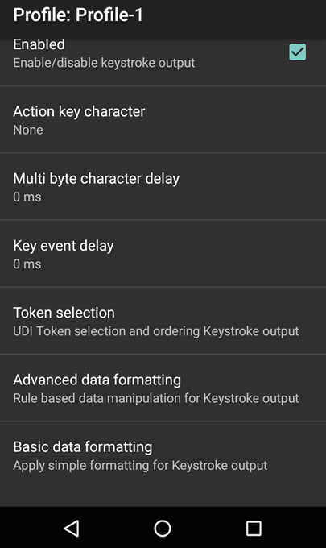

<h2 id="overview">Overview</h2>

<strong>Output Plug-ins</strong> send the processed data to the associated application or server. Those included with DataWedge are explained below. 

<strong>The Keystroke Output Plug-in</strong> collects the processed data and sends it to the associated application as a series of keystrokes, emulating the actions of a user pressing the keys.

<strong>The Intent Output Plug-in</strong> sends the processed data to the associated foreground application as payload within an Android Intent.

<strong>The IP Output Plug-in</strong> allows captured data to be sent to a specified IP address and port using either TCP or UDP transport protocols to a Windows server running Zebra IPWedge software. Please refer to the <a href="../ipwedge">IP Output Guide</a> for further information. <!-- **Note: Profile0 cannot be used with IPWedge**. 10/18/16- removed per Tharindu -->

<strong>DataWedge Output Options</strong>:

<ul>
<li><a href="../intent">Intent</a> (programmatic data hand-off)</li>
<li><a href="../ip">Internet Protocol</a> (to a PC or server via TCP or UDP) </li>
<li><a href="../keystroke">Keystroke</a> (keyboard emulation)</li>
</ul>

The "Auto" option will automatically determine the best scanning device from the list of available devices based on the rules below. 

<strong>Auto Scanner Selection Rules</strong>:

<ul>
<li>If a Zebra Scan Module or Scan/MSR Module is installed, the 2D imager will be selected. </li>
<li>If no Scan Module is installed, the camera will be selected. </li>
<li>When the camera is selected, scanning is performed with the rear-facing camera.</li>
<li>When 2D Imager is selected, scanning is performed using the installed Scan or Scan/MSR module.</li>
</ul>
<h4 id="bluetoothscanners">Bluetooth Scanners</h4>

DataWedge supports the following Zebra Bluetooth scanners: 

<ul>
<li><strong>RS507</strong> Cordless Ring Scanner</li>
<li><strong>RS6000</strong> Ring Scanner</li>
<li><strong>DS3678</strong> Ultra-Rugged Scanner</li>
</ul>

Bluetooth scanners are supported according to the following rules:

<ul>
<li><strong>To initially configure the RS507</strong> in a Profile, the scanner must be paired and connected.</li>
<li><strong>After initial configuration</strong>, the Bluetooth scanner can be enabled and disabled in the Profile even if it is disconnected from the device. However, to configure reader parameters, decoders and other scanner settings, the Bluetooth scanner must be connected.</li>
<li><strong>DataWedge will not automatically reconnect</strong> to a Bluetooth scanner if that scanner is connected while DataWedge is using a different auto-selected scanner. To re-enable a Bluetooth scanner, connect the scanner and select it in the Profile or re-choose the Auto select option.</li>
<li><strong>Auto-selection and Battery Swap -</strong> If Scanner selection is set to Auto and the RS507 was enabled prior to a battery swap, DataWedge will continue working with that RS507 scanner upon reconnection after the battery is swapped. If the RS507 does not reconnect with after the swap, DataWedge will revert to the current default scanner.</li>
<li><strong>Keep Enabled on Suspend -</strong> This mode is supported on Bluetooth and pluggable scanners, and might result in faster battery drain than would otherwise be expected while in suspend mode. <strong>Note: The Zebra computing device will wake from suspend mode when the RS507 scan trigger is pressed</strong>.</li>
</ul>
<h2 id="simulscaninput">SimulScan Input</h2>

The SimulScan Input Plug-in permits simultaneous capture of barcodes, images, text, signatures, phone numbers and other data on multi-part forms. The SimulScan Input Plug-in adds this capability to DataWedge. When form data is captured according to a designated SimulScan template, data can be processed or formatted as required using Process Plug-ins. 

<em>SimulScan Input Plug-in options</em>.
 

<strong>SimulScan Capture Notes</strong>:

<ul>
<li><strong>Text captured through SimulScan</strong> is concatenated into a single string, and processing is performed on that string.</li>
<li><strong>If the Barcode Input Plug-in is enabled</strong> in a Profile, enabling SimulScan in that Profile will cause the Barcode Input Plug-in to be disabled. </li>
</ul>

<strong>Device Selection -</strong> permits selection between the device camera or the default scanning device set by the system.  

<strong>Template selection -</strong> sets a SimulScan template for the Profile being configured. 

<strong>Templates included with DataWedge</strong>:

<ul>
<li>
<strong>BankCheck.xml -</strong> captures the account number and routing number from the machine-readable zone (MRZ) of a check.
</li>
<li>
<strong>Barcode1.xml -</strong> decodes a single barcode of any symbology.
</li>
<li>
<strong>Barcode2.xml -</strong> decodes two barcodes of the same or differing symbologies.
</li>
<li>
<strong>Barcode4.xml -</strong> decodes four barcodes of the same or differing symbologies.
</li>
<li>
<strong>Barcode5.xml -</strong> decodes five barcodes of the same or differing symbologies.
</li>
<li>
<strong>Barcode10.xml -</strong> decodes 10 barcodes of the same or differing symbologies.
</li>
<li>
<strong>BookNumber.xml -</strong> decodes 10- or 13-digit ISBN codes.
</li>
<li>
<strong>DocCap+Optional-Barcode.xml -</strong> captures the form as an image and optionally decodes a barcode if present. This is the default form if none is selected.
</li>
<li>
<strong>DocCap+Required-Barcode.xml -</strong> captures the form and decodes any available barcode.
</li>
<li>
<strong>TravelDoc.xml -</strong> captures information from the machine-readable zone (MRZ) of a travel document such as a passport.
</li>
<li>
<strong>Unstructured Multi-Line.xml -</strong> uses OCR to acquire multiple lines of alpha/numeric text.
</li>
<li>
<strong>Unstructured Single Line.xml -</strong> uses OCR to acquire a single line of alpha/numeric text.
</li>
</ul>

<em>The names of all Templates included with SimulScan are preceded by the word "Default" plus a hyphen</em>.

Custom template XML files copied to the following device directory will be available for selection using this option:

<code>/enterprise/device/settings/datawedge/templates</code> 

<strong>Note: Files and folders within the /enterprise directory are invisible to Android File Browser</strong> by default; they can be made visible by manually inputting the path.

Partners and other authorized users can create custom templates online using Zebra's <a href="../../../../simulscan/1-1/guide/templatebuilder">SimulScan Template Builder</a>. 

<strong>Region separator -</strong> is used to configure a separator character for SimulScan text-region data. When multiple text regions exist, the region separator will be inserted between the data strings from each region on the acquisition form. Region separators can be used with the Keystrokes Plug-in Action key character setting (see below) to dispatch SimulScan region data to separate text fields.

Possible values:

<ul>
<li>None (default)</li>
<li>Tab</li>
<li>Line feed </li>
<li>Carriage return </li>
</ul>

<strong>Notes</strong>: 

<ul>
<li><strong>Barcode, OCR and OMR regions</strong> are considered as text regions. When using keystroke output and IP output, only text-region data will be dispatched to the foreground application or the remote server.</li>
<li><strong>Picture-region data</strong> can be retrieved only through the Intent Output Plug-in.</li>
</ul>
<h2 id="keystrokeoutput">Keystroke Output</h2>

The Keystroke Output Plug-in collects the processed data and sends it to the associated application as a series of keystrokes, emulating the actions of a user pressing the keys. 

<em>Keystroke Output Plug-in options</em>. 
 

<strong>Action key character -</strong> enables injection of a special character embedded within barcode or MSR data.

Possible values:

<ul>
<li><strong>None -</strong> inject no action key</li>
<li><strong>Tab -</strong> inject action key in place of a ASCII Tab (0x09) character</li>
<li><strong>Line feed -</strong> inject action key in place of ASCII LF (0x0A) character</li>
<li><strong>Carriage return -</strong> inject action key in place of ASCII CR (0x0D) character</li>
</ul>

<strong>Multi byte character delay -</strong> used to set an inter-character delay (in ms) for sending multibyte characters. This parameter can help avoid problems that arise when sending Unicode and multibyte characters to the Android browser. Value is set to zero by default. If experiencing errors in the delivery of keystrokes, increase the delay value in increments of 100 ms.

<strong>Key event delay -</strong> used to set a delay (in ms) for dispatching control characters as keystrokes to the foreground application. 

<!-- 
Send data - Set to transfer the captured data to the foreground application. Disabling this option prevents the actual data from being transmitted. However, the prefix and suffix strings, if present, are still transmitted even when this option is disabled (default - enabled).
-->
<h2 id="basicdataformatting">Basic Data Formatting</h2>

The Basic Format Process Plug-in provides an easy way to append or prepend acquired data with custom values or keystrokes before passing it to an Output Plug-in. It also permits the conversion of data to hexadecimal format. If the Basic Formatting Plug-in is not enabled, captured data is passed to the selected Output Plug-in without modification.

<em>Basic Data Formatting Output Plug-in options</em>. 
 

<strong>Prefix to data -</strong> adds (prepends) the specified characters(s) <strong>to the beginning</strong> of the acquired data before sending.

<strong>Suffix to data -</strong> adds (appends) the specified characters(s) <strong>to the end</strong> of the acquired data before sending.

<strong>Send data -</strong> Enabled by default, this allows transfer of the captured data to the associated application when it comes to the foreground. <strong>Note</strong>: Disabling this option prevents only the <em>captured</em> data from being transferred; any prefix and/or suffix strings will be handed to the associated application(s), even when this option is disabled.

<strong>Send as hex -</strong> sends the data in hexadecimal format. For example, if the acquired barcode data is 012345, this option would send the hex equivalent of 30<strong>31</strong>32<strong>33</strong>34<strong>35</strong>. 

<strong>Send TAB key -</strong> appends a TAB character to the processed data. 

<strong>Send ENTER key -</strong> appends an Enter character to the processed data. 

<h2 id="advanceddataformatting">Advanced Data Formatting</h2>

The Advanced Data Format Process Plug-in allows for acquired data to be customized to suit any requirement based on a set of complex rules containing individual or multiple criteria and actions. For more information, please see the <a href="../advanced">Advanced Data Formatting Guide</a>. 

<h2 id="intentoutput">Intent Output</h2>

The Intent Output Plug-in allows acquired data to be passed programmatically to an application using the Android Intent mechanism. The core components of an application (its activities, services, and broadcast receivers) are activated by Intents. An Intent Object is a bundle of information that describes a desired action. It includes the data to be acted upon, the category of component that should perform the action and some other pertinent instructions. When an Intent is initiated, Android locates an appropriate component to respond to the Intent, launches a new instance of the component (if needed), and passes the Intent Object to it.

Components advertise the kinds of Intents they can handle through Intent Filters, which are specified in the <code>AndroidManifest.xml</code> file as &lt;intent-filter&gt; elements. A component may have any number of Intent Filters, each describing a different capability. 

<em>Intent Output Plug-in options</em>. 
 

DataWedge invokes an Intent though an <strong>Intent Action</strong> in an <strong>Intent Category</strong> as described in its <code>AndroidManifest.xml</code> file. For example, if the DataWedge manifest contains the lines…

<pre><code>&lt;intent-filter&gt;
    ...
    &lt;action android:name="com.myapp.action" /&gt;
    &lt;category android:name="android.intent.category.DEFAULT" /&gt;
    ...
&lt;/intent-filter&gt;
</code></pre>

…then the <strong>Intent Action</strong> in the Intent Output Plug-in would be <code>com.myapp.action</code> and the <strong>Intent Category</strong> would be <code>android.intent.category.DEFAULT</code>.

The Intent Delivery option allows the method by which the Intent is delivered to be specified. Intent-based data is delivered through one of three delivery mechanisms:  

<ul>
<li>
<strong>Send via startActivity</strong> 
</li>
<li>
<strong>Send via startService</strong> 
</li>
<li>
<strong>Broadcast Intent</strong> 
</li>
</ul>

When Intent delivery is sent via Broadcast Intent, DataWedge sets the <strong>Receiver foreground flag</strong> <code>Intent.FLAG_RECEIVER_FOREGROUND</code> in the broadcast Intent, giving the broadcast recipient permission to run at foreground priority with a shorter timeout interval. This flag is set only when Intent delivery is set to Broadcast Intent. <strong>Note: Use this flag only if delays are seen in delivery of Intents immediately following device boot-up</strong>.

<h4 id="decoderelateddata">Decode-related data</h4>

The decode-related data added to an Intent bundle can be retrieved using the followng call: 

<ul>
<li><code>Intent.getStringtExtra()</code></li>
</ul>
<!-- * `Intent.getSerializableExtra()`-->

The call above can be used with the following String tags:

<ul>
<li>
<strong>String LABEL<em>TYPE</em>TAG = "com.symbol.datawedge.label_type"</strong>; String contains the barcode label type
</li>
<li>
<strong>String DATA<em>STRING</em>TAG = "com.symbol.datawedge.data_string"</strong>; String contains the output data as a String. In the case of concatenated barcodes, the decode data is concatenated and sent out as a single string.
</li>
<li>
<strong>String DECODE<em>DATA</em>TAG = "com.symbol.datawedge.decode_data"</strong>; Decode data is returned as a list of byte arrays. In most cases there will be one byte array per decode. For barcode symbologies that support concatenation (i.e. Codabar, Code128, MicroPDF, etc.) the decoded data is stored in multiple byte arrays (one byte array, per bar code). Clients can get data in each byte array by passing an index.
</li>
</ul>
<h4 id="msrrelateddata">MSR-related data</h4>

The MSR-related data added to an Intent bundle can be retrieved using the following calls: 

<ul>
<li><code>Intent.getStringtExtra()</code></li>
</ul>
<!-- * `Intent.getSerializableExtra()` -->

The calls above can be used with the following String tags:

<ul>
<li>
<strong>String MSR<em>DATA</em>TAG = "com.symbol.datawedge.msr_data"</strong>;
The data from the MSR tracks is concatenated and sent out as a byte array. The Start/end sentinels and track separators are included as configured.
</li>
<li>
<strong>String MSR<em>TRACK1</em>TAG = "com.symbol.datawedge.msr_track1"</strong>; MSR track 1 data is returned as a byte array.
</li>
<li>
<strong>String MSR<em>TRACK2</em>TAG = "com.symbol.datawedge.msr_track2"</strong>; MSR track 2 data is returned as a byte array.
</li>
<li>
<strong>String MSR<em>TRACK3</em>TAG = "com.symbol.datawedge.msr_track3"</strong>; MSR track 3 data is returned as a byte array.
</li>
<li>
<strong>String MSR<em>TRACK1</em>STATUS<em>TAG = "com.symbol.datawedge.msr</em>track1_status"</strong>; MSR track 1 decode status as an Integer where 0 indicates a successful decode.
</li>
<li>
<strong>String MSR<em>TRACK2</em>STATUS<em>TAG = "com.symbol.datawedge.msr</em>track2_status"</strong>; MSR track 2 decode status as an Integer where 0 indicates a successful decode.
</li>
<li>
<strong>String MSR<em>TRACK3</em>STATUS<em>TAG = "com.symbol.datawedge.msr</em>track3_status"</strong>; MSR track 3 decode status as an Integer where 0 indicates a successful decode.
</li>
</ul>
<h4 id="simulscanrelateddata">SimulScan-related Data</h4>

The SimulScan-related data added to an Intent bundle can be retrieved using the following calls: 

<ul>
<li><code>Intent.getStringtExtra()</code></li>
<li><code>Intent. getParcelableArrayListExtra()</code></li>
<li><code>Bundle.getInt()</code></li>
<li><code>Bundle.getString()</code></li>
<li><code>Bundle.getByteArray()</code></li>
</ul>
<!-- * `Intent.getSerializableExtra()` -->

The calls above can use the following String tags:

<ul>
<li>
<strong>String SIMULSCAN<em>TEMPLATE</em>NAME<em>TAG = "com.symbol.datawedge.simulscan</em>template_name"</strong>; The name of the template which used by SimulScan to capture the form.
</li>
<li>
<strong>String SIMULSCAN<em>REGIONS</em>BUNDLE<em>TAG= "com.symbol.datawedge.simulscan</em>region_data"</strong>; Return an array of Bundles where each bundle contains data and information about a region and the form.
</li>
<li>
<strong>String SIMULSCAN<em>REGION</em>NAME<em>TAG = "com.symbol.datawedge.simulscan</em>region_name"</strong>; Returns the region name of the bundle object for reach region. To get the region name <code>Bundle.getString()</code> should be called.
</li>
<li>
<strong>String SIMULSCAN<em>REGION</em>ID<em>TAG = "com.symbol.datawedge.simulscan</em>region_id"</strong>; Returns the region id of the bundle object for reach region. Region id is an integer and can be retrieved by calling <code>Bundle.getInt ()</code>.
</li>
<li>
<strong>String SIMULSCAN<em>REGION</em>STRING<em>DATA= "com.symbol.datawedge.simulscan</em>region<em>string</em>data"</strong>; Returns the string data of the region. String data comes with barcode, OCR and OMR data.
</li>
<li>
<strong>String SIMULSCAN<em>REGION</em>BINARY<em>DATA= "com.symbol.datawedge.simulscan</em>region<em>string</em>data"</strong>;
Returns the data of the region in the form of byte array. Binary data comes only for picture regions and the form image. Both picture and form data can be load in to a bitmap and display in the application.
</li>
<li>
<strong>String SIMULSCAN<em>REGION</em>TYPE<em>TAG = "com.symbol.datawedge.simulscan</em>region_type"</strong>; Returns the region type of the bundle object for reach region. Region type is a string and can be retrieved by calling <code>Bundle.getString ()</code>. 
</li>
</ul>

Possible return values for the region type:

<ul>
<li><strong>Barcode -</strong> Region is a barcode.</li>
<li><strong>OCR -</strong> Region is an Optical Character Recognition (OCR) region (i.e name or address). </li>
<li><strong>OMR -</strong> Region is an Optical Mark Recognition (OMR) region (i.e checkbox, radio button).</li>
<li><strong>Picture -</strong> Region is a picture; data will be in the JPEG format.</li>
<li><strong>Form -</strong> Form type to specify that the bundle contains a picture of the captured form. Form image will be in the JPEG format.</li>
</ul>

<strong>Important</strong>: For some scanning applications, it might be preferable for decoded data to be sent directly to the current activity and not necessarily displayed. For such instances, the activity must be designated  as "singleTop" in its AndroidManifest.xml file. Failure to designate an activity in this way will cause an instance of the activity to be launched on every decode, and the data sent to each newly spawned copy. 

For more information about Android Intents, please refer to the <a href="https://developer.android.com/guide/components/intents-filters.html">Android Developer site</a>.

<h2 id="ipoutput">IP Output</h2>

The IP Output Plug-in enables captured data to be transferred over a network to a computer running IPWedge, a small Windows app made by Zebra. The PC receives the data as keystrokes or in its Clipboard, in essence turning the device into a wireless scanner for the PC. 

To configure a device to use the IP Output Plug-in, it's necessary to know the IP address of the PC as well as the port number to which the PC will be listening. To set up the PC first, see the <a href="../ipwedge">IPWedge Guide</a> for IPWedge download and set-up instructions. Then resume from here.

<h4 id="setuptheipoutputplugin">Set up the IP Output Plug-in:</h4>

<strong>From the Profile in which to activate the IP Output Plug-in</strong>:  

&#49;. Locate the IP Output section of the Profile.  

&#50;. <strong>Check "Enabled" and "Remote Wedge" boxes</strong> to enable IP Output and communication with the IPWedge server component.

<em>IP Output Plug-in options</em>. 
 

&#51;. <strong>Select the desired Protocol</strong> for data transport (TCP or UDP) or accept the default (TCP).

&#52;. <strong>Enter the IP address</strong> of the server running IPWedge software.

&#53;. <strong>Enter the Port number</strong> if other than the default of 58627. 

<h3 id="usingipoutputpluginwithoutipwedge">Using IP Output Plug-in without IPWedge</h3>

it is possible to use the IP Output Plug-in to send captured data to a remote device without IPWedge. At the data receiving end, the PC or Mobile device should have a client application that listens to TCP or UDP data coming from the configured port and IP address in IP Output Plug-in. To get IP output plug-in configured to send captured data to a remote computer or device, follow these steps.

&#49;. Locate the IP Output section of the Profile.  

&#50;. <strong>Check "Enabled" box</strong> and <strong><em>uncheck</em> the "Remote Wedge" box</strong>.

&#51;. <strong>Select the desired Protocol</strong> for data transport (TCP or UDP) or accept the default (TCP).

&#52;. <strong>Enter the IP address</strong> of the server running IPWedge software.

&#53;. <strong>Enter the Port number</strong> if other than the default of 58627. 

<strong>Warning: Zebra does not support this usage scenario</strong>.

<h2 id="datacaptureplusdcp">Data Capture Plus (DCP)</h2>

Data Capture Plus (formerly known as the "Data Capture Panel") enables areas of the device screen to be designated as scan triggers. By tapping on a designated screen area, DataWedge will respond as it would to a scanner button-press or other hardware trigger.

DCP is disabled by default. The DataWedge Profile configuration screen allows an app user to configure the appearance of DCP on the screen once a particular Profile is loaded. If the user checks the option to enable the DCP, the five parameters shown below appear on the preference screen and can be configured as desired.

<strong>Note: The DCP will not appear if the scanner is disabled in the current Profile</strong>.

<em>Data Capture Plus options for setting scan triggers</em>. 
 

Data Capture Plus offers these configurable parameters:

<strong>Dock button on -</strong> Sets the initial docking location of the floating DCP button. Changes by the user at runtime are saved to the active Profile. Docking options:  

<ul>
<li>Right side only</li>
<li>Left side only</li>
<li>Either side</li>
</ul>

<strong>Start in -</strong> Sets the mode that DCP will startup with. If configured to launch as a button, the DCP mode can be changed at runtime by dragging, but the launch state will not be changed in the Profile. Start-in options: 

<ul>
<li>Button mode (floating button)</li>
<li>Full-screen mode</li>
<li>Button-only mode</li>
</ul>

<strong>Button highest position -</strong> Sets a ceiling for button position expressed as a percent of screen height. For example, on a screen measuring four inches vertically, a setting of 75 (%) would prevent the upper edge of the DCP button from being positioned less than one inch from the top of the screen. 

<strong>Bottom lowest position -</strong> Sets a floor for button position expressed as a percent of screen height. For example, on a screen measuring four inches vertically, a setting of 25 (%) would prevent the lower edge of the DCP button from being positioned less than one inch from the bottom of the screen.

<strong>Drag Detect Time -</strong> The wait time (in ms) that DCP should wait after a screen tap before triggering a scanner action. This can help prevent accidental triggers when dragging the DCP button to a new location.

<strong>Note</strong>: A quick touch and release of the DCP can sometimes start the viewfinder when using camera as a scanner. To exit, press the back button.

<em>Data Capture Plus shown in minimized mode</em>. 
 

<strong>Note</strong>: If configured to launch as a button, the DCP mode can be changed at runtime by dragging, but the launch state will not be changed in the Profile. However, runtime changes to the vertical position and the docking side of device screen <em><strong>will</strong></em> be saved to the active Profile.

<em>Data Capture Plus shown in maximized mode</em>. 
 

<h3 id="scanningwithdcp">Scanning with DCP</h3>

<strong>To scan a barcode with DCP</strong>: 

&#49;. With DCP enabled, <strong>tap and hold the area of the screen designated for DCP</strong>. The scan beam (or camera viewfinder) will be active while the tap is held. 

&#50;. <strong>Aim the scan beam or camera reticle at the barcode</strong> to be scanned. DCP will use the preferences configured in the Barcode Input Plug-in for the current Profile.

&#51;. * <strong>Release finger to stop scanning</strong> or to close the camera viewfinder.

<strong>Note</strong>: A quick touch and release of the DCP control sometimes will start the viewfinder when using camera as a scanner. To exit, press the BACK button.

<strong>Related guides</strong>:

<ul>
<li><a href="../../profiles">Profiles/Plug-ins</a></li>
<li><a href="../../api">DataWedge APIs</a> </li>
</ul>