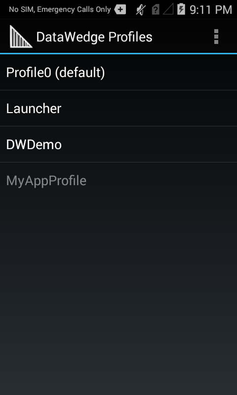
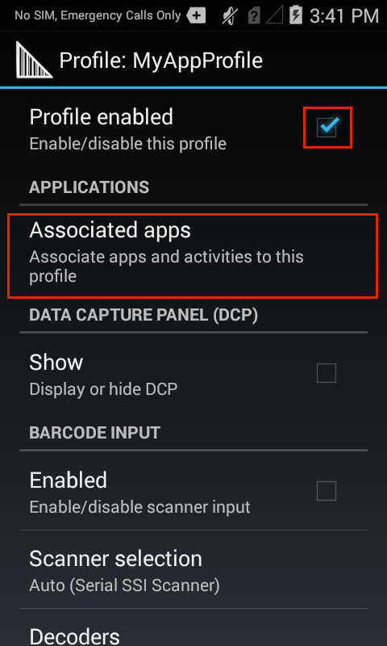
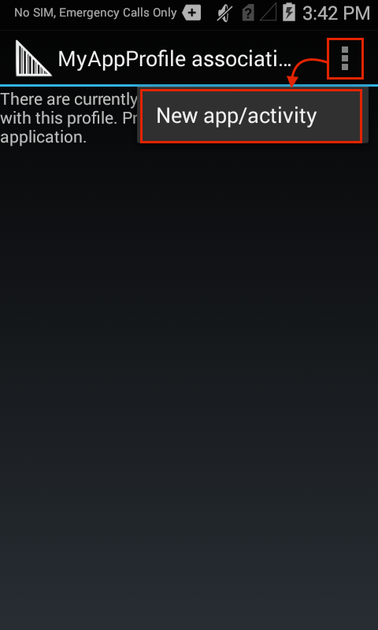
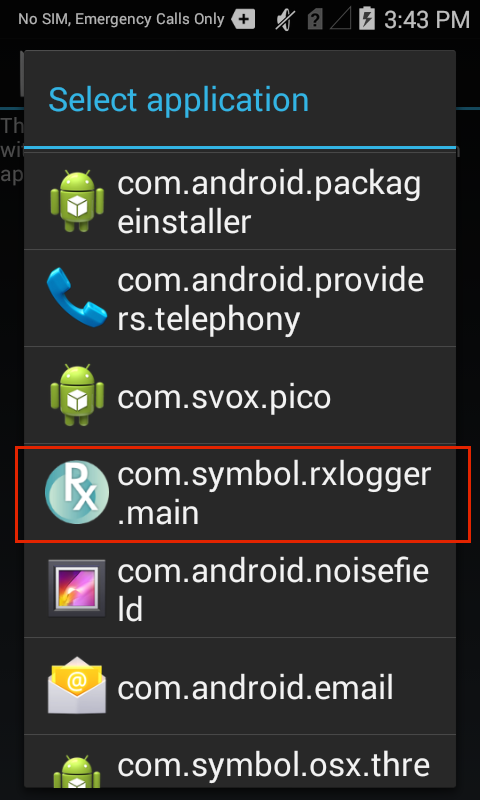
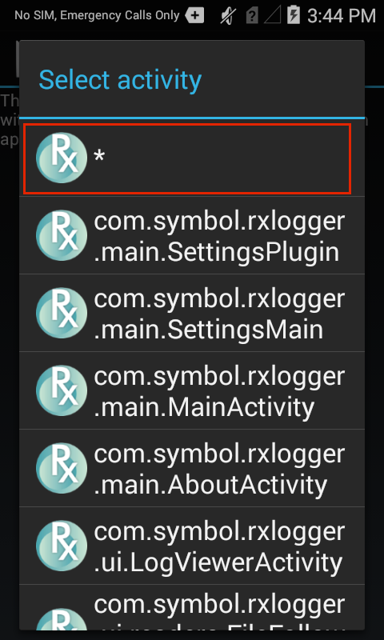
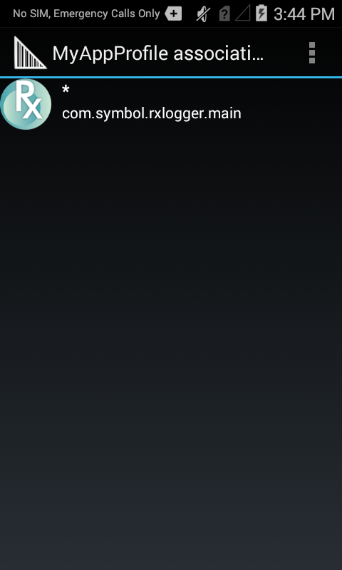
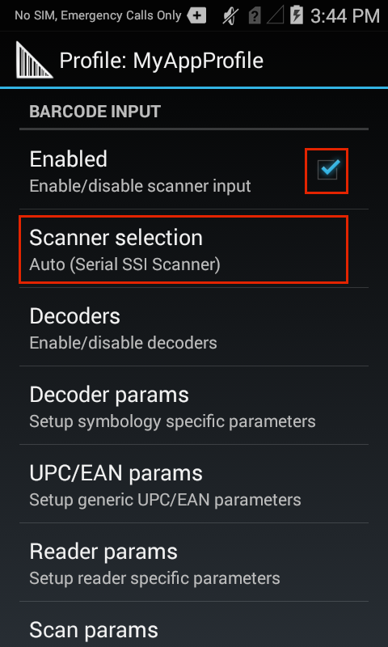
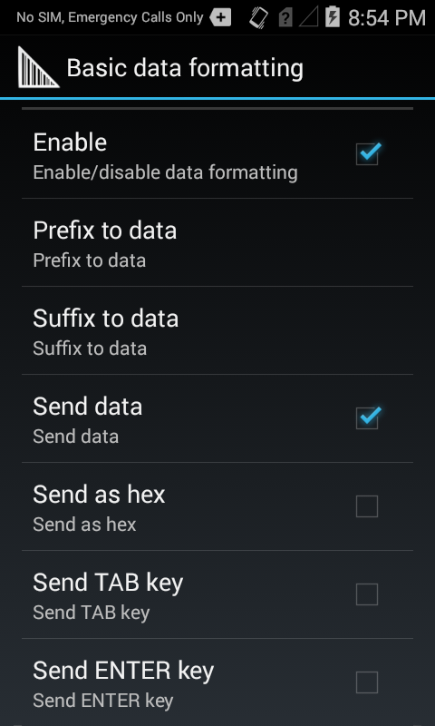

<h2 id="overview">Overview</h2>

DataWedge can be associated with any app on the device and called upon to acquire barcode, mag-stripe or other data, to process the data in a specified way, and to pass it to one or more apps. Therefore, each Profile must specify these three things: 

<ol>
<li>
<strong>Input device</strong> determines whether to acquire data from <a href="../input/barcode">barcodes</a>, a <a href="../input/msr">magnetic stripe</a> or using <a href="../input/simulscan">SimulScan</a>.
</li>
<li>
<strong>Process options</strong> manipulate the acquired data using <a href="../process/bdf">Basic</a> or <a href="../process/adf">Advanced</a> data formatting processes. 
</li>
<li>
<strong>Output method</strong> specifies whether to pass data as <a href="../output/keystroke">keystrokes</a>, within an <a href="../output/intent">intent</a> and/or over an <a href="../output/ip">IP network</a>. 
</li>
</ol>

For more information about DataWedge Profiles, see the <a href="../overview">Architecture Overview</a>. 

<h2 id="createanewprofile">Create a New Profile</h2>

The launcher icon for DataWedge varies from one system and version to another. The icon for DataWedge 6.x is shown below. Locate the DataWedge icon and tap it to begin. 

<em>Launcher icon for DataWedge 6.x</em>
 

On a new installation, the DataWedge Profiles screen appear similar to that of the image below, showing the three included (visible) Profiles. White text indicates enabled Profiles. Also shown is a fourth, disabled Profile (grey text) that's not present out-of-the-box. 

<strong>Note</strong>: If DataWedge had been opened previously, it will reopen to the last screen used. If necessary, press BACK until the Profiles screen appears. 
 

&#50;. <strong>Tap the "hamburger"</strong> menu and <strong>select -> New profile</strong>. 

 

&#51;.  <strong>Enter a name</strong> for the new Profile and <strong>tap OK</strong>. The Profiles list appears, similar to the image in Step 4, below. 

Zebra recommends that Profile names be unique and contain alpha-numeric characters only.
 

<h4 id="associatetheprofilewithappsandoractivities">Associate the Profile with App(s) and/or Activities:</h4>

&#52;. <strong>Tap the Profile</strong> to be associated: 

 

&#53;. From the Profile screen, <strong>tap the "Profile enabled" checkbox</strong> to enable it, then <strong>tap "Associated apps"</strong> to link it with an app or activity:

 

&#54;. <strong>Tap the menu</strong> and <strong>select -> New app/activity</strong>. A list appears with all apps and activities installed on the device. 

 

&#55;. From the device apps/activities list, <strong>select the app or activity to associate</strong> with the Profile being edited. When an app is selected, its activities list appears (see Step 8). 

 

&#56;. From the app activities list, <strong>tap the asterisk to associate all app activities</strong> with the Profile, or tap on an indvidual activity to use DataWedge for <strong>that specific activity only</strong>:

 

&#57;. The app now appears in the Profile associations list as below. <strong>Repeat Steps 6-8</strong> until all desired apps and/or activities are associated. 

When finished adding associations, <strong>Tap the BACK button</strong> to return to the Profile screen. 
 
 

<h4 id="configureaprofileforinputprocessingandoutput">Configure a Profile for Input, Processing and Output:</h4>

&#49;&#48;. From the Profile screen, <strong>enable the desired Input device</strong> (scrolling down as necessary). For example, the Barcode Input displays an option for Scanner selection: 

 

&#49;&#49;. From the Scanner selection screen, <strong>select the desired scanner</strong> or imager. <strong>Tap BACK</strong> to return to the Input screen. 

<strong>Note: Lists such as the one above display only devices that are present on (or connected to) the unit being configured</strong>. For related information, see <a href="../input/barcode/#scannerselection">Scanner Selection</a> in the Barcode Input guide. 
 

&#49;&#50;. From the Decoders screen (accessible from the Input screen), <strong>select only the decoders required by the application</strong> to optimize scanning performance. <strong>Tap BACK</strong> to return to the Input screen. For more information about configuring Decoder parameters, see the <a href="../input/barcode">Barcode Input Guide</a>.

 

&#49;&#51;. From the Profile screen, <strong>select the desired Output method</strong> (scrolling down as necessary). For example, the image below shows that Keystroke Output is enabled: 

<strong>Note</strong>: Output sections contain selectors for configuring "Basic data formatting" and "Advanced data formatting." <strong>These contain the data Processing options</strong>. 
 

&#49;&#52;. <strong>Select the Basic data formatting</strong> for options on inserting special keystrokes or adding text before (prefix) and/or after (suffix) the collected data: 

 

See <a href="../process/bdf">Basic Data Formatting</a> and <a href="../process/adf">Advanced Data Formatting</a> sections for more information about processing of acquired data.
 

The app will now use DataWedge for barcode data acquisition. 

<h2 id="editingprofiles">Editing Profiles</h2>

<strong>To modify, rename, delete or clone a profile</strong>: 

&#49;. <strong>Long-press the Profile name</strong> to bring up its Context menu.

&#50;. <strong>Tap on the desired action</strong>: 

 
Editing a Profile also can be started by tapping the Profile name in the Profile list. 

<strong>Related Guides</strong>: 

<ul>
<li><strong><a href="../overview">Profile Architecture Overview</a> -</strong> explains how DataWedge uses Profiles</li>
<li><strong><a href="../profiles">Profile Options</a> -</strong> links and details for all DataWedge Profile options</li>
<li><strong><a href="../api">DataWedge APIs</a> -</strong> access DataWedge programmatically </li>
</ul>