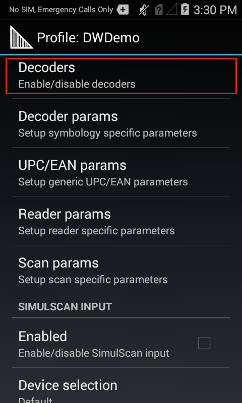
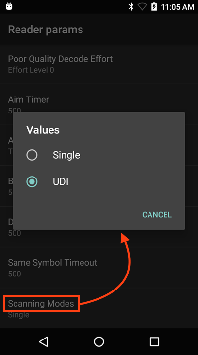
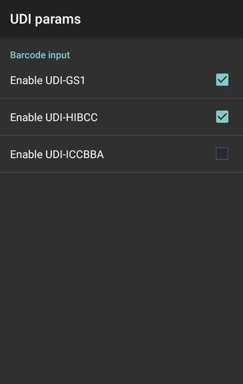
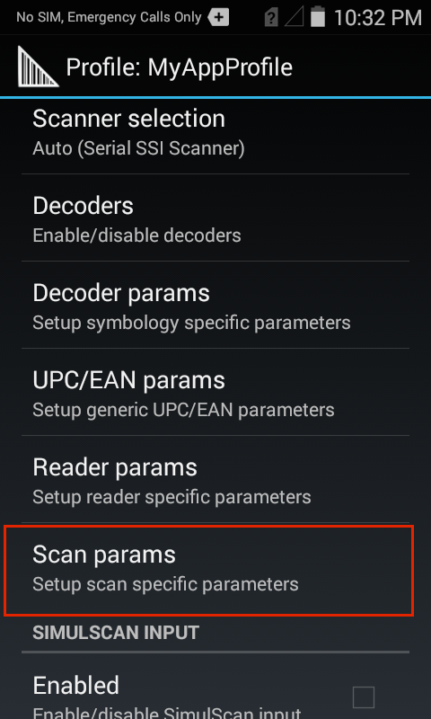

<h2 id="overview">Overview</h2>

Barcode Input options specify the device hardware to be used to acquire barcode data before sending it for processing. Those included with DataWedge are explained below. <strong>DataWedge also provides audio and other feedback to alert the user of scanning results and barcode type. The the <a href="#scanparams">Scanner Parameters</a> section for more information</strong>. 

For input using SimulScan, see the <a href="../simulscan">SimulScan Input Plug-in</a>. 

Barcode Input is used to specify: 

<ul>
<li>Device cameras </li>
<li>1D and 2D and imagers </li>
<li>Laser-based barcode scanners </li>
<li>Bluetooth-connected scanners </li>
<li>USB synchronous serial interface (SSI) scanners </li>
</ul>

<strong>Barcode Scanner Input</strong> reads data from the integrated barcode scanner built into the device, or attached via cable or Bluetooth connection, or implemented as a snap-on module. DataWedge supports lasers, imagers and internal cameras. The raw barcode data that's acquired is processed or formatted as using the Basic and Advanced Data Formatting Processing options that are found near the Output options. 

<strong>Note</strong>: When SimulScan is used, DataWedge concatenates all captured text into a single string, and performs processing on the concatenated string. See the <strong><a href="../simulscan">SimulScan section</a></strong> for details. 

<blockquote>
  
The parameters of this feature can be configured using the <a href="../../api/setconfig">Set Config API</a>.

</blockquote>

<h2 id="scannerselection">Scanner Selection</h2>

For Barcode Input, the Scanner selection panel determines which scanning device will be used for data capture. The list of available scanners will be based devices that are present on (or connected to) the unit being configured. 

 

The "Auto" option automatically determines the best scanning device from the list of available devices based on the rules below. 

<strong>Auto Scanner Selection Rules</strong>:

<ul>
<li>If a Zebra Scan Module or Scan/MSR Module is installed, the 2D imager will be selected. </li>
<li>If no Scan Module is installed, the camera will be selected. </li>
<li>When the camera is selected, scanning is performed with the rear-facing camera.</li>
<li>When 2D Imager is selected, scanning is performed using the installed Scan or Scan/MSR module.</li>
</ul>
<h3 id="bluetoothscanners">Bluetooth Scanners</h3>

DataWedge supports the following Zebra Bluetooth scanners: 

<ul>
<li><strong>RS507</strong> Cordless Ring Scanner</li>
<li><strong>RS6000</strong> Ring Scanner</li>
<li><strong>DS3678</strong> Ultra-Rugged Scanner</li>
</ul>

Bluetooth scanners are supported according to the following rules:

<ul>
<li><strong>To initially configure the RS507</strong> in a Profile, the scanner must be paired and connected.</li>
<li><strong>After initial configuration</strong>, the Bluetooth scanner can be enabled and disabled in the Profile even if it is disconnected from the device. However, to configure reader parameters, decoders and other scanner settings, the Bluetooth scanner must be connected.</li>
<li><strong>DataWedge will not automatically reconnect</strong> to a Bluetooth scanner if that scanner is connected while DataWedge is using a different auto-selected scanner. To re-enable a Bluetooth scanner, connect the scanner and select it in the Profile or re-choose the Auto select option.</li>
<li><strong>Auto-selection and Battery Swap -</strong> If Scanner selection is set to Auto and the RS507 was enabled prior to a battery swap, DataWedge will continue working with that RS507 scanner upon reconnection after the battery is swapped. If the RS507 does not reconnect with after the swap, DataWedge will revert to the current default scanner.</li>
<li><strong>Keep Enabled on Suspend -</strong> This mode is supported on Bluetooth and pluggable scanners, and might result in faster battery drain than would otherwise be expected while in suspend mode. <strong>Note: The Zebra computing device will wake from suspend mode after pressing the scan trigger of any supported scanner</strong>.</li>
</ul>
<h3 id="usbssiscanners">USB SSI Scanners</h3>

DataWedge supports the following Zebra USB SSI scanners: 

<ul>
<li><strong>DS3608</strong> USB SSI Scanner</li>
</ul>

Support notes: 

<ul>
<li>The DS3608 scanner is supported only on VC80, ET50 and ET55 devices running Windows </li>
<li>Scanner must be configured using Symbol Native API (SNAPI) with Imager Interface</li>
<li>SNAPI drivers are included with supported devices</li>
<li>The scanner connects via USB port and cable</li>
</ul>
<blockquote>
  
<strong>Important</strong>: Support for decode parameters can vary depending on the scanning device selected. For device-specific support notes, please refer to the <a href="https://www.zebra.com/us/en/sitesearch.html?q=integrator">Integrator Guide</a> that accompanied the unit. 

</blockquote>

<h2 id="decoderselection">Decoder Selection</h2>

Many input methods include parameters that are configurable according to the expected scan targets and/or preferences of an organization. Enabling a narrow selection of decoders can be used as a means of increasing security, reducing decode errors and improving scan performance. For example, a company that routinely receives packages encoded with Code 128 symbology might help improve efficiency and reduce scan errors by limiting the Code 128 decoders it implements to those of the non-EAN variety. 

Parameters for individual Decoders are modified within a Profile. Each DataWedge Profile can be assigned a unique group of Decoders and Decoder parameters (where applicable) to use with its associated application(s). This guide covers the selection of Decoders and provides details for those with configurable parameters.

DataWedge decodes all major barcode symbologies. Popular formats are enabled by default in all DataWedge Profiles, and are indicated by an (&#42;) in the table below. <strong>To help improve scanning performance, Zebra recommends disabling any Decoders that are not required by the application(s) associated with a given Profile</strong>.

<h3 id="defaultdecoders">Default Decoders</h3>

<table rules="none"
width="100%"
frame="void"
cellspacing="0" cellpadding="4">

<col width="33%" />
<col width="33%" />
<col width="33%" />
<tbody>
<tr>
<td align="left" valign="top">
UPC-E0*
</td>
<td align="left" valign="top">
UPC-E1
</td>
<td align="left" valign="top">
UPC-A*
</td>
</tr>
<tr>
<td align="left" valign="top">
MSI
</td>
<td align="left" valign="top">
EAN-8*
</td>
<td align="left" valign="top">
EAN-13*
</td>
</tr>
<tr>
<td align="left" valign="top">
Codabar*
</td>
<td align="left" valign="top">
Code 39*
</td>
<td align="left" valign="top">
Discrete 2of5
</td>
</tr>
<tr>
<td align="left" valign="top">
Interleaved 2of5
</td>
<td align="left" valign="top">
Code 11
</td>
<td align="left" valign="top">
Code 93
</td>
</tr>
<tr>
<td align="left" valign="top">
Code 128*
</td>
<td align="left" valign="top">
PDF417*
</td>
<td align="left" valign="top">
Trioptic 39
</td>
</tr>
<tr>
<td align="left" valign="top">
MicroPDF*
</td>
<td align="left" valign="top">
MacroPDF*
</td>
<td align="left" valign="top">
Maxicode*
</td>
</tr>
<tr>
<td align="left" valign="top">
Datamatrix*
</td>
<td align="left" valign="top">
QR Code*
</td>
<td align="left" valign="top">
MacromicroPDF*
</td>
</tr>
<tr>
<td align="left" valign="top">
GS1 DataBar
</td>
<td align="left" valign="top">
GS1 DataBar Limited
</td>
<td align="left" valign="top">
GS1 DataBar Expanded
</td>
</tr>
<tr>
<td align="left" valign="top">
Composite AB*
</td>
<td align="left" valign="top">
Webcode
</td>
<td align="left" valign="top">
Composite C*
</td>
</tr>
<tr>
<td align="left" valign="top">
TLC 39*
</td>
<td align="left" valign="top">
USPostnet
</td>
<td align="left" valign="top">
USPlanet
</td>
</tr>
<tr>
<td align="left" valign="top">
UK Postal
</td>
<td align="left" valign="top">
Japanese Postal
</td>
<td align="left" valign="top">
Australian Postal
</td>
</tr>
<tr>
<td align="left" valign="top">
Canadian Postal
</td>
<td align="left" valign="top">
Dutch Postal
</td>
<td align="left" valign="top">
Chinese 2of5
</td>
</tr>
<tr>
<td align="left" valign="top">
Aztec*
</td>
<td align="left" valign="top">
MicroQR
</td>
<td align="left" valign="top">
Korean 3 of 5
</td>
</tr>
<tr>
<td align="left" valign="top">
US4state
</td>
<td align="left" valign="top">
US4state FICS
</td>
<td align="left" valign="top">
Matrix 2of5
</td>
</tr>
<tr>
<td align="left" valign="top">
HAN XIN
</td>
<td align="left" valign="top">

</td>
<td align="left" valign="top">

</td>
</tr>
</tbody>
</table>

&#42; <em>Enabled by default</em>

<strong>Note</strong>: Decoders that do not have configurable parameters do not appear in the Decoder Parameters section.

<h3 id="enabledisabledecoders">Enable/Disable Decoders</h3>

<strong>To enable or disable Decoders</strong>: 

&#49;. <strong>From the Profile being edited, tap Decoders</strong> as highlighted below. A list of Decoders appears similar to the image in Step 2, below. 

 

&#50;. <strong>Select the desired Decoders</strong> by checking the corresponding checkbox. <strong>Deselect Decoders not required</strong> for the app associated with the Profile. 

 

<h3 id="editdecoderparameters">Edit Decoder Parameters</h3>

<strong>To edit Decoder parameters</strong>:

&#49;. <strong>From the Profile being edited, tap Decoder params</strong> as highlighted below. A list of Decoders appears similar to the image in Step 2, below.

 

&#50;. <strong>From the Decoder list, tap a Decoder to edit its parameters</strong>. 

 

<h2 id="decoderparameters">Decoder Parameters</h2>

Editable parameters of individual Decoders are explained below. <strong>Note: Decoders that do not have configurable parameters do not appear in the Decoder Parameters section</strong>. For further instructions about creating and editing DataWedge Profiles, see "<a href="../../createprofile">Manage Profiles</a>" page. 

<h3 id="reducedquietzone">Reduced Quiet Zone</h3>

The quiet zone is the blank space on either side of a bar code that indicates where the symbology begins and ends, and is intended to prevent the reader from scanning irrelevant information. When marginless decoders are used with Reduced Quiet Zone Level reader parameters, the decoders behave according to the following table: 

<em><strong>Descriptions of the 1D Quiet Zone Levels</strong> shown above are in the <a href="#readerparams">Reader Params</a> section along with important warnings</em>. 
 

<h3 id="upce0">UPCE0</h3>

<strong>Report Check Digit -</strong> The check digit is the last character of the symbol used to verify the integrity of the data. Enables or disables this option. A check in the checkbox indicates that the option is enabled.

<strong>Preamble -</strong> Preamble characters are part of the UPC symbol consisting of Country Code and System Character. There are three options for transmitting a UPCE0 preamble:

<strong>Preamble Sys Char -</strong> Transmit System Character only.

<strong>Preamble Country and Sys Char -</strong> Transmit System Character and Country Code ("0" for USA).

<strong>Preamble None -</strong> Transmit no preamble.

Select the appropriate option to match the host system.

<strong>Convert UPCE0 To UPCA -</strong> Enable to convert UPCE0 (zero suppressed) decoded data to UPC-A format before transmission. After conversion, the data follows UPC-A format and is affected by UPC-A programming selections. Disable to transmit UPCE0 decoded data as UPCE0 data, without conversion (default - disabled).

<h3 id="upce1">UPCE1</h3>

<strong>Report Check Digit -</strong> The check digit is the last character of the symbol used to verify the integrity of the data. Enables or disables this option. A check in the checkbox indicates that the option is enabled.

<strong>Preamble -</strong> Preamble characters are part of the UPC symbol consisting of Country Code and System Character. There are three options for transmitting a UPCE1 preamble:

<strong>Preamble Sys Char -</strong> Transmit System Character only.

<strong>Preamble Country and Sys Char -</strong> Transmit System Character and Country Code ("0" for USA).

<strong>Preamble None -</strong> Transmit no preamble.

Select the appropriate option to match the host system.

<strong>Convert UPCE1 To UPCA -</strong> Enable this to convert UPCE1 decoded data to UPC-A format before transmission. After conversion, the data follows UPC-A format and is affected by UPC-A programming selections. Disable this to transmit UPCE1 decoded data as UPCE1 data, without conversion.

<h3 id="upca">UPCA</h3>

<strong>Report Check Digit -</strong> The check digit is the last character of the symbol used to verify the integrity of the data. Enables or disables this option. A check in the checkbox indicates that the option is enabled.

<strong>Preamble -</strong> Preamble characters are part of the UPC symbol consisting of Country Code and System Character. There are three options for transmitting a UPCA preamble:

<strong>Preamble Sys Char -</strong> Transmit System Character only.

<strong>Preamble Country and Sys Char -</strong> Transmit System Character and Country Code ("0" for USA).

<strong>Preamble None -</strong> Transmit no preamble.

Select the appropriate option to match the host system.

<h3 id="msi">MSI</h3>

<strong>Length1&#42; -</strong> To decode an MSI symbol with a specific length range, set this value to the lower limit. For example, to decode MSI symbols containing between 4 and 12 characters, this value would be set to 4.

<strong>Length2&#42; -</strong> To decode an MSI symbol with a specific length range, set this value to the upper limit. For example, to decode MSI symbols containing between 4 and 12 characters, this value would be set to 12.

<em>&#42; See <strong><a href="#decodelengths">Decode Lengths section</a></strong>, below</em>

<strong>Redundancy -</strong> Sets the reader to read the barcode twice before accepting data.

<strong>Check Digit -</strong> With MSI symbols, one check digit is required, and is always verified by the reader. The second check digit is optional.

<strong>One Check Digit -</strong> Verify one check digit.

<strong>Two Check Digits -</strong> Verify two check digits.

<strong>Check Digit Scheme -</strong> Two algorithms are possible for the verification of the second MSI check digit. Select the algorithm used to encode the check digit.

<strong>Mod-11-10 -</strong> First check digit is MOD 11; the second check digit is MOD 10.

<strong>Mod-10-10 -</strong> Both check digits are MOD 10.

<strong>Report Check Digit -</strong> Transmit MSI data with or without the check digit. A check in this checkbox will send MSI data with a check digit.

<h3 id="ean8">EAN8</h3>

<strong>Convert EAN8 To EAN13 -</strong> Converts EAN8 data to EAN 13 format. A check in the checkbox enables this conversion.

<h3 id="codabar">Codabar</h3>

<strong>Length1&#42; -</strong> To decode a Codabar symbol with a specific length range, set this value to the lower limit. For example, to decode Codabar symbols containing between 8 and 24 characters, this value would be set to 8.

<strong>Length2&#42; -</strong> To decode a Codabar symbol with a specific length range, set this value to the upper limit. For example, to decode Codabar symbols containing between 8 and 24 characters, this value would be set to 24.

<em>&#42; See <strong><a href="#decodelengths">Decode Lengths section</a></strong>, below</em>

<strong>Redundancy -</strong> Sets the reader to read the barcode twice before accepting data. 

<strong>Clsi Editing -</strong> Enable this parameter to strip the start and stop characters and insert a space after the first, fifth, and tenth characters of a 14-character Codabar symbol. Enable this feature if the host system requires this data format.

<strong>Notis Editing -</strong> Enable this parameter to strip the start and stop characters from a decoded Codabar symbol. Enable this feature if the host system requires this data format.

<h3 id="code39">Code39</h3>

<strong>Length1&#42; -</strong> To decode a Code 39 symbol with a specific length range, set this value to the lower limit. For example, to decode Code 39 symbols containing between 8 and 24 characters, this value would be set to 8.

<strong>Length2&#42; -</strong> To decode a Code 39 symbol with a specific length range set this value to the upper limit. For example, to decode Code 39 symbols containing between 8 and 24 characters, this value would be set to 24.

<em>&#42; See <strong><a href="#decodelengths">Decode Lengths section</a></strong>, below</em>

<strong>Verify Check Digit -</strong> Enable this feature to check the integrity of all Code 39 symbols to verify that the data complies with a specified check digit algorithm. The digital scanner decodes only those Code 39 symbols that include a modulo 43 check digit. Enable this feature only if the Code 39 symbols contain a modulo 43 check digit.

<strong>Report Check Digit -</strong> Transmit Code 39 data with or without the check digit. A check in the checkbox will send Code 39 data with a check digit.

<strong>Full ASCII -</strong> Code 39 Full ASCII is a variant of Code 39 that pairs characters to encode the full ASCII character set. Check this checkbox to enable Code 39 Full ASCII.

<strong>Redundancy -</strong> Sets the reader to read the barcode twice before accepting data.

<strong>Convert Code39 To Code32 -</strong> Code 32 is a variant of Code 39 used by the Italian pharmaceutical industry. 

<strong>Report Code32 Prefix -</strong> Enables the addition of the prefix character "A" to all Code 32 barcodes.

<strong>Security Level -</strong> Options: Security level 0, Security Level 1, Security Level 2 and Security Level 3.

<h3 id="discrete2of5">Discrete 2of5</h3>

<strong>Length1&#42; -</strong> To decode a Discrete 2of5 symbol with a specific length range, set this value to the lower limit. For example, to decode Discrete 2of5 symbols containing between 4 and 12 characters, this value would be set to 4.

<strong>Length2&#42; -</strong> To decode a Discrete 2of5 symbol with a specific length range, set this value to the upper limit. For example, to decode Discrete 2of5 symbols containing between 4 and 12 characters, this value would be set to 12.

<em>&#42; See <strong><a href="#decodelengths">Decode Lengths section</a></strong>, below</em>

<strong>Redundancy -</strong> Sets the reader to read the barcode twice before accepting data.

<h3 id="interleaved2of5">Interleaved 2of5</h3>

<strong>Length1&#42; -</strong> To decode an Interleaved 2of5 symbol with a specific length range, set this value to the lower limit. For example, to decode Interleaved 2of5 symbols containing between 4 and 12 characters, this value would be set to 4.

<strong>Length2&#42; -</strong> To decode an Interleaved 2of5 symbol with a specific length range, set this value to the upper limit. For example, to decode Interleaved 2of5 symbols containing between 4 and 12 characters, this value would be set to 12.

<em>&#42; See <strong><a href="#decodelengths">Decode Lengths section</a></strong>, below</em>

<strong>Redundancy -</strong> Sets the reader to read the barcode twice before accepting data.

<h3 id="checkdigit">Check Digit</h3>

<strong>No Check Digit -</strong> A check digit is not used.

<strong>USS Check Digit -</strong> Select to check the integrity of all Interleaved 2of5 symbols to verify the data complies with the Uniform Symbology Specification (USS) check digit algorithm.

<strong>OPCC Check Digit -</strong> Select to check the integrity of all Interleaved 2of5 symbols to verify the data complies with the Optical Product Code Council (OPCC) check digit algorithm.

<strong>Report Check Digit -</strong> Transmit Interleaved 2of5 data with or without the check digit. A check in the checkbox sends Interleaved 2of5 data with check digit.

<strong>Convert ITF-14 To EAN13 -</strong> Convert 14-character Interleaved 2of5 barcodes to EAN-13, and transmit as EAN-13. The Interleaved 2of5 barcode must be enabled and must have a leading zero and a valid EAN-13 check digit. 

<h3 id="code11">Code11</h3>

<strong>Length1&#42; -</strong> To decode a Code 11 symbol with a specific length range, set this value to the lower limit. For example, to decode Code 11 symbols containing between 4 and 12 characters, this value would be set to 4.

<strong>Length2&#42; -</strong> To decode a Code 11 symbol with a specific length range, set this value to the upper limit. For example, to decode Code 11 symbols containing between 4 and 12 characters, this value would be set to 12.

<em>&#42; See <strong><a href="#decodelengths">Decode Lengths section</a></strong>, below</em>

<strong>Redundancy -</strong> Sets the reader to read the barcode twice before accepting data.

<strong>Verify Check Digit -</strong> Check the integrity of all Code 11 symbols to verify that the data complies with the specified check digit algorithm. This selects the check digit mechanism for the decoded Code 11 barcode.

<strong>No Check Digit -</strong> Do not verify check digit.

<strong>One Check Digit -</strong> Barcode contains one check digit.

<strong>Two Check Digits -</strong> Barcode contains two check digits.

<strong>Report Check Digit -</strong> Transmit Code 11 data with or without the check digit. A check in the checkbox sends Code 11 data with a check digit.

<h3 id="code93">Code93</h3>

<strong>Length1&#42; -</strong> To decode a Code 93 symbol with a specific length range, set this value to the lower limit. For example, to decode Code 93 symbols containing between 4 and 12 characters, this value would be set to 4.

<strong>Length2&#42; -</strong> To decode a Code 93 symbol with a specific length range, set this value to the upper limit. For example, to decode Code 93 symbols containing between 4 and 12 characters, this value would be set to 12.

<em>&#42; See <strong><a href="#decodelengths">Decode Lengths section</a></strong>, below</em>

<strong>Redundancy -</strong> Sets the reader to read the barcode twice before accepting data.

<h3 id="code128">Code128</h3>

<strong>Length1&#42; -</strong> To decode a Code 128 symbol with a specific length range, set this value to the lower limit. For example, to decode Code 128 symbols containing between 4 and 12 characters, this value would be set to 4.

<strong>Length2&#42; -</strong> To decode a Code 128 symbol with a specific length range, set this value to the upper limit. For example, to decode Code 128 symbols containing between 4 and 12 characters, this value would be set to 12.

<em>&#42; See <strong><a href="#decodelengths">Decode Lengths section</a></strong>, below</em>

<strong>Redundancy -</strong> Sets the reader to read the barcode twice before accepting data. 

<strong>Enable EAN128 -</strong> Set the EAN128 subtype. A check in the checkbox indicates that the option is enabled.

<strong>Enable ISBT128 -</strong> Set the ISBT128 subtype. A check in the checkbox indicates that the option is enabled.

<strong>Enable Plain Code128 -</strong> Enables other (non-EAN or ISBT) Code 128 subtypes. 

<strong>ISBT128 Concat Mode -</strong> Select an option for concatenating pairs of ISBT code types:

<ul>
<li>
<strong>Concat Mode Never -</strong> Do not concatenate pairs of ISBT codes encountered.
</li>
<li>
<strong>Concat Mode Always -</strong> There must be two ISBT codes in order to decode and perform concatenation. Does not decode single ISBT symbols.
</li>
<li>
<strong>Concat Mode Auto -</strong> Decodes and concatenates pairs of ISBT codes immediately. If only a single ISBT symbol is present, the device must decode the symbol the number of times set via Redundancy - Code128 before transmitting its data to confirm that there is no additional ISBT symbol.
</li>
</ul>

<strong>Check ISBT Table -</strong> The ISBT specification includes a table that lists several types of ISBT barcodes that are commonly used in pairs. If ISBT128 Concat Mode is set, enable "Check ISBT Table" to concatenate only those pairs found in this table. Other types of ISBT codes are not concatenated.

<strong>Security Level -</strong> The scanner offers four levels of decode security for Code 128 barcodes. As the quality of barcodes decreases, implementing an increased level of security will compensate and help improve decoding success. There is an inverse relationship between scanner aggressiveness and security. Zebra recommends choosing carefully the level of security necessary for any given application: 

<ul>
<li>
<strong>Security Level 0 -</strong> This setting allows the scanner to operate in its most aggressive state, while providing sufficient security in decoding most "in-spec" barcodes.
</li>
<li>
<strong>Security Level 1 -</strong> This setting eliminates most decode failures.
</li>
<li>
<strong>Security Level 2 -</strong> Select this option if Security level 1 fails to eliminate decode failures.
</li>
<li>
<strong>Security Level 3 -</strong> If Security Level 2 is selected and decode failures still occur, select this security level. Be advised, selecting this option is an extreme measure against mis-decoding severely out-of-spec barcodes. Selecting this security level significantly impairs the decoding ability of the scanner. If this level of security is required, try to improve the quality of the barcodes.
</li>
</ul>

<h3 id="trioptic39">Trioptic39</h3>

<strong>Redundancy -</strong> Sets the reader to read the barcode twice before accepting data. 

<h3 id="hanxin">HAN XIN</h3>

<strong>HAN XIN Inverse -</strong> Checks the inverse of the HanXin decoder. 

<h3 id="matrix2of5">Matrix 2of5</h3>

<strong>Length1&#42; -</strong> Used to set decode length.
<strong>Length2&#42; -</strong> Used to set decode length.
<strong>Redundancy -</strong> Sets the reader to read the bar code twice before accepting data.
<strong>Report Check Digit -</strong> Transmit Matrix 2of5 data with or without the check digit.
<strong>Verify Check Digit -</strong> Enable this feature to check the integrity of all Matrix 2of5 symbols to verify that the data complies with a specified check digit algorithm.

<em>&#42; See <strong><a href="#decodelengths">Decode Lengths section</a></strong>, below</em>

<h3 id="micropdf">MicroPDF</h3>

<strong>Code 128 Emulation -</strong> Enable this option to transmit data from certain MicroPDF417 symbols as Code 128. <strong>This option requires that the AIM Code ID Character be enabled</strong>.

<strong>Enable Code 128 Emulation</strong> to transmit these MicroPDF417 symbols with one of the following prefixes:

<ul>
<li>
<strong>]C1</strong> if the first codeword is 903, 904 or 905
</li>
<li>
<strong>]C2</strong> if the first codeword is 908 or 909
</li>
<li>
<strong>]C0</strong> if the first codeword is 910 or 911
</li>
</ul>

<strong>Disable Code 128 Emulation</strong> to transmit these MicroPDF417 symbols with one of the following prefixes:

<ul>
<li>
<strong>]L3</strong> if the first codeword is 903, 904 or 905
</li>
<li>
<strong>]L4</strong> if the first codeword is 908 or 909
</li>
<li>
<strong>]L5</strong> if the first codeword is 910 or 911.
</li>
</ul>

<h3 id="webcode">Webcode</h3>

<strong>Webcode Subtype -</strong> Enables decoding of the GT Webcode subtype. A check in the checkbox enables this option.

<h3 id="compositeab">Composite AB</h3>

<strong>UCC Link Mode:</strong>

<ul>
<li>
Link Flag ignored
</li>
<li>
Always Linked
</li>
<li>
Auto Discriminate
</li>
</ul>

<strong>MultiPacket Mode:</strong>

<ul>
<li>
Multi-Part, Single-Packet
</li>
<li>
Mutli Independent Reads
</li>
</ul>

<strong>Use UPC Preamble Check Digit -</strong> Use the UPC rules specified in the UPC-EAN parameters when reporting composite decode data.

<h3 id="compositec">Composite C</h3>

<strong>MultiPacket Mode:</strong>

<ul>
<li>
Multi-Part, Single-Packet
</li>
<li>
Mutli Independent Reads
</li>
</ul>

<h3 id="uspostnet">USPostnet</h3>

<strong>Report Check Digit -</strong> Transmit USPostnet data with or without the check digit. A check in the checkbox sends USPostnet data with a check digit.

<h3 id="usplanet">USPlanet</h3>

<strong>Report Check Digit -</strong> Transmit USPlanet data with or without the check digit. A check in the checkbox sends USPlanet data with a check digit.

<h3 id="ukpostal">UK Postal</h3>

<strong>Report Check Digit -</strong> Transmit UK Postal data with or without the check digit. A check in the checkbox sends UK Postal data with a check digit.

<h3 id="korean3of5">Korean 3of5</h3>

<strong>Length1&#42; -</strong> To decode a Korean 3 of 5 symbol with a specific length range, set this value to the lower limit. For example, to decode Korean 3 of 5 symbols containing between 4 and 12 characters, this value would be set to 4.

<strong>Length2&#42; -</strong> To decode a Korean 3 of 5 symbol with a specific length range, set this value to the upper limit. For example, to decode Korean 3 of 5 symbols containing between 4 and 12 characters, this value would be set to 12.

<em>&#42; See <strong><a href="#decodelengths">Decode Lengths section</a></strong>, below</em>

<strong>Redundancy -</strong> Sets the reader to read the barcode twice before accepting data.

<h2 id="decodelengths">Decode Lengths</h2>

The allowable decode lengths are specified by <strong>Length1</strong> and <strong>Length2</strong> as follows:

<ul>
<li><strong>Variable length -</strong> Decode symbols containing any number of characters:<ul>
<li>Set both Length1 and Length2 to "0" (zero)</li></ul></li>
<li><strong>Range -</strong> Decode a symbol with a specific length range from a-b (inclusive):<ul>
<li>Set Length1 to "a" (the lower bound) and set Length2 to "b" (the upper bound)</li></ul></li>
<li><strong>Two Discrete Lengths -</strong> Decode only symbols containing either of two specific lengths:<ul>
<li>Set Length2 as the <em><strong>shorter</strong></em> length and Length1 as the <em><strong>longer</strong></em> one</li></ul></li>
<li><strong>One Discrete Length -</strong> Decode only symbols containing a specific length:<ul>
<li>Set both Length1 and Length2 to the desired (non-zero) length</li></ul></li>
</ul>

<h2 id="upceanparams">UPC/EAN Params</h2>

The UPC/EAN Parameter allows configuration of parameters that apply to more than one UPC or EAN decoder.

 

<strong>Security Level -</strong> The scanner offers four levels of decode security for UPC/EAN barcodes. As the quality of barcodes decreases, implementing an increased level of security will compensate and help improve decoding success. There is an inverse relationship between scanner aggressiveness and security. Zebra recommends choosing carefully the level of security necessary for any given application: 

<ul>
<li>
<strong>Level 0 -</strong> This setting allows the scanner to operate fastest, while providing sufficient security in decoding "in-spec" UPC/EAN barcodes.
</li>
<li>
<strong>Level 1 -</strong> As barcode quality levels diminish, certain characters become prone to decode failures before others (i.e., 1, 2, 7, 8). If the scanner is decode failures poorly printed barcodes, and the decode failures are limited to these characters, select this security level.
</li>
<li>
<strong>Level 2 -</strong> If the scanner fails to decode poorly printed barcodes, and the decode failures are not limited to characters 1, 2, 7, and 8, select this security level.
</li>
<li>
<strong>Level 3 -</strong> If the scanner is still fails to decode, select this security level. Be advised, selecting this option is an extreme measure against decode failures for severely out-of-spec barcodes. Selecting this level of security can significantly impair the decoding ability of the scanner. If this level of security is required, try to improve the quality of the barcodes.
</li>
</ul>

<strong>Supplemental2 -</strong> A check in the checkbox enables this option.

<strong>Supplemental5 -</strong> A check in the checkbox enables this option.

<h3 id="supplementalmode">Supplemental Mode</h3>

<strong>No Supplementals -</strong> The scanner is presented with a UPC/EAN plus supplemental symbol, the scanner decodes UPC/EAN and ignores the supplemental characters.

<strong>Supplemental Always -</strong> The scanner decodes only UPC/EAN symbols with supplemental characters, and ignores symbols without supplementals.

<strong>Supplemental Auto -</strong> The scanner decodes UPC/EAN symbols with supplemental characters immediately. If the symbol does not have a supplemental, the scanner must decode the barcode the number of times set via UPC/EAN Supplemental Redundancy before transmitting its data to confirm that there is no supplemental.

<strong>Supplemental Smart -</strong> Enables smart supplementals. In this mode, the decoder returns the decoded value of the main block immediately unless it belongs to one of the following supplemental types: 

<ul>
<li>378</li>
<li>379</li>
<li>977</li>
<li>978</li>
<li>979</li>
<li>414</li>
<li>419</li>
<li>434</li>
<li>439</li>
</ul>

If the barcode is preceded by one of the prefixes above, the image is searched more aggressively for a supplemental and attempts to scan it. If the supplemental scanning fails, only the main barcode is returned.

<strong>Supplemental 378-379 -</strong> Enables (auto-discriminate) supplemental for UPC/EAN codes starting with 378 or 379. Disables reading of supplementals for any other UPC/EAN barcode not starting with 378 or 379. Tries to scan the supplemental if present. If the supplemental scanning fails, only the main barcode is returned.

<strong>Supplemental 978-979 -</strong> Enables (auto-discriminate) supplemental for UPC/EAN codes starting with 978 or 979. Disables reading of supplementals for another UPC/EAN barcode not starting with 978 or 979. Tries to scan the supplemental if present. If the supplemental scanning fails, only then the main barcode is returned.

<strong>Supplemental 414-419-434-439 -</strong> Enables (auto-discriminate) supplemental for UPC/EAN codes starting with 414, 419, 434 or 439. Disables reading of supplementals for another UPC/EAN barcode not starting with 414, 419, 434 or 439. Tries to scan the supplemental if present. If the supplemental scanning fails, only the main barcode is returned.

<strong>Supplemental 977 -</strong> Enables (auto-discriminate) supplemental for UPC/EAN codes starting with 977. Disables reading of supplementals for another UPC/EAN barcode not starting with 977. Tries to scan the supplemental if present. If the supplemental scanning fails, only the main barcode is returned.

<strong>Retry Count -</strong> Retry count for auto-discriminating for supplementals. Possible values are 2 to 20 inclusive. Note that this flag is only considered if Supplemental Mode is set to one of the following values: Supplementals Auto, Supplementals Smart, Supplementals 378-379, Supplementals 978-979, Supplementals 977 or Supplementals 414-419-434-439 (2 to 20).

<strong>Random Check Digit -</strong> Enables random weight check digit verification. 

<strong>Linear Decode -</strong> Not in use. Deprecated.

<strong>Coupon -</strong> Enables Coupon code decoding. To successfully decode any Coupon codes, all appropriate decoders must be enabled. 

<strong>Bookland -</strong> When enabled, select a Bookland Format from the list below.  

<strong>Bookland Format -</strong> When Bookland is enabled, permits selection of an option for Bookland data:

<ul>
<li>
<strong>Format ISBN-10 -</strong> The scanner reports Bookland data starting with 978 in traditional 10-digit format with the special Bookland check digit for backward-compatibility. Data starting with 979 is not considered Bookland in this mode.
</li>
<li>
<strong>Format ISBN-13 -</strong> The scanner reports Bookland data (starting with either 978 or 979) as EAN-13 in 13-digit format to meet the 2007 ISBN-13 protocol.
</li>
<li>
<strong>Convert GS1 To UPC EAN -</strong> If this is set it converts GS1 barcodes to UPC/EAN format. For this setting to work UPC/EAN symbologies must be enabled. A check in the checkbox indicates that the option is enabled.
</li>
</ul>

<h2 id="readerparams">Reader Params</h2>

Reader Parameters control specific configuration options for the barcode reader selected in the Profile being edited. <strong>Not all parameters will apply to all readers</strong>. 

 

<strong>Illumination mode -</strong>  Turns illumination on and off.

<strong>Aim Mode -</strong> Turns aim pattern on and off.

<strong>Aim Type -</strong> Permits selection of reader behavior when the trigger is pressed: 

<ul>
<li>
<strong>Trigger -</strong> For each trigger press, a single barcode can be scanned.
</li>
<li>
<strong>Timed Hold –</strong> Once trigger is pressed, an aiming session is started for a time specified by Aim Timer. When this time expires, a decode session is started and scan beam will be visible. The decode session will remain active until the Beam Timer expires, the trigger is released or a barcode is decoded.
</li>
<li>
<strong>Timed Release -</strong> Once the trigger is pressed, an aiming session is started and will continue until the trigger is released. If the Aim Timer is expired when the trigger is released, a decode session will be started with scan beam visible for a remaining time equal to Beam Timer or a barcode is decoded.
</li>
<li>
<strong>Press and Release -</strong> The scan beam starts when the trigger is pressed and released. The decode session will remain active until the Beam Timer expires or a barcode is decoded.
</li>
<li>
<strong>Continuous Read -</strong> A press and hold of the scan trigger will continuously scan barcodes. <strong>Not supported with the Zebra RS507 Bluetooth Ring Scanner</strong>.
</li>
</ul>

<strong>Beam Timer -</strong> Sets the maximum amount of time (in ms) that the reader remains on. Supports a range from 0 - 60,000 ms in increments of 100 ms. A value of 0 sets the reader to stay on indefinitely.

<strong>Aim Timer -</strong> Sets the duration (in ms) for timed aim modes. Supports a range from 0 - 60,000 ms in increments of 100 ms.

<strong>Image Capture Mode -</strong> Sets the barcode scanner to image capture mode: 

<ul>
<li>
<strong>None -</strong> No image capturing.
</li>
<li>
<strong>Single Image Capture on Decode -</strong> Captures an image with decoded data.
</li>
<li>
<strong>Image Capture Only -</strong> Only captures and image and no barcode data will be dispatched.
</li>
</ul>

<strong>Note: Zebra does not recommend changing this parameter when barcode scanning is used with DataWedge. No image data will be processed by DataWedge</strong>.

<strong>Linear Security Level -</strong> Sets the number of times a barcode is read to confirm an accurate decode:

<ul>
<li>
<strong>Security Redundancy and Length -</strong> Two times read redundancy based on redundancy flags and code length.
</li>
<li>
<strong>Security Short or Codabar -</strong> Two times read redundancy if short barcode or Codabar.
</li>
<li>
<strong>Security All Twice -</strong> Two times read redundancy for all barcodes.
</li>
<li>
<strong>Security Long and Short -</strong> Two times read redundancy for long barcodes, three times for short barcodes.
</li>
<li>
<strong>Security All Thrice -</strong> Three times read redundancy for all barcodes.
</li>
</ul>

<strong>Picklist -</strong> Permits selection of Picklist mode, which instructs the imager to decode only the barcode directly under the cross-hair/reticle in the viewfinder. This feature is most useful for applications in which multiple barcodes may appear in the field of view during a decode session but only one is desired for decoding.

<ul>
<li>
<strong>Disable -</strong> Disables Picklist mode; any barcode within the field of view can be decoded.
</li>
<li>
<strong>Hardware Picklist -</strong> Picklist mode is enabled by sending a command to hardware.
</li>
<li>
<strong>Software Picklist -</strong> Picklist feature is handled in the software; no commands are sent to hardware.
</li>
</ul>

<strong>Note: Performance might vary on some devices if Hardware or Software Picklist modes are set</strong>.

<strong>Same Symbol Timeout -</strong> This parameter is used to prevent the scanner from decoding the same symbol within a specified time interval (applicable only when Aim Type is set to Continuous Read). A value of 0 indicates that no interval is required between two successive reads.

<strong>Different Symbol Timeout -</strong> This parameter is used to prevent the scanner from decoding another symbol within a specified time interval (applicable only when Aim Type is set to Continuous Read). A value of 0 indicates that no interval is required between two successive reads.

<strong>Scanning Modes -</strong> This parameter is used to select between Single (normal) mode and UDI mode, which acquires multiple inputs as specified in the selected Universal Device Identifier UDI parameter(s).  <strong>See Note below</strong>. 

<em>When UDI scanning mode is enabled (as above)</em>… 

…<em>the selected UDI input parameter(s) will be used</em>.  

<blockquote>
  
<strong>Note</strong>: Output of collected UDI data might require settings adjustments of token separation character and output order. UDI settings also might vary by geographic region. See the relevant sections of <a href="../../output/keystroke">Keystroke Output</a>, <a href="../../output/intent">Intent Output</a> and/or <a href="../../output/ip">IP Output</a> guides for more information.

</blockquote>

<strong>LCD Mode -</strong> Enable/Disable LCD Mode, which enhances the ability of the imager to read barcodes from LCD displays such as cellphones. <strong>Applies to Scan Module only</strong>.

<strong>Note: Use of LCD mode might lead to performance degradation and a blinking reticle prior to decoding</strong>.

<strong>HW Engine Low Power Timeout -</strong> Time (in ms) of inactivity before scanner enters low-power mode.

<strong>Inverse 1D Mode -</strong> Permits option selection for inverse 1D barcode decoding: 

<ul>
<li>
<strong>Disabled -</strong> Disables decoding of inverse 1D symbologies.
</li>
<li>
<strong>Enabled -</strong> Enables decoding of inverse 1D symbologies only.
</li>
<li>
<strong>Auto -</strong> Automatically detects and decodes positive and inverse 1D symbologies.
</li>
</ul>

<strong>1D Quiet Zone Level -</strong> Sets the effort at which the decoder will attempt to decode "marginless" barcodes: 

<ul>
<li>
<strong>Level 0 -</strong> The decoder will perform margin decoding as usual.
</li>
<li>
<strong>Level 1 -</strong> The decoder will perform more aggressively.
</li>
<li>
<strong>Level 2 -</strong> The decoder requires only one side end of barcode.
</li>
<li>
<strong>Level 3 -</strong> The decoder can decode anything.
</li>
</ul>

<strong>Behavior of these levels will vary based on the marginless decoder selected. See the <a href="#reducedquietzone">Reduced Quiet Zone</a> table for behaviors</strong>. 

<blockquote>
  
<strong>Note</strong>: Higher marginless levels will increase decoding times and the risk of decoding errors. Zebra recommends enabling only the symbologies that require a higher marginless level and leaving all other symbologies at the default level of 1. 

</blockquote>

<strong>Poor Quality Decode Effort -</strong> Permits selection of enhancement modes for decoding barcodes of poor or degraded quality. Available options:

<ul>
<li>
<strong>Effort Level 0 -</strong> Decoding performance on regular 1D and 2D barcodes is not affected.
</li>
<li>
<strong>Effort Level 1 -</strong> The scanner performance on regular 2-D barcodes is impacted while decoding performance on Tesco Thailand barcode and Suppository barcode is improved.
</li>
<li>
<strong>Effort Level 2 -</strong> same as Level 1.
</li>
<li>
<strong>Effort Level 3 -</strong> same as Level 1.
</li>
</ul>

<strong>Note:</strong> Same performance from Effort Level 1 to Effort Level 3.

<strong>Character Set Selection -</strong> Allows the user to convert the barcode data if different from default encoding type. UTF-8 is the default value. Other options are ISO-8859-1 and Shift_JIS.

<strong>Viewfinder Mode -</strong> Permits selection of supported Viewfinder modes: 

<ul>
<li>
<strong>Viewfinder Enabled -</strong> Enables only the viewfinder.
</li>
<li>
<strong>Static Reticle -</strong> Enables the viewfinder and a red reticle (cross-hairs) in the center of the screen to aid in positioning the barcode for scanning. <strong>This parameter is supported only when the Camera is used for scanning</strong>.
</li>
</ul>
<h2 id="scanparams">Scan Params</h2>

Scan Parameters allow for configuration of Code ID and scanner-specific decoding feedback options for the scanner selected in the Profile being edited. 

<strong>Note: Some parameters are device-dependent</strong>.

 

<strong>Code ID Type -</strong> Permits the selection of a Code ID character to insert between the prefix and the decoded symbol. The Code ID character identifies the code type of a scanned barcode. This information can be useful to an application when multiple barcode types are being read. Available options: 

<ul>
<li>
<strong>Code ID Type None -</strong> Insert no prefix.
</li>
<li>
<strong>Code ID Type Aim -</strong> Inserts a standards-based three-character prefix.
</li>
<li>
<strong>Code ID Type Symbol -</strong> Inserts a Zebra-defined single-character prefix.
</li>
</ul>

<strong>Volume Type -</strong> Permits selection of the volume setting to be used when playing the Decode Audio Feedback. Available options: 

<ul>
<li>
<strong>Ringer and Notifications -</strong> Uses Ringer and Notifications volume setting for audio feedback.
</li>
<li>
<strong>Music and Media -</strong> Uses Music and Media volume setting for audio feedback.
</li>
<li>
<strong>Alarms -</strong> Uses the Alarms volume setting for audio feedback.
</li>
<li>
<strong>Decode Audio Feedback -</strong> Select an audio tone to play to indicate a successful decode.
</li>
</ul>

<strong>Note</strong>: Not all ringtones are supported as decode tones; some ringtones might be truncated when used as a decode tone. Zebra recommends testing all selected tones before deployment.

<strong>Decode Haptic Feedback -</strong> Enable the mobile computer to vibrate to indicate a successful decode.

<strong>Decode Feedback LED Timer -</strong> Defines the length of time (in ms) to flash the Green LED to indicate a successful decode.

<strong>Decoding LED Notification -</strong> When enabled, causes the Red LED to flash when the scan trigger is pressed.

<blockquote>
  
<strong>Important</strong>: Support for decode parameters can vary depending on the scanning device selected. For device-specific support notes, please refer to the <a href="https://www.zebra.com/us/en/sitesearch.html?q=integrator">Integrator Guide</a> that accompanied the unit. 

</blockquote>

<strong>Other DataWedge Input Options</strong>:

<ul>
<li><strong><a href="../msr">Mag-stripe Reader</a> -</strong> credit/debit and identity cards</li>
<li><strong><a href="../simulscan">SimulScan</a> -</strong> document capture and muti-barcode scanning </li>
</ul>

<strong>Related guides</strong>:

<ul>
<li><a href="../../process/adf">Advanced Data Formatting</a></li>
<li><a href="../../process/bdf">Basic Data Formatting</a> </li>
<li><a href="../../output/intent">Intent Output</a> </li>
<li><a href="../../output/keystroke">Keystroke Output</a></li>
<li><a href="../../profiles">Profiles/Plug-ins</a></li>
<li><a href="../../api">DataWedge APIs</a> </li>
</ul>