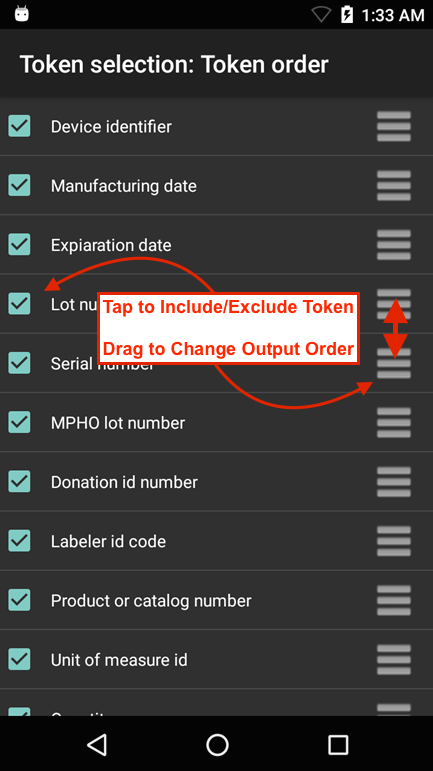
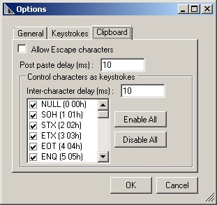

<h2 id="overview">Overview</h2>

IP Output allows captured data to be sent to a specified IP address and port using either TCP or UDP transport protocols. Zebra recommends that the receiving machine be running Windows and the Zebra IPWedge software, but it's not required. 

IPWedge is a small Windows app that monitors a network port and receives scanned data sent by devices using the DataWedge IP Output option. The receiving PC inserts the data as keystrokes into the foreground application or the Windows Clipboard, essentially using the device as a wireless scanner. 

<h3 id="prerequisites">Prerequisites</h3>

Using IPWedge requires the following: 

<ul>
<li>A PC with Windows and the .NET Framework 3.5 (SP 1 or later)</li>
<li>A Zebra device running Android 4.4 KitKat (or later)</li>
<li>DataWedge for Android 1.5 (or later)</li>
</ul>

<h2 id="ipoutputsetup">IP Output Setup</h2>

<strong>From the Profile in which to activate IP Output</strong>:  

&#49;. Locate the IP Output section of the Profile.  

&#50;. <strong>Check "Enabled" and "Remote Wedge" boxes</strong> to enable IP Output and communication with the IPWedge Windows app:

<em>IP Output options</em> 
 

&#51;. <strong>Select the desired Protocol</strong> (TCP or UDP) for data transport (default=TCP).

&#52;. <strong>Enter the IP address</strong> of the system that's running IPWedge.

&#53;. <strong>Enter the Port number</strong> if other than the default of 58627. 

<h3 id="udidataoutput">UDI Data Output</h3>

This setting applies when the Scanning mode in <a href="../../input/barcode/#readerparams">Barcode Reader Params</a> is set to UDI, which acquires multiple data points (tokens) as specified in the Universal Device Identifier parameter(s) selected in the above-referenced section. 

<strong>Token selection -</strong> allows the output order of acquired UDI data to be adjusted and the optional insertion of a Tab, Line Feed or Carriage Return character between tokens, if required.

<strong>To adjust UDI Token settings</strong>: 

<strong>&#49;. Tap "Send tokens" to select the desired output</strong> for acquired UDI data. 

<strong>Tokens only -</strong> DataWedge parses the UDI data into separate Tokens for output (separated by a separator character, if selected).

<strong>Barcodes and tokens -</strong> DataWedge sends the barcode string appended by the tokenized data. If no separator character is selected (see Step 2), DataWedge sends two instances of the same data.

<strong>&#50;. Tap "Token separator" to select a separator character</strong> to insert between Tokens, if desired. If Barcode and token mode is selected, this character is also inserted between the two. 

<em>This setting is not available if "Send tokens" is disabled</em>.
 

<strong>&#51;. Tap "Token order" to include/exclude Tokens</strong> from the output and adjust their output order. 

 

<h3 id="usingipoutputpluginwithoutipwedge">Using IP Output Plug-in without IPWedge</h3>

To use IP Output to send captured data to a remote device that's not running IPWedge, the system at the receiving end must be running a client app that monitors a port for data coming via TCP or UDP on the port specified on the device as described above. <strong>Warning: Zebra does not support this usage scenario</strong>.

<strong>Configure IP Output to send captured data to a remote computer or device</strong>:

&#49;. Locate the IP Output section of the Profile.  

&#50;. <strong>Check "Enabled" box</strong> and <strong><em><u>uncheck</u></em> the "Remote Wedge" box</strong>.

&#51;. <strong>Select the desired Protocol</strong> (TCP or UDP) for data transport (default=TCP).

&#52;. <strong>Enter the IP address</strong> of the server or device to receive the data.

&#53;. <strong>Enter the Port number</strong> (if other than the default of 58627). 

<strong>Warning: Zebra does not support this usage scenario</strong>.

<h2 id="setupipwedge">Set Up IPWedge</h2>

&#49;. Visit the <strong><a href="https://www.zebra.com/apps/dlmanager?dlp=-227178c9720c025483893483886ea540bd07dd0f9873752cf891686eb495040ba85f97bf163f9fd95347bc39767aa16e5152c1728f99b445d656378ddc8ebac53885a53a0632e89d37b18cfe4b3299cd5e1762688da483afbbcf475ccabf9cb&c=us&l=en">IP Wedge for Windows download page</a></strong> at the Zebra Support Portal, accept the EULA and download. 

<strong>Note: Windows Mobile/CE devices might need a different version of IPWedge</strong>. <a href="https://www.zebra.com/us/en/support-downloads/software/utilities/ipwedge-for-datawedge.html">Visit the Windows Mobile/CE download page</a> for more information. 

&#50;. <strong>Install the .zip file</strong> on the system to which the scanned data will be sent. 

&#51;. <strong>Run the IPWedge app</strong>. A screen appears similar to the image below. <strong>Make a note of the IP address and port number</strong> (in the red box). 

<em>IPWedge System Tray menu shows system IP address and monitored port</em> 
 

<blockquote>
  
<strong>Note: The port number must be the same as that specified in IP Output</strong> on the device.

</blockquote>

&#52;. <strong>Open the IPWedge app</strong> from the Windows Start menu or click on the IPWedge icon in the System Tray and select "Options" from the menu. 

The IPWedge Options panels appears similar to the images below. 

<em>General Options</em>
 

<em>Keystroke Options</em>
 

<em>Clipboard Options</em>
 

&#53;. <strong>Make any required changes</strong> to Options in the General, Keystroke and Clipboard tabs. <strong>Click OK on each tab</strong> to save settings. 

The PC is now ready to receive data from DataWedge IP Output (with IP address and port settings matching those of the PC). 

<strong>Other DataWedge Output Options</strong>:

<ul>
<li><strong><a href="../intent">Intent</a> -</strong> programmatic data hand-off</li>
<li><strong><a href="../keystroke">Keystroke</a> -</strong> keyboard emulation</li>
</ul>

<strong>Related guides</strong>:

<ul>
<li><a href="../../profiles">Profiles/Plug-ins</a></li>
<li><a href="../../api">DataWedge APIs</a> </li>
</ul>