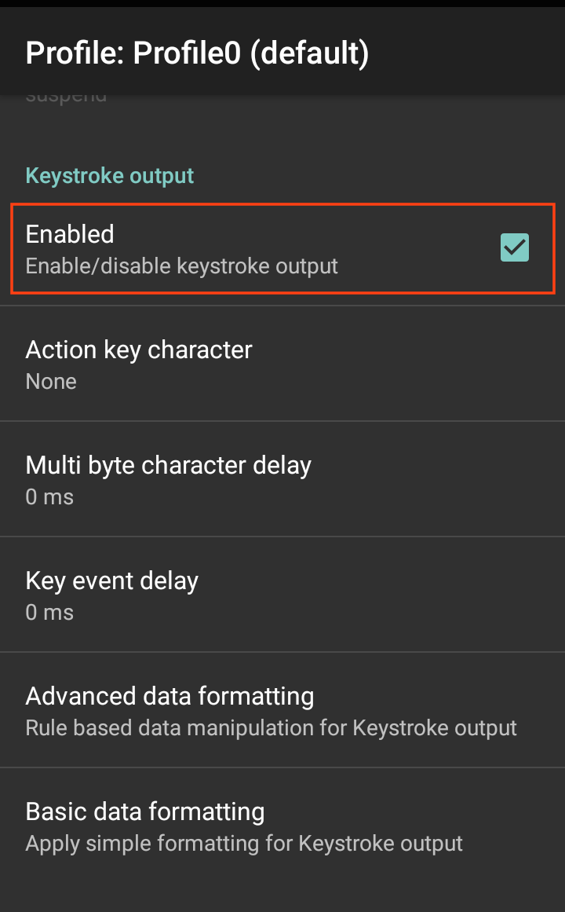
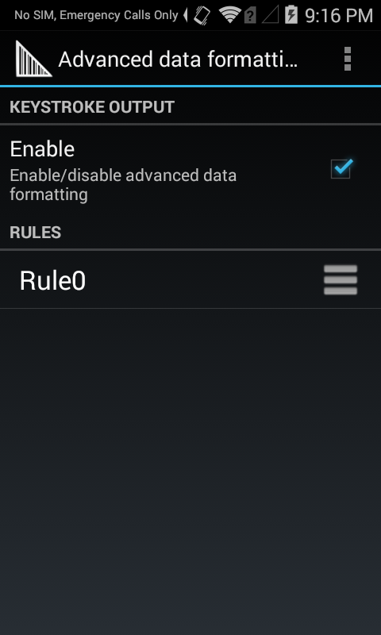

<h2 id="overview">Overview</h2>

The <strong>Advanced Data Formatting (ADF) Plug-in</strong> allows acquired data to be customized to suit any requirement based on a set of complex rules containing individual or multiple criteria and actions. 

Process Plug-ins manipulate the acquired data in a specified way before sending it to the associated application or server via the Output Plug-in. Process Plug-ins are grouped with each Output Plug-in, and appear as "Basic Data Formatting" and "Advanced Data Formatting." They are explained below. 

<strong>Process Plug-ins specify</strong>: 

<ul>
<li>Basic data formatting (append with keystrokes, prefix, suffix, etc.)</li>
<li>Advanced data formatting (rules-based data manipulation)</li>
</ul>

<strong>The Basic Format Process Plug-in</strong> allows DataWedge to add a prefix and/or a suffix to captured data before passing it to an Output Plug-in. It also permits the insertion of TAB and ENTER keystrokes as well as conversion of data to hex. For example, if the acquired barcode data is 012345, this option would cause the hex equivalent data of 30<strong>31</strong>32<strong>33</strong>34<strong>35</strong> to be sent. 

<h2 id="simulscaninput">SimulScan Input</h2>

The SimulScan Input Plug-in permits simultaneous capture of barcodes, images, text, signatures, phone numbers and other data on multi-part forms. The SimulScan Input Plug-in adds this capability to DataWedge. When form data is captured according to a designated SimulScan template, data can be processed or formatted as required using Process Plug-ins. 

<em>SimulScan Input Plug-in options</em>.
 

<strong>SimulScan Capture Notes</strong>:

<ul>
<li><strong>Text captured through SimulScan</strong> is concatenated into a single string, and processing is performed on that string.</li>
<li><strong>If the Barcode Input Plug-in is enabled</strong> in a Profile, enabling SimulScan in that Profile will cause the Barcode Input Plug-in to be disabled. </li>
</ul>

<strong>Device Selection -</strong> permits selection between the device camera or the default scanning device set by the system.  

<strong>Template selection -</strong> sets a SimulScan template for the Profile being configured. 

<strong>Templates included with DataWedge</strong>:

<ul>
<li>
<strong>BankCheck.xml -</strong> captures the account number and routing number from the machine-readable zone (MRZ) of a check.
</li>
<li>
<strong>Barcode1.xml -</strong> decodes a single barcode of any symbology.
</li>
<li>
<strong>Barcode2.xml -</strong> decodes two barcodes of the same or differing symbologies.
</li>
<li>
<strong>Barcode4.xml -</strong> decodes four barcodes of the same or differing symbologies.
</li>
<li>
<strong>Barcode5.xml -</strong> decodes five barcodes of the same or differing symbologies.
</li>
<li>
<strong>Barcode10.xml -</strong> decodes 10 barcodes of the same or differing symbologies.
</li>
<li>
<strong>BookNumber.xml -</strong> decodes 10- or 13-digit ISBN codes.
</li>
<li>
<strong>DocCap+Optional-Barcode.xml -</strong> captures the form as an image and optionally decodes a barcode if present. This is the default form if none is selected.
</li>
<li>
<strong>DocCap+Required-Barcode.xml -</strong> captures the form and decodes any available barcode.
</li>
<li>
<strong>TravelDoc.xml -</strong> captures information from the machine-readable zone (MRZ) of a travel document such as a passport.
</li>
<li>
<strong>Unstructured Multi-Line.xml -</strong> uses OCR to acquire multiple lines of alpha/numeric text.
</li>
<li>
<strong>Unstructured Single Line.xml -</strong> uses OCR to acquire a single line of alpha/numeric text.
</li>
</ul>

<em>The names of all Templates included with SimulScan are preceded by the word "Default" plus a hyphen</em>.

Custom template XML files copied to the following device directory will be available for selection using this option:

<code>/enterprise/device/settings/datawedge/templates</code> 

<strong>Note: Files and folders within the /enterprise directory are invisible to Android File Browser</strong> by default; they can be made visible by manually inputting the path.

Partners and other authorized users can create custom templates online using Zebra's <a href="../../../../simulscan/1-1/guide/templatebuilder">SimulScan Template Builder</a>. 

<strong>Region separator -</strong> is used to configure a separator character for SimulScan text-region data. When multiple text regions exist, the region separator will be inserted between the data strings from each region on the acquisition form. Region separators can be used with the Keystrokes Plug-in Action key character setting (see below) to dispatch SimulScan region data to separate text fields.

Possible values:

<ul>
<li>None (default)</li>
<li>Tab</li>
<li>Line feed </li>
<li>Carriage return </li>
</ul>

<strong>Notes</strong>: 

<ul>
<li><strong>Barcode, OCR and OMR regions</strong> are considered as text regions. When using keystroke output and IP output, only text-region data will be dispatched to the foreground application or the remote server.</li>
<li><strong>Picture-region data</strong> can be retrieved only through the Intent Output Plug-in.</li>
</ul>

<h2 id="basicdataformatting">Basic Data Formatting</h2>

The Basic Format Process Plug-in provides an easy way to append or prepend acquired data with custom values or keystrokes before passing it to an Output Plug-in. It also permits the conversion of data to hexadecimal format. If the Basic Formatting Plug-in is not enabled, captured data is passed to the selected Output Plug-in without modification.

<em>Basic Data Formatting Output Plug-in options</em>. 
 

<strong>Prefix to data -</strong> adds (prepends) the specified characters(s) <strong>to the beginning</strong> of the acquired data before sending.

<strong>Suffix to data -</strong> adds (appends) the specified characters(s) <strong>to the end</strong> of the acquired data before sending.

<strong>Send data -</strong> Enabled by default, this allows transfer of the captured data to the associated application when it comes to the foreground. <strong>Note</strong>: Disabling this option prevents only the <em>captured</em> data from being transferred; any prefix and/or suffix strings will be handed to the associated application(s), even when this option is disabled.

<strong>Send as hex -</strong> sends the data in hexadecimal format. For example, if the acquired barcode data is 012345, this option would send the hex equivalent of 30<strong>31</strong>32<strong>33</strong>34<strong>35</strong>. 

<strong>Send TAB key -</strong> appends a TAB character to the processed data. 

<strong>Send ENTER key -</strong> appends an Enter character to the processed data. 

<h2 id="advanceddataformatting">Advanced Data Formatting</h2>

DataWedge permits data acquired from barcode scanning, magstripe reading or other methods to be manipulated based on its contents. The Advanced Data Formatting (ADF) Process Plug-in can be configured to determine whether and how the data should be altered according to rules. These rules can be used to trigger (or prevent) actions based on specific criteria relating to the data. For example, a rule might be created to trigger an action only if the first four digits of an acquired 16-digit number determine that it's a credit card number affiliated with a specific bank. Any number of rules and interdependencies can be created, giving DataWedge the ability to suit virtually any data processing requirement.   

<strong>ADF Components</strong>:

<strong>Rules -</strong> The containers for one or more processing Actions and the user-definable criteria that trigger Action(s). All DataWedge Output Plug-ins can contain one or more ADF rules for the processing of acquired data.

<strong>Criteria -</strong> The triggers for taking a processing Action. Criteria can be set according to input type (i.e. only data from a barcode scanner), Symbology (i.e. only Code39 data), and a specified string within the data (at a specified position in the data string and/or of a specified length). Acquired data not matching all defined criteria will not trigger Action(s). Any or all of the <a href="../decoders">supported barcode types</a> can be selected or excluded. 

<strong>Actions -</strong> A set of procedures for analyzing, identifying and processing acquired data. 

<strong>The four Action types</strong>: 

<ul>
<li><strong>Cursor movement</strong> (i.e. skip the first 10 characters)</li>
<li><strong>Data modification</strong> (i.e remove all spaces; pad the left side with four zeros)</li>
<li><strong>Data sending</strong> (i.e. output the last four digits)</li>
<li><strong>Pause</strong> (i.e. pause 50 ms before executing the next action)</li>
</ul>
<h3 id="creatingadfrules">Creating ADF Rules</h3>

Setting up Advanced Data Formatting is done in three basic steps: 

<ol>
<li>Create a Rule</li>
<li>Define Criteria to activate the Rule</li>
<li>Define the Action(s) to be executed by the Rule</li>
</ol>

These steps are all carried out within the Advanced Data Formatting Process Plug-in, which is part of every DataWedge Output Plug-in. For further details, see the Plug-ins section of the <a href="../setup">DataWedge Setup Guide</a>. 

<strong>To Create an ADF Rule</strong>: 

&#49;. In the Profile that requires ADF, <strong>tap on Advanced data formatting</strong> as highlighted below. A screen appears similar to the image in Step 2.

 

&#50;. <strong>Tap the "hamburger" menu, select New rule</strong> and enter a name for the rule. The new Rule appears with other Rules in the Output Plug-in screen similar to the image in Step 3, below. 

 

&#51;. <strong>Tap the new Rule</strong> to access its settings. A screen appears similar to the image in Step 4. 

 

&#52;. <strong>Tap Criteria</strong> as highlighted below to enter the criteria that will activate the Rule. 

 

&#53;. From the Criteria screen, <strong>enter the criteria that will activate the Rule</strong> based on the options below. 

 

<strong>Action Criteria</strong>:

<ul>
<li>
<strong>String to check for -</strong> Allows a string to be specified that if present in the acquired data will initiate the action(s) (i.e. output the acquired string). If the specified string is not present at the "Starting position" (see below), the action(s) will not be executed. DataWedge can check for the presence of alphanumeric or control characters. For example:

<ul>
<li><strong>x -</strong> checks for the character "x"</li>
<li><strong>\xhh -</strong> checks for the character with a hexadecimal value of 0xhh</li>
<li><strong>\uhhhh -</strong> checks for the Unicode character with a value of 0xhhhh</li></ul></li>
<li>
<strong>String position -</strong> The starting position (starting at 0) at which to check for the string specified in the "String to check for" parameter. For example, the target string "AB" with a string position of 3 would invoke action(s) if the string "123ABC123" is acquired, but would not invoke action if the "AB" was located anywhere else in the string (or was not present). Notice that the "AB" portion of the example string begins at the fourth character from the left, which is position 3 when starting the count from 0.
</li>
<li>
<strong>String length -</strong>  An optional parameter that allows a specific length (in characters) to be present before action(s) will be invoked. For example, if scanning U.S. Social Security numbers, a String length of nine (9) might be used as a means of initial validation. 
</li>
<li>
<strong>Source criteria -</strong> An optional parameter that can invoke action(s) only when data is acquired by means of a barcode scanner (through which <a href="../decoders">specific decoders</a> can be further selected or excluded), or through SimulScan. 
 
</li>
</ul>

&#54;. <strong>Tap the BACK button</strong> to save and return to the Rule screen.

 

<strong>To Add an Action</strong>:

&#55;. From the Rule screen, <strong>tap "Actions"</strong> as highlighted below. Then <strong>select New action from the menu on the next screen</strong>. A scrollable list of Actions appears, similar to the image in Step 8.

 

&#56;. <strong>Tap the desired Action in the Actions list</strong>, scrolling as necessary. After tapping an Action, the Rule screen reappears with that Action added to the bottom of the Actions list. For a description of each Action, see the table below. 

 

<h3 id="supportedadfactions">Supported ADF Actions</h3>
<table rules="all"
width="100%"
frame="border"
cellspacing="0" cellpadding="4">
<caption class="title"></caption>
<col width="22%" />
<col width="22%" />
<col width="55%" />
<thead>
<tr>
<th align="left" valign="top">Type</th>
<th align="left" valign="top">Actions</th>
<th align="left" valign="top">Description</th>
</tr>
</thead>
<tbody>
<tr>
<td rowspan="5" align="left" valign="top">
Cursor Movement
</td>
<td align="left" valign="top">
Skip ahead
</td>
<td align="left" valign="top">
Moves the cursor forward by the specified number of characters.
</td>
</tr>
<tr>
<td align="left" valign="top">
Skip back
</td>
<td align="left" valign="top">
Moves the cursor back by the specified number of characters.
</td>
</tr>
<tr>
<td align="left" valign="top">
Skip to start
</td>
<td align="left" valign="top">
Moves the cursor to the beginning of the data.
</td>
</tr>
<tr>
<td align="left" valign="top">
Move to
</td>
<td align="left" valign="top">
Moves the cursor forward until the string specified in the data field is found.
</td>
</tr>
<tr>
<td align="left" valign="top">
Move past
</td>
<td align="left" valign="top">

Moves the cursor forward past the string specified in the data field.

</td>
</tr>
<tr>
<td rowspan="12" align="left" valign="top">
Data Modification
</td>
<td align="left" valign="top">
Crunch spaces
</td>
<td align="left" valign="top">
Reduce spaces between words to one and remove all spaces at the beginning and end of the data.
</td>
</tr>
<tr>
<td align="left" valign="top">
Stop space crunch
</td>
<td align="left" valign="top">
Disables the last <strong>Crunch spaces</strong> action.
</td>
</tr>
<tr>
<td align="left" valign="top">
Remove all spaces
</td>
<td align="left" valign="top">
Remove all spaces in the data.
</td>
</tr>
<tr>
<td align="left" valign="top">
Stop space removal
</td>
<td align="left" valign="top">
Disables the last <strong>Remove all spaces</strong> action.
</td>
</tr>
<tr>
<td align="left" valign="top">
Remove leading zeros
</td>
<td align="left" valign="top">
Remove all zeros at the beginning of data.
</td>
</tr>
<tr>
<td align="left" valign="top">
Stop zero removal
</td>
<td align="left" valign="top">
Disables the previous <strong>Remove leading zeros</strong> action.
</td>
</tr>
<tr>
<td align="left" valign="top">
Pad with zeros
</td>
<td align="left" valign="top">
Left-pad data with the specified number of zeros.
</td>
</tr>
<tr>
<td align="left" valign="top">
Stop pad zeros
</td>
<td align="left" valign="top">
Disables the previous <strong>Pad with zeros</strong> action.
</td>
</tr>
<tr>
<td align="left" valign="top">
Replace string
</td>
<td align="left" valign="top">
Replaces a specified string with a new specified string. Both must be specified.
</td>
</tr>
<tr>
<td align="left" valign="top">
Stop all replace string
</td>
<td align="left" valign="top">
Stop all <strong>Replace string</strong> actions.
</td>
</tr>
<tr>
<td align="left" valign="top">
Remove characters
</td>
<td align="left" valign="top">
Remove the number of characters specified in given positions when send actions are executed.
</td>
</tr>
<tr>
<td align="left" valign="top">
Stop remove characters
</td>
<td align="left" valign="top">
Stops removing characters from subsequent send actions.
</td>
</tr>
<tr>
<td rowspan="6" align="left" valign="top">
Data Sending
</td>
<td align="left" valign="top">
Send next
</td>
<td align="left" valign="top">
Sends the specified number of characters from the current cursor position.
</td>
</tr>
<tr>
<td align="left" valign="top">
Send remaining
</td>
<td align="left" valign="top">
Sends all data that remains from the current cursor position.
</td>
</tr>
<tr>
<td align="left" valign="top">
Send up to
</td>
<td align="left" valign="top">
Sends all data up to the specified string.
</td>
</tr>
<tr>
<td align="left" valign="top">
Send pause
</td>
<td align="left" valign="top">
Pauses the specified number of milliseconds (default = 0; max. = 1000) before executing the next action. <strong>Zebra recommends pausing 50 ms after sending any ENTER, LINE FEED or TAB character</strong>.
</td>
</tr>
<tr>
<td align="left" valign="top">
Send string
</td>
<td align="left" valign="top">
Sends the specified string.
</td>
</tr>
<tr>
<td align="left" valign="top">
Send char
</td>
<td align="left" valign="top">
Sends the specified ASCII/ Unicode character. The maximum Unicode character value can be entered is U-10FFFF (= 1114111 in decimal).
</td>
</tr>
</tbody>
</table>

<em><strong>Note: To help minimize data loss, Zebra recommends sending a Pause Action of 50 ms after sending any ENTER, LINE FEED or TAB character</strong>.</em>

&#57;. <strong>Repeat Step 8 until all required Actions appear in an Actions list</strong> similar to the image below. Actions execute from top to bottom. To re-order an Action, drag by its "hamburger" icon. <strong>See additional notes and the example, below</strong>. 

<em>The ADF Rule screen from DataWedge 6.2 (with several configured actions).</em>
 
 

<em>The ADF Rule screen from DataWedge 6.2 (with no configured actions).</em>
 

<!--
Rule0-Actions.png
-->

<strong>Action Notes</strong>: 

<ul>
<li>Actions are processed from the top of the list downward to the bottom. </li>
<li>To reposition an Action, drag the Action by its handle (to the right of its name). </li>
<li>To delete an Action, long-press the Action name. </li>
<li>A Pause Action of 50 ms after sending ENTER, LINE FEED or TAB Actions can help minimize data loss.</li>
</ul>

<strong>Rules Notes</strong>: 

<ul>
<li>Once a Rule is enabled (with a check mark in its Rule screen), a Rule will apply whenever its parent Profile is used. </li>
<li>All data acquired through the Profile will be processed according to the Actions defined in the Rule before being transferred to the selected Output Plug-in. </li>
<li>If no ADF rule is enabled or defined, DataWedge passes decoded data to the Output Plug-in without processing.</li>
</ul>
<h3 id="nonprintablecharacters">Non-printable Characters</h3>

When setting up an ADF data processing rule to find or replace control characters, extended ASCII characters or other non-printable characters, DataWedge supports the use of the <strong>\xNN notation</strong> to specify hex value of the character and <strong>\uNNNN notation</strong> for Unicode values. 

For example, if the captured data contains the Group separator (GS) character (\x1D) and data on either side of the separator must be acquired, the following ADF actions can be added to the ADF rule: 

<strong>To capture the data</strong>: 8100712345(GS)2112345678

<strong>Execute the following Actions</strong>:

<ul>
<li><strong>Send data up to (\x1D)</strong></li>
<li><strong>Skip ahead (1)</strong></li>
<li><strong>Send remaining data</strong></li>
</ul>

<h2 id="adfruleexample">ADF Rule Example</h2>

The following is an example of the creation process for an Advanced Data Formatting Rule that might be typical for data processing scenarios. 

<strong>Barcode scanning criteria</strong>:

<ul>
<li>Barcode: Code39</li>
<li>Decoded Length: 12 characters</li>
<li>Starting Position contents: "129" </li>
</ul>

<strong>How DataWedge should format the data</strong>:

<ul>
<li>Pad all sends with zeros to a length of 8</li>
<li>Send all data up to character X</li>
<li>Send a space character</li>
</ul>

<strong>To create an ADF rule for this example</strong>:

<ol>
<li>Tap <strong>HOME -> DataWedge -> Profile0</strong>.</li>
<li>Tap <strong>Advanced data formatting</strong>.</li>
<li>Tap <strong>Enable</strong>.</li>
<li>Tap <strong>Rule0</strong>.</li>
<li>Tap <strong>Criteria</strong>.</li>
<li>Tap <strong>String to check for</strong>. In the text box, <strong>enter "129"</strong> and <strong>Tap OK</strong>.</li>
<li>Tap <strong>String position</strong>. Change value to 0 and <strong>Tap OK</strong>.</li>
<li>Tap <strong>String length</strong>. Change value to 12 and <strong>Tap OK</strong>.</li>
<li>Tap <strong>Source criteria</strong>.</li>
<li>Tap <strong>Barcode input</strong>.</li>
<li>Tap <strong>All decoders enabled</strong> to uncheck and disable all decoders.</li>
<li>Tap <strong>Code39</strong> to enable the Code39 decoder only. </li>
<li>Tap <strong>BACK</strong> three times.</li>
<li>Under Actions, <strong>tap and hold Send remaining</strong> until a menu appears.</li>
<li>Tap <strong>Delete action</strong>.</li>
<li>Tap <strong>Menu -> New action</strong>. Select <strong>Pad with zeros</strong>. The Pad with zeros Action appears in the Actions list.</li>
<li>Tap the <strong>Pad with zeros</strong> Action.</li>
<li>Tap <strong>How many</strong>. Change value to 8 and <strong>Tap OK</strong>.</li>
<li>Tap <strong>BACK</strong>.</li>
<li>Tap <strong>Menu -> New action</strong>. Select <strong>Send up to</strong>. The Send up to Action appears in the Action list.</li>
<li>Tap the <strong>Send up to</strong> Action.</li>
<li>Tap <strong>String</strong>. In the text box, <strong>enter "X"</strong> and <strong>Tap OK</strong>.</li>
<li>Tap <strong>BACK</strong>.</li>
<li>Tap <strong>Menu -> New action</strong>. Select <strong>Send char</strong>. The Send char Action appears in the Action list.</li>
<li>Tap the <strong>Send char</strong> Action.</li>
<li>Tap <strong>Character code</strong>. In the text box, <strong>enter 32</strong> and <strong>Tap OK</strong>.</li>
<li>Tap <strong>BACK</strong>.</li>
</ol>

The Rule0 screen should appear similar to the image below. 

 

<h4 id="decoderelateddata">Decode-related data</h4>

The decode-related data added to an Intent bundle can be retrieved using the followng call: 

<ul>
<li><code>Intent.getStringtExtra()</code></li>
</ul>
<!-- * `Intent.getSerializableExtra()`-->

The call above can be used with the following String tags:

<ul>
<li>
<strong>String LABEL<em>TYPE</em>TAG = "com.symbol.datawedge.label_type"</strong>; String contains the barcode label type
</li>
<li>
<strong>String DATA<em>STRING</em>TAG = "com.symbol.datawedge.data_string"</strong>; String contains the output data as a String. In the case of concatenated barcodes, the decode data is concatenated and sent out as a single string.
</li>
<li>
<strong>String DECODE<em>DATA</em>TAG = "com.symbol.datawedge.decode_data"</strong>; Decode data is returned as a list of byte arrays. In most cases there will be one byte array per decode. For barcode symbologies that support concatenation (i.e. Codabar, Code128, MicroPDF, etc.) the decoded data is stored in multiple byte arrays (one byte array, per bar code). Clients can get data in each byte array by passing an index.
</li>
</ul>
<h4 id="msrrelateddata">MSR-related data</h4>

The MSR-related data added to an Intent bundle can be retrieved using the following calls: 

<ul>
<li><code>Intent.getStringtExtra()</code></li>
</ul>
<!-- * `Intent.getSerializableExtra()` -->

The calls above can be used with the following String tags:

<ul>
<li>
<strong>String MSR<em>DATA</em>TAG = "com.symbol.datawedge.msr_data"</strong>;
The data from the MSR tracks is concatenated and sent out as a byte array. The Start/end sentinels and track separators are included as configured.
</li>
<li>
<strong>String MSR<em>TRACK1</em>TAG = "com.symbol.datawedge.msr_track1"</strong>; MSR track 1 data is returned as a byte array.
</li>
<li>
<strong>String MSR<em>TRACK2</em>TAG = "com.symbol.datawedge.msr_track2"</strong>; MSR track 2 data is returned as a byte array.
</li>
<li>
<strong>String MSR<em>TRACK3</em>TAG = "com.symbol.datawedge.msr_track3"</strong>; MSR track 3 data is returned as a byte array.
</li>
<li>
<strong>String MSR<em>TRACK1</em>STATUS<em>TAG = "com.symbol.datawedge.msr</em>track1_status"</strong>; MSR track 1 decode status as an Integer where 0 indicates a successful decode.
</li>
<li>
<strong>String MSR<em>TRACK2</em>STATUS<em>TAG = "com.symbol.datawedge.msr</em>track2_status"</strong>; MSR track 2 decode status as an Integer where 0 indicates a successful decode.
</li>
<li>
<strong>String MSR<em>TRACK3</em>STATUS<em>TAG = "com.symbol.datawedge.msr</em>track3_status"</strong>; MSR track 3 decode status as an Integer where 0 indicates a successful decode.
</li>
</ul>
<h4 id="simulscanrelateddata">SimulScan-related Data</h4>

The SimulScan-related data added to an Intent bundle can be retrieved using the following calls: 

<ul>
<li><code>Intent.getStringtExtra()</code></li>
<li><code>Intent. getParcelableArrayListExtra()</code></li>
<li><code>Bundle.getInt()</code></li>
<li><code>Bundle.getString()</code></li>
<li><code>Bundle.getByteArray()</code></li>
</ul>
<!-- * `Intent.getSerializableExtra()` -->

The calls above can use the following String tags:

<ul>
<li>
<strong>String SIMULSCAN<em>TEMPLATE</em>NAME<em>TAG = "com.symbol.datawedge.simulscan</em>template_name"</strong>; The name of the template which used by SimulScan to capture the form.
</li>
<li>
<strong>String SIMULSCAN<em>REGIONS</em>BUNDLE<em>TAG= "com.symbol.datawedge.simulscan</em>region_data"</strong>; Return an array of Bundles where each bundle contains data and information about a region and the form.
</li>
<li>
<strong>String SIMULSCAN<em>REGION</em>NAME<em>TAG = "com.symbol.datawedge.simulscan</em>region_name"</strong>; Returns the region name of the bundle object for reach region. To get the region name <code>Bundle.getString()</code> should be called.
</li>
<li>
<strong>String SIMULSCAN<em>REGION</em>ID<em>TAG = "com.symbol.datawedge.simulscan</em>region_id"</strong>; Returns the region id of the bundle object for reach region. Region id is an integer and can be retrieved by calling <code>Bundle.getInt ()</code>.
</li>
<li>
<strong>String SIMULSCAN<em>REGION</em>STRING<em>DATA= "com.symbol.datawedge.simulscan</em>region<em>string</em>data"</strong>; Returns the string data of the region. String data comes with barcode, OCR and OMR data.
</li>
<li>
<strong>String SIMULSCAN<em>REGION</em>BINARY<em>DATA= "com.symbol.datawedge.simulscan</em>region<em>string</em>data"</strong>;
Returns the data of the region in the form of byte array. Binary data comes only for picture regions and the form image. Both picture and form data can be load in to a bitmap and display in the application.
</li>
<li>
<strong>String SIMULSCAN<em>REGION</em>TYPE<em>TAG = "com.symbol.datawedge.simulscan</em>region_type"</strong>; Returns the region type of the bundle object for reach region. Region type is a string and can be retrieved by calling <code>Bundle.getString ()</code>. 
</li>
</ul>

Possible return values for the region type:

<ul>
<li><strong>Barcode -</strong> Region is a barcode.</li>
<li><strong>OCR -</strong> Region is an Optical Character Recognition (OCR) region (i.e name or address). </li>
<li><strong>OMR -</strong> Region is an Optical Mark Recognition (OMR) region (i.e checkbox, radio button).</li>
<li><strong>Picture -</strong> Region is a picture; data will be in the JPEG format.</li>
<li><strong>Form -</strong> Form type to specify that the bundle contains a picture of the captured form. Form image will be in the JPEG format.</li>
</ul>

<strong>Important</strong>: For some scanning applications, it might be preferable for decoded data to be sent directly to the current activity and not necessarily displayed. For such instances, the activity must be designated  as "singleTop" in its AndroidManifest.xml file. Failure to designate an activity in this way will cause an instance of the activity to be launched on every decode, and the data sent to each newly spawned copy. 

For more information about Android Intents, please refer to the <a href="https://developer.android.com/guide/components/intents-filters.html">Android Developer site</a>.

<h2 id="ipoutput">IP Output</h2>

The IP Output Plug-in enables captured data to be transferred over a network to a computer running IPWedge, a small Windows app made by Zebra. The PC receives the data as keystrokes or in its Clipboard, in essence turning the device into a wireless scanner for the PC. 

To configure a device to use the IP Output Plug-in, it's necessary to know the IP address of the PC as well as the port number to which the PC will be listening. To set up the PC first, see the <a href="../ipwedge">IPWedge Guide</a> for IPWedge download and set-up instructions. Then resume from here.

<h4 id="setuptheipoutputplugin">Set up the IP Output Plug-in:</h4>

<strong>From the Profile in which to activate the IP Output Plug-in</strong>:  

&#49;. Locate the IP Output section of the Profile.  

&#50;. <strong>Check "Enabled" and "Remote Wedge" boxes</strong> to enable IP Output and communication with the IPWedge server component.

<em>IP Output Plug-in options</em>. 
 

&#51;. <strong>Select the desired Protocol</strong> for data transport (TCP or UDP) or accept the default (TCP).

&#52;. <strong>Enter the IP address</strong> of the server running IPWedge software.

&#53;. <strong>Enter the Port number</strong> if other than the default of 58627. 

<h3 id="usingipoutputpluginwithoutipwedge">Using IP Output Plug-in without IPWedge</h3>

it is possible to use the IP Output Plug-in to send captured data to a remote device without IPWedge. At the data receiving end, the PC or Mobile device should have a client application that listens to TCP or UDP data coming from the configured port and IP address in IP Output Plug-in. To get IP output plug-in configured to send captured data to a remote computer or device, follow these steps.

&#49;. Locate the IP Output section of the Profile.  

&#50;. <strong>Check "Enabled" box</strong> and <strong><em>uncheck</em> the "Remote Wedge" box</strong>.

&#51;. <strong>Select the desired Protocol</strong> for data transport (TCP or UDP) or accept the default (TCP).

&#52;. <strong>Enter the IP address</strong> of the server running IPWedge software.

&#53;. <strong>Enter the Port number</strong> if other than the default of 58627. 

<strong>Warning: Zebra does not support this usage scenario</strong>.

<h2 id="datacaptureplusdcp">Data Capture Plus (DCP)</h2>

Data Capture Plus (formerly known as the "Data Capture Panel") enables areas of the device screen to be designated as scan triggers. By tapping on a designated screen area, DataWedge will respond as it would to a scanner button-press or other hardware trigger.

DCP is disabled by default. The DataWedge Profile configuration screen allows an app user to configure the appearance of DCP on the screen once a particular Profile is loaded. If the user checks the option to enable the DCP, the five parameters shown below appear on the preference screen and can be configured as desired.

<strong>Note: The DCP will not appear if the scanner is disabled in the current Profile</strong>.

<em>Data Capture Plus options for setting scan triggers</em>. 
 

Data Capture Plus offers these configurable parameters:

<strong>Dock button on -</strong> Sets the initial docking location of the floating DCP button. Changes by the user at runtime are saved to the active Profile. Docking options:  

<ul>
<li>Right side only</li>
<li>Left side only</li>
<li>Either side</li>
</ul>

<strong>Start in -</strong> Sets the mode that DCP will startup with. If configured to launch as a button, the DCP mode can be changed at runtime by dragging, but the launch state will not be changed in the Profile. Start-in options: 

<ul>
<li>Button mode (floating button)</li>
<li>Full-screen mode</li>
<li>Button-only mode</li>
</ul>

<strong>Button highest position -</strong> Sets a ceiling for button position expressed as a percent of screen height. For example, on a screen measuring four inches vertically, a setting of 75 (%) would prevent the upper edge of the DCP button from being positioned less than one inch from the top of the screen. 

<strong>Bottom lowest position -</strong> Sets a floor for button position expressed as a percent of screen height. For example, on a screen measuring four inches vertically, a setting of 25 (%) would prevent the lower edge of the DCP button from being positioned less than one inch from the bottom of the screen.

<strong>Drag Detect Time -</strong> The wait time (in ms) that DCP should wait after a screen tap before triggering a scanner action. This can help prevent accidental triggers when dragging the DCP button to a new location.

<strong>Note</strong>: A quick touch and release of the DCP can sometimes start the viewfinder when using camera as a scanner. To exit, press the back button.

<em>Data Capture Plus shown in minimized mode</em>. 
 

<strong>Note</strong>: If configured to launch as a button, the DCP mode can be changed at runtime by dragging, but the launch state will not be changed in the Profile. However, runtime changes to the vertical position and the docking side of device screen <em><strong>will</strong></em> be saved to the active Profile.

<em>Data Capture Plus shown in maximized mode</em>. 
 

<h3 id="scanningwithdcp">Scanning with DCP</h3>

<strong>To scan a barcode with DCP</strong>: 

&#49;. With DCP enabled, <strong>tap and hold the area of the screen designated for DCP</strong>. The scan beam (or camera viewfinder) will be active while the tap is held. 

&#50;. <strong>Aim the scan beam or camera reticle at the barcode</strong> to be scanned. DCP will use the preferences configured in the Barcode Input Plug-in for the current Profile.

&#51;. * <strong>Release finger to stop scanning</strong> or to close the camera viewfinder.

<strong>Note</strong>: A quick touch and release of the DCP control sometimes will start the viewfinder when using camera as a scanner. To exit, press the BACK button.

<strong>Related guides</strong>:

<ul>
<li><a href="../../profiles">Profiles/Plug-ins</a></li>
<li><a href="../../api">DataWedge APIs</a> </li>
</ul>