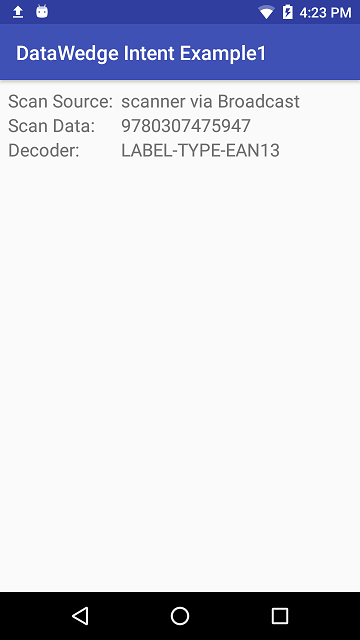

<h2 id="overview">Overview</h2>

The DataWedge service comes preinstalled on all Zebra mobile devices running Android and can add scanning capabilities to virtually any app on the device. This example describes a simplified application that demonstrates how to use DataWedge to receive scanned barcode data through an Android intent. 

In essence, the process boils down to this:

<ol>
<li><strong>Deploy the target Android app</strong> (on which to enable scanning) to a Zebra device.  </li>
<li><strong>Launch DataWedge</strong> on the device.</li>
<li><strong>Configure DataWedge INPUT (barcode scanner) and OUTPUT (Intent)</strong>.</li>
<li><strong>Optional: Create a Profile</strong> to associate with the target app. If no Profile is created and assigned, DataWedge will use Profile0, a built-in Profile designed for this purpose. </li>
</ol>

Details and source code follow. 

<h3 id="configuredatawedge">Configure DataWedge</h3>

<strong>Configure DataWedge to output scans via intent</strong>: 

&#49;. <strong>Launch DataWedge</strong> via Applications --&gt; DataWedge

&#50;. <strong>Select a Profile</strong> (Profile0 is used by DataWedge for all apps not explicitly assigned a Profile)

&#51;. Confirm the following <strong>Profile settings</strong>:

<ul>
<li>The Profile is <strong>enabled</strong></li>
<li>Barcode input is <strong>enabled</strong></li>
<li>Intent output is <strong>enabled</strong></li>
</ul>

&#52;. <strong>Configure the intent output</strong> as follows:

<ul>
<li>Intent action: <strong>com.dwexample.ACTION</strong> (to match value defined in the <code>strings.xml</code> file) <!-- <a href="https://github.com/darryncampbell/DataWedge-Intent-Example-1/blob/master/app/src/main/res/values/strings.xml">strings.xml</a>) --></li>
<li>Intent category: (<strong>leave blank</strong>)</li>
<li>Intent delivery: <strong>Broadcast intent</strong></li>
</ul>

The image below shows the correct Profile settings:
  

See the DataWedge <a href="../../output/intent">Intent Output guide</a> for more information about these settings. 

<!-- 
### NOTES

**Intent action -** an implicit intent sent by DataWedge. The target app must be configured to receive this intent. For the purposes of this tutorial, "com.dwexample.ACTION" can be specified.
**Intent category -** is associated with the intent sent by DataWedge following each scan.
**Intent delivery -** can be one of:
 * “Send via StartActivity” is analogous to calling [Context.startActivity](https://developer.android.com/reference/android/content/Context.html#startActivity(android.content.Intent))
 * “Send via StartService” is analogous to calling [Context.startService](https://developer.android.com/reference/android/content/Context.html#startService(android.content.Intent))
 * “Broadcast intent” is analogous to calling [Context.sendBroadcast](https://developer.android.com/reference/android/content/Context.html#sendBroadcast(android.content.Intent))
 -->

<h3 id="runapplication">Run Application</h3>

&#49;. Visit the <a href="https://github.com/darryncampbell/DataWedge-Intent-Example-1">project page</a> and download, build and launch the sample app. 
 

&#50;. <strong>Upon first launch</strong>, a screen appears similar to the image below: 

 

&#51;. <strong>After scanning a barcode</strong>, fields are populated as pictured below:

 

<h2 id="sourcecode">Source Code</h2>
<h3 id="mainactivity">Main Activity</h3>

Below is the sourcecode for the MainActivity.java of the sample app.  
For the <code>build.gradle</code> and other resources, visit the <a href="https://github.com/darryncampbell/DataWedge-Intent-Example-1">app's project page on github</a>.

<pre><code>    :::java
    //
    // WARNING: This app is for demonstration purposes only.
    // It is not intended for use in a production environment
    //
    package com.darryncampbell.datawedgeintentexample1;

    import android.content.BroadcastReceiver;
    import android.content.Context;
    import android.content.Intent;
    import android.content.IntentFilter;
    import android.support.v7.app.AppCompatActivity;
    import android.os.Bundle;
    import android.util.Log;
    import android.widget.ArrayAdapter;
    import android.widget.Spinner;
    import android.widget.TextView;
    import android.widget.Toast;

    import java.util.ArrayList;

    public class MainActivity extends AppCompatActivity {

    // 
    // The section snippet below registers to receive the data broadcast from the
    // DataWedge intent output. In the example, a dynamic broadcast receiver is 
    // registered in the onCreate() call of the target app. Notice that the filtered action 
    // matches the "Intent action" specified in the DataWedge Intent Output configuration.
    // 
    // For a production app, a more efficient way to the register and unregister the receiver 
    // might be to use the onResume() and onPause() calls. 

    // Note: If DataWedge had been configured to start an activity (instead of a broadcast), 
    // the intent could be handled in the app's manifest by calling getIntent() in onCreate(). 
    // If configured as startService, then a service must be created to receive the intent.
    //

    @Override
    protected void onCreate(Bundle savedInstanceState) {
        super.onCreate(savedInstanceState);
        setContentView(R.layout.activity_main);

        IntentFilter filter = new IntentFilter();
        filter.addCategory(Intent.CATEGORY_DEFAULT);
        filter.addAction(getResources().getString(R.string.activity_intent_filter_action));
        registerReceiver(myBroadcastReceiver, filter);
    }

    @Override
    protected void onDestroy()
    {
        super.onDestroy();
        unregisterReceiver(myBroadcastReceiver);
    }
    //
    // After registering the broadcast receiver, the next step (below) is to define it.  
    // Here it's done in the MainActivity.java, but also can be handled by a separate class.
    // The logic of extracting the scanned data and displaying it on the screen 
    // is executed in its own method (later in the code). Note the use of the 
    // extra keys defined in the strings.xml file.  
    //  
    private BroadcastReceiver myBroadcastReceiver = new BroadcastReceiver() {
        @Override
        public void onReceive(Context context, Intent intent) {
            String action = intent.getAction();
            Bundle b = intent.getExtras();

            //
            // The following is useful for debugging to verify
            // the format of received intents from DataWedge:
            //
            // for (String key : b.keySet())
            // {
            //   Log.v(LOG_TAG, key);
            // }
            //

            if (action.equals(getResources().getString(R.string.activity_intent_filter_action))) {
                //
                //  Received a barcode scan
                //

                try {
                    displayScanResult(intent, "via Broadcast");
                } catch (Exception e) {

                //
                // Catch if the UI does not exist when broadcast is received 
                //
                }
            }
        }
    };
    //
    // The section below assumes that a UI exists in which to place the data. A production 
    // application would be driving much of the behavior following a scan.
    //
    private void displayScanResult(Intent initiatingIntent, String howDataReceived)
    {
        String decodedSource = initiatingIntent.getStringExtra(getResources().getString(R.string.datawedge_intent_key_source));
        String decodedData = initiatingIntent.getStringExtra(getResources().getString(R.string.datawedge_intent_key_data));
        String decodedLabelType = initiatingIntent.getStringExtra(getResources().getString(R.string.datawedge_intent_key_label_type));

        final TextView lblScanSource = (TextView) findViewById(R.id.lblScanSource);
        final TextView lblScanData = (TextView) findViewById(R.id.lblScanData);
        final TextView lblScanLabelType = (TextView) findViewById(R.id.lblScanDecoder);
        lblScanSource.setText(decodedSource + " " + howDataReceived);
        lblScanData.setText(decodedData);
        lblScanLabelType.setText(decodedLabelType);
    }
}
</code></pre>
<h3 id="stringsxml">Strings.xml</h3>

Predefining some of the strings simplifies the process of receiving and extracting the scanned data in the target app. When received, the intent’s action (<code>com.dwexample.ACTION</code>) will contain extras with the scanned data for source, type and data as described in the DataWedge <a href="../../output/intent/#singledecodemode">Intent Output guide</a>. 

<pre><code>:::xml
&lt;resources&gt;
    &lt;string name="dw_action"&gt;com.dwexample.ACTION&lt;/string&gt;
    &lt;string name="datawedge_intent_key_source"&gt;com.symbol.datawedge.source&lt;/string&gt;
    &lt;string name="datawedge_intent_key_label_type"&gt;com.symbol.datawedge.label_type&lt;/string&gt;
    &lt;string name="datawedge_intent_key_data"&gt;com.symbol.datawedge.data_string&lt;/string&gt;
&lt;/resources&gt;
</code></pre>
<!-- Notes integrated into Main Activity

### Register broadcast receiver

The snippet below is the section of the main activity (above) that registers to receive the data broadcast from the DataWedge intent output. In the example, a dynamic broadcast receiver is registered in the `onCreate()` call of the target app. For a production app, a more efficient way to the register and unregister the receiver might be to use the `onResume()` and `onPause()` calls. Notice that the filtered action matches the "Intent action" specified in [Step 4](#configuredatawedge), above.

**Note**: If DataWedge had been configured to start an activity (instead of a broadcast), it could be handled in the app's manifest by calling `getIntent()` in `onCreate()`. If configured as startService, then a service must be created to receive the intent.

    :::java
    @Override
    protected void onCreate(Bundle savedInstanceState) {
        ...
        IntentFilter filter = new IntentFilter();
        filter.addCategory(Intent.CATEGORY_DEFAULT);
        filter.addAction(getResources().getString(R.string.dw_action));
        registerReceiver(myBroadcastReceiver, filter);
    }

 -->

<h2 id="relatedguides">Related Guides</h2>
<ul>
<li><a href="http://www.darryncampbell.co.uk/2017/12/13/tutorial-scan-with-datawedge-intent-output-on-zebra-devices/">The original tutorial</a> | by Zebra engineer Darryn Campbell</li>
<li>DataWedge <a href="../../output/intent">Intent Output guide</a> | for usage settings and details</li>
<li><a href="../">DataWedge APIs</a> | for intent-based functions</li>
</ul>