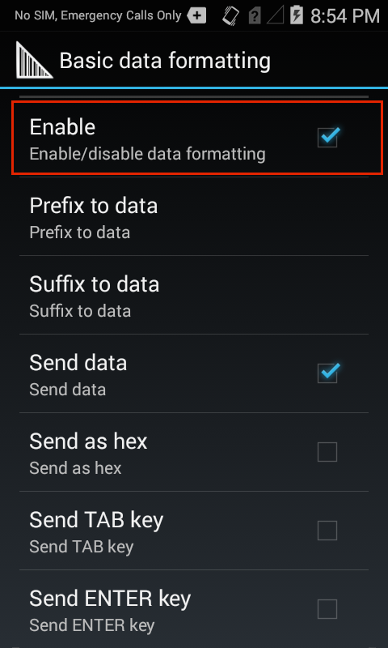

<h2 id="overview">Overview</h2>

Process Plug-ins manipulate the acquired data in a specified way before sending it via the Output Plug-in to the associated application or server. Controls for Process Plug-ins appear as "Basic Data Formatting" and "Advanced Data Formatting," and are grouped in a Profile's settings panel along with its Output Plug-in. 

<strong>Process Plug-ins specify</strong>: 

<ul>
<li>Basic data formatting (i.e. append with keystrokes, a prefix, a suffix, etc.)</li>
<li>Advanced data formatting (rules-based data manipulation, action triggers, etc.)</li>
</ul>

<strong>The Basic Formatting Process Plug-in</strong> allows DataWedge to add a prefix and/or a suffix to captured data before passing it to an Output Plug-in. It also permits the insertion of TAB and ENTER keystrokes, which can be used to move the cursor to from one field of an app to another to facilitage a series of data acquisition tasks.  

If desired, BDF also can convert acquired data to hexidecimal notation. For example, if an acquired barcode data is 012345, this option could convert and send the hex equivalent data of 30<strong>31</strong>32<strong>33</strong>34<strong>35</strong>. 

Get more info about <a href="../../overview">how Profiles work</a>. 

<blockquote>
  
The parameters of this feature can be configured using the <a href="../../api/setconfig">Set Config API</a>.

</blockquote>

<h2 id="basicdataformatting">Basic Data Formatting</h2>

<strong>Basic Data Formatting</strong> provides an easy way to append or prepend acquired data with custom values or keystrokes before passing it to an Output Plug-in. It also permits the conversion of data to hexadecimal format. If the Basic Data Formatting is not enabled, captured data is passed to the selected Output Plug-in without modification. 

<em>Basic Data Formatting Output options</em>
 

<strong>Prefix to data -</strong> adds (prepends) the specified characters(s) <strong>to the beginning</strong> of the acquired data before sending.

<strong>Suffix to data -</strong> adds (appends) the specified characters(s) <strong>to the end</strong> of the acquired data before sending.

<strong>Send data -</strong> allows transfer of the captured data to the associated application when it comes to the foreground. <strong>Enabled by default</strong>. <strong><u>Note</u></strong>: Disabling this option prevents only the <u><em>captured</em></u> data from being transferred; any prefix and/or suffix strings will <u><em>always</em></u> be handed to the associated app(s), even when this option is disabled. 

<strong>Send as hex -</strong> sends the data in hexadecimal format. For example, if the acquired barcode data is 012345, this option would send the hex equivalent of 30<strong>31</strong>32<strong>33</strong>34<strong>35</strong>. 

<strong>Send TAB key -</strong> appends a TAB character to the processed data. 

<strong>Send ENTER key -</strong> appends an ENTER character to the processed data. 

<strong>DataWedge Output options</strong>: 

<ul>
<li><strong><a href="../../output/keystroke">Keystroke</a> -</strong> outputs acquired data as if the keyboard was pressed</li>
<li><strong><a href="../../output/ip">Internet Protocol</a> -</strong> outputs data over a network using TCP or UDP</li>
<li><strong><a href="../../output/intent">Intent</a> -</strong> delivers data to the app as an intent extra</li>
</ul>

<strong>Related guides</strong>:

<ul>
<li><a href="../adf">Advanced Data Formatting</a></li>
<li><a href="../../profiles">DataWedge Profiles</a></li>
<li><a href="../../api">DataWedge APIs</a> </li>
</ul>