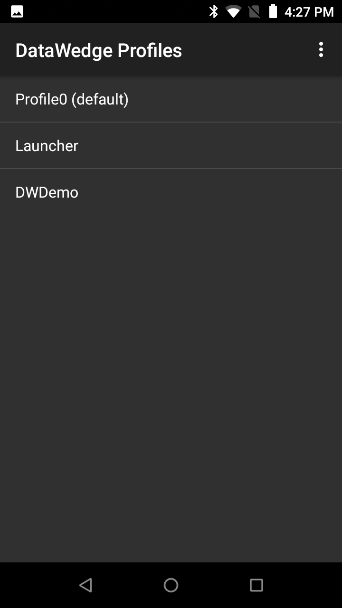
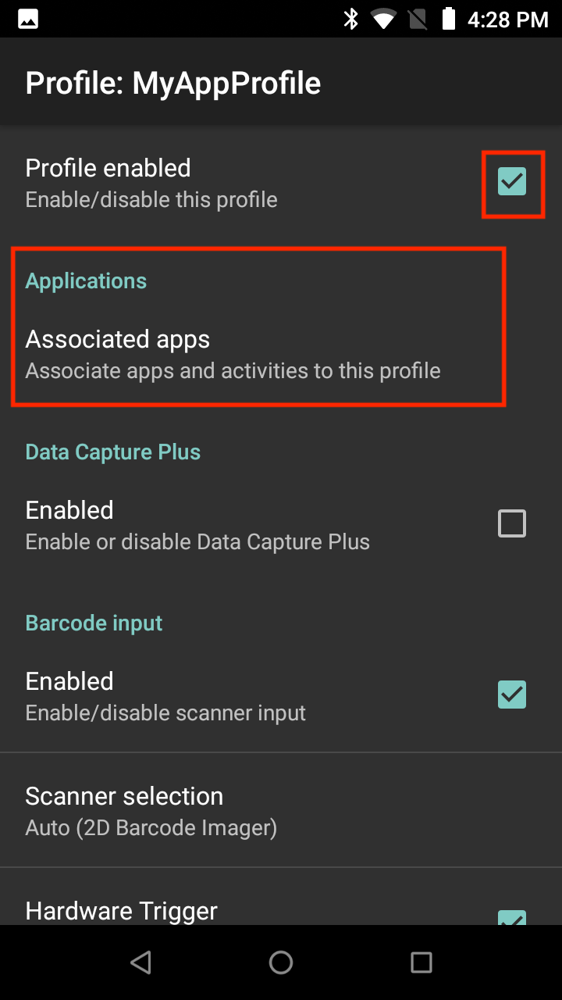
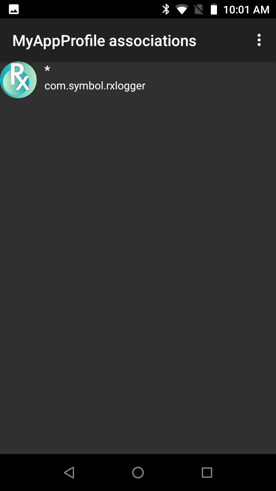
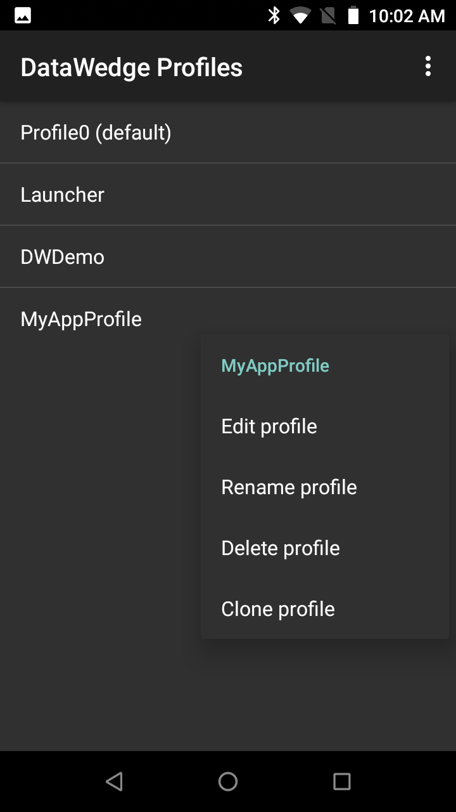

## Overview
DataWedge can be associated with any app on the device and called upon to acquire barcode, mag-stripe or other data, to process the data in a specified way, and to pass it to one or more apps. Therefore, each Profile must specify these three things: 

1. **Input device** determines whether to acquire data from [barcodes](../input/barcode), a [magnetic stripe](../input/msr), [RFID (radio-frequency identification) tags](../input/rfid), a [serial port](../input/serial), [voice](../input/voice) or [SimulScan](../input/simulscan).

2. **Process options** manipulate the acquired data using [Basic](../process/bdf) or [Advanced](../process/adf) data formatting processes. 

3. **Output method** specifies whether to pass data as [keystrokes](../output/keystroke), within an [intent](../output/intent) and/or over an [IP network](../output/ip). 

For more information about DataWedge Profiles, see the [Architecture Overview](../overview). 

-----

## Create a New Profile
To create a new profile (device screens may vary depending on device system and DataWedge version): 

The launcher icon for DataWedge 7.x is shown below. Locate the DataWedge icon and tap it to begin. 

_Launcher icon for DataWedge 7.x_
 

On a new installation, the DataWedge Profiles screen appear similar to that of the image below, showing the three included (visible) Profiles. White text indicates enabled Profiles. Also shown is a fourth, disabled Profile (grey text) that's not present out-of-the-box. 

**Note**: If DataWedge had been opened previously, it will reopen to the last screen used. If necessary, press BACK until the Profiles screen appears.  
 

&#50;. **Tap the "hamburger"** menu and **select -> New profile**.  

 

&#51;.  **Enter a name** for the new Profile and **tap OK**. The Profiles list appears, similar to the image in Step 4, below.  

Zebra recommends that Profile names be unique, contain alpha-numeric characters, and be short in length to avoid possible import/export profile issues.
 

#### Associate the Profile with App(s) and/or Activities: 

&#52;. **Tap the Profile** to be associated: 

 

&#53;. From the Profile screen, **tap the "Profile enabled" checkbox** to enable it, then **tap "Associated apps"** to link it with an app or activity:

 

&#54;. **Tap the menu** and **select -> New app/activity**. A list appears with all apps and activities installed on the device. 

 

&#55;. From the device apps/activities list, **select the app or activity to associate** with the Profile being edited. When an app is selected, its activities list appears (see Step 8). 

 

&#56;. From the app activities list, **tap the asterisk to associate all app activities** with the Profile, or tap on an indvidual activity to use DataWedge for **that specific activity only**:

 

&#57;. The app now appears in the Profile associations list as below. **Repeat Steps 6-9** until all desired apps and/or activities are associated. 

When finished adding associations, **Tap the BACK button** to return to the Profile screen. 
 
 

#### Configure a Profile for Input, Processing and Output:

&#49;&#48;. From the Profile screen, **enable the desired Input device** (scrolling down as necessary). For example, the Barcode Input displays an option for Scanner selection: 

 

&#49;&#49;. From the Scanner selection screen, **select the desired scanner** or imager. **Tap BACK** to return to the Input screen. 

**Note: Lists such as the one above display only devices that are present on (or connected to) the unit being configured**. For related information, see [Scanner Selection](../input/barcode/#scannerselection) in the Barcode Input guide. 
 

&#49;&#50;. From the Decoders screen (accessible from the Input screen), **select only the decoders required by the application** to optimize scanning performance. **Tap BACK** to return to the Input screen. For more information about configuring Decoder parameters, see the [Barcode Input Guide](../input/barcode).

 

&#49;&#51;. From the Profile screen, **select the desired Output method** (scrolling down as necessary). For example, the image below shows that Keystroke Output is enabled: 
<table>
 <tr>
    <td></td>
    <td> &nbsp; &nbsp; &nbsp; </td> 
    <td></td>
 </tr>
</table>

**Note**: Output sections contain selectors for configuring "Basic data formatting" and "Advanced data formatting." **These are the data processing options**.  
 

&#49;&#52;. **Select the Basic data formatting** for options on inserting special keystrokes or adding text before (prefix) and/or after (suffix) the collected data:  

 

See [Basic Data Formatting](../process/bdf) and [Advanced Data Formatting](../process/adf) sections for more information about processing of acquired data.
 

The app now uses DataWedge for barcode data acquisition. 

-----

## Editing Profiles

**To modify, rename, delete or clone a profile**: 

&#49;. **Long-press the Profile name** to bring up its Context menu.

&#50;. **Tap on the desired action**: 

 
Editing a Profile also can be started by tapping the Profile name in the Profile list. 

-----

**Related Guides**: 

* **[Profile Architecture Overview](../overview) -** explains how DataWedge uses Profiles
* **[Profile Options](../profiles) -** links and details for all DataWedge Profile options
* **[DataWedge APIs](../api) -** access DataWedge programmatically 
