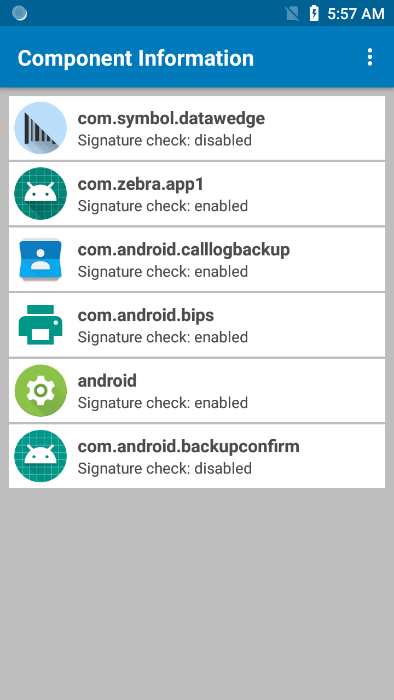

## Overview

Intent Output allows data acquired and processed by DataWedge to be sent to the associated foreground application as payload within an Android intent object. This allows acquired data to be passed programmatically to an application, where it can be consumed or further processed. The core components of an application (its activities, services and broadcast receivers) also can be activated by intents, as can many DataWedge features through the [DataWedge APIs](../../api).   

### The Intent Object
An intent object is a bundle of information that describes a desired action. It includes the data to be acted upon, the category of component that should perform the action and other pertinent data and/or instructions. When an intent is initiated, Android locates an appropriate component to respond to the intent, launches a new instance of the component (if needed), and passes the intent object to it.

Components advertise their capabilities (the kinds of intents they can respond to) through intent filters. Since the system must learn which intents a component can handle before it launches the component, intent filters are specified in the app's `AndroidManifest.xml` file as &lt;intent-filter&gt; elements. A component can have any number of intent filters, each describing a different capability.  

For example, if the manifest contains...

	<intent-filter>
	...
	<action android:name="android.intent.action.DEFAULT" />
	<category android:name="android.intent.category.MAIN" />
	</intent-filter>

...the intent action in the Intent Output configuration would be:

`android.intent.action.DEFAULT`

and the Intent category would be:

`android.intent.category.MAIN`
<!--
-----

**SEE ALSO**:

* **[DataWedge APIs - Benefits & Usage Scenarios](https://developer.zebra.com/community/android/android-forums/android-blogs/blog/2017/06/27/datawedge-apis-benefits-challenges) -** by Zebra engineer Darryn Campbell 
* **[Sample DataWedge app](../../api/tutorials) -** Demonstrates how to receive scanned data through an intent
-->
-----

### Outputting Raw Data

In addition to its normal plain-text and hexadecimal modes, DataWedge can output acquired data in its raw form, before the application of any encoders. This can be useful if custom encoders are needed for acquiring character sets not supported by Zebra.  

Raw data is received as a byte stream using the `com.symbol.datawedge.decode_data` intent extra. See the [Single Decode Mode section](#singledecodemode) below. 

> **Raw data cannot be output as keystrokes**. 

-----

## Intent Output Setup

DataWedge invokes an intent though an **Intent action** in an **Intent category** as described in its `AndroidManifest.xml` file. 

When combined, these two values are like a "channel" to which an app can listen for intents that use the same combination, filtering out "noise" from other intents that use different value pairs. **Once these values are known, DataWedge Intent Output must be set to match**. 

**Component Information** specifies the package names and signatures of the applications that are designated to receive intent data. This guarantees that the data is delivered only to the intended applications. 

* When the package name is specified, DataWedge sends explicit intents only to the package name. Optionally, enabling the application signature check adds another level of security for intent delivery. DataWedge matches the signature of the application before sending out the intent. If the signature does not match, DataWedge does not send the intent. If the signature check is not enabled, DataWedge sends the explicit intent based on the package name. 

* For example, if a package name is specified as 'com.zebra.app1' without the signature check, another app can be created with this same package name and disguised as the original - the original app can be uninstalled on the device and the new malicious app can be installed as the replacement. This results to the intent data being delivered to the malicious app. If instead, the signature check was enabled for the original app, even though the new app shares the same package name, the signature is different and therefore the intent data cannnot be delivered to the malicious app.

**Use content providers** option allows applications to leverage DataWedge's content provider to retrieve scanned data from files larger than 500 KB, such as images, primarily with Signature Capture and NextGen SimulScan. A content provider is an Android app component that encapsulates data to share between apps.

The parameters of these features can be configured through the UI or by using the [Set Config API](../../api/setconfig).

See [Use Content Provider Programmer's Guide](../../programmers-guides/content-provider) for more information.

>**Important**: For scanning applications that output directly to an activity, **the activity must be designated as "singleTop"** in the app's `AndroidManifest.xml` file. Failure to designate an activity in this way will cause an instance of the activity to be launched with every decode, and the acquired data sent to each newly spawned instance. 

-----

**To configure DataWedge with Intent Output options**: 

**&#49;. Locate the Intent Output section of the Profile** being configured.

**&#50;. Check "Enabled" box** to activate Intent Output:  

_Intent Output options for the "Launcher" Profile_
 

**&#51;. Specify action, category and delivery** as described below: 

&nbsp;&nbsp;&nbsp;&nbsp;**Intent action -** specifies the action to handle the intent  
&nbsp;&nbsp;&nbsp;&nbsp;**Intent category -** specifies the category of intent to be handled  
&nbsp;&nbsp;&nbsp;&nbsp;**Intent delivery -** used to select one of four delivery methods for intent-based data:
* **Send via startActivity -** startActivity() Android API is called to deliver data. 
* **Send via startService -** startService() Android API is called to deliver data for devices prior to Android Oreo (v8.0). For Android Oreo and above devices, the option "Use startForegroundService on failure" is available within this setting to call startForegroundService() if the startService() call fails. With this single option, it provides support for devices both prior and later than Android Oreo. 
* **Send via startForegroundService -** startForegroundService() Android API is called to deliver data. This option applies to Android Oreo (v8.0) and above.
* **Broadcast Intent -** <i>**Receiver foreground flag**</i> `Intent.FLAG_RECEIVER_FOREGROUND` can be set giving the broadcast recipient permission to run at foreground priority with a shorter timeout interval. **Zebra recommends using this flag <u>only if delays are seen</u> in delivery of intents immediately following device boot-up**.

<!--
**When Intent delivery is set to "Broadcast Intent"**, <i>**Receiver foreground flag**</i> `Intent.FLAG_RECEIVER_FOREGROUND` can be set giving the broadcast recipient permission to run at foreground priority with a shorter timeout interval. **Zebra recommends using this flag <u>only if delays are seen</u> in delivery of intents immediately following device boot-up**.

**When Intent delivery is set to "Send via startForegroundService"**, startForegroundService() Android API is called to deliver data. This option applies to Android Oreo (v8.0) and above.

**When Intent delivery is set to "Send via startService"**, startService() Android API is called to deliver data for devices prior to Android Oreo (v8.0). For Android Oreo and above devices, the option "Use startForegroundService on failure" is available within this setting to call startForegroundService() if the startService() call fails. With this single option, it provides support for devices both prior and later than Android Oreo. 
-->
**&#52;. Specify component information for secure intent delivery.** Tap on **Component Information.** 

_Component Information under Intent Output_
 
Tap the top right menu and select **New Component.**

_Add New Component_
 
Select the package name to receive intent data from the installed app list. 

_Select New Component_
 

When prompted, tap **OK** to enable the application signature check, allowing DataWedge to retrieve the app signature via the .APK and use it for comparison. Otherwise, tap **Cancel.** If multiple signatures are available for an app, a list is be displayed for the user to select one signature.

_Application signature_
 
The selected package name is listed with an indication whether the signature check is enabled/disabled.

_Component Information list_
 

**&#53;. Enable Use Content Providers** from the Intent Output screen when scanning large data such as images (for example with Signature Capture and NextGen SimulScan).

_Use Content Providers_

-----

## Single Decode Mode

Single mode reads and decodes a single barcode at a time, and is the most common decoding mode. For decoding multiple barcodes simultaneously, such as with UDI-compliant objects, see [UDI/Multiple Decode Mode](#udimultipledecodemode). 

### Parameters

**Name**: "com.symbol.datawedge.source" 
**Type**: [String] 
**Contents**: Source of incoming data 
**Possible values**: 
* "msr"
* "scanner"
* "simulscan"
* "serial"
* "voice"
* "rfid"

**NOTE**: Source of incoming data is "scanner" for camera, imager or scanner. 

-----

**Name**: "com.symbol.datawedge.label_type" 
**Type**: [String] 
**Contents**: Barcode label type (i.e. "EAN128") 
**Possible values**: 
* "LABEL-TYPE-CODE39"
* "LABEL-TYPE-CODABAR"
* "LABEL-TYPE-CODE128"
* "LABEL-TYPE-D2OF5"
* "LABEL-TYPE-IATA2OF5"
* "LABEL-TYPE-I2OF5"
* "LABEL-TYPE-CODE93"
* "LABEL-TYPE-UPCA"
* "LABEL-TYPE-UPCE0"
* "LABEL-TYPE-UPCE1"
* "LABEL-TYPE-EAN8"
* "LABEL-TYPE-EAN13"
* "LABEL-TYPE-MSI"
* "LABEL-TYPE-EAN128"
* "LABEL-TYPE-TRIOPTIC39"
* "LABEL-TYPE-BOOKLAND"
* "LABEL-TYPE-COUPON"
* "LABEL-TYPE-DATABAR-COUPON"
* "LABEL-TYPE-ISBT128"
* "LABEL-TYPE-CODE32"
* "LABEL-TYPE-PDF417"
* "LABEL-TYPE-MICROPDF"
* "LABEL-TYPE-TLC39"
* "LABEL-TYPE-CODE11"
* "LABEL-TYPE-MAXICODE"
* "LABEL-TYPE-DATAMATRIX"
* "LABEL-TYPE-QRCODE"
* "LABEL-TYPE-GS1-DATABAR"
* "LABEL-TYPE-GS1-DATABAR-LIM"
* "LABEL-TYPE-GS1-DATABAR-EXP"
* "LABEL-TYPE-USPOSTNET"
* "LABEL-TYPE-USPLANET"
* "LABEL-TYPE-UKPOSTAL"
* "LABEL-TYPE-JAPPOSTAL"
* "LABEL-TYPE-AUSPOSTAL"
* "LABEL-TYPE-DUTCHPOSTAL"
* "LABEL-TYPE-FINNISHPOSTAL-4S"
* "LABEL-TYPE-CANPOSTAL"
* "LABEL-TYPE-CHINESE-2OF5"
* "LABEL-TYPE-AZTEC"
* "LABEL-TYPE-MICROQR"
* "LABEL-TYPE-US4STATE"
* "LABEL-TYPE-US4STATE-FICS"
* "LABEL-TYPE-COMPOSITE-AB"
* "LABEL-TYPE-COMPOSITE-C"
* "LABEL-TYPE-WEBCODE"
* "LABEL-TYPE-SIGNATURE"
* "LABEL-TYPE-KOREAN-3OF5"
* "LABEL-TYPE-MATRIX-2OF5"
* "LABEL-TYPE-OCR"
* "LABEL-TYPE-HANXIN"
* "LABEL-TYPE-MAILMARK"
* "MULTICODE-DATA-FORMAT"
* "LABEL-TYPE-GS1-DATAMATRIX"
* "LABEL-TYPE-GS1-QRCODE"
* "LABEL-TYPE-DOTCODE"
* "LABEL-TYPE-GRIDMATRIX"
* "LABEL-TYPE-UNDEFINED"

-----

**Name**: "com.symbol.datawedge.data_string" 
**Type**: [String] 
**Contents**: Acquired barcode characters 
**Example**: "abcde12345" 

-----

**Name**: "com.symbol.datawedge.decode_data" 
**Type**: [List &lt;byte [ ]&gt;] 
**Contents**: Acquired raw (unmodified) data as an array list of byte arrays 
**Example**: List_Item_1(array_1(byte11,byte12,byte13)),List_Item_2(array_2(byte21,byte22,byte23)) ... 
**Sample code**: 

	ArrayList<byte[]> rawData =  
	     (ArrayList <byte[]>) initiatingIntent.getSerializableExtra("com.symbol.datawedge.decode_data"); 
		 
	if (rawData != null) 
	{ 
		byte[] rawBytes = rawData.get(0); 
		for (int i = 0; i < rawBytes.length; i++) 
			Log.d(LOG_TAG, i + ": " + rawBytes[i]); 
	}

-----

**Name**: "com.symbol.datawedge.decoded_mode" 
**Type**: [String] 
**Contents**: Mode used to decode the incoming data 
**Possible values**: 
* "multiple_decode"
* "single_decode"

-----

## UDI/Multiple Decode Mode

When decoding a UDI-compliant object, data is acquired from multiple barcodes simultaneously and output as a multi-decode bundle, which differs from a single-decode bundle. DataWedge also can acquire multiple non-UDI barcodes in a single scan. This section applies to both modes.

### Parameters

**Name**: "com.symbol.datawedge.decode_mode" 
**Type**: [String] 
**Contents**: Mode used to decode incoming data 
**Possible values**: 
* "multiple_decode"
* "single_decode"

-----

**Name**: "com.symbol.datawedge.smart_decode_type" 
**Type**: [String] 
**Contents**: Decode type  
**Possible values**:
* “udi”
* “multibarcode”

-----

**Name**: "com.symbol.datawedge.data_string" 
**Type**: [String] 
**Contents**: Acquired barcode characters  
**Example**: "abcde12345" 

-----

**Name**: "com.symbol.datawedge.decode_data" 
**Type**: [List &lt;byte [ ]&gt;] 
**Contents**: Acquired raw (unmodified) data as an array list of byte arrays 
**Example**: List_Item_1(array_1(byte11,byte12,byte13)), List_Item_2(array_2(byte21,byte22,byte23)) ...

-----

**Name**: "com.symbol.datawedge.source" 
**Type**: [String] 
**Contents**: Source of incoming data 
**Possible values**:
* "msr"
* "scanner" 
* "simulscan"

-----

**Name**: "com.symbol.datawedge.label_id" 
**Type**: [String] 
**Contents**: UDI type of incoming data 
**Possible values**:
* “UDI_HIBCC” 
* “UDI_GS1” 
* “UDI_ICCBBA” 
* “UNDEFINED”

-----

**Name**: "com.symbol.datawedge.barcodes" 
**Type**: [List &lt;Bundle&gt;] 
**Contents**: See Bundle description (below) 

-----

**Name**: "com.symbol.datawedge.tokenized_data" 
**Type**: [List &lt;Bundle&gt;] 
**Contents**: See Bundle description (below) 
**Note**: Source of incoming data is "scanner" for camera, imager or scanner 

-----

### Barcode Bundle

##### Bundle name: "com.symbol.datawedge.barcodes"

#### Parameters

**Name**: "com.symbol.datawedge.label_type" 
**Type**: [String] 
**Contents**: Barcode label type, original symbology (i.e. "EAN128") 

-----

**Name**: "com.symbol.datawedge.decode_data" 
**Type**: [byte [ ] ] 
**Contents**: Acquired raw (unmodified) data as a byte array 

-----

**Name**: "com.symbol.datawedge.data_string" 
**Type**: [String] 
**Contents**: Acquired barcode characters  
**Example**: "abcde12345" 

-----

### Tokenized Data Bundle

##### Bundle name: "com.symbol.datawedge.tokenized_data"

#### Parameters

**Name**: "token_id" 
**Type**: [String] 
**Contents**: Data in a UDI-defined tag  
**Possible values**: (see token IDs, below) 

-----

**Name**: "token_data_type" 
**Type**: [String] 
**Contents**: Incoming data type  
**Example**: date, long, string  

-----

**Name**: "token_format" 
**Type**: [String] 
**Contents**: Format of incoming string  
**Example**: YYYYMMDD 

-----

**Name**: "token_string_data" 
**Type**: [String] 
**Contents**: Acquired barcode characters  
**Example**: "abcde12345" 

-----

**Name**: "token_binary_data" 
**Type**: [byte [ ] ] 
**Contents**: Acquired barcode data as a byte array 

-----

### Token IDs

**Token ID**: di 
**Display Name**: Device identifier 

-----

**Token ID**: manufacturing_date_original 
**Display Name**: Manufacturing date 

-----

**Token ID**: expiration_date_original 
**Display Name**: Expiration date 

-----

**Token ID**: lot_number 
**Display Name**: Lot number 

-----

**Token ID**: serial_number 
**Display Name**: Serial number 

-----

**Token ID**: mpho_lot_number 
**Display Name**: Medical products of human origin (MPHO) lot number  

-----

**Token ID**: donation_id 
**Display Name**: Donation ID number 

-----

**Token ID**: labeler_identification_code 
**Display Name**: Labeler ID code 

-----

**Token ID**: product_or_catalog_number 
**Display Name**: Product or catalog number 

-----

**Token ID**: unit_of_measure_id 
**Display Name**: Unit of measure ID 

-----

**Token ID**: Quantity 
**Display Name**: Quantity 

-----

## Other Decode Tags

The decode-related data added to an intent bundle can be retrieved using specific string tags. Use the code below with the string tags in the section that follows.

	:::java
	Intent.getStringExtra()

**Tag**: LABEL_TYPE_TAG  
**Type**: [String] 
**Name**: "com.symbol.datawedge.label_type" 
**Contents**: Barcode label type  
**Example**: "LABEL-TYPE-EAN128" 

-----

**Tag**: DATA_STRING_TAG 
**Type**: [String] 
**Name**: "com.symbol.datawedge.data_string" 
**Contents**: Acquired barcode characters  
**Example**: "abcde12345" 

**Note**: When multiple barcodes are acquired simultaneously, the decoded data is concatenated and sent out as a single string.

-----

**Tag**: DECODE_DATA_TAG 
**Type**: [byte [ ] ] 
**Name**: "com.symbol.datawedge.decode_data" 
**Contents**: Decoded data returned as a list of byte arrays. 

**Note**: In most cases there will be one byte array per decode. <!-- REMOVED 10/5/17 PER ENG. EMAIL 10/4/17 2:06 pm << For barcode symbologies that support concatenation (i.e. Codabar, Code128, MicroPDF, etc.) the decoded data is stored in multiple byte arrays (one byte array per bar code). Data in each byte array can be retrieved by passing an index.
--> 
<!--
-----

**SEE ALSO**: 

* **[DataWedge APIs - Benefits & Usage Scenarios](https://developer.zebra.com/community/home/blog/2017/06/27/datawedge-apis-benefits-challenges) -** by Zebra engineer Darryn Campbell 
* **[Sample DataWedge app](../../api/tutorials) -** Demonstrates how to receive scanned data through an intent
-->
-----

**Other DataWedge Output Options**:

* **[Keystroke](../keystroke) -** outputs acquired data as if the keyboard was pressed
* **[Internet Protocol](../ip) -** outputs data over a network using TCP or UDP

**Related guides**:

* [Profiles/Plug-ins](../../profiles)
* [DataWedge APIs](../../api) 

