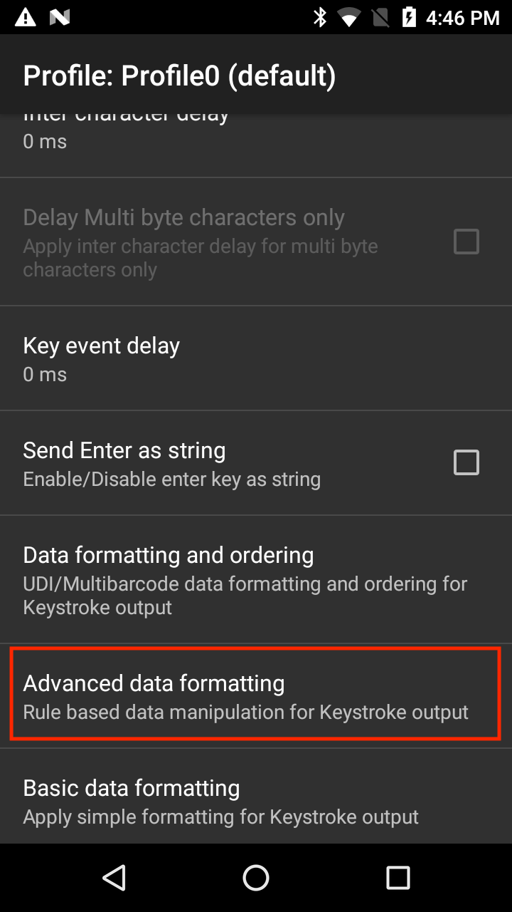
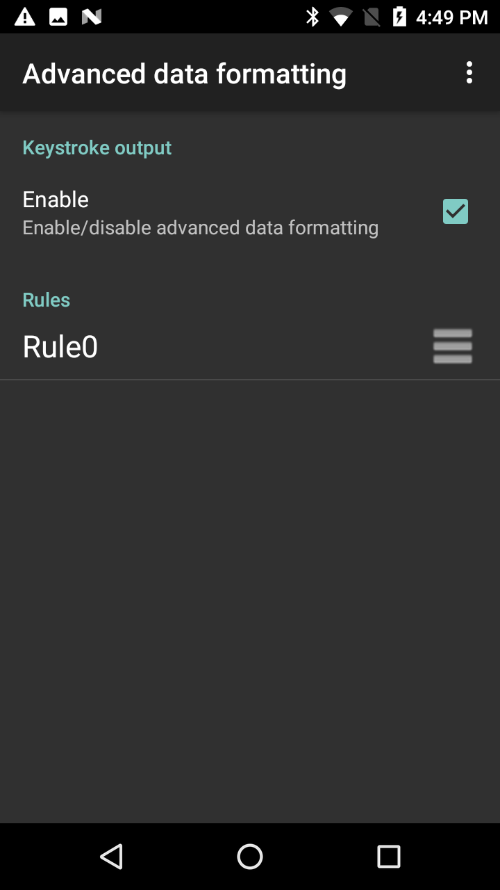
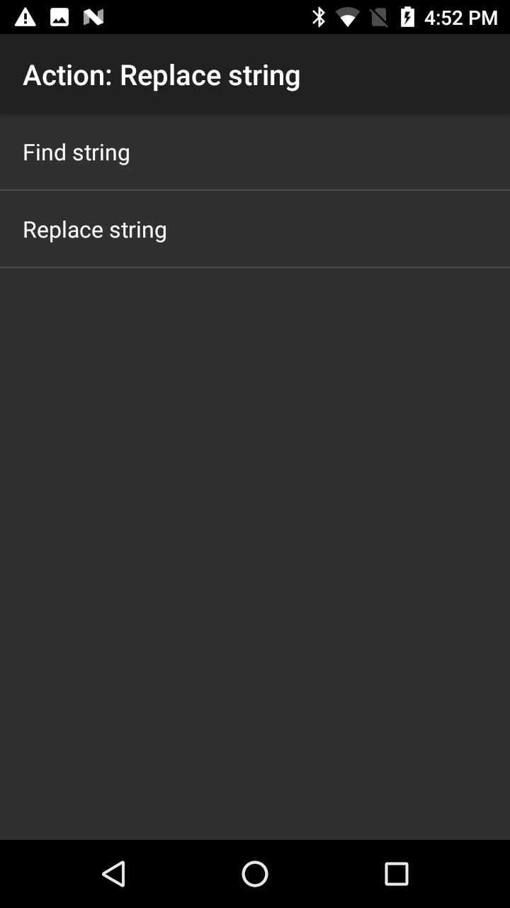
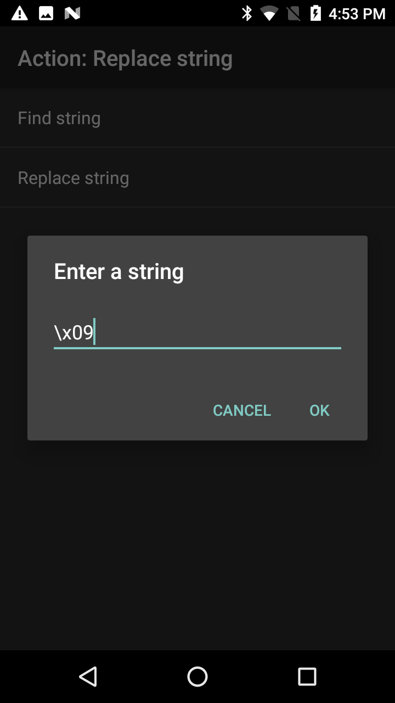

## Overview
Keystroke Output collects the processed data and sends it to the associated application as a series of keystrokes, emulating the actions of a user pressing keys on the device. DataWedge supports TAB, ENTER and other special characters that might be required by an application to submit acquired data for further processing, to advance the cursor to another input field or for other reasons. Special characters are added to acquired data by using the Action key character (shown below) and in the [Basic Data Formatting](../../process/bdf) or [Advanced Data Formatting](../../process/bdf) Process functions. 

> The parameters of this feature can be configured using the [Set Config API](../../api/setconfig).

-----

### Outputting Raw Data

In addition to its normal plain-text and hexadecimal modes, DataWedge can output acquired data in its raw form, before the application of any encoders. This can be useful if custom encoders are needed for acquiring character sets not supported by Zebra.  

Raw data is received as a byte stream using the `com.symbol.datawedge.decode_data` intent extra. For more information, see the [Intent Output guide](../intent). 

> **Raw data cannot be output as keystrokes**. 

-----

## Keystroke Output Setup

To enable Keystroke output for a Profile, place a check in the checkbox:

_Keystroke Output options_
 

**Action key character -** enables injection of a special character embedded within barcode, serial, RFID, voice or MSR data. Possible values:

* **None -** inject no action key
* **Tab -** inject action key in place of a ASCII Tab (0x09) character
* **Line feed -** inject action key in place of ASCII LF (0x0A) character
* **Carriage return -** inject action key in place of ASCII CR (0x0D) character

**Key event options -** sends keystrokes as key events, sends certain key events as string, and controls key event delays. _Supported only on SDM660 products (including PS20, TC52, TC57, TC72, and TC77)._ Options:

* **Key event delay -** set the delay (in ms) prior to the key event being sent
* **Send Characters as Events -** set to send ASCII code 32 to 126 as key events
* **Send Enter as string -** set to send ENTER key stroke output as a string. By default, this is disabled and ENTER is sent as a key event.
* **Send Tab as string -** set to send TAB key stroke output as a string. By default, this is disabled and TAB is sent as a key event.
* **Send Control Characters as Events -** set to send ASCII code 1 to 31 as key events. By default, this is disabled and the data is sent as a string. Refer to [ASCII Control Character Table](./#asciicontrolcharactertable) for a mapping of ASCII Control Characters to Android KeyEvents.

**Inter-character delay –** used to set a delay (in ms) following the delivery of each character to the application. This parameter is intended to help avoid issues that arise when data is dispatched too quickly for an application to accept. **Default=0**. If experiencing errors in keystroke delivery, increase this value in increments of 100 (to a max. of 1000) until errors cease. **Note: This parameter can negatively effect application performance**. 

**Multi-byte character delay -** applies the Inter-character delay (described above) to multi-byte characters only. This parameter is intended to help avoid problems that arise when sending Unicode and multi-byte characters to the Android browser. Available only when Inter-character delay is enabled. **Disabled by default**. 

**Key event delay -** used to set a delay (in ms) for dispatching control characters as keystrokes to the foreground application. This parameter is useful when sending data containing text as well as key events, where key events are sent asynchronously causing data to be delivered in the incorrect order. In this circumstance, it is recommended to add a key event delay to correct the order of data delivery.

-----

### Profile Import Behavior

* **For Profiles imported <u>into DataWedge 6.7 (and higher)</u> from prior versions**, the value specified for the "Multi byte character delay" is applied to the Inter-character delay and the “Delay Multi-byte characters only” parameter is enabled. 

* **For Profiles created with DataWedge 6.7 (and higher) <u>and imported into a prior version</u>**, the specified delay, if any, is applied only to multi-byte characters. 

-----

### UDI Data Output
This setting applies when the Scanning mode in [Barcode Reader Params](../../input/barcode/#readerparams) is set to UDI, which acquires multiple data points (tokens) as specified in the Universal Device Identifier parameter(s) selected in the above-referenced section. 

**Support for UDI barcodes, such as GS1, HIBCC and ICCBBA, is being terminated. This feature is supported using the imager on [selected Zebra devices](../../input/barcode/#udidecoding) up to Android P (version 9.x) only**

<!-- 2/8/18- removed pre-DW 6.7 panel 

 -->

**Token selection -** allows the output order of acquired UDI data to be adjusted and the optional insertion of a Tab, Line Feed or Carriage Return character between tokens, if required.

**To adjust UDI Token settings**: 

**&#49;. Tap "Send tokens" to select the desired output** for acquired UDI data. 

**Tokens only -** DataWedge parses the UDI data into separate Tokens for output (separated by a separator character, if selected).

**Barcodes and tokens -** DataWedge sends the barcode string appended by the tokenized data. If no separator character is selected (see Step 2), DataWedge sends two instances of the same data.

**&#50;. Tap "Token separator" in the Token selection screen to specify a separator character** to be inserted between Tokens, if desired. If "Barcode and tokens" mode is selected, the selected character also is inserted between the two. 

_This setting is not available if "Send tokens" is disabled_.
 

**&#51;. Tap "Token order" to include/exclude Tokens** from the output and adjust their output order. 

_Drag tokens to adjust output order_.
 
 
Programmatically configure UDI Data Output and retrieve the configuration:
* [SetConfig API](../../api/setconfig)
* [GetConfig API](../../api/getconfig)

-----

### MultiBarcode Data Output

This setting applies when the Scanning mode in [Barcode Reader Params](../../input/barcode/#readerparams) is set to MultiBarcode, which simultaneously acquires the number of barcodes (from 2-10) specified in the corresponding reader parameter. 

####To configure MultiBarcode output:

1. Tap "Data formatting and ordering" to specify a separator character to be inserted between the data from each barcode. 

 
2. Tap "Barcode separator" to specify the desired insertion character (CR, LF or TAB). Data from each barcode is otherwise concatenated and delivered as a single string of keystrokes.

####To configure a custom separator character as the MultiBarcode separator:

Select a supported default character (CR, LF, or TAB) as a MultiBarcode separator together with the Advanced Data Formatting plugin configuration to replace this selected character with a user specified character. The following steps replaces "TAB" with "+" as the custom separator character:

1. Tap "Data formatting and ordering" to specify a separator character to be inserted between the data from each barcode. 

 
2. Tap "Barcode separator" to specify the desired insertion character (CR, LF or TAB). In this case, select TAB. Data from each barcode is otherwise concatenated and delivered as a single string of keystrokes.

3. Tap back to return to the main profile screen. Select **Advanced data formatting** 

4. Under "Keystroke output" click Enable (tap on the checkbox). Tap Rule0.

5. Tap Actions to configure.

6. From the hamburger menu at the top right, select “New action”.

7. Scroll down and tap “Replace string”.

8. Tap “Replace String”. 

9. Tap "Find String". 

10. Enter the hexadecimal notation for tab: \x09. Tap OK.

11. Tap "Replace String". 

12. Enter desired string to use as replacement, for example "+".  Tap OK.

13. Tap back to return to the rule.

14. Tap and hold the horizontal bars next to "Replace string" and drag it above "Send Remaining". 

15. Tap back.

When performing a scan, each barcode in the MultiBarcode decode is now followed by a plus "+" character.

<!-- 
Send data - Set to transfer the captured data to the foreground application. Disabling this option prevents the actual data from being transmitted. However, the prefix and suffix strings, if present, are still transmitted even when this option is disabled (default - enabled).
-->

------

### Hexadecimal Data Output

Hex data is based on the encoded data received from the scanner framework after it's converted from its raw form to the selected character set. When the hex-output option is selected, the plain-text string is converted to the corresponding hex digits and output as a string. That hex data can be acquired programmatically. 

The Java command below returns the hex data stored in the keystroke or intent output string:

	:::java
	String hex = Hex.encodeHex(data.getString(DATA_STRING_TAG).toCharArray(), false);

**For more information and to enable hex output using the DataWedge UI, see [Basic Data Formatting (BDF)](../../process/bdf)**. 

------

### ASCII Control Character Table

Table mapping of ASCII Control Characters (range: 1-31) to Android KeyEvents:

<table class="facelift" style="width:100%" border="1" padding="5px">
  <tr bgcolor="#dce8ef">
    <th>Control Keys</th>
    <th>Decimal</th>
    <th>Control Character Name</th>
    <th>Description</th>
	<th>Key Events</th>
  </tr>

  <tr>
     <td>Ctrl-A</td>
	 <td>1</td>
	 <td>Start of Heading</td>
	 <td>Used as the first character of a heading</td>
	 <td>KeyEvent { action=<b>ACTION_DOWN,</b> keyCode=KEYCODE_A, scanCode=0, metaState=META_CTRL_LEFT_ON, flags=<>, repeatCount=0, eventTime=<>, downTime=<>, deviceId=<>, source=0x0 }   KeyEvent { action=<b>ACTION_UP,</b> keyCode=KEYCODE_A, scanCode=0, metaState=META_CTRL_LEFT_ON, flags=<>, repeatCount=0, eventTime=<>, downTime=<>, deviceId=<>, source=0x0 }</td>
  </tr>

  <tr>
  	 <td>Ctrl-B</td>
	 <td>2</td>
	 <td>Start of Text</td>
	 <td>Precedes text and used to terminate a heading</td>
	 <td>KeyEvent { action=<b>ACTION_DOWN,</b> keyCode=KEYCODE_B, scanCode=0, metaState=META_CTRL_LEFT_ON, flags=<>, repeatCount=0, eventTime=<>, downTime=<>, deviceId=<>, source=0x0 }   KeyEvent { action=<b>ACTION_UP,</b> keyCode=KEYCODE_B, scanCode=0, metaState=META_CTRL_LEFT_ON, flags=<>, repeatCount=0, eventTime=<>, downTime=<>, deviceId=<>, source=0x0 }</td>
  </tr>

  <tr>
  	 <td>Ctrl-C</td>
	 <td>3</td>
	 <td>End of text</td>
	 <td>Terminates a text</td>
	 <td>KeyEvent { action=<b>ACTION_DOWN,</b> keyCode=KEYCODE_C, scanCode=0, metaState=META_CTRL_LEFT_ON, flags=<>, repeatCount=0, eventTime=<>, downTime=<>, deviceId=<>, source=0x0 }   KeyEvent { action=<b>ACTION_UP,</b> keyCode=KEYCODE_C, scanCode=0, metaState=META_CTRL_LEFT_ON, flags=<>, repeatCount=0, eventTime=<>, downTime=<>, deviceId=<>, source=0x0 }</td>
  </tr>

  <tr>
  	 <td>Ctrl-D</td>
	 <td>4</td>
	 <td>End of transmission</td>
	 <td>Indicates the conculsion of the text transmission</td>
	 <td>KeyEvent { action=<b>ACTION_DOWN,</b> keyCode=KEYCODE_D, scanCode=0, metaState=META_CTRL_LEFT_ON, flags=<>, repeatCount=0, eventTime=<>, downTime=<>, deviceId=<>, source=0x0 }  KeyEvent { action=<b>ACTION_UP,</b> keyCode=KEYCODE_D, scanCode=0, metaState=META_CTRL_LEFT_ON, flags=<>, repeatCount=0, eventTime=<>, downTime=<>, deviceId=<>, source=0x0 }</td>
  </tr>

  <tr>
  	 <td>Ctrl-E</td>
	 <td>5</td>
	 <td>Enquiry</td>
	 <td>Used as a request for a response</td>
	 <td>KeyEvent { action=<b>ACTION_DOWN,</b> keyCode=KEYCODE_E, scanCode=0, metaState=META_CTRL_LEFT_ON, flags=<>, repeatCount=0, eventTime=<>, downTime=<>, deviceId=<>, source=0x0 }  KeyEvent { action=<b>ACTION_UP,</b> keyCode=KEYCODE_E, scanCode=0, metaState=META_CTRL_LEFT_ON, flags=<>, repeatCount=0, eventTime=<>, downTime=<>, deviceId=<>, source=0x0 }</td>
  </tr>

  <tr>
  	 <td>Ctrl-F</td>
	 <td>6</td>
	 <td>Acknowledge</td>
	 <td>Transmitted by receiver as an affirmative response to the sender</td>
	 <td>KeyEvent { action=<b>ACTION_DOWN</b>, keyCode=KEYCODE_F, scanCode=0, metaState=META_CTRL_LEFT_ON, flags=<>, repeatCount=0, eventTime=<>, downTime=<>, deviceId=<>, source=0x0 }   KeyEvent { action=<b>ACTION_UP</b>, keyCode=KEYCODE_F, scanCode=0, metaState=META_CTRL_LEFT_ON, flags=<>, repeatCount=0, eventTime=<>, downTime=<>, deviceId=<>, source=0x0 }</td>
  </tr>

  <tr>
  	 <td>Ctrl-G</td>
	 <td>7</td>
	 <td>Bell</td>
	 <td>Used when there is a need to call for attention</td>
	 <td>KeyEvent { action=<b>ACTION_DOWN,</b> keyCode=KEYCODE_G, scanCode=0, metaState=META_CTRL_LEFT_ON, flags=<>, repeatCount=0, eventTime=<>, downTime=<>, deviceId=<>, source=0x0 }  KeyEvent { action=<b>ACTION_UP,</b> keyCode=KEYCODE_G, scanCode=0, metaState=META_CTRL_LEFT_ON, flags=<>, repeatCount=0, eventTime=<>, downTime=<>, deviceId=<>, source=0x0 }</td>
  </tr>

  <tr>
  	 <td>Ctrl-H</td>
	 <td>8</td>
	 <td>Backspace</td>
	 <td>Moves active position one character position backwards on the same line</td>
	 <td>KeyEvent { action=<b>ACTION_DOWN,</b> keyCode=KEYCODE_H, scanCode=0, metaState=META_CTRL_LEFT_ON, flags=<>, repeatCount=0, eventTime=<>, downTime=<>, deviceId=<>, source=0x0 }   KeyEvent { action=<b>ACTION_UP,</b> keyCode=KEYCODE_H, scanCode=0, metaState=META_CTRL_LEFT_ON, flags=<>, repeatCount=0, eventTime=<>, downTime=<>, deviceId=<>, source=0x0 }</td>
  </tr>

  <tr>
  	 <td>Ctrl-I</td>
	 <td>9</td>
	 <td>Horizontal tabulation</td>
	 <td>Advances the active position to the next pre-determined character position on the same line</td>
	 <td>Managed by Send Tab as String/Event due to Android defined constant for Tab key</td>
  </tr>

  <tr>
  	 <td>Ctrl-J</td>
	 <td>10</td>
	 <td>Line feed</td>
	 <td>Advances the active position to the same character position of the next line</td>
	 <td>Managed by Send Enter as String/Event due to Android defined constant for Enter key</td>
  </tr>

  <tr>
  	 <td>Ctrl-K</td>
	 <td>11</td>
	 <td>Vertical tabulation</td>
	 <td>Advance the active position to the same character position on the next pre-determined line</td>
	 <td>KeyEvent { action=<b>ACTION_DOWN,</b> keyCode=KEYCODE_K, scanCode=0, metaState=META_CTRL_LEFT_ON, flags=<>, repeatCount=0, eventTime=<>, downTime=<>, deviceId=<>, source=0x0 }  KeyEvent { action=<b>ACTION_UP,</b> keyCode=KEYCODE_K, scanCode=0, metaState=META_CTRL_LEFT_ON, flags=<>, repeatCount=0, eventTime=<>, downTime=<>, deviceId=<>, source=0x0 }</td>
  </tr>

  <tr>
  	 <td>Ctrl-L</td>
	 <td>12</td>
	 <td>Form feed</td>
	 <td>Advances the active position to the same chracter position on a pre-determined line of the next form or page</td>
	 <td>KeyEvent { action=<b>ACTION_DOWN,</b> keyCode=KEYCODE_L, scanCode=0, metaState=META_CTRL_LEFT_ON, flags=<>, repeatCount=0, eventTime=<>, downTime=<>, deviceId=<>, source=0x0 }  KeyEvent { action=<b>ACTION_UP,</b> keyCode=KEYCODE_L, scanCode=0, metaState=META_CTRL_LEFT_ON, flags=<>, repeatCount=0, eventTime=<>, downTime=<>, deviceId=<>, source=0x0 }</td>
  </tr>

  <tr>
  	 <td>Ctrl-M</td>
	 <td>13</td>
	 <td>Carriage return</td>
	 <td>Moves the active position to the first character position on the same line</td>
	 <td>Managed by Send Enter as String/Event due to Android defined constant for Enter key</td>
  </tr>

  <tr>
  	 <td>Ctrl-N</td>
	 <td>14</td>
	 <td>Shift out</td>
	 <td>Used in conjunction with SHIFT IN and ESCAPE to extend the graphic character set of the code</td>
	 <td>KeyEvent { action=<b>ACTION_DOWN,</b> keyCode=KEYCODE_N, scanCode=0, metaState=META_CTRL_LEFT_ON, flags=<>, repeatCount=0, eventTime=<>, downTime=<>, deviceId=<>, source=0x0 }  KeyEvent { action=<b>ACTION_UP,</b> keyCode=KEYCODE_N, scanCode=0, metaState=META_CTRL_LEFT_ON, flags=<>, repeatCount=0, eventTime=<>, downTime=<>, deviceId=<>, source=0x0 }</td>
  </tr>

  <tr>
  	 <td>Ctrl-O</td>
	 <td>15</td>
	 <td>Shift in</td>
	 <td>Used in conjunction with SHIFT OUT and ESCAPE to extend the graphic character set of the code</td>
	 <td>KeyEvent { action=<b>ACTION_DOWN,</b> keyCode=KEYCODE_O, scanCode=0, metaState=META_CTRL_LEFT_ON, flags=<>, repeatCount=0, eventTime=<>, downTime=<>, deviceId=<>, source=0x0 }  KeyEvent { action=<b>ACTION_UP,</b> keyCode=KEYCODE_O, scanCode=0, metaState=META_CTRL_LEFT_ON, flags=<>, repeatCount=0, eventTime=<>, downTime=<>, deviceId=<>, source=0x0 }</td>
  </tr>

  <tr>
  	 <td>Ctrl-P</td>
	 <td>16</td>
	 <td>Data link escape</td>
	 <td>Changes the meaning of a limited number of contiguously following characters. It is used exclusively to provide supplementary data transmission control functions.</td>
	 <td>KeyEvent { action=<b>ACTION_DOWN,</b> keyCode=KEYCODE_P, scanCode=0, metaState=META_CTRL_LEFT_ON, flags=<>, repeatCount=0, eventTime=<>, downTime=<>, deviceId=<>, source=0x0 }  KeyEvent { action=<b>ACTION_UP,</b> keyCode=KEYCODE_P, scanCode=0, metaState=META_CTRL_LEFT_ON, flags=<>, repeatCount=0, eventTime=<>, downTime=<>, deviceId=<>, source=0x0 }</td>
  </tr>

  <tr>
  	 <td>Ctrl-Q</td>
	 <td>17</td>
	 <td>Device control 1</td>
	 <td>Primarily intended for turning on or starting an ancillary device</td>
	 <td>KeyEvent { action=<b>ACTION_DOWN,</b> keyCode=KEYCODE_Q, scanCode=0, metaState=META_CTRL_LEFT_ON, flags=<>, repeatCount=0, eventTime=<>, downTime=<>, deviceId=<>, source=0x0 }  KeyEvent { action=<b>ACTION_UP,</b> keyCode=KEYCODE_Q, scanCode=0, metaState=META_CTRL_LEFT_ON, flags=<>, repeatCount=0, eventTime=<>, downTime=<>, deviceId=<>, source=0x0 }</td>
  </tr>

  <tr>
  	 <td>Ctrl-R</td>
	 <td>18</td>
	 <td>Device control 2</td>
	 <td>Primarily intended for turning on or starting an ancillary device</td>
	 <td>KeyEvent { action=<b>ACTION_DOWN,</b> keyCode=KEYCODE_R, scanCode=0, metaState=META_CTRL_LEFT_ON, flags=<>, repeatCount=0, eventTime=<>, downTime=<>, deviceId=<>, source=0x0 }  KeyEvent { action=<b>ACTION_UP,</b> keyCode=KEYCODE_R, scanCode=0, metaState=META_CTRL_LEFT_ON, flags=<>, repeatCount=0, eventTime=<>, downTime=<>, deviceId=<>, source=0x0 }</td>
  </tr>

  <tr>
  	 <td>Ctrl-S</td>
	 <td>19</td>
	 <td>Device control 3</td>
	 <td>Primarily intended for turning off or stopping an ancillary device</td>
	 <td>KeyEvent { action=<b>ACTION_DOWN,</b> keyCode=KEYCODE_S, scanCode=0, metaState=META_CTRL_LEFT_ON, flags=<>, repeatCount=0, eventTime=<>, downTime=<>, deviceId=<>, source=0x0 }  KeyEvent { action=<b>ACTION_UP,</b> keyCode=KEYCODE_S, scanCode=0, metaState=META_CTRL_LEFT_ON, flags=<>, repeatCount=0, eventTime=<>, downTime=<>, deviceId=<>, source=0x0 }</td>
  </tr>

  <tr>
  	 <td>Ctrl-T</td>
	 <td>20</td>
	 <td>Device control 4</td>
	 <td>Primarily intended for turning off, stopping or interrupting an ancillary device</td>
	 <td>KeyEvent { action=<b>ACTION_DOWN,</b> keyCode=KEYCODE_T, scanCode=0, metaState=META_CTRL_LEFT_ON, flags=<>, repeatCount=0, eventTime=<>, downTime=<>, deviceId=<>, source=0x0 }  KeyEvent { action=<b>ACTION_UP,</b> keyCode=KEYCODE_T, scanCode=0, metaState=META_CTRL_LEFT_ON, flags=<>, repeatCount=0, eventTime=<>, downTime=<>, deviceId=<>, source=0x0 }</td>
  </tr>

  <tr>
  	 <td>Ctrl-U</td>
	 <td>21</td>
	 <td>Negative acknowledge</td>
	 <td>Transmitted by a receiver as a negative response to the sender</td>
	 <td>KeyEvent { action=<b>ACTION_DOWN,</b> keyCode=KEYCODE_U, scanCode=0, metaState=META_CTRL_LEFT_ON, flags=<>, repeatCount=0, eventTime=<>, downTime=<>, deviceId=<>, source=0x0 }  KeyEvent { action=<b>ACTION_UP,</b> keyCode=KEYCODE_U, scanCode=0, metaState=META_CTRL_LEFT_ON, flags=<>, repeatCount=0, eventTime=<>, downTime=<>, deviceId=<>, source=0x0 }</td>
  </tr>

  <tr>
  	 <td>Ctrl-V</td>
	 <td>22</td>
	 <td>Synchronous idle</td>
	 <td>Used by a synchronous transmission system in the absence of any other character (idle condition) to provide a signal from which synchronism may be achieved or retained between data terminal equipment</td>
	 <td>KeyEvent { action=<b>ACTION_DOWN,</b> keyCode=KEYCODE_V, scanCode=0, metaState=META_CTRL_LEFT_ON, flags=<>, repeatCount=0, eventTime=<>, downTime=<>, deviceId=<>, source=0x0 }  KeyEvent { action=<b>ACTION_UP,</b> keyCode=KEYCODE_V, scanCode=0, metaState=META_CTRL_LEFT_ON, flags=<>, repeatCount=0, eventTime=<>, downTime=<>, deviceId=<>, source=0x0 }</td>
  </tr>

  <tr>
  	 <td>Ctrl-W</td>
	 <td>23</td>
	 <td>End of trnsmission block</td>
	 <td>Indicates the end of a transmission block of data where data is divided into such blocks for transmission purposes</td>
	 <td>KeyEvent { action=<b>ACTION_DOWN,</b> keyCode=KEYCODE_W, scanCode=0, metaState=META_CTRL_LEFT_ON, flags=<>, repeatCount=0, eventTime=<>, downTime=<>, deviceId=<>, source=0x0 }  KeyEvent { action=<b>ACTION_UP,</b> keyCode=KEYCODE_W, scanCode=0, metaState=META_CTRL_LEFT_ON, flags=<>, repeatCount=0, eventTime=<>, downTime=<>, deviceId=<>, source=0x0 }</td>
  </tr>

  <tr>
  	 <td>Ctrl-X</td>
	 <td>24</td>
	 <td>Cancel</td>
	 <td>Indicates that the data preceding it is in error and thus is to be ignored</td>
	 <td>KeyEvent { action=<b>ACTION_DOWN,</b> keyCode=KEYCODE_X, scanCode=0, metaState=META_CTRL_LEFT_ON, flags=<>, repeatCount=0, eventTime=<>, downTime=<>, deviceId=<>, source=0x0 }  KeyEvent { action=<b>ACTION_UP,</b> keyCode=KEYCODE_X, scanCode=0, metaState=META_CTRL_LEFT_ON, flags=<>, repeatCount=0, eventTime=<>, downTime=<>, deviceId=<>, source=0x0 }</td>
  </tr>

  <tr>
     <td>Ctrl-Y</td>
	 <td>25</td>
	 <td>End of medium</td>
	 <td>Identifies the physical end of a medium</td>
	 <td>KeyEvent { action=<b>ACTION_DOWN,</b> keyCode=KEYCODE_Y, scanCode=0, metaState=META_CTRL_LEFT_ON, flags=<>, repeatCount=0, eventTime=<>, downTime=<>, deviceId=<>, source=0x0 }  KeyEvent { action=<b>ACTION_UP,</b> keyCode=KEYCODE_Y, scanCode=0, metaState=META_CTRL_LEFT_ON, flags=<>, repeatCount=0, eventTime=<>, downTime=<>, deviceId=<>, source=0x0 }</td>
  </tr>

  <tr>
     <td>Ctrl-Z</td>
	 <td>26</td>
	 <td>Substitute</td>
	 <td>Use in the place of a character that has been found to be invalid or in error. Intended to be introduced by automatic means.</td>
	 <td>KeyEvent { action=<b>ACTION_DOWN,</b> keyCode=KEYCODE_Z, scanCode=0, metaState=META_CTRL_LEFT_ON, flags=<>, repeatCount=0, eventTime=<>, downTime=<>, deviceId=<>, source=0x0 }  KeyEvent { action=<b>ACTION_UP,</b> keyCode=KEYCODE_Z, scanCode=0, metaState=META_CTRL_LEFT_ON, flags=<>, repeatCount=0, eventTime=<>, downTime=<>, deviceId=<>, source=0x0 }</td>
  </tr>

  <tr>
     <td>Ctrl-[</td>
	 <td>27</td>
	 <td>Escape</td>
	 <td>Use to provide additional control functions</td>
	 <td>KeyEvent { action=<b>ACTION_DOWN,</b> keyCode=KEYCODE_LEFT_BRACKET, scanCode=0, metaState=META_CTRL_LEFT_ON, flags=<>, repeatCount=0, eventTime=<>, downTime=<>, deviceId=<>, source=0x0 }  KeyEvent { action=<b>ACTION_UP,</b> keyCode=KEYCODE_LEFT_BRACKET, scanCode=0, metaState=META_CTRL_LEFT_ON, flags=<>, repeatCount=0, eventTime=<>, downTime=<>, deviceId=<>, source=0x0 }</td>
  </tr>

  <tr>
     <td>Ctrl-\</td>
	 <td>28</td>
	 <td>File separator</td>
	 <td>Use to separate and qualify data logically</td>
	 <td>KeyEvent { action=<b>ACTION_DOWN,</b> keyCode=KEYCODE_BACKSLASH, scanCode=0, metaState=META_CTRL_LEFT_ON, flags=<>, repeatCount=0, eventTime=<>, downTime=<>, deviceId=<>, source=0x0 }  KeyEvent { action=<b>ACTION_UP,</b> keyCode=KEYCODE_BACKSLASH, scanCode=0, metaState=META_CTRL_LEFT_ON, flags=<>, repeatCount=0, eventTime=<>, downTime=<>, deviceId=<>, source=0x0 }</td>
  </tr>

  <tr>
     <td>Ctrl-]</td>
	 <td>29</td>
	 <td>Group separator</td>
	 <td>Use to separate and qualify data logically</td>
	 <td>KeyEvent { action=<b>ACTION_DOWN,</b> keyCode=KEYCODE_RIGHT_BRACKET, scanCode=0, metaState=META_CTRL_LEFT_ON, flags=<>, repeatCount=0, eventTime=<>, downTime=<>, deviceId=<>, source=0x0 }  KeyEvent { action=<b>ACTION_UP,</b> keyCode=KEYCODE_RIGHT_BRACKET, scanCode=0, metaState=META_CTRL_LEFT_ON, flags=<>, repeatCount=0, eventTime=<>, downTime=<>, deviceId=<>, source=0x0 }</td>
  </tr>

  <tr>
     <td>Ctrl-^</td>
	 <td>30</td>
	 <td>Record separator</td>
	 <td>Use to separate and qualify data logically</td>
	 <td>KeyEvent { action=<b>ACTION_DOWN,</b> keyCode=KEYCODE_6, scanCode=0, metaState=META_SHIFT_LEFT_ON|META_CTRL_LEFT_ON, flags=<>, repeatCount=0, eventTime=<>, downTime=<>, deviceId=<>, source=0x0 }  KeyEvent { action=<b>ACTION_UP,</b> keyCode=KEYCODE_6, scanCode=0, metaState=META_SHIFT_LEFT_ON|META_CTRL_LEFT_ON, flags=<>, repeatCount=0, eventTime=<>, downTime=<>, deviceId=<>, source=0x0 }</td>
  </tr>

  <tr>
     <td>Ctrl-_</td>
	 <td>31</td>
	 <td>Unit separator</td>
	 <td>Use to separate and qualify data logically</td>
	 <td>KeyEvent { action=<b>ACTION_DOWN,</b> keyCode=KEYCODE_MINUS, scanCode=0, metaState=META_SHIFT_LEFT_ON|META_CTRL_LEFT_ON, flags=<>, repeatCount=0, eventTime=<>, downTime=<>, deviceId=<>, source=0x0 }  KeyEvent { action=<b>ACTION_UP,</b> keyCode=KEYCODE_MINUS, scanCode=0, metaState=META_SHIFT_LEFT_ON|META_CTRL_LEFT_ON, flags=<>, repeatCount=0, eventTime=<>, downTime=<>, deviceId=<>, source=0x0 }</td>
  </tr> 
</table>

-----

**Other DataWedge Output Options**:

* **[Internet Protocol](../ip) -** outputs data over a network using TCP or UDP
* **[Intent](../intent) -** delivers data to the app as an intent extra

**Related guides**:

* [DataWedge Profiles](../../profiles)
* [DataWedge APIs](../../api) 

