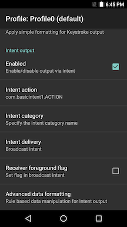

##Overview 
This sample demonstrates how to use DataWedge to receive scanned barcode data through an Android intent. 

Available actions in this sample: 
* Display the following for each decoded barcode:  
  * scan source 
  * scan data 
  * decoder type 

>**Note**: This application is intended for demonstration purposes only. It is provided as-is without guarantee or warranty and may be modified to suit individual needs. The appearance of sample app screens can vary by sample app version, Android version, and screen size.

##APIs Used

<table class="facelift" style="width:100%" border="1" padding="5px">
  <tr bgcolor="#dce8ef">
    <th>DataWedge API</th>
    <th>App Functionality</th>
  </tr>
  
  <tr>
	  <td>None</td>
	  <td>None</td>
  </tr>

</table>

##Requirements
* DataWedge (built-in all Zebra devices) is running on the device.
* DataWedge profile created and associated with this sample app. See instructions below.

##Using This Sample
Configure DataWedge to output scans via intent:
1. Launch the DataWedge via Apps > DataWedge.
2. Select a Profile, e.g. Profile0 which is used for all apps not explicitly assigned a profile.
3. Confirm the following settings:

    * The profile is **enabled**
    * Barcode input is **enabled**
    * Intent output is **enabled**

4. Configure the intent output as follows:
    * Intent action: **com.basicintent1.ACTION** (to match value defined in the `strings.xml` file)
    * Intent category: (leave blank)
    * Intent delivery: **Broadcast intent**
 
   
  _Figure 1: Profile settings_

Using the app:
1. [Download](https://github.com/Zebra/samples-datawedge), build, and launch the sample app.
   
   _Figure 2: App screen_

2. Scan a barcode. The data fields are populated:
  
   _Figure 3: App screen with captured data_
 
  
-----

**Related guides**:

* [The original tutorial](http://www.darryncampbell.co.uk/2017/12/13/tutorial-scan-with-datawedge-intent-output-on-zebra-devices/) by Zebra engineer Darryn Campbell 
* [DataWedge Intent Output](../../output/intent/) guide for profile settings and details 
* [DataWedge APIs](../../api) for intent-based functions

