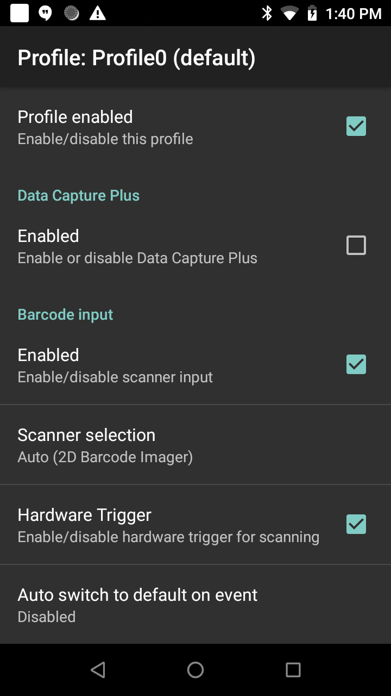

## Overview 
This tutorial demonstrates how to use DataWedge to receive scanned barcode data through an Android intent with the sample application [BasicIntent1](../basicintent1). The high level steps are:

1. Configure DataWedge.  Set the input (barcode scanner) and output (intent).
2. Create a profile and associate the app with the profile.
3. Run the app and scan a barcode.

This is the minimal code approach using a generic Android intent rather than DataWedge APIs.  To develop an app with finer control of DataWedge settings and data capture, refer to the [DataWedge API](../../api) guide and best practices in the [Get Started](../../gettingstarted) guide.

## Steps

1. Launch DataWedge.  From the apps menu tap DataWedge.
2. Create a new profile and associate the app with the profile.  Follow steps [Create a New Profile](../../createprofile).  Alternatively, Profile0 (the default profile used by all apps not explicitly assigned a profile) can be used.  If using the sample app to associate to a specific profile, select the app name “com.zebra.basicintent1”.
3. Confirm the following settings are enabled in the profile:
    * Profile
    * Barcode input
    * Intent output
      
4. Configure Intent output as follows:
    * **Intent action:** com.basicintent1.ACTION  
    This is an implicit intent that is sent by DataWedge. The application must register a broadcast receiver with the given action in order to receive the intent. For this tutorial in conjunction with BasicIntent1 sample, use: com.basicintent1.ACTION
    * **Intent category:** (leave blank)
    * **Intent delivery:** Broadcast intent
      
Refer to the [DataWedge Intent Output](../../output/intent/) guide for more information about these settings.
5.	Download, build and launch the sample app [BasicIntent1](../basicintent1).
6.	Scan a barcode.
7.	The scanned data is displayed.

## Sample code walk-through

Refer to [BasicIntent1 sample app source code](https://github.com/Zebra/samples-datawedge).

There are several important points to ensure that the app receives the intent data sent from DataWedge:

1. <b>Pre-define some of the strings in the application project</b> for ease of use when extracting the scanned data. The intent action is defined as `activity_intent_filter_action` in the sample app.  When received, the intent’s action contains extras with the scanned data for source, type, and data as described in the <a href="../../output/intent/">DataWedge Intent Output</a> guide. Content from Strings.xml in the sample app:
<!-- -->
        <resources>
            <string name="app_name">DW BasicIntent1</string>
            <string name="activity_intent_filter_action">com.dwbasicintent1.ACTION</string>
            <string name="datawedge_intent_key_source">com.symbol.datawedge.source</string>
            <string name="datawedge_intent_key_label_type">com.symbol.datawedge.label_type</string>
            <string name="datawedge_intent_key_data">com.symbol.datawedge.data_string</string>
        </resources>

2. <b>Register a broadcast receiver.</b> Since DataWedge is configured to send a broadcast intent, the application must register a broadcast receiver. This is done in the onCreate() method in the sample app:
<!-- -->
        protected void onCreate(Bundle savedInstanceState) {
            IntentFilter filter = new IntentFilter();
            filter.addCategory(Intent.CATEGORY_DEFAULT);
            filter.addAction(getResources().getString(R.string.activity_intent_filter_action));
            registerReceiver(myBroadcastReceiver, filter);
        }

  Note that the action being filtered matches the action configured in the DataWedge profile. In a production application, for efficiency the register/unregister would likely be done in the onResume()/onPause() methods.
3. <b>Define the broadcast receiver.</b> This is done in MainActivity.java in the sample app:
<!-- -->
        private BroadcastReceiver myBroadcastReceiver = new BroadcastReceiver() {
            @Override
            public void onReceive(Context context, Intent intent) {
                String action = intent.getAction();
                Bundle b = intent.getExtras();

                if (action.equals(getResources().getString(R.string.activity_intent_filter_action))) {
                    //  Received a barcode scan
                    try {
                        displayScanResult(intent, "via Broadcast");
                    } catch (Exception e) {
                        //  Catch if the UI does not exist when we receive the broadcast
                    }
                }
            }
        };

4. <b>Extract the scanned data and display it on the screen.</b>  This is done in method displayScanResult() in the sample app:
<!-- -->
        private void displayScanResult(Intent initiatingIntent, String howDataReceived)
        {
            String decodedSource = initiatingIntent.getStringExtra(getResources().getString(R.string.datawedge_intent_key_source));
            String decodedData = initiatingIntent.getStringExtra(getResources().getString(R.string.datawedge_intent_key_data));
            String decodedLabelType = initiatingIntent.getStringExtra(getResources().getString(R.string.datawedge_intent_key_label_type));

            final TextView lblScanSource = (TextView) findViewById(R.id.lblScanSource);
            final TextView lblScanData = (TextView) findViewById(R.id.lblScanData);
            final TextView lblScanLabelType = (TextView) findViewById(R.id.lblScanDecoder);

            lblScanSource.setText(decodedSource + " " + howDataReceived);
            lblScanData.setText(decodedData);
            lblScanLabelType.setText(decodedLabelType);
        }

Note that the extra keys were defined earlier in the strings.xml file.  This code assumes a UI exists in which to place the data, as performed in the sample app.

  
-----

**Related guides**:

* [The original tutorial](http://www.darryncampbell.co.uk/2017/12/13/tutorial-scan-with-datawedge-intent-output-on-zebra-devices/) by Zebra engineer Darryn Campbell 
* [DataWedge Intent Output](../../output/intent/) guide for profile settings and details 
* [DataWedge APIs](../../api) for intent-based functions

