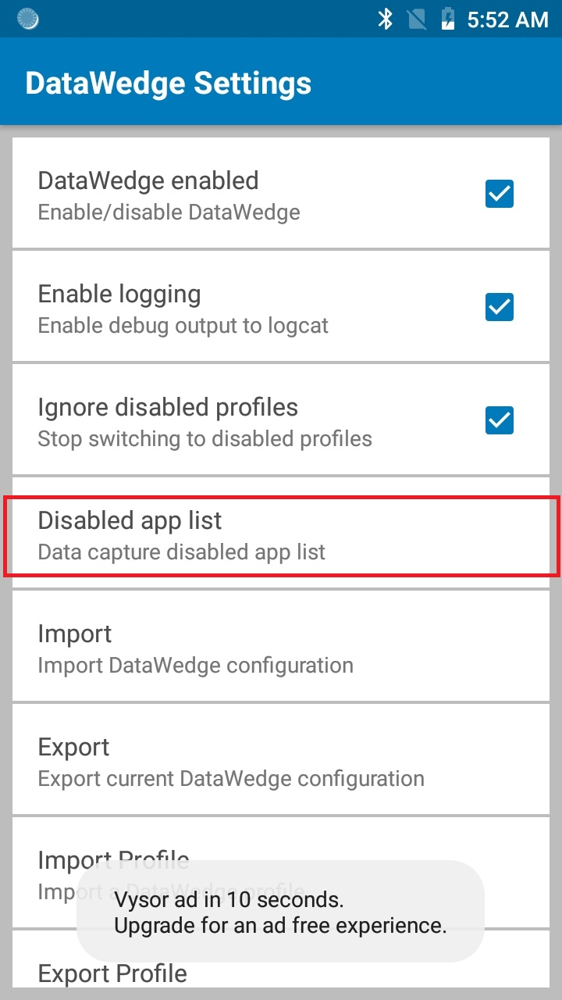
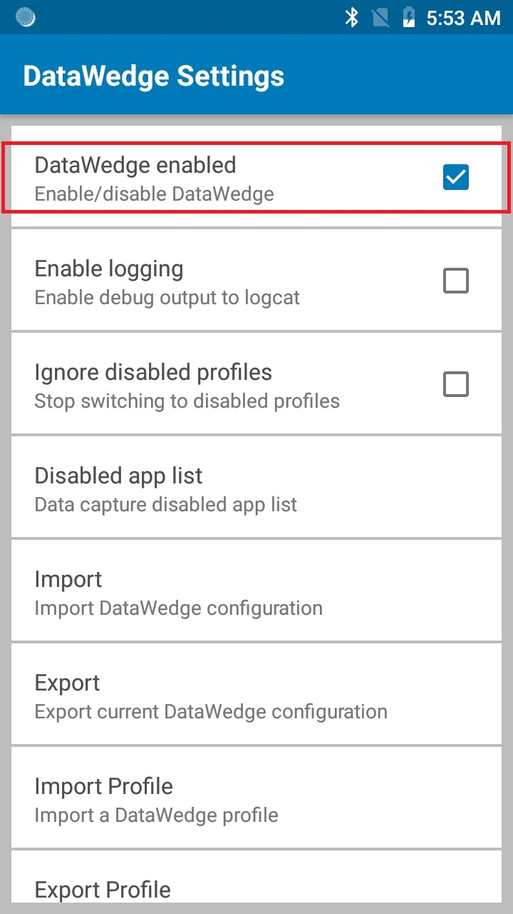

  
## Overview
This guide covers settings for the DataWedge app, including enabling and disabling DataWedge on the device, import reporting, and the management of Profile and Configuration files for backup and mass-deployment. For information about creating and implementing Profiles and Plug-ins, see the [Profile Guides](../profiles). 

-----

## DataWedge Settings

Most of the functionality referenced in this guide is accessed through the DataWedge Settings panel. 

**To access DataWedge Settings**: 

&#49;. From the Profiles screen, **tap the "hamburger" menu** and **select Settings** as highlighted below. The DataWedge Settings panel appears similar to the image in Step 2. 

_Access the DataWedge Settings panel from the Profiles screen_. 
 

&#50;. **Tap the desired feature** to invoke it or change its state. 
 <!-- datawedge_settings_panel.png -->
_The DataWedge Settings panel_
 
**Functions of the DataWedge Settings panel**: 

* **DataWedge enabled -** Controls the DataWedge service. Uncheck this box to disable DataWedge on the device and return control of scanning hardware to the system.
* **Enable logging -** Enables DataWedge to output logs for viewing with Logcat or in Android Studio or another compatible viewer.
* **Ignore disabled profiles -** Prevents DataWedge from switching to a Profile that is not enabled. In such instances, the Profile switch is ignored and the current Profile remains active **Profile0 must be disabled to use this feature**.  
* **Disabled app list -** Disables scanning functions for selected apps and/or activities anywhere on the device. [See more](#disableapps). 
* **Import -** Invokes navigation for importing a DataWedge Config file from device storage, replacing the current DataWedge settings. [See more](#importaconfig).
* **Export -** Exports the current DataWedge configuration to device storage. [See more](#exportaconfig).
* **Import Profile -** Invokes navigation for importing a DataWedge Profile from device storage. If a Profile of the same name already exists in DataWedge, settings of the existing Profile will be updated to match those of the imported file. [See more](#importaprofile).
* **Export Profile -** Exports an individual DataWedge profile to device storage. [See more](#exportaprofile).
* **Restore -** Returns DataWedge on the device to factory default settings. [See more](#restoredefaults).

-----

### Logging

DataWedge provides the option of outputting system log messages for viewing through the Logcat command line tool, Android Studio or another compatible viewer, usually over a USB connection. 

**To Enable/Disable Logging**: 

From the DataWedge Settings panel, **tap Enable Logging** to enable or disable logging as desired. 

 

-----

### Ignore Disabled Profiles

This feature prevents DataWedge from switching to a disabled profile when the app calls [SwitchToProfile API](../api/switchtoprofile). For example, this can be useful in cases where there is a profile that keeps the scanner enabled - if **Ignore Disabled Profiles** is enabled, it prevents an activity or app from switching to another profile that intends to disable the scanner. 

> **To enable this feature, [Profile0](../overview/#profile0) must be disabled**. 

From the DataWedge Settings panel, **tap Ignore disabled profiles** to enable or disable as desired:  

 

-----

### Disable Apps

DataWedge can prohibit certain apps from accessing its data capture services. This can be useful as a security measure to ensure that acquired data is sent only to approved apps, or simply as a means of controlling which apps will have access to the scanner. By default, all apps have access. 

**To Disable Data Capture for an app**: 

From the DataWedge Settings panel, **tap Disabled app list**:  

 

A list appears showing all installed apps and packages, similar to the image below. **Tap one or more app(s) or activities to add to the disabled list**, scrolling as necessary.  

 

**Notes**:

* Apps/activities associated with a specific profile cannot be disabled. 
* Disabled apps/activities cannot be associated with a profile.
* Disabling a parent package disables all of its activies.
* A disabled activity **does not** disable the parent or its other activities. 

-----

### Disable DataWedge

**Control of barcode scanning hardware is exclusive**. When DataWedge is active, Scanner and Barcode APIs of apps such as Enterprise Browser and others will be inoperative. Likewise, when an app such as Enterprise Browser controls the scanning hardware, other apps (including DataWedge) are locked out. It is therefore important to understand how to take control of a device's scanner hardware and, if necessary, release it to other apps when scanning is complete. 

**To disable DataWedge**:

&#49;. **Start DataWedge** and navigate to the Profiles list (if not shown by default).

&#50;. Tap on the "hamburger" menu and **select -> Settings**:

 

&#51;. **Uncheck the "DataWedge enabled" checkbox**. Control of scanner hardware is returned to the system. 

 

To learn how to access DataWedge programmatically, see the [DataWedge APIs](../api). 

-----

## Mass Deployment

Once DataWedge is set up and configured as desired on a device, settings can be saved to a file and distributed to other devices either manually or using a Mobile Device Management (MDM) system. DataWedge 6.5 introduced improvements to the compatibility of exported Profiles. Profiles created with DataWedge 6.5 (or higher) will work on any Zebra device model running DataWedge 6.5 or higher. See [Export a Profile](#exportaprofile) for more information. 

-----

### Export a Config
Once DataWedge is set up and configured as desired on a device, its settings file can be exported, distributed to other devices, imported and activated automatically (or imported manually, as above). This file contains Profiles, Plug-ins and all DataWedge settings, including its status (enabled/disabled), logging and other configurable parameters. This is particularly useful to export multiple profiles. 

**To Export a DataWedge Config file**: 

&#49;. From the DataWedge Settings panel, **tap Export** as highlighted below.  
A screen appears similar to the one in Step 2. 

 

&#50;. If more than one storage device exists, **tap the desired storage device, then tap Export**. Only the storage device may be selected; the path will be inserted automatically.  

 

**Notes**: 

* The DataWedge Config file is always named `datawedge.db`. 
* The default path and filename of an exported configuration file is:
`/storage/sdcard0/Android/data/com.symbol.datawedge/files/datawedge.db` 
* If an external SD card is installed, an alternate path can be selected. For example: 
`/storage/sdcard1/Android/data/com.symbol.datawedge/files/datawedge.db`

&#51;. **Retrieve the file** `datawedge.db` **from the device** and distribute to other devices manually or through a Mobile Device Management (MDM) system. 

-----

### Export a Profile

Once a DataWedge Profile is set up and configured as desired on a device, it can be exported and distributed for use on other devices throughout an enterprise. This enables a company to fine-tune settings for the acquisition, manipulation and disposition of data for specific applications(s), and easily propagate those settings to others in the organization. 

**Notes**: 

* **If more than one Profile is to be created, exported and distributed** at the same time, it might be beneficial to create and export the Profiles together as a single DataWedge Configuration file using [Export a Config](#exportaconfig). 
* **If a Profile exists on the device with the same name as one being imported**, the existing profile will be overwritten by the imported one.
* **Profiles created with DataWedge 6.5 (or higher) will work on any Zebra device model running DataWedge 6.5 or higher**. See [Cross-Device Import](#crossdeviceimport) for more info. 

**To Export a Profile**: 

&#49;. From the DataWedge Settings panel, **tap Export Profile** as highlighted below. A list of Profiles on the device appears similar to the image in Step 2.

 

&#50;. If more than one storage device exists, **tap the desired storage device, then the name of the Profile to be exported, then tap Export**. Only the storage device and Profile may be selected; the path will be inserted automatically.

 

The default path and filename of an exported Profile is:
`/storage/sdcard0/Android/data/com.symbol.datawedge/files/dwprofile_profilename.db` 

If an external SD card is installed, an alternate path can be selected: 
`/storage/sdcard1/Android/data/com.symbol.datawedge/files/dwprofile_profilename.db`

&#51;. **Retrieve the exported file from the device** and distribute to other devices manually or through a Mobile Device Management (MDM) system. 

> **DO NOT RENAME THE EXPORTED FILE**. Doing so will result in errors and import failure.  

**Profiles created with DataWedge 6.5 (or higher) will work on any Zebra device model running DataWedge 6.5 or higher**. 

-----

### Import a Config

DataWedge can accept settings created on another device and distributed throughout an enterprise by importing a DataWedge Configuration file. This file contains Profiles, Plug-ins and all DataWedge settings, including its status (enabled/disabled), logging and other configurable parameters. This is particularly useful to import multiple profiles. 

> **Importing a Config file overwrites all DataWedge settings and Profiles previously stored on the device**.

**To Import a DataWedge Configuration file**:    

&#49;. From the DataWedge Settings panel, **tap Import**. A screen appears similar to the one in Step 2, below. 

 

&#50;. **Navigate to the imported file** on device storage using the interface provided:  

Imported settings take effect immediately and overwrite all prior settings.   
 

The DataWedge Config file is always named `datawedge.db`. 

See [Cross-Device Import](#crossdeviceimport) for more information. 

-----

### Import a Profile

Importing a Profile enables settings created elsewhere to quickly be activated on a device. This enables organizations to develop and fine-tune Profiles in a test lab, for example, before exporting and deploying them to the field or across an enterprise. See [Export a Profile](#exportaprofile) for more information. 

While the Profile importing _process_ is similar to that of the Configuration file, the Profile _itself_ is very different. A Profile is a single group of settings from an individual profile that control how DataWedge will behave with one or more specific applications and devices. A Config file can contain numerous Profiles as well as other DataWedge settings. 

**Importing a Config file overwrites all previous DataWedge settings and Profiles**. Importing a Profile simply adds the imported Profile to the list of available Profiles on the device. If a Profile exists on the device with the same name as the one being imported, the existing Profile will be modified by the imported one.

**Duplicate Associated Apps when importing profiles**. If a duplicate [Associated App](../gettingstarted) exists between a current profile and a profile being imported, the profile being imported will not take into effect. For example, if current profile A is configured with an associated app and that same app is associated with profile B, when importing profile B the import does not take into effect due to the duplication.

This similarly applies if an app is listed in the [Disabled App List](../settings) and that same app is an Associated App in a profile being imported - the import does not take into effect and the app remains on the Disabled App List.

**To Import a DataWedge Profile**:  

&#49;. From the DataWedge Settings panel, **tap Import Profile** as highlighted below. A screen appears similar to the one in Step 2. 

 

&#50;. **Navigate to the file being imported** from device storage using the interface provided: 

**Warning**: If a Profile exists on the device with the same name as the one being imported, the existing Profile will be modified by the imported one. 
 

DataWedge Profile naming convention: `dwprofile_<profilename>.db`.  

-----

### Cross-device Import

Profiles and Config files exported from a device with DataWedge 6.5 (or higher) can be imported to other devices running DataWedge 6.5 (or higher), even if the source and destination devices contain different scanning and/or imaging peripherals. To accommodate hardware differences, DataWedge 6.5 implements the following user-interface changes.
 

##### Peripheral Not Present, 'Auto' not selected
If a source Profile is configured for a scanner that's not supported by the destination device, a dialog similar to the image below will appear when selecting a scanner for the Profile. For example, the Zebra TC75 has a camera; the TC51 does not. If a Profile configured for a camera created on the TC75 was imported by the TC51, a message like the one below appears, prompting the user to select a peripheral for scanning. After selection, DataWedge applies the input settings (i.e. decoder parameters, etc.) as originally configured for the source scanning device to the manually selected peripheral on the destination device.

_Image shown if no Auto device (radio button) was selected_ 
 
 

##### Peripheral Not Present, 'Auto' selected
If the selected scanner in the original device is not supported in the destination device but the "Auto" checkbox and "Auto" radio button are selected (as shown below), DataWedge applies the input settings (i.e. decoder parameters, etc.) as originally configured for the source scanning device to the automatically selected peripheral on the destination device. 

_Image shown if an Auto device (radio button) was selected_ 
 
 

##### Conversion from DataWedge 6.4 (and lower)
DataWedge makes it possible to covert Config files and Profiles that reside on (or were made with) a device containing a version of DataWedge prior to 6.5 by upgrading the device to DataWedge 6.5 (or higher) and importing (if necessary) and then exporting the files. **This applies to devices running KitKat only**; devices running Marshmallow (and higher) already have DataWedge 6.5 (or higher). 

**IMPORTANT: The device that's being upgraded for the purpose of converting files must be the same model device as that which made the original files**. For example, Profiles made with an older version of DataWedge on a TC70 must be imported into DataWedge 6.5 (or higher) <u>running on a TC70</u>. 

-----

### Restore (defaults)

DataWedge has the ability to reset all user-configured settings, restoring them to their original factory defaults. **Caution: This action cannot be undone**. 

> This feature also can be executed using the [Restore Config API](../../api/restoreconfig).

**To Restore DataWedge to its factory-default settings**:

&#49;. From the DataWedge Settings panel, **tap Restore** as highlighted below. A confirmation screen appears similar to the image in Step 2.

 

&#50;. **Tap Yes to Restore factory defaults** (tap No to cancel). 

 

-----

### Enterprise Folder

On Zebra devices, internal storage contains a directory named `/enterprise` that persists (is not erased) after an Enterprise reset is performed on the device. DataWedge stores its files in several directories below `/enterprise`, which allows them to persist after an Enterprise reset. 

**Directory Behavior**:

* `/enterprise/device/settings/datawedge/enterprisereset/` - DataWedge checks this folder following an Enterprise reset and imports a configuration file and/or any Profile(s) present. 

* `/enterprise/device/settings/datawedge/autoimport` - DataWedge monitors this folder whenever it's running and immediately imports and activates any configuration file placed here, overwriting prior settings. See Auto Import, below.   

**Notes**: 
* A DataWedge Restore operation will delete the working .db file.
* A _**Factory**_ reset **deletes all files** in the `/enterprise` folder.
* If a `datawedge.db` file exists in the `/enterprisereset` directory, DataWedge will activate it as the new working Config file.

-----

### Auto Import

DataWedge supports remote deployment of Config files (`datawedge.db`) and Profiles (`dwprofile_profilename.db`) to devices through commercially available third-party Mobile Device Management (MDM) systems. When DataWedge launches, it checks the `/enterprise/device/settings/datawedge/autoimport` directory for the presence of such files. If any are found, it executes the functions below.

**DataWedge Auto-Import routine**:
1. Import the new file(s) 
2. Replace the existing Config file and like-named Profile(s) (if any) 
3. Delete the imported files
4. Put new settings immediately into effect

While DataWedge is running, it receives a system notification whenever a Config file or Profile is placed in the `/autoimport` folder and executes the same four functions. 

#### Important Notes:
* For the best experience, **Zebra strongly recommends that users be advised to <u>exit any DataWedge configuration UI screen</u>** before new Config files are remotely deployed. 
* **On devices running Android KitKat or later**, the `/enterprise` folder cannot be seen with File Explorer or other user-level tools. Moving configuration files to and from the `/autoimport` or `/enterprisereset` folders must be done programmatically, or with a staging client app or MDM.
* **DataWedge versions prior to 6.9** attempt to consume any of the monitored “.db” files as soon the file name(s) appear in the `/autoimport` folder. Therefore, **it is possible for DataWedge to attempt to consume a file before it is completely written**. To avoid this condition, **Zebra recommends initially storing the file with an alternate extension** (i.e. ".tmp") and changing the extension to .db once writing is complete. 
* **Zebra recommends applying explicit file permissions to the all .db files** so that DataWedge will not be impeded from any of its file procedures.

-----
## Reporting

DataWedge 6.6 (and higher) can report the results of the importation of device Profiles. These HTML reports display settings differences between the originating (source) database and the target (destination) device. This allows administrators to easily identify differences and make adjustments to compensate for disparities in hardware or software capabilities from one device to another. **Reports always use the destination device as the basis against which to compare incoming settings files**. 

_Reporting added in DataWedge 6.6_. 
 

**Functions of the Reporting panel**:

* **Reporting enabled -** used to enable or disable report generation following import operations. **Disabled by default**. See Note below. 
* **Generate report for -** allows reporting to be generated only for Manual import, only for Auto import, or for both.
* **Show report after manual import -** displays the generated report using the default browser on the device. **Supported for Manual import only**.

**Note**: If Reporting is disabled in DataWedge prior to importing a full database file in which reporting is enabled, Reporting is enabled in DataWedge following the operation. 

> The parameters of this feature can be configured using the [Set Reporting Options API](../api/setreportingoptions).

-----

### File Names and Locations

**These file names are always the same**:

* `datawedge.db` - the (exported) DataWedge configuration database to be imported
* `dw_report_for_full_config.html` - report generated after importing `datawedge.db`

**These file names correspond with the Profile name**:

* `dwprofile_<profile_name>.db` - an individual (exported) Profile to be imported 
* `dw_report_for_profile_<profile_name>.html` - report generated after importing Profile `dwprofile_<profile_name>.db`

**Files are generally located in the following device directory**: 

* `/Android/data/com.symbol.datawedge/files`

-----

### Report Parameters

The following parameter categories are currently supported in DataWedge reporting: 

* **DECODER**
* **DECODER_PARAMS**
* **READER_PARAMS**
* **SCAN_PARAMS**
* **UDI_PARAMS**
* **UPCEAN_PARAMS**

-----

### Report Formats

Report information varies slightly when importing a full `datawedge.db` file and a profile-specific `dwprofile_<profile_name>.db` file. Importing either file type generates a summary like the one shown below, with the last two field displaying information specific to the file type.  

**Summary Elements, Full Database Import**:

* **DataWedge version -** the version installed in the target device.
* **Source DataWedge version -** the version installed in the source device and used to generate the imported file.
* **Current Device -** model of the device that generated the report.
* **Source Device -** model of the device that created the imported database. 
* **Imported time -** date and time of the import operation.
* **Importing mode -** indicates whether the import was manual or automatic.
* **Configuration file -** fully qualified path of the imported database file.
* **<u>DataWedge Enabled</u>* -** reports the status of DataWedge following import operation.
* **<u>DataWedge Logging</u>* -** reports the status of DataWedge logging following the import operation.

&#42; _This field varies for Profile database reports_. 

**Summary Elements, Profile Database Import**:

* **DataWedge version -** the version installed in the target device.
* **Source DataWedge version -** the version installed in the source device and used to generate the imported file.
* **Current Device -** model of the device that generated the report.
* **Source Device -** model of the device that created the imported database. 
* **Imported time -** date and time of the import operation.
* **Importing mode -** indicates whether the import was manual or automatic.
* **Configuration file -** fully qualified path of the imported database file.
* **<u>Profile Name</u>* -** indicates the name of the imported profile.
* **<u>Profile Enabled</u>* -** reports the status of imported Profile following the import operation.

&#42; _This field varies for full database reports_. 

#### Profile Summary

Full database imports can include any number of individual Profiles. Reports for full database imports include a list of the imported Profiles like the one pictured below. Tap on a Profile name to display the report for that Profile. **When importing an individual Profile, the Profile Summary contains a single entry**.

#### Profile Report

A report generated for each imported Profile indicates the scanner currently selected for that Profile and whether the Plug-in is enabled and set to automatically select a different scanning device if the selected device is unsupported (see [Cross-device Import](#crossdeviceimport) for more information). 

**Impacted parameters -** section lists parameters that contain different values in the source and destination databases. The example report above shows four such parameters, two for decoders and one each for reader and scan parameters. 

**Unchanged parameters -** section lists parameters that contain values from the imported file that were changed from their default values but remain applicable in the destination device. 

**Note**: Settings left in their default state in the source device are not reported unless they cannot be applied or have a different default value in the destination. 

-----

### Scanner Params Summary

This section lists the scanners supported on the current device and the compatibility of each for all imported parameters. Following the summary, a section is presented for each supported scanner that lists unsupported parameters, changes in default settings of existing parameters and new parameters along with their settings.   

**Unsupported params -** are parameters exported from the source device that are not recognized by the destination device.

**Default changed params -** are parameters supported in both devices but with differing default values. 

**New params -** are parameters supported in the current device but not found or supported in the source device. 

<!-- 
After the scanner params summary section a breakdown of the params shown in the summary will be available for each scanner. In Figure 7 a sample is shown. For 2D Barcode Imager, one default change parameter and six new parameters are shown in the summary table. In the detail section these parameters are listed with the category they belong to where default change parameter is in the SCAN_PARAMS section and the six new parameters are shown under the DECODERS section.

For unsupported parameters report shows the source value since there is no destination value that can be matched. For default changed parameters it will display the source value and the destination value. For new parameters, it will display the default value only.

The profile section lists the currently selected scanner, scanner plugin enabled/disabled state and the use auto if unsupported parameter value. The profile section has two sub sections.

**Default changed** parameters are the ones that have different default values in two devices. 

**Param Unsupported** category indicates that the current device does not recognize the given parameter. 

**Value unsupported** is a parameter that user has configure to a value that is not supported in the current device. -->

-----

### User Notices

A user notice appears when one or more of the imported settings has no corresponding setting on the target device. For example, the report pictured below lists three scanners present in the imported database that are absent from (or have not been configured at least once for) the destination device. 

_Sample user notice_

**Note: Importing a database that was generated by a version prior to DataWedge 6.6.5 will have no source information and therefore generate and an "incomplete report" when imported**.

> The parameters of this feature can be configured using the [Set Reporting Options API](../api/setreportingoptions).

-----

## Programming Notes

### Capture Data and Photos in One App
It is possible to take pictures and capture barcode data using the same application if the application was designed with this in mind. 

1. Add separate Activities in the app: one for barcode scanning and another for picture taking. 
2. Create a DataWedge Profile with the following settings: 
	* Associate the Profile with the picture-taking Activity
	* Disable scanning in the Profile
3. Use the standard Android-SDK APIs to control the camera
4. When the app is used for scanning, the default DataWedge profile will come into effect. 
5. For accessing specific decoders, processing rules or other special scanning needs, a second DataWedge Profile can be created and associated with the barcode scanning activity of the app.

-----

## Sample Import Code 
The following sample Java code can be modified to suit individual needs. 

		:::java
		//NOTE: This Java code for demo purposes only; it should not be used without testing.

        InputStream fis = null;
        FileOutputStream fos = null;
        String autoImportDir = "/enterprise/device/settings/datawedge/autoimport/";
        String outputFileName = "datawedge.db";

        try {
            // Open the db as the input stream
            fis = context.getAssets().open("datawedge.db");
        }
        catch (IOException ex)
        {
            Log.e("DEMO",ex.getMessage());
        }

        // create a File object for the parent directory
        File outputDirectory = new File(autoImportDir);

        // create a temporary File object for the output file
        File outputFile = new File(outputDirectory,outputFileName);

        // attach the OutputStream to the file object
        try {
            fos = new FileOutputStream(outputFile);
        }catch (FileNotFoundException ex){
            Log.e("DEMO",ex.getMessage());
        }

        // transfer bytes from the input file to the output file
        byte[] buffer = new byte[1024];
        int length;
        int tot = 0;
        try {
            while ((length = fis.read(buffer)) > 0) {
                fos.write(buffer, 0, length);
                tot += length;
            }
        }
        catch (IOException ex){
            Log.e("DEMO",ex.getMessage());
        }
        Log.d("DEMO",tot+" bytes copied");

        //flush the buffers
        try {
            fos.flush();
        }
        catch (IOException ex)
        {
            Log.e("DEMO",ex.getMessage());
        }

        //release resources
        try {
            fos.close();
        }catch (Exception e){
        }finally {
            fos = null;
            //set permission to the file to read, write and exec.
            outputFile.setExecutable(true, false);
            outputFile.setReadable(true, false);
            outputFile.setWritable(true, false);
        }

-----

<!--

>>UNDER CONSTRUCTION 

ANSWER:
Data will be sent upto X. (1299)
Since pad with zeros is set as 8, the length of the sending data will be adjusted to 8 by adding 0s to the beginning. (00001299). A space will be added at the end. Since it is a space you dont see it. I know we could have added a visible character there

To test the new ADF rule, open any app on the device that has a text field capable of accepting input and click in the field. Then scan the barcode below: 

A Code39 barcode with "129" in the starting position. 
 

&#49;. To scan, press and hold the device's Scan/Action button. Depending on the configuration, the red laser aiming pattern turns on to assist in aiming. Ensure that the barcode is within the area formed by the aiming pattern. The Left and Right LEDs light red to indicate that data capture is in process. The Left and Right LEDs light green, a beep sounds and the mobile computer vibrates, by default, to indicate the bar code was decoded successfully. 

The formatted data "000129X " (with a trailing space) appears in the text field. Scanning a Code 39 bar code of 1299X15598 does not transmit data (rule is ignored) because the bar code data did not meet the length criteria.

 

**Note**: When ADF data processing needs to find or replace non-printable characters such as control characters or extended ASCII characters, \xNN can be used to specify hex value of the character, or \uNNNN can be used to specify the Unicode value of the character to be processed by the ADF. For example, if the captured data contains the GS character (\x1D) and data needs to be separated by the GS character, the following ADF actions can be added to the ADF rule:

* **Data**: 8100712345(GS)2112345678
* **Actions**: Send upto (\x1D)
* **Skip ahead (1)**
* **Send remaining**

-><><<M><>><-

COPIED (PARTIALLY EDITED) FROM FROM DEMO PAGE

## Programming Notes

### Overriding the Trigger Key

MY RE_WRITE: If it becomes necessary to override the scan trigger key in one or more applications, this can be accomplished by creating a DataWedge Profile that disables barcode input and associating the Profile with one or more applications. 

Use standard APIs such as `onKeyDown()` in the application to listen for the `KEYCODE_BUTTON_L1` and `KEYCODE_BUTTON_R1` presses.

###Overriding the Trigger Key
ORIGINAL: To override the trigger key in an application, create a profile for the application that disables the Barcode input. In the application, use standard APIs, such as onKeyDown() to listen for the KEYCODE_BUTTON_L1 and KEYCODE_BUTTON_R1 presses.

Capture Data and Taking a Photo in the Same Application
To be able to capture bar code data and take a photo in the same application:

Add two Activities in your application for barcode scanning and picture taking actions respectively. Create a DataWedge profile associated to the picture taking Activity in your application and disable scanning and use standard Android SDK APIs to control the Camera.

The default DataWedge profile takes care of the scanning when other activities in your application comes foreground. You might want to create another DataWedge profile that caters to any specific scanning needs, and associate it to the barcode scanning activity of your application.

Disable DataWedge on mobile computer and Mass Deploy
To disable DataWedge and deploy onto multiple mobile computers:

Touch  Home > DataWedge >  Menu > Settings.

Unselect the DataWedge enabled check box.

Export the DataWedge configuration. See Export Configuration File above for instructions.

See Configuration File Management above for instructions for using the auto import feature.

-->

