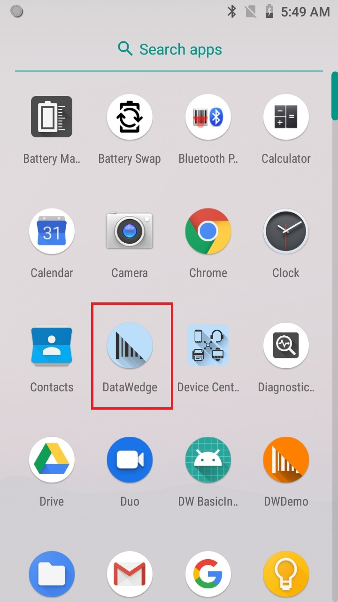
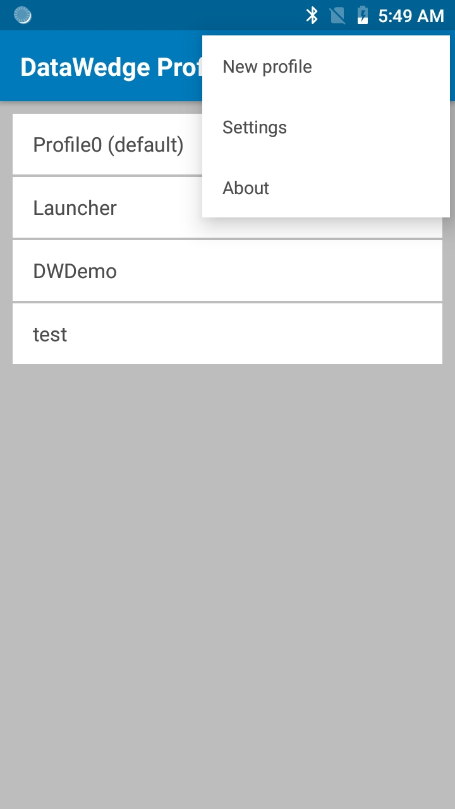
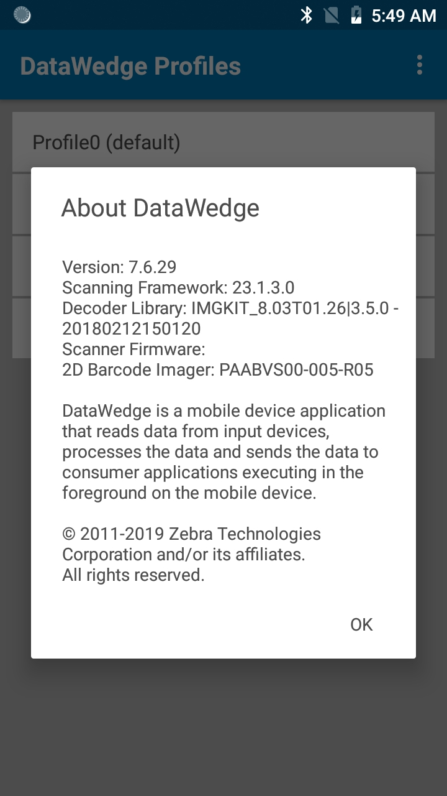

## Overview

DataWedge provides the capability for any application on the device to acquire data from various input sources (such as barcode scanner, MSR, RFID, voice, and serial port) and manipulate the data as needed based on simple options or complex rules. Available out-of-the-box with every Zebra Android device, DataWedge can easily be configured to automatically provide data capture services within any particular app; to use a particular scanner, reader or other peripheral device; and to properly format and transmit data to the right app.

There are 3 approaches to capture data:
* **Zero-code** - eliminates the need for any programming or app modification by capturing and processing data with the use of [DataWedge profiles](../profiles) configured from the user interface.
* **Minimal code** - basic method to retrieve data from intents (commonly used with general Android programming) with the use of a broadcast receiver without the need for finer control of scanning activity or data processing. Refer to [basic intent sample app](../samples/basicintent1).
* **[DataWedge APIs](../api)** - programmatically control, modify and query the DataWedge configuration settings and operations through Android intents without concern of the underlying hardware. 

Follow the [Get Started](../gettingstarted) guide, which discusses both approaches and includes a programmer's guide on common use cases and best practices.

<b>Important information about NextGen SimulScan:</b>  Major SimulScan capabilities are being migrated to the internal scanning framework accessible through DataWedge and <b><a href="../api">DataWedge intent APIs.</a></b> These capabilities formerly available only through SimulScan will be accessible without licensing. They are supported on <a href="../input/barcode#bluetoothscanners">certain Bluetooth scanners</a> and all Zebra devices with built-in imager and/or camera running Android 8.x Oreo and higher. Major SimulScan features being transitioned are: 
&nbsp;&nbsp;&nbsp;<b>• Multibarcode -</b> Options currently available are <b><a href="../input/barcode#basicmultibarcodeparams">Number of barcodes per scan</a></b> (setting a fixed quantity of barcodes to scan), <b><a href="../input/barcode#basicmultibarcodeparams">Instant Reporting</a></b> (instantaneously reporting unique barcodes within a scanning session) and <b><a href="../input/barcode#basicmultibarcodeparams">Report decoded barcodes</a></b> (reporting decoded barcodes in a single scan session). Multibarcode is enabled through the <b>Scanning Modes</b> option in <b><a href="../input/barcode#scanningmodes">NextGen SimulScan configuration</a></b>. 
<!--  // **TUT-40275 - OCR and Signature Capture not part of NGSS**
&nbsp;&nbsp;&nbsp;<b>• OCR A/B -</b> <a href="../input/barcode#ocra">OCR A</a> and <a href="../input/barcode#ocrb">OCR B</a> decoder support added since DataWedge 7.5. 
&nbsp;&nbsp;&nbsp;<b>• Image Capture -</b> <a href="../input/barcode#decodersignature">Decoder Signature</a> (aka Signature Capture) support added since DataWedge 7.3. Other Image Capture features to be transitioned later in 2020. -->
&nbsp;&nbsp;&nbsp;<b>• Document Capture -</b> Scan a document based on a custom <a href="../input/barcode#documentcapturetemplate">document capture template</a>. 
See <a href="/simulscan/1-1/guide/alert">Simulscan Migration Alert</a> for more information.

**[Profiles and Plug-ins](../profiles)** form the basis of most DataWedge functionality. Profiles include all the information about how DataWedge should behave when providing scanning services for a particular application. Much of that information comes from Plug-ins, which determine how the data will be input, processed and output.

Each Profile generally contains four elements: 
* **An Input Plug-in -** to determine how data will be acquired (i.e. a barcode scanner)
* **A Process Plug-in -** to specify how the acquired data should be manipulated 
* **An Output Plug-in -** to control the passing of data to an application
* **An associated application -** (or activity) with which to link DataWedge actions

When associated with an app, DataWedge can be invoked to scan and acquire the data, format or append it in a specified way, and pass it to the associated app when the app comes to the foreground. DataWedge also includes Profile0, which works with any unassociated application that comes to the foreground. Profile0 contains baseline settings that can be tailored to suit individual needs. This allows DataWedge to be used out of the box with little or no setup. 
 
**Important:** 
* **Control of barcode scanning hardware is exclusive**. When DataWedge is active, Scanner and Barcode APIs of apps such as Enterprise Browser and others will be inoperative. Likewise, when an app such as Enterprise Browser controls the scanning hardware, other apps (including DataWedge) are locked out. It is therefore important to understand how to take control of a device's scanner hardware and, if necessary, release it to other apps when scanning is complete. For more information, see the section on **[disabling DataWedge](../settings/#disabledatawedge)**. 
* **Delay in scanning after a device reboot**. DataWedge requires a brief period of time to initialize after device reboot due to waiting for a response to be received from the initialization of the scanning subsystem, causing scanning to be inactive from DataWedge during this time frame.

>**Note**: The appearance of sample app screens displayed throughout this guide can vary by DataWedge version, Android version, and screen size.

<!--
DataWedge provides “zero-code” barcode scanning and processing services for Zebra devices running Android with the use of profiles. Included with every Zebra device, DataWedge enables all apps on the device (whether stock or added later) to acquire scanned data without using scanner APIs directly. DataWedge can be easily configured to automatically provide scanning services whenever a particular app is launched; to use a particular scanner, reader or other sensor; and to manipulate acquired data according to simple options or complex rules. 

When programmatic control is required, [DataWedge APIs](../api) provide the ability to control, modify and query the DataWedge configuration settings and operations through Android intents. This allows new or existing Android apps to be easily modified with an organization's current development resources to acquire data using Zebra devices. 

To learn more about DataWedge APIs, read [DataWedge APIs - Benefits & Usage Scenarios](https://developer.zebra.com/community/home/blog/2017/06/27/datawedge-apis-benefits-challenges) by Zebra engineer Darryn Campbell. 
-->

-----

### Main Functionality
DataWedge provides the following primary functions and options (feature availability may vary by version - refer to [Version History](./#recentversionhistory)): 
#### Data Capture
* Scan and process all [major barcode symbologies](../input/barcode/#decoderselection)
* Use existing apps to [acquire barcodes](../input/barcode), images, text, phone numbers, mag-stripe and other data
* Set DataWedge to [acquire scanned data for one or multiple apps](../gettingstarted)
* Read RFID (radio-frequency identification) tags with [RFID Input](../input/rfid)
* Use voice capture to acquire data with [Voice Input](../input/voice)
* Use a [magnetic stripe reader (MSR)](../input/msr) to capture data
* Acquire multiple types of data in a single scan [using SimulScan](../input/simulscan) 
* Designate device screen areas as scan triggers using [Data Capture Plus](../input/dcp)
* [Create Profiles](../overview) to implement DataWedge features for individual apps 
* Configure DataWedge to [automatically scan with external Zebra peripherals](../input/barcode/#autoswitchtodefaultonevent): 
	* [USB SSI scanners](../input/barcode/#usbssiscanners)
	* [Bluetooth scanners](../input/barcode/#bluetoothscanners)
	* [Serial scanners](../input/serial)

#### Data Processing
* [Enable/Disable decoding](../input/barcode/#decoderselection) of individual symbologies to improve speed
* [Set parameters](../input/barcode) for individual barcodes, scanners and readers
* Format output according to [simple](../process/bdf/) or [custom](../process/adf/) rules
* Use [Plug-ins](../profiles) for data input, output and processing
* [Create custom string handling](../process/adf/#settingcriteria) and other processing criteria

#### Deployment
* [Import and export settings](../settings) 
* Remotely configure and [mass-deploy settings](../settings/#massdeployment) via MDM  
* [Restore settings](../settings/#restoredefaults) to factory defaults
* [Apply changes remotely](../settings/#autoimport) to update devices in the field 
* [Generate reports](../settings/#reporting)

**Note**: Availability and operation of DataWedge features varies by device and operating system (which determine the DataWedge version installed on the device). 

> Ready to get started? Go to the [DataWedge Get Started guide](../gettingstarted).

-----

### Supported Devices

Supported scanners and imagers:

* DS2278
* DS3608
* DS3678
* DS8178
* LI3608
* LI3678
* RS507
* RS4000
* RS5000
* RS5100
* RS6000

-----

### Multi-User Support

DataWedge supports the use of multiple Android user accounts on a single device, enabling separate user profiles to maintain data privacy. The supported Zebra devices are:
* Android Oreo: TC52/TC57, TC72/TC77

Features and functionality:
* **If DataWedge is enabled, its functionality applies only for the active user** - Each user has a separate DataWedge process running. DataWedge usage and functionality only applies for the active user.
* **Any DataWedge profile change takes into effect globally across all users** - A DataWedge configuration or profile change by a user (through DataWedge UI or profile import) applies to all users regardless of which user is logged in when the change is made. For example, if User A makes a change to a profile, User B sees the change in the same profile. The configuration file is stored in a location (by default /enterprise/device/settings/datawedge/config/datawedge.db) where the DataWedge process across all users utilize the same configuration file.
* **Camera scanning functions only for the primary (admin) user** - Camera scanning is not available for secondary (non-primary) users. 
* **Bluetooth scanner disconnects when switching between primary user and other users** - This applies to profiles which have a Bluetooth scanner enabled. If the primary user is active, when switching to a different user with an active profile that also enables a Bluetooth scanner, the Bluetooth scanner disconnects and does not automatically re-connect to the device. The non-primary user needs to press the reset button on the Zebra Bluetooth scanner to reconnect, even if it shows that the Bluetooth scanner is connected to the device. 
* **No external SD card access** - If multiple Android user accounts exist, users cannot access the external SD card. This prevents the ability to export or import the Datawedge configuration database files from the SD card. 
* **Limited folder access** - Each user profile has its own folder structure that is not accessible from a different user. Therefore, a user cannot access the exported DataWedge configuration database of another user, preventing the ability to import/export configurations across users.

-----

### Language Support

DataWedge has been approved to run on device operating systems localized for the following languages:

* English
* French
* German
* Italian
* Spanish
* Simplified Chinese
* Traditional Chinese

For more information about approved languages or to download a localized operating system, please [contact Zebra Technical Support](https://www.zebra.com/us/en/about-zebra/contact-zebra/contact-tech-support.html).

-----
## New in DataWedge 8.1

* [Secure access to DataWedge Intent APIs](../programmers-guides/secure-intent-apis) to prevent unauthorized use of the APIs.

-----
## Recent Version History

### Added in DataWedge 8.0
* **Support for Unique Device Identification (UDI) barcodes** has been temporarily suspended for devices running Android 10 and later. UDI support will be restored via a LifeGuard patch for Android 10 to be released in Q3 2020.
* New secure Intent Output with [Component Information](../output/intent/#intentoutputsetup) and new corresponding [SetConfig API parameter](../api/setconfig/#intentoutputparameters).
* New option to use [DataWedge content provider](../output/intent/#intentoutputsetup) in Intent Output to scan large data, such as images, with new corresponding [SetConfig API parameter](../api/setconfig/#intentoutputparameters) and [Use Content Provider Programmer's Guide](../programmers-guides/content-provider).
* New [NextGen SimulScan Configuration](../input/barcode/#nextgensimulscanconfiguration) replacing legacy SimulScan features, license required for [Zebra Professional-series devices](../licensing).
* Import [NextGen SimulScan Templates](../admin) for document capture.
* New [Press and Continue](../input/barcode/#readerparams) Aim Type for Barcode Input and corresponding new [SetConfig API parameter](../api/setconfig/#otherscannerinputparameters).
* New [Inventory State](../input/rfid/#rfidinput) and [Hardware Key](../input/rfid/#rfidinput) RFID input options.

### Added in DataWedge 7.6
* Added [Dutch Postal 3S](../input/barcode) and [Finnish Postal 4S](../input/barcode) decoder support.
  * Set [Finnish Postal 4S](../api/setconfig/#scannerinputparameters) and [Dutch Postal 3S](../api/setconfig/#scannerinputparameters) with SetConfig API.
* New [Report Decoded Barcodes](../input/barcode/#multibarcodeparams) option for MultiBarcode decoding. 
* **RFID input is disabled in [Profile0](../overview#profile0),** DataWedge's default generic profile. Previously it was enabled by default.
* Improved look and feel of user interface. Refer to [Settings](../settings) and [DWDemo](../samples/dwdemo).
* **Image Capture Mode** option from **Reader Params** is removed due to changes in the scanner framework.
* **Support for SimulScan API is deprecated -** SimulScan support will be removed from DataWedge beginning with Android 10 Q device support.

### Added in DataWedge 7.5
* Increased supported data size and maximum number of supported barcodes for **[MultiBarcode](../input/barcode#multibarcodeparams).**
* New **[RFID Input parameters](../input/rfid)** that include Link Profile, Dynamic Power, Pre filters, and Post filters.
* Added support for **[OCR A](../input/barcode#ocra)**, **[OCR B](../input/barcode#ocrb)**, **[MICR E13B](../input/barcode#decoderselection)** and **[US Currency](../input/barcode#decoderselection)** decoders and corresponding **[OCR parameters](../input/barcode#ocrparams)** for optical character recognition decoding.
* New **[secure Remote Administration](../admin)** using CSP (Configuration Service Provider) for mass deployment.
* New **[Presentation Mode parameters](../input/barcode)** to adjust sensitivity levels.
* New **[voice commands](../input/voice)** to navigate within the foreground app or issue specific key presses: TAB, ENTER, NEXT, PREVIOUS, ESC, CLEAR.
* Deprecated "voice_enter_command" (replaced by "voice_command_enter_enabled") and "voice_tab_command" (replaced by "voice_command_tab_enabled") [voice input parameters](../input/voice).

### Added in DataWedge 7.4
* **New [Enterprise Keyboard Configuration](../utilities/ekb) feature introduced in DataWedge 7.4.44.**
* **DataWedge 7.5 and later versions only support Android Oreo (v8.0) and later.**
* Introduced **voice capture activation by PTT** (push-to-talk) button with new [Data capture start option](../input/voice).
* Added new **[DPM support](../input/barcode#readerparams)** for barcode reader and [SetConfig](../api/setconfig) API.
* **Enterprise Keyboard** option visible in the DataWedge profile screen is an upcoming feature for future use. 

### Added in DataWedge 7.3
* Added support for new **[Grid Matrix decoder](../input/barcode).**
 * Set **[Grid Matrix decoder parameters](../api/setconfig/#scannerinputparameters)** with SetConfig API.
* New **[Decoder Signature](../input/barcode/#decoderselection)** feature added to capture a special formatted area (e.g. signature) as an image. 
 * New **[Signature Capture sample](../samples/signaturecapture)** app.
* New **[Key Event Options](../output/keystroke)** added for Keystroke output.
 * **[Keystroke output parameters](../api/setconfig/#keystrokeoutputparameters)** can be toggled by using SetConfig API.
* **[Rear camera support](../input/barcode)** added for Digimarc decoding.
* **[DS8178 Bluetooth Scanner](../input/barcode)** now supported.
* New **[Febraban decoder parameter](../input/barcode)** supported for I2of5.
* New **[Instant Reporting parameter](../input/barcode)** for MultiBarcode scanning mode.
* New SimulScan option to deliver **[images as files](../input/simulscan).**
* **New in DataWedge 7.3.22:** New **[RFID Input plugin](../input/rfid)** feature to read RFID tags.

### Added in DataWedge 7.2
* New **[Decode Screen Notification](../input/barcode/#scanparams)** parameters added for deocde screen time and translucency level.
* Added new **[DotCode decoder](../input/barcode/#decoderselection)** support.

### Added in DataWedge 7.1
* New **[Decode Screen Notification](../input/barcode/#scanparams)** support added for decode feedback in Scan Params.
* **[Voice Input](../input/voice)** for voice-to-data capture officially released (non-beta). 
* New **[End Detection Timeout](../input/voice/#configuration)** option for Voice Input.
* New **[Multi-User Support](#multiusersupport)** for multiple Android user profiles.
* New **[SEND_RESULT](../api/resultinfo)** result code for multiple plugins.
* New **Hardware Trigger** feature to toggle the hardware trigger for [barcode input](../input/barcode#hardwaretrigger) and [Simulscan input](../input/simulscan). 
* New **[Simulscan Trigger Mode](../api/switchsimulscanparams)** to programmatically toggle hardware trigger in simulscan input 
* New SET_CONFIG/GET_CONFIG parameters for:
 * **[Data Capture Plus (DCP)](../api/setconfig/#datacaptureplusdcpinputparameters)**
 * **[Simulscan](../api/setconfig/#simulscaninputparameters)**
 * **[Magnetic Stripe Reader (MSR)](../api/setconfig/#setmsrinputconfiguration)**
 * **[IP Output](../api/setconfig/#setipoutput)**
 * **[Multiple modules (full profile)](../api/setconfig/#setconfigurationformultiplemodulesfullprofileinasingleintent)** using a single intent
 * **[New Tokens for UDI data output](../api/setconfig/#tokenparameters)**
  * **[Barcode Trigger Mode](../api/setconfig)** to toggle the hardware trigger mode for barcode inputs

### Added in DataWedge 7.0
New updates are identical to DataWedge 6.9.
* New **[Voice Input (beta)](../input/voice)** for voice-to-data capture. 
* New **[Global Scanner Configuration](../input/barcode#globalscannerconfiguration)** enables a generic scanner configuration to apply to all supported scanners.
* New **[Character Set Configuration](../input/barcode/#charactersetconfiguration)** provides options to make adjustments with the decoder character set for barcode input.
* Updated **[Decoder Selection](../input/barcode/#decoderselection)** now supports:
 * GS1 Datamatrix
 * GS1 QRCode
* Added support for [DS2278 Bluetooth Scanner](../input/barcode/#bluetoothscanners).

####Other Changes
* Improved layout for **[SET_CONFIG API](../api/setconfig/#scannerinputparameters)** scanner input parameters.

### Added in DataWedge 6.9
* New **[Voice Input (beta)](../input/voice)** for voice-to-data capture. 
* New **[Global Scanner Configuration](../input/barcode#globalscannerconfiguration)** enables a generic scanner configuration to apply to all supported scanners.
* New **[Character Set Configuration](../input/barcode/#charactersetconfiguration)** provides options to make adjustments with the decoder character set for barcode input.
* Updated **[Decoder Selection](../input/barcode/#decoderselection)** now supports:
 * GS1 Datamatrix
 * GS1 QRCode
* Added support for [DS2278 Bluetooth Scanner](../input/barcode/#bluetoothscanners).

####Other Changes
* Improved layout for **[SET_CONFIG API](../api/setconfig/#scannerinputparameters)** scanner input parameters.

-----

### Added in 6.8

* **[Scanner auto-switching](../input/barcode/#autoswitchtodefaultonevent) behavior is now controllable** after connecting and disconnecting external scanners
* **[DataWedge Settings](../settings/#datawedgesettings) allows disabled Profiles to be ignored** to help maintain full functionality at all times 
* New **[SET_IGNORE_DISABLED_PROFILES API](../api/setignoredisabledprofiles)** configures DataWedge to avoid switching to Profiles are are not enabled. 
* New **[GET_IGNORE_DISABLED_PROFILES API](../api/getignoredisabledprofiles)** returns the status of the IGNORE_DISABLED_PROFILES flag. 
* Updated **[SET_CONFIG API](../api/setconfig)** now supports: 
 * Advanced Data Formatting
 * Digimarc decoding
* New **[SWITCH_SIMULSCAN_PARAMS API](../api/switchsimulscanparams)** enables runtime changes to SimulScan parameters 
* **Automatic Profile importing is enhanced** to improve reliability and reduce extra coding 

#### Other changes

The SimulScan Input Plug-in default template is now "Default - Barcode4.xml" 

-----

### Added in v6.7

* **This version supports devices running Android Lollipop and higher only**. 

* **Supports [multi-barcode input](../input/barcode/#readerparams)** for simultaneous acquisition of more than one barcode at a time.  

* **Enhanced [inter-character delay](../output/keystroke/#keystrokeoutputsetup) function** allows a delay to be specified for all characters or for multi-byte characters only.  

* **AimType now supports [Press and Sustain](../input/barcode/#readerparams)** function continues a decode session until the Beam Timer is expired, barcode is decoded or the read is canceled.  

* **A [Dynamic Templates parameter](../input/simulscan)** allows the number of barcodes to be specified (from 1-99) for decoding on a form when using SimulScan Dynamic Templates.

* **A new [IMPORT_CONFIG API](../api/importconfig)** allows Config and Profile settings files to be imported using an intent. 

-----

### Added in v6.6

* **New [serial input options](../input/serial) allow DataWedge to specify communications parameters for a scanner or other device connected to a serial port and used to acquire data**.

* **[Import Reporting](../settings/#reporting) displays the results of imported databases and Profiles, allowing administrators to easily identify source/destination differences and make adjustments to compensate**.

* **A new [SET_REPORTING_OPTIONS](../api/setreportingoptions) API provides control of Reporting features with intents**. 

* **The [SET_CONFIG](../api/setconfig) API now configures multiple plug-ins with a single intent action**. 

* **The [SWITCH_SCANNER](../api/switchscanner) API now supports friendly device names with a new extra**. 

-----

### Which Version is Installed? 

**To determine which DataWedge version is installed on a device**:

<!--

_Launcher icon for DataWedge 3.x_
 
-->

&#49;. On the device, locate and **tap the DataWedge icon** in the Launcher screen or App Drawer: 

_Launcher icon for DataWedge 6.x_
 

&#50;. **Tap the "hamburger" menu**. The DataWedge menu appears: 

 

&#51;. **Tap About**. The "About DataWedge" screen appears. The DataWedge version number is highlighted in the image below. Notice that the Scanner Framework version also is shown.     

_The "About DataWedge" box showing version numbers_ 
 

&#52;. If the DataWedge version on the device is different than that of this guide, [return to the Techdocs tile page](../../../../) and select the appropriate version from the drop-down menu in the DataWedge tile.

It also might be helpful to visit the [Zebra support site](https://www.zebra.com/us/en/sitesearch.html?q=integrator%20guide) and download a device-specific Integrator Guide for reference. 

<!--
#### Download an Integrator Guide
For each of its devices, Zebra publishes an Integrator Guide containing information specific to that device. For products that include DataWedge, **the Integrator Guide includes a chapter covering only those DataWedge capabilities available on the device**. A search for the term "integrator" at the [Zebra Support Portal](https://portal.motorolasolutions.com/Support/US-EN/Search?searchType=simple&searchTerm=integrator) yields a result similar to the image below. Narrow the seach by adding the device model. 
 
 

_The Zebra Support Central site showing search results for the search term "integrator_" 
 

#### Update DataWedge (Windows only)
**DataWedge is part of the device OS image** and relies on specific components built into that image. It cannot be downloaded separately or updated without also updating the entire device, a process that **can result in loss of user data and/or user-installed applications**. It should therefore be considered only after all other options have been eliminated. **Zebra recommends consulting with a Zebra partner before upgrading a device OS image**. 

**This option is not available for Android devices**. 
-->

-----

Related Guides: 

* [DataWedge Get Started guide](../gettingstarted)
* [DataWedge Demo app](../samples/dwdemo)
* [Profile Overview](../overview) 
* [Profiles/Plug-Ins listing](../profiles)
