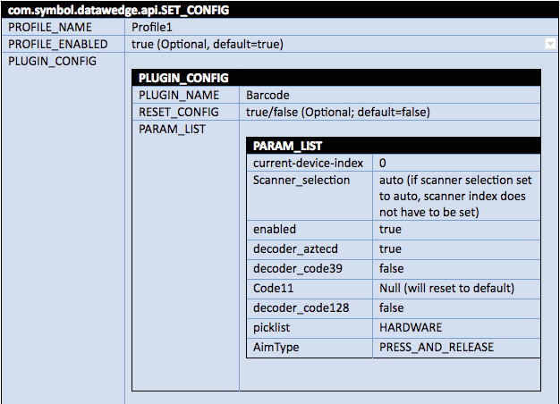

## Overview
DataWedge APIs operate primarily through Android intents--specific commands that can be used by other applications to control data capture without the need to directly access the underlying hardware APIs. This guide describes the functionality of the intents supported by DataWedge and their effects on data capture and DataWedge Profiles and settings. 

In DataWedge versions prior to 6.2, applications access DataWedge APIs by broadcasting an intent, and use the primary pieces of information in the intent (action and data) to specify which API function to perform. DataWedge 6.2 and later implement intents as extras of an action intent, permitting multiple API calls to be sent as extras using a single intent action. 

**SEE ALSO**:

* **[Using Intents](../../output/intent) -** A brief primer on intents and how to configure DataWedge to use them
* **[DataWedge APIs - Benefits & Usage Scenarios](https://developer.zebra.com/community/home/blog/2017/06/27/datawedge-apis-benefits-challenges) -** by Zebra engineer Darryn Campbell 
* **[Sample DataWedge app](../tutorials) -** Demonstrates how to receive scanned data through an intent

-----

### Requirements
The use of DataWedge APIs requires experience with Java programming and familiarity with [Android Intents](https://developer.android.com/reference/android/content/Intent.html). It also requires knowledge of DataWedge usage, features and terminology. For more information about DataWedge, see the DataWedge [Getting Started Guide](../../gettingstarted) and the [Architecture Overview](../../overview). It also might be helpful to read the DataWedge section of the Integrator Guide included with Zebra devices.

### Sending Intents
The new syntax defined in DataWedge 6.2 permits multiple DataWedge API calls as extras on a single intent action. The syntax is as follows:

	:::java
	// Send multiple intents as extras

		Intent i = new Intent();
		i.setAction("com.symbol.datawedge.api.ACTION");
		String[] profiles = {"MainInventory"};
		i.putExtra("com.symbol.datawedge.api.DELETE_PROFILE", profiles);
		i.putExtra("com.symbol.datawedge.api.GET_VERSION_INFO", "");

### Receiving Results
For intents that query DataWedge for information (such as in "GET_ACTIVE_PROFILE"), the app must register to receive the result with a filter that identifies the action and category of the result intent. The code below shows how to register the broadcast receiver to receive the results:

	:::java
	// Register broadcast receiver and filter results

		void registerReceivers() {
		    IntentFilter filter = new IntentFilter();
		    filter.addAction("com.symbol.datawedge.api.RESULT_ACTION");
		    filter.addCategory("android.intent.category.DEFAULT");
		    registerReceiver(mybroadcastReceiver, filter);
		}

	//Receiving the result

		private BroadcastReceiver myBroadcastReceiver = new BroadcastReceiver(){

		@Override
			public void onReceive(Context context, Intent intent){

				Bundle extras = getIntent().getExtras();
				if (intent.hasExtra("com.symbol.datawedge.api.RESULT_GET_ACTIVE_PROFILE")){
					String activeProfile = extras.getString("com.symbol.datawedge.api.RESULT_GET_ACTIVE_PROFILE");

<!--
### APIs Implemented Through Extras

The following APIs can be invoked as extras from a single intent action:

* **[CLONE_PROFILE](../cloneprofile) -** creates a copy of an existing DataWedge Profile wuth settings.
* **[DELETE_PROFILE](../deleteprofile) -** deletes Profile(s) from the device. 
* **[ENABLE_DATAWEDGE](../enabledatawedge) -** switches DataWedge on or off. 
* **[GET_ACTIVE_PROFILE](../getactiveprofile) -** retrieves the name of the Profile currently in use. 
* **[GET_DATAWEDGE_STATUS](../getdatawedgestatus) -** returns the DataWedge state (enabled/disabled). 
* **[GET_PROFILES_LIST](../getprofileslist) -** retrieves a list of DataWedge Profiles on the device.
* **[GET_VERSION_INFO](../getversioninfo) -** gets version numbers of DataWedge and of scanner and SimulScan frameworks on the device. 
* **[RESTORE_CONFIG](../restoreconfig) -** restores a DataWedge configuration to its default settings.
* **[REGISTER_FOR_NOTIFICATION](../registerfornotification) -** tells DataWedge to inform specified app or activity of updates to scanner and/or Profile status. 
* **[RENAME_PROFILE](../renameprofile) -** changes the name of an existing Profile. 
* **[SET_CONFIG](../setconfig) -** create new, or overwrite or update an existing Profile 
* **[UNREGISTER_FOR_NOTIFICATION](../registerfornotification) -** cancels request for app notification.

### APIs Implemented as Actions

The following API calls require a distinct intent action for each: 

* [SoftScanTrigger](../softscantrigger)
* [ScannerInputPlugin](../scannerinputplugin)
* [EnumerateScanners](../enumeratescanners) 
* [SetDefaultProfile](../setdefaultprofile)
* [ResetDefaultProfile](../resetdefaultprofile)
* [SwitchToProfile](../switchtoprofile)

> **DataWedge 6.3 supports current and legacy API syntaxes**. 

-->

**Important: DataWedge API commands are not queued, <u>and might be ignored</u>** if sent while DataWedge is busy processing an earlier intent. When an API command is sent, DataWedge executes the command only if it is not busy doing something else. Exceptions: 

* `STOP_SCANNING` - immediately interrupts a scan operation
* `DISABLE_PLUGIN` - immediately disables the current scanner input plug-in

To help ensure proper execution, Zebra recommends inserting delay code prior to critical commands. See the [SoftScanTrigger](../softscantrigger) API for an example.  

### Nested Bundles
DataWedge 6.3 implements the concept of nested bundles, which allows a "bundle" of values to be included as one value in another bundle. Bundles also can be multiple layers deep. For example, the image below illustrates a `PARAM_LIST` bundle nested within the `PLUGIN_CONFIG[0]` bundle nested within the API call `SET_CONFIG`. Nesting is required to configure with intents the many parameters contained in a Profile.

The image further illustrates that the `SET_CONFIG` API call can implement a second nested bundle, `PLUGIN_CONFIG[n]`, which can contain its own `PARAM_LIST`. 

 

### Example
The Java code below implements a nested bundle. 

	//Using the SET_CONFIG API and a nested bundle.

	:::java
	Bundle bMain = new Bundle();
	bMain.putString("PROFILE_NAME","Profile2");
	bMain.putString("PROFILE_ENABLED", "true");
	bMain.putString("CONFIG_MODE","CREATE_IF_NOT_EXIST");
	bMain.putString("RESET_CONFIG", "true");

	Bundle bundleApp1 = new Bundle();
	bundleApp1.putString("PACKAGE_NAME","com.symbol.emdk.simulscansample1");
	bundleApp1.putStringArray("ACTIVITY_LIST", new String[]{
	        "com.symbol.emdk.simulscansample1.DeviceControl",
	        "com.symbol.emdk.simulscansample1.MainActivity",
	        "com.symbol.emdk.simulscansample1.ResultsActivity.*",
	        "com.symbol.emdk.simulscansample1.ResultsActivity2",
	        "com.symbol.emdk.simulscansample1.SettingsFragment1"});

	Bundle bundleApp2 = new Bundle();
	bundleApp2.putString("PACKAGE_NAME","com.example.intents.datawedgeintent");
	bundleApp2.putStringArray("ACTIVITY_LIST", new String[]{
	        "com.example.intents.datawedgeintent.DeviceControl",
	        "com.example.intents.datawedgeintent.MainActivity",
	        "com.example.intents.datawedgeintent.ResultsActivity",
	        "com.example.intents.datawedgeintent.SettingsFragment1"});

	Bundle bundleApp3 = new Bundle();
	bundleApp3.putString("PACKAGE_NAME","*");
	bundleApp3.putStringArray("ACTIVITY_LIST", new String[]{"*"});

	Bundle bundleApp4 = new Bundle();
	bundleApp4.putString("PACKAGE_NAME","com.symbol.myzebraapp");
	bundleApp4.putStringArray("ACTIVITY_LIST", new String[]{"*"});

	bMain.putParcelableArray("APP_LIST", new Bundle[]{
	        bundleApp1
	        ,bundleApp2
	        ,bundleApp3
	        ,bundleApp4
	});

	Intent i = new Intent();
	i.setAction("com.symbol.datawedge.api.ACTION");
	i.putExtra("com.symbol.datawedge.api.SET_CONFIG", bMain);
	this.sendBroadcast(i);

-----

**Related Guides**:

* [DataWedge APIs](../)
* [DataWedge Demo App](../../demo)

**SEE ALSO**:

[Zebra Support Central](https://www.zebra.com/us/en/support-downloads.html) | Integrator Guides, Product Manuals, Software Downloads and Support

[LaunchPad](https://developer.zebra.com/welcome) | Zebra Developer Community

[Intent](https://developer.android.com/reference/android/content/Intent.html) | Android Developers

[Intents and Intent Filters](http://developer.android.com/guide/components/intents-filters.html) | Android Developers

[Android Intents](http://www.vogella.com/tutorials/AndroidIntent/article.html) | Tutorial
