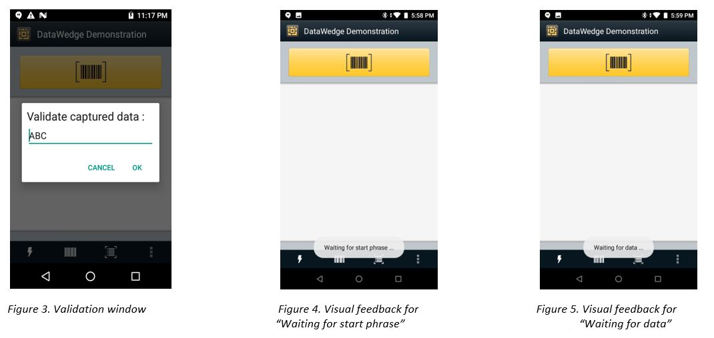

## Overview
Voice Input enables DataWedge to convert spoken entries into keystrokes as if they were typed or acquired from a scan. Voice Input uses the Google speech recognition engine included on GMS devices. Voice-to-data capture can be useful in cases when a barcode is wet, damaged, covered with stray markings or otherwise cannot be scanned. 

Voice Input options:
* Begin voice capture with a defined start phrase or PTT button
* Terminate voice capture with a phrase or timeout value
* Set voice commands to navigate within the foreground app or issue specific key presses: TAB, ENTER, NEXT, PREVIOUS, ESC, Clear.
* Limit returned data to alpha or numeric characters
* Play an audio prompt when waiting for a start phrase or data capture
* Validate spoken data, edit acquired data as needed
* Works offline

>This feature is supported only on Zebra Android Nougat and Oreo GMS devices.

Watch the DevTalk presentation on DataWedge Voice Input:

<iframe width="430" height="308" src="https://www.youtube.com/embed/Hp_Z24WSrUg" frameborder="0" allow="accelerometer; autoplay; encrypted-media; gyroscope; picture-in-picture" allowfullscreen></iframe> 

## Version History
* **DataWedge 7.5** - New voice commands to navigate within the foreground app or issue specific key presses.
* **DataWedge 7.4** - Introduced voice capture activation by PTT (push-to-talk) button with new **Start option voice input** parameter for DataWedge Intent API.

##How it Works

Voice Input relies on DataWedge profiles for configuration. Ensure that the application to receive the voice captured data is associated to the profile. The Voice Input section in the profile provides the options that control the voice data capture. See _Main Features_ section below.

Voice data capture is activated either by a pre-defined start phrase or by pressing the PTT button. When running, Voice Input is placed in the state "waiting for start phrase" (_see Figure 8_). Voice data capture begins after speaking the predefined "start phrase", which then changes the state to "waiting for data" (_see Figure 9_). Voice capture stops when the timeout value elapses after speaking the data or after speaking an optional "end phrase", if defined. The data source can be identified as voice input to process the voice data according to any application requirements. Barcode scanning and voice input can exist in the same DataWedge profile so both data capture methods may be used interchangeably.

Watch a demo on the basics of Voice Input with DWDemo app:  
<iframe width="300" height="613" src="https://www.useloom.com/embed/92684a9ded8e44eca2a08cd4472d1fa3" frameborder="0" webkitallowfullscreen mozallowfullscreen allowfullscreen></iframe>

Watch a demo showcasing the **Send Enter** command for multiple field entries:  

<iframe width="300" height="632" src="https://www.useloom.com/embed/e351721223ec4b3b96e0a383cd392fdf" frameborder="0" webkitallowfullscreen mozallowfullscreen allowfullscreen></iframe>

##Main Features

Voice Input features are accessible from the DataWege profile.

<table>
  <tr>
    <td></td>
    <td>&nbsp; &nbsp; &nbsp;</td>
    <td></td>
  </tr>
</table>
<i>Figure 1 & 2. Voice input settings</i>

* **Enabled** - Enables voice input. 

* **Data capture start option** - Select trigger option for voice capture.
<ul style="margin-left: 16px;">
  <li><b>Start phrase</b> - Sets a start phrase to trigger voice capture. Start phrase is specified in option <b>Data capture start phrase</b>.</li>
  <li><b>PTT button</b> -  Sets PTT button to trigger voice capture. <i>Only supported on EC30, MC93, TC52/TC57, TC72/TC77, and TC8300 devices. For other devices, the PTT button may be mapped to an available button on the device.</i> </li>
</ul>

* **Data capture start phrase** - Specified phrase to start the data capture if **Start phrase** is selected as the **Data capture start option**. Numbers and special characters are not supported as part of the start phrase. _The default value is "start."_

* **Data capture end phrase** - Optional phrase that ends the data capture. There is no default value. 

* **End detection timeout** - Sets the timeout value (in seconds) for the data capture during the “waiting for data” state. If the value is set to "0" and the end phrase is defined, it waits infinitely for the data capture. Whereas, when the end phrase is not defined, data is returned immediately. This timeout is approximate, as it may encounter a 1 to 2 second delay. _The default value is "0."_ 

* **Voice commands** - Configure and set voice commands to navigate a foreground application. Commands are supported only when the device is in the "waiting for start phrase" or "press and hold PTT button to speak data" states. 
<ul style="margin-left: 16px;">
  <li><b>Tab command</b> - Sends a tab key event when speaking the specified phrase. </li>
    <ul>
      <li><b>Enabled</b> – Enable/disable the tab command.</li>
      <li><b>Phrase</b> - Sets the command phrase to send a tab key. The default phrase is "send tab.” </li>
    </ul>
  <li><b>Enter command</b> - Sends an enter key event when speaking the specified phrase.</li>
    <ul>
      <li><b>Enabled</b> – Enable/disable the enter command.</li>
      <li><b>Phrase</b> - Sets the command phrase to send an enter key. The default phrase is "send enter.</li>
    </ul>
  <li><b>Move next command</b> - Move to the next input field when speaking the specified phrase. </li>
    <ul>
      <li><b>Enabled</b> – Enable/disable the move next command.</li>
      <li><b>Phrase</b> - Sets the command phrase to move to the next input field. The default phrase is “move next.”</li>
    </ul>
  <li><b>Move previous command</b> - Move to the previous input field when speaking the specified phrase. </li>
    <ul>
      <li><b>Enabled</b> - Enable/disable move previous command </li>
      <li><b>Phrase</b> - Sets the command phrase to move to the previous input field. The default phrase is “move previous.” </li>
    </ul>
  <li><b>Escape command</b> - Send the escape (ESC) key when speaking the specified phrase. </li>
    <ul>
      <li><b>Enabled</b> – Enable/disable escape command </li>
      <li><b>Phrase</b> - Sets the command phrase to send an ESC key. The default phrase is "send escape.” </li>
    </ul>
  <li><b>Clear command</b> - Clear the current input field in focus when speaking the specified phrase. </li>
    <ul>
      <li><b>Enabled</b> – Enable/disable the clear command.</li>
      <li><b>Phrase</b> - Sets the command phrase to clear the field. The default phrase is “clear.” </li> 
    </ul>
</ul>

* **Data type** - Configures the data type to be returned, with selections of: Any, Alpha, or Numeric. The data type is required to restrict data captured according to the preferences. 
Data type selections:
<ul style="margin-left: 16px;">
  <li><b>Any</b> - All scanned data is returned. For example, if the barcode ABC123 is scanned, it will return ABC123 as is. </li>
  <li><b>Alpha</b> - Only alpha characters are returned. For example, if the barcode ABC123 is scanned, it will return ABC only. </li>
  <li><b>Numeric</b> - Only digits are returned. For example, if the barcode ABC123 is scanned, it will return 123 only. </li>
</ul>

* **Start phrase waiting tone** - Controls the start phrase waiting tone. It enables/disables the audio feedback for “waiting for start”, notifying that the device is waiting to start the speech engine in case the toast message notification is missed and there is a change in “waiting for data” state. 

* **Data capture waiting tone** - Controls the data capture waiting tone. It enables/disables audio feedback for “waiting for data”, notifying that the device is waiting to capture data in case the toast message notification is missed. 

* **Offline speech recognition** - Enables offline speech recognition when there is no access to the internet. This uses an offline recognition speech engine to detect the data spoken.

* **Validation window** - Validates the result after speaking, displaying the spoken data and provides for editing the data on the same screen, if needed. This is useful in offline mode, since the results received in this mode might not be accurate.

 
 

> See Limitations below.

##Configuration

###Voice Input Parameters

DataWedge Voice Input can be controlled programmatically with DataWedge APIs. Refer to DataWedge Voice Input Plugin in [Set Config API](../../api/setconfig) to configure the following Voice Input parameters:

<table class="facelift" style="width:70%" border="1" padding="5px">
  <tr bgcolor="#dce8ef" align="center">
    <th>Param Name</th> 
    <th>Param Values</th> 
  </tr>
  <tr>
    <td>voice_input_enabled</td>
    <td>true, false</td>
  </tr>
  <tr>
    <td>voice_data_capture_start_option</td>
    <td>0 - Start phrase (default) 1 - PTT button</td>
  </tr>
  <tr>
    <td>voice_data_capture_start_phrase</td>
    <td>start (default)</td>
  </tr>
  <tr>
    <td>voice_data_capture_end_phrase</td>
    <td>[blank] (default)</td>
  </tr>
  <tr>
    <td>voice_end_detection_timeout</td>
    <td>0-30 (in seconds)</td>
  </tr>
  <tr>
    <td>voice_command_tab_enabled</td>
    <td>true false (default) </td>
  </tr>
  <tr>
    <td>voice_command_tab_phrase </td>
    <td>send tab (default)</td>
  </tr>
  <tr>
    <td>voice_command_enter_enabled</td>
    <td>true false (default) </td>
  </tr>
  <tr>
    <td>voice_command_enter_phrase </td>
    <td>send enter (default)</td>
  </tr>
  <tr>
    <td>voice_command_move_next_enabled </td>
    <td>true false (default) </td>
  </tr>
  <tr>
    <td>voice_command_move_next_phrase  </td>
    <td>move next (default)</td>
  </tr>
  <tr>
    <td>voice_command_move_previous_enabled  </td>
    <td>true false (default) </td>
  </tr>
  <tr>
    <td>voice_command_move_previous_phrase  </td>
    <td>move previous (default)</td>
  </tr>
  <tr>
    <td>voice_command_escape_enabled  </td>
    <td>true false (default) </td>
  </tr>
  <tr>
    <td>voice_command_escape_phrase  </td>
    <td>send escape (default)</td>
  </tr>
  <tr>
    <td>voice_command_clear_enabled  </td>
    <td>true false (default) </td>
  </tr>
  <tr>
    <td>voice_command_clear_phrase  </td>
    <td>clear (default)</td>
  </tr>
  <tr>
    <td>voice_data_type</td>
    <td>0 - Any 1 - Alpha 2 - Numeric</td>
  </tr>
  <tr>
    <td>voice_start_phrase_waiting_tone</td>
    <td>true, false</td>
  </tr>
  <tr>
    <td>voice_data_capture_waiting_tone</td>
    <td>true, false</td>
  </tr>
  <tr>
    <td>voice_validation_window</td>
    <td>true, false</td>
  </tr>
  <tr>
    <td>voice_offline_speech</td>
    <td>true, false</td>
  </tr>
</table>

###Set Voice Input Configuration Sample

Refer to DataWedge [Set Config API](../../api/setconfig).

##Limitations
* Voice Input is validated only with English.
* Offline speech recognition provides lower accuracy levels.
* In GMS Restricted mode with the use of [App Manager's DisableGMSApps action](/mx/appmgr/#action), Voice Input will not work since it relies on Google speech recognition. 
* Do not use Google Assistant while DataWedge Voice Input is in use, as it can lead to undesirable behavior. 
* Providing numbers and other special characters as part of the data capture start phrase is not supported.
* Voice Input is not supported if Enterprise Home Screen (EHS) is in restricted mode. However, enabling all the privilege settings in EHS will reinstate Voice Input in DataWedge.  
* If the PTT (push-to-talk) button is released during voice capture, there can be a 1 to 2 second delay to display the captured data due to the speech engine continually listening at that moment.
* When PTT Express is enabled and running, Voice Input should not be used simultaneously, otherwise it can lead to unexpected behavior.
* When Voice Input is enabled in an active DataWedge profile, the media volume stream is muted via the volume control of the device.

------

**Related guides**:

* [Profiles/Plug-ins](../../profiles)
* [DataWedge APIs](../../api) 