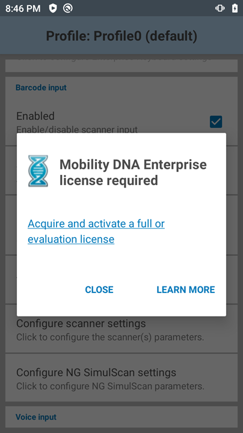

## Overview

For **Zebra Professional-series devices, certain DataWedge features require the purchase of a [Mobility DNA (MDNA) Enterprise license](/licensing/#mdnacomponentsandfeatures).** The DataWedge features that require MDNA license include MultiBarcode and Document Capture as part of NextGen SimulScan. This section discusses DataWedge behavior on licensed and unlicensed Zebra Professional devices.

## Licensed Devices

On Zebra Professional devices with MDNA license, applications with MultiBarcode or NextGen SimulScan enabled do not encounter any issues. MultiBarcode and NextGen SimulScan features continue to work as expected.

## Unlicensed Devices

On unlicensed Zebra Professional devices, applications with MultiBarcode or NextGen SimulScan enabled (using profile configuration or intent APIs) can scan only single barcodes. The use of SWITCH_SCANNER_PARAMS and SET_CONFIG APIs are affected. See the following subsections for more information.

Without a valid MDNA Enterprise license, **Configure NG SimulScan Configuration** cannot be accessed from DataWedge. Instead, the following alert is displayed:

_License required on Zebra Professional devices_

### Using Switch Scanner Params API

On unlicensed Zebra Professional devices, if the app uses SWITCH_SCANNER_PARAMS API to change the "scanning mode" at runtime to MultiBarcode or NextGen SimulScan, error code UNLICENSED_FEATURE is returned. It is required to purchase the MDNA Enterprise license for MultiBarcode or NextGen SimulScan feature support. Otherwise, only single barcode scanning is supported. 

Refer to [MDNA licensing](/licensing) for more information.  

### Using Set Config API

On unlicensed Zebra Professional devices, if the app uses SET_CONFIG API to change the "scanning mode" to MultiBarcode or NextGen SimulScan in a profile, it returns error code UNLICENSED_FEATURE. It is required to purchase the MDNA Enterprise license for MultiBarcode or NextGen SimulScan feature support. Otherwise, the "scanning mode" is set to “Single” in the profile. 

Refer to [MDNA licensing](/licensing) for more information.

## Expired Licenses

On a Zebra Professional device, if the MDNA Enterprise license is expired while using MultiBarcode or NextGen SimulScan, "scanning mode" automatically switches to "Single". DataWedge UI does not allow access to the NextGen SimulScan section and the "scanning mode" is set as “Single”.

Re-applying a valid MDNA Enterprise license re-stores the "scanning mode" back to MultiBarcode or NextGen SimulScan and DataWedge UI is updated accordingly. Configurations do not need to be manually changed and APIs calls are not needed to restore the functionality since it occurs automatically.

Note: After the license is expired, if the "scanning mode" parameter is manually changed to “Single” or “UDI” in the profile configuration, re-applying a valid MDNA license does NOT restore the scanning mode back to the previous configuration of “MultiBarcode” or “SimulScan”.

## Importing DataWedge Configurations 

If a DataWedge profile with MultiBarcode or NextGen SimulScan enabled is imported from a Zebra Enterprise-series device to a Zebra Professional-series device without a valid MDNA Enterprise license, the following behavior occurs:
* **"Scanning mode" is switched to "Single" barcode mode.** In DataWedge UI, "scanning mode" is set to “Single”, even if the imported profile was using “Multibarcode” or “SimulScan”. Applying a valid MDNA enterprise license automatically switches the "scanning mode" back to "MultiBarcode" or "NextGen SimulScan". DataWedge UI also reflects the same scanning mode used on the Zebra Enterprise device.
* **DataWedge does not show any error message during the import process** if any of the profiles are using licensed features.

-----

Related Guides: 

* [Mobility DNA licensing](/licensing) 
* [NextGen SimulScan](../input/barcode/#nextgensimulscanconfiguration) 
