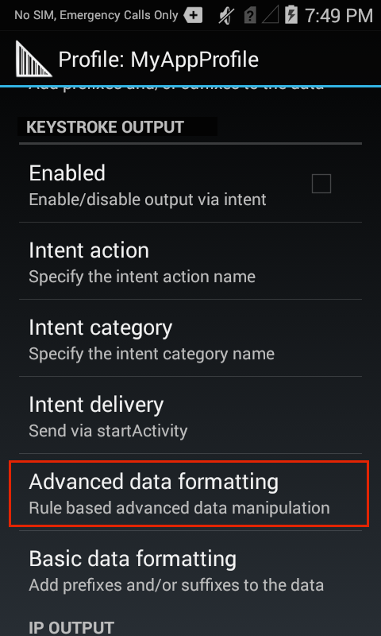
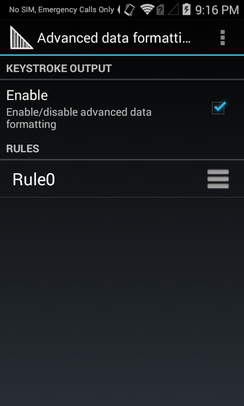
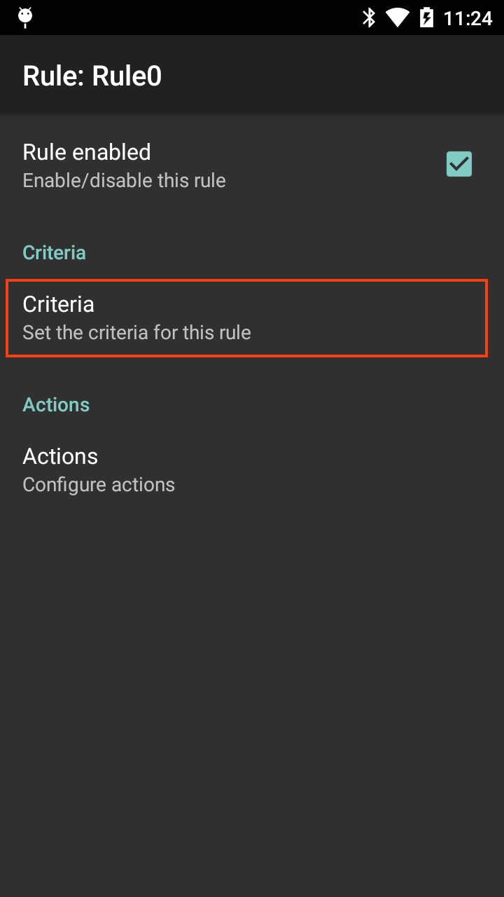
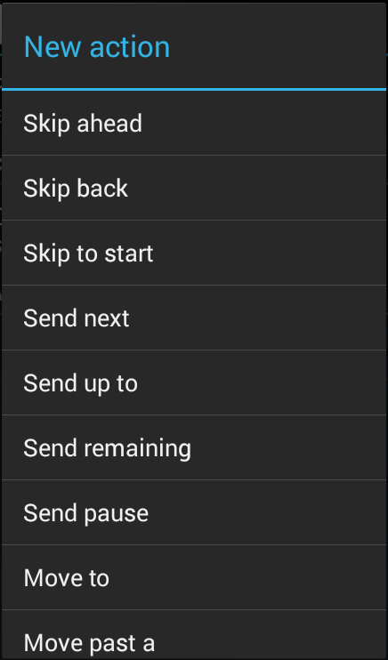
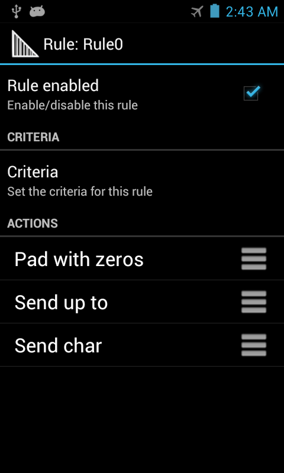

## Overview
**Advanced Data Formatting** permits acquired data to be manipulated based on its contents and/or custom rules configured to trigger (or prevent) actions based on specific criteria. For example, a simple rule can move the cursor ahead four characters or from one text field to another. A complex rule might be created to trigger an action only if the first four digits of an acquired 16-digit number match those of a specific bank. Any number of rules and interdependencies can be created, giving DataWedge the ability to suit virtually any data processing requirement. 

Controls for data processing appear as "Basic Data Formatting" and "Advanced Data Formatting," and are grouped in a Profile's settings panel along with the Output settings: 

 

**See also**: 
* [Basic Data Formatting](../bdf)
* [How DataWedge Profiles work](../../overview)

-----

### ADF Components
Advanced Data Formatting features are implemented through Rules, Criteria and Actions. 

#### Rules
The containers for one or more processing Actions and the user-definable criteria that trigger Action(s). All DataWedge Output Plug-ins can contain one or more ADF rules for the processing of acquired data.

#### Criteria
The triggers for taking a processing Action. Criteria can be set according to input type (i.e. only data from a barcode scanner), Symbology (i.e. only Code39 data), and a specified string within the data (at a specified position in the data string and/or of a specified length). Acquired data not matching all defined criteria will not trigger Action(s). Any or all of the [supported barcode types](../../decoders) can be selected or excluded. 

#### Actions 
A set of procedures for analyzing, identifying and processing acquired data. 

**The four Action types**: 
* **Cursor movement** (i.e. skip the first 10 characters)
* **Data modification** (i.e remove all spaces; pad the left side with four zeros)
* **Data sending** (i.e. output the last four digits)
* **Pause** (i.e. pause 50 ms before executing the next action)

-----

### Creating ADF Rules
Setting up Advanced Data Formatting is done in three basic steps: 

1. Create a Rule
2. Define Criteria to activate the Rule
3. Define the Action(s) to be executed by the Rule

These steps are all carried out within the Advanced Data Formatting Process Plug-in, which is part of every DataWedge Output Plug-in. For further details, see [DataWedge Profiles](../../profiles). 

**To Create an ADF Rule**: 

&#49;. In the Profile that requires ADF, **tap on Advanced data formatting** as highlighted below. A screen appears similar to the image in Step 2.

 

&#50;. **Tap the "hamburger" menu, select New rule** and enter a name for the rule. The new Rule appears with other Rules in the Output Plug-in screen similar to the image in Step 3, below.   

 

&#51;. **Tap the new Rule** to access its settings. A screen appears similar to the image in Step 4.  

 

-----

### Setting Criteria

&#52;. **Tap Criteria** as highlighted below to enter the criteria that will activate the Rule.  

 

&#53;. From the Criteria screen, **enter the criteria that will activate the Rule** based on the options below.  

 

**Action Criteria**:

* **String to check for -** Allows a string to be specified that if present in the acquired data will initiate the action(s) (i.e. output the acquired string). If the specified string is not present at the "Starting position" (see below), the action(s) will not be executed. DataWedge can check for the presence of alphanumeric or control characters. For example:
	* **x -** checks for the character "x"
	* **\xhh -** checks for the character with a hexadecimal value of 0xhh
	* **\uhhhh -** checks for the Unicode character with a value of 0xhhhh

* **String position -** The starting position (starting at 0) at which to check for the string specified in the "String to check for" parameter. For example, the target string "AB" with a string position of 3 would invoke action(s) if the string "123ABC123" is acquired, but would not invoke action if the "AB" was located anywhere else in the string (or was not present). Notice that the "AB" portion of the example string begins at the fourth character from the left, which is position 3 when starting the count from 0.

* **String length -**  An optional parameter that allows a specific length (in characters) to be present before action(s) will be invoked. For example, if scanning U.S. Social Security numbers, a String length of nine (9) might be used as a means of initial validation. 

* **Source criteria -** An optional parameter that can invoke action(s) only when data is acquired by means of a barcode scanner (through which [specific decoders](../../decoders) can be further selected or excluded), or through SimulScan. 
 

&#54;. **Tap the BACK button** to save and return to the Rule screen.

 

-----

### Creating ADF Actions

**To Add an Action**:

&#55;. From the Rule screen, **tap "Actions"** as highlighted below. Then **select New action from the menu on the next screen**. A scrollable list of Actions appears, similar to the image in Step 8.

 

&#56;. **Tap the desired Action in the Actions list**, scrolling as necessary. After tapping an Action, the Rule screen reappears with that Action added to the bottom of the Actions list. For a description of each Action, see the table below. 

 

### Supported ADF Actions
<table rules="all"
width="100%"
frame="border"
cellspacing="0" cellpadding="4">
<caption class="title"></caption>
<col width="22%" />
<col width="22%" />
<col width="55%" />
<thead>
<tr>
<th align="left" valign="top">Type</th>
<th align="left" valign="top">Action</th>
<th align="left" valign="top">Description</th>
</tr>
</thead>
<tbody>
<tr>
<td rowspan="5" align="left" valign="top">
Cursor Movement
</td>
<td align="left" valign="top">
Skip ahead
</td>
<td align="left" valign="top">
Moves the cursor forward by the specified number of characters (default=1)
</td>
</tr>
<tr>
<td align="left" valign="top">
Skip back
</td>
<td align="left" valign="top">
Moves the cursor back by the specified number of characters (default=1)
</td>
</tr>
<tr>
<td align="left" valign="top">
Skip to start
</td>
<td align="left" valign="top">
Moves the cursor to the beginning of the data
</td>
</tr>
<tr>
<td align="left" valign="top">
Move to
</td>
<td align="left" valign="top">
Moves the cursor forward until the string specified in the data field is found
</td>
</tr>
<tr>
<td align="left" valign="top">
Move past
</td>
<td align="left" valign="top">

Moves the cursor forward past the string specified in the data field

</td>
</tr>
<tr>
<td rowspan="12" align="left" valign="top">
Data Modification
</td>
<td align="left" valign="top">
Crunch spaces
</td>
<td align="left" valign="top">
Reduce spaces between words to one and remove all spaces at the beginning and end of the data
</td>
</tr>
<tr>
<td align="left" valign="top">
Stop space crunch
</td>
<td align="left" valign="top">
Disables the last <strong>Crunch spaces</strong> action
</td>
</tr>
<tr>
<td align="left" valign="top">
Remove all spaces
</td>
<td align="left" valign="top">
Remove all spaces in the data
</td>
</tr>
<tr>
<td align="left" valign="top">
Stop space removal
</td>
<td align="left" valign="top">
Disables the last <strong>Remove all spaces</strong> action
</td>
</tr>
<tr>
<td align="left" valign="top">
Remove leading zeros
</td>
<td align="left" valign="top">
Remove all zeros at the beginning of data
</td>
</tr>
<tr>
<td align="left" valign="top">
Stop zero removal
</td>
<td align="left" valign="top">
Disables the previous <strong>Remove leading zeros</strong> action
</td>
</tr>
<tr>
<td align="left" valign="top">
Pad with zeros
</td>
<td align="left" valign="top">
Left-pad data with the specified number of zeros
</td>
</tr>
<tr>
<td align="left" valign="top">
Stop pad zeros
</td>
<td align="left" valign="top">
Disables the previous <strong>Pad with zeros</strong> action
</td>
</tr>
<tr>
<td align="left" valign="top">
Replace string
</td>
<td align="left" valign="top">
Replaces a specified string with a new specified string. Both must be specified.
</td>
</tr>
<tr>
<td align="left" valign="top">
Stop all replace string
</td>
<td align="left" valign="top">
Stop all <strong>Replace string</strong> actions
</td>
</tr>
<tr>
<td align="left" valign="top">
Remove characters
</td>
<td align="left" valign="top">
Remove the number of characters specified in given positions when send actions are executed
</td>
</tr>
<tr>
<td align="left" valign="top">
Stop remove characters
</td>
<td align="left" valign="top">
Stops removing characters from subsequent send actions
</td>
</tr>
<tr>
<td rowspan="6" align="left" valign="top">
Data Sending
</td>
<td align="left" valign="top">
Send next
</td>
<td align="left" valign="top">
Sends the specified number of characters from the current cursor position (default=0)
</td>
</tr>
<tr>
<td align="left" valign="top">
Send remaining
</td>
<td align="left" valign="top">
Sends all data that remains from the current cursor position
</td>
</tr>
<tr>
<td align="left" valign="top">
Send up to
</td>
<td align="left" valign="top">
Sends all data up to the specified string
</td>
</tr>
<tr>
<td align="left" valign="top">
Send pause
</td>
<td align="left" valign="top">
Pauses the specified number of milliseconds (default = 0; max. = 120000) before executing the next action. <strong>Zebra recommends pausing 50 ms after sending any ENTER, LINE FEED or TAB character</strong>.
</td>
</tr>
<tr>
<td align="left" valign="top">
Send string
</td>
<td align="left" valign="top">
Sends the specified string
</td>
</tr>
<tr>
<td align="left" valign="top">
Send char
</td>
<td align="left" valign="top">
Sends the specified ASCII/ Unicode character. The maximum Unicode character value is U-10FFFF (1114111 in decimal)
</td>
</tr>
</tbody>
</table>

**Notes**: 
* **Default Action values are 0, empty or none** unless otherwise noted.
* **To help minimize data loss**, Zebra recommends sending a Pause Action of 50 ms after sending any ENTER, LINE FEED or TAB character.

&#57;. **Repeat Step 8 until all required Actions appear in an Actions list** similar to the image below. Actions execute from top to bottom. To re-order an Action, drag by its "hamburger" icon. **See additional notes and the example, below**.  

_The ADF Rule screen from DataWedge 6.2 (with several configured actions)._
 
 

_The ADF Rule screen from DataWedge 6.2 (with no configured actions)._
 

<!--
Rule0-Actions.png
-->

**Action Notes**: 
* Actions are processed from the top of the list downward to the bottom. 
* To reposition an Action, drag the Action by its handle (to the right of its name). 
* To delete an Action, long-press the Action name. 
* A Pause Action of 50 ms after sending ENTER, LINE FEED or TAB Actions can help minimize data loss.

**Rules Notes**: 
* Once a Rule is enabled (with a check mark in its Rule screen), a Rule will apply whenever its parent Profile is used. 
* All data acquired through the Profile will be processed according to the Actions defined in the Rule before being transferred to the selected Output Plug-in. 
* If no ADF rule is enabled or defined, DataWedge passes decoded data to the Output Plug-in without processing.

### Non-printable Characters
When setting up an ADF data processing rule to find or replace control characters, extended ASCII characters or other non-printable characters, DataWedge supports the use of the **\xNN notation** to specify hex value of the character and **\uNNNN notation** for Unicode values. 

For example, if the captured data contains the Group separator (GS) character (\x1D) and data on either side of the separator must be acquired, the following ADF actions can be added to the ADF rule: 

**To capture the data**: 8100712345(GS)2112345678

**Execute the following Actions**:

* **Send data up to (\x1D)**
* **Skip ahead (1)**
* **Send remaining data**

-----

## ADF Rule Example
The following is an example of the creation process for an Advanced Data Formatting Rule that might be typical for data processing scenarios. 

**Barcode scanning criteria**:
* Barcode: Code39
* Decoded Length: 12 characters
* Starting Position contents: "129" 

**How DataWedge should format the data**:
* Pad all sends with zeros to a length of 8
* Send all data up to character X
* Send a space character

**To create an ADF rule for this example**:
1. Tap **HOME -> DataWedge -> Profile0**.
1. Tap **Advanced data formatting**.
1. Tap **Enable**.
1. Tap **Rule0**.
1. Tap **Criteria**.
1. Tap **String to check for**. In the text box, **enter "129"** and **Tap OK**.
1. Tap **String position**. Change value to 0 and **Tap OK**.
1. Tap **String length**. Change value to 12 and **Tap OK**.
1. Tap **Source criteria**.
1. Tap **Barcode input**.
1. Tap **All decoders enabled** to uncheck and disable all decoders.
1. Tap **Code39** to enable the Code39 decoder only. 
1. Tap **BACK** three times.
1. Under Actions, **tap and hold Send remaining** until a menu appears.
1. Tap **Delete action**.
1. Tap **Menu -> New action**. Select **Pad with zeros**. The Pad with zeros Action appears in the Actions list.
1. Tap the **Pad with zeros** Action.
1. Tap **How many**. Change value to 8 and **Tap OK**.
1. Tap **BACK**.
1. Tap **Menu -> New action**. Select **Send up to**. The Send up to Action appears in the Action list.
1. Tap the **Send up to** Action.
1. Tap **String**. In the text box, **enter "X"** and **Tap OK**.
1. Tap **BACK**.
1. Tap **Menu -> New action**. Select **Send char**. The Send char Action appears in the Action list.
1. Tap the **Send char** Action.
1. Tap **Character code**. In the text box, **enter 32** and **Tap OK**.
1. Tap **BACK**.

The Rule0 screen should appear similar to the image below. 

 

-----

**DataWedge Output options**: 

* **[Keystroke](../../output/keystroke) -** outputs acquired data as if the keyboard was pressed
* **[Internet Protocol](../../output/ip) -** outputs data over a network using TCP or UDP
* **[Intent](../../output/intent) -** delivers data to the app as an intent extra

**Related guides**:
* [Basic Data Formatting](../bdf)
* [DataWedge Profiles](../../profiles)
* [DataWedge APIs](../../api) 
