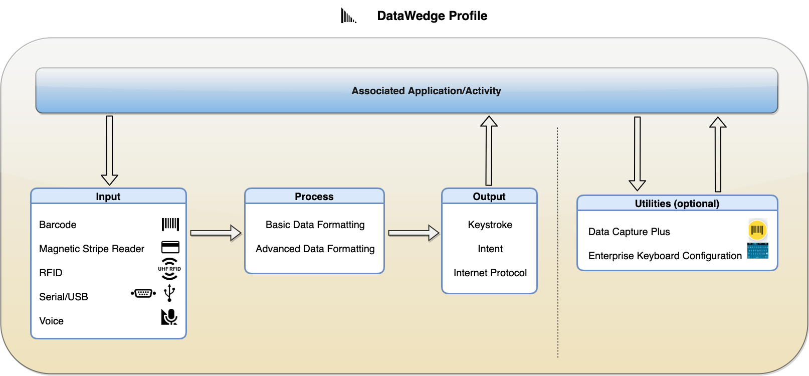

<!--  // Commented out from section above
    - title: Input
      items:
        - title: Barcode
          url: ../input/barcode
        - title: Mag-stripe Reader (MSR) 
          url: ../input/msr
        - title: Radio-frequency Identification (RFID) 
          url: ../input/rfid
        - title: Serial/USB Port
          url: ../input/serial
        - title: SimulScan
          url: ../input/simulscan
        - title: Voice
          url: ../input/voice
    - title: Processing
      items:
        - title: Advanced Data Formatting (ADF)
          url: ../process/adf
        - title: Basic Data Formatting (BDF) 
          url: ../process/bdf
    - title: Output
      items:
        - title: Intent
          url: ../output/intent
        - title: Internet Protocol (IP)
          url: ../output/ip
        - title: Keystroke
          url: ../output/keystroke

    - title: Utilities
      items:
        - title: Data Capture Plus (DCP)
          url: ../input/dcp
        - title: Enterprise Keyboard Configuration
          url: ../utilities/ekb
-->

_<b>A DataWedge Profile and its contents.</b> When the associated app/activity is in the foreground, DataWedge loads the Profile and performs actions to acquire (input), format (process) and deliver (output) the data based on the Profile configurations. Data Capture Plus and Enterprise Keyboard Configuration are separate utilities that perform specific functions to the app/activity. Data Capture Plus enables areas of the screen to behave as a scan trigger. Enterprise Keyboard Configuration enables a custom generated keyboard layout to be displayed in the associated app/activity._
 
 
<b>Main configurations for plugins:</b>
<table class="facelift" align="center" style="width:80%" border="1" padding="5px">
  <tr bgcolor="#dce8ef">
    <th>Plugin</th>
    <th>Type</th>
    <th>Main Configurations (not all-inclusive)</th>
  </tr>

  <tr>
    <td rowspan="5">Input</td>
    <td><a href="../input/barcode">Barcode</a></td>
	  <td>∙ Select scanner: camera, 1D or 2D imager, Bluetooth scanner, etc. ∙ Enable/disable hardware trigger ∙ Select decoders ∙ Set decoder params (options for each decoder) ∙ Set reader params (options for the scanner selected) ∙ Set scan params (scanner specific decoding feedback)</td>
  </tr>
  
  <tr>
    <td><a href="../input/msr">Magnetic Stripe Reader (MSR)</a></td>
	  <td>∙ (Data output is acquired through intents, which DataWedge automatically parses and places into specific tags to be handled by the app)</td>
  </tr>

  <tr>
    <td><a href="../input/rfid">Radio-frequency Identification (RFID)</a></td>
	  <td>∙ Enable/disable hardware trigger ∙ Configure reader settings</td>
  </tr>

  <tr>
    <td><a href="../input/serial">Serial/USB</a></td>
	  <td>∙ Set serial port configuration</td>
  </tr>

  <tr>
    <td><a href="../input/voice">Voice</a></td>
	  <td>∙ Data capture start option: start phrase or PTT button ∙ Specify data capture start phrase ∙ Specify data capture end phrase ∙ Set timeout for data capture ∙ Configure voice commands ∙ Configure data type returned: alpha, numeric, any ∙ Offline speech recognition ∙ Validation window (validate captured data allowing to edit if needed)</td>
  </tr>

  <tr>
    <td rowspan="2">Process</td>
    <td><a href="../process/bdf">Basic Data Formatting (BDF)</a></td>
	  <td>∙ Add prefix ∙ Add suffix ∙ Send as hex ∙ Append TAB key ∙ Append ENTER key ∙ Create custom rule with specific criteria and actions to process acquired data</td>
  </tr>

  <tr>
    <td><a href="../process/adf">Advanced Data Formatting (ADF)</a></td>
	  <td>∙ Create custom rule with specific criteria and actions to process acquired data</td>
  </tr>

  <tr>
    <td rowspan="3">Output</td>
    <td><a href="../output/keystroke">Keystroke</a></td>
	  <td>∙ Inject action key in place of the character: None, Tab, Line feed, Carriage return ∙ Send keystrokes as key events ∙ Send certain key events as a string ∙ Set key event delay</td>
  </tr>

  <tr>
    <td><a href="../output/intent">Intent</a></td>
	  <td>∙ Set intent action ∙ Set intent category ∙ Set intent delivery</td>
  </tr>

  <tr>
    <td><a href="../output/ip">Internet Protocol</a></td>
	  <td>∙ Enable/disable Remote Wedge ∙ Set protocol: TCP or UDP ∙ Set IP address ∙ Set Port number</td>
  </tr>

<tr>
    <td rowspan="2">Utilities (Options)</td>
    <td><a href="../input/dcp">Data Capture Plus (DCP)</a></td>
	  <td>∙ Set location of button to trigger scanning: left side, right side, either side ∙ Set mode to launch DCP: button only, full-screen only, button interchangeable to full screen ∙ Set highest/lowest button position ∙ Set wait time to trigger scanner action after a screen tap</td>
  </tr>

  <tr>
    <td><a href="../utilities/ekb">Enterprise Keyboard Configuration</a></td>
	  <td>∙ Select custom generated layout</td>
  </tr>
</table>