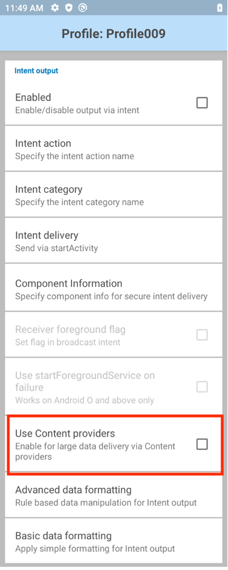

## Overview

**Use content providers** option allows applications to leverage DataWedge's content provider to retrieve scanned data from files larger than 500 KB, such as images, primarily with Signature Capture and NextGen SimulScan. A _content provider_ is an Android app component that encapsulates data to share between apps.

DataWedge's content provider only sends 768 KB (786,432 bytes) of raw data at once through Android's `ContentProvider` class object. If the scanned data exceeds this limit, the remaining data is sent in a subsequent `ContentProvider` object, whose URI is included in the first `ContentProvider`, with the same size limit. The URI is a string used to query a content provider to retrieve the data, containing the provider and path. This process in breaking down the `ContentProvider` into separate parts repeats until the actual file size is reached for the raw scanned data. The client application then needs to concatenate the raw data from all `ContentProviders` to reconstruct the final full raw data object in byte[] form.

## Android Manifest Changes

The following permission must be added to the manifest of the Android application so it can be granted access to the DataWedge content provider:

		<uses-permission android:name="com.symbol.datawedge.permission.contentprovider" />

## Enable Content Provider via DataWedge UI

To enable the content provider option via DataWedge UI, navigate to the **Intent Output** section of the DataWedge profile and enable Intent Output.

_Intent Output_

Then enable the option **Use content providers.**

_Use Content Providers_

## Enable Content Provider via DataWedge Intent API

To enable the content provider option via DataWedge Intent API, use intent key **intent_use_content_provider** with supported value _true_ or _false_.

The following sample code demonstrates how to enable content provider for profile Profile009:

		Bundle bMain = new Bundle();
		ArrayList<Bundle> bundlePluginConfig = new ArrayList<>();
		Bundle bConfigIntent = new Bundle();
		Bundle bParamsIntent = new Bundle();
		bParamsIntent.putString("intent_output_enabled", "true");
		bParamsIntent.putString("intent_use_content_provider", "true");
		bConfigIntent.putString("PLUGIN_NAME", "INTENT");
		bConfigIntent.putString("RESET_CONFIG", "true");
		bConfigIntent.putBundle("PARAM_LIST", bParamsIntent);
		bundlePluginConfig.add(bConfigIntent);
		bMain.putParcelableArrayList("PLUGIN_CONFIG", bundlePluginConfig);

		bMain.putString("PROFILE_NAME", "Profile009");
		bMain.putString("PROFILE_ENABLED", "true");
		bMain.putString("CONFIG_MODE", "CREATE_IF_NOT_EXIST");

		Intent iSetConfig = new Intent();
		iSetConfig.setAction("com.symbol.datawedge.api.ACTION");
		iSetConfig.putExtra("com.symbol.datawedge.api.SET_CONFIG", bMain);
		iSetConfig.putExtra("SEND_RESULT", "LAST_RESULT");

		this.sendBroadcast(iSetConfig);

## Processing Intent Output with Content Provider

When configured to use the content provider, DataWedge first sends the scan data intent based on how it is configured in the Intent Output plugin.

An Intent extra contains a URI for the DataWedge content provider. The application must use the content provider URI to query the data into a `Cursor` object using the `ContentResolver`.

### NextGen SimulScan Sample Code
The following sample code demonstrates how to process scan data with NextGen SimulScan:

		public class MainActivity extends AppCompatActivity {

			public static final String DATA_NEXT_URI = "next_data_uri";
			public static final String FULL_DATA_SIZE = "full_data_size";
			public static final String RAW_DATA_SIZE = "data_buffer_size";
			public static final String DECODE_DATA_EXTRA = "com.symbol.datawedge.decode_data";
			public static final String INTENT_OUTPUT_ACTION = "com.symbol.genericdata.INTENT_OUTPUT";
			public static final String LABEL_TYPE_SIGNATURE = "LABEL-TYPE-SIGNATURE";
			public static final String FIELD_DATA_URI = "com.symbol.datawedge.field_data_uri";
			public static final String DECODED_MODE = "com.symbol.datawedge.decoded_mode";
			public static final String DATA_TAG = "com.symbol.datawedge.data";
			public static final String LABEL_TYPE = "label_type";
			public static final String FIELD_LABEL_TYPE = "field_label_type";
			public static final String DATA_STRING = "field_string_data";
			public static final String DECODE_DATA = "field_raw_data";
			public static final String IMAGE_WIDTH_TAG  =  "field_image_width";
			public static final String IMAGE_HEIGHT_TAG  =  "field_image_height";
			public static final String SINGLE_DECODE_MODE  =  "single_decode";
			public static final String MULTIPLE_DECODE_MODE  =  "multiple_decode";
			public static final String STRING_DATA_KEY  =  "com.symbol.datawedge.data_string";
			public static final String LABEL_TYPE_TAG = "com.symbol.datawedge.label_type";
			public static final String STRING_DATA_KEY_SINGLE_BARCODE  =  "data_string";

			private BroadcastReceiver myBroadcastReceiver = new BroadcastReceiver() {

				@Override
				public void onReceive(final Context context, final Intent intent) {

					try {
						String action = intent.getAction();
						Bundle extras = intent.getExtras();
						
						/* ###### Processing scanned data from Intent output [Start] ###### */
						if (action.equals(INTENT_OUTPUT_ACTION)) {

							Thread dataProcessingThrad = new Thread(new Runnable() {
								@Override
								public void run() {
									Bundle data = intent.getExtras();
									if (data != null) {

										String decodedMode = data.getString(DECODED_MODE);

										/* ###### Processing scanned data when ScanningMode is set as "Single" [Start] ###### */
										if (decodedMode.equals(SINGLE_DECODE_MODE)) {
											processSingleDecode(data);
										}
										/* ###### Processing scanned data when ScanningMode is set as "Single" [Finish] ###### */

										/* ###### Processing scanned data when ScanningMode is set as "SimulScan" [Start] ###### */
										else if (decodedMode.equals(MULTIPLE_DECODE_MODE)) {
											processMultipleDecode(data);
										}
										/* ###### Processing scanned data when ScanningMode is set as "SimulScan" [Finish] ###### */
									}
								}
							});
							dataProcessingThrad.start();

						}
						/* ###### Processing scanned data from Intent output [Finish] ###### */

					} catch (Exception ex) {
						Toast.makeText(context, ex.getMessage(), Toast.LENGTH_SHORT).show();
					}
				}
			};

			private void processSingleDecode(Bundle data)
			{
				String decodeDataUri = data.getString(DECODE_DATA_EXTRA);
				String barcodeData = "";
				//Check if the data coming through the content provider.
				if(decodeDataUri != null) {
					//Data is coming through the content provider, using a Cursor object to extract data
					Cursor cursor = getContentResolver()
							.query(Uri.parse(decodeDataUri), null, null, null);
					if (cursor != null) {
						cursor.moveToFirst();

						String labelType = cursor
								.getString(cursor.getColumnIndex(LABEL_TYPE));
						String dataString = cursor
								.getString(cursor.getColumnIndex(STRING_DATA_KEY_SINGLE_BARCODE));

						barcodeData += "\nLabel type: " + labelType;
						barcodeData += "\nString data: " + dataString;
					}
				}
				else
				{
					//Data is coming through the Intent bundle itself
					String labelType = data.getString(LABEL_TYPE_TAG);
					String dataString = data.getString(STRING_DATA_KEY);

					barcodeData += "\nLabel type: " + labelType;
					barcodeData += "\nString data: " + dataString;
				}

				TextView txtBarcodeData = new TextView(getApplicationContext());
				txtBarcodeData.setText(barcodeData);

				showInUI(txtBarcodeData, null);
				updateStatus("Data processing successful");
			}

			private void processMultipleDecode(Bundle data)
			{
				ArrayList<Bundle> fields = data.getParcelableArrayList(DATA_TAG);
				if(fields == null) //Content provider is not enabled in Intent Output plugin or Scanning mode is not selected as "SimulScan"
				{
					updateStatus("Content provider is not enabled in Intent Output plugin " +
							"or Scanning mode is not selected as \"SimulScan\".\nPlease check and try again");
					return;
				}

				//Iterate through each field
				for (Bundle field : fields) {

					String decodeDataUri = field.getString(FIELD_DATA_URI);
					Cursor cursor = null;
					if(decodeDataUri != null)
						cursor = getContentResolver().query(Uri.parse(decodeDataUri),
								null, null, null);
					if (cursor != null) {
						int imgWidth = 0;
						int imgHeight = 0;
						cursor.moveToFirst();

						String strResultStatusData = "";

						String labelType = cursor.
								getString(cursor.getColumnIndex(FIELD_LABEL_TYPE));

						strResultStatusData += "\nLabel type: " + labelType;
						if (labelType.equals(LABEL_TYPE_SIGNATURE)) {
							strResultStatusData += "\nImage data: ";
							imgWidth = cursor.getInt(cursor.getColumnIndex(IMAGE_WIDTH_TAG));
							imgHeight = cursor.getInt(cursor.getColumnIndex(IMAGE_HEIGHT_TAG));
						} else {
							String dataString = cursor
									.getString(cursor.getColumnIndex(DATA_STRING));
							strResultStatusData += "\nString data: " + dataString;
						}

						String nextURI = cursor.getString(cursor.getColumnIndex(DATA_NEXT_URI));
						byte[] binaryData = null;
						if (nextURI.isEmpty()) { //No data chunks. All data are available in one chunk
							binaryData = cursor.getBlob(cursor.getColumnIndex(DECODE_DATA));
						} else {
							try {
								ByteArrayOutputStream baos = new ByteArrayOutputStream();
								final String fullDataSize = cursor
										.getString(cursor.getColumnIndex(FULL_DATA_SIZE));
								int bufferSize = cursor.getInt(cursor
										.getColumnIndex(RAW_DATA_SIZE));
								baos.write(cursor.getBlob(cursor
										.getColumnIndex(DECODE_DATA))); //Read the first chunk from initial set
								while (!nextURI.isEmpty()) {
									Cursor imageDataCursor = getContentResolver()
											.query(Uri.parse(nextURI), null,
													null, null);
									if (imageDataCursor != null) {
										imageDataCursor.moveToFirst();
										bufferSize += imageDataCursor
												.getInt(imageDataCursor
														.getColumnIndex(RAW_DATA_SIZE));
										byte[] bufferData = imageDataCursor
												.getBlob(imageDataCursor
														.getColumnIndex(DECODE_DATA));
										baos.write(bufferData);
										nextURI = imageDataCursor
												.getString(imageDataCursor
														.getColumnIndex(DATA_NEXT_URI));
									}
									imageDataCursor.close();

									updateStatus("Data being processed, please wait..\n" +
											bufferSize + "/" + fullDataSize + " bytes merged");
								}
								binaryData = baos.toByteArray();
								baos.close();
							} catch (final Exception ex) {
								runOnUiThread(new Runnable() {
									@Override
									public void run() {
										Toast.makeText(MainActivity.this, ex.getMessage(),
												Toast.LENGTH_SHORT).show();
									}
								});
							}
						}

						final TextView txtBarcodeData = new TextView(getApplicationContext());
						txtBarcodeData.setText(strResultStatusData);

						showInUI(txtBarcodeData,null);

						if (labelType.equals(LABEL_TYPE_SIGNATURE)) {

							try {
								//-- Creating YUV Image and Bitmap Image [Start]
								ByteArrayOutputStream out = new ByteArrayOutputStream();
								YuvImage yuvImage = new YuvImage(binaryData, ImageFormat.NV21,
										imgWidth, imgHeight, null);
								yuvImage.compressToJpeg(new Rect(0, 0, imgWidth, imgHeight),
										50, out);
								byte[] imageBytes = out.toByteArray();

								Bitmap bmp = null;
								if (binaryData != null) {
									bmp = BitmapFactory.decodeByteArray(imageBytes, 0,
											imageBytes.length);
								}
								final ImageView img = new ImageView(getApplicationContext());
								img.setImageBitmap(bmp);
								showInUI(null,img);
								//-- Creating YUV Image and Bitmap Image [Finish]
							}
							catch (final Exception ex)
							{
								runOnUiThread(new Runnable() {
									@Override
									public void run() {
										Toast.makeText(MainActivity.this,
												"Error: " + ex.getMessage(), Toast.LENGTH_SHORT).show();
									}
								});
							}
						}
					}
				}
				updateStatus("Data processing successful");
			}
			void updateStatus(String status)
			{
				//Show status in UI
			}
			private void showInUI(final TextView textView, final ImageView imageView)
			{
				runOnUiThread(new Runnable() {
					@Override
					public void run() {

						if(textView != null)
						//Add text view to UI

						if(imageView != null)
							//Add image view to UI
					}
				});
			}
		}

### SignatureCapture Sample Code
The following sample code demonstrates how to process scan data with SignatureCapture:

		public static final String BARCODE_IMAGE_FORMAT_TAG = "image_format";
		public static final String BARCODE_SIGNATURE_TYPE_TAG = "signature_type";
		public static final String BARCODE_IMAGE_SIZE_TAG = "image_size";
		public static final String BARCODE_IMAGE_DATA_TAG = "com.symbol.datawedge.image_data";
		public static final String SIGNATURE_IMAGE_DATA = "image_data";
		public static final String DATA_NEXT_URI = "next_data_uri";
		public static final String FULL_DATA_SIZE = "full_data_size";
		public static final String RAW_DATA_SIZE = "data_buffer_size";
		public static final String INTENT_OUTPUT_ACTION = "data_buffer_size";

		private BroadcastReceiver broadcastReceiver = new BroadcastReceiver() {

			@Override
			public void onReceive(final Context context,final Intent intent) {

				try {
					String action = intent.getAction();
					//Process scanned data from Intent output
					if (action.equals(INTENT_OUTPUT_ACTION)) {

						Bundle data = intent.getExtras();
						if (data != null) {

							String imageDataUri = data.getString(BARCODE_IMAGE_DATA_TAG);
							if(imageDataUri == null)
								return;

							Cursor cursor = getContentResolver().query(Uri.parse(imageDataUri), null, null, null);
							if (cursor != null) {
								cursor.moveToFirst();

								String format = cursor.getString(cursor.getColumnIndex(BARCODE_IMAGE_FORMAT_TAG));
								String sigType = cursor.getString(cursor.getColumnIndex(BARCODE_SIGNATURE_TYPE_TAG));
								String size = cursor.getString(cursor.getColumnIndex(BARCODE_IMAGE_SIZE_TAG));

								String text = "Image format: " + format + "\n";
								text += "Signature type: " + sigType + "\n";
								text += "Image size: " + size + "\n";

								final TextView txt = new TextView(getApplicationContext());
								txt.setText(text);

								String nextURI = cursor.getString(cursor.getColumnIndex(DATA_NEXT_URI));
								byte[] binaryData = null;
								if (nextURI.isEmpty()) { //No data chunks. All data are available in one chunk
									binaryData = cursor.getBlob(cursor.getColumnIndex(SIGNATURE_IMAGE_DATA));
								} else {
									try {
										ByteArrayOutputStream baos = new ByteArrayOutputStream();
										final String fullDataSize = cursor.getString(cursor.getColumnIndex(FULL_DATA_SIZE));
										int bufferSize = cursor.getInt(cursor.getColumnIndex(RAW_DATA_SIZE));
										baos.write(cursor.getBlob(cursor.getColumnIndex(SIGNATURE_IMAGE_DATA))); //Read the first chunk from initial set
										while (!nextURI.isEmpty()) {
											Cursor imageDataCursor = getContentResolver().query(Uri.parse(nextURI), null, null, null);
											if (imageDataCursor != null) {
												imageDataCursor.moveToFirst();
												bufferSize += imageDataCursor.getInt(imageDataCursor.getColumnIndex(RAW_DATA_SIZE));
												byte[] bufferData = imageDataCursor.getBlob(imageDataCursor.getColumnIndex(SIGNATURE_IMAGE_DATA));
												baos.write(bufferData);
												nextURI = imageDataCursor.getString(imageDataCursor.getColumnIndex(DATA_NEXT_URI));
											}
											imageDataCursor.close();
											final int finalBufferSize = bufferSize;
											Log.d("TAG","Data being processed, please wait..\n" + finalBufferSize + "/" + fullDataSize + " bytes merged");
										}
										binaryData = baos.toByteArray();
										baos.close();
									}
									catch (final Exception ex)
									{
										Toast.makeText(context, ex.getMessage(), Toast.LENGTH_SHORT).show();
									}
								}

								Bitmap bmp = null;
								if (binaryData != null) {
									bmp = BitmapFactory.decodeByteArray(binaryData, 0, binaryData.length);
								}
								final ImageView img = new ImageView(getApplicationContext());
								img.setImageBitmap(bmp);
							}

							Log.d("TAG","Data processing successful");
						}
					}

				} catch (Exception ex) {
					Toast.makeText(context, ex.getMessage(), Toast.LENGTH_SHORT).show();
				}
			}
		};

-----

Related Guides: 

* [DataWedge Get Started guide](../../gettingstarted)
* [DataWedge Intent Output](../../output/intent)
* [DataWedge APIs](../../api) 

