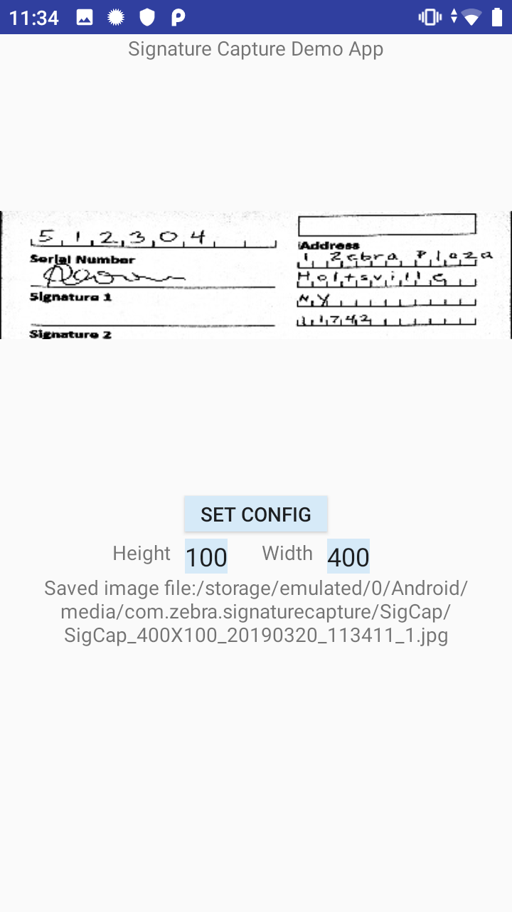

##Overview 
Decoder Signature is a special barcode format that allows to capture an area of a document (such as a signature) as an image. It is marked by two identical bar patterns placed on either side of the capture area. The bar pattern extends the full height of that area, for example

 

Decoder Signature was introduced to DataWedge in version 7.5. This sample app demonstrates how to use Decoder Signature to capture data using [DataWedge Intent APIs](../../api) and save the captured data as an image. Permission is required for writing to device storage, which is prompted upon application launch. The app captures images in .JPG (default) and .BMP format. 

Available actions in this sample: 
* Create a DatatWedge profile if it does not exist, configure it with specific parameters, and associate it with this app.
* Adjust the height and width of the image output.
* Scan and display the captured data as an image. 
* Save the image file to the device.

>**Note**: This application is intended for demonstration purposes only. It is provided as-is without guarantee or warranty and may be modified to suit individual needs. The appearance of sample app screens can vary by sample app version, Android version, and screen size.

##APIs Used

<table class="facelift" style="width:100%" border="1" padding="5px">
  <tr bgcolor="#dce8ef">
    <th>DataWedge API</th>
    <th>App Functionality</th>
  </tr>

  <tr>
    <td><a href="http://techdocs.zebra.com/datawedge/latest/guide/api/setconfig/">Set Config</a></td>
    <td>Create profile if it does not exist and set profile settings</td>
  </tr>

</table>

##Requirements
* DataWedge version 7.3 or higher. 
* Android API 24 (Nougat) or higher.

##Using This Sample
1. [Download](https://github.com/Zebra/samples-datawedge), build, and launch the sample app.

2. Tap **Allow** in the popup message to grant permission for the app to access files on the device.
3. Tap **Set Config**. A messge appears indicating the profile is created and the parameters are updated. The “SignatureCapture” profile performs the following:
   * Enable "Barcode input" plugin and enable "Decoder Signature" decoder.
   * Set the Height and Width paramters for "Decoder Signature" to the default values.
   * Associate the profile to the sample app.
   * Configure the intent output to deliver captured data to the sample app.
  

4. Ensure the correct **Height** and **Width** is entered for the output image. If any changes are made, tap **Set Config** to update the new values in the profile.

5. Press the trigger button to scan. The captured data and file path of the saved image is displayed.

  
-----

**Related guides**:

* [DataWedge Intent APIs](../../api) 

