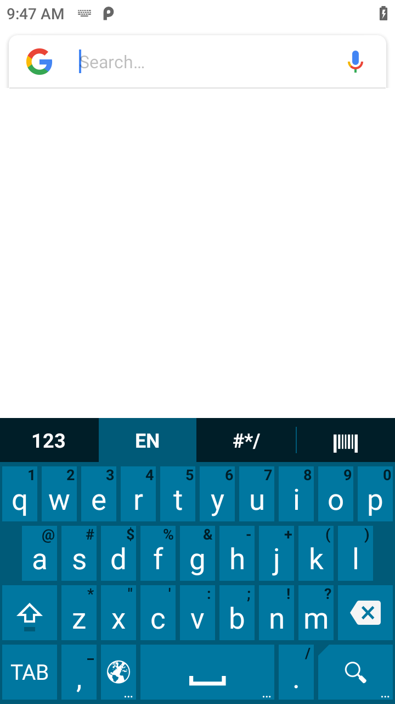
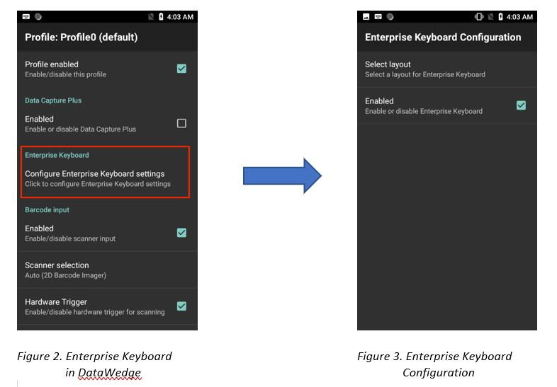
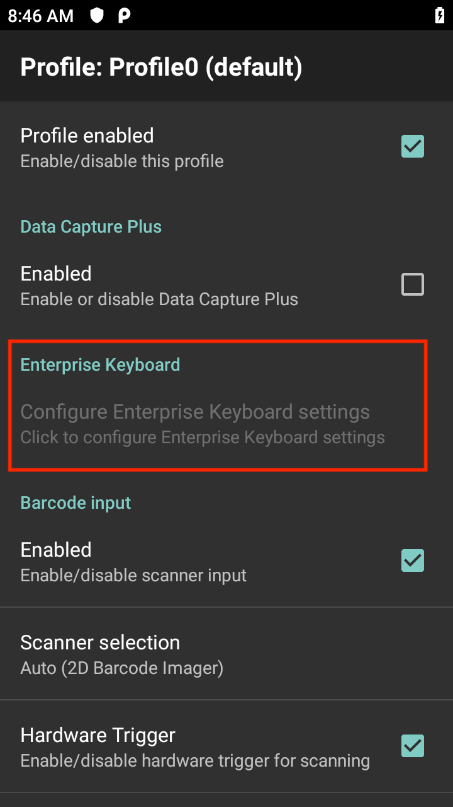

## Overview
**Enterprise Keyboard Configuration** enables the use of an [Enterprise Keyboard](/enterprise-keyboard), whether standard (default) or custom layout, as the IME (input method editor) with an associated app in a DataWedge profile. This facilitates the use of different keyboard layouts without the need to modify an app, activating Enterprise Keyboard automatically as the on-screen keyboard for user input. A custom Enterprise Keyboard layout (`.encrypted` file) can be created and configured with [Enterprise Keyboard Designer](/ekd).

**Requirements:**
* DataWedge v7.4.44 or higher.
* Enterprise Keyboard v3.2 or higher. Zebra devices with Android 7.x Nougat or higher are pre-installed with Enterprise Keyboard v1.7 or higher. For Zebra devices with Android 6.x Marshmallow or lower, Enterprise Keyboard v1.7 or higher is included with any LifeGuard update.
* Enterprise Keyboard must be set as the default IME in Android Settings on the device. 
* The Enterprise Keyboard layout definition file (`.encrypted`) is placed on the device in directory `/enterprise/device/settings/ekb/config`.

> **Note:** Enterprise Keyboard custom layouts are not supported on TC21/TC26 devices. Support will be added in a future release.

_Figure 1. Enterprise Keyboard - standard (default) layout_             
 
Enterprise Keyboard Configuration is accessible from the DataWedge profile screen:

 
Enterprise Keyboard Configuration options include:
* Enable/Disable Enterprise Keyboard
* Select a layout for the keyboard

 
Enterprise Keyboard Configuration is disabled and cannot be configured if one of the following conditions exist:
* Enterprise Keyboard is not the default IME in Android on the device.  
* A `.encrypted` file is not found in `/enterprise/device/settings/ekb/config` directory. 
* Enterprise Keyboard on the device is lower than version 3.2, which does not support custom layouts. 

_Figure 4. Enterprise Keyboard disabled_
  

### Enable/Disable  
Enable/disable Enterprise Keyboard used with the DataWedge profile. If enabled, the selected layout for Enterprise Keyboard automatically appears within the associated app during a profile or activity switch/change when appearing in the foreground. If disabled, Enterprise Keyboard does not appear within the associated app. 

### Select layout 
Select a layout for the keyboard. The available layouts are populated from a custom generated `.encrypted` file (for example _EKBCustomLayouts.encrypted_) located in folder `/enterprise/device/settings/ekb/config` on the device. If the file does not exist, Enterprise Keyboard Configuration is disabled and cannot be configured. The Layout group name is based on the `.encrypted` file name. See [Enterprise Keyboard](/enterprise-keyboard/latest/guide/settings) for more information. 

## Configuration

Programmatically set Enterprise Keyboard Configuration and retrieve the configuration:

* [Set Config](../../api/setconfig)
* [Get Config](../../api/getconfig/#getenterprisekeyboardconfiguration)

------

**Related guides**:

* [Profiles/Plug-ins](../../profiles)
* [DataWedge APIs](../../api) 

