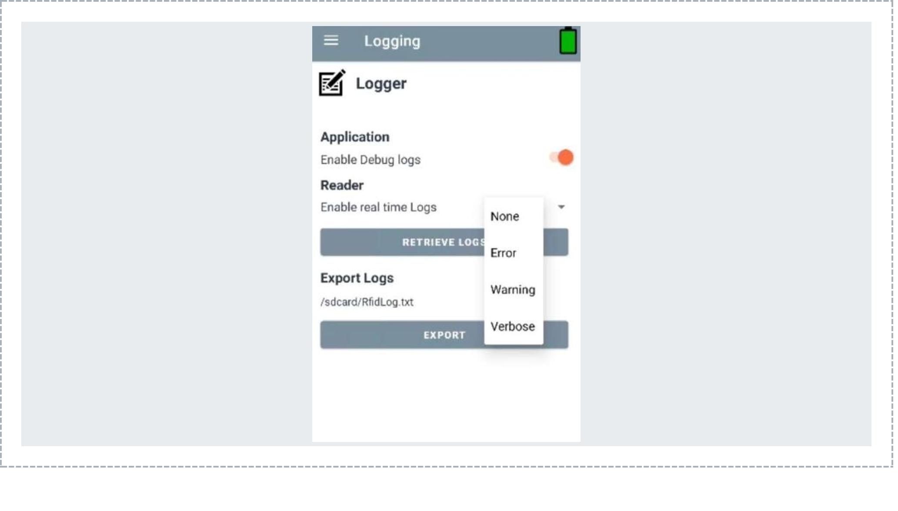

# Runtime Logging API
## **RFD40 / RFD90 RFID Sleds**

## Overview

This guide provides the technical framework to integrate, configure, and retrieve Runtime Logs from Zebra RFD40 and RFD90 RFID sleds using the RFID SDK for Android. Runtime logging captures firmware diagnostics, communication events, reader state transitions, and error information for troubleshooting, debugging, performance analysis, and support diagnostics.

Using the Runtime Logging APIs, an application can:

- Configure reader logging behavior
- Enable or disable SDK debug logging
- Stream real-time reader diagnostics
- Retrieve internal RAM and FLASH logs
- Export logs for troubleshooting and support analysis

---

## Runtime Logging User Interface

The Logger screen in the Zebra RFID Demo Application provides controls for the four logging operations.

- Enable SDK debug logging
- Configure real-time reader logging
- Retrieve reader logs
- Export logs



---

## Runtime Logging Architecture

The Runtime Logging UI provides the following operations:

| Index | Functional Area | Description |
| --- | --- | --- |
| 1 | Enable Debug Logs | Enable or disable SDK debug logging |
| 2 | Enable Real-Time Logs | Configure reader log verbosity |
| 3 | Retrieve Logs | Request RAM and FLASH logs |
| 4 | Export Logs | Export retrieved logs to a local file |

---

## Enable Debug Logs

Enables or disables RFID SDK debug logging. When enabled, SDK diagnostic messages are written to Android Logcat.

### SDK API Usage

```java
// Enable debug logs
logger.setLogConfig(LogStates.DEBUGLOGGERSTATE, true);

// Disable debug logs
logger.setLogConfig(LogStates.DEBUGLOGGERSTATE, false);

// Read current state
boolean enabled =
        logger.getLogConfig(LogStates.DEBUGLOGGERSTATE);
```

### Behavior

| State | Behavior |
| --- | --- |
| ON | SDK logs are written to Logcat |
| OFF | SDK logs are suppressed |

---

## Enable Real-Time Logs

Controls real-time diagnostic information streamed from the connected RFID reader.

### Supported Logging Levels

| Logging Level | Description |
| --- | --- |
| None | Real-time logging disabled |
| Error | Error messages only |
| Warning | Warnings and errors |
| Verbose | All available log information |

### setRfidRealTimeReaderLog()

Configures reader-side real-time logging.

```java
logger.setRfidRealTimeReaderLog(RealTimeLogsType.Verbose);
logger.setRfidRealTimeReaderLog(RealTimeLogsType.Warning);
logger.setRfidRealTimeReaderLog(RealTimeLogsType.Error);
logger.setRfidRealTimeReaderLog(RealTimeLogsType.None);
```

#### Method Signature

```java
void setRfidRealTimeReaderLog(
        RealTimeLogsType realTimeLogsType)
```

#### Exceptions

- InvalidUsageException
- OperationFailureException
- ADMIN_CONNECT_ERROR

#### Example

```java
try {
    logger.setRfidRealTimeReaderLog(
            RealTimeLogsType.Verbose);
} catch (InvalidUsageException e) {
    Log.e(TAG, "Invalid parameter: " + e.getInfo());
} catch (OperationFailureException e) {
    Log.e(TAG, "Operation failed: " + e.getResults());
}
```

---

## Query Reader Logging State

Applications can query reader-side log configuration.

```java
void getRfidReaderLogs(
        LogStates logState,
        boolean state)
        throws InvalidUsageException,
               OperationFailureException;
```

### API Summary

| Method | Purpose | Reader Communication |
| --- | --- | --- |
| `setRfidRealTimeReaderLog()` | Configure reader logging | Yes |
| `getRfidReaderLogs()` | Query and retrieve reader logs | Yes |
| `setLogConfig()` | Configure SDK logging | No |
| `getLogConfig()` | Read SDK logging state | No |

---

## Retrieve Logs

Retrieves historical log data stored in internal RAM and FLASH memory.

```java
try {
    rfidLogger.getRfidReaderLogs(
            LogStates.INTERNALRAMANDFLASHLOGSTATE,
            true);
} catch (InvalidUsageException e) {
    Log.d(TAG, "getRfidReaderLogs failed: " + e.getMessage());
}
```

### Log Storage

| Storage Type | Description |
| --- | --- |
| RAM | Volatile log storage |
| FLASH | Persistent log storage |

---

## Export Logs

Exports retrieved log data to local device storage.

| Scenario | Behavior |
| --- | --- |
| Logs Retrieved | Export file is generated |
| Logs Not Retrieved | Prompt the user to retrieve logs first |

Example file:

```text
/sdcard/RfidLog.txt
```

---

## Receiving Runtime Log Events

### Register for Debug Events

Enable debug event notifications.

```java
RFIDController.mConnectedReader.Events.setDebugInfoEvent(true);
```

### Event Registration

```java
public void setDebugInfoEvent(boolean notifyDebugInfoEvent) {
    if (notifyDebugInfoEvent) {
        registerForNotification(RFID_EVENT_TYPE.DEBUG_INFO_EVENT);
    } else {
        unRegisterForNotification(RFID_EVENT_TYPE.DEBUG_INFO_EVENT);
    }
    this.m_bDebugInfoEvent = notifyDebugInfoEvent;
}
```

### Protocol Processing

```java
if (eventType == RFID_EVENT_TYPE.DEBUG_INFO_EVENT) {
    DEBUG_INFO_EVENT event = new DEBUG_INFO_EVENT();
    event.setLevel((String) responseEvent.take());
    event.setMessage((String) responseEvent.take());
    debugInfoEventQueue.offer(event);
}
```

### Receive Events in the Application

```java
private void notificationFromGenericReader(RfidStatusEvents rfidStatusEvents) {
    if (rfidStatusEvents.StatusEventData.getStatusEventType()
            == STATUS_EVENT_TYPE.DEBUG_INFO_EVENT) {
        String level = rfidStatusEvents.StatusEventData.debugInfoData.getLevel();
        String message = rfidStatusEvents.StatusEventData.debugInfoData.getMessage();
        Log.d(TAG, "Level: " + level);
        Log.d(TAG, "Message: " + message);
    }
}
```

---

## Real-Time Logs vs Retrieved Logs

| Type | Description |
| --- | --- |
| Real-Time Logs | Streamed immediately through `DEBUG_INFO_EVENT` |
| Retrieved Logs | Historical RAM and FLASH logs retrieved on demand |

---

## What's Next

- [Profiles Tutorial](../profiles)
- [Read Access Tutorial](../readaccess)
- [Hello RFID Sample](../../samples/hellorfid)
- [Firmware Update](../firmwareupdate)