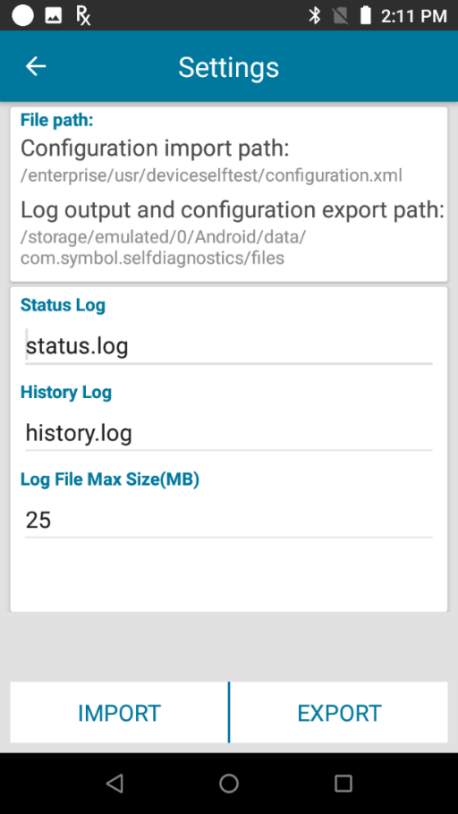
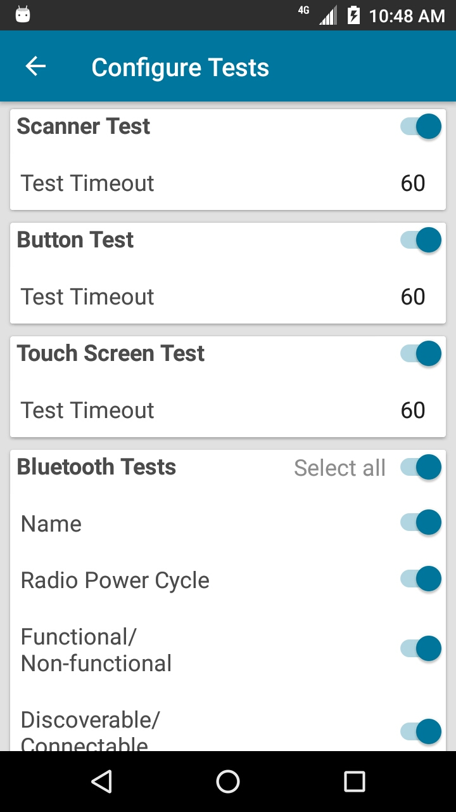
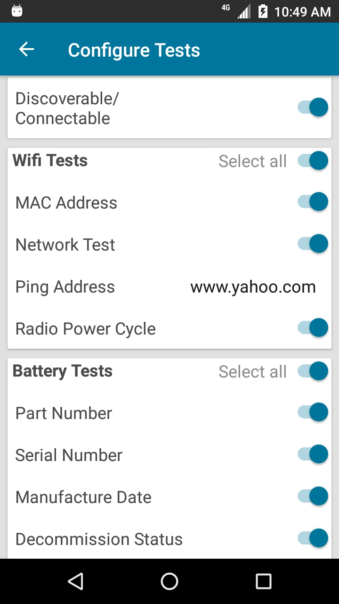
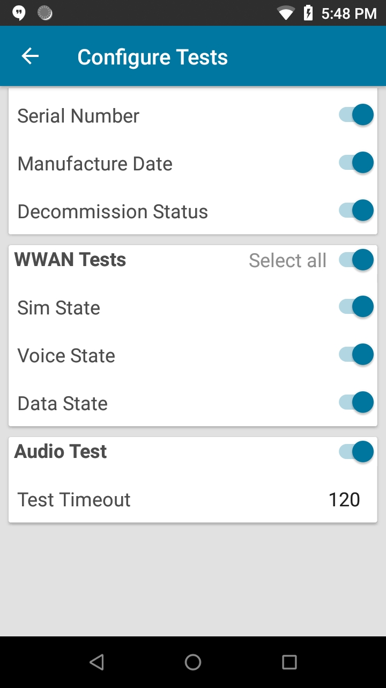

## Overview

This section discusses configuration settings and reporting options for Device Diagnostic Tool.

## Settings

The **Settings** screen provides the file path to import/export the configuration file and allows for configuration of the history and status log files. Access settings by tapping on the options menu at the top right of the main screen, then select **Settings**:

_Application settings_
 

* **File path:**  
&nbsp;&nbsp;&nbsp;&nbsp;&nbsp;&nbsp;&nbsp;&nbsp;<b>•</b> Configuration import path - specifies the file path for the configuration file: `/enterprise/usr/deviceselftest/configuration.xml` 
&nbsp;&nbsp;&nbsp;&nbsp;&nbsp;&nbsp;&nbsp;&nbsp;<b>•</b> Log output and configuration export path - specifies the folder path for the log files and exported configuration file: `/storage/emulated/0/Android/data/com.symbol.selfdiagnostics/files`
- **Status log -** editable text field for the file name of the status log. Contains information about the tests conducted with any associated parameters and configuration changes from the **Configure Tests** screen. Located in `/storage/emulated/0/Android/data/com.symbol.selfdiagnostics/files`.
- **History log -** editable text field for the history log, containing information about the test results. Generated when performing a full test from the main screen. Located in `/storage/emulated/0/Android/data/com.symbol.selfdiagnostics/files`.
- **Log File Max Size (MB) -** editable text field to specify the maximum file size for the log files.
- **Import -** imports a configuration file located in the configuration import path `/enterprise/usr/deviceselftest/configuration.xml`.
- **Export -** exports `configuration.xml` from configurations set in the **Configure Tests** screen located in `/storage/emulated/0/Android/data/com.symbol.selfdiagnostics/files`. Once exported, deploy the configuration to other devices by copying the .xml file to the import path `/enterprise/usr/deviceselftest` then tap the **Import** button in the **Settings** screen.

## Configuration File

`Configuration.xml` can be modified manually using any text editor. The existing tag format must be maintained. Options are configurable through **Settings** or **Configure Tests** in the user interface, except for the options specified below:
- **admin_mode –** If set to _true_, sets the app to admin mode allowing access to the app settings and test configurations. Default value = _true_.
- **allow_individual_test_for_user -** If set to _true_, the non-admin user can run the tests individually instead of running all tests at once.
- **allow_individual_log_for_user -** If set to _true_, the non-admin user can generate an individual result log file for each test instead of a single log file containing all test results.
- **continue_testing_on_failure -** If set to _true_, the test automatically proceeds to the next section test until all tests are completed, even if the previous section test fails. Default value = _false_.
- **show_extra_data -** If set to _true_, informational data is displayed in the test results page. Refer to Test Criteria section to see the affected informational data. Default value = _true_.
- **debug –** If set to _true_, application logging is displayed in logcat for debugging purposes. Default value = _true_.
- **close_on_result_acknowledge -** If set to _true_, the application closes when all tests have passed. If any test fails, the app does not close. Default value = _false_.

Sample settings content in configuration.xml:
<settings>
<admin_mode>true</admin_mode>
<continue_testing_on_failure>true</continue_testing_on_failure>
<show_extra_data>true</show_extra_data>
<debug>true</debug>
<close_on_result_acknowledge>false</close_on_result_acknowledge>
<status_log_name>status.log</status_log_name>
<history_log_name>history.log</history_log_name>
<log_file_max_size_mb>25</log_file_max_size_mb>
</settings>

## Configure Tests

Select the tests to be conducted and configure the test parameters. Access **Configure Tests** by tapping on the options menu at the top right of the main screen, then select **Configure Tests**:

<table>
 <tr>
     <td></td>
     <td>&nbsp;&nbsp;&nbsp;</td>
     <td></td>
     <td>&nbsp;&nbsp;&nbsp;</td>
     <td></td>
 </tr>
</table>

_Configure Tests_
 
 
Timeout values can be specified for tests that require user intervention. Once the specified time elapses (in seconds), execution moves to the next test selected if configured in the configuration.xml file.

Configuration parameters:

- **Scanner Test –** checks whether the scanner is functioning
  - **Test Timeout –** specifies the time in seconds to wait for user input
- **Button Test –** checks for the operation of push-to-talk, left or right scan trigger, volume up and volume down hard buttons on the device.
  - **Test Timeout –** specifies the time in seconds to wait for user input
- **Touch Screen Test –** checks for operation of the device display screen
  - **Test Timeout –** specifies the time in seconds to wait for user input
- **Bluetooth Tests –** tests the Bluetooth radio and returns Bluetooth related information
  - **Name –** returns the Bluetooth name
  - **Radio Power Cycle –** checks for operability when turning the Bluetooth radio on/off
  - **Functional/Non-functional –** determines whether the Bluetooth radio can be enabled/disabled within a specified period of time. Returns functional if the Bluetooth radio is functional.
  - **Discoverable/Connectable –** checks if connectable or discoverable
- **WiFi Test –** tests operation of the WiFi radio and returns WiFi related information
  - **MAC address –** checks whether the MAC address is valid based on its format
  - **Ping Address –** specifies the domain name to perform the ping test
  - **Network Test –** pings the web address specified in the Ping Address field via WiFi and returns the amount of time it takes to receive a response
- **Battery Test –** checks the battery status and returns battery related information
  - **Part Number –** returns the battery part number
  - **Serial Number –** returns the battery serial number
  - **Manufacture Date –** returns the battery date of manufacture
  - **Decommission Status –** returns the health of the battery, whether it needs to be decommissioned
- **WWAN Test –** tests operation of the WWAN radio and returns related WWAN information
  - **Sim State –** checks whether the sim card is present
  - **Voice State –** checks the voice state of the sim card
  - **Data State –** checks the data state of the sim card
- **Audio Test –** tests operation of the device microphone and speaker 
- **Test Timeout –** specifies the time in seconds to wait for user input
 

When text values are modified, such as <b>Test Timeout</b> or <b>Ping Address</b>, these values take effect as long as the app is running. When the app is closed and relaunched, the values retrieved from the configuration file take into effect.

Refer to <a href="../criteria">Test Criteria</a> section for more information.

<!-- -->
------

## See Also

- [About Device Diagnostic Tool](../about)
- [Usage Guide](../usage)
- [Test Criteria](../criteria)
