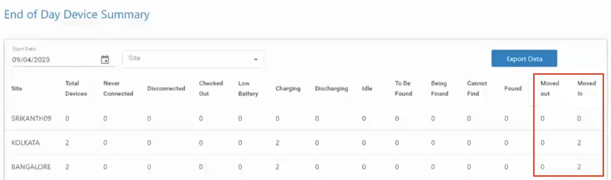

<!--

<b>Important information about Device Tracker:</b> 
&nbsp;&nbsp;&nbsp;&nbsp;&nbsp;•&nbsp; <b>Device Tracker</b> 4.0 and later is the cloud-based version of the solution.  
&nbsp;&nbsp;&nbsp;&nbsp;&nbsp;•&nbsp;<b>Device Tracker On-Prem</b> 3.0 and earlier is the on-premise server-based version. It is discontinued and no longer supported since December 2021. 
&nbsp;&nbsp;&nbsp;&nbsp;&nbsp;•&nbsp; The cloud and on-premise solutions are incompatible with one another. 

-->

## Overview

Device Tracker is a cloud-based scalable solution that makes it easy to track and recover lost or misplaced devices, preventing device inventory shrinkage. No additional hardware is required - leverage existing Wi-Fi network infrastructure along with Bluetooth and audio to locate devices. When locating a device, Device Tracker identifies the general vicinity of the lost device based on the Access Point (AP) it is connected to within the facility. The visual proximity indicator shows in real-time how close or far the lost device is located, relying on Bluetooth beacon transmissions. If the device is not within line-of-site, an alarm can be remotely triggered on the device to further determine its precise location.

> Learn about [Getting Started](../getstarted/) with Device Tracker.

<iframe width="560" height="315" src="https://www.youtube.com/embed/azeNDRAJZS8" title="YouTube video player" frameborder="0" allow="accelerometer; autoplay; clipboard-write; encrypted-media; gyroscope; picture-in-picture" allowfullscreen></iframe>
<i>Video: Overview of Device Tracker</i>

---

## Main Features

Main features of Device Tracker:

- Cloud-based scalable solution hosted and maintained by Zebra with support for up to 100K devices in multiple locations.
- Support for central administrator, site manager, and site associate [roles](../config/#overview).
- The web portal provides a corporate-level [dashboard for administrators](../dashboard/#administratordashboard) and site-level [dashboard for managers](../dashboard/#managerdashboard) to monitor and track devices.
- Registration of:
  - [Sites](../config/#managesites) and [access points](../config/#manageaccesspoints) with friendly names to easily identify device location.
  - [Devices](../config/#managedevices) to assigned site with user friendly names for simple device identification.
- Simple to deploy – [install and configure](../setup) the mobile application using StageNow and Enterprise Mobility Management tools.
- Easily [find a misplaced device](../use/#finddevice) with the connected AP location, the Bluetooth-based visual proximity indicator and play sound feature.
- Locate a device even when that device is powered off (for a limited time) if it has [secondary Bluetooth Low Energy (BLE)](../secondaryble) beaconing capability.
- [Checkout](../use/#devicecheckout) feature to associate users to devices for accountability.
- [Single Sign On](../config/#singlesignonsso) (SSO) support for users to be authenticated with their SSO credentials for device access and for administrators and managers to gain access to their respective dashboards.
- Generate [reports](../config/#reports) to monitor device performance, user activity and site activity.
- [Automate](../config/#automation) workflows to ease the process of finding and tracking devices.
- Automatically receive notifications from [lost devices in close proximity](../config/#lostdevicenearby) via audio, vibrating or LED alerts.
- [Locate devices](../config/#mapbasedlocationing) based on GPS coordinates and pinpoint device location on a map.

---

## Important Notes

- **When the device is configured with a PIN, Password, or Pattern lock _and is rebooted,_** the Device Tracker client application cannot communicate with the server as long as the device stays locked. The device remains disconnected and cannot be tracked until the user unlocks it to communicate with the server. This behavior applies to all Zebra Android 13 devices and Android 11 devices with FBE (file-based encryption) enabled. A viable solution to ensure proper functionality post-reboot involves configuring the device with a Swipe lock or no lock at all. This issue is caused by the Firebase Authentication API utilized by the server which does not take into affect until the user unlocks the device.
- In rare cases, **the Device Tracker web portal may not logout automatically** after a period of inactivity. If this occurs, performing any action in the web portal results in unauthorized access error 401. The user must re-login to recover.

---

## New in Device Tracker 6.0

- **New feature to track Bluetooth Scanner accessories** supporting Zebra RS5100 Ring Scanners and RS6100 Wearable Scanners.
- **New Productivity dashboard to display a graphical representation of Device Tracker use** including statistics of devices in Lost/Found states, the time taken to locate devices, and the amount of time devices are in lost state. Data can be viewed based on site and compared against company averages. 
- **The “Events By Site” report in the web portal is enhanced to generate reports based on local site time zone** rather than generating reports at 3 AM Central time. 
- **Resolved Issues:**
    - When Checkin/Checkout is enabled, **the user name is now consistently cleared in the "Checked Out By" field** from the web portal after a device is inserted into a charged cradle. 
    - Devices are no longer set "To Be Found" when a device that reached the idle threshold is removed from the charging cradle and both the following conditions are met:
        - Checkin/Checkout is enabled 
        - "Automatically Mark Devices **To Be Found**" when the device is "not charging" is selected as an automation rule
    - Fixed issue where the checkout screen was intermittently not appearing after device reboot when using SOTI MobiControl (EMM) in lockdown mode.  
    - **When licenses are renewed before expiration,** the web portal now consistently displays an accurate license count.
- **Known Issues**:
  - **When accessing the portal using single sign-on (SSO),** the Passcode section takes longer than normal to load values.
  
---

## Version History

### New in Device Tracker 5.7

- **[Events By Site](../dashboard/#eventsbysite) report has been enhanced to now show device movement in and out of sites.** Admins and managers can track device allocation across sites, including when a device movement occurred, the previous site the device was located, and the site where the device is currently located.
  
- **Managers can now access [Events By Site](../dashboard/#eventsbysite) reports for their designated site in the web portal.**
- **Resolved Issues:**

  - In the Mobile Devices [dashboard](../dashboard/) from the web portal, **the device count shown in the Charging, Discharging, and Disconnected tiles no longer include decommissioned devices.**
  - **Site names containing only numbers are now valid** when creating sites through CSV file upload.

- **Known Issues**:

  - **When accessing the portal using single sign-on (SSO),** the Passcode section takes longer than normal to load values.
  - **When licenses are renewed before expiration,** the web portal displays an inaccurate license count.

### New in Device Tracker 5.6

- **New option for managers to receive [End of Day Device Summary](../dashboard/#endofdaydevicesummary) reports of device movement between sites via email.** This setting is configured by administrators when [adding a site](../config/#managesites) either manually or via .CSV file.
  
- **The web portal [dashboard](../dashboard/) now shows time stamps in their respective local time zones, rather than in GMT.**
- **The Mobile Devices [dashboard](../dashboard/) now features a new column named “Last Check In,” showing the elapsed time since the device’s most recent check-in.**
  
- **The [Device Checkin Option](../config/#devicecheckinoptions) is renamed from "Device API" to "App API."**
- **Resolved Issues:**
  - **When a tile was selected to filter devices on the Devices Summary screen in the web portal,** the displayed result directed to the Mobile Devices screen instead of showing the relevant selected filter.
  - **When displaying the Device Details screen in the web portal,** the site location of the device was not included in the list, consequently hindering the capability to assign the device to a site.
  - **Enabling Single Sign-On (SSO) with Defined Roles prevented the ability to export data from Access Points (AP), Mobile Devices and Sites in the web portal.**
  - **When a device was recommissioned (after being decommissioned),** the device remained unassigned to a site (even if previously assigned to a site) until the user checked out the device through Enterprise Login Screen (ELS).

* **Known Issues**:
  - **When accessing the portal using single sign-on (SSO),** the Passcode section takes longer than normal to load values.

### New in Device Tracker 5.5

- **Now supports Zebra devices running Android 13**.
- **Administrators can now [download XML and barcode files](../config/#enrolldevices)** for device enrollment.
- Enrollment files are still emailed as part of Zebra’s on-boarding process.  
  <i class="fa fa-exclamation-triangle" style="color:#FFA500;"></i> **NOTE: Separate barcodes must be used for** devices running **Android 13** (or later) **and Android 11** (or earlier); the XML files are supported by any Android version.
- **Allows administrators to [select an on-device sound file](../config/#playsound)** when using Play Sound feature from the portal:
  
  _Click image to enlarge; ESC to exit._
   
- **Allows admins to arrange and save columns in the portal** according to user preference:
  
  _Click image to enlarge; ESC to exit._
   
- **Now can update device name, site and in-line notes** from device details page.
- **A “Welcome” email with access instructions is now sent to newly added users**.
- **Resolved Issues**:
  - On systems using SSO, the “Checked Out By” field value is now being updated when a user logs in using Enterprise Login Screen (ELS) without the Device Tracker application running.
- **Known Issues**:
  - **When accessing the portal using single sign-on (SSO),** the Passcode section takes longer than normal to load values.
  - **When a device is recommissioned (after being decommissioned),** the device remains unassigned to a site (even if previously assigned to a site) until the user checks out the device through ELS.

> <i class="fa fa-exclamation-triangle" style="color:#FFA500;"></i> Zebra recommends updating devices to the latest client to receive critical issue fixes and new features. Device Tracker Cloud Server 5.5 is backward-compatible with client version 5.3 and later.

### New in Device Tracker 5.4

- Adjust the tone, volume, duration and interval of the sound emitted when activating the [Play Sound](../config/#playsound) function to locate misplaced devices.
- **GPS Locationing** is renamed to [Map Based Locationing](../config/#mapbasedlocationing).
- **Resolved Issues:**
  - When Lost Device Nearby notifications are enabled, detecting more than 10 nearby devices in the beaconing state causes the client application to crash.
  - When selecting a tile to filter devices in the web portal, the chosen filter and the corresponding list of devices were not preserved when switching between views in the dashboard.
  - In the web portal, when switching from **Automatically assign devices to a connected AP’s site** to **IP Address Range Configuration** under Registration, it prevented the ability to add/modify sites using CSV file import.
  - There was an intermittent issue in the reports where the **Found** device count may display a higher value than the **To be found** device count.
- **Known issues:**
  - In the web portal, when switching from **IP Address Range Configuration** to **Automatically assign devices to a connected AP’s site** under Registration, it requires the device to be rebooted.
  - **When accessing the SSO setting in the web portal,** the Passcode section takes a few seconds to load the values.
  - **When a device is recommissioned (after being decommissioned),** the device remains unassigned to a site (even if previously assigned to a site) until the user checks out the device through Enterprise Login Screen.

### New in Device Tracker 5.3

**Note: Both server and client must be upgraded to Device Tracker 5.3 to ensure compatibility of Device Tracker features.**

- [Locate devices](../config/#mapbasedlocationing) based on GPS coordinates and pinpoint device location on a map.
- [Automatic device assignment to a site based on a specified range of IP addresses (IPV4)](../config/#devicetositeassignment) when a device connects to the network
- New SSO login screen, aka [Enterprise Login Screen](../config/#enterpriseloginscreenels) (pre-release), ensures secure device access by requiring user authentication and device checkout using SSO login credentials, enforcing accountability. [Login bypass](../config/#loginbypass) allows a user to gain device access in unexpected situations when SSO login cannot occur.
- Device Tracker support for [SSO](../config/#singlesignonsso) OAuth 2.0 with client authentication type None with PKCE
- Device Tracker dashboard access based on [SSO](../config/#singlesignonsso) response parameters (such as Active Directory group name, job ID, and site location)
- Enhanced [End of Day snapshot email report](../dashboard/#endofdaydevicesummary) for administrators to customize reported data based on criteria selected; see [Manage Sites](../config/#managesites) to configure site reporting
- Enhanced [events report](../dashboard/#eventsbysite) for administrators to analyze events and view event details, including detailed device information, identification of manual vs automatic events, total and average amount of time provided for devices in "Being Found" or "To Be Found" state, and ability to export device detail information as a CSV file
- [Automatic clearing of the “To Be Found” status upon device checkout](../config/#configureautomationsettings). If a device is in the “To Be Found” state when it is checked out, it is automatically set back “In Service” (rather than remaining in the “To Be Found” state).
- API to integrate device checkin with a Line of Business (LOB) application to simplify the user device checkin workflow. See [Device Checkin Options](../config/#devicecheckinoptions).
- Automatically checkin devices after reaching the maximum checkout time. [Force Checkin](../config/#forcecheckin) automatically checks in the user when the **Maximum Checkout Time** is reached. If a [Snooze Time](../config/#snoozetime) is specified, it extends the maximum checkout time to allow the user to complete their task. This applies when SSO is in use with Enterprise Login Screen.
- [Register location friendly name for the Access Point (AP) with a wildcard.](../config/#manageaccesspoints). A wildcard character "\*" is now acceptable for the last digit of the last octet of the MAC address to register multiple APs which share the same MAC address aside from the last digit.
- New feature for managers and admins to [Play Sound](../use/#playsound) through the device actions menu in the web portal.
- Resolved issues:
  - After a device is rebooted and then idle for a long period of time without being unlocked, the device may be shown as disconnected.
  - Intermittently, a user may be unable to checkout a device by scanning a barcode.
- Known issues:
  - When accessing the SSO setting in the web portal, the Passcode section takes a few seconds to load the values.
  - When a device is recommissioned (after being decommissioned), the device remains unassigned to a site (even if previously assigned to a site) until the user checks out the device through Enterprise Login Screen.

### New in Device Tracker 5.2

- New feature to automatically detect [Lost Devices Nearby](../config/#lostdevicenearby). When any device is in close proximity to a lost device, alert notifications (audio, vibration, LED or notification message) are received and further action can be taken to recover the lost device.

### New in Device Tracker 5.1

- The web portal now provides a [dashboard for administrators](../dashboard/#administratordashboard) and [managers](../dashboard/#managerdashboard) to monitor and track devices.
- Administrators can now [manage devices](../config/#managedevices), [access points](../config/#manageaccesspoints) and [sites](../config/#managesites) through the web portal either manually or by uploading the data via .CSV file.
- New [Single Sign On](../config/#singlesignonsso) (SSO) OAuth 2.0 support.
- Add SSO users for admin or manager access to the web portal through [Manage Users](../config/#manageusers).
- New reporting features:
  - [Site Data Report](../config/#eventsbysite) - generate reports on demand showing daily device event counts based on site.
  - [End of Day Report](../config/#endofdaydevicesummary) - generate a snapshot report showing device summary and checked out devices at the end of the day with the option to email the report to recipients.
- New capability to assign a manager to a site when creating a [new user](../config/#adduser).
- _Limitation:_ If upgrading from Device Tracker 5.0 or lower, sites imported via .CSV file on the device must be updated with the local [time zone](../config/#managesites) information in order for the new [data reporting](../config/#reports) features to work.
- _Deprecated Feature:_ .CSV file import through the device client app for device, access point and site registration is deprecated. Starting with v5.1, Zebra recommends to import the .CSV file through the web portal.

### New in Device Tracker 5.0

- New [automation](../config/#automation) feature to automatically set devices to certain states depending on the thresholds reached or configurations selected to ease the process of finding and tracking devices.
- Now automatically assign a device to a known site based on its connected access point (AP) with [automatic device registration](../config/#devicetositeassignment).
- New [Device Checkin Options](../config/#checkincheckoutdevice) to select the method of checkin: manual, cradle, or reboot.
- New capability to play an audio alert if [Do Not Disturb (DND)](../use/#donotdisturbdndmode) is enabled on the lost device being tracked.

### New in Device Tracker 4.2

- Device Tracker now supports TC52AX and MC33AX and their optional [battery-based BLE](../secondaryble) enabling Device Tracker to locate the device when powered off.
- Eliminated the need to allow `*.google.com` through the firewall or proxy. See [Network Requirements](../setup/#networkrequirements).
- Added support for Android 11 devices. See [Device Compatibility](https://www.zebra.com/us/en/support-downloads/software/productivity-apps/device-tracker.html).
- Fixed an intermittent issue when a user is unable to scan a barcode to checkout the device.
- Known Behavior: During a Google Play Services update, the Device Tracker app gets closed. Relaunch the Device Tracker app or reboot the device to continue tracking of the device.

### New in Device Tracker 4.1

- Locate a device even when that device is powered off (for a limited time) if it has [secondary BLE beaconing](../config/#secondaryble) capability.
- New device support for EC50. See <a href="https://www.zebra.com/us/en/support-downloads/software/productivity-apps/device-tracker.html">Supported Devices.</a>
- Added support to [silently deploy](../setup) Device Tracker on mobile devices using EMM and StageNow, allowing uninterrupted device operation for the end user (if Checkout is not enabled).
- Administrator or manager can scan a barcode for user name and password during login, eliminating manual entry.
- Resolved Issues:
  - After repeatedly launching Device Tracker over several weeks without rebooting the device, the app may become unresponsive.
  - When there are multiple pools of licenses with different expiration dates, an incorrect license count is reported after the licenses expire.
- Known Issue: When installing the application on a mobile device using an EMM, some EMMs may not have implemented the Zebra value-added features for seamless deployment. Alternatively, an XML file can be generated from the StageNow profile and consumed by the EMM for seamless deployment. Refer to the [Install & Setup guide](../setup).

<!--

## Device Tracker Comparison

Comparison of **Device Tracker On-Prem** and **Device Tracker** cloud-based:

<table class="facelift" style="width:100%" border="1" padding="5px">
  <tr bgcolor="#dce8ef">
    <th style="text-align:center">Features</th>
    <th style="text-align:center">Device Tracker On-Prem</th>
    <th style="text-align:center">Device Tracker</th>
  </tr>
  <tr>
    <td style="text-align:left">Host platform</td>
    <td style="text-align:left">On-premise server, requires manual install and setup</td>
    <td style="text-align:left">Cloud-based solution managed by Zebra</td>
  </tr>
  <tr>
    <td>Maximum Devices Supported</td>
    <td>500</td>
    <td>100,000</td>
  </tr>
  <tr>
    <td>Site support</td>
    <td>Single; multiple sites require individual server installation at each location</td>
    <td>Multi-site; centralized in-the-cloud supporting multiple locations up to 5,000 sites without any additional install required</td>
  </tr>
  <tr>
    <td>Server setup required</td>
    <td>Yes, Windows server with required software and other system requirements</td>
    <td>No, server is in the cloud and managed by Zebra</td>
  </tr>
  <tr>
    <td>Android platform support</td>
    <td>Only supported on select devices up to Android 10</td>
    <td>Only supported on select Android Oreo and Android 10 devices</td>
  </tr>
  <tr>
    <td>Common Features</td>
    <td colspan="2">• Simple real-time device locationing with connected AP identification, Bluetooth-based visual proximity indicator and remote play sound feature • Registration of sites, APs and devices with friendly names for ease of identification • Misplaced and at-risk device prevention by monitoring low power and disconnection device states • Role-based access to find and manage devices based on administrator, site manager and associate roles • Centralized dashboard</td>
  </tr>
  <tr>
    <td>Device Checkout/ Checkin</td>
    <td>No</td>
    <td>Yes, identifies device user</td>
  </tr>
  <tr>
    <td>Dashboard</td>
    <td>Server-based dashboard view</td>
    <td>Device-based dashboard view</td>
  </tr>
  <tr>
    <td>Cost</td>
    <td>Free</td>
    <td>Licensed subscription service</td>
  </tr>
</table>
-->

---

## See Also

- [Licensing](../license)
- [Install & Setup](../setup)
- [Secondary BLE](../secondaryble)
- [Configuration](../config)
- [Track Devices](../use)
- [Dashboard](../dashboard)
- [FAQ](../faq)
