## Overview

The Device Tracker web portal allows administrators to manage devices, access points (APs) and sites, and to generate reports of managed assets. For Device Tracker operation, administrators must [register devices](#managedevices), [register access points](#manageaccesspoints) and [register sites](#managesites) prior to use. This can be performed manually or by uploading data through a .CSV file.

#### System Parameters:

- **Maximum device support:** 100,000 devices
- **Maximum web portal support:** 500 sites and 25,000 devices
- **Maximum .CSV import:** 25,000 records  
  <i class="fa fa-exclamation-triangle" style="color:#FFA500;"></i> **Note:** Importing .CSV files approaching the 25,000 maximum can require a considerable period of time. To import files more quickly, Zebra recommends importing records in groups of 1,000.

Device Tracker supports three user roles: [administrator](#administratorrole), [manager](#managerrole) and [user/associate](#userassociaterole). User functions and capabilities presented by the Device Tracker app vary based on the assigned role:

<table>
  <tr>
   <td>
        
   </td> 
   <td>&nbsp;&nbsp;&nbsp;&nbsp;&nbsp;</td>
   <td> 
        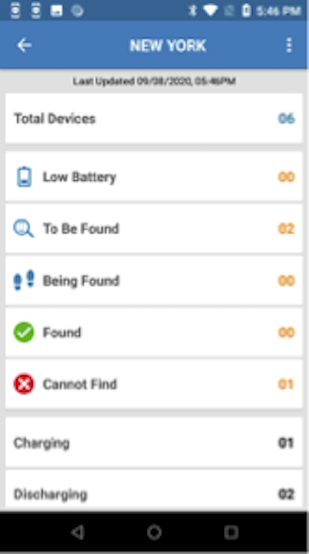
   </td>
   <td>&nbsp;&nbsp;&nbsp;&nbsp;&nbsp;</td>
   <td> 
        
   </td>
  </tr>
  <tr>
    <td>
        <b>Administrator</b> View status of devices  across all locations
    </td>
    <td>&nbsp;&nbsp;&nbsp;&nbsp;&nbsp;</td>
    <td>
        <b>Manager</b> View status of devices   within their location
    </td>
    <td>&nbsp;&nbsp;&nbsp;&nbsp;&nbsp;</td>
    <td>
        <b>User/Associate</b> View misplaced devices   that need to be found
    </td>
  </tr>
</table>

**Note:** [Secondary Bluetooth Low Energy (BLE)](../secondaryble) configuration is part of the [Install & Setup](../secondaryble/#configuration).

### Administrator Role

Administrator functions and capabilities presented through the Device Tracker web portal:

- [Administrator dashboard](../dashboard/#administratordashboard) to manage and view assets at the corporate-level and site-level:
  - [Integrate SSO](../config/#singlesignonsso)
  - [Manage Users](../config/#manageusers)
  - [Manage Sites](#managesites)
  - [Manage Access Points](#manageaccesspoints)
  - [Manage Devices](#managedevices)
  - [Manage Enrollment files](#manageenrollment)
  - [Configure Manager Access to Modify Devices and/or Access Points](#registration) (optional)
  - [Configure Device-to-Site Assignment](#devicetositeassignment) (optional)
  - [Configure Device Checkin/Checkout](#checkincheckoutdevice) (optional)
  - [Set Barcode Prefix](#checkoutbarcodeprefix) (optional)
  - [Configure Workflow Automation](#automation) (optional)
  - [Generate Reports](#reports) (optional)
  - [Monitor Licenses](../dashboard/#licensesummary)
- [Device dashboard](../dashboard/#devicedashboard) to view devices at the corporate-level
- [Site Search](../dashboard/#sites)
- All Manager and Associate capabilities

### Manager Role

Manager functions and capabilities presented through the Device Tracker web portal:

- [Manager dashboard](../dashboard/#managerdashboard) to manage (if permitted) and view assets at the site-level:
  - [Monitor Devices](../dashboard/#mobiledevices-1)
  - [Monitor Access Points](../dashboard/#accesspoints-1)
  - [Modify Devices](../dashboard/#mobiledevices-1) if [permitted by the administrator](../config/#registration)
  - [Modify Access Point](../use/#accesspoints-1) if [permitted by the administrator](../config/#registration)
- [Mark a device for retrieval ("To Be Found")](../use/#markdevicetofind) (To Be Found)
- [Mark a device out of service](../use/#decommissionrecommissiondevice) (decommission) with a [note](../use/#addeditnote)
- [Clear a retrieval request](../use/#disablefinding)
- [Device or AP Search](../dashboard/#managerdashboard)
- All Associate capabilities

### User/Associate Role

User/Associate functions and capabilities presented through the Device Tracker web portal:

- [Device Checkout/Checkin](../use/#devicecheckout)
- [View marked devices](../use/#finddevice) for retrieval ("To Be Found")
- [Find devices](../use/#finddevice) using the BLE proximity meter and audio chirp
- [Mark devices as found or cannot be found](../use/#finddevice)

---

## Single Sign-On (SSO)

Optionally, Device Tracker can integrate with some single sign-on (SSO) systems for mapping SSO roles to Device Tracker portal dashboards, and for authenticating device access for managers and administrators using their corporate login credentials. Enterprise Login Screen also can be used to control device access by associates, who can check out devices using their corporate login credentials to track custody and provide accountability for devices.

There are three levels of Device Tracker access based on user role: administrator, manager, and associate. SSO activation allows administrators and managers to log into Device Tracker with their SSO credentials and gain access to their respective [dashboards](../dashboard) on the device and web portal. For other users, there is no change in Device Tracker client app access when logging in with their SSO credentials; after logging in, the [To Be Found](../use/#markdevicetofind) screen is seen when the client app is launched. SSO credentials are _not_ used for user accountability, only for user authentication to gain device access.

**To enforce user accountability and prevent device access until the user logs in with their SSO credentials, install [Enterprise Login Screen (ELS).](#enterpriseloginscreenels)** User accountability associates the user to the device based on login so the administrator can track device ownership.

**_Only OAuth 2.0 with PKCE or Mutual-TLS is supported for SSO integration._** When SSO is integrated, it uses OAuth 2.0 with PKCE by default. For integration with Mutual-TLS client certificates, see [Mutual-TLS Certificate Generation & Deployment](#mutualtlscertificategenerationdeployment).

**Notes:**

- To use SSO, **Device Tracker 5.1 or higher is required on the device.** Otherwise, a server connection failed error may occur. To recover, clear the Device Tracker application cache either manually through Android settings or using [App Manager](/mx/appmgr/) through MX.
- If the **same SSO credentials are used to log into the web portal in separate web browser instances at the same time,** when logging out of one instance it prevents the other instance from being operational.
- **When using Chrome for the first time on the device and attempting to login with SSO,** the following steps are required before proceeding to login:

  1. Accept the Google Terms of Service.
  2. Select the desired option when prompted to turn on sync.

  If the device is running Android 8, the SSO login page appears again after logging in sucessfully. Tap the back button to open the Device Tracker dashboard.

### Mutual-TLS Certificate Generation & Deployment

**When ready to activate SSO OAuth 2.0 using Mutual-TLS client certificates,** gather the required certificate files and related information:

- Certificate private key (.key file) from the certificate owner
- Certificate password (saved in passphrase.txt) used to generate the private key
- SSL certificate issued by the CA (.p7b file)
- SSL certificate (.pfx file) converted from P7B
- Public certificate (.crt file) generated from PFX format
- Certificate expiration date

Steps to generate the SSL certificates are provided below. After all the certificate information is gathered, contact [Zebra technical support](https://www.zebra.com/us/en/about-zebra/contact-zebra/contact-tech-support.html) to raise a ticket for SSO integration with Device Tracker. Zebra services will request the above information and follow-up with next steps.

To generate the SSL certificates, perform the following:

1. Create a certificate CER file with the following command:

   `openssl pkcs7 -print_certs -in ssl_certificate.p7b -out ssl_certificate.cer`

   where "ssl_certificate.p7b" is the certificate issued by the CA.

2. Create an SSL certificate in PFX format using the following command:

   `openssl pkcs12 -export -in ssl_certificate.cer -inkey private.key -out ssl_certificate.pfx`

   where "private.key" is the private key from the certificate owner and "ssl_certificate.cer" is the file generated from step 1. Save the private key password in **passphrase.txt.** When prompted, enter the certificate password and specify the export password using the same password as the certificate password.

3. Generate a public certificate in CRT format with command:

   `Openssl pkcs12 -in ssl_certificate.pfx -clcerts -nokeys -out dtrk_sso_public.crt`

Action is required to **activate SSO for integration with Device Tracker** after Zebra services enables SSO in the cloud server. _Only activate SSO when all devices have Device Tracker 5.1 or higher._ Follow the [SSO integration](#ssointegration) steps and then [create SSO users](#manageusers) if role-based mapping is not in use. When SSO is activated, only SSO users can login; non-SSO users cannot login.

### SSO Integration

<iframe width="560" height="315" src="https://www.youtube.com/embed/MVG8sf07o44" title="YouTube video player" frameborder="0" allow="accelerometer; autoplay; clipboard-write; encrypted-media; gyroscope; picture-in-picture; web-share" allowfullscreen></iframe>

_Video: Learn how to configure SSO for user authentication and map roles for role-based access to Device Tracker._

Refer to the video above or follow these steps to integrate SSO with Device Tracker - <b><i>it is important to perform the step to <a href="#step-add-sso-user">create an SSO user</a>:</i></b>

1. In the browser, launch the Device Tracker web portal using the URL supplied. Login using the super administrator credentials provided by Zebra. Enter the **User ID** and **Password.** Click **Log In.**
   
2. After login, click **Settings > Single Sign On Integration (SSO).**
   
3. Toggle **Disabled** to enable SSO integration with OAuth 2.0 Protocol. The SSO configuration page appears.
   
4. For **Client Authentication Type,** select one of the following:

   - **None -** Select this option for PKCE client authentication. If selected, **Proof Key For Code Exchange** is enabled.
   - **Client TLS Certificate -** Select this option for Client TLS Certificate client authentication. If selected, **Proof Key For Code Exchange** is disabled.

5. Enter the appropriate information for all fields based on the SSO server settings. If using role-based mapping, enter the information under the **Map SSO Provided Responses** section based on your SSO parameters:

   - **UserID Parameter -** user ID or user name parameter that is configured in SSO and returned from the SSO response upon authenticating the user
   - **Use SSO Defined Roles -** if enabled, uses role-based mapping to automatically map the administrator and manager user roles based on roles defined in your SSO. If disabled, the admin and manager users must be defined in the [Manage Users](../config/#manageusers) section. Zebra recommends to enable this option to leverage the roles that exist through your SSO and avoid the need to manage users through Device Tracker.
   - **Site Location -** site parameter that determines the location or site of the user
   - **Admin Role Parameter -** parameter that identifies whether the user is an admin
   - **Admin Roles -** names of the admin roles
   - **Manager Role Parameter -** parameter that identifies whether the user is a manager
   - **Manager Roles -** names of the manager roles
     

6. Register the following by entering the Client ID:

   - Web Portal
   - Device Tracker Mobile Client
   - Enterprise Login Screen Mobile Client

7. Scroll to the bottom of the page and click **Validate.**
8. _Make sure pop-up windows are not blocked in the browser._ During the validation process, a status window appears followed by a login prompt - **it is important to enter your login credentials** to complete the validation process.
9. When validation is successful, a confirmation prompt appears asking if you would like to activate SSO.
10. Click **Yes.**
11. A confirmation message appears indicating successful SSO configuration activation.
    
12. <b>Important: The admin must add at least one SSO admin user.</b> See <a href="#ssouser">Add SSO User</a>. Otherwise, if the admin logs out before adding the SSO admin user, no admin user can login due to the lack of an SSO admin user registered.
13. Sign out from the non-SSO session. In the top right, click on the signout icon.
    
14. The SSO login page appears. Enter the user credentials to login. Click **Sign In.**
15. Click on **Settings > Single Sign On Integration (SSO).** The **SSO Activation Status** shows **Activated.**
    

<!--  // NOTE: Not in 5.1 GA.
### Site Name Configuration

To configure the SSO Site Name parameter:
1. Log in to the web portal as an administrator.
2. In **Settings,** click on **Single Sign On Integration.**
3. Under the section **Single Sign On Response Parameter Names**, enter the **Site Name.**
   
4. Click on **Validate.**
-->

### Enterprise Login Screen (ELS)

_Enterprise Login Screen (ELS) (pre-release)_ is an optional mobile application that works in conjunction with SSO. It blocks device access until the user logs in with their SSO credentials. These login credentials are passed to Device Tracker for accountability and the appropriate Device Tracker screen is displayed to the users based on their role:

- **Administrators -** the admin dashboard displays data across all sites in the organization
- **Managers -** the manager dashboard displays data specific for their assigned site
- **Associates -** users are presented with the **To Be Found** screen listing devices flagged for retrieval

See [requirements for ELS](../setup/#devicerequirements) and [instructions on ELS installation](../setup).

When ELS is launched, it grants access to the custom SSO login screen. After the user logs in with their SSO credentials, the user is associated to the device for accountability. When the user logs out, the user is disassociated from the device and the ELS screen is displayed, preventing access to the device until the user logs in. <!-- See [Install & Setup](#setup) for instructions to install ELS.-->

_Enterprise Login Screen_

In the Enterprise Login Screen, tap **Sign in** for the custom SSO login screen to appear, prompting the user to login with their SSO credentials.

**Notes:**

- **When using an EMM (Enterprise Mobility Management)** system:
  - The EMM must allow ELS and Google Chrome to run on the device. Optionally, the administrator can hide Chrome in the launcher app home screen on the device.
  - For security, the administrator can allow navigation only to the SSO URL to block all other URL access.
- **When using AirWatch:**
  - Attended Mode does not function with ELS.
  - There is a limitation using ELS with the floating home button; the user is able to access the AirWatch home screen when tapping the button. If it is required to have ELS block device access, do not enable the floating home button in AirWatch.

<iframe width="560" height="315" src="https://www.youtube.com/embed/C7_Ely-WUyw" title="YouTube video player" frameborder="0" allow="accelerometer; autoplay; clipboard-write; encrypted-media; gyroscope; picture-in-picture; web-share" allowfullscreen></iframe>

_Video: Learn how to use ELS and set a passcode_

#### ELS Configuration

To configure ELS, it is part of the [SSO Integration](#ssointegration). The Enterprise Login Screen Mobile Client must be registered.

#### Bypass Passcode Configuration

Enterprise Login Screen (ELS) can be bypassed by using a bypass passcode that allows a user to gain device access without SSO. This is useful in unexpected situations when they are not able to login with their SSO credentials, such as if the SSO server is down or the WiFi network is down. The administrator creates a passcode with an associated group name and supplies this passcode to the user to enter into the device for access to be granted.

Requirements for login bypass:

- SSO must be activated
- [Checkin/Checkout](#checkincheckoutdevice) must be enabled
- Enterprise Login Screen is installed

To set a passcode:

1. Login as administrator to the web portal.
2. Go to Settings > SSO.
3. Scroll to the Passcodes section located at the bottom of the page.
4. Click **Add.**
5. Enter the following:
   - **Name -** to aid in identifying the user
   - **Passcode -** the passcode cannot contain special characters, such as `: = # { } [ ] : ; / \`
6. Click **Confirm.**

<table>
  <tr>
    <td></td>
    <td> &nbsp; &nbsp; &nbsp; &nbsp; </td>
    <td></td>
  </tr>
  <tr>
    <td><i>Add new passcode with group name</i></td>
  </tr>
</table>

---

## Manage Users

The Device Tracker [web portal dashboard](../dashboard/) and [device dashboard](../dashboard/#devicedashboard) are only accessible to administrators and managers. Manage these user accounts based on SSO or non-SSO access:

- **Non-SSO -** If SSO is not activated, all administrators and managers are added as non-SSO users. User accounts are managed through _Manage Users_ in the web portal. An email address must be provided for each user, which serves as their user ID.
  - **For first-time use as an administrator in non-SSO mode,** action is required to set the password and gain system access to add additional admins or managers. During onboarding, the primary admin is registered as a user in the system based on their email address. Open the web portal and click **Forgot Your Password.** Enter the registered email address when prompted and submit the request. An email will be sent to the admin with a link to set the password. After login, additional admins or managers can be added.
- **SSO -** For [SSO](#singlesignonsso) activated environments:
  - If **Use SSO Defined Roles** is _enabled,_ no users need to be added. _Manage Users_ is grayed out in the web portal since the admin/manager users and roles are based on that defined by the SSO.
  - If **Use SSO Defined Roles** is _disabled,_ administrators and managers need to be added in the web portal through _Manage Users._ The User ID entered must match the user ID from the SSO provider.

**Important:** Although SSO can be deactivated after it is activated, **Zebra recommends to maintain the same users based on whether SSO is activated.** If SSO is not activated, only keep non-SSO users. If SSO is activated, only keep SSO users.

**Notes:**

- User accounts for associates are _not_ needed.
- For managers, a site must be assigned for the manager to oversee.

To navigate to **Manage Users** in the web portal,
enter the web portal URL provided by Zebra in a [supported browser](../setup/#webportalrequirements) and select **Manage Users** from the left menu.

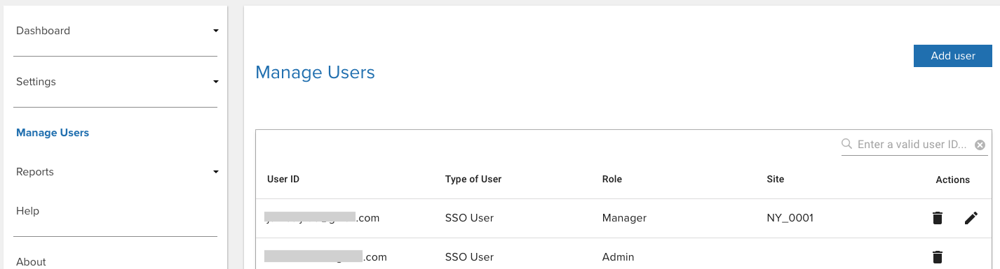

_Device Tracker web portal_

### Add User

Follow one of the procedures below to add a user based on whether or not SSO is activated.

#### SSO User

If SSO is activated, follow these steps to add admin or manager user accounts as SSO users:

1. Log in to the web portal as an administrator.
2. In the web portal, click **Manage Users** in the left menu.
3. Click **Add user** from the top right.
4. A message appears at the top indicating that SSO is active.
5. Select the user role:
   - **Admin -** Grants access to all sites; see [Administrator Role](#administratorrole).
   - **Manager -** Grants access to assigned site; see [Manager Role](#managerrole).
6. Enter the **User ID.** This must match the user ID from the SSO provider.
7. If adding a Manager role, in the **Select Site** dropdown, select the site to assign.
8. Click **Add user.** The new user is added to the user table.
    

#### Non-SSO User

If SSO is not activated, follow these steps to add admin or manager user accounts as non-SSO users:

1. Log in to the web portal as an administrator.
2. In the web portal, click **Manage Users** in the left menu.
3. Click **Add user** from the top right.
4. A message appears at the top indicating that SSO is inactive.
5. Select the user role:
   - **Admin -** Grants access to all sites; see [Administrator Role](#administratorrole).
   - **Manager -** Grants access to assigned site; see [Manager Role](#managerrole).
6. Enter the **User ID** based on the following guidelines:
   - Must be a valid email
   - Maximum length: 255 characters
   - Special characters allowed prior to '@': `! ~ # $ % ^ & * - _ + = {} | ' / ?`
   - Characters allowed after '@': `. -`
   - Spaces are not allowed
   - '@' character is only allowed once
   - '.' is only allowed in the middle of alphanumeric characters before and after '@'.
7. If adding a Manager role, in the **Select Site** dropdown, select the site to assign.
8. Click **Add user.** The new user is added to the user table.
    

### Delete User

To delete an admin or manager user account:

1. Log in to the web portal as an administrator.
2. From the web portal, tap **Manage Users** in the left menu.
3. From the list of users, locate the user to delete and click on the _delete icon_ next to the user.
4. Click **OK** in the confirmation message.
    

### Edit User

To edit the site to which a manager is assigned:

1. Log in to the web portal as an administrator.
2. From the web portal, tap **Manage Users** in the left menu.
3. From the list of users, locate the manager to edit and click on the _edit icon_ next to the user.
4. From the dropdown, select the new site to assign the manager. Click **Save.**
5. The table displays the new site the manager is assigned.
    

### Search User

Administrators or managers can be searched based on user ID. To search for a user:

1. Log in to the web portal as an administrator or manager.
2. From the web portal, tap **Manager Users** in the left menu.
3. Enter the user ID to search for in the search field located below the **Add User** button from the top right of the page. Press the enter key.
4. The search results are displayed. If searching for an email address for non-SSO users, the entire email address must be entered.

 

### Reset Password

The password is set or reset through the web portal.

Steps to set or reset the password:

1. From the web portal login page, click **Forgot your password.**
   
2. Enter your email address then click **Reset Password.**
3. A message appears indicating a password reset email is sent.
4. Open the email and click on the link.
5. Enter the new password based on the following guidelines:
   - Minimum length: 6 characters
   - Any combination of letters, numbers and symbols (ASCII-standard characters) are accepted.
6. The password is reset with the new password.

---

## Manage Sites

Administrators register sites to designate specific locations within an organization. Add, modify, or delete sites by importing a .CSV file with the site information. Or, add sites manually through the dashboard.

#### CSV File

A sample .CSV file is supplied by Zebra for the administrator to populate with the appropriate data. Importing data either modifies or adds entries to the existing database, unless deleting a site, which removes the site record. The data fields are:

<table class="facelift" style="width:100%" border="1" padding="5px">
  <tr bgcolor="#dce8ef">
    <th style="text-align:center">Data</th>
    <th style="text-align:center">Description</th>
    <th style="text-align:center">Required</th>
  </tr>
  <tr>
    <td style="text-align:center">SiteName</td>
    <td style="text-align:left">Site name or location.  Supported characters are alphanumeric. Special supported characters: <code>_-@%&*!+^()=?:</code>
    </td>
    <td style="text-align:left">Yes</td>
  </tr>
  <tr>
    <td style="text-align:center">timeZone</td>
    <td style="text-align:left">Time zone of site location. Time zone is case-sensitive, see supported <a href="./time-zone">Time Zones</a>.</td>
    <td style="text-align:left">Yes</td>
  </tr>
  <tr>
    <td style="text-align:center">scheduledReportTime</td>
    <td style="text-align:left">Specified time to generate the daily <i><a href="../dashboard/#endofdaydevicesummary">End of Day Report</a></i> to the specified recipients in the <i>emailList</i> field. The cron time expression used follows a <code>* * * * *</code> format where only the first 2 parameters are required: 
    &nbsp;&nbsp;&nbsp;&nbsp;• The first parameter sets the minute. Valid values are 0 or 30, allowing the report to be sent on the hour or half hour. 
    &nbsp;&nbsp;&nbsp;&nbsp;• The second parameter sets the hour from 0 to 23 in 24-hour military time. 
    For example <code>30 21 * * *</code> generates a report at 9:30 PM. </td>
    <td style="text-align:left">Yes</td>
  </tr>
  <tr>
    <td style="text-align:center">EmailSubscribed</td>
    <td style="text-align:left">Indicates whether users are subscribed to receive the <i>End of Day Report.</i> Value: TRUE/FALSE</td>
    <td style="text-align:left">Optional</td>
  </tr>
  <tr>
    <td style="text-align:center">emailList</td>
    <td style="text-align:left">A comma separated list of email addresses to receive the <i>End of Day Report.</i></td>
    <td style="text-align:left">Optional</td>
  </tr>
  <tr>
    <td style="text-align:center">snapshotReportCategories</td>
    <td style="text-align:left">A comma-separated list of categories or device states to report for the <i>End of Day Report.</i> The category names are not case senstive. An example of a comma-separated category list:  To Be Found,Being Found,Cannot Find,Charging,Discharging,Low Battery,Idle,Checked Out,Disconnected,Never Connected,Decommissioned,Moveinout</i></td>
    <td style="text-align:left">Optional</td>
  </tr>
  <tr>
    <td style="text-align:center">attachCSV</td>
    <td style="text-align:left">Indicates whether report attachments are added to the email for the <i>End of Day Report.</i> Value: TRUE/FALSE</td>
    <td style="text-align:left">Optional</td>
  </tr>
  <tr>
    <td style="text-align:center">startIPAddress</td>
    <td style="text-align:left">Specifies the start IP address range for the site. This applies if <b>IP Address Range</b> is configured for <b>Device-to-Site Assignment</b> under Settings > Registration in the web portal.</i></td>
    <td style="text-align:left">Optional</td>
  </tr>
  <tr>
    <td style="text-align:center">endIPAddress</td>
    <td style="text-align:left">Specifies the end IP address range for the site. This applies if <b>IP Address Range</b> is configured for <b>Device-to-Site Assignment</b> under Settings > Registration in the web portal.</i></td>
    <td style="text-align:left">Optional</td>
  </tr>
</table>

 
Sample .CSV file content (**Note:** There should be no spaces between fields or after commas):
     
        SiteName,timeZone,scheduledReportTime,EmailSubscribed,emailList,snapshotReportCategories,attachCSV,startIPAddress,endIPAddress 
        New York,America/New_York,30 21 * * ,TRUE,admin@my_company.com,"To Be Found,Being Found,Cannot Find,Low Battery,Disconnected,Never Connected,Decommissioned,Moveinout",TRUE,10.30.1.50,10.30.1.100

When modifying the .CSV file, keep the header information intact and replace the sample data with the appropriate data desired. It is particularly important for the AP location friendly name to be easily understood for users to determine the location within the facility when finding a device. The .CSV file cannot be UTF-8 encoded, otherwise an error can occur; it must be saved in a normal comma separated values format.

### Add Sites

Register sites either manually or by uploading the .CSV file.

#### Manual

To register sites manually:

1. Log into the web portal as an administrator.
2. From the left menu, under **Dashboard** select **Sites.**
3. Click **Manage.** From the dropdown, select **Add.**
   
4. Select **Manual** and click **Continue.**
   
5. Provide the following:
   - **Site -** site name
   - **Start IP Address -** start IP address for range of IP addresses assigned to the site; [IP Address Range Configuration](../config/#devicetositeassignment) must be enabled.
   - **End IP Address -** end IP address for range of IP addresses assigned to the site; [IP Address Range Configuration](../config/#devicetositeassignment) must be enabled.
   - **Timezone -** select the local time zone of the site
   - **Subscribe Reports via Email -** if enabled, sends an email with the [End of Day snapshot report](../dashboard/#endofdaydevicesummary) to designated managers and administrators
     - **Generate EOD Report(s) At -** select the local time for the End of Day report to be generated, providing a snapshot device report at the specified time
     - **Email Recipient List -** email addresses of the recipients to receive the End of Day report, each email address separated by a comma
   - **Report Options -** select the device states to report for the [End of Day snapshot report](../dashboard/#endofdaydevicesummary):
     - **Select All -** selects all options
     - **Being Found**
     - **Cannot Find**
     - **Charging**
     - **Checked Out**
     - **Decomissioned**
     - **Discharging**
     - **Disconnected**
     - **Found**
     - **Idle**
     - **Low Battery**
     - **Moved Out/In Site(s)**
     - **Never Connected**
     - **To Be Found**
   - **Include Attachments -** if enabled, sends report attachments to email as CSV files, 1 file per device state selected from the Report Options
     
6. Click **Confirm**. The new site is added.

#### Upload CSV

To register sites by uploading the .CSV file:

1. Log into the web portal as an administrator.
2. From the left menu, under **Dashboard** select **Sites.**
3. Click **Manage.** From the dropdown, select **Add.**
   
4. Select **Upload CSV** and click **Continue.**
   
5. Click **Select files** and browse to the desired .CSV file, or drag and drop the .CSV file.
   
6. The selected file name is displayed. Click **Import.**
7. If successful, a message appears indicating the import was successful.

### Modify Sites

Modify sites either manually or by uploading the .CSV file.

#### Manual

To modify a site manually:

1. Log into the web portal as an administrator.
2. From the left menu, under **Dashboard** select **Sites.**
3. Check the box next to the site to modify. The **Actions** menu appears. Click **Actions** and from the dropdown, select **Modify Details.**
   
4. Provide the following:
   - **Timezone -** select the local time zone of the site
   - **Email subscribed -** if enabled, sends an email with the [End of Day snapshot report](../dashboard/#endofdaydevicesummary) to designated managers and administrators
     - **Scheduled Report Time -** select the local time for the End of Day report to be generated, providing a snapshot device report at the specified time
     - **Email List -** email addresses of the recipients to receive the End of Day report, each email address separated by a comma
   - **Email Criteria -** select the device states to report for the [End of Day snapshot report](../dashboard/#endofdaydevicesummary)
   - **Include Attachments -** if enabled, sends report attachments to email as CSV files, 1 file per device state selected from the Email Criteria
     
5. Click **Confirm**. The site is updated.

#### Upload CSV

Modify sites by uploading the .CSV file containing the modified information:

1. Log into the web portal as an administrator.
2. From the left menu, under **Dashboard** select **Sites.**
3. Click **Manage.** From the dropdown, select **Modify.**
   
4. Click **Select files** and browse to the desired .CSV file, or drag and drop the .CSV file.
   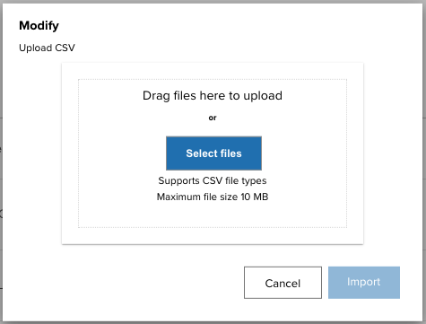
5. The selected file name is displayed. Click **Import.**
6. If successful, a message appears indicating the import was successful.

### Delete Sites

Delete sites either manually or by uploading the .CSV file.

#### Manual

To delete a site manually:

1. Log into the web portal as an administrator.
2. From the left menu, under **Dashboard** select **Sites.**
3. Check the box next to the site to modify. The **Actions** menu appears. Click **Actions** and from the dropdown, select **Delete.**
   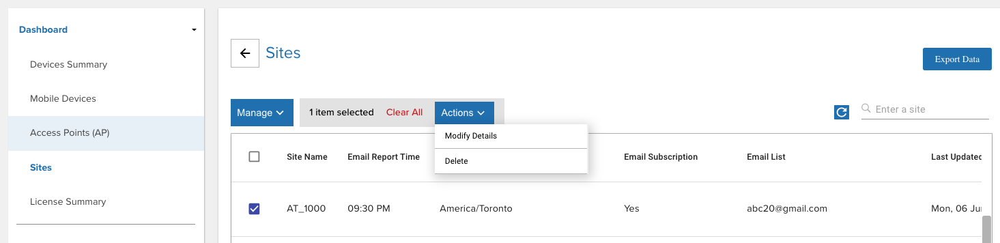
4. Click **Confirm**. The site is deleted.

#### Upload CSV

To delete sites from the database, upload a .CSV file containing one or more AP sites information to remove.

1. Log into the web portal as an administrator.
2. From the left menu, under **Dashboard** select **Access Points.**
3. Click **Manage.** From the dropdown, select **Delete.**
   
4. Select **Upload CSV** and click **Continue.**
   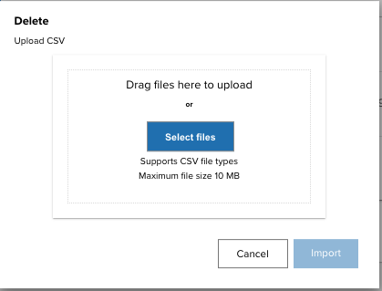
5. Click **Select files** and browse to the desired .CSV file, or drag and drop the .CSV file.
   
6. The selected file name is displayed. Click **Import.**
7. If successful, a message appears indicating the import was successful.

---

## Manage Access Points

Register access points with friendly names to aid in identifying device location within a site when finding devices. Add, modify, or delete APs either manually or by importing a .CSV file with the AP information through the web portal.

#### CSV File

A sample .CSV file is supplied by Zebra for the administrator to populate with the appropriate data. Importing data either modifies or adds entries to the existing database, unless deleting an AP, which removes the AP record. The data fields are:

<table class="facelift" style="width:100%" border="1" padding="5px">
  <tr bgcolor="#dce8ef">
    <th style="text-align:center">Data</th>
    <th style="text-align:center">Description</th>
    <th style="text-align:center">Required</th>
  </tr>
  <tr>
    <td style="text-align:center">SiteName</td>
    <td style="text-align:left">Site name or location.  Supported characters are alphanumeric. Special characters supported: <code>_-@%&*!+^()=?:</code>
    </td>
    <td style="text-align:left">Yes</td>
  </tr>
  <tr>
    <td style="text-align:center">BSSID</td>
    <td style="text-align:left">Access point MAC address. A wildcard character "*" is acceptable for the last digit of the last octet to register multiple APs at once which have the same MAC address aside from the last digit. For example: <code>14:a7:2b:24:cc:a*</code></td>
    <td style="text-align:left">Yes</td>
  </tr>
  <tr>
    <td style="text-align:center">AssetName</td>
    <td style="text-align:left">Name used by IT admin for drawings, labeling of hardware, etc.  <i></td>
    <td style="text-align:left">Optional</td>
  </tr>
  <tr>
    <td style="text-align:center">LocationFriendlyName</td>
    <td style="text-align:left">Access point location friendly name, useful to identify general device location.  Supported characters are alphanumeric. Special supported characters: <code>&gt;&lt;:_-@#$%&*!+.^()[]=?</code>
    </td>
    <td style="text-align:left">Yes</td>
  </tr>
</table>

Sample AP .CSV file content:

        SiteName,BSSID,AssetName,LocationFriendlyName
        New York,14:a7:2b:24:cc:a5,Inventory#1,Back Area

When modifying the .CSV file, keep the header information intact and replace the sample data with the appropriate data desired. It is particularly important for the AP location friendly name to be easily understood for users to determine the location within the facility when finding a device. The .CSV file cannot be UTF-8 encoded, otherwise an error can occur; it must be saved in a normal comma separated values format.

### Add Access Points

Register access points either manually or by uploading the .CSV file.

#### Manual

To register access points manually:

1. Log into the web portal as an administrator.
2. From the left menu, under **Dashboard** select **Access Points.**
3. Click **Manage.** From the dropdown, select **Add.**
   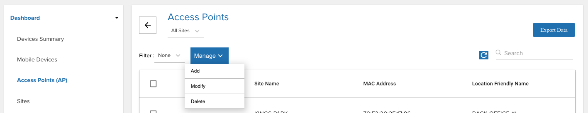
4. Click **Manual.**
   
5. Provide the following information:
   - **Site -** Select site location of AP or enter the site name in the search field. A limited number of sites is listed in the dropdown. If needed, see [Manage Sites](#managesites) for the site name.
   - **MAC Address -** Enter MAC address of AP. A wildcard character "_" is acceptable for the last digit of the last octet to register multiple APs at once which have the same MAC address aside from the last digit. For example: <code>14:a7:2b:24:cc:a_</code>
   - **Asset Name -** (Optional) Enter asset name used by IT admin for drawings, labeling of hardware, etc.
   - **AP Location -** Enter location friendly name, useful to identify general device location
     
6. Click **Continue.** The AP is added.

#### Upload CSV

To register access points, add the AP information to the .CSV file then follow these steps to import the file:

1. Log into the web portal as an administrator.
2. From the left menu, under **Dashboard** select **Access Points.**
3. Click **Manage.** From the dropdown, select **Add.**
   
4. Select **Upload CSV** and click **Continue.**
   
5. Click **Select files** and browse to the desired .CSV file, or drag and drop the .CSV file.
   
6. The selected file name is displayed. Click **Import.**
7. If successful, a message appears indicating the import was successful.

### Modify Access Points

Modify access points either manually or by uploading the updated .CSV file.

#### Manual

To modify an access point manually:

1. Log into the web portal as an administrator.
2. From the left menu, under **Dashboard** select **Access Points.**
3. Check the box next to the AP to modify. The **Actions** menu appears. Click **Actions** and select one of the following from the dropdown depending on the desired action:
   - **Modify Site -** Select the site to reassign the AP
   - **Modify Details -** Modify AP information.
     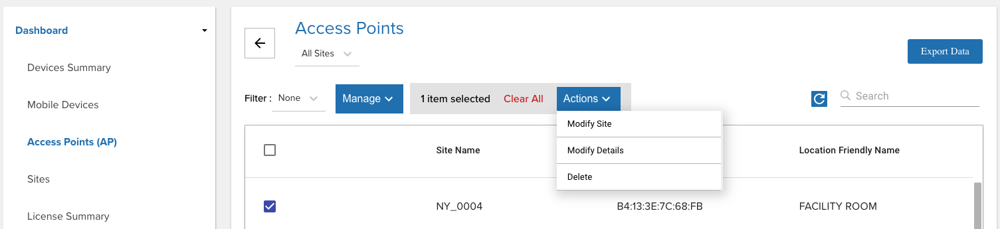
4. If **Modify Site** is selected, select or enter the site to reassign the AP. A limited number of sites are listed. For the full site list, see [Manage Sites](#managesites).
   
5. If **Modify Details** is selected, perform the following:
   - **Asset Name -** Enter the new asset name for the AP
   - **AP Location -** Enter the new location name for the AP
     
6. Click **Confirm.** The AP is modified.

#### Upload CSV

To modify existing access points, upload a .CSV file containing one or more APs with the modified information.

1. Log into the web portal as an administrator.
2. From the left menu, under **Dashboard** select **Access Points.**
3. Click **Manage.** From the dropdown, select **Modify.**
   
4. Select **Upload CSV** and click **Continue.**
   
5. Click **Select files** and browse to the desired .CSV file, or drag and drop the .CSV file.
   
6. The selected file name is displayed. Click **Import.**
7. If successful, a message appears indicating the import was successful.

### Delete Access Points

Delete access points either manually or by uploading the modified .CSV file.

#### Manual

To delete an access point manually:

1. Log into the web portal as an administrator.
2. From the left menu, under **Dashboard** select **Access Points.**
3. Check the box next to the AP to delete. The **Actions** menu appears. Click **Actions** and selete **Delete** from the dropdown.  
   
4. Click **Confirm.** The AP is updated.

#### Upload CSV

To delete APs from the database, upload a .CSV file containing one or more AP information to remove.

1. Log into the web portal as an administrator.
2. From the left menu, under **Dashboard** select **Access Points.**
3. Click **Manage.** From the dropdown, select **Delete.**
   
4. Select **Upload CSV** and click **Continue.**
   
5. Click **Select files** and browse to the desired .CSV file, or drag and drop the .CSV file.
   
6. The selected file name is displayed. Click **Import.**
7. If successful, a message appears indicating the import was successful.

---

## Manage Devices

Administrators register device information along with friendly names and site assignments to aid in identifying, tracking and locating devices. Device registration can be performed manually or by uploading a .CSV file. An alternative to assign a device to a site is through [automatic assignment of a device to a site](#devicetositeassignment) based on the AP the device is connected to.

#### CSV File

Add, modify, or delete devices by importing a .CSV file with the device information through the web portal. Or manually add devices through the dashboard. A sample .CSV file is supplied by Zebra for the administrator to populate with the appropriate data. Importing data either modifies or adds entries to the existing database, unless deleting a device, which removes the device record. The data fields are:

<table class="facelift" style="width:100%" border="1" padding="5px">
  <tr bgcolor="#dce8ef">
    <th style="text-align:center">Data</th>
    <th style="text-align:center">Description</th>
    <th style="text-align:center">Required</th>
  </tr>
  <tr>
    <td style="text-align:center">ModelNumber</td>
    <td style="text-align:left">Device model</td>
    <td style="text-align:left">Yes</td>
  </tr>
  <tr>
    <td style="text-align:center">SerialNumber</td>
    <td style="text-align:left">Device serial number</td>
    <td style="text-align:left">Yes</td>
  </tr>
  <tr>
    <td style="text-align:center">DeviceFriendlyName</td>
    <td style="text-align:left">Name used to identify device.  Supported characters are alphanumeric. The following are supported special characters: <code>_-@#$%&*!+.^()[]=?&gt;&lt;:</code>
    </td>
    <td style="text-align:left">Optional</td>
  </tr>
  <tr>
    <td style="text-align:center">SiteName</td>
    <td style="text-align:left">Site name or location where the device is assigned, useful when finding a device. Alternatively, automatically assign sites based on the AP the device is connected to, see <a href="#devicetositeassignment">Device-to-Site Assignment</a>. Supported characters are alphanumeric. The following are supported special characters: <code>_-@%&*!+^()=?&gt;&lt;:</code> 
    </td>
    <td style="text-align:left">Optional</td>
  </tr>
</table>
 
Sample device .CSV file content:

<pre class="prettify">
    <code>
        ModelNumber,SerialNumber,DeviceFriendlyName,SiteName
        TC51,17009522509812,Inventory1,Chicago
        TC51,17009522509813,Inventory2,Los Angeles
    </code>
</pre>

When modifying the .CSV file, keep the header information intact and replace the sample data with the appropriate data desired. The .CSV file cannot be UTF-8 encoded, otherwise an error can occur; it must be saved in a normal comma separated values format.

### Enroll Devices

<u>**Enrollment is a required step for preparing a site to use Device Tracker**</u>; it configures devices to communicate with the organization's Device Tracker server instance. **All devices must be enrolled before they can be found by Device Tracker or be used for finding other devices**.

**Devices can be enrolled**...

- **Manually**, by scanning a barcode with the device being enrolled  
  **_~OR~_** 
- **Remotely**, by pushing an XML file via EMM to a fleet of devices being enrolled

> <i class="fa fa-exclamation-triangle" style="color:#FFA500;"></i> **Separate enrollment barcodes are needed for Android 13 (or later) and Android 11 (or earlier)**. See below.  > <i class="fa fa-check-circle" style="color:#27AE60;"></i> **The enrollment XML file is supported by Zebra devices running any Android version**.

**As part of Zebra's Device Tracker on-boarding process**, an enrollment barcode is emailed to the requester or administrator. Device Tracker 5.5 (and later) allows admins to download a more complete enrollment set of files:

_Click image to enlarge; ESC to exit_.
 

**The "Kit"** (a `.zip` archive) **contains two files**:

- `DT_EnrollmentBarcode.pdf` with two barcode types:
- **PDF417** enrolls devices running **Android 11 or OLDER**
- **PDF417JS** enrolls devices running **Android 13 or NEWER**
- `DT_EnrollmentforEMM.xml`:
- Push with an EMM system to **enroll devices running any Android version**

### Add Devices

Register devices either manually or by uploading the .CSV file to the Device Tracker server instance.

#### Manual

To register devices manually:

1. Log into the web portal as an administrator.
2. From the left menu, under **Dashboard** select **Mobile Devices.**
3. Click **Manage.** From the dropdown, select **Add.**
   
4. Select **Manual** and click **Continue.**
   
5. Provide the following information:
   - **Site -** Select the site to assign the device
   - **Model Number -** Enter the model number of the device
   - **Serial Number -** Enter the unique serial number of the device
   - **Device Name -** Enter the friendly name used to identify the device e.g. this can be based on user role
     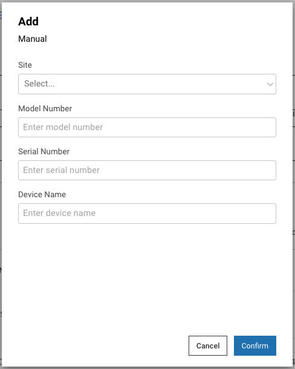
6. Click **Confirm.** The device is added.

#### Upload CSV

To register devices by uploading the .CSV file, add the device information to the .CSV file then follow these steps to import the file:

1. Log into the web portal as an administrator.
2. From the left menu, under **Dashboard** select **Mobile Devices.**
3. Click **Manage.** From the dropdown, select **Add.**
   
4. Select **Upload CSV** and click **Continue.**
   
5. Click **Select files** and browse to the desired .CSV file, or drag and drop the .CSV file.
   
6. The selected file name is displayed. Click **Import.**
7. If successful, a message appears indicating the import was successful.

### Modify Devices

Modify devices either manually or by uploading the .CSV file.

#### Manual

To modify a device manually:

1. Log into the web portal as an administrator.
2. From the left menu, under **Dashboard** select **Mobile Devices.**
3. Check the box next to the device to modify. The **Actions** menu appears.
4. From the **Actions** dropdown, select the desired action based on the Edit or Tracking category (options may vary depending on the state of the device):
   
   **Edit:**

   - **Site -** Assign the device to a selected site.
   - **Access Point Friendly Name -** Change the friendly name of the access point the device is connected to.
   - **Device Name -** Change the user friendly device name.
   - **Delete Device -** Delete the device record.

   **Tracking:**

   - **Mark Device for Finding -** This changes the device(s) status to **To Be Found**, placing the device in the **To Be Found** list used in the device search process.
   - **Mark Device as InService -** The device status is changed from **To Be Found** back to **In Service.**
   - **Checkin Device -** Checks in the [checked out](#checkout) device(s).
   - **Add Notes -** A dialog box appears prompting to enter notes or comments for the selected device(s).
   - **Decommission Device -** Removes the device(s) from the active device pool and places it out-of-service with the [Decommissioned](#decommissionadevice) status.
   - **Recommission Device -** Changes the device(s) status from the **Decommissioned** state (i.e. removed from the active device license pool) and [recommissions](#recommissionadevice) the device back to the **In Service** state.
   - **Start Finding -** Begins the device search process. Refer to [Find a Device](../use/#findadevice). This is visible only if the device is marked **To Be Found.** During the device search, click one of the following when appropriate:
     - **Stop Finding -** Stops the device search process; changes the state of the device from **Being Found** back to **To Be Found** so another device can initiate the finding process.
     - **Play Sound -** Emits a sound from the device being located; listen and follow the sound to locate the device.
     - **Found -** Indicates the device is successfully located after conducting the device search.
     - **Cannot Find -** Indicates the device could not be found after the search was conducted

5. Click **Confirm.** The device is updated.

#### Upload CSV

To modify existing registered devices, upload a .CSV file containing one or more devices with the modified information.

1. Log into the web portal as an administrator.
2. From the left menu, under **Dashboard** select **Mobile Devices.**
3. Click **Manage.** From the dropdown, select **Modify.**
   
4. Select **Upload CSV** and click **Continue.**
   
5. Click **Select files** and browse to the desired .CSV file, or drag and drop the .CSV file.
   
6. The selected file name is displayed. Click **Import.**
7. If successful, a message appears indicating the import was successful.

### Delete Devices

Delete devices either manually or by uploading the .CSV file.

#### Manual

To delete a device manually:

1. Log into the web portal as an administrator.
2. From the left menu, under **Dashboard** select **Mobile Devices.**
3. Check the box next to the device to delete. The **Actions** menu appears.
4. From the **Actions** dropdown, select the **Delete Device**:
   
5. Click **Confirm.** The device is deleted.

#### Upload CSV

To delete devices from the database, upload a .CSV file containing the device(s) information to remove. Device Tracker should be uninstalled before deleting the device record.

1. Log into the web portal as an administrator.
2. From the left menu, under **Dashboard** select **Mobile Devices.**
3. Click **Manage.** From the dropdown, select **Modify.**
   
4. Select **Upload CSV** and click **Continue.**
   
5. Click **Select files** and browse to the desired .CSV file, or drag and drop the .CSV file.
   
6. The selected file name is displayed. Click **Import.**
7. If successful, a message appears indicating the import was successful.

<!--
> The next version of Device Tracker will support device registration via .CSV file import within the web portal and will no longer be available in the client app.

### Import Devices

Import device data to register the device information from the populated .CSV file. A maximum of 20,000 rcords can be imported at one time.

**To import the device .CSV file to add/modify device data:**

1. Copy the populated .CSV file containing device data from the PC to the device root `\Internal shared storage` folder.
2. In the client app, log in as the admin. In the main screen, tap on the options menu at the top right and select **Admin/Manager Login.** Enter the Administrator credentials and tap **Login.**
3. Tap the top right options menu and select **Settings,** which is now visible.
4. Tap **Import Access Points/Sites/Devices.**
5. Under the section **Import Device CSV File,** tap **Browse File.** Browse and select the appropriate .CSV file.
6. Under the section **Import Device CSV File,** tap **Upload CSV.**
7. The device data import is complete. Results are displayed in the **Status** section at the bottom of the screen.

New devices imported are initially in the <b>Never Connected</b> state until the Device Tracker app is installed on the devices, configured and communicating with the server.

### Delete Devices

Deleting a device removes device data from the Device Tracker solution after uninstalling the client app. When a device is deleted, the license is deallocated and released to the license pool. A maximum of 5,000 records can be removed at one time.

<b>Prerequisite:</b> Prior to deleting a device, uninstall the Device Tracker application on the device.

**To import the device .CSV file to delete a device:**

1. Copy the .CSV file containing the removed device record from the PC to the device root `\Internal shared storage` folder.
2. In the client app, log in as the admin. In the main screen, tap on the options menu at the top right and select **Admin/Manager Login.** Enter the Administrator credentials and tap **Login.**
3. Tap the top right options menu and select **Settings,** which is now visible.
4. Tap **Import Access Points/Sites/Devices.**
5. Under the section **Import Delete Device CSV File,** tap **Browse File.** Browse and select the appropriate .CSV file.
6. Under the section **Import Delete Device CSV File,** tap **Upload CSV.**
7. The specified device data is removed from the system. Results are displayed in the **Status** section at the bottom of the screen.
Sample Delete Device .CSV file content:

<pre class="prettify">
    <code>
        ModelNumber,SerialNumber
        TC51,17009522509812
        TC51,17009522509813
    </code>
</pre>

When modifying the .CSV file, keep the header information intact and replace the sample data with the appropriate data desired. It is particularly important for the AP location friendly name to be easily understood for users to determine the location within the facility when finding a device. The .CSV file cannot be UTF-8 encoded, otherwise an error can occur; it must be saved in a normal comma separated values format. 
-->

---

## Registration

Registration of devices, access points, and sites is required for device tracking. Options are available to control device-to-site assignment and restrict managers from modifying devices and access points.

To access Registration options:

1. Log in to the web portal as an administrator.
2. Click on **Settings.**
3. Under Settings, click **Registration.**

_Registration screen_

Registration options:

- **Allow managers to modify Device Name -** If enabled, permits managers to edit device names through their [dashboard](../dashboard/#managerdashboard).
- **Allow managers to modify Access Points -** If enabled, permits managers to edit access points through their [dashboard](../dashboard/#managerdashboard).

Shortcut links:

- **Add or modify mobile devices -** Opens _Dashboard > [Mobile Devices](#mobiledevices)_ view from the left menu in the web portal.
- **Add or modify access points -** Opens _Dashboard > Access Points_ view from the left menu in the web portal.
- **Add or modify sites -** Opens _Dashboard > Sites_ view from the left menu in the web portal.

### Device-to-Site Assignment

Devices can be assigned to sites either manually, based on the CSV file upload, or automatically, based on the AP the device is connected to.

To select the method of device registration:

1. Log in to the web portal as an administrator.
2. Click **Settings** from the left menu.
3. Under Settings, click **Registration.**
   
4. Under **Device-to-Site Assignment.** select the desired device registration method:  
   a. **Manually assign devices to a site via CSV upload (default)** Manually assign sites to devices by uploading a CSV file that includes the site name for the device to be assigned, see [Import Devices](#importdevices).  
   b. **Automatically assign devices to a Connected AP's site** <i>Prerequisite:</i> [Register the site to an AP.](#registeraccesspointssites) When the device connects to an AP, the device is automatically assigned a site name based on the AP it is connected to, provided the AP is registered with a site. If there is no site assigned to the AP, then no site name is assigned to the device and the device is listed under [Unassigned Devices](../use/#deviceinformation) in the site list.  
   c. **IP Address Range Configuration** Allow an IP address range (IPV4) to be defined for a specific site. The device is automatically assigned to that site if its IP address falls within that range. Go to [Manage Sites](#managesites) to specify the IP address range for a site. Once a device is assigned to a site, it will not become unassigned unless there is manual intervention, e.g. when decommissioning the device.
   - If a device is previously within range of a site and moves to another site whose range is not specified, it remains assigned to the original site.
   - If a device is disconnected, it remains assigned to the previous site.
5. Click **Save.**

**Note:** If the option to automatically assign devices is enabled, it overwrites the sites that are manually assigned via CSV file upload and any further CSV uploads cannot take into effect.

<iframe width="560" height="315" src="https://www.youtube.com/embed/lzA20gDz-0k" title="YouTube video player" frameborder="0" allow="accelerometer; autoplay; clipboard-write; encrypted-media; gyroscope; picture-in-picture; web-share" allowfullscreen></iframe>

_Video: Learn how to configure the IP address range for devices to be automatically assigned to a site upon device registration._

 

---

## Checkin/Checkout Device

Device Checkin/Checkout is an _optional_ feature that maintains user accountability of the device, associating the device to the user that checks out the device. When enabled, a user cannot access the device until either scanning a user barcode or entering SSO credentials (if SSO is activated and ELS is installed) to checkout the device.

Checkin/Checkout scenarios:

- **Checkout:** At the start of a work shift, the user checks-out the device by scanning their unique barcode or entering the SSO user credentials. This associates the user with the device, which is visible in the [device information](../use/#deviceinformation).
- **Checkin:** At the end of a work shift, the user checks-in the device depending on the [Device Checkin Option](../config/#devicecheckinoptions) selected. After checkin, the user is no longer associated with the device.

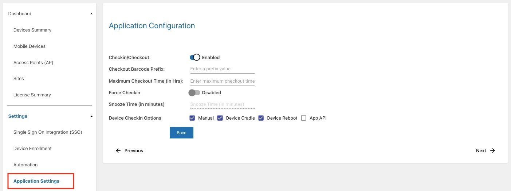

_Configure Checkin/Checkout_

See the following subsections for more information on each of the Checkin/Checkout options.

### Enable Checkin/Checkout

Checkin/Checkout is disabled by default. To enable device checkout, access the web portal by entering the URL provided by Zebra in a [supported browser](../setup/#webportalrequirements).

1. Log in to the web portal as an administrator.
2. Click **Settings** in the left menu.
3. Under Settings, click **Checkin/Checkout.**
4. Enable **Checkin/Checkout**. Related options are displayed and described in the sections that follow.

### Checkout Barcode Prefix

_(Optional)_ When barcode scanning is used for checkin/checkout (SSO is not activated), a barcode prefix can be specified to restrict checkout to only scan barcodes that begin with the specified prefix in the form of a character string. If the barcode scanned does not contain the prefix, checkout is not successful. [Checkin/Checkout](#enablecheckincheckout) must be enabled. Keep this field blank to accept all barcodes without a prefix.

When generating a barcode with the prefix, the specified prefix is followed by the username identifier. The following is a sample barcode containing prefix “NGDTRK-” and username “JohnDoe”:

_Sample barcode with prefix and username: "NGDTRK-JohnDoe"_

### Maximum Checkout Time

_(Optional)_ Enter the maximum time (in hours) for the device to be checked out when [Checkin/Checkout](#enablecheckincheckout) is enabled. When the specified time elapses, both the checked-out device user name and the amount of time the user is checked out is flagged in red on the device dashboard, providing visibility to the administrator.

_Maximum Checkout Time_ is affected by the option **[Automatically Mark Devices "To Be Found"](#configureautomationsettings)** based on the rule that includes "maximum checkout time reached". To automatically force the device to checkin when reaching the **Maximum Checkout Time,** see [Force Checkin](#forcecheckin)

_Maximum checkout time reached_

#### Force Checkin

_(Optional)_ **Force Checkin** automatically checks in devices when the maximum checkout time is reached. This applies when SSO is in use with Enterprise Login Screen. When the specified **Maximum Checkout Time** is reached, the device user is warned with a notification alert that the device will be checked in after the snooze time is elapsed. After the device reaches the snooze time, it is automatically checked in. This is useful if the user forgets to checkin the device after the work shift. It is required for **[Snooze Time](#snoozetime)** to be specified.

##### Snooze Time

**Snooze Time** specifies the amount of time (in minutes) to extend the **Maximum Checkout Time.** This is mandatory if **Force Checkin** is enabled. When the **Maximum Checkout Time** is reached, an alert notification is sent to the device warning the user that the device will be checked in after the specified snooze time elapses. This allows the user extra time to complete their task when the **Maximum Checkout Time** is reached.

### Device Checkin Options

Select one or more of the **Device Checkin Options** to specify the action that triggers a [device checkin](../use/#checkin) after a device is checked out:

- **Manual -** the user navigates to the options menu (top right) from the main screen of Device Tracker and selects **Check-In Device**
- **Device Cradle -** the user places the device on a powered cradle to checkin the device
- **Device Reboot -** the user reboots the device to checkin; required if Checkin/Checkout is enabled
- **App API -** device checkin can be integrated with the Line of Business (LOB) application by calling the Device Tracker checkin API when the user logs out from the LOB app. When the checkin request is received by Device Tracker, it performs the the device checkin and displays the device checkout screen for the next user to checkout the device. Add the following code in the LOB app to checkin the device:

        Intent signOutIntent = new Intent();
        signOutIntent.setAction("com.zebra.mdna.devicetrackercloud.SIGNOUT_OF_DEVICE");
        signOutIntent.setPackage("com.zebra.mdna.devicetrackercloud");
        sendBroadcast(signOutIntent);

After device checkin from any of the above methods, the checkout screen appears prompting the user to scan a barcode to gain device access. By default, the first 3 options are selected and App API is unselected.

---

## Automation

Device Tracker can be configured to automatically change device states when specific conditions are met or certain thresholds are reached. For example, devices can be automatically marked **To Be Found** if they are checked out, low in battery, and not charging. This proactively allows the device to be located prior to completely losing battery power and while potentially actively in use, preventing the need for an administrator to continually monitor devices and manually mark the devices.

The device must be connected to the Device Tracker server to receive automation settings. Changes to automation settings on the server cannot be applied to disconnected devices.

### Configure Automation Settings

To enable automation, set the related device thresholds and configuration:

1. Log in to the web portal as an administrator.
2. Click on **Settings.**
3. In Settings, click on **Automation.**
   
4. Set the **Device Thresholds:**

   - **Low battery threshold -** Specify the percentage (%) of battery capacity when the device reaches the Low Battery condition. If no value is specified, it defaults to the device’s low battery threshold.
   - **Device idle -** Enable this option to track a device when it is stationary, or it has not physically moved. Specify the amount of time (in minutes) for the device to remain stationary before it is considered Idle. Default value: 15; minimum value: 5; maximum value: 10000.
   - **Maximum checkout time -** Set the maximum checkout time (in hours). When the set time is reached, the device is flagged in red on the dashboard for visibility to the administrator. See [Maximum Checkout Time](#maximumcheckouttime).

5. **Automatically Mark Devices "To Be Found" -** Enable this option and select the state(s) or combination of states for the device to be automatically marked "To be Found" when the selected state(s) is reached, rather than performing this manually. If a combination of states are selected, _all conditions_ must be met for the device to be automatically marked **To Be Found.** If the selected state(s) is not reached, the device remains off the **To Be Found** list. Available states and combination of states:

   - Checked out, low battery and not charging
   - Checked out, low battery, not charging and idle
   - Checked out and maximum checkout time reached
   - Checked in, low battery and not charging
   - Low battery and not charging
   - Low battery, idle and not charging
   - Idle and not charging
   - Disconnected

   After a device has been automatically marked **To Be Found** based on the above selection, if the device state changes and no longer satisfies the selected state(s), then **To Be Found** is removed from the device.

   > <i class="fa fa-exclamation-triangle" style="color:#FFA500;"></i> **Important:** During the finding process, before marking the device as **Found,** <u><i>make sure one of the selected conditions is NOT satisfied</i></u> (e.g. checkin the device if **Checked out** is selected, or charge the device if "not charging" is selected). Otherwise, the device will return back to the **To Be Found** state after it is marked **Found.**

6. **Automatically place device "In Service" when marked "Found" -** Enable this option to automatically place the device back “In Service” after it is located and marked **Found.** This eliminates the need to manually perform this action.
7. **Automatically set "To Be Found" device to "In Service" upon checkout" -** Enable this option to automatically place the device back **In Service** when a device in the **To Be Found** state is checked out. There is no need for the device to remain in the **To Be Found** state since the user has checked out the device.
8. Click on **Save.**

<iframe width="560" height="315" src="https://www.youtube.com/embed/PpAZCBn170U" title="YouTube video player" frameborder="0" allow="accelerometer; autoplay; clipboard-write; encrypted-media; gyroscope; picture-in-picture; web-share" allowfullscreen></iframe>

_Video: Learn how to automatically set "To Be Found" device to "In Service" when the device is checked out_

---

## Notifications

There are 2 types of notifications:

- **[Lost Device Nearby](#lostdevicenearby)**
- **[Play Sound](#playsound)**

See the sections below for information on each.

### Lost Device Nearby

When a lost device is detected in close proximity, a _Lost Device Nearby_ notification event is triggered on the nearby device to alert the user. This is an optional feature that aids in device recovery by proactively sending alert notifications to a device when a lost device is detected within close proximity. The nearby device user can immediately take action to find the lost device. Alerts are sent as one or a combination of the following: audio, vibration, LED, and/or Android notification. See [Lost Device Nearby](../use/#lostdevicenearby) for information on its use.

<iframe width="560" height="315" src="https://www.youtube.com/embed/4gHb2IN4968" title="YouTube video player" frameborder="0" allow="accelerometer; autoplay; clipboard-write; encrypted-media; gyroscope; picture-in-picture" allowfullscreen></iframe>

_Video: Demonstration on automatically detecting lost devices nearby_

To enable this feature and configure its notification settings:

1. Log into the web portal as an administrator.
2. Click **Settings** in the left menu and click **Notifications.**
3. Click on the **Lost Device Nearby** tab.
   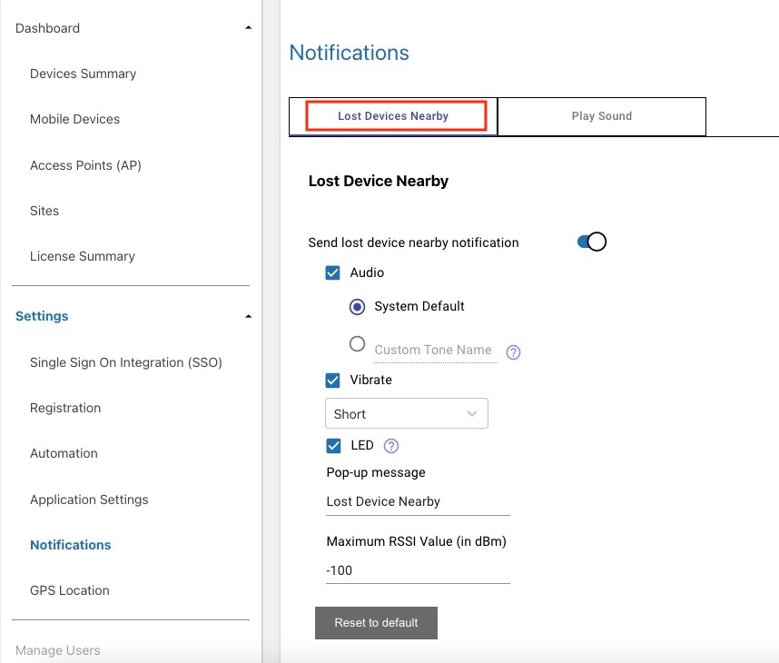
4. Toggle to enable the option **Send Lost Device Nearby Notification.** This option is disabled by default.
5. Select one or more of the following notifications to alert the user of a lost device detected within the vicinity:
   - **Audio -** If enabled, the device emits an audio sound. Select one of the following options to specify the sound emitted:
     - **System Default -** Emits the sound specified from the **Default notification sound** option in Android Sound settings.
     - **Custom Tone Name -** Enter the tone name that matches with a notification sound listed from **Default notification sound** in Android Sound settings on the device.
   - **Vibrate -** If enabled, the device vibrates based on the duration specified. Select one of the following durations:
     - System Default
     - Short
     - Medium
     - Long
   - **LED -** If enabled, an LED notification is emitted on the scanning device. The default LED is blue.
   - **Pop-up Message -** Define the content of the notification message to be displayed on the device that detects the misplaced device. By default, the message is: "Lost Device Nearby".
   - **Maximum RSSI Value (in dBm) -** Enter the maximum signal strength of the receiving beacon to detect when a device is within proximity. The higher the negative value, the further away the device can be detected. The lower the negative value, the shorter the distance the device can be detected. Due to multiple factors affecting beacon signal strength, it is required for this to be manually fine-tuned to your specific environment and devices. Zebra recommends to adjust this value based on your business needs. Default value: -100.
6. Click **Save.**

**Reset to Default** resets the Lost Device Nearby notification options to the default selection.

### Play Sound

When attempting to locate a misplaced device, a notification event is triggered upon pressing the **Play Sound** button. This notification can be customized to play a specific tone, adjust the volume, and set the duration and interval of the sound played.

To enable **Play Sound** feature and configure its notification settings:

1. Log into the web portal as an administrator.
2. Click **Settings** in the left menu and click **Notifications.**
3. Click on the **Play Sound** tab.
   
4. **Audio** is enabled by default for the device to emit a sound when the **Play Sound** button is pressed.
5. **Select a sound to play and one or more options** for the sound being played:
   - **System Default -** Select this option to emit the sound specified from the **Default notification sound** option in Android Sound settings on the device.
   - **Device Tracker Sound -** Select this option to play one of the custom Device Tracker tones:
     - Device Tracker 1
     - Device Tracker 2
     - Device Tracker 3
     - Device Tracker 4
     - Device Tracker 5
   - **Use Sound File On Device -** Requires a sound file to be present on device and path to be specified. For example:
     - `/sdcard/sampleTone.mp3`  
       <i class="fa fa-exclamation-triangle" style="color:#FFA500;"></i> Zebra recommends placing sound files in `/sdcard/` or another known-accessible location. **Default notification sound plays if file or path are missing or invalid**.
   - **Volume Level -** Select one of the following based on the desired volume level:
     - 20%
     - 40%
     - 60%
     - 80%
     - 100%
   - **Play Duration -** Select the length of time (in minutes) for the sound to be played repeatedly.
     - Range: None to 20 minutes, in increments of 1 minute.
   - **Repeat Interval -** Select the interval (in seconds) between each repeated sound within the specified duration:
     - None
     - 4 sec
     - 6 sec
     - 8 sec
     - 10 sec
     - 12 sec
6. Click **Save.**

**Reset to Default** returns all Play Sound options to their default settings.

---

## Map Based Locationing

**Map Based Locationing** provides GPS coordinates of the device, whether located indoors or outdoors, and maps the device location. _This feature is only supported on Android GMS devices._

To enable Map Based Locationing:

1. Log into the web portal as an administrator.
2. Go to Settings > Map Based Locationing.
3. Toggle to enable Map Based Locationing, then click **Save.**

_Enable Map Based Locationing_

The GPS coordinates and mapped device location is viewable from the [administrator dashboard](../dashboard/#mapbasedlocationing).

---

## Bluetooth Scanners

**Bluetooth scanners** can be tracked and found using the [track devices](../use/) procedure. Bluetooth scanners become automatically registered in the Device Tracker system when paired with a mobile computer. However, the Bluetooth scanner devices are not visible in the Device Tracker dashboard. 

**Supported Bluetooth scanners:** Zebra RS5100 Ring Scanners and RS6100 Wearable Scanners

**Virtual Tethering** sends an alert to notify the user if a paired Bluetooth scanner is detected to be moving out of Bluetooth range from its connected mobile computer. This prevents the Bluetooth scanner from moving out of Bluetooth range and becoming disconnected, preventing device loss. Customize the notification on the mobile computer and Bluetooth Scanner when the devices move out of range. Alerts on both the mobile computer and Bluetooth scanner can be customized. There can only be one Bluetooth scanner device paired to a mobile computer at a time.

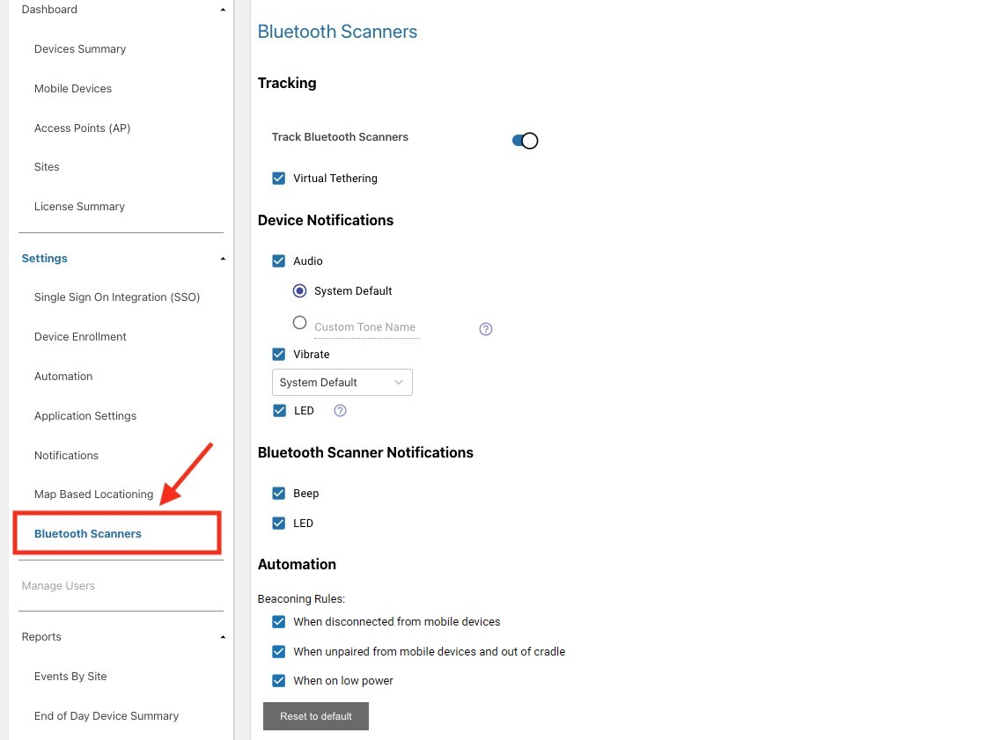

To pair and connect a Bluetooth scanner to the mobile computer:
1. Launch **Bluetooth Pairing Utility**, pre-installed on the mobile computer by default.
    
2. Use the Bluetooth scanner accessory to scan the barcode displayed. 
    

This automatically registers the Bluetooth scanner to the Device Tracker system to allow it to be found if lost.

### Enable Tracking

To enable Bluetooth Scanner Tracking:
 
1. Log into Device Tracker web portal as an administrator.
2. Go to **Settings > Bluetooth Scanners.**
3. Toggle to enable the following:
    * **Track Bluetooth Scanners -** allows Bluetooth scanners to be found with the [track devices](../use/) procedure
    * **Virtual Tethering -** alerts the user if the Bluetooth scanner is approaching beyond the Bluetooth range, preventing loss of connectivity and device loss

When enabled, 2 tabs are seen in the "To Be Found" screen in the mobile app: 
* **Mobile Device -** displays lost mobile computers, set "To Be Found"
* **Bluetooth Scanner -** displays lost Bluetooth scanners, set "To Be Found"

The Bluetooth Scanner tab displays the Bluetooth Scanners that have been paired to devices with the mobile client app. There are 2 categories in Bluetooth Scanner: 
* **My Bluetooth Scanner -** displays the Bluetooth scanner that is paired to the host mobile computer
* **Other Bluetooth Scanners -** displays Bluetooth scanners registered to the Device Tracker system that is not paired to the host mobile computer

### Device Notifications

Device Notifications control how the mobile computer is notified when a Bluetooth scanner is being found.
* **Audio -** determines the audible sound to be played. Choose the default system sound or one of the built-in ringtones from the device
* **Vibrate -** determines if the associated device vibrates and its vibration pattern
* **LED -** determines if the LED is turned on to blink during find mode

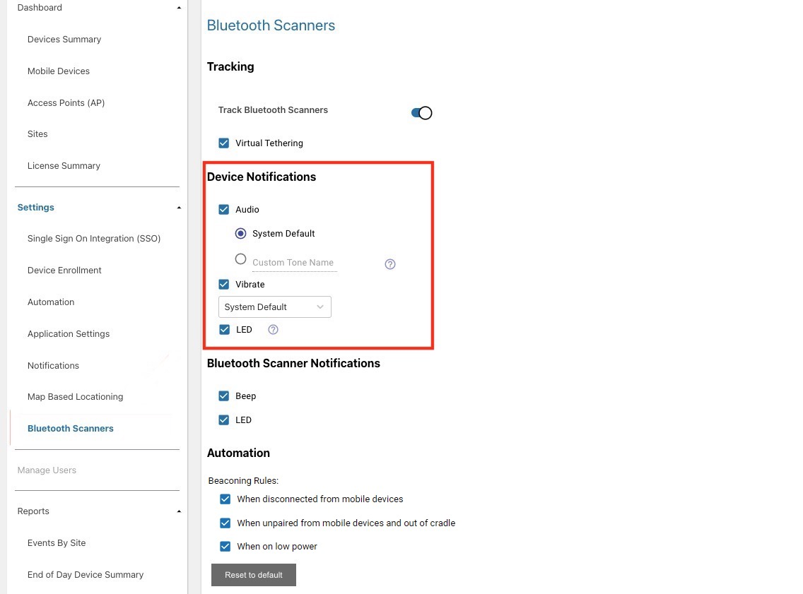

### Bluetooth Scanner Notifications

**Bluetooth Scanner Notifications** control how the Bluetooth scanner is alerted when it is being found.
* **Beep -** when enabled, the Bluetooth Scanner emits a beep sound
* **LED -** when enabled, the Bluetooth Scanner LED blinks 

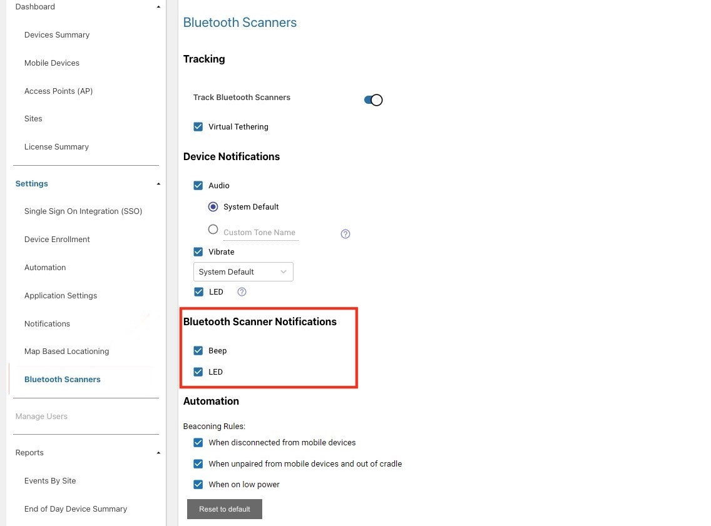

### Automation

**Automation** settings control the conditions to be met before automatically changing the state of Bluetooth scanners. For each condition that is enabled, the Bluetooth scanner automatically starts beaconing, or set "To Be Found," for a nearby mobile computer to find the scanner using the proximity meter. 
 
Beaconing rules:
* **When disconnected -** the Bluetooth scanner automatically starts beaconing when it is out of Bluetooth range of the paired device. Other unpaired devices can locate the Bluetooth scanner.
* **When unpaired and out of cradle -** the Bluetooth scanner automatically starts beacoming when unpaired to the mobile computer and removed from the cradle. 
* **When on Ultra Power -** the Bluetooth scanner automatically starts beaconing when the battery level is lower than 30%. This option is enabled by default. 

**Note:** When a Bluetooth scanner is placed into a charged cradle, it is automatically unpaired from the associated device and removed from the "My Bluetooth Scanner" list.

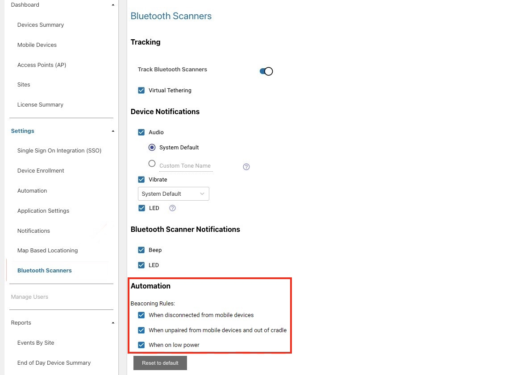

---

## Diagnostics

For diagnostic purposes, logging can be enabled in Device Tracker to capture application and system information to Android logcat. [RxLogger](/rxlogger) is a built-in tool on Zebra Android devices that collects data and event logs from logcat and stores them in a single location. If issues are encountered, a Zebra representative may request for the log files to be collected and supplied. <br 
There are 2 methods to capture logging: StageNow or EMM.

### Using StageNow

To use StageNow to capture logging:

1. Open StageNow on the device.
2. Scan the barcode to enable Device Tracker logging and start RxLogger log capture:
   

3. Reproduce the issue.
4. Scan the barcode to disable Device Tracker logging and stop RxLogger log capture:
   

Logs are located in the RxLogger folder (default location: /sdcard/RxLogger).

 
### Using EMM

To use EMM to capture logging, refer to the following XML content:

- To enable logging:

        <wap-provisioningdoc>
            <characteristic version="1.0" type="com.zebra.mdna.devicetrackercloud">
                <parm name="EnableLog" value="1" />
            </characteristic>
        </wap-provisioningdoc>

- To disable logging:

        <wap-provisioningdoc>
            <characteristic version="1.0" type="com.zebra.mdna.devicetrackercloud">
                <parm name="EnableLog" value="0" />
            </characteristic>
        </wap-provisioningdoc>

Send the desired XML content to the EMM using either [OEMConfig](/oemconfig) or [MX](/mx/overview) to configure the app.
  

---

## See Also

- [License](../license)
- [Installation](../setup)
- [Track Devices](../use)
- [Dashboard](../dashboard)
- [FAQ](../faq)
