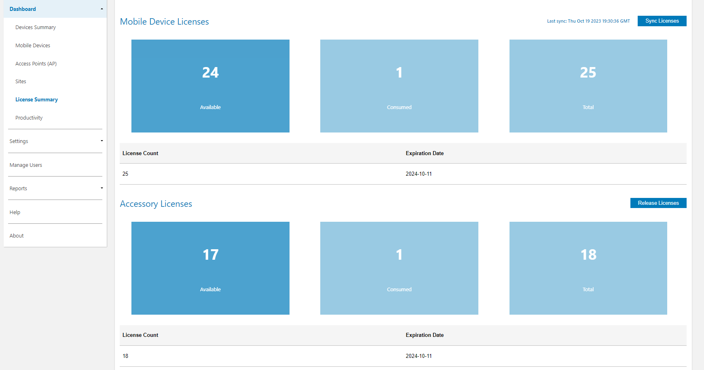

## Overview

Device Tracker requires end-user licenses issued by Zebra Technologies. Licensing with Device Tracker is a simple, seamless process integrated with the normal operation of Device Tracker without the need for additional user intervention. Available license types:

- **Trial license** (90-day evaluation period)
- **Term-based license**:
  - 1-year term
  - 3-year term
  - 5-year term

This guide explains the process to obtain a Device Tracker license(s) for commercial use and apply the license(s) to individual devices.

### Licensing Behavior

- After licenses are acquired, they are synchronized with the Device Tracker web portal either automatically every 24 hours or manually by the administrator.
- Licenses are shared from a single pool of licenses, regardless of expiration date.
- When a device registers to the Device Tracker server, a license is allocated to the device from the license pool on a first-come, first-served basis.

### Evaluation License

Zebra offers time-limited trial licenses to allow companies to evaluate the performance of Zebra solutions in their environment.

- **Customers, partners and distributors:** Submit a request through a Zebra account manager or sales engineer
- **Zebra account managers and sales engineers:** Submit requests using [SFDC forms](https://zebra.lightning.force.com/lightning/o/Trial_License_Request__c/new?originalUrl=https%3A%2F%2Fzebra--c.na168.visual.force.com%2Fapex%2FTrial_NFRCreationPage%3FsObjectName%3DTrial_License_Request__c%26save_new_url%3D%252Fa9u%252Fe%26navigationLocation%3DLIST_VIEW%26lexiSObjectName%3DTrial_License_Request__c%26lexiActionName%3Dnew%26sfdc.override%3D1%26vfRetURLInSFX%3D%252Fa9u%252Fo&inContextOfRef=1.eyJ0eXBlIjoic3RhbmRhcmRfX29iamVjdFBhZ2UiLCJhdHRyaWJ1dGVzIjp7Im9iamVjdEFwaU5hbWUiOiJUcmlhbF9MaWNlbnNlX1JlcXVlc3RfX2MiLCJhY3Rpb25OYW1lIjoibGlzdCJ9LCJzdGF0ZSI6eyJmaWx0ZXJOYW1lIjoiUmVjZW50In19&count=1)
- **Zebra engineers and other Zebra employees and contractors:** Submit a request in the Zebra [ServiceNOW](https://zebra.service-now.com/com.glideapp.servicecatalog_cat_item_view.do?v=1&sysparm_id=a6a5c8a60f322700df9ce64be1050e35) portal

<!--  // Remove per PK 9/30/22
## Device-based Secondary BLE

For devices with a built-in secondary BLE, such as EC50/EC55, separate licenses are required for Device Tracker and secondary BLE operation: _Device Tracker license_ and _BLE license_. Unlike the _Device Tracker license_, the _BLE license_ is not monitored by the Device Tracker web portal.

To purchase a _BLE license,_ visit the [Zebra Solutions Pathway portal](https://solutionspathway.zebra.com). The Zebra Licensing Portal is provided to view and monitor the BLE licenses.

To purchase a _Device Tracker license_, continue with the procedure below.
-->

### Secondary BLE

For hardware with [secondary BLE](../secondaryble/), a 1-year or 3-year Device Tracker special license pricing is available for customers for each hardware purchased (1:1). At the end of the term, a new Device Tracker license is required for Device Tracker to function (follow the procedure below). See the [device compatibility table](https://www.zebra.com/us/en/support-downloads/software/productivity-apps/device-tracker.html) for supported hardware with secondary BLE.

<!--
Device Tracker license is supplied upon purchase of the battery. After 3 years, a new Device Tracker license is required for Device Tracker to function (follow the procedure below), or a new battery can be purchased with another 3-year term license. In this case, a separate _BLE license_ is not required for secondary BLE functionality. -->

---

## I. Contact a Reseller

The first step in obtaining a license is to engage with Zebra or a Zebra reseller. [Visit Zebra's Device Tracker product page](https://www.zebra.com/us/en/products/software/mobile-computers/device-tracker.html) and select one of the methods for contacting Zebra directly or engaging with a reseller or partner.

Alternatively, select one of the following Zebra resources:

- **[Find a Zebra Partner](https://www.zebra.com/us/en/partners/find-a-zebra-partner.html) -** form for submitting an inquiry via the web
- **[How to Select a Channel Partner](https://www.zebra.com/us/en/partners/find-a-zebra-partner/selecting-the-right-channel-partner.html) -** explains the types of partners that engage with Zebra and some of their technologies and specialties
- **[Partner Interaction Center](https://www.zebra.com/us/en/partners/partner-interaction-center.html) -** information for contacting Zebra's existing global partner network
- **[Zebra Corporate Numbers and Links](https://www.zebra.com/us/en/about-zebra/contact-zebra.html) -** broken down by global region
- **[Global Marketing Contact Center](https://www.zebra.com/us/en/about-zebra/contact-zebra/marketing-contact-center.html) -** broken down by global region and country

## II. Access Licensing System

After a licensing agreement is purchased from Zebra or a Zebra reseller, an email is sent to the requester containing user credentials for accessing the Zebra Enterprise Software Licensing system.

Visit the <a href="https://www.zebra.com/us/en/support-downloads/software-licensing.html">Zebra licensing support page</a>. Register and log into the portal to:

- **Order licenses**
- **Check status** of existing orders

After licenses are processed, the license information <!--from the Zebra license portal--> is synchronized with the <a href="../dashboard/#licensesummary">Device Tracker web portal</a> every 24 hours. The administrator can perform a manual <a href="../dashboard/#licensesummary">synchronization</a> in the Device Tracker web portal to refresh the license data on-demand to synchronize with Zebra Enterprise Software Licensing system. The administrator monitors available licenses through the <a href="../dashboard/#licensesummary">Device Tracker web portal</a> to view licenses available, licenses consumed and total licenses.

_License Summary in Device Tracker web portal_

## III. Automatic License Assignment

Assigning licenses is seamless and integrated into the device registration process with the Device Tracker server. Licenses are allocated to devices based on enrollment with the server on a first-come, first-served basis.

As part of the device registration process, after a device is staged with the server configuration, it communicates with the Device Tracker server. If a license is available, the server allocates a license to the device. After the device is licensed, Device Tracker is operational on the device. Otherwise, a message is displayed on the device indicating that a license is not available.

---

## Related Guides

- [Zebra Licensing Support](https://www.zebra.com/us/en/support-downloads/software-licensing.html)
- [Secondary BLE](../secondaryble)
