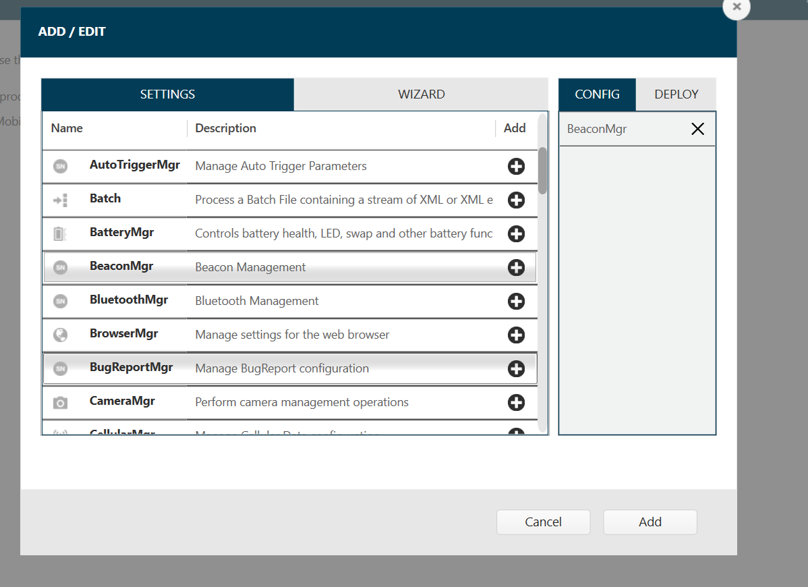

## Overview

**Secondary Bluetooth Low Energy (BLE)** is an optional setting that allows a device to be located if it is powered off or has reached critically low battery (5% or less battery remaining). The location of this device is detected by the seeking device that listens for signals transmitted from the secondary BLE beacon of the device that is powered off or in critically low battery state. Secondary BLE beacons are transmited as long as the battery is not completely depleted. When a device reaches a crtical low battery state, in general secondary BLE beacons can be transmitted for at least a few days - there are multiple factors that can affect this, including battery charge cycles, battery age, operating temperature, etc.

The presence of secondary BLE is based on device hardware, see [device compatibility](https://www.zebra.com/us/en/support-downloads/software/productivity-apps/device-tracker.html). Special license pricing is offered for hardware with secondary BLE, see Device Tracker [license](../license/#secondaryble).

<!--  // Remove per PK 9/30/22
The secondary BLE is located on the battery. When purchasing the BLE battery, it comes with a 3-year term Device Tracker [license](../license) for full operation of Device Tracker.

There are 2 types of secondary BLE:
- **Device-based -** The secondary BLE radio is located on the device. In addition to the _[Device Tracker license](../license)_, a separate _BLE license_ is required for the secondary BLE to operate. Although the _Device Tracker license_ is monitored by the [web portal](../dashboard/#licensesummary), this does not apply to the _BLE license._
- **Battery-based -** The secondary BLE radio is located on the battery. When purchasing the BLE battery, it comes with a 3-year term Device Tracker [license](../license) for full operation of Device Tracker. A BLE license is not required. There is a difference in behavior when using battery-based secondary BLE, see [battery-based BLE behavior](/stagenow/latest/csp/beaconmgr/#batterybasedblebehavior).-->

_Secondary BLE_ is used to find a device that is powered off or in critically low battery state. This should not be confused with the built-in device _primary BLE_, used for finding devices that are powered on.

---

## Configuration

<!--
Enable Secondary BLE (Bluetooth Low Energy) to find devices when powered off. Locationing is based on signals transmitted from the secondary BLE beacon of the misplaced device that are detected from the [device performing the search](../use). By enabling secondary BLE, another device can locate the powered device by detecting the advertising packets sent by the powered off device. -->

Secondary BLE is enabled through Beacon Manager (BeaconMgr), which controls the signals transmitted by the secondary BLE radio on the powered off device. Aside from administrative control detecting beacons, Beacon Manager also controls the power level of the transmitted signal to help balance power consumption within a detectable range. To enable and configure secondary BLE on devices, select one of the following methods:

- Use [pre-configured files](#preconfiguredfiles) to scan the staging barcode or deploy the XML via EMM.
- [Create a StageNow profile](#createaprofile) and scan the staging barcode generated or deploy the XML via EMM.

See [Beacon Manager](/stagenow/latest/csp/beaconmgr/) documentation for more information.

### Pre-configured Files

Files are provided to enable BLE on the device and configure BLE with the following settings:

- **Transmission (Tx) Power Level:** High (1 dBm)
- **Transmission (Tx) Interval:** Low Latency (100 ms)

If these settings need to be changed, follow the steps to [Create a Profile](#createaprofile).

Use _one_ of the following methods to apply the pre-configured file:

- **Scan the staging barcode -** Open StageNow client on the device and scan the appropriate barcode:
  - For TC52AX and MC33AX, scan [barcode](SecondaryBLE_TurnON_TC52ax_MC33ax.pdf)
  - For all other devices, scan [barcode](SecondaryBLE_TurnON.pdf)
- **Deploy XML via EMM -** Deploy XML using either [OEMConfig](/oemconfig) or [MX](/mx). _Do not edit the XML file - it can cause unexpected behavior._ Use the appropriate XML file based on the device model:
  - For TC52AX and MC33AX, use [XML](SecondaryBLE_TurnON_TC52ax_MC33ax.xml)
  - For all other devices, use [XML](SecondaryBLE_TurnON.xml)

Note: The following MX version is required on the device:

- MX 10.5 or higher for TC52AX and MC33AX
- MX 10.2 or higher for all other devices

See [Which MX is Installed](/mx/mx-version-on-device/) to check the MX version.

### Create a Profile

Instructions to create a StageNow profile for secondary BLE configuration:

1. Open [StageNow](https://www.zebra.com/us/en/support-downloads/software/utilities/stagenow.html) on a host computer.
2. In the StageNow home screen, click **Create New Profile** from the left menu.
3. Ensure the proper MX version, MX 10.2 or higher, is selected at the top drop-down selector for secondary BLE support. Support for **Manufacturer Byte** and **Reference RSSI** options were added starting with MX 10.5. See [MX documentation](/mx/mx-version-on-device/) for instructions how to check the version. Select **Xpert Mode** from the list and click **Create.**
   <i>Wizard selection</i>

4. Enter the profile name. Click **Start.**
5. Find **BeaconMgr** and click the plus (+) sign next to it. This adds **BeaconMgr** to the Config tab on the right side.
   <i>Add config setting</i>

6. Click **Add.** In the BeaconMgr screen, select the following: 
   &nbsp;&nbsp;&nbsp;&nbsp;&nbsp;• **Beaconing:** Turn ON 
   &nbsp;&nbsp;&nbsp;&nbsp;&nbsp;• **Beaconing in Airplane Mode:** Turn ON 
   &nbsp;&nbsp;&nbsp;&nbsp;&nbsp;• **Beacon type:** AltBeacon 
   &nbsp;&nbsp;&nbsp;&nbsp;&nbsp;• **Explicit Beacon UUID?:** [uncheck checkbox] 
   &nbsp;&nbsp;&nbsp;&nbsp;&nbsp;• **AltBeacon ID1:** EBEB 
   &nbsp;&nbsp;&nbsp;&nbsp;&nbsp;• **AltBeacon ID2:** ECDD 
   &nbsp;&nbsp;&nbsp;&nbsp;&nbsp;• **Transmission (Tx) Power Level:** High (1 dBm) 
   &nbsp;&nbsp;&nbsp;&nbsp;&nbsp;• **Transmission (Tx) Interval:** Low Latency (100 ms) 
   &nbsp;&nbsp;&nbsp;&nbsp;&nbsp;• **Manufacturer Byte:** 00 
   &nbsp;&nbsp;&nbsp;&nbsp;&nbsp;• **Reference RSSI:** _[For battery-based secondary BLE, such as TC52AX and MC33AX, enter **C0**. Otherwise, leave blank]_ 
   See [Beacon Manager](/stagenow/latest/csp/beaconmgr/) for more information on the parameters and how they can be adjusted.
7. Click **Continue.**
8. Click **Complete Profiles.**
9. Select one of the following based on the deployment method:

   - **StageNow:** Generate the barcode from the StageNow profile. Open StageNow client on the device and scan the barcode(s) generated.
   - **EMM:** Export XML from the StageNow profile. Do not edit the XML file - it can cause unexpected behavior. Deploy the XML using either [OEMConfig](/oemconfig) or [MX](/mx).

Make sure devices are connected to the network and <i>remain connected to the server for at least 5 minutes</i> during intial setup.

---

## Use

<!--
There are behavioral differences between device-based and battery-based secondary BLE. See [battery-based BLE behavior](/stagenow/latest/csp/beaconmgr/#batterybasedblebehavior). -->

When locating a device based on its secondary BLE beacon, the **Play Sound** feature is disabled during device search since it cannot function due to the loss of device power. The <a href="../use/#devicedetails">Secondary BLE state</a> is viewed from the **Device Details** screen. See [Secondary BLE](../use/#secondaryble) for reference.

---

## See Also

- [About Device Tracker](../about)
- [Licensing](../license)
- [Install & Setup](../setup)
- [Configuration](../config)
- [Track Devices](../use)
