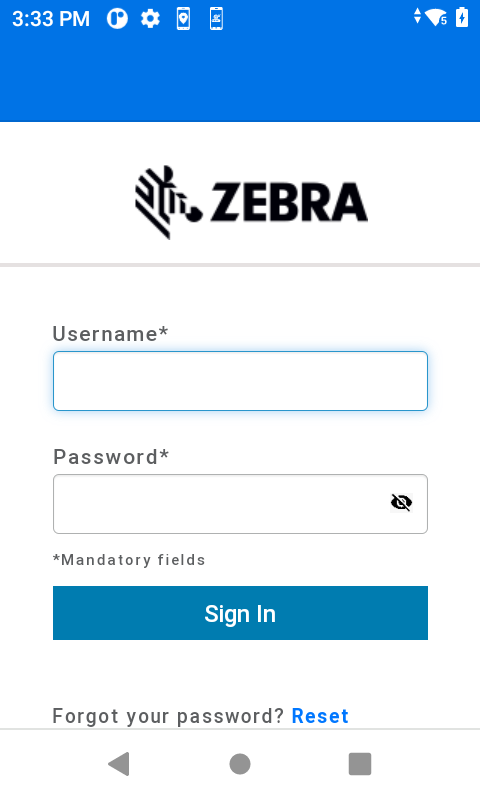
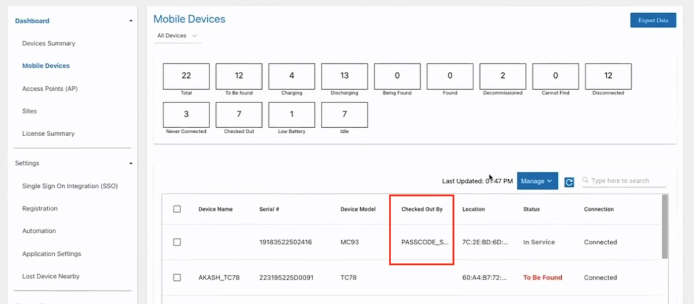
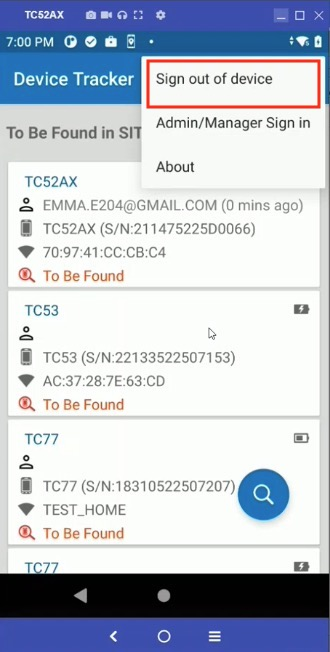
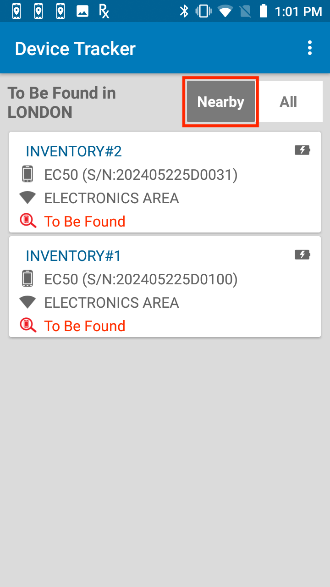
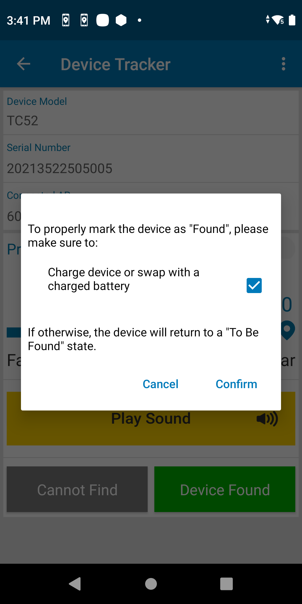
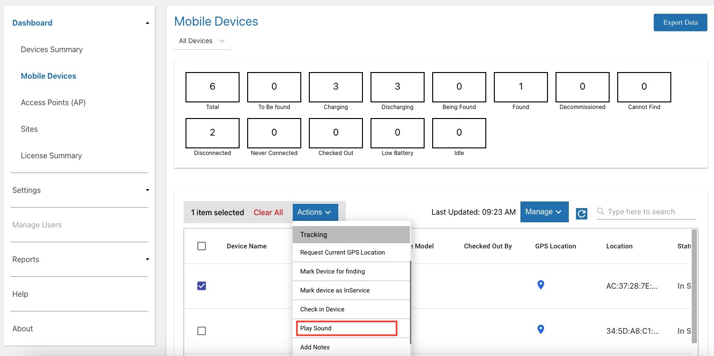
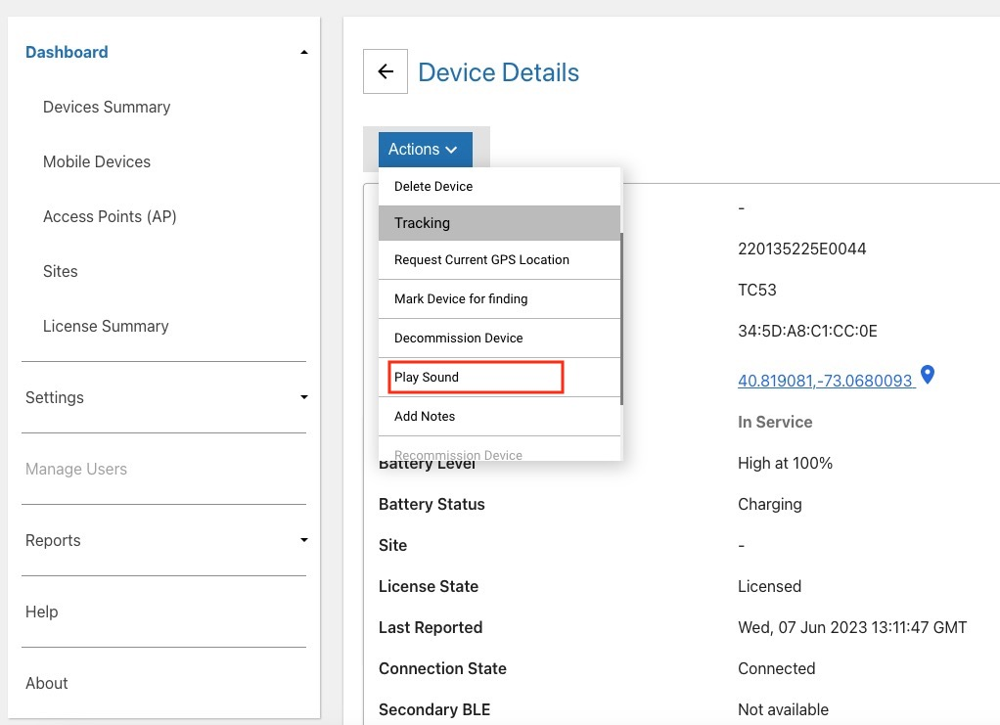
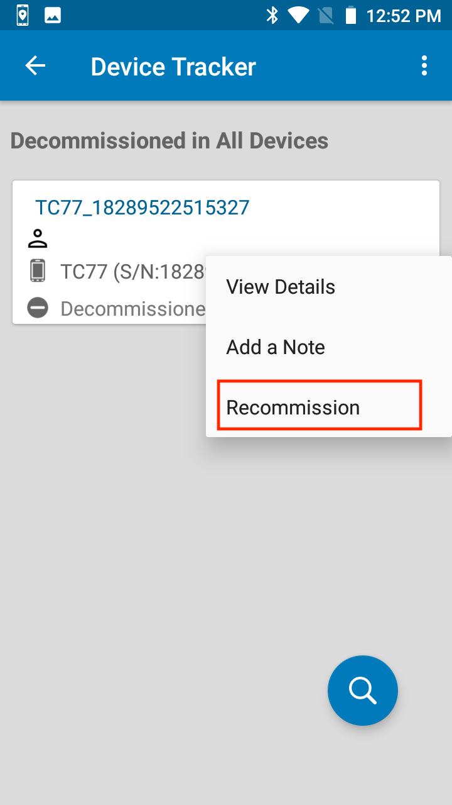
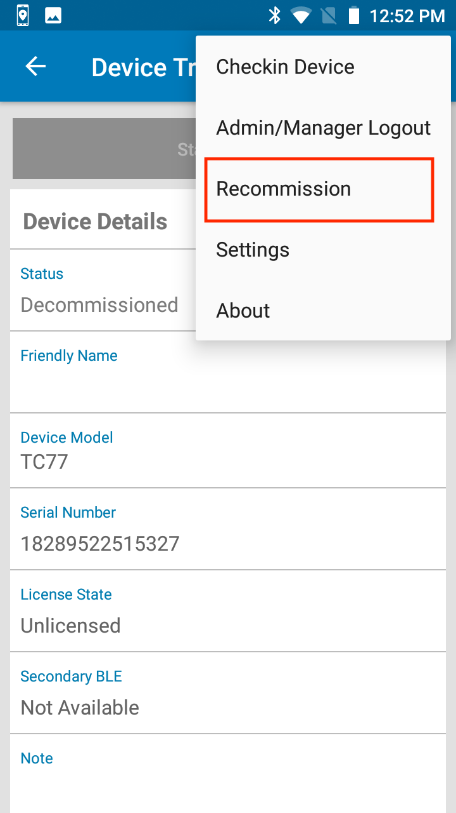

## Overview

Device Tracker can block user access to the device with either of the following optional features for [device checkout](../config/#checkincheckoutdevice):

- [User barcode scan](../config/#checkincheckoutdevice) - If enabled, the end user is presented with the [Checkout](#devicecheckout) screen, prompting the user to scan their user barcode to gain device access.
- [SSO signin](../config/#singlesignonsso) - If enabled, the user logs in with their SSO credentials to gain access to the device.

Device Tracker operation and functionality is based on the [user role](../config/#overview) of the user logged in.

To [find a device](#finddevice), the misplaced device must be [marked for retrieval](#markdevicetofind) by the administrator or manager. The “finding” device (the device performing the search) is used to determine the distance the user is located in relation to the “misplaced” device (the device to be found) using the visual proximity meter. When a device is found, [recommission the device](#decommissionrecommissiondevice) to place it back into the active device pool. Alternatively, [decommission the device](#decommissionrecommissiondevice) if it needs to be removed from the active device pool.

The following options are available to facilitate device tracking:

- Use [Automation](../config/#automation) to configure rules that trigger the workflow of finding lost mobile devices.
- A [note](#addeditnote) can be added at any time to capture comments specific to the device (e.g. device screen damaged) to aid in tracking or identifying problems with the device. This feature is available only for administrators and managers.

An [administrator dashboard](../dashboard/#administratordashboard) and [manager dashboard](../dashboard/#managerdashboard) are accessible via the web portal to view devices, access points and sites and take action to track devices.

[Licenses](../license/) are required on the devices and may be transferred from one device to another or removed from a device.

<!--
The following optional features facilitate the device finding process:
* [Automation](../config/#automation) - Configure rules that trigger the workflow of finding lost mobile devices.
* [Lost Device Nearby](../config/#lostdevicenearby) - A device receives notifications when detected to be in close proximity to a device marked for retrieval. -->

---

<!--
This section discusses the actions that can be taken to track devices:

- **[Device Checkout](#devicecheckout) -** an optional feature enforcing users to scan their user barcode to gain access to the device and associate the user to the device for accountability.
- **[Find Devices](#finddevices) -** provides the procedure to find a device, even if the device has lost power (for devices with secondary BLE).
- **[Decommission/Recommission Device](#decommissionrecommissiondevice) -** remove or reinstate a device from the active pool of devices. Easily track devices that need to be removed from the pool due to repair or decommission.
- **[Add/Edit a Note](#addeditnote) -** add device-specific comments, e.g. to identify device issues.
-->

---

## Device Checkout

Device Checkout is an optional feature configured by the administrator to block device access until a user performs one of the following on the device:

- Signs in with SSO credentials
- Scans a user barcode

[Checkin/checkout](../config/#checkincheckoutdevice) must be enabled. The following sections describe how to use checkout using either of the above options.

### SSO

When [single sign-on SSO](../config/#singlesignonsso) is activated and [Enterprise Login Screen](../config/#enterpriseloginscreenels) (ELS) is installed on the device, the user signs in to the device using SSO login credentials.

#### Sign in

When SSO is activated and Enterprise Login Screen is installed on the device, users sign in to the device by entering their SSO login credentials. After successful sign in, the user is granted access to the device and is checked out with the user name returned by SSO for accountability.

To sign in using SSO:

1. In the Enterprise Login Screen, tap **Sign in.**
2. In the company SSO sign in screen, enter the user credentials and tap **Sign in** or the related button to signin.

<table>
    <tr>
        <td>
            
        </td>
        <td>&nbsp;&nbsp;&nbsp;&nbsp;&nbsp;</td>
        <td>
            
        </td>
    </tr>
    <tr>
        <td>
            <i>Enterprise Login Screen</i>
        </td>
        <td>&nbsp;&nbsp;&nbsp;&nbsp;&nbsp;</td>
        <td>
            <i>Company SSO signin screen</i>
        </td>
    </tr>
</table>

#### Passcode

If the user cannot sign in to the device, either due to an SSO signin failure or a network outage, the administrator can supply a [passcode](../config/#enterpriseloginscreenels) for the user to enter on the device to bypass the SSO login. The passcode is set with an associated passcode group name through [SSO integration](#ssointegration) under the **Enterprise Login Screen Mobile Client** section.

To bypass the SSO signin screen, in the ELS screen tap the menu at the top right, select **Sign in with Passcode** and enter the passcode supplied by the administrator.

_Enter bypass passcode_

This grants the user device access and checks out the user as "passcode\_" followed by the passcode group name as displayed in the Mobile Devices dashboard in the **Checked Out By** column.

_Checked in user from entering passcode_

#### Signout

To signout of ELS, in Device Tracker tap the top right menu and select **Sign out of Device.** The user is signed out and the ELS screen appears for the next signin session.

_Signout of ELS_

On successful signout of ELS, the device is checked in and accountability is removed from Device Tracker.

### User Barcode

When using barcode scanning for checkout (SSO is not activated), the user is required to scan the user barcode at the start of their work shift to checkout the device, then checkin the device at the end of the work shift. The checkout screen blocks device access, preventing the user from accessing the device until checkout is performed. When a device is checked-out, the user is associated with the particular device until the user checks in the device.

By default, if no barcode prefix is defined all barcodes are accepted. Specify a [checkout barcode prefix](../config/#checkoutbarcodeprefix) to restrict checkout only to barcodes that begin with the specified prefix.

**Note:**

- **For Android 10 and higher, if "Display over other apps" permission is not granted,** the user must manually launch the app once and grant this permission for checkout functionality to work properly.
- **If any other app also uses a screen overlay, the checkin/checkout feature may conflict with the other app.** For example, this feature cannot be used with Zebra’s MotionWorks Proximity application.
- **The checkout barcode can be scanned when the device is in the lock screen.** If the Android lock screen appears after the checkout screen is displayed, a checkout barcode can be scanned while the device is in the lock screen. The device is checked out, as seen after unlocking the device.
- **When DataWedge is disabled, it prevents the scanning of barcodes.** Upon device checkin, an error message is displayed indicating that barcode scanning is disabled on the device. During this state, the device cannot be checked out. To resolve this, [decommission](#decommissionadevice) the device and re-enable DataWedge. Then [recommission](#recommissionadevice) the device.

#### Checkout

Perform a device checkout at the start of a work shift as follows:

1. Remove the device from power to automatically display the checkout screen or launch the app on the device.
2. The checkout screen appears, prompting to scan a barcode. When in the checkout screen, the user is prevented access to the device until checkout is performed.
   <i>Device checkout</i>

3. Scan the barcode associated with the user by pressing the scan trigger or tapping on the barcode image on the screen. If the administrator has set a prefix string in the [barcode prefix option](../config/#checkoutbarcodeprefix), the barcode must contain the prefix specified for checkout to be successful.
4. A message appears indicating the user is checked-out successfully. The app is placed in the background.
5. The user is now associated with the device.  

**Note:** If Checkout is enabled, after a device is rebooted the Checkout screen may take up to one minute to be displayed.

 

#### Check-In

Choose one of the following options to Check-In a device:

<b>Option 1:</b>

1. Launch the app.
2. Tap on the options menu from the top right and select Check-In Device.
3. The user is checked-in. The checkout screen appears prompting to scan a barcode.

<b>Option 2:</b>

1. Connect the device to power.
2. The user is checked-in. The checkout screen appears prompting to scan a barcode.

<b>Option 3:</b>

1. Reboot the device.
2. The checkout screen appears prompting to scan a barcode.

---

## Mark Device To Find

When initiating the process to find a device, the misplaced device must first be set to the **To Be Found** state by the administrator or manager. The finding device, or the device performing the search, is used to determine the distance the user is located in relation to the “misplaced” device, or the device to be found. Location must be enabled on the finding device to perform the device search.

A device must be marked **To Be Found** before a device search can take place.

To mark a device "To Be Found":

1. From the device list, tap and hold the device card of the misplaced device to find. Select **Set To Find.**
   
   <i>Device action menu</i>
2. The status is changed to **To Be Found** and the device is now listed in the **To Be Found** category in the dashboard.
3. To proceed to find the device, continue to the next section [Find a Device](./#findadevice).

Managers and administrators can alternatively mark a device <b>To Be Found</b> as follows:

1. Open the [device list](./#devicelist).
2. Tap on a device card.
3. Tap **Enable Finding**.
   
   <i>Manager/admin view to mark a device "To Be Found"</i>

---

## Lost Device Nearby

[Lost Device Nearby](../config/#lostdevicenearby) is an optional feature (configured by the administrator) that proactively sends alert notifications to a device when a lost device is detected within close proximity. This allows the lost device to be found by nearby users in addition to any users that may be actively searching for the device. The nearby user that receives the alert notification can promptly initiate the finding process, expediting device recovery by allowing the lost device to be found more quickly with its vicinity immediately known. Alerts are sent as one or a combination of the following: audio, vibration, LED, and/or Android notification.

When the notification message appears on the detecting device, it includes the device model and device name of the lost device. Tap on the notification to start the finding process. If there are multiple lost devices detected nearby, a notification is received from each lost device. If the detecting device is online (internet is available), the Device Tracker [Device Details](../dashboard/#devicedetails) screen appears and the user can start the finding process by tapping the **Start Finding** button. The user proceeds to find the lost device with the [proximity indicator](../use/#finddevice) and play sound features.

> Enabling **Lost Device Nearby** triggers continuous BLE scanning to detect nearby devices and send notifications when devices are detected. This continuous activity consumes additional battery power on the device - review your use case and battery requirements before enabling this feature.

_Notifications of lost devices nearby_

Alert notifications are received even if the detecting device is _offline_, as seen in the notification message which displays "offline" status for the detecting device. In this case, tap on the notification to immediately start the finding process. The Device Tracker app appears for the user to find the lost device with the [proximity indicator](../use/#finddevice). The detecting device cannot mark the lost device as "Found" or "Cannot Find" until the detecting device is back online. However, this can be done in the web portal by the manager or administrator.

_Notification received when detecting device is offline_

When _Lost Device Nearby_ is enabled, the "To Be Found" screen displays a **Nearby** tab, which filters lost devices that are marked "To Be Found" and are receiving Bluetooth beacons while within nearby proximity.

_To Be Found - Nearby Devices_

When the detecting device is offline (no internet connectivity), nearby devices can still be detected from the BLE beacons received. The nearby device is displayed as "Unknown" along with its beacon ID:

_Offline detecting device displaying nearby devices_

<!--
When _Lost Device Nearby_ is enabled, the "To Be Found" screen displays 2 tabs:
* **All -** Displays devices that are marked "To Be Found" for the respective site.
* **Nearby -** Filters lost devices that are marked "To Be Found" and are receiving Bluetooth beacons while within nearby proximity.

    <table>
    <tr>
    <td>
            
    </td>
    <td>&nbsp;&nbsp;&nbsp;&nbsp;&nbsp;</td>
    <td>
            
    </td>
    </tr>
    <tr>
        <td>
            <i>To Be Found - All Devices</i>
        </td>
        <td>&nbsp;&nbsp;&nbsp;&nbsp;&nbsp;</td>
        <td>
            <i>To Be Found - Nearby Devices</i>
        </td>
    </tr>
    </table>

    When the detecting device is offline (no internet connectivity), nearby devices can still be detected from the BLE beacons received. The nearby device is displayed as "Unknown" along with its beacon ID:

    

    _Nearby devices when the detecting device is offline_
-->

The detecting device receives _Lost Device Nearby_ notifications when all the following requirements are met:

- The device must be in the "In Service" state.
- The device must neither be charging nor in a low battery state (based on the [Low battery threshold](../config/#configureautomationsettings)).
- If [Checkin/Checkout](../config/#checkincheckoutdevice) is enabled, the device must be Checked Out by a user.

**Note:** Any _Lost Device Nearby_ notifications are removed when Bluetooth beacons are no longer detected from the lost device for at least 5 minutes. This is due to the lost device no longer: (1) located within close proximity of the detecting device, (2) emitting Bluetooth beacons, or (3) in the "To Be Found" state.

---

## Find Device

A device search is initiated from the **To Be Found** device list. For an associate, the **To Be Found** device list is displayed after starting the client app. For an administrator or manager, the **To Be Found** device list is accessible via the dashboard.

When ready to perform the device search, the first step is to use the finding device to find the access point (AP) that the misplaced device is connected to. This provides the general location of the misplaced device. The user walks toward the AP, then uses the Bluetooth proximity indicator on the finding device to identify how close or far the misplaced device is located in relation to the finding device. To further pinpoint the device location, on the finding device tap **Play Sound** and listen for the audio sound being played on the misplaced device. Walk towards the sound to locate the misplaced device.

**Play Sound** is also useful if the proximity indicator is not operational (e.g. Bluetooth is disabled). Audio alerts can be played during the search process even if the lost device is in [Do Not Disturb (DND) mode](#donotdisturbdndmode), with exceptions.

Device Tracker can locate devices even when the device loses battery power or is turned off, if the device has a [secondary BLE](#secondaryble).

**To start the search process:**

1. Initiate the device search. Perform _one_ of the following in the **To Be Found** device list:

   - Tap and hold the device card for the misplaced device. Select **Start Finding** from the device action menu.  
     <i>Device action menu</i>  
     _Or_
   - Tap on the device card for the misplaced device to open the <b>Device Details</b> screen. Tap <b>Start Finding.</b>

   <table style="margin-left:40px">
   <tr>
   <td>
       
   </td> 
   <td>&nbsp;&nbsp;&nbsp;&nbsp;&nbsp;&nbsp;&nbsp;&nbsp;&nbsp;&nbsp;&nbsp;&nbsp;&nbsp;&nbsp;&nbsp;
   </td>
   <td>
       
   </td>
   </tr>
   </table>
   <i>&nbsp;&nbsp;&nbsp;&nbsp;&nbsp;&nbsp;&nbsp;&nbsp;&nbsp;&nbsp;&nbsp;&nbsp;&nbsp;&nbsp;"Start Finding" Associate view&nbsp;&nbsp;&nbsp;&nbsp;&nbsp;&nbsp;&nbsp;&nbsp;&nbsp;&nbsp;&nbsp;&nbsp;&nbsp;&nbsp;&nbsp;"Start Finding" Manager/Admin view</i>

2. The device tracking screen appears. The device state is changed to **Being Found.**
3. Check the **Connected AP** on the tracking screen on the misplaced device. Walk towards the known location of the AP.
4. Using the BLE proximity meter, walk towards the misplaced device. The BLE proximity meter identifies the overall trend on how far or how close the user is located in relation to the misplaced device. The closer the misplaced, the further the blue indicator bar expands to the right. As the finding device approaches the misplaced device, the numerical value on the meter decreases as it reaches “Close” or “0” value.
   
   <i>Tracking screen with proximity meter</i>
5. Tap **Play Sound** on the finding device. The misplaced device emits a chirping sound to help identify its location. Walk towards the sound. Continue this step until the device is found. **Note:** When playing the sound, by design the Pixie Dust tone is played on the device.
6. If the misplaced device is found, tap **Device found.** Select _one_ of the following based on the behavior encountered:

   - The device is changed to the **Found** state if no automation rules are configured.
   - If [Automation](../config/#automation) rules are configured with option **Automatically Mark Devices "To Be Found"** enabled, a message appears prompting the user to take action based on the rule(s) selected and to check each checkbox after action is taken. _**It is important to execute ALL actions specified,** otherwise the device will return back to the **To Be Found** state after it is marked **Found** based on the automation process._ After all action is taken and all checkboxes are checked, tap **Confirm.** The device state is changed to **Found** if automation option **Automatically place device "In Service" when marked "Found"** is disabled. If this option is enabled, the device state is changed to **In Service**.
     

     <i>Sample screen of action to take after device is found</i>

7. If the device is found and the automation option **Automatically Place Device "In Service" When Marked "Found"** is disabled, manually [recommission](#decommissionrecommissiondevice) the device to place it back into the active device pool. Alternatively, decommission the device if it needs to be removed from the active device pool.
8. If the device is not found, tap **Cannot Find.** The device state is changed to **Cannot Find.**

The device is listed under the corresponding categories as seen from the [admin dashboard](../dashboard/#administratordashboard) or [manager dashboard](../dashboard/#managerdashboard).

Administrators and managers can add a [note](#addeditnote) to capture comments specific to the device, such as hardware damage or reason for decommision.

**Behavior when locating a misplaced device in different scenarios:**

- **If Bluetooth is turned off on a misplaced device that is powered-on and a user initiates locating that device,** Device Tracker automatically turns on Bluetooth in the misplaced device to allow that device to be located using the proximity indicator. However, if the misplaced device is disconnected from the server, Bluetooth will not be turned on.
- **If Bluetooth is turned off on the misplaced device while it is being found,** that device cannot be located using the proximity indicator. However, if the device is powered off, it can still be located using secondary BLE (if supported).
- **A device is in the _Disconnected_ state when it does not communicate with the server for approximately 12 minutes**. During this time, if a device search is performed on a misplaced device that has lost connection with the server, that device cannot be located using the proximity indicator and any attempt to **Play Sound** is ineffective since audio cannot be emitted from the disconnected device.
- **If a finding device initiates a device search prior to the misplaced device becoming _Disconnected,_** the misplaced device can be found using the proximity indicator.
- **If Bluetooth is turned off on the finding device while it is locating the misplaced device,** the misplaced device cannot be located using the proximity indicator on that finding device.
- **If Android Location Services is turned off on the finding device,** it cannot locate the misplaced device using the proximity indicator. <!-- The **Play Sound** feature is available to locate the misplaced device.-->

<!--
1. If Bluetooth is turned off on a misplaced device that is powered-on, note the following:
   - While finding a misplaced device, the proximity indicator cannot be used to locate that device since the Bluetooth beacons are not emitted.
   - When a user initiates locating a misplaced device, Bluetooth is automatically turned on (in the misplaced device) to allow the proximity indicator to be used to locate the misplaced device. However, if the misplaced device is disconnected from the server, Bluetooth will not be turned on.
   - When the misplaced device is being located, that device cannot be found using the proximity indicator. However, if the misplaced device is powered off, it can still be located using secondary BLE.
2. If Bluetooth is turned off on the finding device while it is locating the misplaced device, the misplaced device cannot be located using the proximity indicator.
3. If Android Location services is turned off on the finding device, it cannot locate the misplaced device using the proximity indicator. The **Play Sound** feature can be used instead.
4. A device is in the **Disconnected** state if it does not communicate with the server for approximately 12 minutes. If a device search is performed and audio is attempted to play during this time frame, audio cannot be emitted from the misplaced device.
-->
<!-- If the misplaced device is powered off during a device search, while powering on the misplaced device, the proximity indicator cannot be used until the misplaced device completes the boot process. Since the secondary BLE is inoperable when the device is powered on, locating a device in this scenario relies on the primary BLE beacon. Note: Secondary BLE is operable only when the device is powered off.-->

<!--

<b>Usage Notes:</b>

- A device is in the <b>Disconnected</b> state if it does not communicate with the server for approximately 12 minutes. If a device search is performed and audio is attempted to play during this time frame, audio cannot be emitted from the misplaced device.
- If the device being found is powered off during a device search, while powering it on again proximity cannot be detected until the device completes the boot process. Since the secondary BLE is inoperative when the device is powered on, device locationing relies on the primary BLE beacon.
- While finding a device, if Bluetooth is turned off on the device being found, the proximity meter cannot be used to locate the device since the Bluetooth beacons are not emitted.
-->

### Secondary BLE

For devices with [secondary BLE](../secondaryble) beaconing capability, Device Tracker can locate the device if it loses battery power or is powered off. The location of the device is detected by signals transmitted from the secondary BLE beacon. Attempts to locate the device must occur soon after the device loses power, prior to loss of power from the secondary BLE beacon. The secondary BLE radio of some devices is located in the battery. Such devices are subject to the behavior described in [battery-based BLE behavior](/mx/beaconmgr/#batterybasedblebehavior).

When locating a device based on its secondary BLE beacon, the **Play Sound** feature is disabled during device search since it cannot function due to the loss of device power. The <a href="../use/#devicedetails">Secondary BLE state</a> is viewed from the **Device Details** screen.

**Usage Notes:**

- Secondary BLE differs from the built-in device _primary_ BLE used for device tracking, which cannot operate once the device loses power.
- While finding a device, the values seen in the BLE proximity indicator may differ when finding a device that is powered on (primary BLE) versus a device that is powered off (secondary BLE), particularly if the [Reference RSSI](../secondaryble/#configuration) is not specified for the battery-based secondary BLE. This is due to varying location and orientation of the secondary BLE antenna. During the finding process, the user should rely on the trend reflected in the BLE proximity meter to navigate to the misplaced device.

### Play Sound

To find a device that is close by, play a sound on the lost or misplaced device through the [Find Device](#finddevice) process. Alternatively, managers and administrators can play sound from the web portal through the **Actions** menu from either the **Mobile Devices** dashboard or **Device Details** screen.

**Note:** When playing the sound, by design the Pixie Dust tone is played on the device.

To play sound through the **Mobile Devices** dashboard:

1. Log into the web portal as a manager or administrator.
2. Go to Dashboard > Mobile Devices.
3. Tick the checkbox to select the desired device(s) to play sound.
4. From the Actions dropdown, select **Play Sound.**
   

To play sound through the **Device Details** screen:

1. Log into the web portal as a manager or administrator.
2. Go to Dashboard > Mobile Devices.
3. Click on the row of the desired device to play sound.
4. The **Device Details** screen appears. From the Actions dropdown, select **Play Sound.**
   

### Do Not Disturb (DND) Mode

DND mode is an Android feature that silences the device - it mutes sound and stops vibration. Device Tracker has the capability to play audio alerts when DND mode is turned on in the lost device, with exceptions (see below).

Turn on DND mode by performing one of the following methods:

- Press the hardware volume +/- key (on the side of the device) then tap the Silent icon in the Zebra Volume Control UI to turn on silent mode.
- In Android Settings > Sound > Zebra Volume Control, tap the Silent icon in the Zebra Volume Control UI to turn on silent mode.
- In Android Quick Settings, tap the Do Not Disturb icon to turn on DND.
- In Android Quick Settings, tap the drop-down for the Do Not Disturb icon to select Alarms only.
- In Android Quick Settings, tap the drop-down for the Do Not Disturb icon to select Priority only.
- In Android Quick Settings, tap the drop-down for the Do Not Disturb icon to select Total silence.
- In Android Settings > Sound > Default notification sound, select Silent to set the default notification sound to silent. (This silences the device without DND mode.)

When DND is turned on based on the methods above, Device Tracker can play audio alerts in all cases _except for the last two bullet points._ In the last two cases, Device Tracker can no longer play a sound during the finding process in the following scenarios:

- When a user gains access to Android Quick Settings to completely silence the device (see the second to last bullet point above).
- When a user gains access to the Android Settings app and modifies the notification sound to silent mode (see the last bullet point above).

To ensure full operation of Device Tracker, **_Zebra recommends to restrict user access and prevent users from completely silencing a device_** by setting both of the following options:

- Disable access to Android Quick Settings > DND UI by using an EMM or [Zebra MX UI Manager](/mx/uimgr/) to enable/disable the DND feature.
- Disable access to Android Settings by using an EMM or [Zebra Enterprise Home Screen](/ehs).

---

## Disable Finding

After a device is marked **To Be Found**, if the device search needs to be terminated follow these steps (applies to only managers and administrators):

1. Open the [device list](../#devicelist).
2. Tap on a device card.
3. Tap **Disable Finding**.
   
   <i>Manager/admin view to disable finding</i>

The device is removed from the **To Be Found** list and placed back **In Service.**

---

## Decommission/Recommission Device

Decommission a device to remove it from the active device pool and recommission it to place it back into the active device pool.

<!-- After a device is found, recommission the device to place it back into the active device pool. This changes the device status from **Found** to **In Service**, restarts the device reporting to the server, and allocates a license to the device. On the other hand, decommission a device to remove it from the active device pool, mark it in the **Decommissioned** state, deallocate the license and stop any further reporting to the server. -->

### Decommission a Device

When a device is no longer in use or needs to be removed from the active device pool, mark it as **Decommissioned** to prevent any further reporting to the server. This applies to situations when the device is being sent for repair, the device is being replaced, or the device is deprecated and needs to be removed. When a device is decommissioned, the license is automatically deallocated from the device and returned to the license pool for it to be reallocated to another device.

_If a device is decommissioned by a manager,_ the device is removed from the assigned site and therefore no longer visible in the [manager dashboard](../dashboard/#managerdashboard). The device can be recommissioned only by an administrator.

To decommission a device (admin/manager access required):

1. Perform _one_ of the following procedures: 
   From the device list, tap and hold on the device card. Tap **Decommission** from the device action menu displayed. The **Device Details** screen appears. 
   _Or,_ 
   If already in the **Device Details** screen, tap on the top right menu and select **Decommission.**

    <table style="margin-left:40px">
    <tr>
    <td>
    
    </td> 
    <td>&nbsp;&nbsp;&nbsp;&nbsp;&nbsp;&nbsp;&nbsp;&nbsp;&nbsp;&nbsp;&nbsp;&nbsp;</td>
    <td>
    
    </td>
    </tr>
    <tr>
    <td>Access <b>Decommission</b> from device card.</td>
    <td>&nbsp;&nbsp;&nbsp;&nbsp;&nbsp;&nbsp;&nbsp;&nbsp;&nbsp;&nbsp;&nbsp;&nbsp;</td>
    <td>Access <b>Decommission</b> from device details.</td>
    </tr>
    </table>

2. The status is changed to **Decommissioned** and the user is prompted to enter a note.
3. If desired, add a note by entering text in the Note section to indicate the reason for the device decommission. See Add/Edit a Note section.
4. Tap back. The note is saved and the device is placed in the **Decommissioned** category in the dashboard.

### Recommission a Device

Recommission a device after it is found or when it is previously **Decommissioned** and needs to be placed back into the active device pool (e.g. returned from repair). Recommissioning a device restarts the device status reporting to the server and can only be performed by an administrator.

When recommissioning a device, if a license is available it is automatically allocated to the device. If no license is available, the device remains in the decommissioned state and a <a href="./#addeditnote">note</a> is automatically added indicating there is no license available. This note overwrites any pre-existing note. When a license is available, the admin or manager must recommission the device to allocate the license and manually delete the note.

Steps to recommission a device (administrator access required):

1. In the dashboard, scroll down and tap **Decommissioned** or **Found** to display the corresponding list of devices.
2. Perform _one_ of the following procedures: Tap and hold the device card and select **Recommission.** 
   _Or,_ 
   Tap the device card to display the **Device Details** screen. Tap on the top right menu and select **Recommission.**

   <table style="margin-left:40px">
    <tr>
    <td>
    
    </td> 
    <td>&nbsp;&nbsp;&nbsp;&nbsp;&nbsp;&nbsp;&nbsp;&nbsp;&nbsp;&nbsp;&nbsp;&nbsp;</td>
    <td>
    
    </td>
    </tr>
    <tr>
    <td>Access <b>Recommission</b> from device card.</td>
    <td>&nbsp;&nbsp;&nbsp;&nbsp;&nbsp;&nbsp;&nbsp;&nbsp;&nbsp;&nbsp;&nbsp;&nbsp;</td>
    <td>Access <b>Recommission</b> from device details.</td>
    </tr>
    </table>

3. The **Status** is changed to **In Service,** as seen in the **Device Details** screen.
4. Tap the **Note** section to enter or edit text indicating the reason why the device is recommissioned.

---

## Add/Edit Note

Administrators and managers can add a note to capture comments specific to the device to help in device tracking or identifying device problems. For example, a comment could be "device screen damaged".

To add or edit a note:

1. From the device list of any category accessed from the dashboard, tap and hold the device card and tap **Add a Note.** If a note already exists, the option is provided to **Edit a Note.**
2. The **Note** section appears in the **Device Details** screen prompting to enter in text.
   <i>Enter a note or comment</i>

3. After entering text for the note, tap the back button.
4. The note is saved and can be viewed in the **Device Details** screen.

---

## See Also

- [License](../license)
- [Install and Setup](../setup)
- [Configuration](../config)
- [Secondary BLE](../secondaryble)
- [Dashboard](../dashboard)
- [FAQ](../faq)
