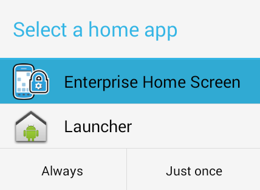

#### [What's New in EHS 4.1](#newinehs41)

## Overview
Zebra Enterprise Home Screen is a free Android app from Zebra Technologies that provides a simple way for administrators to control access to apps and settings on a Zebra device without the need to write custom code. Using a simple touch interface, EHS easily limits usage to one or more specified applications, prevents changes to device settings and locks down the file system. It can be configured in seconds, and settings can be deployed via MDM. EHS settings are stored in a simple XML file that's easy to read and edit by hand, if necessary. 

EHS works by inserting itself in place of the stock Android app launcher and home screen. When first run, it presents a screen like the one below, offering a choice of which home app to open and whether to make the selection permanent. EHS also can be installed as the default launcher, bypassing the selector dialog. 

<b>Note</b>: Many of the capabilities of EHS can be accomplished manually on the device, programmatically through [EMDK](../../../../emdk-for-android) or remotely using [StageNow](../../../../stagenow) or a third-party mobile device management (MDM) system (if supported by that MDM system). EHS simply puts the capabilities into a single tool, but does NOT provide a complete lockdown for securing devices. **For maximum security, Zebra recommends using EHS with additional security options provided by Android and Zebra’s MX (via EMDK or StageNow)**.

**Enterprise Home Screen supports the following languages**: 
* US English
* Simplified Chinese

------

The first time it's installed, EHS presents the admin with this simple choice: 

Selecting "Always" locks EHS in as the default home app and **locks users out of the following** device features by default:

* USB debugging
* Access to the file system
* Access to the Search app
* Keyguard-screen camera and search functions
* Full access to the System Settings panel
* Recent apps button

Administrators can grant or restrict access to individual features or hide the settings panel entirely. 

> **Note: After selecting "Always," wait 10 seconds before restarting to ensure the change remains persistent**. 

Ready to get started? [Download Enterprise Home Screen](https://www.zebra.com/us/en/support-downloads/software/utilities/enterprise-home-screen.html) now. 

-----

## New in EHS 4.1

* **New [Screen Blanking feature](../features/#screenblanking)** disables touch input when the device is in motion, adding a measure of safety when EHS is used in vehicle applications. 

### Supported Devices

**EHS 4.1 adds support for no new devices**. 

#### [See all supported devices](https://www.zebra.com/us/en/support-downloads/software/utilities/enterprise-home-screen.html) <i class="fa fa-external-link" aria-hidden="true"></i>

-----

### Android 10 Notes
***Applies to devices running Android 10 and later***.

* **When EHS is running in Google Multi-user mode**, app icons are sometimes not shown on secondary user’s Home screen while switching between primary and secondary users.
* **The Auto-launch Apps feature might work improperly if a delay of longer than two (2) seconds is set** between apps configured to launch at startup.
* **The Camera and Google Search apps are not visible in User mode after rebooting** the device with Android Multi-user mode enabled.

-----

### Android Pie Notes
***Applies to devices running Android 9.x Pie and later***.

* In Android multi-user mode, **Camera and Search apps are not locked for Secondary users** when locked by the Primary user or Administrator. 
* When multi-user mode is employed **on devices running Android Pie, app icons sometimes do not appear on the Secondary user's Home screen** when repeatedly switching between Primary and Secondary users. This can be addressed by logging in as the primary user then logging in as the secondary user, or rebooting the device.
* In the file browser UI, **access is limited to the following folders**:
  * internal storage
  * external storage (SD card)
  * `/enterprise/usr`

-----

### Android Oreo Notes
***Applies to devices running Android 8.x Oreo and later***.

* **SSID and BSSID information do not appear in the "Wireless Info" or "[Battery and Wi-Fi Quick View](../setup/#batteryandwifiquickview)" screens** on Oreo devices if Location services (Settings -> Security & Location -> Location) are turned off. 
* **If the operating system on a device (except TC20/TC25) is being upgraded to Android 8.1 Oreo** from Marshmallow or Nougat, **<u>the previous EHS installation must be removed before the new version of EHS is installed</u>**. Follow instructions to [uninstall EHS](../setup#uninstallation) before installing EHS on an Oreo device. **Prior configuration settings, if any, are re-applied automatically**.
* EHS **<u>CAN</u>** now launch links that reference local files though a “URL” tag (i.e. "file://&#42;.html") on devices running Android 8.x Oreo (and later). 

-----

## Version History

### Added in EHS 4.0

* **Now supports Zebra devices running Android 10** as well as Android 9.x Pie and 8.x Oreo. 
* **To enhance device and network security, EHS by default now hides potentially sensitive wireless device info** in User Mode. Optionally, an administrator can **[display wireless settings](../settings/#wirelessinformation)**, if desired.
* **[Recently Launched Apps](../settings/#recentappsaccess) can now be shown or hidden** from the User as desired by an administrator. 

#### Supported Devices

**EHS 4.0 adds support for the following devices running Android 10**:

* **MC33x**
* **PS20**
* **TC21**
* **TC26**
* **TC52**

-----

### Added in EHS 3.2

* **Now supports <u>ONLY</u> Android 8.x (Oreo) and Android 9.x (Pie)**.
* **EHS 3.2 download package contains a single .apk file** compatible with all supported devices running Oreo and Pie. 
* **Bypass user confirmation dialog when adding Pinned shortcuts** is a configurable option designed to aid automated shortcut creation by suppressing the dialog that appears when a shortcut is added. Disabled by default. 
* **EHS can now launch links that reference local files** though a “URL” tag (i.e. "file://&#42;.html") on devices running Android 8.x Oreo (and later) if files reside on internal or external storage (i.e. SD card).

-----

#### End of Support

* **Support for Android 7.x Nougat is dropped**. Use [EHS 3.1](/ehs/3-1/guide/about) if Nougat support is required. 

* **Support for Install Shortcuts is dropped**. This feature was coupled with Android Nougat, and is no longer supported with the termination of Nougat support. As an alternative, **Zebra recommends the use of [Pinned Shortcuts](../settings/#pinnedshortcuts)**, which are supported in devices running Android Oreo and later.

* **Support ends for the following devices running Nougat**: MC33, TC20, TC25, TC51, TC56, TC70x, TC75x, VC80x, WT6000

-----

### Added in EHS 3.1

* **Now supports <u>ONLY</u> Android 8.x (Oreo) and Android 7.x (Nougat)**.
* **New [Lockout Recovery mode](../settings/#lockoutrecovery)** allows an admin to quickly return a device to service that is locked after exceeding the maximum number of unsuccessful admin login attempts and to set the period of time (in minutes) the device must be locked before Lockout Recovery is possible. 
* **Now supports Android [Multi-user mode](../features/#multiusermode)**, which allows administrators to create Primary and Secondary device users, any of which can share a single EHS global configuration. **Applies to devices running Android 8.1.0 and higher only**.
* Compatible with **[GMS Restricted Mode](../features/#gmsrestrictedmode) -** an optional state on Zebra devices that disables GMS applications and services (i.e. Gmail, Google Maps, etc.) on the device based on administrator preferences. See the [Special Features section](../features/#gmsrestrictedmode) for important information about related EHS behaviors. 

-----

#### End of Support

* **Support for Android 6.x Marshmallow is dropped**. Use [EHS 3.0](/ehs/3-0/guide/about) if Marshmallow support is required. 

-----

#### Android Oreo Notes
***Applies to devices running Android 8.x Oreo and later***.

* **SSID and BSSID information do not appear in the "Wireless Info" or "[Battery and Wi-Fi Quick View](../setup/#batteryandwifiquickview)" screens** on Oreo devices if Location services (Settings -> Security & Location -> Location) are turned off. 
* **If the operating system on a device (except TC20/TC25) is being upgraded to Android 8.1 Oreo** from Marshmallow or Nougat, **<u>the previous EHS installation must be removed before EHS 3.1 is installed</u>**. Follow instructions to [uninstall EHS](../setup#uninstallation) before installing EHS on an Oreo device. **Prior configuration settings, if any, are re-applied automatically**.
<!-- 8/7/19- removed per eng. 
* EHS can **<u>NOT</u>** launch links that reference local files though a “URL” tag (i.e. "file://&#42;.html") on devices running Android 8.x Oreo (and newer).
 -->

-----

#### Android Nougat Notes
**_Applies to devices running Android Nougat 7.x and later_**:

* **Disabling access to the camera and/or search apps from the lock screen also might disable them from the User-Mode screen**, even if camera/search usage is permitted on the device. This occurs on some devices running Android N (and later) if the device is rebooted from the lock screen. To prevent this issue, use the [Screen Lock Type](/mx/devadmin/#screen-lock-type) parameter of DevAdmin CSP and disable the lock screen by selecting the "None" option. 
* **When referencing a file stored on a removable SD Card in a device running Android N (and later)**, references to that card must include its symbolic link rather than its direct path. For example, while the file path on pre-M devices might be visible as `/storage/sdcard1/image.png`, the same path on M and N devices might appear in the file browser something like `/storage/0097-B7BA/image.png`. The symbolic link (which in this case is "0097-B7BA") is **<u>unique to the device</u>**. Therefore, **Zebra recommends avoiding the use of removable storage in mass-deployment scenarios**. 
* **[Airplane Option Disabled](../settings#airplaneoptiondisabled) feature cannot be controlled through EHS on devices running Android N**. For devices on which the "Airplane option disabled" feature appears "grayed out" in the Admin-Mode Preferences panel, it might still be possible to access the feature using the [Power Key Manager](/mx/powerkeymgr) through Zebra EMDK or StageNow tools.
* **Some devices retain the "Recent Apps" list after device reboot**, posing a potential security risk. EHS disables the Recent Apps button on <u>Nougat (and later) devices</u> to help address this risk. For all devices, the list can be cleared using [App Manager](/mx/appmgr) through Zebra EMDK, StageNow or a third-party MDM system. For more information, see [Security Notes](../features#securitynotes) in the Special Features section. 
* **[Kiosk Mode](../features#kioskmode) should not be used with Screen Pinning**, an Android feature that works in a similar way.
* **[Screen orientation](../settings#orientation) can be changed through the Quick Settings panel on devices** <u>only</u> when EHS is configured to accept the System orientation setting (the EHS default). If an EHS administrator sets the orientation to landscape or portrait mode, the device user will no longer be able to change the orientation setting.

### Added in EHS 3.0

* **Support added for devices running Android 8.1 Oreo**.
* Supports **[Pinned Shortcuts](../settings/#pinnedshortcuts)** feature of Oreo similar to traditional shortcuts.    
* **Foreground services can now be auto-launched** in devices running Oreo. 
* **VectorDrawable format supported** for app launcher icons. [Learn more](https://developer.android.com/guide/topics/graphics/vector-drawable-resources). 
* **[Privileged Settings](../features/#privilegedsettings)** feature requires manual activation of certain settings when entering Admin Mode on a device. 
* The default `Config.xml` file now places the DataWedge Demo app in the User screen, replacing the Calculator app found in prior versions.

> **ABOUT OREO UPGRADES**: If the operating system on a device (except TC20/TC25) is being upgraded to Android 8.1 Oreo from Marshmallow or Nougat, **<u>the previous EHS installation must be removed before EHS 3.0 is installed</u>**. Follow instructions to [uninstall EHS](../setup#uninstallation) before installing EHS on an Oreo device.   **Note**: Prior configuration settings, if any, are re-applied automatically.
 
#### Device Support

EHS 3.0 now supports these devices **running Android 8.1 Oreo** 

* **MC33**
* **PS20 Personal Shopper**
* **TC52**
* **TC57**
* **TC72**
* **TC77**
* **TC51**
* **TC56**
* **TC70x**
* **TC75x**
* **VC80x**

#### End of Support

* **Support for Android 5.x Lollipop is dropped**. Use [EHS 2.8](/ehs/2-8/guide/about) if Lollipop support is required. 
* **Bypass Keyguard feature is dropped -** Use [DevAdmin](/mx/devadmin) through Zebra EMDK or StageNow tools to configure this setting. **NOTE: <u>Bypassing the keyguard in this way requires the Settings app (com.android.settings) to be enabled on the device; EHS disables it by default</u>**. Therefore, Zebra recommends bypassing the keyguard ***<u>before</u>*** EHS is installed or launched for the first time.
* **Secure Mode feature is dropped -** Log files are no longer designated as "SECURED" or "UNSECURED" in log entries. 

-----

### Added in EHS 2.8

#### Device Support

EHS 2.8 adds support for the following devices running Android Nougat:

* **WT6000** 

#### New Features

* **Simplified Chinese -** EHS has been approved to run on device operating systems localized for the Simplified Chinese language.

* **Enhanced Device Identifier Options -** Information to uniquely identify a device&mdash;its serial number, MAC address, network host name, Bluetooth address, Bluetooth name or IMEI number&mdash;can be displayed as the title bar text of the EHS home screen. 

* **Custom EHS icon no longer limited to home screen -** When a custom icon is used to replace the stock EHS icon, the icon can optionally be set to also display on other screens, including those for Battery Info, Wireless Info, Preferences and the Tools menu. 

* **File browsing in Preferences panel -** When selecting a title-bar icon or wallpaper image through the Preferences panel, tap-navigation is now possible to locate the image file and specify its path. File location is no longer limited to `/enterprise/usr` folder.

#### Enhancements/Fixes

* **Airplane mode enable/disable option is displayed** in the Preferences panel only on devices on which it is supported.

* **Disabling access to the camera and/or search apps from the lock screen no longer disables them from the User-Mode screen** if camera and/or search usage are permitted on the device. This issue arose when rebooting from the lock screen, and has been fixed for TC20 and TC25 models as well as devices running KitKat, Lollipop, Marshmallow. See [Android Nougat Notes](#androidnougatnotes). 

* **Password encryption has been enhanced** for the Admin login. See [important notes](../settings/#passwords). 

* **A colored screen is displayed** while EHS is starting up. 

* **Wallpaper and Title Bar Icon** features now support .bmp, .gif, .jpg, .png and .webp file formats and file location is no longer limited to `/enterprise/usr` folder.

#### Deprecations

* Secure Mode remains supported but is no longer being advanced
* The following features have been removed from EHS 2.8 and later: 
 * Enable/disable status bar pull-down
 * Enable/disable status bar settings icon
 * Enable/disable "exit instead of reboot"

**Notes**: 
* The discontinued features listed above can be accessed using Zebra's [StageNow](/stagenow) administrative tools or [EMDK](/) developer tools.
* A config file that contains settings for discontinued features generates an error in the EHS log file.

-----

### Added in EHS 2.7

>**This version does not support Android KitKat**. 

**EHS 2.7 supports Zebra devices running Android Lollipop and later only**. Zebra continues to support earlier versions of EHS for use on devices running KitKat. To use EHS on a device running KitKat, please [download EHS 2.6](/ehs/2-6/download) or an earlier version. 

#### Device Support
EHS 2.7 adds support for the following devices running Android Nougat:  

* MC33
* TC20* 
* TC25* 
* TC51
* TC56
* TC70x
* TC75x 

( * ) Requires a device-specific .apk file. See [download page](../../download) for details. 

#### New Features
* [Enable/Disable Recent Apps button](../settings/#recentappsbuttondisabled) on Android Nougat devices
* [Enable/Disable EHS Logging](../features/#ehslog) and set a maximum log file size 
* [Battery Health Percentage now displayed](../setup/#batteryandwifiquickview) on Battery info and Quick info screens on devices equipped with Zebra Power Precision Plus battery
* [Enable/Disable wallpaper stretching](../settings/#wallpaperstretching) to expand an image to fill the device screen

-----

### Added in EHS 2.6

* **Support for ET50/ET55** tablet computers running Marshmallow

-----

### Added in EHS 2.5

#### Device Support:
* [MC32](https://www.zebra.com/us/en/products/mobile-computers/handheld/mc3200.html) running Android 5.1.1 Lollipop
* [TC51/TC56](https://www.zebra.com/us/en/products/mobile-computers/handheld/tc51-tc56.html) and [TC75x](https://www.zebra.com/us/en/products/mobile-computers/handheld/tc7x-touch-computer-series.html) Touch Computers running Android Marshmallow 6.0.1
* [ET50/ET55 Tablet Computers](https://www.zebra.com/us/en/products/tablets/et50-55.html) running Android Lollipop 5.1.1 
* [TC8000 Touch Mobile Computer and Scanner](https://www.zebra.com/us/en/products/mobile-computers/handheld/tc8000.html) running Android Lollipop 5.1.1
* [TC70/TC75 Touch Computers](https://www.zebra.com/us/en/products/mobile-computers/handheld/tc7x-touch-computer-series.html) running Android Lollipop 5.1.1 
* The [MC67](https://www.zebra.com/us/en/products/mobile-computers/handheld/mc67-mobile-computer-series.html) Mobile Computer Series running Android 4.4 KitKat

#### Update for June, 2017:

* **Support added for [MC18](https://www.zebra.com/us/en/products/mobile-computers/handheld/mc1x-personal-shopper-series.html) and [MC40](https://www.zebra.com/us/en/products/mobile-computers/handheld/mc40-mobile-computer-series.html) running Lollipop**
* **Support added for [TC70x](https://www.zebra.com/us/en/products/mobile-computers/handheld/tc7x-touch-computer-series.html) running Marshmallow** 

#### EHS 2.5 No Longer Supports:
* **Devices with Android 4.1.2 Jelly Bean**
* **TC70 with Android 4.4.2 KitKat** (BSP version 112414)
 
**Zebra continues to support EHS on the TC70 with Android 4.4.2 KitKat and on Zebra devices running Jelly Bean**. [Download EHS 2.4](../../../2-4/download) to target these devices. 

#### New Features in EHS 2.5:
* **Easier download and installation**. The EHS 2.5 download package now includes a single APK for installing on all supported Zebra devices; no more multi-APK installer. 

* **Now links to [Techdocs](../../../../)**, Zebra's premier web site for user-facing documentation--now a standard component on every EHS installation.
 

[Download Enterprise Home Screen 2.5](https://www.zebra.com/us/en/support-downloads/software/utilities/enterprise-home-screen.html)

------

### Added in EHS 2.4

* **Support for the [Zebra WT6000](https://www.zebra.com/us/en/products/mobile-computers/wearable-computers/wt6000.html) -** wearable terminal running Android 5.0 Lollipop.

* **[Bundle Data Option](../settings#bundle) -** allows injection of app parameters, user data or other key-value pairs into an app on launch. 

* **[App Launch Flags](../settings#applaunchflags) -** permit one or more Android Intent flags to be specified when an application is launched, directing launch behavior as required. 

* **[Service Auto-Launch](../settings#serviceautolaunch) -** permits one or more Android services to be started whenever EHS launches. 

* **[Wildcard Character](../settings#applications) -** reduces the lines of code required in the EHS config file to specify apps for display in User Mode.

* **[Custom App Icons](../settings#icon) -** permits customized icons for apps and links, overriding the default system icons. 

* **[Custom Title-bar Icons](../settings#titlebariconfile) -** permits a custom icon to be displayed in the EHS Title Bar, overriding the default EHS icon. 

* **[App Icon Size](../settings#appiconsize) -** provides five sizes for Admin- and User-mode application icons.

<!-- 
_The icon size UI is accessible from Admin or User Modes (default shown)_.  

_The User Mode screen with XXL icons_. -->
* **[Battery and Wi-Fi Quick View](../setup#batteryandwifiquickview) -** displays real-time status of the device battery and Wi-Fi signal on a single screen.

* **[App Icon Label Text Color](../settings#iconlabeltextcolor) -** is now white on a transparent background to improve readability. 

------

### Added in EHS 2.3
* [Enable/disable device reboot](../settings#rebootoninstallenabled) when EHS is first launched after installation. 
* TC8000 KitKat version 4.4 support (added January, 2016)
