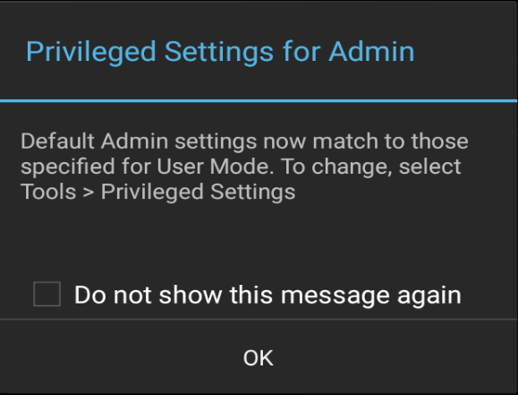

## Overview

This guide covers advanced EHS features such as Kiosk Mode and EHS Logging. It assumes a working knowledge of Enterprise Home Screen and use of its [Advanced Settings](../settings) through direct manipulation of the `enterprisehomescreen.xml` config file. For those not familiar with these procedures, please refer to the [About](../about) and [Setup](../setup) pages and the [Advanced Settings Guide](../settings) before continuing. 

<b>Note</b>: Many of the device-securing capabilities of EHS can be accomplished manually on the device, programmatically through [EMDK](../../../../emdk-for-android) or remotely using [StageNow](../../../../stagenow) or a third-party Enterprise Mobile Management (EMM) system (if supported by that EMM system). EHS simply puts the capabilities into a single tool.

> **Note**: Secure Mode is discontinued in EHS 3.0 and later. 

-----

## Screen Blanking

EHS 4.1 (and later) supports screen blanking, which can automatically place a black or transparent overlay atop the device screen when the GPS system detects movement, disabling touch input. Screen blanking is intended as a safety measure when EHS is used in vehicle applications. 

### Requirements
* **Supported only on GMS devices** with the Google Play service
* **GPS must be enabled** and functional on the device
* **"Display over other apps" must be enabled for EHS on device** (see image below)

_Click image to enlarge; ESC to exit_. 
 

### Notes
* **All touch input is blocked** when overlay is displayed.
* **Vehicle speed calculation is based on Google GPS** location API output.   
* **Incoming phone calls cannot be accepted** when blanking is active.
* **The transparent overlay allows display of Maps** or other apps but no user interaction.
* **Blanking becomes inactive when**: 
 * **Vehicle speed drops and remains below the configured speed threshold** for 10 seconds.
 * **GPS data is lost for a period of five (5) minutes**. The service checks for a GPS signal every five (5) minutes; blanking is restored automatically when GPS service resumes.  
* **The screen blanking feature takes about 15 seconds to initialize** following a device reboot. 

-----

### Enable Screen Blanking
Screen blanking is enabled by a device administrator using the EHS Preferences panel on the device or through a setting in the `enterprisehomescreen.xml` config file. For more information about this file, see the [Working with the Config File](../settings/#workingwiththeconfigfile) section of the Advanced Settings guide. 

_Click image to enlarge; ESC to exit_. 
 

#### Example
		:::xml
		<screen_blanking>
			<blanking_enabled>1</blanking_enabled>
		</screen blanking>

**Possible values**:
* **0 - Disabled (default; no overlay shown; touch input enabled)**
* 1 - Enabled (touch input disabled according to configured speed threshold)

### Speed Threshold
Used to set the vehicle speed (in miles per hour) at which screen blanking is enabled and touch input is disabled **(default = 10 MPH)**. **The minimum value is 5 MPH**. If a value of less than 5 is entered, the default value of 10 is used.  

_Click image to enlarge; ESC to exit_. 
 

#### Example
	:::xml
	<screen_blanking>     
		<speed_threshold>10</speed_threshold>
	</screen blanking>

**Possible values**:
* 5 &ndash; ∞ - **(default = 10 MPH)**

### Blanking Mode

Used to select the screen blanking mode; both of which disable touch input. Option 1 overlays the screen with black; no data is visible. Option 2 places a transparent covering over the current app, allowing data (such as Google Maps) to be visible. 

**NOTE: Mode changes take effect after the user visits the EHS Home Screen**.

_Click image to enlarge; ESC to exit_. 
 

#### Example
	:::xml
	<screen_blanking>      
		<blanking_mode>1</blanking_mode>
	</screen blanking>

Possible values:
* **1 - (default; black screen)**
* 2 (transparent screen)

-----

## Multi-user Mode

EHS 3.1 and later supports Multi-user Mode on devices running Android 8.x Oreo and later. The feature works through the concept of User Profiles, which allow for Primary, Secondary and Guest users, each with different sets of apps, capabilities and access privileges. In EHS, Multi-user Mode behaves as indicated below. 

**When multi-user mode is employed on devices running Android Pie**, app icons sometimes do not appear on the Secondary user's Home screen when repeatedly switching between Primary and Secondary users. This can be addressed by logging in as the primary user then logging in as the secondary user, or rebooting the device.

### User Types
* **Primary user -** the first user added to a device and **can be removed only by a factory reset**. The Primary user is always running, even when a Secondary user is in the foreground. This user has privileges available to no others, including the ability to add Secondary users and access all device features and settings.  
* **Secondary user -** any user that is not the Primary user. Secondary users can run in the background and continue to have network connectivity. **Secondary users can remove their own account or have it removed by the Primary with no impact on other users**. 
* **Guest user -** a temporary Secondary user that can be quickly deleted (along with any data it created) when no longer needed. **There can be only one Guest user on a device at a time**. Also see [Guest-user Behavior](#guestuserbehavior), below. 

### Multi-user Behavior

* **<u>The SD card slot is disabled</u>** when a device is in Multi-user Mode. Nothing can be saved to or read from an external SD card. 
* **The Primary user must be in the foreground on device when EHS is installed and first launched**. 
* Settings files for the Primary user deployed to a device apply to all users of that device. 
* Settings changes made by the Primary user automatically apply to Secondary users.
* Secondary users are prohibited from reconfiguring device settings by any means (i.e. config-file push, EHS UI). 
* Only Primary user can [change app icon size](../settings/#appiconsize). 
* EHS config files pushed to a device are not consumed by a Secondary user; settings take effect when the Primary user comes to the foreground.
* Shortcuts pinned to the Primary user's home screen DO NOT appear in those of Secondary users or vice-versa. 
* Only the Primary user has access to EHS Admin Mode. 
* **IMPORTANT**: When switching from a Primary user in Admin Mode to a Secondary user, the Admin-mode timeout counter stops. In theory, this could allow a Secondary user to switch back to the Primary user and access the features of Admin Mode on the device. 
* Camera- and Search-app icons (when enabled) do not always appear on the keyguard screen when switching between users until after a suspend/resume.

<!-- MX-invoked commands - Primary user only:

USB debugging - enable/disable
restricted system setings enable/disable
recent apps button -enable/disable
Disable/enable applications
Bypass keyguard (see TUT-28656)

-->

### Guest-user Behavior

When switching to a Guest user on a device, Android displays a prompt asking to select either "Start over" or "Continue." 

* **Start over -** removes all app icons from the desktop and deletes data created by the previous Guest user. 
* **Continue -** keeps app icons and DOES NOT delete data created during the previous guest session.

**Zebra recommends selecting "Continue" when working with EHS**. Selecting "Start over" removes all apps (including EHS) from the Guest account.

**Note: There can be only one Guest user on a device at a time**. 

-----

## GMS Restricted Mode

On GMS devices running Android 8.x Oreo and later, Zebra implements a feature called [GMS Restricted Mode](/mx/appmgr/#mainfunctionality), an optional state that disables GMS applications and services (i.e. Gmail, Google Maps, etc.) on the device based on administrator preferences. **Although these apps and services also are disabled on devices running EHS, <u>their names remain visible in the EHS Preferences -> Disable Applications</u>** panel. 

Attempts to enable any of the effected apps&ndash;either through the EHS Preferences UI or by pushing a config file&ndash;result in failure and are added to the [EHS log](../features#ehslog). Users attempting to enable GMS apps through the Privileged Settings UI also see a failure message on the screen.

-----

## Kiosk Mode
Kiosk Mode is designed for devices to run a single application, often with a touch-based UI. Examples include retail price checkers, auto parts look-ups, patient check-in systems and so on. Kiosk Mode also can be useful when dedicating a device to a single user and/or task, such as a retail clerk's hand-held barcode scanner. Kiosk Mode places the app in full-screen mode and prevents the BACK and HOME keys from being used to exit the app by mapping those keys to the Kiosk app's most recent activity. 

Also see the EHS [Auto-Launch](../settings#autolaunch) feature, which provides functionality similar to Kiosk Mode without changing the HOME and BACK key functions. 

##### Kiosk Mode tags:
<b>&lt;kiosk&gt;</b> - Specifies the app that runs when Kiosk Mode is enabled

<b>&lt;kiosk_mode_enabled&gt;</b> - Toggles the feature on and off
 

### Enable Kiosk Mode

In the `enterprisehomescreen.xml` file:

1. Specify the Kiosk app in the [&lt;kiosk&gt; section](../settings#kiosk) of the config file. 
2. Enter a value of '1' in the [&lt;kiosk_mode_enabled&gt; tag](../settings#kioskmodeenabled) in the Preferences section of the file. 
3. If USB Debugging is desired in Kiosk Mode, enter a value of '0' in the [&lt;usb_debugging_disabled&gt; tag](../settings#usbdebuggingdisabled).  
(See [Disable Kiosk Mode](#disablekioskmode) below for details). 

<b>Security Note</b>: When using Kiosk Mode, be sure to disable 'key remapping' and other possible methods of launching applications, which would thereby defeat Kiosk Mode safeguards. 

### Disable Kiosk Mode
Once Kiosk Mode is enabled it can be disabled in only one of two ways (without writing custom program code):

* <b>If USB Debugging was not disabled for User Mode</b>, disable Kiosk Mode by pushing to the device a config file with a value of '0' in the &lt;kiosk_mode_enabled&gt; tag.

* <b>If USB Debugging was disabled for User Mode</b>, perform a factory reset. 

##### Control Kiosk Mode Programmatically
Kiosk Mode can be controlled from within an Android application using Android Intents. The following JavaScript code shows how to enable and disable Kiosk Mode programmatically:  

	:::javascript
	//Disable Kiosk Mode:
	Intent intent = new Intent("com.symbol.enterprisehomescreen.actions.MODIFY_KIOSK_MODE");
 	Intent.putExtra("enable",false);
 	sendBroadcast(intent);

	//Enable Kiosk Mode:
	Intent intent = new Intent("com.symbol.enterprisehomescreen.actions.MODIFY_KIOSK_MODE");
 	Intent.putExtra("enable",true);
 	sendBroadcast(intent);

<b>Security Note</b>: When using Kiosk Mode, be sure to disable "key remapping" and other possible methods of launching applications, which would thereby defeat Kiosk Mode safeguards. 

-----

## Privileged Settings

In EHS 3.0 (and later), certain features once automatically enabled when entering Admin Mode must now be enabled manually. EHS refers to these as Privileged Settings:

* USB debugging
* The Android Settings panel app
* The Google Search app

Most notably, activation of USB Debugging enables the Android Debug Bridge (adb) and its ability to transfer files to and from a device. The Privileged Settings state on the device is indicated by a pop-up whenever the user enters Admin Mode: 

_Tap "OK" to dismiss_. 
 

All three Privileged Settings are enabled as a group through an Admin-mode UI control and **are disabled automatically when re-entering User Mode**.

**To access Privileged Settings**: 

1. While in Admin Mode, **go to Tools -> Privileged Settings for Admin**: 

 
2. The current state (disabled) is shown.   **Tap "Enable" to activate Privileged Settings**: 

 
3. Privileged Settings are enabled immediately. **Tap "OK" to continue**.

 

> **Administrator Note**: Be sure to restore settings (to disable USB debugging, Settings app, Search app) once privileged-mode tasks are completed.

-----

**To disable Privileged Settings**: 

2. **Go to Tools -> Privileged Settings for Admin**: 

 
3. The current state (enabled) is shown.   **Tap "Restore" to disable all three features**: 

 
4. Features are disabled immediately and a confirmation dialog appears. **Tap "OK" to continue**.

 

------

## EHS Log

EHS records all major activities, failures and security events in the `/enterprise/usr/enterprisehomescreen.log` file. These include failed attempts to enter Admin Mode, switches of the operating mode and all EHS errors. The log is a plain text file and can be retrieved with ADB or an EMM and viewed with any text editor.  

**In Multi-user Mode**, user events are tagged as follows: 

* **Primary user** - `User_0`
* **Secondary user(s)** - `User_10`, `User_11`, etc.

For more information about logging, see [Logging Preferences](../settings/#loggingdisabled). 

_In EHS 2.7 and later, logging can be enabled/disabled through the UI or config file._
 

**IMPORTANT**: Secure Mode is discontinued in EHS 3.0 and later. Log files are no longer designated as "SECURED" or "UNSECURED" in log entries.  

------

## Security Notes
This section covers important interactions between EHS and Android features that might impact device security or application behavior. 

### Recent Apps List

* Accessing an app from the Recent Apps list could represent a security risk; apps not cleared from the list can be activated with the BACK button, potentially exposing a non-EHS home screen.
* On devices running Android Oreo and later, **the Recent Apps button can be Enabled/Disabled**. It is disabled by default to prevent the use of multi-window mode. 
* **By default, EHS does not add apps or activities launched by the User to the Android Recent Apps list**, though such apps/activities could subsequently launch other apps/activities that would appear on the list and pose a security risk.
* **EHS 4.0 introduces an option to allow (or block) User access to the list of apps recently launched by the User**. 
 * When allowed, EHS displays apps launched by User in the Recent Apps List. 
 * When blocked, all apps/activities are hidden from view by the User. 
* Some devices retain the Recent Apps list after a reboot. Use [App Manager](/mx/appmgr) through EMDK, StageNow or a third-party EMM system to clear the list. 
* To manually clear Recent Apps, bring up the Recent Apps list by long-pressing the Home or Menu button (depending on the device) until the list appears, then swipe away each app or tap the "Close all" button. 

### Other Unintended Access

* Users might gain access to Airplane mode, Wi-Fi, Bluetooth and other device settings via the Quick Settings panel in the Notification drop-down even if Settings app is disabled by EHS. This can be prevented with settings configurable using the [UI Manager](/mx/uimgr) through StageNow or EMDK. 
* Wireless capabilities also can be individually disabled through these MX modules: 
	* [SettingsMgr](../../../../mx/settingsmgr) for Airplane Mode and Wi-Fi 
	* [UiMgr](../../../../mx/uimgr) for Quick Settings and the "Gear" icon
	* [WirelessMgr](../../../../mx/wirelessmgr) for Bluetooth, GPS, NFC and WWAN 
* MX modules are accessible using EMDK or StageNow tools. 
* Taking a screenshot (by pressing the "volume-down" and "Power" buttons simultaneously) while in User Mode might expose users to the Gallery app or to apps used for sharing images such as Gmail and MMS. To prevent this, disable such unwanted apps in the Disable/Enable Applications section of [Optional Feature Tags section](../settings#optionalfeaturetags).
* If the Programmable Keys feature on the Android System Settings panel is used to program a key to launch an application, that key mapping will be available in User Mode. 

### Bluetooth User Access

EHS by default disables the Settings app (`com.android.settings`) when the device is in User Mode or Admin mode. This prevents the "BT Pairing Utility" from enabling Bluetooth and pairing with devices. For organizations that wish to allow this capability, EHS offers a means of enabling Bluetooth control while restricting access to most other Settings panel features.

**To enable Bluetooth**: 

1. Enable the Settings app using the [Enable/Disable Apps](../settings/#enabledisableapps) feature. 
2. Enable the [Restrict System Settings](../settings/#systemsettingsrestricted) feature, which allows Bluetooth to be turned on and off while in User Mode. 

**The BT Pairing Utility now works as expected**. 

**Note**: The System Settings Restricted feature allows the device user to access Display and Sound settings and the "About device" screen. 

------
