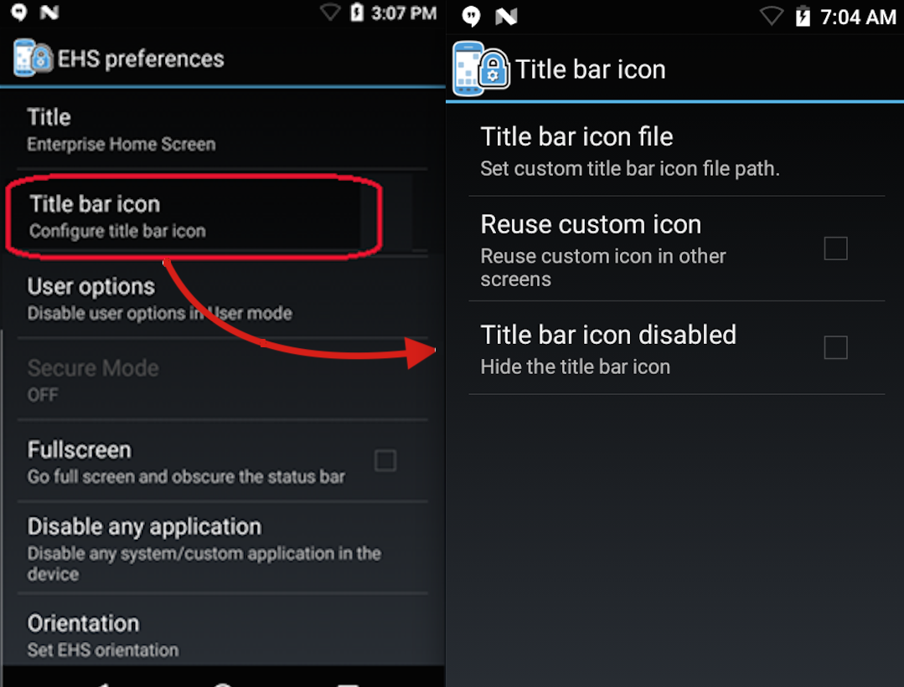
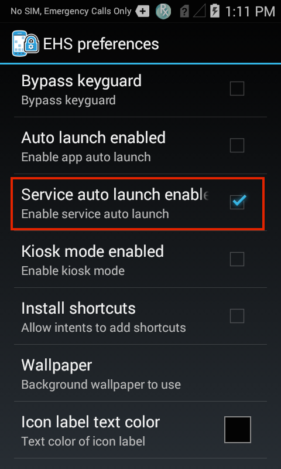
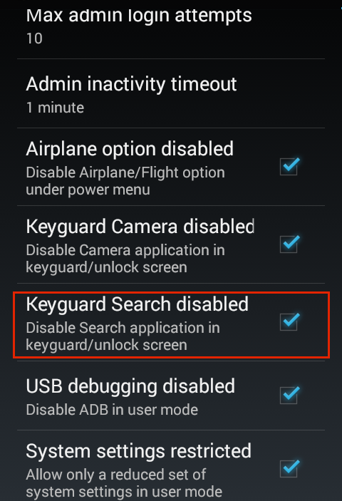
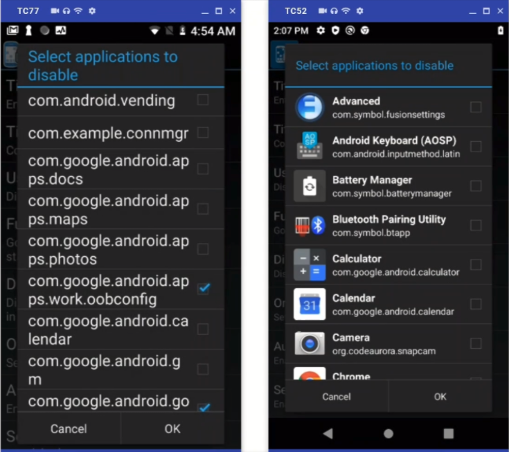
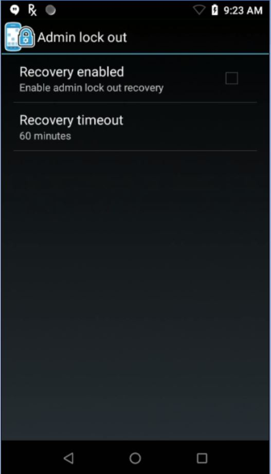

## Overview
This section assumes a basic knowledge of Enterprise Home Screen and its capabilities and essential workings. For those not familiar with Zebra's free security tool for its Android devices, please see the [About](../about) and [Setup](../setup) pages before continuing with this guide. Also see the [Special Features Guide](../features) for information about Kiosk Mode, device logging and other special EHS features. 

The behavior of Enterprise Home Screen is controlled entirely through `enterprisehomescreen.xml`, an easy-to-read file that can be modified with any text editor. A default version of the file contains many common device security settings plus a few standard apps, and is part of every EHS installation. In many instances, all that's needed to begin using EHS is to add an organization's own applications and to apply preferred security and display settings. 

<iframe width="560" height="315" src="https://www.youtube.com/embed/ukfhALWAWbY" frameborder="0" allow="accelerometer; autoplay; encrypted-media; gyroscope; picture-in-picture" allowfullscreen></iframe>
 

#### About this Guide
This guide describes the how to add apps and configure settings using the `enterprisehomescreen.xml` config file alone (if the setting also can be configured through the GUI, a screenshot is shown). It details the interaction between EHS and the config file, and provides instructions for accessing and customizing the file for a company's specific requirements, and for deploying the settings to device(s). A detailed analysis of the config file follows, with explanations of each of the parameters and examples of how to configure them. 

<b>Note</b>: Many of the capabilities of EHS also can be accomplished by other means on the device, either programmatically through [EMDK](../../../../emdk-for-android) or remotely using [StageNow](../../../../stagenow) or a third-party mobile device management (MDM) system (if supported by that MDM system). EHS simply puts these capabilities into a single tool.

-----

## Working with the Config File
This section describes important interactions between EHS and the `enterprisehomescreen.xml` config file, and instructions for retrieving, modifying and deploying the file to devices. 

-----

#### Config File Location

* The config file is stored in the `/enterprise/usr` directory on the device.
* This directory is <b>invisible</b> to most apps, <b>including Windows Explorer and Android File Transfer (Mac)</b>. 
* The directory is <b>visible to Android File Browser</b>, which can be used to manage its contents. 
* The file is <b>accessible via Android Debug Bridge (ADB)</b> "pull" and "push" commands. 

> <b>Note</b>: Use caution when exposing File Browser to users; it can be used to manipulate the EHS config file and change security or other settings.

-----

#### Forbidden Characters

The EHS config file is fully XML-compliant, and must remain so to be readable by EHS's XML parser. XML specifications forbid the use of five characters ( " ' < > & ) except in the ways described in the spec. If those characters are required as part of XML content, they must substituted with their "escaped" equivalents as follows: 

`"` (quote) `&quot;` 
`'` (apostrophe) `&apos;` 
`<` (less-than) `&lt;` 
`>` (greater-than) `&gt;` 
`&` (ampersand) `&amp;` 

-----

#### Config File Access

##### Using ADB

The Android Debug Bridge (ADB) is by far the most efficient way to work through the "pull-edit-push-test" cycle for configuring and testing changes to EHS settings through the `enterprisehomescreen.xml` file. The process requires a Mac or Windows PC that's connected via USB to a device with EHS installed. For help with software setup, please refer to [Setup Guide](../setup). 

>**NOTE: <u>The SD card slot is disabled</u> when a device is in Multi-user Mode**. See [Special Features section](../features/#multiusermode) for more information. 

From a computer connected to a target device that has EHS installed: 

&#49;. <b>Use ADB to pull the config file</b> from its default location to the local PC: 

    :::term
    adb pull /enterprise/usr/enterprisehomescreen.xml
 

&#50;. Locate, open and <b>edit the config file</b> with a text editor, saving changes. <b>Do NOT change the file name in any way</b>. 
 

&#51;. <b>Push the edited config file</b> to the device: 

    :::term
    adb push enterprisehomescreen.xml /enterprise/usr/enterprisehomescreen.xml

> **Important**: Be sure to **include the name of the edited source file in the adb push command**. Not doing so could cause changes to be ignored. 

##### What happens now? 

* Pushing a new version of the config file overwrites the old one. 
* If EHS is running, the new settings take effect immediately. 
* If EHS is in the background, the new settings take effect the next time EHS comes to the foreground.

##### Other Notes

* Config file must be named "`enterprisehomescreen.xml`" in lower-case letters. 
* A file with any other spelling or letter case is ignored.
* If the config file is deleted from the device, EHS will spawn a new config file with default settings.
* If a mixed-case config file of the same name is deployed, it will overwrite a correctly cased file.
* An incorrectly cased config file is treated as missing or cause unpredictable results.
* Once configured, a config file is suitable for [mass-deployment using an MDM](../setup/#automatedinstallation) with or without the EHS app.

##### Exporting the Config File
For device troubleshooting and certain other scenarios, it is sometimes useful to make the config file (`enterprisehomescreen.xml`) visible or to look inside the file and check its settings. The file can be made visible from Admin Mode by exporting it to a visible area of the file system. Alternatively, the config file can be viewed, copied, moved and shared via email or other means using the Android File Browser. 

#####NOTES:
* A config file exported to a visible area of the device file system might remain invisible to the PC until after the device is rebooted. 
* **The SD card slot is disabled when a device is in [Multi-user Mode](../features/#multiusermode)**; removable storage devices do not appear when selecting an export destination folder.

**To export a config file**: 

&#49;. In Admin Mode on the device, <b>select Export Configuration File</b> from the Tools menu:

 

&#50;. <b>Tap OK</b> to confirm the action:

_Removable storage devices do not appear if Multi-user Mode is enabled_.
 

&#51;. <b>Note the location</b> in the confirmation message:

 

&#52;. <b>Drag the config file</b> (arrow) to a PC for editing using Windows Explorer, Android File Transfer (shown) or a similar means:

 
<b>Note</b>: A config file exported to a visible area of the device file system might remain invisible to the PC until the device is rebooted. 

##### Using File Browser 
The Android File Browser offers a fast way to get a quick view inside the config file on a device. It also permits the file to be copied, moved or shared via email, Bluetooth or any means enabled on the device. 

To look inside the config file on a device: 

&#49;. In File Browser, <b>navigate to the /enterprise/usr directory</b>:

 

&#50;. <b>Long-press the</b> `enterprisehomescreen.xml`<b> file</b> to display the File Operations menu:

 

&#51;. <b>Select "Open as.."</b> to select a viewer and <b>hit Launch</b>:

 
It might be necessary to also tap "txt" to specify the extension type.  

&#51;. The config file will open in the Android HTML Viewer:

 

-----

## Default Config File
This section explains the `enterprisehomescreen.xml` config file, which controls all aspects of EHS behavior. The default version is shown below, followed by an explanation of the file's XML tags and the configuration options for each. 

The EHS config file is broken into five sections: 

* <b>Kiosk -</b> Specifies a single application to run when the device is in [Kiosk mode](). 
* <b>Applications -</b> The apps to be displayed when the device is in [User Mode]().
* <b>Tools -</b> The apps to be listed and launched from the User and Admin tools menus.
* <b>Passwords -</b> Stores the encrypted password for logging into Admin Mode. 
* <b>Preferences -</b> Controls which features and settings the device will display.  

**Default** `enterprisehomescreen.xml` **file**:

    <?xml version="1.0" encoding="utf-8"?>
    <config>
        <kiosk>
            <application label="DWDemo" package="com.symbol.datawedge" activity="com.symbol.datawedge.DWDemoActivity"/>
        </kiosk>
        <applications>      
            <application label="DWDemo" package="com.symbol.datawedge" activity="com.symbol.datawedge.DWDemoActivity"/>     
        </applications>
        <tools>
            <application label="DWDemo" package="com.symbol.datawedge" activity="com.symbol.datawedge.DWDemoActivity"/>     
        </tools>
        <passwords>
            <admin></admin>
        </passwords>        
        <preferences>
                <title>Enterprise Home Screen</title>
                <icon_label_background_color>#00FFFFFF</icon_label_background_color>
                <icon_label_text_color>#FFFFFFFF</icon_label_text_color>
                <orientation></orientation>
                <auto_launch_enable>0</auto_launch_enable>
                <service_auto_launch_enable>0</service_auto_launch_enable>
                <wallpaper></wallpaper>
                <kiosk_mode_enabled>0</kiosk_mode_enabled>
                <keyguard_camera_disabled>1</keyguard_camera_disabled>
                <keyguard_search_disabled>1</keyguard_search_disabled>      
                <usb_debugging_disabled>1</usb_debugging_disabled>
                <system_settings_restricted>1</system_settings_restricted>
        </preferences>
    </config>

-----

## Config Tags
This section describes all tags in the `enterprisehomescreen.xml` file and their possible values. They're shown below in the same order they appear in the default file, and are followed by optional tags. Tags can appear in any order, but must be contained within the &lt;config&gt; &lt;/config&gt; tag set (node). 

------

### Kiosk

Specifies the app to run when the device is in [Kiosk Mode](../features), an optional mode under which a single app fills the screen and the BACK and HOME keys cannot be used to exit it. Kiosk Mode is activated using the &lt;kiosk_mode_enabled&gt; tag in the &lt;Preferences&gt; section. 

<b>Possible values</b>:

* Label: string 
* Package: app package name 
* Activity (optional): name of the activity to be invoked when the app starts

##### Example

    <kiosk>
            <application label="Calculator" package="com.android.calculator2" activity=""/>
    </kiosk>

------

### Applications

Specifies the applications and/or browser links to be displayed to users while EHS is in User Mode. An optional activity parameter permits an app activity to be invoked when the app starts up. <b>Some apps do not launch unless the app package _and_ an activity are specified</b>. 

When specifying links, the package and activity parameters can be used to launch the URL with a specific app, such as Mozilla Mobile browser. If no activity is specified, EHS will open the link using the default browser.

#####NOTES:
* Package names might vary from one Android version to another. 
* **EHS 3.0 and later supports VectorDrawable app icons**, which scale to different sizes without loss of image quality. [Learn more](https://developer.android.com/guide/topics/graphics/vector-drawable-resources).
* **EHS can launch links that reference local files** though a “URL” tag (i.e. "file://&#42;.html") on devices running Android 8.x Oreo (and later) if files reside on internal or external storage (i.e. SD card).
* **Applications and links appear in the User Mode Launcher** in the same order as listed in the &lt;applications&gt; node.
* **When apps *<u>and</u>* links are present in the &lt;applications&gt; node**, links are displayed first, then apps, regardless of their order in the node (see image, below). 

_Links are displayed before apps regardless of their order in the node_. 
_Click image to enlarge; ESC to exit_. 
  

------

#### Chinese Edition
In the EHS version localized for Simplified Chinese, the default `enterprisehomescreen.xml` config file contains sample apps with English-language titles. If any of the same apps are added in the Chinese edition, those apps will appear twice in User Mode&mdash;once with the English title and again with the Chinese. If this is undesired, remove the unwanted `<application>` entry from the `<applications>` node in the config file. 

------

#### Application Example 

<b>Possible values (apps)</b>:

* Label: string
* Package: app package name 
* &#42; (asterisk): used as a wildcard to specify multiple packages with the same prefix 
* Exclude: used with wildcard to omit one or more apps from a wildcard set
* Activity (optional): name of an activity to be invoked when an app starts

####Sample XML using wildcard to select several apps: 

    <applications>
        //The following lines:
          <application label="Packaging" package="com.mobility.packaging" activity=""/>
          <application label="Online" package="com.mobility.online" activity=""/>
          <application label="Remote" package="com.mobility.remote" activity=""/>
          <application label="Inventory" package="com.mobility.inventory" activity=""/>
          <application label="Orders" package="com.mobility.orders" activity=""/>

        //...could be replaced with this single line using the wildcard character:
            <application package="com.mobility.*"/>

        //...adding a label to line above applies the label to all apps in the wildcard set:
            <application label="RetailApps" package="com.mobility.*"/>

        //To exclude one or more apps from the wildcard set: 
            <application package="com.mobility.*" exclude=”com.mobility.inventory”/>

            //The line above removes the "inventory" app. The line below removes both the "inventory" and "online" apps.  
            
            <application package="com.mobility.*" exclude=”com.mobility.inventory; com.mobility.online”/>
    </applications>
 

####Using wildcard to display all Android apps with "c" as their first letter:

    <applications>
        <application label="" package="com.android.c*"/>
    </applications>
 

####Display all Android apps starting with the letter "c" except Calculator: 

    <applications>
        <application label="" package="com.android.c*" exclude="com.android.Calculator2"/>
    </applications>
 

####Display all Android apps starting with the letter "c" except Contacts and Camera: 

    <applications>
        <application label="" package="com.android.c*" exclude="com.android.camera2;com.android.contacts"/>
    </applications>

#####Wildcard rules:
* Individual apps and wildcard sets appear in the User Mode Launcher in the same order as listed in the &lt;applications&gt; node. 
* Apps within each wildcard set are listed alphabetically by label relative to other apps in that set. 
* Wildcard search is designed to work with packages that comply with the &#34;&lt;any_name&gt;.&lt;any_name&gt;&#42;&#34; format. 
* If **bundle** and **icon** attributes are used, the same specified attributes apply to all wildcard-selected apps. 
* Wildcard search works only with User Mode apps; it is not supported for apps specified for the Tools Menu, Auto Launch, or Kiosk Mode. 
* Apps selected by wildcard cannot be removed using the long-press feature in Admin Mode. 
* Apps excluded from a wildcard search cannot be added using the long-press feature in Admin Mode.
* The exclude attribute does not support the wildcard character; apps must be excluded one at a time.
* Apps individually specified in the &lt;applications&gt; node and included in a wildcard search cannot be excluded using an "exclude" attribute or tag.
* If the label is undefined in XML, labels of wildcard-selected apps are applied to icons as they appear in the Android manifest (if undefined in the Manifest, app will appear with a blank label).
* Labels longer than 18 characters are truncated at the 18th character and appended with an ellipsis (...).
* The label specified in a wildcard search will apply to all apps identified by the search. 
* The wildcard character might appear only once per line and **only at the end of the line**. 
* The following wildcard searches have been blocked by EHS as a security measure, avoiding the accidental inclusion of all standard Android apps: 

    * com.android.&#42;
    * com.android&#42;
    * com.androi&#42;
    * com.andro&#42;
    * com.andr&#42;
    * com.and&#42;
    * com.an&#42;
    * com.a&#42;
    * com.&#42;

* Wildcard searches can include "com.androidX" where X=any character except dot (.).  
* The `enterprisehomescreen.log` file will store error messages resulting from invalid wildcard usage. 
* The EHS app and EHS installer always are excluded from any filtered app list. 

-----

#### URL Example

<b>Possible values (URLs)</b>

* Label: string
* Package: URL (http://, https:// or file://&#42;.html)
* **Links to a file MUST reside on <u>external</u> storage (i.e. an SD card)**

####Sample XML (for web link)

    <applications>
        ...
        <link label="Mozilla Mobile" url="http://www.mozilla.org/en-US/mobile/" package="org.mozilla.firefox" activity="org.mozilla.firefox.App" />
        ...
    </applications>

In the example above, the package and activity attributes are used to launch the URL in the Mozilla Mobile browser. If the specified app (as defined in the package and activity parameters) is not present on the device, the URL will not be displayed. If no activity is specified, EHS will launch the link using the default browser. 

<!-- Per TUT-30507, file URIs are now supported on Oreo
**`OREO NOTE:`** EHS can **<u>NOT</u>** launch links that reference local files though a “URL” tag (i.e. "file://&#42;.html") on devices running Android 8.x Oreo (and newer). 
 -->
#### Link Removal
To remove a web link from the User Mode screen: 

1. Delete the **entire tag** (which begins with "&lt;link label=" and ends with "/&gt;" as shown above) from the &lt;applications&gt; node of the `enterprisehomescreen.xml` file. 
2. Redeploy the modified `enterprisehomescreen.xml` file to the device. 

------

### Tools
Specifies the apps to be listed in the Tools menu of Admin and User Modes. <b>Note</b>: Package names might vary from one Android version to another. 

<b>Possible values</b>:
* Label: string
* Package: app package name 
* Activity (optional): name of the activity to be invoked when the app starts

#### Example

    <tools>
        ...
        <application label="Calculator" package="com.android.calculator2" activity=""/>
        ...   
    </tools>

------

### Passwords
Stores the encrypted password for logging into Admin Mode (blank by default). <b><u>Do not populate this tag manually</u> in the config file or edit in any way</b>. The administrator password is stored here programmatically by EHS after being entered or changed through the Tools menu in EHS Admin Mode. EHS uses this tag to store the password as a 256-bit AES-encrypted hash. Once a password is created and stored in the config file, it can be mass-deployed along with all other settings.

##### Important Password Encryption Notes: 
* **EHS 2.8 (and later) implements a more secure encryption method** than prior versions. 
* **EHS 3.0 (and later) is backward-compatible** with passwords stored in config files of older EHS versions.
* **After EHS 3.0 accesses a password from a prior version**, it stores that password in the config file using the new encryption method. 
* **Once a config file is updated using the new encryption**, that file is no longer compatible with older EHS versions. 

_The admin password <b><u>must</u></b> be entered and changed using the Admin Tools menu in the EHS GUI_. 

<b>Possible values</b>:

* (**EHS USE ONLY; Do not add to or edit the contents of this tag**)

#### Example

    <passwords>
        <admin>EHS USE ONLY</admin>
    </passwords>

------

### App Icon Size
Permits the size of application icons to be set to Small, Medium, Large, Extra Large and Extra Extra Large . Icon size can be controlled through the `enterprisehomescreen.xml` file or through the device UI while in Admin or User Modes. 

#####NOTES:
* **EHS 3.0 and later supports VectorDrawable app icons**, which scale to different sizes without loss of image quality. [Learn more](https://developer.android.com/guide/topics/graphics/vector-drawable-resources).
* When [Multi-user Mode](../features/multiusermode) is enabled, **only the Primary user can change the app icon size**. 

**To change the icon size through the UI**:

In Admin or User Mode, **tap the menu icon** and **select Icon settings**: 

_Icon size setting applies to Admin and User Modes_.
 

**Tap on the desired icon size**, then tap OK. Selected size is applied immediately. 

_Medium (shown) is the default icon size_. 
 

_App icons can be displayed in five sizes; changes apply to Admin and User Modes_.  
 

**To set icon size through the** `enterprisehomescreen.xml` **file**: 

<b>Possible values</b>:

* S = Small icons
* M = Medium-sized icons
* L = Large icons
* XL = Extra large icons
* XXL = Extra extra large icons

#### Example

    <user_options>
        <icon_settings>
            <app_icon_size>XL</app_icon_size>
        </icon_settings>   
    <user_options>

------

### Preferences
Control various aspects of EHS behavior, security and display settings corresponding to options configured in the EHS Preferences UI panel. Tags of individual preferences can appear in any order, but **must be contained within the &lt;preferences&gt; &lt;/preferences&gt; node**. 

------

### Title
Specifies the title bar text for the EHS app. The default title "Enterprise Home Screen" can be changed to any static string of characters or emoji(s). For device-specific (dynamic) options, see [Device ID in Title](#deviceidintitle) below.  

<b>Possible values</b>:

* character string

#### Example

    <preferences>
        <title>MetaCorp Home Screen</title>
    </preferences>

------

### Device ID in Title

Allows (dynamic) information that uniquely identifies the device to be displayed as the title bar text of the EHS home screen. Specify serial number, Wi-Fi MAC address, Wi-Fi host name, Bluetooth address, Bluetooth name or IMEI number.

<b>Possible values</b>:

* Plain (static) text or emojis before and/or after any single device ID:
 * [bluetooth_address] - Bluetooth MAC address (see NOTES, below)
 * [bluetooth_name] - Bluetooth "friendly" device name
 * [imei_number] - International Mobile Equipment Identity (WWAN devices only; see NOTES, below) 
 * [mac_address] - Wi-Fi MAC address
 * [network_host_name] - Wi-Fi host name
 * [serial_number] - Device serial number

#####NOTES:
* **If the IMEI number is specified** in a non-WWAN device, the default EHS title is displayed.
* **To display the Bluetooth MAC address** as the title, Bluetooth must be enabled on the device ([how to enable Bluetooth](../features/#bluetoothuseraccess)). 
* **If the MAC address is specified but unavailable**, the default EHS title is displayed.

**<u>WARNING</u>: Square brackets must not be used inside the &lt;value&gt; tags except as specified above**. 

#### Example
    <preferences>
            <title>
                <value>MetaCorp device #[serial_number]</value>
            </title>
    </preferences>

#####NOTES:

* **The &lt;title&gt; tags must contain either a static title or the &lt;value&gt; tags**; never both.
* **If &lt;title&gt; tags are not present in the** `enterprisehomescreen.xml` **file** or if identifier data retrieval fails, the text “Enterprise Home Screen” is inserted. 
* **Errors retrieving identifier data** are written in the [EHS log](../features/#ehslog). 
* **Square brackets must not be used** inside the &lt;value&gt; tags except as specified above. 

------

### Title Bar Icon Disabled
Controls whether an icon is displayed in the Title Bar of the EHS home screen. **A value of 0 (false) allows EHS to display the standard EHS icon or a custom icon specified in the [Title Bar Icon File parameter](#titlebariconfile) below**. 

<b>Possible values</b>:

* <b>1 - (default, no icon displayed)</b>
* 0 - (displays EHS icon or icon specified [below](#titlebariconfile))

#### Example
    <preferences>
        <title_bar_icon>
            <title_bar_icon_disabled>0</title_bar_icon_disabled>
            <title_bar_icon_file>/storage/sdcard0/Android/data/com.symbol.enterprisehomescreen/files/title.jpg</title_bar_icon_file > 
        </title_bar_icon >
    </preferences>

------

### Title Bar Icon File
Allows an image to be specified for display in the EHS Title Bar. **Supports .bmp, .gif, .jpg, .png and .webp image formats of medium resolution** (varies by device; some high-res images might not display). Image must be stored locally on the device and specified in the `enterprisehomescreen.xml` file or in the UI using the full path. Images are scaled (up or down) using the aspect ratio of the image to fill the available space (which varies by device). Default EHS icon (shown below) is displayed if tag is missing or left blank, or if the specified image file is missing or invalid. Icon can optionally be displayed on other screens. See [Reuse Custom Icon](#reusecustomicon) below.

When selecting an image using the Preferences panel UI, use tap-navigation to locate the image in the device file system or specify the file name and path using the keyboard (required for restricted areas not visible to the file browser). 

<b>Possible values</b>:

* fully qualified local (on-device) path to a .bmp, .gif, .jpg, .png or .webp image file

#####NOTES:
* **Use of this tag requires addition of &lt;title_bar_icon&gt; node** to `enterprisehomescreen.xml` file; not included by default.
* **Default EHS logo is used if tag is missing or left blank**, or if the specified image file is missing or invalid (such instances are [logged](../features/#ehslog)).
* **Only files in the** `/enterprise` **directory are persistent**, and remain on the device following an [Enterprise Reset](/mx/powermgr/#enterprisereset). 
* **Zebra recommends avoiding the use of removable storage for wallpaper and icon image files**.
* **The SD card slot is disabled when a device is in [Multi-user Mode](../features/#multiusermode)**; files on removable storage are not accessible in this mode.
* **For Android Pie devices with EHS 3.2 or later, folder access with the file browser UI is limited** to:
  * internal storage
  * external storage (SD card)
  * /enterprise/usr

#### Example

    <preferences>
        <title_bar_icon>
            <title_bar_icon_disabled>0</title_bar_icon_disabled>
            <title_bar_icon_file>/storage/sdcard0/Android/data/com.symbol.enterprisehomescreen/files/title.jpg</title_bar_icon_file > 
        </title_bar_icon >
    </preferences>

-----

### Reuse Custom Icon
Optionally designates the custom graphic specified using the [Title Bar Icon File tag](#titlebariconfile) (above) to display on most EHS screens, including those for Battery Info, Wireless Info, Preferences and the Tools menu (excludes "About" box). 

<b>Possible values</b>:

* 1 - Reuse the custom icon in other EHS screens
* **0 - Do not reuse icon (default)** 

#### Example
    <preferences>
        <title_bar_icon>
                   <title_bar_icon_file>/storage/sdcard0/title.jpg</title_bar_icon_file >
                   <reuse_custom_icon>1</reuse_custom_icon>
        </title_bar_icon >
    </preferences>

**Note: To hide a custom icon from the EHS screens effected by this tag (and display the default EHS logo instead), set the tag value to "0."** The "Title Bar Icon Disabled" tag applies only to the home screen. 

------

### Icon Label Background
Specifies the background color of the icon label text of apps and links displayed in Admin and User Modes. Default background is #00FFFFFF, which is transparent with an opacity value of 00 (from a range of 00 to FF). Get help [picking HTML color codes](http://www.colorpicker.com/).

 

**Code Key**:

* AA specifies the opacity 
* RR specifies the level of RED
* GG specifies the level of GREEN
* BB specifies the level of BLUE

<b>Possible values</b>:

* HTML hexadecimal color code values with or without opacity prefix (#RRGGBB or #AARRGGBB)
* Color names: red, blue, green, black, white, gray, cyan, magenta, yellow, lightgray and darkgray.

#### Examples

    <preferences>
        <icon_label_background_color>#00FFFFFF</icon_label_background_color>
        <icon_label_background_color>#75A319</icon_label_background_color>
        <icon_label_background_color>#80EF671B</icon_label_background_color>
        <icon_label_background_color>magenta</icon_label_background_color>
    </preferences>

------

### Icon Label Text Color
Specifies the color of the icon label text of apps and links displayed in Admin and User Modes. The EHS default icon text color is #FFFFFFFF, that is white with an opacity value of FF (from a range of 00 to FF). Get help [picking HTML color codes](http://www.colorpicker.com/).

 

**Code Key**:

* AA specifies the opacity 
* RR specifies the level of RED
* GG specifies the level of GREEN
* BB specifies the level of BLUE

<b>Possible values</b>:

* HTML hexadecimal color code values with or without opacity prefix (#RRGGBB or #AARRGGBB)
* Color names: red, blue, green, black, white, gray, cyan, magenta, yellow, lightgray and darkgray.

#### Examples

    <preferences>
        <icon_label_text_color>#FFFFFFFF</icon_label_text_color>
        <icon_label_text_color>#75A319</icon_label_text_color>
        <icon_label_text_color>#80EF671B</icon_label_text_color>
        <icon_label_text_color>magenta</icon_label_text_color>
    </preferences>

------

### Orientation
Allows the screen orientation to be fixed in landscape or portrait mode. Omitting or leaving this setting blank (default) allows the Android-System orientation setting to control screen orientation.  

Screen orientation can be changed through the Quick Settings panel only when EHS is set to accept the System orientation setting (the EHS default). If an EHS administrator sets the orientation to landscape or portrait mode, the device user will no longer be able to change the orientation setting.

#####NOTES:
* **Zebra recommends leaving this setting blank** (default) if app- and system-control of screen orientation are desired.
* **The orientation set using this parameter applies ONLY to EHS screens**, such as the EHS Home screen, info and preferences screens.
* **Android orientation (auto-rotate/portrait/landscape) settings remain effective on non-EHS apps** regardless of this parameter setting.

<b>Possible values</b>:

* landscape
* portrait
* <b>&lt;blank&gt; (accepts System setting; EHS default)</b>

#### Example

    <preferences>
        <orientation></orientation>
    </preferences>
    
------

### Auto Launch Enable (apps)
Enables one or more apps to be automatically launched after EHS starts up. Works with optional &lt;auto_launch&gt; section. When enabled, apps specified in the &lt;auto_launch&gt; section are launched after a specified delay. <b>BACK and HOME keys can be used to exit the app</b>. See the [Optional Feature Tags section](#optionalfeaturetags) for more information. Disabled by default. See also: [Kiosk Mode](#kiosk). 

<b>Possible values</b>:

* 1
* <b>0 (default)</b>

#### Example

    <preferences>
        <auto_launch_enable>0</auto_launch_enable>
    </preferences>

------

### Service Auto Launch Enable
Enables one or more services to be automatically launched after EHS starts up. Works with optional &lt;service_auto_launch&gt; section. When enabled, apps specified in the &lt;service_auto_launch&gt; section are launched after a delay, if specified. The Service Auto-Launch feature can be enabled/disabled in the `enterprisehomescreen.xml` file or Admin-Mode UI; Services must be specified in the config file. See the [Optional Feature Tags section](#optionalfeaturetags) for details. Disabled by default. 

<b>Possible values</b>:

* 1
* <b>0 (default)</b>

#### Example

    <preferences>
        <service_auto_launch_enable>1</service_auto_launch_enable>
    </preferences>

------

### Foreground Service Auto Launch Enable
Enables one or more services to be automatically launched in the foreground after EHS starts up. Works with optional &lt;foreground_service_auto_launch&gt; section. When enabled, apps specified in the &lt;foreground_service_auto_launch&gt; section are launched after a delay, if specified. The Foreground Service Auto-Launch feature can be enabled/disabled in the `enterprisehomescreen.xml` file or Admin-Mode UI (Oreo devices only); Services must be specified in the config file. See the [Optional Feature Tags section](#optionalfeaturetags) for details. **Disabled by default**. 

<b>Possible values</b>:

* 1
* <b>0 (default)</b>

#### Example

    <preferences>
        <foreground_service_auto_launch_enable>1</foreground_service_auto_launch_enable>
    </preferences>

-----

### Wallpaper
Allows a background image to be specified for display in Admin and User Modes. If left unspecified, the system's default image is displayed. **Supports .bmp, .gif, .jpg, .png and .webp file formats. Resolution support varies by device**. If a selected image fails to display, Zebra recommends scaling down the resolution or selecting a different image. 

When selecting an image using the Preferences panel UI, use tap-navigation to locate the image in the device file system or specify the file name and path using the keyboard (required for restricted areas not visible to the file browser). 

<b>Possible values</b>:

* fully qualified local (on-device) path to .bmp, .gif, .jpg, .png or .webp file

#####NOTES:
* **Only files in the** `/enterprise` **directory are persistent**, and remain on the device following an [Enterprise Reset](/mx/powermgr/#enterprisereset). 
* **Zebra recommends avoiding the use of removable storage for wallpaper and icon image files**.
* **For Android Pie devices with EHS 3.2 or later, folder access with the file browser UI is limited** to:
  * internal storage
  * external storage (SD card)
  * /enterprise/usr

#### Example

    <preferences>
        <wallpaper>/enterprise/usr/mybackground.png</wallpaper>
    </preferences>

------

### Wallpaper Stretching
Used to enable/disable the background image for display in Admin and User Modes to be stretched to fill the screen. Disabled by default. Stretching is disabled if this value is unspecified. **See Wallpaper parameter for supported file format and location**.  

_EHS with default wallpaper_:

_**Stretching disabled** (default) with custom wallpaper image_:

_**Stretching enabled** with custom wallpaper image_:

<b>Possible values</b>:

* 1 (stretching enabled)
* <b>0 (default)</b>

#### Example

    <preferences>
          <wallpaper_stretching_enabled >0</wallpaper_stretching_enabled >
    </preferences>

------

### Fullscreen
EHS can be made to run in full-screen mode by setting the value of this tag to 1. Default is 0. Applies only to EHS; apps launched from within EHS behave as individually designed. Does not prevent access to the Android Status/Notification Bar on some devices.  

<b>Possible values</b>:

* 1 (sets EHS to run in full screen mode)
* <b>0 (default)</b>

#### Example

    <preferences>
        <fullscreen>1</fullscreen>
    </preferences>

------

### Kiosk Mode Enabled
Causes the app specified in the &lt;kiosk&gt; section to be launched in full screen mode after EHS start-up and prevents use of BACK and HOME keys to exit the app. Disabled by default. See also: [Auto-Launch](#autolaunch). <!-- 10/18/18- removed L ref. per eng. **On Android L devices: Kiosk Mode should not be used with Screen Pinning, a feature in Android L that provides similar functionality**. -->

> Once enabled, Kiosk Mode can be disabled by pushing a new config file with its tag set to "0" if USB Debugging is enabled. Otherwise a factory reset is required. Kiosk Mode also can be enabled/disabled programmatically from an Android application using Android Intents. For more information, see the [Special Features section](../features/#disablekioskmode).

<b>Possible values</b>:

* 1
* <b>0 (default)</b>

#### Example

    <kiosk_mode_enabled>0</kiosk_mode_enabled>

------

<!-- 8/6/19- Removed per eng; Nougat support dropped. 
### Install Shortcuts
**Applies to Nougat devices only**. Controls whether shortcuts to local apps or websites can be added programmatically. **Disabled by default**. See [Shortcuts and Intents](#shortcutsandintents) for more information. For shortcuts in Oreo devices, see [Pinned Shortcuts](#pinnedshortcuts), below.  

<b>Possible values</b>:

* 1
* <b>0 (default)</b>

#### Example

    <install_shortcuts>0</install_shortcuts>

-->

### Pinned Shortcuts

**Applies to Oreo (and later) devices only**. Controls whether shortcuts to local apps or websites can be added programmatically. **Disabled by default**. See [Shortcuts and Intents](#shortcutsandintents) for more information. 

<b>Possible values</b>:

* 1 (allow pinned shortcuts)
* <b>0 (default, block pinned shortcuts)</b> 

#### Example

    <preferences>
        <pin_shortcuts>0</pin_shortcuts>
    </preferences>

------

### Reboot on Install Enabled
Controls whether the device will automatically reboot when EHS is launched for the first time after a successful installation, a requirement to activate EHS. Permits Mobile Device Management (MDM) systems to maintain device control following installation. Automatic device reboot is disabled by default.

<b>Possible values</b>:

* 1
* <b>0 (default, do not reboot)</b>

#### Example

    <preferences>
        <reboot_on_install_enabled>0</reboot_on_install_enabled >
    </preferences>

------

### Airplane Option Disabled

**This feature is obsolete, and has been removed from EHS 3.0 and later**. 

Use [Power Key Manager](/mx/powerkeymgr) through Zebra EMDK or StageNow tools.

------

### Bypass Keyguard

**This feature is obsolete, and has been removed from EHS 3.0 and later**. 

Use [DevAdmin](/mx/devadmin) through Zebra EMDK or StageNow tools.  

------

### Keyguard Camera Disabled
Controls whether the device camera is accessible from the Keyguard screen (also known as the "Lock Screen") when the screen lock is set to "Swipe" mode. Camera access from the Keyguard screen is disabled if this tag has a value of 1 (default) or is left unspecified. 

**The Keyguard camera is disabled only if <u>all</u> of the following conditions are true**:

* The camera app is enabled on the device
* The Keyguard screen is in "Swipe" mode 
* The camera icon is visible on the Keyguard screen 

Unless **_all four_** of the above conditions are true, the value in this tag is ignored. 

#####NOTES:
* **To prevent use of the camera**, Zebra recommends using this tag _and_ removing the camera app from the User Mode screen.  
* **If no camera shortcut exists on the device lock screen**, use of this tag is not required. 
* **Display of the camera app icon on the Admin home screen can be delayed** by as much as five seconds after unlocking the screen following a configuration change. 
<!-- 8/6/19- Removed per eng; Nougat support dropped.
* **On some devices running Nougat (except TC20/TC25), disabling access to the camera and/or search apps from the lock screen also might disable them from the User-Mode screen**, even if camera/search usage is permitted on the device. To prevent this issue, use the [Screen Lock Type](/mx/devadmin/#screen-lock-type) parameter of DevAdmin CSP and disable the lock screen by selecting the "None" option. 
 -->

<b>Possible values</b>:

* <b>1 (default)</b>
* 0 

#### Example

    <keyguard_camera_disabled>1</keyguard_camera_disabled>

------

### Keyguard Search Disabled
Controls whether the Search app is accessible from the Keyguard screen (also known as the "Lock Screen") when the screen lock is set to "Swipe" mode. Search access from the Keyguard screen is disabled if this tag has a value of 1 (default) or is left unspecified. 

Applies only if **_all_** of the following conditions are true:

* The search app is enabled on the device
* The Keyguard screen is in "Swipe" mode 
* The search icon is visible on the Keyguard screen 

Unless **_all four_** of the above conditions are true, the value in this tag is ignored. Note: If no search-app shortcut exists on the device lock screen, use of this tag is not required. 

**IMPORTANT**:
* **To prevent use of search**, Zebra recommends using this tag _and_ removing the search app from the User Mode screen.  
* **Display of the search app icon on the Admin home screen can be delayed** by as much as five seconds after unlocking the screen following a configuration change.
* **If no search shortcut exists on the device lock screen**, use of this tag is not required.  
<!-- 8/6/19- Removed per eng; Nougat support dropped.
* **On some devices running Nougat (except TC20/TC25), disabling access to the camera and/or search apps from the lock screen also might disable them from the User-Mode screen**, even if camera/search usage is permitted on the device. To prevent this issue, use the [Screen Lock Type](/mx/devadmin/#screen-lock-type) parameter of DevAdmin CSP and disable the lock screen by selecting the "None" option. 
 -->

<b>Possible values</b>:

* <b>1 (default)</b>
* 0 

#### Example

    <keyguard_search_disabled>1</keyguard_search_disabled>

------

### USB Debugging Disabled
Controls whether communication via USB is permitted between the device and a computer while the device is in Admin or User Mode. A setting of 1 (default) or if left unspecified will prevent user access to the file system and all ADB functionality on the device. **Zebra recommends manually returning USB Debugging to its desired state before uninstalling EHS**. 

<b>Possible values</b>:

* <b>1 (default)</b>
* 0 

#### Example

    <usb_debugging_disabled>1</usb_debugging_disabled>
    
------

### System Settings Restricted
Controls whether full or limited settings are available when the device is in Admin or User Mode. A setting of 1 (default) or if left unspecified limits user access to Display and Sound settings and the "About phone" panel. <b>A setting of 0 permits user access to all device settings</b>. 

> **IMPORTANT**: See NOTES section below.  

<b>Possible values</b>:

* <b>1 (default)</b>
* 0 

#### Example

    <system_settings_restricted>1</system_settings_restricted>

#####NOTES:
* **The System settings app must be explicitly enabled in advance** to make use of this setting. See the [Enable/Disable Apps](#enabledisableapps) feature for more information. 
* **This does not block Settings features**, but only prevents their **_display_** in the Settings panel. **Android makes restricted settings available to the user in some situations**. For example, if the charge in a device battery becomes critically low, Android provides access to apps in the low battery warning display so they can be stopped, disabled or uninstalled. This can be prevented only by disabling the Settings app completely.
* **It is still possible to add shortcuts to restricted System-settings components** (i.e. apps) using a third-party shortcut creator. However, such shortcuts also are available in User Mode. If a system setting component should be accessible only to administrators, it should not be mapped using a shortcut.
* **Uninstalling EHS does not revert Restricted System Settings to its original state**. If required, this must be done manually before uninstalling EHS.
* **Reduced system settings in the default EHS configuration might prevent some MX features from working as expected**. See the [Access Manager guide](/mx/accessmgr/#system-settings-access) System Settings Access section and the guides below for more information.
 * [DevAdmin guide](/mx/devadmin/#screen-lock-type) - Set Screen Lock Type
 * [UI Manager guide](/mx/uimgr/#two-finger-quick-settings-enabledisable) - Two-finger Quick Settings Enable/Disable

------

### Recent Apps Access 
Controls whether a User's recently launched apps can be seen by that User. Applies to User Mode only. **Disabled by default** (recent apps are not shown). Default value is used if this tag left blank, absent from the config file or contains an invalid value. See important [EHS Security Notes](../features/#securitynotes). 

`IMPORTANT NOTES:` 
* **[Recent Apps Button](#recentappsbuttondisabled) feature must be** ***ENABLED*** (option 0) to use this feature. 
* Enable this feature **<u>to preserve an application’s state</u> when returning it to the foreground**.   
* If launched in Admin Mode, **Google's Quick Search and Play Store apps** (`com.google.android.googlequicksearchbox` and `com.android.vending`) **appear to users in the Recent Apps list unless manually cleared** by the admin. 

<b>Possible values</b>:

* <b>1 (disabled by default)</b>
* 0 

#### Example

    <preferences>
          <recent_apps_access_disabled>1</recent_apps_access_disabled>
    </preferences>

------

### Recent Apps Button Disabled 
**Applies only to devices running Android Oreo and later**. Controls whether the Recent Apps button can be used to potentially launch unapproved apps and/or a non-EHS home screen. Setting applies to Admin and User Modes. **Recent apps button is disabled by default on Oreo (and later) devices**. Default value is used if this tag left blank, absent from the config file or contains an invalid value. See important [EHS Security Notes](../features/#securitynotes). 

>**This setting persists** after EHS is removed. 
>`IMPORTANT:` Enable this feature (option 0) to use Recent Apps Access feature. 

<b>Possible values</b>:

* <b>1 (disabled by default)</b>
* 0 

#### Example

    <preferences>
          <Recent_apps_button_disabled>1</Recent_apps_button_disabled>
    </preferences>

------

### Wireless Information
Controls whether potentially sensitive information about the device's Wi-Fi connection is displayed to the device User and if so, which setting(s) are shown. **By default, IP address, MAC address, SSID, BSSID and Scan Result are hidden in User Mode**. Does not effect Admin Mode (all wireless settings always shown). **Default value is used if a tag is left blank, absent from the config file or contains an invalid value**. 

> **NOTE**: Add/edit these settings only if ***showing*** wireless information is desired. 

#### Optionally Display:
* **IP address -** currently assigned to the device
* **MAC address -** unique identifier of the device's network interface controller 
* **SSID -** Service Set Identifier; the name of wireless access point currently in use
* **BSSID -** the MAC address of the SSID currently in use
* **Scan results -** list of SSIDs found in the most recent scan

<b>Possible values</b>:

* <b>0 (hidden by default)</b>
* 1  

#### Example

    <preferences>
        <wireless_info>
            <show_ip_address>0</show_ip_address>
            <show_mac_address>0</show_mac_address>
            <show_bssid>0</show_bssid>
            <show_ssid>0</show_ssid>
            <show_scan_result>0</show_scan_result>
        </wireless_info>
    </preferences>

-----

### Logging Disabled

Controls logging of EHS activities, failures and security events. These include failed attempts to enter Admin Mode, switches of the operating mode and all EHS errors. Enabled by default. Logs are stored in the `/enterprise/usr/enterprisehomescreen.log` file as plain text file that can be retrieved with ADB or an MDM and viewed with any text editor. 

<b>Possible values</b>:

* 1 
* <b>0 (logging is enabled by default)</b>

#### Example

    <logging>
        <logging_disabled>0</logging_disabled>
    </logging>

------

### Log File Max Size
Permits a maximum size (in MB) to be specified for the EHS log file. When the maximum file size is reached, the current log is renamed to `enterprisehomescreen.log.bak` (overwriting the existing .bak file, if any) and a new `enterprisehomescreen.log` file is created. **This effectively doubles the storage requirement of the specified maximum since two log files of maximum size is present at certain times**. 

<b>Possible values</b>:

* Integer from 1-99999 
* Default = 10 (MB)

#### Example

    <logging>
        <log_file_max_size>10</log_file_max_size>
    </logging>

------

## Optional Feature Tags
This section covers optional features and tags **NOT** included in the `enterprisehomescreen.xml` file by default. Tags are added automatically by EHS when options are enabled through the Settings panel UI. Tags also can be added manually by an administrator as needed.

------

### Auto Launch
Permits any number of apps to be launched when EHS starts up. Similar to [Kiosk Mode](#kiosk), auto-launch apps are specified in a separate section, can be launched with a specific app activity (optional) and the feature is activated with a tag in the Preferences section. <b>Note</b>: Package names might vary from one Android version to another. 

Auto-launch differs from Kiosk Mode in that BACK and HOME keys can be used, and it allows apps to be set to launch after a specified delay to allow for SD card mounting. Works when the &lt;auto_launch_enable&gt; tag contains a value of 1; otherwise ignored. <b>Auto-launch apps need not be listed in the &lt;applications&gt; section</b>. 

**Important**: The delay times for app and service auto-launch all begin at the same time--when EHS first starts up--relative to other apps or services. For example, if App1 is given a delay of 2000 ms, App2 a delay of 4000, Svc1 a delay of 3000 ms and Svc2 a delay of 1000 ms, the order of execution would be: 

* App1 two seconds after EHS launch
* Svc1 one second later (3000 ms after EHS launch) 
* Svc2 one second later (3000+1000 ms after EHS launch)
* App2 two seconds later (2000 + 4000 after EHS launch)
 

<b>Possible values</b>:
* application delay: integer (milliseconds)
* package: app package name 
* activity (optional): name of the activity to be invoked when the app starts

#### Example

    <auto_launch>
        <application delay="8000" package="com.android.calculator2" activity=""/>
        <application delay="5000" package="com.rovio.angrybirds" activity=""/>
    </auto_launch>

------

### Service Auto Launch
Permits any number of services to be launched when EHS starts up. This can be useful as a means of checking for software updates. Automatically launched services must be specified in a separate section of the `enterprisehomescreen.xml` file. The feature can be activated in the admin UI or with a tag in the Preferences section. <b>Auto-launch services need not be listed in the &lt;applications&gt; section</b>. 

**Important**: The delay times for app and service auto-launch all begin at the same time--when EHS first starts up--relative to other apps or services. Delay times are cumulative for each type. For example, if App1 is given a delay of 2000 ms, App2 a delay of 4000, Svc1 a delay of 3000 ms and Svc2 a delay of 1000 ms, the order of execution would be: 

* App1 two seconds after EHS launch
* Svc1 one second later (3000 ms after EHS launch) 
* Svc2 one second later (3000+1000 ms after EHS)
* App2 two seconds later (2000 + 4000 after EHS)
 

_The EHS 2.4 showing Service auto launch enabled in the UI_.

<b>Possible values</b>:
* **service delay**: length of time (in ms) to delay before launching the service
* **package**: application package name of the service
* **class**: class name of the service
* **action**: allows one of the actions supported by a Service to be specified

<b>Note: Package names might vary from one Android version to another</b>. 

**Service Auto-Launch Rules**: 
* Services that support just a single action can be auto-launched using only the package name. 
* For Services that support more than one action, each desired action must be specified separately.
* For Services that support more than one class, the correct class must be specified.
* Service Auto-Launch has no effect on manually launching services. 

#### Examples

##### Specify all parameters:
    <service_auto_launch>
        <service delay="4000" package="com.sample.androidserviceexample" 
        class="com.sample.androidserviceexample.MyService" action="downloadfile"/>
    </service_auto_launch>
 

##### Specify package, class and action names:
    <service package="com.sample.androidserviceexample"
    class="com.sample.androidserviceexample.MyService" 
    action="com.sample.androidserviceexample.MyService.downloadfile"/>
 

##### Specify package and class names:
    <service package="com.sample.androidserviceexample" class="com.sample.androidserviceexample.MyService"/>
 

##### Specify package name only (when only one service exists in the package):
    <service package="com.sample.androidserviceexample" />
 

##### Specify service action name only:
    <service action="com.sample.androidserviceexample.MyService.downloadfile"/>
 

------

### Foreground Service Auto Launch
Used to specify one or more foreground services to be automatically launched after EHS starts up. Automatically launched services are specified in a separate, optional section of the `enterprisehomescreen.xml` file. When enabled, apps are launched after a delay, if specified. The Foreground Service Auto Launch feature is enabled/disabled in the `enterprisehomescreen.xml` file or Admin-Mode UI (on Oreo devices only). **Disabled by default**. 

**Note: This feature appears in the UI only on devices running Android 8.x Oreo**. 

_Appears in UI only on Oreo devices_.
 

<b>Possible values</b>:

* 1
* <b>0 (default)</b>

#### Example

    <preferences>   
        <foreground_service_auto_launch_enable>1</foreground_service_auto_launch_enable>
    </preferences>
    //
    // Set delay (optional):   
    // 
    <foreground_service_auto_launch>
         <service delay="4000" package="com.sample.androidserviceexample"class="com.sample.androidserviceexample.MyService" action="downloadfile"/>
    </foreground_service_auto_launch>

------

### Pinned Shortcut Bypass Confirmation

In versions prior to EHS 3.2, EHS displays a confirmation dialog whenever a pinned shortcut is created. Display of this confirmation is configurable in EHS 3.2 and later, and can be bypassed to facilitate automation or creation of shortcuts by other apps. 

 

<b>Possible values for Bypass confirmation</b>:

* 1 
* <b>0 (default)</b>

#### Example

        <preferences>
        ...
          <pin_shortcuts>
            <pin_shortcuts_enabled>1</pin_shortcuts_enabled> //1=allow, 0=disable (default)
            <bypass_confirmation>1</bypass_confirmation> // 1=bypass, 0=confirm (default)
          </pin_shortcuts>
        ...
        </preferences>

------

### Bundle
Permits the option of injecting key-value pairs via XML into an app when it launches in User Mode. Bundled data can include application parameters, user data or any other information consumable by the application as an Android Intent. This feature can be used with User-Mode apps, Kiosk apps, auto-launch apps and those resulting from wildcard searches. When used with apps specified using the wildcard attribute, all apps receive the same data. The Bundle tag must be configured within the `enterprisehomescreen.xml` file. **Bundle is not supported for Admin-mode apps or for use with links or services**. 

**Bundle Notes**:
* Bundled data is handled as a character string; app is responsible for converting data type as needed.  
* The key and value portions of the bundle are separated by an equal sign (=). 
* Bundles are separated by a semi-colon (;). 
* Not supported for Admin-Mode apps, or for links or services.

<b>Possible values</b>:
* character string

#### Example

    <applications>
        <application label="Inventory" package="com.access.inventory" activity=" com.access.inventory.Login"
        bundle="username=John Brown;country=USA;date=090615"/>  
    </applications>

------

### Icon
Permits a custom graphic to be specified in place of the system or default icon for an application or link when displayed on the User-Mode screen. **Supports .bmp, .jpg, and .png image formats**. Image must be stored locally on the device and specified in the `enterprisehomescreen.xml` file using the full path. Default icon is used if tag is left blank or specified image file is missing or invalid. When used with apps specified using the wildcard attribute, all apps will display the same icon. 

#### Examples

**Replace the icon for an application**: 

    :::xml
    <application label="DWDemo" package="com.symbol.datawedge" icon="/sdcard/datawedge/demo.png"/>
 
**Replace the icon for a link**: 

    :::xml
    <link label="yahoo" url="http://www.yahoo.com" package="org.mozilla.firefox" activity="org.mozilla.firefox.App" icon="/enterprise/usr/customfirefox.jpg" />

**Replace the icon for an app launching with a specific activity**:  

    :::xml
    <application label="WebMenu" package="com.symbol.rdp" activity="com.symbol.rdp.SessionActivity" icon="/enterprise/usr/ehs_data/images/webmenu.bmp"/>

------

### Enable/Disable Apps
Allows apps on a device to be explicitly disabled or enabled in Admin and User Modes. <b>Note: Package names might vary from one Android version to another</b>. 

_In the EHS 4.0 and later UI (right), apps can be selected by icon, display name or package name_.

#####NOTES:

* Settings defined by **these tags override EHS defaults** and any settings applied with other tags.
* If one of these tags is present without the other, Settings and Search apps are disabled in User Mode.
* If the same package name is present under both (enable and disable) tags, the app is disabled. 
* **Disabled apps must be manually returned to their desired state before uninstalling EHS**; <u>uninstalling EHS does NOT re-enable apps</u> disabled using the &lt;apps_disabled&gt; tag..  
* To re-enable an app that was disabled using the &lt;apps_disabled&gt; tag, the app must be explicitly enabled using the &lt;apps_enabled&gt; tag.
* **After the device user takes a screenshot, some Android versions present apps (i.e. Gmail, Messaging, etc.) as a means of sharing the image. Disable such apps to prevent unwanted access**. 
* These tags cannot be used to [disable DataWedge](../../../../datawedge/5-0/guide/setup#disabledatawedge) or other services. 

#### GMS Restricted Mode

On GMS devices running Android 8.x Oreo and later, Zebra implements a mode called [GMS Restricted](/mx/gmsmgr), an optional state that disables all or select sets of GMS applications and services (i.e. Gmail, Google Maps, etc.) on the device and removes their icons from the Android Launcher.

#####NOTES:

* **While apps and services disabled through GMS Restricted mode also are disabled on devices running EHS, <u>their names remain visible in the EHS Preferences -> Disable Applications</u>** panel.
* Attempts to enable or disable any of the effected apps&ndash;either through the EHS Preferences UI, the Privileged Settings UI or by pushing a config file&ndash;result in failures entered in the [EHS log](../features#ehslog).
* For more information and important warnings about GMS Restricted mode, see the [GMS Manager](/mx/gmsmgr) documentation. 

<b>Possible values</b>:

* Package: app package name 

#### Example

    <preferences>
        ...
        <apps_disabled>
            <application package="com.android.settings"/>
            <application package="com.android.quicksearchbox"/>
        </apps_disabled>

        <apps_enabled>
            <application package="com.android.gallery3d"/>
        </apps_enabled>
        ...
    </preferences>

------

### Admin Max Attempts
The number of failed Admin-mode login attempts before EHS disables Admin Mode login. EHS keeps a count of the failed consecutive login attempts with an attribute in the password admin node (see "Example Failed Login Counter" below). If a successful login occurs before the maximum is reached, the counter is reset. 

Once disabled, counter is reset by pushing a new `enterprisehomescreen.xml` file to the device with a greater "max attempts" value, or by using the [Lockout Recovery](#lockoutrecovery) feature, if enabled. If this tag is not present or contains no value, the default of 10 is used. Failed login attempts are added to the [EHS log](../features#ehslog).  

**NOTE**: The maximum number accepted in the UI is 9999. Greater values specified in the `enterprisehomescreen.xml` file are displayed as "9999" in the UI.

#### Examples

    <preferences>
        ...
        <admin_max_attempts>10</admin_max_attempts>
        ...
    </preferences>

 

####Example Failed Login Counter:

    <passwords>
        <admin attempts="7"></admin>
    </passwords>

The counter resets to 1 after a successful login or when a new `enterprisehomescreen.xml` file is pushed to the device.

------

### Admin Inactivity Timeout
Controls the time (in seconds) that a device remains in Admin Mode without activity. Add this tag to the &lt;Preferences&gt; section of the config file to specify the timeout period. The default period is 60 seconds, which is used if this tag is missing or left unspecified. Minimum period is 15 seconds (lower values are ignored); zero or negative value disables timeout. The timeout counter runs only when EHS is in foreground, and resets when EHS returns to the foreground. **Note**: Use of the Android Search app has no effect on the timeout counter.

<b>Possible values</b>:

* integer (in seconds) 

#####NOTES:
* 15 is the minimum value; lower values are ignored
* <b>60 seconds is the default if tag is left blank or is not present</b>
* 0 or negative value disables the timeout function

#### Example

    <preferences>
        <admin_inactivity_timeout>600</admin_inactivity_timeout>
    </preferences>

------

### Lockout Recovery
Allows a device to be unlocked with the correct password after the device has been locked due to too many failed [admin login attempts](#adminmaxattempts). **Disabled by default**. Add this tag (as shown in the example below with a value of "1") to the &lt;Preferences&gt; section of the `enterprisehomescreen.xml` config file to enable lockout recovery without the need to push a new config file to the device. **See important Lockout Notes below**. 

<b>Possible values</b>:

* 1
* **0 (disabled by default)**

#### Examples

##### Enable Lockout Recovery:
    :::xml
    <preferences>
        <admin_lock_out>
            <recovery_enabled>1</recovery_enabled > 
        </admin_lock_out>
    </preferences>

##### Disable Lockout Recovery:
    :::xml
    <preferences>
        <admin_lock_out>
            <recovery_enabled>0</recovery_enabled > 
        </admin_lock_out>
    </preferences>

##### Lockout Notes
* When Lockout Recovery is enabled and the device is locked due to too many failed login attempts, EHS displays the time remaining (not a counter) before the next login can be attempted. 
* Invalid timeout values (i.e. negative, less than 15, etc.) are ignored and default value (60 min.) is used.
* Restarting the device resets the timeout counter to 0; countdown begins next time admin login feature is accessed.
* When a lockout timer is running, pushing a new config file resets the timeout to the value in the new config file. If the new value is invalid, timer resets to 60.
* When the timeout expires, only a single login attempt is allowed; failure restarts the timeout clock.
* Successful Lockout Recovery resets the [failed admin login attempts](#adminmaxattempts) counter to 1. 
* With the exception of device restart, which resets the lockout timer, the countdown timer continues regardless of user activity. 
* All lockout and recovery activities are added to the [EHS log](../features#ehslog). 

-----

### Recovery Timeout
Specifies the period of time (in minutes) that an admin must wait following a device lockout before attempting Lockout Recovery. **Default=60** (1 hour). Add this tag to the &lt;Preferences&gt; section of the config file to specify a timeout interval. If tag is missing or left blank, the default is used.

<b>Possible values</b>:

* Integer greater than 15

#### Example
    :::xml
    <preferences>
        <admin_lock_out>
            <recovery_timeout>60</recovery_timeout>
        </admin_lock_out>
    </preferences>

-----

## Shortcuts and Intents

<!-- 8/6/19- Removed per eng; Nougat support dropped.
### On Nougat 
**_For devices running Oreo, see the section that follows_**. 

When shortcuts that link to local or remote applications are added using Android Intents, EHS adds a link tag to the config file with the attributes listed below. Disabled by default. Must be enabled using the [Install Shortcuts tag](#installshortcuts). </b>Note</b>: Package names might vary from one Android version to another. 

#### Label
Represents the shortcut name; equivalent to the `Intent.EXTRA_SHORTCUT_NAME` value. 

#### URI
Represents the intent in text format; equivalent to the URI representation of the `Intent.EXTRA_SHORTCUT_INTENT` intent data.

#### Icon
Specifies the the path of the icon file stored in the device. If the extra data `Intent.EXTRA_SHORTCUT_ICON` is available in the received broadcast intent, the icon is stored in the device as an image file.

#### icon_ref
Specifies the package name to retrieve the icon later. If the extra data `Intent.EXTRA_SHORTCUT_ICON_RESOURCE` is available in the received broadcast intent, the icon is generated at runtime using the package name (and there is therefore no need to store the icon image in the device).

#### Example 
A shortcut added to the remote application "Microsoft Excel" via Citrix Receiver is represented by the following link node: 

    <link label="Microsoft Excel" icon="/enterprise/usr/ehs_data/images/MicrosoftExcel.png" uri="citrixreceiver://launchapp?pid=1&inname=citrixcloud%3AMicrosoft+Excel+MS&fname=Microsoft+Excel&shortcutCookie=681181718&mobile=0&unikey=0#Intent;action=android.intent.action.VIEW;launchFlags=0x14000000;end" />

<b>EHS Notes</b>:

* **This feature is not supported on devices running Android 8.x Oreo** (see Oreo section below). 
* When Install Shortcuts is enabled, EHS listens for the Android broadcast intent `com.android.launcher.action.INSTALL_SHORTCUT`.
* When an intent is received, EHS creates the shortcut on the user screen using data carried within the intent. 
* The data also is saved in the &lt;Applications&gt; section of the `enterprisehomescreen.xml` file as indicated above. 
* To remove a shortcut from user screen, delete the corresponding "link" tag from the config file. 
* Adding duplicate shortcuts for the same local or remote application is allowed.
* Shortcuts intended for use by EHS must be added after EHS is installed and made the default launcher. 
* EHS does not check the validity of shortcuts; it's up to the administrator to ensure that shortcuts are valid in all circumstances. 

<b>Android Notes</b>:

* The Android Launcher monitors the same broadcast intent as EHS, and therefore also receives shortcuts sent to EHS. 
* If the Android home screen space limit is reached, Android Launcher displays an error message in EHS. 
* To eliminate the error message, temporarily [enable the Android Launcher](../setup#changethedefaultlauncher) and delete the shortcuts. 
 -->
-----

### On Oreo 

EHS has historically offered the ability to add shortcuts programmatically using the `INSTALL_SHORTCUT` broadcast intent. Android 8.x Oreo replaces this intent with the `requestPinShortcut()` method of the `ShortcutManager` class. When shortcuts that link to local apps or remote websites are added in this way, EHS adds a link tag to the config XML file with the attributes listed below and displays the shortcut on the User screen. 

**To identify a pinned shortcut, EHS uses two attributes in a link tag**: 

#### label
The short name for of the pinned shortcut, returned by the `ShortcutInfo.getShortLabel()` method.

#### pinned_activity
The activity the shortcut links to, returned by the `ShortcutInfo.getPackage()` method.

<!-- 10/22/18- removed, per eng. 
Refer to the examples below to see this the context of the `enterprisehomescreen.xml` file. 

 -->
#####NOTES:

* **When shortcuts that link to local apps or websites are added using the method described above**, EHS adds a link tag to the config file as in the sample below:

        <applications>
            <link label="Yahoo" pinned_activity="org.mozilla.firefox" /> 
        </applications> 
* **The ability to pin shortcuts to an EHS User-mode screen and write pinned shortcut information to the config file in this way is disabled by default**. Before adding shortcuts programmatically, this feature must be enabled using the [Pinned Shortcuts tag](#pinnedshortcuts).  
* **Mass deployment is not supported** for pinned shortcuts. Each pinned shortcut must be added manually by an administrator. As with all versions of EHS, shortcuts cannot be cloned from one device to another.
* **Duplicate shortcuts are permitted**. As with all versions of EHS, multiple shortcuts can exist on a device with precisely the same attributes.
* **To remove added shortcuts**, manually delete them from the configuration XML file, as with shortcut handling of prior EHS versions.
* **On multi-user devices, only the user adding the pinned shortcuts has access to them**. Other users see the User-screen shortcut icons but are unable to launch them. This shortcut behavior is consistent with the Android Launcher. 

<!-- 10/22/18- removed, per eng. 

* **The appearance of pinned shortcut icons differs from those of the Android Launcher**. The stock Android launcher uses a progressive web icon that shows from which app the shortcut was pinned. EHS displays the image obtained from the standard Android classes that handle pinned shortcuts.

### Examples 

        <applications> 
            <application label="" package="" activity="" />Rapid Deployment com.motorola.mspcom.motorola.msp.client.RDMenu <application label="" package="" activity="" />Calculatorcom.android.calculator2 <link label="" url="" package="" activity="ET1 Videohttp://www.youtube.com/watch?v=ERlIzLt-h6sorg.mozilla.firefoxorg.mozilla.firefox.App" />

        //   intent shortcut for web app  
            <link label="" icon="" uri="Microsoft Excel/enterprise/usr/ehs_data/images/MicrosoftExcel.pngcitrixreceiver://launchapp?pid=1&inname=citrixcloud%3AMicrosoft+Excel+MS&fname=Microsoft+Excel&shortcutCookie=681181718&mobile=0&unikey=0#Intent;action=android.i" />ntent.action.VIEW;launchFlags=0x14000000;end"/> 

        //   intent shortcut for local app  
            <link label="" icon_ref="" uri="DataWedgecom.motorolasolutions.emdk.datawedge:drawable/datawedge#Intent;action=android.intent.action.MAIN;component=com.motorolasolutions.emdk.datawedge/.dwProfiles;end"/> 

        //  new pinned shortcut for yahoo site 
            <link label="Yahoo" pinned_activity="com.android.chrome"/>  <link label="Wikipedia" pinned_activity="com.android.chrome"/>  
            <link label="" pinned_activity="com.android.chrome"/>ikman.lk  <link label="App Secondary Activity" pinned_activity="com.example.test.shortcutpinningapp"/>
            <link label="Yahoo Web site" pinned_activity="com.example.test.shortcutpinningapp"/> 

        </applications>

-->
------

## App Launch Flags 
EHS supports the option of specifying one or more Android Intent flags when an application is launched, overriding any Intent flag(s) statically defined in the Android Manifest. This can be used to allow an app to launch not with its main activity, for example, but with its most recent one, retaining acquired data that would otherwise have been lost after an inadvertent press of the HOME key immediately after a scan. 

App Launch Flags can be assigned only to Kiosk apps or those designated as part of a group. The flag will apply to all apps in groups of the following types: 

* Auto-Launch apps
* User-Mode apps
* Tools-Menu apps
* Kiosk apps

**EHS does not support assignment of Launch Flags to individual apps**. 

<b>Supported flags</b>:

* Intent.FLAG_ACTIVITY_BROUGHT_TO_FRONT;
* Intent.FLAG_ACTIVITY_CLEAR_TASK;
* Intent.FLAG_ACTIVITY_CLEAR_TOP;
* Intent.FLAG_ACTIVITY_CLEAR_WHEN_TASK_RESET;
* Intent.FLAG_ACTIVITY_EXCLUDE_FROM_RECENTS;
* Intent.FLAG_ACTIVITY_FORWARD_RESULT;
* Intent.FLAG_ACTIVITY_LAUNCHED_FROM_HISTORY;
* Intent.FLAG_ACTIVITY_MULTIPLE_TASK;
* Intent.FLAG_ACTIVITY_NEW_TASK;
* Intent.FLAG_ACTIVITY_NO_ANIMATION;
* Intent.FLAG_ACTIVITY_NO_HISTORY;
* Intent.FLAG_ACTIVITY_NO_USER_ACTION;
* Intent.FLAG_ACTIVITY_PREVIOUS_IS_TOP;
* Intent.FLAG_ACTIVITY_REORDER_TO_FRONT;
* Intent.FLAG_ACTIVITY_RESET_TASK_IF_NEEDED;
* Intent.FLAG_ACTIVITY_SINGLE_TOP;
* Intent.FLAG_ACTIVITY_TASK_ON_HOME;

Refer to the [Android Intents docs](https://developer.android.com/reference/android/content/Intent.html) for information about the intended behavior of these flags. 

### Examples

<!--At the individual application level (applies to a single app in the &lt;applications&gt; node): 

     <applications>
        ...
        <application label="Manual Scanning" package="com.access.scanassist" activity="" app_launch_flags="FLAG_ACTIVITY_RESET_TASK_IF_NEEDED;FLAG_ACTIVITY_NEW_TASK" />
        ...
    </applications>
 
-->
For User-Mode applications (applies to all apps in the &lt;applications&gt; node): 

    <applications app_launch_flags="FLAG_ACTIVITY_RESET_TASK_IF_NEEDED;FLAG_ACTIVITY_NEW_TASK">
        ...
        <application label="contacts" package="ccom.android.contacts" activity=""/>
        <application label="Manual Scanning" package="com.access.scanassist" activity=""/>
        <application label="Calculator" package="com.android.calculator2" activity=""/>
        ...
    </applications>
 

For Auto-Launch apps (applies to all apps in the &lt;auto_launch&gt; node): 

    <auto_launch app_launch_flags="FLAG_ACTIVITY_RESET_TASK_IF_NEEDED;FLAG_ACTIVITY_NEW_TASK">
        ...
        <application label="Manual Scanning" package="com.access.scanassist"  activity=""/>
        ...
    </auto_launch>

For Tools Menu apps (applies to all apps in the &lt;tools&gt; node): 

    <tools app_launch_flags="FLAG_ACTIVITY_RESET_TASK_IF_NEEDED;FLAG_ACTIVITY_NEW_TASK">
        ...
        <application label="Calculator" package="com.android.calculator2" activity=""/>
        <application label="Rapid Deployment" package="com.motorola.msp" activity="com.motorola.msp.client.RDMenu"/>
        <application label="Manual Scanning" package="com.access.scanassist"  activity=""/>
        ...
    </tools>
 

For a Kiosk app: 

    <kiosk app_launch_flags="FLAG_ACTIVITY_RESET_TASK_IF_NEEDED; FLAG_ACTIVITY_NEW_TASK">     
        <application label="Calculator" package="com.android.calculator2" activity=""/>
    </kiosk>
 

------

See the [Special Features Guide](../features) for information about Kiosk Mode, Privileged Settings and other special EHS features and behaviors. 

