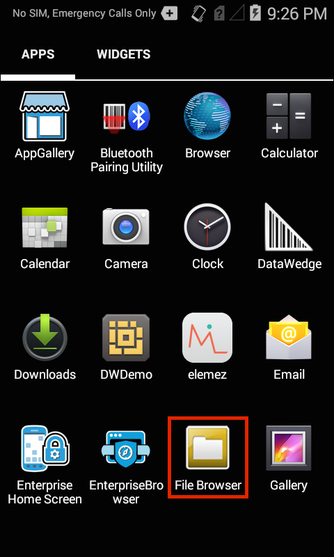
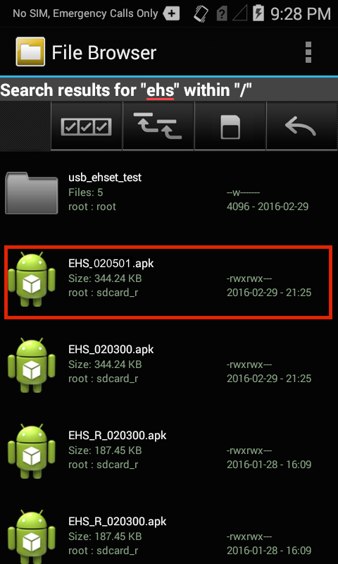
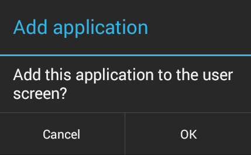
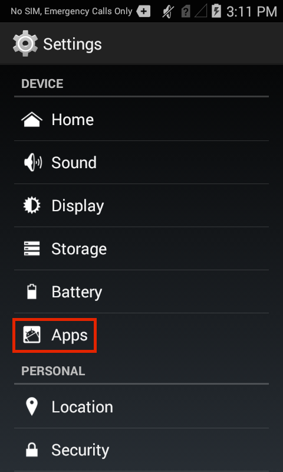

## Overview

These instructions provide a basic understanding of the installation, configuration, usage and essential workings of Enterprise Home Screen, and are recommended for anyone unfamiliar with first-time EHS setup. Please note that everything detailed here also can be automated through a Enterprise Mobile Management (EMM) system and with direct manipulation of the EHS config file, which is documented in the [Advanced Settings](../settings) section. 

Many of the capabilities of EHS can be accomplished manually on the device, programmatically through [EMDK](../../../../emdk-for-android) or remotely using [StageNow](../../../../stagenow) or a third-party EMM system (if supported by that EMM system). EHS simply puts these capabilities into a single, convenient tool.

> <b>Note</b>: Installation and setup requires that the EHS .apk file be present on a PC or Mac that can communicate with the target device and write to all storage areas. If necessary, please [download EHS](../../download) and establish connectivity between the computer and device. Then resume from here. 
>**<u>The SD card slot is disabled</u> when a device is in Multi-user Mode**. See [Special Features section](../features) for more information. 

-----

## Manual Installation
These instructions apply to direct installation (from a computer to a single device) using the EHS 3.x installer (.apk) file. 

### EHS 3.2 Compatibility Notes

* **Supports Oreo and Pie on [supported devices](../about/#supporteddevices) only**. 
* **No longer supports devices running Android 7.x Nougat**. 
* Download package includes a single .apk file: 
 * `EHS_xxxxxx.apk` - for all devices running Oreo and Pie **_including_ TC20/TC25**

> **ABOUT OREO UPGRADES**: If the operating system on a device (except TC20/TC25) is being upgraded to Android 8.1 Oreo from Marshmallow or Nougat, **<u>the previous EHS installation must be removed before the new version of EHS is installed</u>**. Follow instructions to [uninstall EHS](../setup/#uninstallation) before installing EHS on an Oreo device.   **Note**: Prior configuration settings, if any, are re-applied automatically.

> **EHS 3.2 DOES NOT support Android 7.x Nougat**. 

-----

**To install EHS manually**: 

**IMPORTANT:  On Oreo devices, Primary user must be active on device when EHS is installed and first launched**. 

&#49;. <b>Connect the device</b> via USB to a PC or Mac.

&#50;. <b>Copy the .apk file</b> from the PC to any writable device folder.

&#51;. On the device, <b>launch "File Browser" or "Files" app</b> (Oreo) from the App Drawer:

 

&#52;. <b>Locate and launch the .apk file</b>:

_File name of the .apk will match that of the version number being installed_. 
 

&#53;. <b>Tap Install</b>:

 

&#54;. After installation, <b>tap Open</b>:

_If "Done" was accidentally selected instead of "Open," launch "Enterprise Home Screen" from the App Drawer to proceed_.

&#55;. <b>Tap or press the HOME key. A screen like the image below will appear: </b> 

 

&#56;. <b>Select Enterprise Home Screen</b> and <b>tap "Just once"</b> for now. This will allow easy switching between EHS and the Android launcher during setup. This choice will be presented every time the HOME key is tapped until selecting "Always" makes the selection permanent. 

&#57;. <b>A restart is required</b> to complete the installation (for first-time EHS installations). Again, a screen like the one above will appear. <b>Select Enterprise Home Screen</b> and <b>tap "Just once"</b> to continue or select "Always" to make the selection permanent. To undo this choice, see [Change the Default Launcher](#changethedefaultlauncher) section below. 

> **Note: After selecting "Always," wait 10 seconds before restarting to ensure the change remains persistent.**. 

### Select Apps for User Mode 
EHS is now ready to use. The next steps are for selecting which apps to display (and which to hide) while in User Mode, and for configuring the level of user access to device settings. When first run, EHS always defaults to User Mode, and will display a screen similar to the image below: 

<b>EHS User Mode</b>

> <b>Note</b>: EHS selects apps for display in User Mode from apps installed on the device. <b>All apps intended for use must be installed on the device before proceeding</b>.

Enter Admin Mode and select which apps will be displayed to users:   

&#49;&#48;. <b>Tap the menu icon</b> and <b>open the Tools menu</b>:

 

&#49;&#49;. <b>Select Admin Login</b> and tap OK (the default password is blank):

 

After hitting OK, the admin version of the Tools menu will be displayed. 

&#49;&#50;. <b>Tap the BACK button</b> to dismiss the Tools menu. The Admin Mode screen similar to the image below will show all apps installed on the device.  

 

> <b>Note</b>: If an app intended for use is not displayed, it must be installed before proceeding. 

&#49;&#51;. <b>Long-press an app icon</b> to alternatively display or hide it from the User Mode screen. Depending on the app's status when long-pressed, one of the following messages will appear: 

 

Repeat this step until desired apps are selected for display. To confirm selections, switch between Admin and User Modes by logging in and out of Admin Mode from the Tools menu. 

### User Access to Settings
EHS provides extensive control over which device settings (such as networking) and resources (such as cameras and the file system) will be available to users when the device is in User Mode. Administrators can allow complete control of all device settings, limit access to just a few settings, or hide device settings completely. 

In User Mode, the following features are disabled by default:

* USB debugging
* Access to the file system
* Access to the Search app
* Keyguard-screen camera and search functions
* Full access to the System Settings panel
* Recent apps button

**To select which settings will be available while the device is in User Mode and/or to modify other User Mode preferences**:

&#49;&#52;. While in Admin Mode, <b>Select Preferences</b> from the menu:  

 

&#49;&#53;. Scroll the Preferences panel and <b>select the desired settings</b>: 

For scenarios that require even more security, EHS offers Kiosk mode, which is documented in the [Special Features](../features/#kioskmode) section. For a complete usage reference for the `enterprisehomescreen.xml` configuration file, please see the [Advanced Settings](../settings) section. 

-----

## Automated Installation
These instructions apply to remote installation of EHS, an `enterprisehomescreen.xml` config file, or both, from an organization's own EMM server to multiple managed devices. Alternatively, remote deployment and management can be accomplished through Zebra's [EMDK](../../../../emdk-for-android) or [StageNow](../../../../stagenow) tools using its App Manager Setting Type service. 

> **Important**: To execute EHS in a device in which a managed profile is enabled, EHS must be installed <u>before</u> configuring the managed profile in the device.

> **ABOUT OREO UPGRADES**: If the operating system on a device (except TC20/TC25) is being upgraded to Android 8.1 Oreo from Marshmallow or Nougat, **<u>the previous EHS installation must be removed before EHS 3.x is installed</u>**. Follow instructions to [uninstall EHS](../guide/setup#uninstallation) before installing EHS on an Oreo device. **Prior configuration settings, if any, are re-applied automatically**.

-----

**To install EHS using an EMM, instruct the EMM to do the following, in this order**:

**IMPORTANT:  On Oreo devices, Primary user must be active on device when EHS is installed and first launched**. 

&#49;. If desired, <b>create an</b> `enterprisehomescreen.xml`<b> file</b> containing the desired user apps and settings. Otherwise, EHS will be installed with its default settings and apps. See the [Advanced Settings](../settings) section for detailed instructions on the creation and editing of config files. 

&#50;. <b>Deploy EHS and the config file</b> (if any) to the device(s). This includes the .apk file and the XML file (if any) created in the previous step.

&#51;. <b>Launch the app</b> using the following package and activity commands: 

<table class="MsoNormalTable" style="" id="table2" border="1" cellpadding="3" cellspacing="0">
<tbody>
<tr>
<td style="width: 300.35pt;" width="250">

Deployed file

</td>
<td style="width: 300px;">

    Package name

</td>
<td style="width: 300px;">

    Main activity/class name

</td>

<tr bgcolor="#ccffcc" >
<td style="width: 118.35pt;" width="158">

EHS_xxxxxx.apk

</td>
<td style="width: 96px;">

com.symbol.enterprisehomescreen

</td>
<td style="width: 96px;">

com.symbol.enterprisehomescreen.HomeScreenActivity

</td>
</tr>
</tbody>
</table>
 

&#52;. <b>Set Enterprise Home Screen as the default</b> home application on the device.  

&#53;. Set a delay of 10 seconds before rebooting device to ensure the change remains persistent.

&#54;. <b>Reboot the device</b> to complete the installation. This is a <b>required step</b>. 

> **Note: After selecting "Always," wait 10 seconds before restarting to ensure the change remains persistent.**. 

The capabilities of EMM systems vary. Please refer to the EMM documentation for specific information about how to configure these commands. 

**Note: App installation, uninstallation, setting the default launcher and other operations are possible using the [App Manager](/mx/#app-manager) through Zebra's [EMDK](/emdk-for-android/latest/guide/about) or [StageNow](/stagenow/latest/about/) tools**. 

-----

## Uninstallation

<!-- 10/16/18- Lollipop not supported in EHS 3.0+.  
#### Important
**On ET50/ET55 devices running Android 5.x Lollipop with GMS**, <u>a permanent system UI crash could occur</u> if EHS is uninstalled while in User Mode. Before uninstalling EHS, Zebra recommends pushing to the device an EHS configuration file (`enterprisehomescreen.xml`) with the Search app enabled. See the [Advanced Settings](../settings) section for configuration file usage. 
 -->
### Manual Uninstallation
>**Important**: Device settings configured by EHS such as USB debugging, [System Settings Restricted](../settings#systemsettingsrestricted) (restricting user access to Display and Sound settings, and the "About phone" panel only), disabling apps and recent apps button and so on, DO NOT revert to their state prior to EHS installation and configuration. <u>**All such settings MUST BE REVERSED** prior to the removal of EHS</u>. This can be done prior to uninstalling EHS by pushing to the device an `enterprisehomescreen.xml` file properly configured to unrestrict the settings.

To remove EHS, simply use the Android App Manager to <b>uninstall the EHS app</b>.  

&#49;. From the Admin Mode screen, <b>Select Settings</b>:  

 

&#50;. <b>Tap Apps</b> to bring up the Android App Manager: 

 

&#51;. Locate and <b>Tap Enterprise Home Screen</b>:

 

&#52;. <b>Tap the Uninstall button</b>:

**`NOTE:`**: If the Uninstall button is grey, first [remove EHS as the default launcher](#changethedefaultlauncher). 
 

&#53;. <b>Click OK</b> to confirm:

 

#### Remove Config File (optional)
The steps above do not remove the `enterprisehomescreen.xml` configuration file from the `/enterprise/usr` folder, which could effect the behavior of EHS versions installed later.  

**To remove an old version of the `enterprisehomescreen.xml` file**:

&#54;. Connect the device to a computer with Android Debug Bridge (ADB) installed.

&#55;. At a command prompt, execute the following command:
    
    :::term
    adb shell rm /enterprise/usr/enterprisehomescreen.xml

##### Manual uninstallation of EHS is now complete. 

-----

### Automated Uninstallation
These instructions apply to remote uninstallation using an organization's own EMM server to remove EHS from multiple managed devices. This task also can be accomplished through Zebra's [EMDK](/emdk-for-android/latest/guide/about) or [StageNow](/stagenow/latest/about/) tools using the [App Manager](/mx/#app-manager) service. 

>**`IMPORTANT`**: Device settings configured by EHS such as USB debugging, [System Settings Restricted](../settings#systemsettingsrestricted) (restricting user access to Display and Sound settings, and the "About phone" panel only), disabling apps and recent apps button and so on, DO NOT revert to their former state when EHS is uninstalled. <u>To restore a device to its former state, **all such settings MUST BE REVERSED** prior to the removal of EHS</u>. This can be done prior to uninstalling EHS by pushing to the device an `enterprisehomescreen.xml` file properly configured to unrestrict the settings.

<!-- 7/30/19- also removed (though not per eng) b/c of ET50/55 support drop
> **`CRASH WARNING`**: <u>On ET50 and ET55 devices with GMS, a permanent system UI crash could occur</u> if EHS is uninstalled remotely (i.e. via EMM) while in User Mode. Before uninstalling EHS, Zebra recommends pushing to the device an EHS configuration file (`enterprisehomescreen.xml`) with the Search app enabled. See the [Advanced Settings](../settings) section for configuration file usage. 
 -->
**To uninstall EHS using an EMM, instruct the EMM to do the following**:

&#49;. <b> Uninstall (remove) the EHS app</b>, referencing the package and activity names as indicated in the table below. 

<table class="MsoNormalTable" style="" id="table2" border="1" cellpadding="3" cellspacing="0">
<tbody>
<tr>
<td style="width: 300.35pt;" width="250">

Deployed file

</td>
<td style="width: 300px;">

    Package name

</td>
<td style="width: 300px;">

    Main activity/class name

</td>

<tr bgcolor="#ccffcc" >
<td style="width: 118.35pt;" width="158">

EHS_xxxxxx.apk

</td>
<td style="width: 96px;">

com.symbol.enterprisehomescreen

</td>
<td style="width: 96px;">

com.symbol.enterprisehomescreen.HomeScreenActivity

</td>
</tr>
</tbody>
</table>
 

&#50;. <b>OPTIONAL</b>: If a new `enterprisehomescreen.xml` configuration file will be deployed with the new version of EHS, **skip to Step 3**. Otherwise, instruct the EMM to remove the file `/enterprise/usr/enterprisehomescreen.xml` from the device. This will clear configuration settings from the previously installed EHS app. 

>**Warning**: Do not remove the `/enterprise/usr` folder; it could effect the behavior of other apps. 

&#51;. It is sometimes necessary to <b>reboot the device</b> to complete the uninstallation. 

##### Remote uninstallation of EHS is now complete. 

**Note: Capabilities of EMM systems vary. Please refer to the EMM documentation for specific information about command usage**. 

-----

## Change the Default Launcher
Removing EHS as the default launcher on a device can be done with a simple change in the Settings panel or by uninstalling EHS. Either of these scenarios can be accomplished manually on the device, programmatically through EMDK or remotely using StageNow or an EMM (if supported). 

If EHS is removed from the device and the Android Launcher is the only remaining launcher on the device, it will become the default launcher. **If more than one launcher will remain on the device after EHS is removed, a new default launcher should be selected to ensure desired operation**.  

**To manually change the default launcher on a device without removing EHS**:

&#49;. In Admin Mode <b>open the Settings panel and tap Home</b>: 

 

&#50;. <b>Tap on the Android Launcher</b> to select it as the default launcher and Home screen.  

<b>Note</b>: The trash can icon seen here offers an alternative means of uninstalling EHS and restoring the Android Launcher. 

-----

## Battery and Wi-Fi Quick View
In addition to the separate panels for viewing Battery and Wi-Fi status provided in the menus of Admin- and User-Mode Launcher screens, EHS provides Quick View, an alternate way of accessing real-time status of these critical devices from a single screen.

> **NOTE**: EHS 4.0 and later allows adminisrators to [control Wi-Fi information display](../settings/#wirelessinformation). 

<!-- 6/28/20- removed from EHS 4.0 since it applies to Android 10 and later. 
**Note: SSID and BSSID information do not appear in the "Wireless Info" or "Battery and Wi-Fi Quick View" screens** on devices running Oreo if Location services (Settings -> Security & Location -> Location) are turned off. 
-->

**To view Battery and Wi-Fi status**: 

From Admin or User Mode, **tap the "i" icon** as indicated below:

The Battery/Wi-Fi Quick View panels appears, displaying real-time status of both devices:

 

