## Overview 
Installing Enterprise Browser on a desktop or laptop system provides all the software necessary to start making Enterprise Browser apps. All that's needed in addition to the software is a connection via Android Debug Bridge (ADB) or Microsoft Mobile Device Center (or ActiveSync on WinXP) to one or more [supported Zebra devices](../about/#mobile) running Android or Windows Mobile/CE. See the Prerequisites section for connection details. 

#### Platform Support
**Windows is required for full Enterprise Browser development**. For Mac OS X users, Enterprise Browser 1.3 and higher can be downloaded as a disk image (.dmg), allowing a subset of administrative functions listed below. 

**Mac OS X Functionality**: 

* Copy EnterpriseBrowser `.apk` files to Android devices
* Copy EnterpriseBrowser `.cab` files to [Stage Now](/stagenow/2-3/gettingstarted/) or a mobile device management (MDM) system for mass deployment
* Create shortcuts to Android apps using the EB native widget (pushed to the device as part of EB installation)
* Access the Enterprise Browser [Feature Demo](../featuredemo/) app
* Easily link to EB online help

<!-- * Copy EnterpriseBrowser .cab files to Windows Mobile/CE devices -->

#### Prerequisites
Installing Enterprise Browser and building EB apps requires the following: 

* A computer running Windows
* One or more [supported Zebra devices](../about/#mobile) connected to the computer (as below) 
* USB driver for targeting Zebra devices installed
* Android Debug Bridge (if targeting Android devices)
* Microsoft Mobile Device Center (if targeting Windows Mobile/CE devices)

_**Note: Microsoft Mobile Device Center** replaced ActiveSync starting with Windows Vista. It is usually included with the operating system, but sometimes must be downloaded separately. Installation of Enterprise Browser from Windows XP systems requires ActiveSync_.

#### Removal From Devices
When Enterprise Browser is uninstalled from an Android device using the Android Application Manager, EB and its related components will under most circumstances be removed properly. Known exceptions are listed below. 

**Incomplete removal scenarios**:

* **TC55 Jelly Bean -** If Enterprise Browser is installed onto the device's internal memory, files will not be removed by the Uninstall function of App Manager. Installation onto an external SD Card works normally. 
* **MC32 Jelly Bean -** If Enterprise Browser is installed onto the device's internal memory, files will not be removed by the Uninstall function of App Manager. Installation onto an external SD Card works normally. 

> **Zebra recommends that uninstallation be verified for each device scenario** before any process is automated using [Stage Now](/stagenow/2-3/gettingstarted/) or an MDM system. 

### Windows Installation
If upgrading from a prior version of Enterprise Browser, the older version must be manually uninstalled before installing the new one (see image, below). 

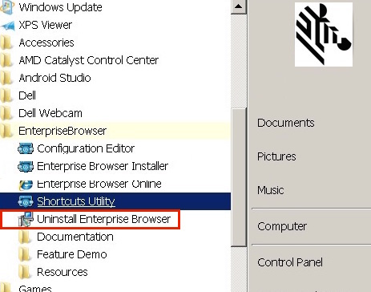

**To remove and install Enterprise Browser*:

If not upgrading, skip to step 3. 

1. **Backup any data stored in the `C:\EnterpriseBrowser` directory of the host PC**; step 2 will cause it to be lost. 
2. To uninstall EB, select **Start Menu -> Enterprise Browser -> Uninstall Enterprise Browser** and follow the prompts. 
3. Visit the [Enterprise Browser download page](https://portal.motorolasolutions.com/Support/US-EN/Search?searchType=simple&searchTerm=enterprise%20browser) and click on the desired EB version. The corresponding installation packages for Windows and Mac OS X appear. 
	a. Click on the Windows ".msi" package. 
	b. Accept the end-user license agreement to begin the download.
4. When the download completes, launch the installer and follow the prompts. After installation, a screen similar to the image below appears. 
5. Confirm that the "Launch" box is checked and **click "Close" to quit the installer** and launch Enterprise Browser. 

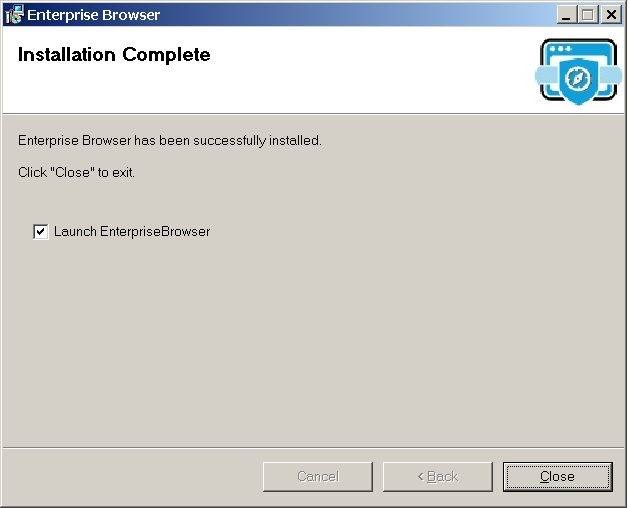

After closing the screen above, an Enterprise Browser "Installer" screen similar to the image below appears. Supported platforms are listed on the left and a description appears at right when a platform is selected. 

To bring up this screen at a later time, select **Start Menu -> Enterprise Browser -> Enterprise Browser Installer**. 

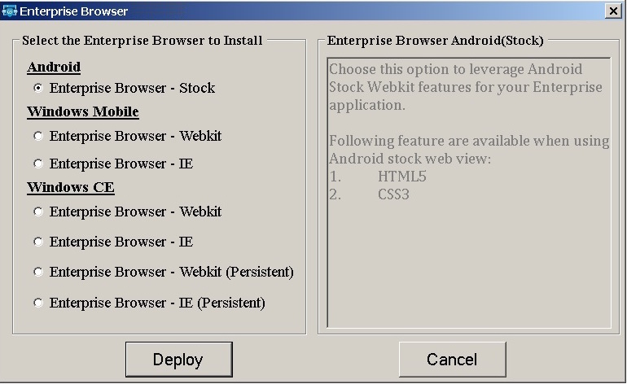

Windows instructions continue in the "Deployment to Device(s)" section, below. 

### Mac OS X Installation
1. Visit the [Enterprise Browser download page](https://portal.motorolasolutions.com/Support/US-EN/Search?searchType=simple&searchTerm=enterprise%20browser) and click on the desired EB version. The corresponding installation packages for Windows and Mac OS X appear.

 	a. Click on the Mac OS X ".dmg" package. 
	b. Accept the end-user license agreement to begin the download.

2. When the download completes, double-click the .dmg file to open it. A window similar to the image below appears. 
3. Drag and drop the Enterprise Browser icon onto the Applications folder (in the direction of the arrow). 

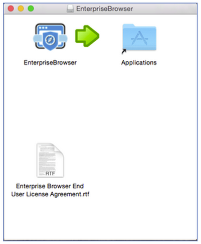

The Enterprise Browser files and folders will be copied into the Application folder on the host Mac, creating a directory structure similar to the one shown in the image below. 

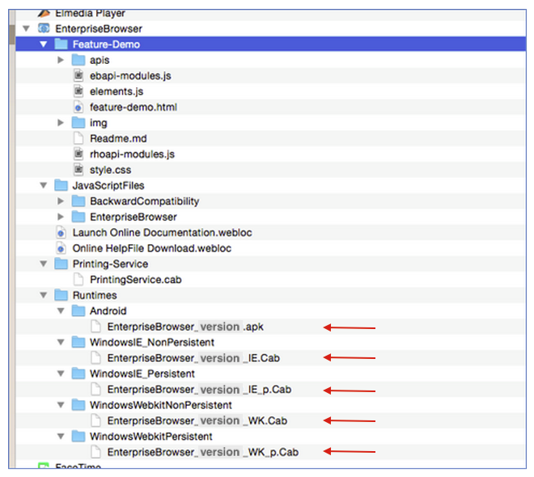

**Files in the "Runtimes" folder (red arrows) correspond with those deployed by the Windows version**. These are the same runtimes listed on the left side of the [Windows "Installer" screen](../../images/getting-started/setup/ebsetup_02.jpg), above. 

## Deployment to Device(s)
###From a Windows host
On Windows host systems, communication from the host to target device(s) is handled by the [Android Debug Bridge](http://developer.android.com/tools/help/adb.html) (ADB) for Android devices and by Mobile Device Center (or ActiveSync on WinXP) for Windows Mobile/CE. It also might be necessary to **install an OEM USB driver to make a USB-attached Android device visible to Windows**. If the device isn't visible to Windows, refer to the [Connections section](../setup#connections), below. 

* ADB supports USB connections only
* Mobile Device Center supports USB and Bluetooth connections 

Once a connection has been established, install the Enterprise Browser runtime onto a device:

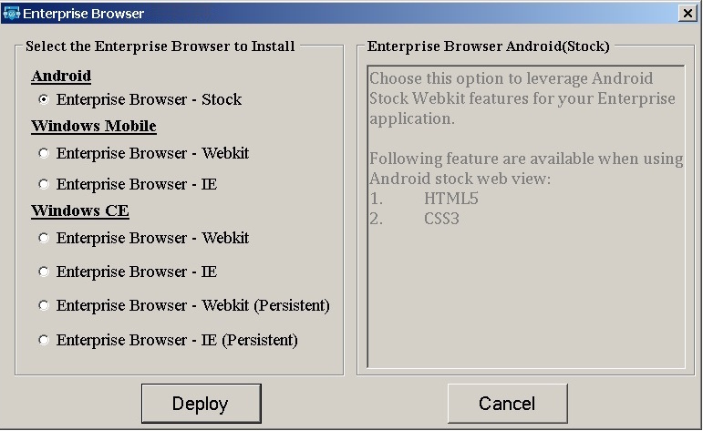

1. Select **Start -> Enterprise Browser -> Enterprise Browser Installer** to bring up the EB Installer. A window will appear similar to the image above.  
2. **Select the platform that matches the device, OS and webview being targeted**. Information in the right-hand pane will vary according to the selection.
3. **Click "Deploy" and follow prompts**. A window will appear similar to the image below. 
4. **Restart the device to complete the installation**.

> **Note: For persistent installations on Windows CE (the lowermost two options on the "Installer" screen above), a cold boot/cleanPS (clean persistent storage) is required to complete the installation**.

> **Note**: Prior to installation, some Windows devices might prompt for the installation location on the device. **Enterprise Browser overrides any selection made here; it will always be installed in `\Program Files\EnterpriseBrowser\`**.

###From a Mac to Android
The preferred deployment method of Enterprise Browser runtimes from a Mac OS host system to Android target devices is with the Android File Transfer utility. **If Android File Transfer is already installed, skip to step 5**.  

&#49;. Visit the [Android File Transfer page](https://www.android.com/filetransfer/).

&#50;. Download and open the Android File Transfer .dmg file. 

&#51;. Drag the Android File Transfer app into the Applications folder on the host Mac.

&#52;. Plug in the Android target device and unlock the screen. The device file system should automatically appear on the Mac in a window similar to the image below (It's sometimes necessary to launch the app manually.). 

&#53;. Copy the Enterprise Browser runtime for Android to internal storage, which is opened by default. Storage buttons (red arrow) will be shown only if an additional storage card is present in the device.

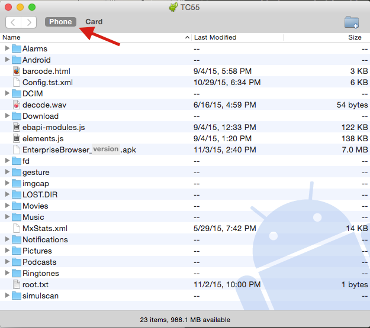

**Note: All connected devices must be unlocked before any file transfers can be performed**. 

&#54;. Using the File Browser app on the device, navigate to and execute the runtime to unpackage its files and directories. 

&#55;.  Restart the device to complete the installation. 

Refer to the [On-device Configuration guide](../OndeviceConfig) for help configuring Enterprise Browser following installation.  

###From a Mac to Windows Mobile/CE
The preferred deployment method of Enterprise Browser runtimes from a Mac OS host system to Windows Mobile/CE devices is using Bluetooth. 

&#49;. Set the Windows Mobile/CE device as discoverable in the MotoBTUI app. 

&#50;. Pair the device with the Mac using the Mac's Bluetooth Preferences panel. Enter pairing code and follow additional prompts as necessary. 

&#51;. Right-click the newly paired device and select "Send File to Device..." (as below). 

&#52;. A file dialog will apppear. Navigate to and select the Enterprise Browser runtime to be deployed to the WM/CE device and click Send.   

While the file is in transit, a dialog will appear on the Mac similar to the image below: 

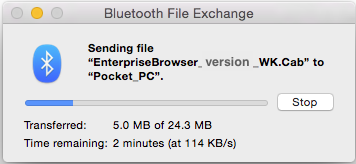

&#53;. When the transfer is complete, tap "Yes" on the device to save the file.

&#54;. Using the File Explorer app, navigate to and execute the runtime to unpackage its files and directories. 

&#55;. Restart the device to complete the installation. 

**Note: Copy Enterprise Runtimes to internal storage only**.

Refer to the [On-device Configuration guide](../OndeviceConfig) for help configuring Enterprise Browser following installation.  

## Connections
### Android devices

Requirements for using the Enterprise Browser Installer on a Windows system to target an Android device:

* USB drivers for the specific hardware device being targeted
* The Android ADT bundle to make devices visible and to push files 
* A path to `adb.exe` in the host system's environment variable

####STEP 1: Get USB drivers
Visit the [Zebra Support Portal](https://portal.motorolasolutions.com/Support/US-EN/Search?searchType=simple&searchTerm=android%20usb%20drivers), download and install the latest driver from the list. 

For non-Zebra hardware, visit [Google’s OEM USB Driver page](http://developer.android.com/tools/extras/oem-usb.html) for instructions and links to OEM drivers for the brand of device.

#### STEP 2: Get Android ADT 
Visit the [Android Developer Tools page](http://developer.android.com/sdk/index.html), download and install the Android SDK to match the system (Mac OS X, Linux or Windows 32/64). 

#### STEP 3: Update system path
Add the full path to `adb.exe` to the system path. The EB installer and its utilities use adb to push files to Android devices. Since its location could vary with any given system, the path to adb.exe **must** be available system-wide so that EB can simply execute "abd.exe" rather than repeating the explicit path with every push function. 

To add the platform-tools path to the system's environment variable: 

* Right-click "Computer" and **select -> Properties**
* Select "Advanced System Settings" in the System Properties window
* In the "Advanced" tab, Click the "Environment Variables" button to bring up a window similar to the one below:

* In the <u>LOWER</u> window, scroll down to "Path"
* Select Path and click "Edit..." to bring up the path for editing
* Add a semicolon (;) to the end of the line followed by the path to "abd.exe"
* If unsure of the path, the following DOS command will reveal it: 

		:::term
		c:\> dir /s adb.exe 

This command should result in something like this: 

* If there's more than one path to adb.exe, enter the one that ends with `\platform-tools`
* The correct string for this example would be `;C:\Users\AppData\Local\Android\sdk\platform-tools` (notice the semicolon separator at the beginning of the line)
* Close the dialog and restart the system 

* To confirm that the path is correct, connect the device and run the following command:  

		:::term
		$ adb devices

If everything is setup correctly, a display like the following will be seen:

The system is now ready to deploy Enterprise Browser apps and shortcuts to an Android device.

### Windows Mobile/CE devices
Upon connecting a Windows Mobile/CE device to a Windows 7 (or higher) PC, the Mobile Device Center application and all necessary drivers are supposed to install automatically and recognize the device. If that doesn't happen immediately, try one or more of the following:   

* Be sure the device is plugged into a _USB 2.0_ port (not USB 3.0)
* Allow Windows to search for updates if prompted after plugging in the device
* If no such prompt appears, go to Device Manager and select Action -> "Scan for hardware changes" When USB drivers are installed correctly, a box like the image below will appear.  
* Restart Windows after any software or driver is installed or updated 

> **Note: If Windows doesn't recognize a devices connected to a USB 3.0 port, try connecting it to a USB 2.0 port**.

When a device is properly connected and recognized, the Mobile Device Center application should appear something like this:

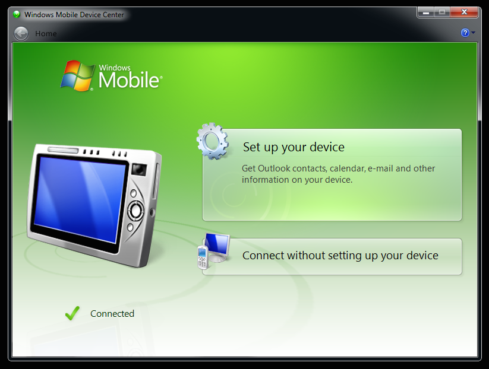

The system is now ready to deploy Enterprise Browser using the Enterprise Browser installer. 

## Manual Deployment
Enterprise Browser runtimes can be individually pushed to devices from Windows or Mac OS machines and unpackaged by hand on the device. 

After installing the Enterprise Browser (.msi or .dmg) as above: 

&#49;. On Windows, go to **Start Menu -> Enterprise Browser -> Resources ->Enterprise Browser Runtimes**. On Mac, open the **Applications -> Enterprise Browser -> Runtimes** folder. 

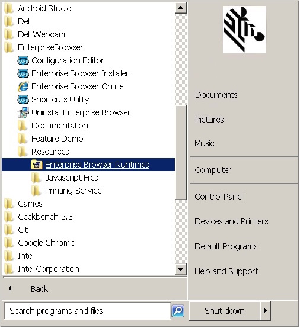

On Windows, this will bring up a window that looks similar to the image below: 

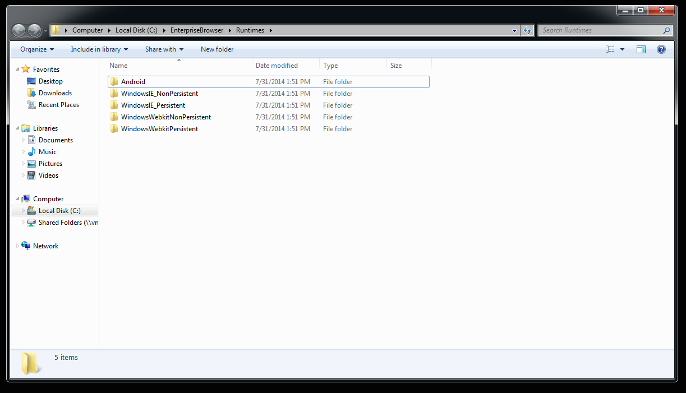

&#50;. Copy the desired runtime to the root directory of the device. 

&#51;. From the device, use a file explorer to locate and execute the runtime. 

&#52;. Reboot the device to complete the installation. 

&#53;. If a persistent runtime was installed, perform a cold boot/cleanPS on the device to activate the runtime.

## Launching the EB App 
After installation, an Enterprise Browser app icon will appear **in the all-apps section of Android devices** and **in the Main app menu of Windows Mobile/CE**. The first time an Enterprise Browser app is launched, it starts with default runtime settings as defined in the Config.xml file on the device. Refer to the [Config.xml Reference guide](../configreference) for complete details.  

By default, a screen like the one below will appear: 

Pressing the "Return to OS" button will skip settings configuration and bring up the operating system. To display the Settings button again, simply relaunch the Enterprise Browser app. 

**Press the "Settings" button to edit the on-device config.xml file**. A screen like the image below will appear:

###Activating the start page
**To activate an EB app's start page, enter the URL in the Value field of the StartPage parameter**, as highlighted above, but **do not apply the changes yet**. Applying changes immediately will cause the new start page to be displayed next time EB is launched and will remove access to the Settings panel. 

**WARNING: Free-form text fields such as "username" and "password" can accept alpha-numeric characters only. Entering non-text characters (< > \ / " ') in these fields (except in a URL field) will corrupt the Config.xml file**. 

If on-device access to runtime settings is desired after setting up the start page (for example, to experiment with various settings before deployment), set the SettingsButtonEnabled parameter to "Enable" (as below). This will cause a Settings button to appear in the UI at all times. Passwords also can be set here, if desired. 

Press "Apply" to update the Config.xml file with the new settings. A screen like the one below will be displayed. Restart the app to activate the changes. 

The Settings button, if enabled, appears in the UI like the one in the red box below.

**Note: When the IE engine is used on a Windows CE device**, displaying the Settings button in this way might cause screen distortion when scrolling.

**WARNING: Free-form text fields such as "username" and "password" can accept alpha-numeric characters only. Entering non-text characters (< > \ / " ') in these fields (except in a URL field) will corrupt the Config.xml file**. 

The on-device settings panel provides access to just a small subset of Enterprise Browser runtime settings. For access to all settings, please refer to the [On-device Configuration guide](../OndeviceConfig).

<!--## Removing Enterprise Browser

### Windows Mobile
Remove Enterprise Browser by removing the application.

### Windows CE
If you installed the persistent version of Enterprise Browser, it will not be removed after a cold boot. To remove it, you will need to manually remove the folder and copy files that are found in the non-volatile area of memory.

### Android
Use Android Settings applet to remove the Enterprise Browser from the device.-->

<!-- To install the drivers for that device. Usually this is done by simply plugging the device into the machine. Most of the time, the device driver will install automatically and you'll be good to go. If not, you'll need to download the drivers for that device. To get the drivers for your device, you'll need to find the device page on [motorolasolutions.com](http://www.motorolasolutions.com/). The best way to do this is enter your device's model number into the search bar at the top of the landing page. Once you have found your device, you should see a tab to download software. For instance, the drivers for the TC55 are [here](http://goo.gl/mjrqMM).

The page you want should look something like this:

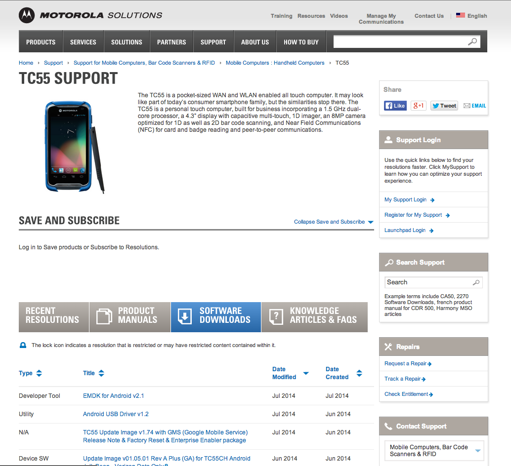 

1. The ActiveSync installer will deploy the selected Enterprise Browser runtime files to the device. 
2. If installing one of the the persistent runtimes for Windows CE, a cold boot/clean PS will be required after installation.

> **Note**: Prior to installation, some Windows devices might prompt for the installation location on the device. **Enterprise Browser overrides any selection made here; it will always be installed in `\Program Files\EnterpriseBrowser\`**.

<!-- -->

