## Overview
Enterprise Browser is a powerful, industrial browser that enables developers to build feature-rich web applications that integrate seamlessly with the capabilities offered by Zebra mobile computers and peripherals. At its core, Enterprise Browser is a runtime environment inside which a company's HTML and JavaScript application logic can be executed and controlled, and can interface with a device's hardware (i.e. scanners, card readers, etc.) through EB APIs.

The base [EB installation](../setup) includes everything needed to quickly build device apps for **barcode scanning, signature capture, payment processing, printing** and most other enterprise applications. Enterprise Browser applications are built with standard web technologies such as **HTML5, CSS3 and JavaScript**, and run and integrate with a long list of [supported Zebra devices](../about#mobile) running Android and Microsoft Windows Mobile/CE. All runtime settings and parameters are controlled though a single, human-readable file, the `Config.xml`, which can be mass-deployed using [Zebra StageNow](/stagenow/2-4/gettingstarted/) or a mobile device management (MDM) system.   

Enterprise Browser also can run apps built for PocketBrowser, RhoElements and the RhoMobile Shared Runtime, making it an ideal migration path for developers looking to move legacy applications to newer devices or to update their apps with a modern UI. Enterprise Browser can help companies reduce development time and cost, making the transition to next-generation devices and operating systems fast, easy and affordable--particularly for high-volume mobile environments.

## New in v1.5

Enterprise Browser 1.5 comes with a new look and feel, including new logos and splash screens. On the inside, EB 1.5 offers support for Android 5.0 Lollipop on new and existing Zebra devices, function-key mapping for Psion devices and a range of additional new features for Android and Windows Mobile/CE devices.  

####Zebra Device Support
  * TC70 and TC75 with Android Lollipop
  * WT6000 with Android Lollipop
  * MC40 with Android Lollipop
  * MC67 with Android KitKat
  * WorkAbout Pro 4 with Windows Embedded Handheld 6.5
  * Omnii XT15 with Windows CE 6.0 and Embedded Handheld 6.5
  * RS6000, RS4000 and RS507 ring scanners for use with WT6000
  * Psion XT15, VH10 and WAP

[See all supported devices](../about#mobile)

####New or Updated APIs (released with EB 1.5)

* **New [RemoteNotification API](../../api/remotenotification) -** works with RS-series ring scanners to activate multi-color LEDs, beeper and vibrator device signals (**Android only**). 

* **Updated [Barcode API](../../api/barcode) -** supports **addConnectionListener** and **removeConnectionListener** for pluggable scanners and fixes sound decoding issues that were present on some devices. 

* **Updated [Device API](../../api/device) -** allows JavaScript to access **acquirePartialWakeLock** and **releasePartialWakeLock** functions programmatically. 

#### New Features

* **[Simplified mass deployment](../keycapture)** of Enterprise Browser runtime and keymapping config files to devices, with or without the EB app itself (**Android only**). 

* **Customizable [&lt;UserAgent&gt; settings for Android](../configreference/#useragent)** permits a greater control over values extracted from Android devices for configuring the Android UserAgent string. 

#### New Tags for Android

* **[&lt;DebugModeEnable&gt;](../configreference#debugmodeenable) -** enables debugging of Enterprise Browser apps using **Chrome Inspector**.

* **[&lt;WakeLock&gt;](../configreference#wakelock) -** allows the CPU to remain active after the screen and keyboard backlight are turned off.

* **[&lt;AutoPlayMediaElements&gt;](../configreference#autoplaymediaelements) -** allows automatic media playback to be disabled by default.

#### New Tags for Windows Mobile/CE

* **[&lt;DiskCache&gt;](../configreference#diskcache) -** puts a user-defined cap on device storage used by the web-page cache.

* **[&lt;DiskCacheExpTimeFactor&gt;](../configreference#diskcacheexptimefactor) -** allows an administrator to control cached pages will be refreshed.

* **[&lt;ClientCertPath&gt;](../configreference#clientcertpath) -** allows changes to the default location of client authentication certificates on the device.

#### New Guides

* **[Keycode Mapping Guide](../keycapture)** updated in EB 1.5 to include **function key mapping for Psion devices** running Windows Mobile. Also details Android key remapping to ensure that keycode values are delivered to apps as expected. 

* **[DataWedge Usage Guide](../datawedge)** (released with EB 1.4)details the steps required to use DataWedge for barcode scanning in place of the Enterprise Browser APIs, and how to switch between the two. 

### Key Enterprise Browser Features

####A development toolkit for mobile cross-platform enterprise apps
* Supports all enterprise devices: mobile computers, tablets, kiosks, wearables and vehicle-mounted devices
* Supports multiple operating systems: Android, Windows Embedded Handheld and Windows Mobile/CE

####Build apps using HTML5, CSS and JavaScript
* Use web skills to create great-looking applications
* Based on open source and standard technologies, not proprietary toolkits
* Access to the world's largest developer community

####Common APIs across all enterprise devices
* Single code base; does not require different APIs for different OSes to create a true write-once, run-anywhere apps with a consistent UI
* Easily access native device hardware with JavaScript APIs

####Backward-compatible with PocketBrowser and RhoElements
* Compatible with legacy PocketBrowser APIs, enabling a clear path forward for legacy apps
* EMML (Meta Tag) support extended to Android
* Compatible with legacy RhoElements JavaScript APIs, enabling a clear path forward for "RhoElements Shared Runtime" users

####Unparalleled access to device capabilities
* Access all device features, including bar code scanning, signature capture, printing, RFID and more

####Thin client architecture
* Simplifies device deployment and management by enabling instant application updates on devices; ensures version consistency

####Offers operating system "lock out"
* Hides access to distractions, such as web-browsing and games; simplifies user interface and eliminates risk of unauthorized changes to device settings
* Password-protect settings screen and prevent any app from exiting

####Full-screen display
* Maximizes available display space for a richer, more effective user interface; hides command bar and Start menu

####Extensive logging capability
* Flexibility to easily capture logging information, reducing management and support effort

###Key Benefits

* **Reduces application and development costs** and eliminates the need to develop, manage and maintain multiple versions of an application to support different types of devices and operating systems; provides highly cost effective support for a mixed-OS environment.
* **Protects the business from OS market uncertainty**. Devices and platforms can continue to churn without impacting the business. These OS-agnostic applications work on Symbol, Motorola and Zebra Technologies platforms of yesterday (MPA2), today and tomorrow.
* **Reduces end-user training costs**. Enterprise Browser app development is incredibly intuitive for developers skilled in HTML5, CSS and JavaScript.
* **Leverage every feature on every device and attached peripheral**. Easily design rich applications that take advantage of all the available features on a device and its attached peripherals, including barcode scanners, RFID tag readers and payment processing devices.
* **Create consumer-style apps for business** Without OS constraints to impact app design, a graphical user interface can be created that is every bit as engaging, intuitive and interactive as today's consumer applications. Provides complete control of application behavior on different devices. With automatic screen resizing, apps can look, feel and behave identically on all devices, or display new features or expand the presentation of existing features to take advantage of larger screens.
* **Faster time to market**. A simplified application development approach allows for shorter time to market than ever before.

## Supported Devices

###Mobile
<table cellspacing="0" cellpadding="0" class="table table-striped">
 <tbody><tr>
  <th class="clsSyntaxHeadings"></th>
  <th class="clsSyntaxHeadings"><nobr>Device family</nobr></th>
  <th class="clsSyntaxHeadings">Device</th>
  <th class="clsSyntaxHeadings">Operating System(s)</th>
  <th class="clsSyntaxHeadings">Supported WebView(s)</th>
 </tr>
 <tr>
  <td class="clsSyntaxCells clsOddRow"></td>
  <td class="clsSyntaxCells clsOddRow"><b>ES400</b></td>
  <td class="clsSyntaxCells clsOddRow">ES400</td>
  <td class="clsSyntaxCells clsOddRow">Windows Embedded Handheld 6.5</td>
  <td class="clsSyntaxCells clsOddRow">Internet Explorer, Webkit</td>
 </tr>
 <tr>
  <td class="clsSyntaxCells clsOddRow"></td>
  <td class="clsSyntaxCells clsOddRow"><b>ET1</b></td>
  <td class="clsSyntaxCells clsOddRow">ET1 (Enterprise Tablet), ET1 WAN</td>
  <td class="clsSyntaxCells clsOddRow">Android 4.1 (Jelly Bean)</td>
  <td class="clsSyntaxCells clsOddRow">Android Stock Webkit</td>
 </tr>
 <tr>
  <td class="clsSyntaxCells clsOddRow">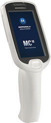</td>
  <td class="clsSyntaxCells clsOddRow"><b>MC18</b></td>
  <td class="clsSyntaxCells clsOddRow">MC18</td>
  <td class="clsSyntaxCells clsOddRow">Windows CE 7.0, Android 4.4 (KitKat), 5.0 (Lollipop)</td>
  <td class="clsSyntaxCells clsOddRow">Internet Explorer, Webkit</td>
 </tr>
 <tr>
  <td class="clsSyntaxCells clsOddRow"></td>
  <td class="clsSyntaxCells clsOddRow"><b>MC3090</b></td>
  <td class="clsSyntaxCells clsOddRow">MC3000, MC3090</td>
  <td class="clsSyntaxCells clsOddRow">Windows CE 5.0 Windows Mobile 6.1</td>
  <td class="clsSyntaxCells clsOddRow">Internet Explorer</td>
 </tr>
 <tr>
  <td class="clsSyntaxCells clsOddRow"></td>
  <td class="clsSyntaxCells clsOddRow"><b>MC3100</b></td>
  <td class="clsSyntaxCells clsOddRow"><nobr>MC3100R, MC3100S, MC3190G, </nobr>MC3190R, MC3190S, MC3190Z</td>
  <td class="clsSyntaxCells clsOddRow">Windows CE 6.0 Professional Windows Embedded Handheld 6.5</td>
  <td class="clsSyntaxCells clsOddRow">Internet Explorer, Webkit</td>
 </tr>
 <tr>
  <td class="clsSyntaxCells clsOddRow"></td>
  <td class="clsSyntaxCells clsOddRow"><b>MC32N0</b></td>
  <td class="clsSyntaxCells clsOddRow">MC32N0</td>
  <td class="clsSyntaxCells clsOddRow">Android 4.1 (Jelly Bean) Windows CE 7.0</td>
  <td class="clsSyntaxCells clsOddRow">Android Stock Webkit,  Internet Explorer, Webkit</td>
 </tr>
 <tr>
  <td class="clsSyntaxCells clsOddRow"></td>
  <td class="clsSyntaxCells clsOddRow"><b>MC40</b></td>
  <td class="clsSyntaxCells clsOddRow"><nobr>MC40</nobr></td>
  <td class="clsSyntaxCells clsOddRow">Android 4.4 (KitKat), 5.0 (Lollipop)</td>
  <td class="clsSyntaxCells clsOddRow">Android Stock Webkit</td>
 
 </tr><tr>
  <td class="clsSyntaxCells clsOddRow"></td>
  <td class="clsSyntaxCells clsOddRow"><b>MC45</b></td>
  <td class="clsSyntaxCells clsOddRow">MC45</td>
  <td class="clsSyntaxCells clsOddRow">Windows Embedded Handheld 6.5</td>
  <td class="clsSyntaxCells clsOddRow">Internet Explorer, Webkit</td>
 </tr>
 <tr>
  <td class="clsSyntaxCells clsOddRow"></td>
  <td class="clsSyntaxCells clsOddRow"><b>MC55</b></td>
  <td class="clsSyntaxCells clsOddRow">MC5574, MC5590</td>
  <td class="clsSyntaxCells clsOddRow">Windows Embedded Handheld 6.5</td>
  <td class="clsSyntaxCells clsOddRow">Internet Explorer, Webkit</td>
 </tr>
 <tr>
  <td class="clsSyntaxCells clsOddRow"></td>
  <td class="clsSyntaxCells clsOddRow"><b>MC55A0</b></td>
  <td class="clsSyntaxCells clsOddRow">MC55A0</td>
  <td class="clsSyntaxCells clsOddRow">Windows Embedded Handheld 6.5</td>
  <td class="clsSyntaxCells clsOddRow">Internet Explorer, Webkit</td>
 </tr>
 <tr>
  <td class="clsSyntaxCells clsOddRow"></td>
  <td class="clsSyntaxCells clsOddRow"><b>MC55N0</b></td>
  <td class="clsSyntaxCells clsOddRow">MC55N0</td>
  <td class="clsSyntaxCells clsOddRow">Windows Embedded Handheld 6.5</td>
  <td class="clsSyntaxCells clsOddRow">Internet Explorer, Webkit</td>
 </tr>
 <tr>
  <td class="clsSyntaxCells clsOddRow"></td>
  <td class="clsSyntaxCells clsOddRow"><b>MC65</b></td>
  <td class="clsSyntaxCells clsOddRow">MC659B</td>
  <td class="clsSyntaxCells clsOddRow">Windows Embedded Handheld 6.5</td>
  <td class="clsSyntaxCells clsOddRow">Internet Explorer, Webkit</td>
 </tr>
 <tr>
  <td class="clsSyntaxCells clsOddRow"></td>
  <td class="clsSyntaxCells clsOddRow"><b>MC67</b></td>
  <td class="clsSyntaxCells clsOddRow">MC67</td>
  <td class="clsSyntaxCells clsOddRow">Android 4.1 (Jelly Bean), 4.4 (KitKat) Windows Embedded Handheld 6.5</td>
  <td class="clsSyntaxCells clsOddRow">Android Stock Webkit, Internet Explorer, Webkit</td>
 </tr>
 <tr>
  <td class="clsSyntaxCells clsOddRow"></td>
  <td class="clsSyntaxCells clsOddRow"><b>MC70</b></td>
  <td class="clsSyntaxCells clsOddRow">MC7004, MC7090, MC7094, MC7095</td>
  <td class="clsSyntaxCells clsOddRow">Windows Mobile 6.1</td>
  <td class="clsSyntaxCells clsOddRow">Internet Explorer</td>
 </tr>
 <tr>
  <td class="clsSyntaxCells clsOddRow"></td>
  <td class="clsSyntaxCells clsOddRow"><b>MC75</b></td>
  <td class="clsSyntaxCells clsOddRow">MC7506, MC7508, MC7596, MC7598</td>
  <td class="clsSyntaxCells clsOddRow">Windows Embedded Handheld 6.5</td>
  <td class="clsSyntaxCells clsOddRow">Internet Explorer</td>
 </tr>
 <tr>
  <td class="clsSyntaxCells clsOddRow"></td>
  <td class="clsSyntaxCells clsOddRow"><b>MC75a</b></td>
  <td class="clsSyntaxCells clsOddRow">MC75A0, MC75A6, MC75A8</td>
  <td class="clsSyntaxCells clsOddRow">Windows Embedded Handheld 6.5</td>
  <td class="clsSyntaxCells clsOddRow">Internet Explorer, Webkit</td>
 </tr>
 <tr>
  <td class="clsSyntaxCells clsOddRow"></td>
  <td class="clsSyntaxCells clsOddRow"><b>MC9000</b></td>
  <td class="clsSyntaxCells clsOddRow"><nobr>MC9090, MC9097, MC9094</nobr></td>
  <td class="clsSyntaxCells clsOddRow">Windows CE 5.0 Windows Mobile 6.1</td>
  <td class="clsSyntaxCells clsOddRow">Internet Explorer</td>
 </tr>
 <tr>
  <td class="clsSyntaxCells clsOddRow"></td>
  <td class="clsSyntaxCells clsOddRow"><b>MC9100</b></td>
  <td class="clsSyntaxCells clsOddRow">MC9190-G, MC9190Z</td>
  <td class="clsSyntaxCells clsOddRow">Windows CE 6.0 Professional Windows Embedded Handheld 6.5</td>
  <td class="clsSyntaxCells clsOddRow">Internet Explorer, Webkit</td>
 </tr>
 <tr>
  <td class="clsSyntaxCells clsOddRow"></td>
  <td class="clsSyntaxCells clsOddRow"><b>MC9200</b></td>
  <td class="clsSyntaxCells clsOddRow">MC92N0</td>
  <td class="clsSyntaxCells clsOddRow">Android 4.4 KitKat,  Windows CE 7.0,  Windows Embedded Handheld 6.5</td>
  <td class="clsSyntaxCells clsOddRow">Android Stock Webkit,  Internet Explorer, Webkit</td>
 </tr>
 <tr>
  <td class="clsSyntaxCells clsOddRow"></td>
  <td class="clsSyntaxCells clsOddRow"><b>MC9500</b></td>
  <td class="clsSyntaxCells clsOddRow"><nobr>MC9590, MC9596, MC9598, MC959B (WM6.1)</nobr></td>
  <td class="clsSyntaxCells clsOddRow">Windows Mobile 6.1, Windows Embedded Handheld 6.5</td>
  <td class="clsSyntaxCells clsOddRow">Internet Explorer, Webkit</td>
 </tr>
 <tr>
  <td class="clsSyntaxCells clsOddRow">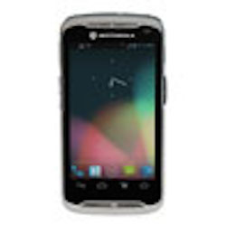</td>
  <td class="clsSyntaxCells clsOddRow"><b>TC55</b></td>
  <td class="clsSyntaxCells clsOddRow"><nobr>TC55</nobr></td>
  <td class="clsSyntaxCells clsOddRow">Android 4.4 (KitKat)</td>
  <td class="clsSyntaxCells clsOddRow">Android Stock Webkit</td>
 </tr>
 <tr>
  <td class="clsSyntaxCells clsOddRow">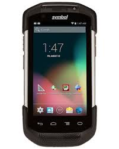</td>
  <td class="clsSyntaxCells clsOddRow"><b>TC70</b></td>
  <td class="clsSyntaxCells clsOddRow"><nobr>TC70 (GA1, GA2)</nobr></td>
  <td class="clsSyntaxCells clsOddRow">Android 4.4 (KitKat), 5.0 (Lollipop)</td>
  <td class="clsSyntaxCells clsOddRow">Android Stock Webkit</td>
 </tr>
 <tr>
  <td class="clsSyntaxCells clsOddRow">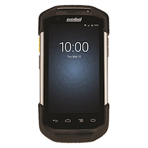</td>
  <td class="clsSyntaxCells clsOddRow"><b>TC75</b></td>
  <td class="clsSyntaxCells clsOddRow"><nobr>TC75</nobr></td>
  <td class="clsSyntaxCells clsOddRow">Android 4.4 (KitKat), 5.0 (Lollipop)</td>
  <td class="clsSyntaxCells clsOddRow">Android Stock Webkit</td>
 </tr>
 <tr>
  <td class="clsSyntaxCells clsOddRow">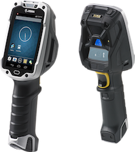</td>
  <td class="clsSyntaxCells clsOddRow"><b>TC8000</b></td>
  <td class="clsSyntaxCells clsOddRow"><nobr>TC8000</nobr></td>
  <td class="clsSyntaxCells clsOddRow">Android 4.4 (KitKat), 5.0 (Lollipop)</td>
  <td class="clsSyntaxCells clsOddRow">Android Stock Webkit</td>
 </tr>
 <tr>
  <td class="clsSyntaxCells clsOddRow">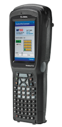</td>
  <td class="clsSyntaxCells clsOddRow"><b>Workabout</b></td>
  <td class="clsSyntaxCells clsOddRow"><nobr>Workabout Pro 4</nobr></td>
  <td class="clsSyntaxCells clsOddRow">CE 6.0, Windows Embedded Handheld 6.5</td>
  <td class="clsSyntaxCells clsOddRow">Internet Explorer, Webkit</td>
 </tr>
 <tr>
  <td class="clsSyntaxCells clsOddRow"></td>
  <td class="clsSyntaxCells clsOddRow"><b>XT15</b></td>
  <td class="clsSyntaxCells clsOddRow">OMNII XT15 Mobile Computer Series</td>
  <td class="clsSyntaxCells clsOddRow">Windows CE 6.0, Windows Embedded Handheld 6.5</td>
  <td class="clsSyntaxCells clsOddRow">Internet Explorer, Webkit</td>
 </tr>
</tbody></table>

###Vehicle
<table cellspacing="0" cellpadding="0" class="table table-striped">
 <tbody><tr>
  <th class="clsSyntaxHeadings"></th>
  <th class="clsSyntaxHeadings"><nobr>Device family</nobr></th>
  <th class="clsSyntaxHeadings">Device</th>
  <th class="clsSyntaxHeadings">Operating System(s)</th>
  <th class="clsSyntaxHeadings">Supported WebView(s)</th>
 </tr>
 <tr>
  <td class="clsSyntaxCells clsOddRow">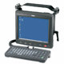</td>
  <td class="clsSyntaxCells clsOddRow"><b>VC5090</b></td>
  <td class="clsSyntaxCells clsOddRow">VC5090</td>
  <td class="clsSyntaxCells clsOddRow">Windows CE 5.0</td>
  <td class="clsSyntaxCells clsOddRow">Internet Explorer</td>
 </tr>
 <tr>
  <td class="clsSyntaxCells clsOddRow"></td>
  <td class="clsSyntaxCells clsOddRow"><b>VC6000</b></td>
  <td class="clsSyntaxCells clsOddRow">VC6000, VC6096</td>
  <td class="clsSyntaxCells clsOddRow">Windows Embedded Handheld 6.5</td>
  <td class="clsSyntaxCells clsOddRow">Internet Explorer</td>
 </tr>
 <tr>
  <td class="clsSyntaxCells clsOddRow">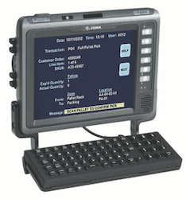</td>
  <td class="clsSyntaxCells clsOddRow"><b>VC70</b></td>
  <td class="clsSyntaxCells clsOddRow">VC70</td>
  <td class="clsSyntaxCells clsOddRow">Windows CE 7.0</td>
  <td class="clsSyntaxCells clsOddRow">Internet Explorer, Webkit</td>
 </tr>
 <tr>
  <td class="clsSyntaxCells clsOddRow">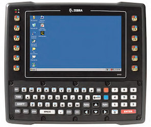</td>
  <td class="clsSyntaxCells clsOddRow"><b>VH10</b></td>
  <td class="clsSyntaxCells clsOddRow">Vehicle-Mounted Computer</td>
  <td class="clsSyntaxCells clsOddRow">Windows CE 6.0</td>
  <td class="clsSyntaxCells clsOddRow">Internet Explorer, Webkit</td>
 </tr>
</tbody></table>

###Micro-Kiosk
<table cellspacing="0" cellpadding="0" class="table table-striped">
 <tbody><tr>
  <th class="clsSyntaxHeadings"></th>
  <th class="clsSyntaxHeadings"><nobr>Device family</nobr></th>
  <th class="clsSyntaxHeadings">Device</th>
  <th class="clsSyntaxHeadings">Operating System(s)</th>
  <th class="clsSyntaxHeadings">Supported WebView(s)</th>
 </tr>
 <tr>
  <td class="clsSyntaxCells clsOddRow"></td>
  <td class="clsSyntaxCells clsOddRow"><b>MK3000</b></td>
  <td class="clsSyntaxCells clsOddRow">MK3000, MK3090</td>
  <td class="clsSyntaxCells clsOddRow">Windows CE 5.0</td>
  <td class="clsSyntaxCells clsOddRow">Internet Explorer</td>
 </tr>
 <tr>
  <td class="clsSyntaxCells clsOddRow">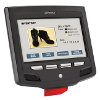</td>
  <td class="clsSyntaxCells clsOddRow"><b>MK3100</b></td>
  <td class="clsSyntaxCells clsOddRow">MK3100, MK3190</td>
  <td class="clsSyntaxCells clsOddRow">Windows CE 7.0</td>
  <td class="clsSyntaxCells clsOddRow">Internet Explorer, Webkit</td>
 </tr>
 <tr>
  <td class="clsSyntaxCells clsOddRow">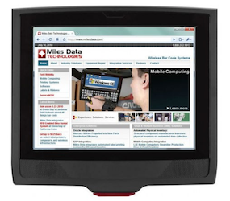</td>
  <td class="clsSyntaxCells clsOddRow"><b>MK4000</b></td>
  <td class="clsSyntaxCells clsOddRow">MK4000, MK4090</td>
  <td class="clsSyntaxCells clsOddRow">Windows CE 5.0</td>
  <td class="clsSyntaxCells clsOddRow">Internet Explorer</td>
 </tr>
</tbody></table>

###Wearable
<table cellspacing="0" cellpadding="0" class="table table-striped">
 <tbody><tr>
  <th class="clsSyntaxHeadings"></th>
  <th class="clsSyntaxHeadings"><nobr>Device family</nobr></th>
  <th class="clsSyntaxHeadings">Device</th>
  <th class="clsSyntaxHeadings">Operating System(s)</th>
  <th class="clsSyntaxHeadings">Supported WebView(s)</th>
 </tr>
 <tr>
  <td class="clsSyntaxCells clsOddRow">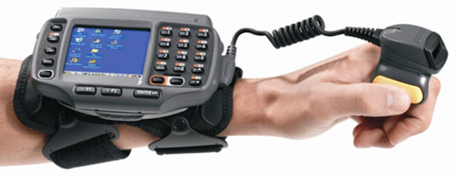</td>
  <td class="clsSyntaxCells clsOddRow"><b>WT4090</b></td>
  <td class="clsSyntaxCells clsOddRow">WT4070, WT4090</td>
  <td class="clsSyntaxCells clsOddRow">Windows CE 5.0</td>
  <td class="clsSyntaxCells clsOddRow">Internet Explorer</td>
 </tr>
 <tr>
  <td class="clsSyntaxCells clsOddRow">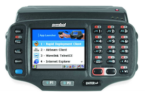</td>
  <td class="clsSyntaxCells clsOddRow"><b>WT41N0</b></td>
  <td class="clsSyntaxCells clsOddRow">WT41N0</td>
  <td class="clsSyntaxCells clsOddRow">Windows CE 7.0</td>
  <td class="clsSyntaxCells clsOddRow">Internet Explorer, Webkit</td>
 </tr>
  <tr>
  <td class="clsSyntaxCells clsOddRow">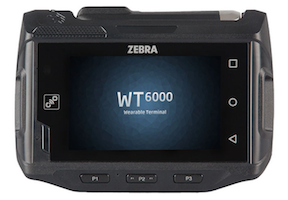</td>
  <td class="clsSyntaxCells clsOddRow"><b>WT6000</b></td>
  <td class="clsSyntaxCells clsOddRow"><nobr>Wearable Computer</nobr></td>
  <td class="clsSyntaxCells clsOddRow">Android 5.0 (Lollipop)</td>
  <td class="clsSyntaxCells clsOddRow">Android Stock Webkit</td>
 </tr>
 <tr>
 <tr>
  <td class="clsSyntaxCells clsOddRow"></td>
  <td class="clsSyntaxCells clsOddRow"><b>RS6000</b></td>
  <td class="clsSyntaxCells clsOddRow"><nobr>Bluetooth Ring Scanner</nobr></td>
  <td class="clsSyntaxCells clsOddRow">Accessory</td>
  <td class="clsSyntaxCells clsOddRow">For WT6000 only</td>
 </tr>
 <tr>
 <tr>
  <td class="clsSyntaxCells clsOddRow">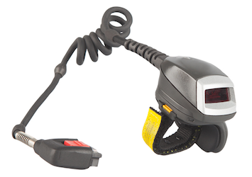</td>
  <td class="clsSyntaxCells clsOddRow"><b>RS4000</b></td>
  <td class="clsSyntaxCells clsOddRow"><nobr>1D Corded Ring Scanner</nobr></td>
  <td class="clsSyntaxCells clsOddRow">Accessory</td>
  <td class="clsSyntaxCells clsOddRow">For WT6000 only</td>
 </tr>
 <tr>
<tr>
  <td class="clsSyntaxCells clsOddRow">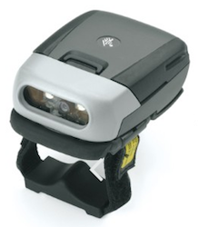</td>
  <td class="clsSyntaxCells clsOddRow"><b>RS507</b></td>
  <td class="clsSyntaxCells clsOddRow"><nobr>Cordless Ring Imager</nobr></td>
  <td class="clsSyntaxCells clsOddRow">Accessory</td>
  <td class="clsSyntaxCells clsOddRow">For devices with KitKat and higher. See support notes (below).</td>
 </tr>
 <tr>
</tbody></table>

**RS507 Support Notes**: 
* Works with the Enterprise Browser Barcode API on all supported devices running KitKat or higher (relies on the EMDK service, which is standard on those devices; optional on some Jelly Bean devices).
* Works with RhoElements 2.x and PocketBrowser 2.x/3.x APIs on all supported devices running KitKat or higher **except the TC70-GA1**. 

###Printers
<table cellspacing="0" cellpadding="0" class="table table-striped">
 <tbody><tr>
  <th class="clsSyntaxHeadings">These printers have been tested for USB printing compatibility. Zebra supports wireless printing on many other models.</th>
  <th class="clsSyntaxHeadings"><nobr>Device family</nobr></th>
  <th class="clsSyntaxHeadings">Device models</th>
  <th class="clsSyntaxHeadings">Operating System(s)</th>
  <th class="text-centered">Interface(s)</th>
 </tr>
<tr>
<td class="clsSyntaxCells clsOddRow"></img></td>
<td class="clsSyntaxCells clsOddRow"><b>MZ</b></td>
<td class="clsSyntaxCells clsOddRow">MZ 220, MZ 320</td>
<td class="clsSyntaxCells clsOddRow">Android, Windows Mobile/CE</td>
<td class="clsSyntaxCells clsOddRow">Bluetooth, USB, Wi-Fi</td>
</tr>
<tr>
<td class="clsSyntaxCells clsOddRow">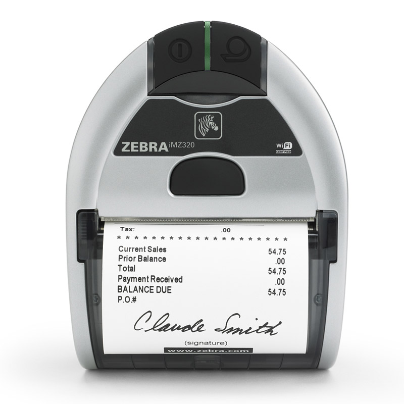</img></td>
<td class="clsSyntaxCells clsOddRow"><b>iMZ</b></td>
<td class="clsSyntaxCells clsOddRow">iMZ 220, iMZ 320</td>
<td class="clsSyntaxCells clsOddRow">Android, Windows Mobile/CE</td>
<td class="clsSyntaxCells clsOddRow">Bluetooth, USB, Wi-Fi</td>
</tr>
<tr>
<td class="clsSyntaxCells clsOddRow">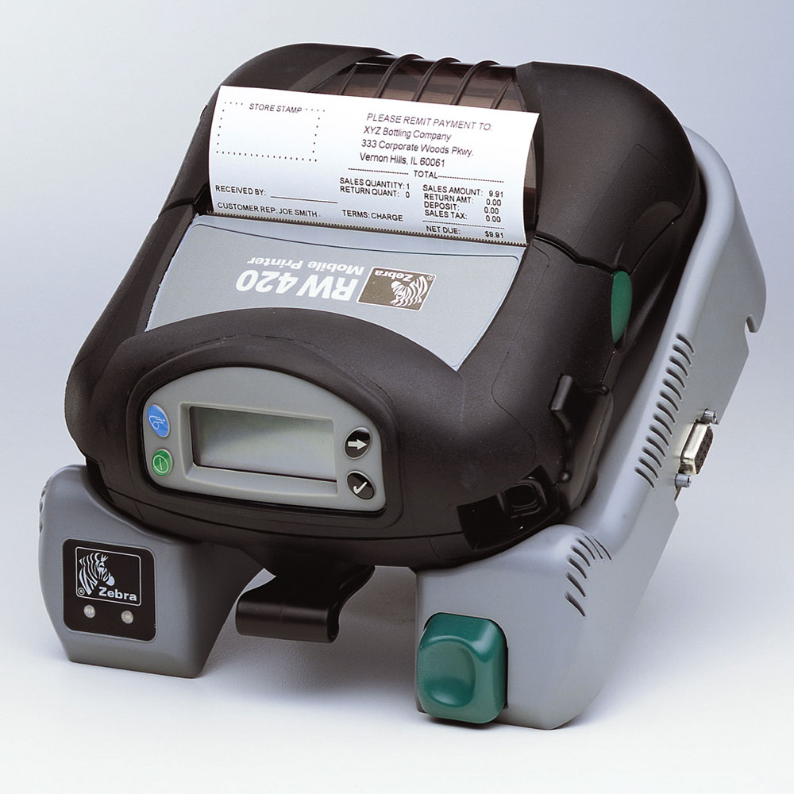</img></td>
<td class="clsSyntaxCells clsOddRow"><b>RW</b></td>
<td class="clsSyntaxCells clsOddRow">RW 220, RW 420, RW 420 Print Station</td>
<td class="clsSyntaxCells usb comp">Android, Windows Mobile/CE</td>
<td class="clsSyntaxCells clsOddRow">Bluetooth, USB, Wi-Fi</td>
</tr>
<tr>
<td class="clsSyntaxCells clsOddRow"></img></td>
<td class="clsSyntaxCells clsOddRow"><b>P4T</b></td>
<td class="clsSyntaxCells clsOddRow">P4T, RP4T Passive RFID Printer</td>
<td class="clsSyntaxCells clsOddRow">Android, Windows Mobile/CE</td>
<td class="clsSyntaxCells clsOddRow">Bluetooth, USB, Wi-Fi</td>
</tr>
<tr>
<td class="clsSyntaxCells clsOddRow"></img></td>
<td class="clsSyntaxCells clsOddRow"><b>ZD500R</b></td>
<td class="clsSyntaxCells clsOddRow">ZD500R RFID Printer</td>
<td class="clsSyntaxCells clsOddRow">Android, Windows Mobile/CE</td>
<td class="clsSyntaxCells clsOddRow">Bluetooth, USB, Wi-Fi</td>
</tr>
<td class="clsSyntaxCells clsOddRow"><b>NOTE</b>: Zebra's QL Plus and QLn series printers do not support USB printing.</td>
<td class="clsSyntaxCells clsOddRow"></td>
<td class="clsSyntaxCells clsOddRow"></td>
<td class="clsSyntaxCells clsOddRow"></td>
<td class="clsSyntaxCells clsOddRow"></td>
</tr>
</tbody>

