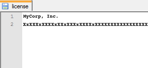

##Overview 
Enterprise Browser is free to download and use for evaluation purposes. Commercial deployment to devices requires an End-User License issued by Zebra Technologies for each device. Licenses are available for individual devices and for entire deployments of 50 devices or more. Both license types permit an unlimited number of Enterprise Browser applications to run on the device(s). This guide explains the process of obtaining an Enterprise Browser license for commercial use, and applying the license to individual devices and as part of a mass-deployment.

-----

###I. Contact a Reseller 
The first step in obtaining a license is to engage with Zebra directly or with a Zebra reseller. 

**&#49;. [Visit Zebra's Enterprise Browser Product Page](https://www.zebra.com/us/en/products/software/mobile-computers/mobile-app-utilities/enterprise-browser.html)** and select one of the methods for contacting Zebra directly or engaging with a reseller or partner. 

**&#50;. Alternatively, select one of the following Zebra resources**: 

* **[Find a Zebra Partner](https://www.zebra.com/us/en/partners/find-a-zebra-partner.html) -** form for submitting an inquiry via the web
* **[How to Select a Channel Partner](https://www.zebra.com/us/en/partners/find-a-zebra-partner/selecting-the-right-channel-partner.html) -** explains the types of partners that engage with Zebra and some of their technologies and specialties
* **[Partner Interaction Center](https://www.zebra.com/us/en/partners/partner-interaction-center.html) -** info for contacting Zebra's existing global partner network
* **[Zebra Corporate Numbers and Links](https://www.zebra.com/us/en/about-zebra/contact-zebra.html) -** broken down by global region
* **[Global Marketing Contact Center](https://www.zebra.com/us/en/about-zebra/contact-zebra/marketing-contact-center.html) -** broken down by global region and country

-----

###II. Access Licensing System
After a licensing agreement is purchased from Zebra or a Zebra reseller, an email will be sent to the licensing company's representative containing user credentials for accessing the [Zebra Enterprise Software Licensing system](https://softwarelicensing.motorolasolutions.com/documentation/index.html). 

* **Log into the [Zebra Licensing system](https://softwarelicensing.zebra.com/) to:** 
	* Place an order for licenses
	* See the status of existing orders
	* Assign licenses to devices or deployments
	* View current license inventory and assignments

-----

###III. Assign a License
Once a license is purchased, it must me assigned to one or more devices before those devices can be deployed and used. 

**To assign a purchased license**: 

**&#49;. In the [Zebra Licensing system](https://softwarelicensing.zebra.com/), click on the Licensing tab** and select the "Assign a License" section to see a list of products for which purchased licenses are available.

**&#50;. Select the correct version for the Enterprise Browser runtime** installed on the target devices and click on the "Assign License" link to the right.

**&#51;. Enter device details into the licensing form** that appears. This corresponds with the licensing wizard that appears whenever the Enterprise Browser runtime launches.

**&#52;. Complete the form and Tap Submit**. 

**&#53;. Scan the barcodes that appear**. These contain the new license(s). 

> **Note**: Some device scanners support only printed barcodes. 

-----

###IV. Apply the License
Whether the purchased license is for a specific device or an entire deployment, the Enterprise Browser license must be applied to one or more devices before those devices can be used commercially. Each license permits an unlimited number of Enterprise Browser applications to run on the device(s). 

**Each license contains**:
* The company name to which the license is issued
* A hexadecimal key

Once a device is licensed, a splash screen displays the licensing company's name each time Enterprise Browser is launched. 

**License types**:
* **Device-specific License -** assigned to a specific device. This License will fail if an attempt is made to apply it to a device other than the device to which it was originally assigned.

* **Deployment License -** works across an entire device deployment. This is useful for remote or mass-deployment scenarios or when licensing non-Zebra devices. **Available for deployments of 50 devices or more**.  

Both license types can be applied using either of the methods below.  

#### Apply License via Wizard
To simplify the device-licensing process, unlicensed Zebra devices present a licensing wizard when Enterprise Browser launches. The wizard includes a "Cancel" button, which skips the licensing process temporarily to allow Enterprise Browser software and apps to be evaluated and tested. Enterprise Browser functionality is not restricted during evaluation. 

**Wizard-based license application**: 
* **Internet Licensing -** allows the order number associated with an Enterprise Browser license order to be entered instead of the company name and key. **Requires an internet connection on the device** with direct (non-proxy) contact with the licensing server.

* **Manual Licensing -** requires manual entry of the company name and license number. **On Zebra devices, this information also can be scanned from barcodes printed or displayed on a screen**.

#### Apply License via File
After a license is applied, a file can be created for Android or downloaded for Windows Mobile/CE from the Zebra Licensing system and used to automate device licensing as part of a mass-deployment. A third option, to add license info to the `Config.xml` file, is consistent across all device platforms. 

**Option 1 (Android only)- Create a** `license` **file**:

1. Purchase a Deployment License.
2. Create a "license" text file. 
3. On the first line of the file, enter the licensing company's name.
4. On the second line, enter the hexadecimal license key (as below).

5. Place the `license` file on the device in: `/enterprise/device/enterprisebrowser`.
6. Launch Enterprise Browser on the device to confirm that the license has been applied (the name of the licensed company will appear on EB splash screen).
 

**Option 2 (Windows Mobile/CE only)- Download a** `.reg` **registry key file**:

1. Purchase a Deployment License.
2. Download the `.reg` registry key file from the licensing system .
3. Place the file on the device in: `/enterprise/device/enterprisebrowser`.
4. Launch Enterprise Browser on the device to confirm that the license has been applied (the name of the licensed company will appear on EB splash screen).
 

**Option 3 (for all device platforms)- Add license info to the** `Config.xml` **file**:

&#49;. Specify the licensing company's name and hexadecimal license key in the `Config.xml` file of an app, as below: 

	
		:::xml
		<Applications>
			<Application> 
			   <LicenseKeyCompany value="Deployment License Company name"/>
			   <LicenseKey value="hexadecimal license key"/>
			   ...
			</Application> 
		</Applications>
	
&#50;. Place the modified `Config.xml` file on the device in:
* **On Android devices**: `/sdcard/Android/data/com.symbol.enterprisebrowser/`
* **On Windows devices**: `\Program Files\EnterpriseBrowser\Config\`
* **On Windows CE devices with a persistent installation, place a SECOND COPY of the file in**: `\Application\EnterpriseBrowser\Config\`

&#51;. Launch Enterprise Browser and confirm that the license has been applied (the name of the licensed company will appear on EB splash screen).  
&#52;. Repeat Steps 1 and 2 for all [EB app shortcuts](../ShortcutCreator/) that will run on the device(s). 
 

**Deployment Option Notes**: 

* When using Option 3, all `Config.xml` files for all app shortcuts on a device must contain the licensing information. 
* A device becomes licensed only after Enterprise Browser is launched for the first time with a `Config.xml` file that contains valid licensing information. 
* License deployment options may be used in any combination across the devices of a deployment, but only one option should be used on any single device. 

-----

#### Mass-deploy a License File
Any of the Deployment License files described above can be mass-deployed using [Zebra StageNow](/stagenow/2-3/about/) or an MDM system with a few simple steps.

**To mass-deploy a Deployment License file**: 

1. **Create the Deployment License file** using one of the methods described above.
2. **Execute the following Android Debug Bridge (ADB) "push" command**: 
	
		:::term
		c:/ adb push /[path_to_license_file]/license /enterprise/device/enterprisebrowser

3. **Confirm push command and license application success by launching Enterprise Browser on the device** (the name of the licensed company will appear on EB splash screen).
4. **Integrate the successful push command** into the MDM's deployment logic.

-----

**Related Guides**:
* **[Enterprise Browser App Shortcuts](../ShortcutCreator/)-** The key to multi-app deployments 
* **[Enterprise Browser Setup Guide](../setup/) -** Help with initial setup, connecting to devices and pushing files
* **[Zebra licensing system documentation page](https://softwarelicensing.motorolasolutions.com/documentation/index.html) -** Additional licensing info and sample screens

