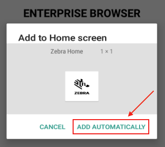

##Overview

Runtime configuration settings of Enterprise Browser apps are managed through the `Config.xml` file, a required file that must accompany every EB app. The `Config.xml` determines features and behavior of the EB runtime, including its start-up page, keys that can be intercepted by an app, and whether to pre-load modules on startup. A default configuration file is provided as part of the Enterprise Browser installation, and contains some (though not all) of the most common settings. 

The default `Config.xml` file for Android devices is displayed below, followed by explanations of all tags and parameter settings for Android and Windows Mobile/CE. The EB `Config.xml` can be edited with an ordinary text editor or with the [Config Editor utility](../ConfigEditor) included with the installation of Enterprise Browser 1.3 and higher. 

###`IMPORTANT:`
>Some device EB settings parameters are executed through the [MX Framework](https://techdocs.zebra.com/mx/overview/), Zebra's device management layer. If an EB app containing such parameters is executed immediately after a device is booted, some or all of the instructions could fail if the MX Framework isn't ready in time to receive them. To prevent such failures, **<u>Zebra recommends waiting 20 seconds after a device starts up before launching any EB app</u>** that contains one or more of the configuration parameters listed below. 

#### MX-based Config Parameters: 
* [HideSystemBar](#hidesystembar)
* [setHomeKeyDisable](#sethomekeydisable)
* [setStatusBarDisable](#setstatusbardisable)
* [setBackKeyDisable](#setbackkeydisable)
* [setRecentAppDisable](#setrecentappdisable)

-----

### Config.xml Location
The location of the configuration file on the device varies by target and platform:

* On the Enterprise Tablet, the `Config.xml` file is read from: 
`/Android/data/com.symbol.EnterpriseBrowser/`

* On all other devices, Enterprise Browser will attempt to read the `Config.xml` file from the `/Config` directory off the installation root, which varies by device platform: 

	* **Android**: `/Android/data/com.symbol.enterprisebrowser`
	* **Windows**: `\Program Files\EnterpriseBrowser\Config`

**Shortcuts are not supported on devices running Android 8.x Oreo or higher**.  

* If multiple `Config.xml` files are required for a single device, they can be configured and selected at runtime using the /C: configuration parameter or by using Shortcuts. See the [Shortcut Creator Guide](../ShortcutCreator) for details.

### Persistent Installations
If a `Config.xml` must be retained after a cold boot, a persistent installation can be selected (applies only to Windows devices). In such systems: 

* The `Config.xml` file is permanently stored in: `\Application\EnterpriseBrowser\Config\Config.xml` 
* On cold boot the `Config.xml` is copied to: `\Program Files\EnterpriseBrowser\Config\Config.xml` 
* This behavior can be modified by changing `\Application\EnterpriseBrowser.cpy` 

**Note: File and directory names of operating systems are case sensitive. Zebra therefore recommends that case values of files and directories entered in the `Config.xml` file are identical to the names of the files themselves**.

-----

### Substitution Variables
The following substitution variables are supported for use in the `Config.xml` file:

<table class="MsoNormalTable" style="" id="table2" border="1" cellpadding="3" cellspacing="0">

	<tr bgcolor="#e0e0eb" >
		<th>Variable</th>
		<th>Description</th>
	</tr>
  	<tr>
    	<td>%INSTALLDIR% (read-write)</td>
    	<td>
    	Installation directory of the Enterprise Browser app (i.e. <strong>/Android/Data/com.symbol.enterprisebrowser</strong>)
    	</td>
  	</tr>
  	<tr>
    	<td>%PRIMARYDIR% (read-write)</td>
    	<td>
	    The root directory of internal device storage (i.e. <strong>/storage/sdcard0</strong>)
    	</td>
  	</tr>
  	<tr>
    	<td>%SECONDARYDIR% (read-only)</td>
    	<td>
	    The root directory of external storage (i.e. <strong>/storage/sdcard1</strong>)
    	</td>
  	</tr>
  	<tr>
    	<td>%PERSISTCONFDIR% (read-write)</td>
    	<td>
    	A directory that persists after an Enterprise Reset of the device (<strong>i.e. /enterprise/device/enterprisebrowser</strong>)
    	</td>
  	</tr>
</table>

**Notes**:

* **Zebra recommends using the %PERSISTCONFDIR% variable only with MDM and/or EMM systems** or in mass deployment scenarios.

* **The %SECONDARYDIR% variable is read-only**; Enterprise Browser cannot write to an external SD Card.

-----

### Config.xml file format
The default `Config.xml` file for Android is shown below for reference. **Important differences exist between Android and Windows Mobile/CE settings in the Config.xml file**, mainly involving directory structure and file naming. Use care when setting these values. 

> **WARNING**: Free-form text fields (i.e. username and password) can accept alpha-numeric characters unless otherwise noted. Entering non-text characters (< > \ / " ') in these fields could cause the `Config.xml` file to become corrupt. 

-----

### EB_VERSION tag

In Enterprise Browser 1.8 and higher, the automatically generated [&lt;EB_VERSION&gt;](../configreference#eb_version) tag stores version information in the `Config.xml` file that is analyzed for logging and diagnostics. Each time an EB app launches, one of the following states will be reflected in the log:   

#### State 1

* **Condition**: The version of Enterprise Browser installed on the device matches the value stored in the &lt;EB_VERSION&gt; tag.
* **Log Entry**: "EB Config.xml (vX.y.m.n) is matching with the EB application (vX.y.m.n) running on the device."

#### State 2

* **Condition**: The version of Enterprise Browser installed on the device **does not match** the value stored in the &lt;EB_VERSION&gt; tag. 
* **Log Entry**: "EB Config.xml (vX.y.m.n) is not matching with the EB application (vA.b.c.d) running on the device. Please use the associated EB Config.xml which matches with the EB application version i.e. (vA.b.c.d)."

#### State 3

* **Condition**: The `Config.xml` file contains no &lt;EB_VERSION&gt; tag. 
* **Log Entry**: "EB Config.xml is not matching with the EB application (vX.y.m.n) running on the device. Probably you are using the older EB Config.xml. Please use the associated EB Config.xml which matches with the EB application version i.e. (vX.y.m.n)."

#### KEY
* **"X"** = Major version number of the Enterprise Browser release (i.e. v**_1_**.8.2.7)
* **"y"** = Minor version number of the release (i.e. v1.**_8_**.2.7) 
* **"m"** = Build number of the release (i.e. v1.8.**_2_**.7)
* **"n"** = Revision number of the release (i.e. v1.8.2.**_7_**)

-----

	:::xml
	// Enterprise Browser 2.5 configuration file for Android
	// IMPORTANT: File differs for Windows Mobile/CE
	// DO NOT REMOVE THE EB_VERSION TAG (below) or modify its contents. 
	// This auto-generated tag is for diagnostics and logging purposes.
	// See "EB_VERSION tag" section above for usage details.   

	<?xml version = "1.0"?>

	<Configuration>
	   <EB_VERSION value="EB_VERSION_INFO"/>
	   HIDE_SYSTEM_BAR

	  <DebugButtons>
	    <DebugButtonsEnabled value="0" />
	  </DebugButtons>
	  
	  <Diagnostic>
	    <WebPageCapture value="0"/>
	  </Diagnostic> 
	  
	  <WebFiltering>
		<WebFilteringEnabled value="0"/>
		<WhiteListingUrls value=""/>
		<BlackListingUrls value=""/>
	  </WebFiltering>
		
	  <DebugSetting>
	    <DebugModeEnable value="0"/>
	  </DebugSetting> 

	  <Shortcut>
	    <ShortcutCreationEnabled value="0"/>
	  </Shortcut>
	  
	  <CustomKioskMode>
		<setHomeKeyDisable value ="0"/>
		<setStatusBarDisable value ="0"/>
		<setBackKeyDisable value ="0"/> 
		<setVolumeButtonDisable value ="0"/>
		<setRecentAppDisable value ="0"/>
	  </CustomKioskMode>

	  <IME>
		<DisableAllIME value ="0"/>
	  </IME>

	  <ZoomKey>
	    <ZoomInKey value=""/> 
	    <ZoomOutKey value=""/> 
	  </ZoomKey>
	  
	  <Logger>
	    <LogProtocol   value="FILE"/>
	    <LogPort       value="80"/>
	    <LogURI        value="file://%INSTALLDIR%/Log.txt"/>
	    <LogError      value="1"/>
	    <LogWarning    value="1"/>
	    <LogInfo       value="1"/>
	    <LogTrace      value="0"/>
	    <LogUser       value="0"/>
	    <LogMemory     value="0"/>
	    <LogMemPeriod  value="5000"/>
	    <LogMaxSize    value="5000"/>
	  </Logger>
	    
	  <FileLocations>
	    <RegEXFile value="file://%INSTALLDIR%/RegEx.xml"/>
	  </FileLocations>
	      
	  <Screen>
	    <FullScreen value="1"/>
	    <PageZoom value="1.0" />
	    <EnableZoom value="1"/>
	    <DisplayZoomControls value="0"/>
	  </Screen>
	 
	  <TTS>
	    <TTSEnabled value="1"/>
	    <WelcomeText value="Enterprise Browser is now voice enabled"/>
	  </TTS>
	  
	  <InjectEBLibraries>
		<JSLibraries value="0"/>
	  </InjectEBLibraries>
	  
	  <SplashScreen>
		<SplashScreenPath value="file://%INSTALLDIR%/rho/apps/app/loading.png"/>
		<SplashScreenDuration value="0"/>
	  </SplashScreen>
	  
	  <WakeLock>
	    <WakeLockType value=""/>
	  </WakeLock>
	 	  
	  <DeviceKeys>
	  </DeviceKeys>
	  
	  <Navigation>
	    <NavTimeout value="45000"/>
	  </Navigation>	 
	 
	  <TabInstance>
	    <NewTabPhysicalMemLimit value="90"/>
	    <NewTabVirtualMemLimit value="80"/>
	  </TabInstance>

	  <Applications>
	    <Application>
	      
	      <HTTP_Proxy value=""/>
	      <HTTPS_Proxy value=""/>
	      <isWindowsKey value="0"/>
	      <usedwforscanning value="0"/>
	      <DisableHardwareAcceleration value="0"/>
		  
		  <BackgroundOnHomeKeyPressed>
			<ClearWebData value="0"/>
			<NavigateToHomePage value="0"/>	  
		  </BackgroundOnHomeKeyPressed>
		  
	      <IntentReceiver>
	        <EnableReceiver value="0"/>
	        <IntentAction value=""/>
	        <IntentCategory value=""/>
	      </IntentReceiver>
		  
	      <General>
	        <Name value="Menu"/>
	        <StartPage value="file://%INSTALLDIR%/ANDROID_DEVICE_START_PAGE" name="Menu"/>
	      </General>
	      
	      <Scanner>
	        <DisableScannerDuringNavigation value="1"/>
	      </Scanner>
		  
		  <ApplicationCache>
		    <ApplicationCacheEnabled value="1"/>
			<ClearApplicationCacheOnLaunch value="0"/>	
	        <ClearApplicationCacheOnExit value="0"/>		
	      </ApplicationCache>

	      <HTMLStyles>
	        <JavascriptEnabled value="1"/>
			<DatabaseEnabled value="1"/>
			<DomStorageEnabled value="1"/>
			<GeoLocationEnabled	value="0"/>
	        <FontFamily value="Droid Sans Fallback"/>
			<BackgroundColor value=""/>
	      </HTMLStyles>
	      
	      <SIP>
	        <ResizeOnSIP value="1"/>
	      </SIP>

	      <System>
	        <LowBatteryScan value="0"/>
	      </System>

	      <Sound>
	        <DecodeVolume           value=""/>
	        <DecodeFrequency        value=""/>
	        <InvalidDecodeFrequency value="0x9C4"/>
	        <DecodeDuration         value=""/>
	        <ScanDecodeWav          value=""/>
	        <ScanInvalidWav         value=""/>
	        <ImagerCaptureWav       value=""/>
	      </Sound>
	      
	      <GUI>
	        <SignalRefresh      value="5000"/>
	        <BatteryRefresh     value="5000"/>
	        <HourglassEnabled   value="1" />
	        <HourglassLeft      value="" />
	        <HourglassTop       value="" />
	      </GUI>
	      
	      <Navigation>
	        <BadLinkURI value="file://%INSTALLDIR%/badlink.html"/>
	        <UserAgent value="" />
			<NetworkCookieDatabase value="file://%INSTALLDIR%/cookies.db"/>
			<VerifyPeerCertificate value="1"/>
	    	<Cookies value="1"/>		
			<ThirdPartyCookies value="1"/>
			<DeleteCookiesOnLaunch value="0"/>
			<DeleteCookiesOnExit value="0"/>
			<SaveFormData value="0"/>
		    <SetCacheMode value="LOAD_DEFAULT"/>
			<DeleteCacheOnLaunch value="0"/>
			<DeleteCacheOnExit value="0"/>
			<BlockNetworkImage value="0"/>
		    <BlockNetworkLoads value="0"/>
		    <MixedContentMode value=""/>
		  </Navigation>   
		  
		  <ViewPort>
			<UseWideViewPort value="0"/>
			<ViewPortWidth value=""/>
			<ViewPortInitialScale value=""/>
		  </ViewPort>
	  
	      <DefaultMetaTags>
	      </DefaultMetaTags>

	      <CustomDOMElements value=""/>
	    
	    </Application>
	  </Applications>
	</Configuration>

-----

## Configuration

### EB_VERSION

**Auto-generated value; DO NOT ALTER OR REMOVE**. This tag is generated by Enterprise Browser for diagnostics purposes. It should not be changed or deleted. See [EB_VERSION tag section](#eb_versiontag) for details.

### HideSystemBar
**Applies only to devices running Android**. Controls whether the System bar (also known as the Navigation bar, which contains HOME, BACK and RECENT buttons) is displayed within the Enterprise Browser app. **Disabled by default** (System bar is displayed).

<!-- On the Zebra MC18, applies only when running Android Lollipop or later. On other devices,  -->
**NOTE: Relies on [minimum MX and OSX versions](/mx/uimgr/#navigation-bar-enabledisable)** on the device. [Which MX/OSX is installed?](http://techdocs.zebra.com/mx/mx-version-on-device/)

> `IMPORTANT:` Zebra recommends waiting 20 seconds after a device starts up before launching an EB app containing this parameter. [Why?](#important)

**Possible values**:

* **0 - Disabled (default; shows System bar)**
* 1 - Enabled (hides System bar)

#### Example
	<Configuration>
	...
		<HideSystemBar value ="0"/> 
	...
	</Configuration>

-----

### TTSEnabled
**Applies only to devices running Android**. Controls whether text-to-speech (TTS) capabilities are enabled in the app. A value of “1” enables TTS and activates the TTS parameters that follow below. 

**Notes**: 
* **The TTS parameter tags (below) are NOT included in the default** `Config.xml` **file** and must be added manually if TTS features are desired.
* Value ranges vary by speech engine. Ranges shown below apply to the Google TTS engine, which is included in Zebra GMS devices. 
* For complete details, see [Google TTS documentation](https://developer.android.com/reference/android/speech/tts/TextToSpeech).  

**Possible values**:

* **0 - Disabled (default)**
* 1 - Enabled

		:::xml
		<TTS>
			<TTSEnabled value = "1"/>
		</TTS>

### TTSVolume
**Applies only to devices running Android**. Used to set the volume level for text-to-speech output in a scalar range between 0.0 (off) and 1.0 (full). 

**Possible values**:

* Float from 0.0&ndash;1.0 

		:::xml
		<TTS>
			<TTSVolume value="1.0"/>
		</TTS>

### TTSPitch
**Applies only to devices running Android**. Used to set the pitch for text-to-speech output in a scalar range with a starting (default) value of 1.0 (normal pitch). Greater values increase the pitch of the synthesized voice, lesser values decrease it. 

**Possible values**:

* Float values relative to 1.0 (normal pitch) 

		:::xml
		<TTS>
			<TTSPitch value="1.0"/>
		</TTS>

### TTSRate
**Applies only to devices running Android**. Used to set the speed for synthesized speech output in a scalar range with a starting (default) value of 1.0 (normal speech rate). A value of 2.0 doubles speed, a value of 0.5 cuts the speed in half. 

**Possible values**:

* Float values relative to 1.0 (normal rate) 

		:::xml
		<TTS>
			<TTSRate value="1.0"/>
		</TTS>

### TTSLanguage
**Applies only to devices running Android**. Used to set the language for text-to-speech input and synthesized output. If no language is specified, the TTS engine attempts to match the language to the Locale currently selected in the device. More [about Locale](http://techdocs.zebra.com/mx/uimgr/#set-current-locale). 

**Possible values**:

* Name of voice language from the list of [locales](http://techdocs.zebra.com/mx/uimgr/#set-current-locale)

		:::xml
		<TTS>
			<TTSLanguage value="en_US"/>
		</TTS>

### TTSEnginePreference
**Applies only to devices running Android**. Allows a third-party speech recognition engine to be selected if an engine other than the Google TTS engine is desired. Third-party engine must be installed separately and present in device prior to use of this parameter. **If this tag is missing from left unspecified, Google TTS engine is used**. 

**Possible values**:

* Friendly name of a third-party TTS engine to be used on the device

		:::xml
		<TTS>
			<TTSEnginePreference value="THIRD_PARTY"/>
		</TTS>
 

### TTSEngine
**Applies only to devices running Android**. Used to specify the package name when a TTS engine other than Google TTS (`com.google.android.tts`) is used. 

**Possible values**:

* Package name of a third-party TTS engine installed on the device

		:::xml
		<TTS>
			<TTSEngine value=" com.example.custom.tts"/>
		</TTS>

### disablettsduringnavigation
**Applies only to devices running Android with Google Mobile Services (GMS)**. Controls whether the text-to-speech engine continues to speak page contents after the EB app has switched to a new page. **By default, TTS is enabled during navigation and speech continues when a page changes**. <!-- Works with the &lt;delayfortts&gt; parameter, below. 2/11/20- works independently, per eng. -->

**Possible Values**:

* **0 - When navigating, TTS continues to speak the previous page, then speaks the next page (default)**
* 1 - TTS stops speaking when the page changes and resumes on the new page

		:::XML
		<TTS>
			<disableTtsDuringnavigation value="1"/>
		</TTS>

###delayfortts
**Applies only to devices running Android with Google Mobile Services (GMS)**. Used to set a delay (in milliseconds) between completion of speech recognition by the Android Speech Recognition engine and its hand-off to the text-to-speech engine to be spoken. **Default = 0 (no delay)**. Setting a delay can be useful to ensure that the ASR engine is fully disabled before TTS begins speaking, which can cause undesired behavior.

**Possible Values**:

* Integer of any positive value (no max.)
* **0 = no delay (default)**

		:::XML
		<TTS>
		<delayfortts value="0"/>
		</TTS>

### asrenabled
**Applies only to devices running Android with Google Mobile Services (GMS)**. Controls whether Android Speech Recognition (ASR) features are enabled in the app. **Enabled by default**. A value of “1” enables ASR and activates the ASR parameters that follow below. 

#### Notes
* **Zebra recommends installing the latest language package in the device (for the Google speech recognition engine)**. 
* **ASR parameter tags are NOT included in the default** `Config.xml` **file** and must be added manually if ASR features are desired. 

**Possible values**:

* 0 - Disabled
* **1 - Enabled (default)**

		:::xml
		<ASR>
			<asrenabled value="1"/>
		</ASR>

### asrpackagename, asrclassname
**Applies only to devices running Android**. Used to specify the package name and class name of a third-party ASR engine is one other than Google ASR (default) used. **Package name and implementation class name must <u>both</u> be specified**. 

**If this tag is missing from left unspecified, Google TTS engine is used**. 

**Possible values**:

* Package name of a third-party TTS engine installed on the device

		:::XML 
		<ASR>
			<asrpackagename   value="PACKAGE_NAME"/>
			<asrclassname   value="CLASS_NAME"/>
		</ASR>

### asrpreferoffline
**Applies only to devices running Android**. Controls whether voice recognition service can be provided without an internet connection. **Enabled by default**. Language package must be installed 

**Possible values**:

* 0 - Disabled
* 1 - **Enabled (default)**

		:::XML
		<ASR>
			<asrpreferoffline value="1"/>
		</ASR>

 
### audionotificationenabled
**Applies only to devices running Android**. Controls whether a beep sound is played to indicate the device is ready to accept voice input. **Enabled by default**. 

**Possible values**:

* 0 - Disabled 
* **1 - Enabled (default)**

		:::XML 
		<ASR>
			<audionotificationenabled value="1"/>
		</ASR> 

### asrpartialmodeenabled
**Applies only to devices running Android**. Controls whether the Android Speech Recognition (ASR) speech engine displays recognized words as soon as recognized (default) or all at once when speaking ends. **Enabled by default**. 

<!-- 
from eng: 
**asrpartialmode - when partialmode is enabled asr will keep on showing array of Confidence strings(all related words what user is saying to recognize) while speech recognition is going on once user gives a break in speech it will display the final result                                                                                                   if partialmode is disable asr will not show any array of Confidence strings it will directly show the final result

 -->
**Possible values**:

* 0 - Disabled - recognized words not displayed until speaking ends
* **1 - Enabled (default)** - words displayed when recognized

		:::XML 
		<ASR>
			<asrpartialmodeenabled value="1"/>
		</ASR>

### asrlanguage
**Applies only to devices running Android**. Used to set the language for speech recognition input. If no language is specified, the ASR engine attempts to match the language to the Locale currently selected in the device. More [about Locale](http://techdocs.zebra.com/mx/uimgr/#set-current-locale). 

**Possible values**:

* Name of voice language from the list of [locales](http://techdocs.zebra.com/mx/uimgr/#set-current-locale)

		:::XML 
		<ASR>
			<asrlanguage value="en-US"/>
		</ASR>

### disableasrduringnavigation
**Applies only to devices running Android with Google Mobile Services (GMS)**. Controls whether the Android Speech Recognition (ASR) engine remains enabled at all times or is temporarily disabled while EB switches or navigates pages. **ASR is enabled during navigation by default; speech recognition continues when page changes**. Also see [&lt;disablettsduringnavigation&gt; tag](#disablettsduringnavigation). 

**Possible Values**:

* **0 - ASR remains enabled during page navigation (default)**
* 1 - ASR is disabled during page navigation 

		:::XML
		<ASR>
		<disableasrduringnavigation value="1"/>
		</ASR>

-----

### ClientCertificate
**Applies only to Android devices running Lollipop and higher**. Allows the alias name of a client certification to be specified. **This tag is not present in the default** `Config.xml` **file and must be added manually**. Use of this tag enables Enterprise Browser to silently select and validate a client certificate. 

**Note**: Once this attribute is set, the user is initially prompted to select the client certificate, and is not promoted again unless Enterprise Browser is reinstalled. Supports one client certificate validation only. Applies only to https server applications configured for validating a client certificate.

**Possible values**:

* A string containing an alias of the certificate name specified when the original client certificate was installed.

#### Example
	<Configuration>
	...
		<ClientCertificate value="your_client_cert_alias"/>
	...
	</Configuration>

### buttonxmlfile
**Applies only to Android devices running KitKat and higher**. Specifies the location of an encrypted button information file created with the [Enterprise Keyboard Designer](/ekd) (EB 2.5 and higher only) or the `button.xml` file created manually (for EB 1.7 and higher). Either of these files contains configuration settings for the custom on-screen buttons on the device; the encrypted file can be read only by EB. 

**Note: This tag is NOT included in the default** `Config.xml` **file and must be added manually** if custom button or key layouts are used in an app. When launched, Enterprise Browser reads the custom button file (if present) from the specified folder and employs the layouts defined in the file. 

> For more information, see the [Customize EB Functions guide](../customize) and [Enterprise Keyboard Designer (EKD) user guide](/ekd).

**Possible Values**:

* Fully qualified path and file name
* Substitution variable representing the fully qualified path 
* Supports any valid internal or external storage device
* **Default path: "file://%INSTALLDIR%/button.xml" (Enterprise Browser installation folder)**

#### Examples
For manually created `button.xml` file:

	:::xml
	<Configuration>
		...
		<FileLocations>
		      <buttonxmlfile value="file://%INSTALLDIR%/button.xml"/>
		</FileLocations>
		...
	</Configuration>

For encrypted file created using the EKD tool: 

	:::xml
	<Configuration>
		...
		<FileLocations>
		      <buttonxmlfile value="file://%INSTALLDIR%/EKBCustomLayouts.encrypted"/>
		</FileLocations>
		...
	</Configuration>

### customxmlfile
**Applies only to Android devices running KitKat and higher**. Specifies the location of `CustomScript.xml`, an optional file containing custom JavaScript snippets to be called by custom on-screen buttons or other app functions. **Note**: This tag is not included in the default `Config.xml` file. If added as shown below, Enterprise Browser reads the `CustomScript.xml` file (if present) from the specified folder when the app launches. For more information, see the [Customize EB Functions](../customize) guide. 

**Possible Values**:

* Fully qualified path and file name
* Substitution variable representing the fully qualified path 
* Supports any valid internal or external storage device
* **Default path: "file://%INSTALLDIR%/CustomScript.xml" (Enterprise Browser installation folder)**

#### Example

	:::xml
	<Configuration>
		...
		<FileLocations>
		      <customxmlfile value="file://%INSTALLDIR%/CustomScript.xml"/>
		</FileLocations>
		...
	</Configuration>

### keycodemappingxmlfile
**Applies only to Android devices**. Specifies the location of `keycodemapping.xml`, an optional file containing configuration settings for the custom key mappings on the device. **Note**: This tag is not included in the default `Config.xml` file. If added as shown below, Enterprise Browser reads the `keycodemapping.xml` file from the specified folder when the app launches. For more information, see the [Keycode Mapping Usage Guide](../keycapture).

**Possible Values**:

* Fully qualified path and file name
* Substitution variable representing the fully qualified path 
* Supports any valid internal or external storage device
* **Default path: "file://%INSTALLDIR%/keycodemapping.xml" (Enterprise Browser installation folder)**

**Note**: If this tag is not present in the `Config.xml` or its value is unspecified, Enterprise Browser uses the `keycodemapping.xml` file (if present) in the EB install directory.

#### Example

	:::xml
	<Configuration>
		...
		<FileLocations>
		      <keycodemappingxmlfile value="file://%INSTALLDIR%/android_sap/keycodemapping.xml"/>
		</FileLocations>
		...
	</Configuration>

### pageactionxmlfile
**Applies only to Android devices**. Specifies the location of `PageAction.xml`, an optional file containing configuration settings for page-based actions. **Note**: This tag is not included in the default `Config.xml` file. If added as shown below, Enterprise Browser reads the `PageAction.xml` file (if present) from the specified folder when the app launches. For more information, see the [Page-based Actions Usage Guide](../pageactions).

**Possible Values**:

* Fully qualified path and file name
* Substitution variable representing the fully qualified path 
* Supports any valid internal or external storage device
* **Default path: "file://%INSTALLDIR%/PageAction.xml" (Enterprise Browser installation folder)**

#### Example

	:::xml
	<Configuration>
		...
		<FileLocations>
		      <pageactionxmlfile value="file://%INSTALLDIR%/PageAction.xml"/>
		</FileLocations>
		...
	</Configuration>

### WebPageCapture
**Applies to Android devices only**. Controls the ability of an Enterprise Browser app to capture for diagnostics purposes the source location and rendered screen of the WebView window currently in the foreground. When enabled (value=1), screens are captured. For complete instructions, see the [Capture a Screen](../capture) user guide.  

**Possible Values**:

* **0 - Disabled (default)**
* 1 - Enabled 

#### Example
	:::xml
	<Diagnostic>
		<WebPageCapture value="1"/>
	</Diagnostic>

### setHomeKeyDisable
**Applies to Android devices only**. Designed as an enhancement to the Kiosk Mode feature of Lollipop, this parameter disables the HOME key, which could otherwise quit the kiosk application and bring up the Android Launcher. **Disabled by default** (HOME key is active). 

**NOTE: Relies on [minimum MX and OSX versions](/mx/uimgr/#home-key-enabledisable) on the device**. [Which MX/OSX is installed?](http://techdocs.zebra.com/mx/mx-version-on-device/)

> `IMPORTANT:` Zebra recommends waiting 20 seconds after a device starts up before launching an EB app containing this parameter. [Why?](#important)

**Possible Values**:

* **0 - Disabled (default; HOME key is active)**
* 1 - Enabled (HOME key is disabled)

#### Example 	
	:::xml
	  <CustomKioskMode>
		<setHomeKeyDisable value ="0"/>
	  </CustomKioskMode>

### setStatusBarDisable
**Applies to Android devices only**. Designed as an enhancement to the Kiosk Mode feature of Lollipop, this parameter can disable the Android Status Bar, which could otherwise allow a user to launch another app or activity, effectively quitting the kiosk app. **Disabled by default** (Status Bar is active). 

**NOTE: Relies on [minimum MX and OSX versions](/mx/uimgr/#status-bar-enabledisable)**. [Which MX/OSX is installed?](http://techdocs.zebra.com/mx/mx-version-on-device/)

> `IMPORTANT:` Zebra recommends waiting 20 seconds after a device starts up before launching an EB app containing this parameter. [Why?](#important)

**Possible Values**:

* **0 - Disabled (default; Status Bar is active)**
* 1 - Enabled (Status Bar is disabled)

#### Example 	
	:::xml
	  <CustomKioskMode>
		<setStatusBarDisable value ="0"/>
	  </CustomKioskMode>

### setBackKeyDisable
**Applies to Android devices only.** Designed as an enhancement to the Kiosk Mode feature of Lollipop, this parameter can disable the BACK key, which could otherwise invoke the previously active app, activity or Android Launcher; potentially quitting the kiosk app. **Disabled by default** (BACK key is active).

> `IMPORTANT:` Zebra recommends waiting 20 seconds after a device starts up before launching an EB app containing this parameter. [Why?](#important)

**Possible Values**:

* **0 - Disabled (default; BACK key is active)**
* 1 - Enabled (BACK key is disabled)

#### Example 
	:::xml
	  <CustomKioskMode>
		<setBackKeyDisable value ="0"/> 
	  </CustomKioskMode>

### setVolumeButtonDisable
**Applies to Android devices only.** Designed as an enhancement to the Kiosk Mode feature of Lollipop, this parameter can disable the hardware controls for audio volume, which could otherwise silence the kiosk app. **Disabled by default** (volume control is active).

**Possible Values**:

* **0 - Disabled (default; volume control is active)**
* 1 - Enabled (Volume control is disabled)

#### Example 	
	:::xml
	  <CustomKioskMode>
		<setVolumeButtonDisable value ="0"/>
	  </CustomKioskMode>

### setRecentAppDisable
**Applies to Android devices only.** Designed as an enhancement to the Kiosk Mode feature of Lollipop, this parameter prevents display of the Recent Apps list when the "recents" button is pressed, which could otherwise allow the user exit the current app by selecting a different app from the "recents" list. **Disabled by default** (Recent Apps list is displayed).

> `IMPORTANT:` Zebra recommends waiting 20 seconds after a device starts up before launching an EB app containing this parameter. [Why?](#important)

**Possible Values**:

* **0 - Disabled (default; Recent Apps list will display)**
* 1 - Enabled (Recent Apps list blocked)

#### Example 	
	:::xml
	  <CustomKioskMode>
		<setRecentAppDisable value ="0"/>
	  </CustomKioskMode>

### DisableAllIME
**Applies to only devices running <u>Android Lollipop and higher</u>.** Controls whether to use the input method editors (IMEs) in the Enterprise Browser app. **IMPORTANT: Enabling this parameter might cause DataWedge to stop outputting acquired data as keystrokes**. To avoid this conflict, [enable Enterprise Keyboard](/enterprise-keyboard/latest/guide/setup/#manualactivation) on the device before enabling this parameter. 

**Possible values**:

* **0 - Disabled (default; IMEs can be used)**
* 1 - Enabled (IMEs cannot be used)

####Example
	<Configuration>
	...
	 <IME>
	 	<DisableAllIME value ="0"/>
	 </IME>
	 ...
	</Configuration>

### JSLibraries
**Applies only to Android KitKat and higher**. Causes the Enterprise Browser JavaScript API libraries (`ebapi-modules.js` and `elements.js`) to be injected into [the DOM](../dom/#whatisthedom) of every HTML page. **Disabled by default**. Enabling this feature (value=1) removes the requirement to manually include a reference to the API libraries on every page from which an API is called, but in most cases will not conflict with such references. **See Notes**. 

**Important Notes**: 

* **If the existing HTML page(s) invoke EB APIs using HTML meta tags and/or onload attributes**, JSLibraries parameter should be used only if invocation was through [DOM injection](../dom). 
* Directly invoking APIs through meta tags or onload attributes (without DOM injection) can result in timing issues. 
* The standard method of accessing Enterprise Browser API libraries (`ebapi-modules.js` and `elements.js`) is to include a reference to the appropriate library on every HTML page from which an EB API is called. 
* The standard API access method should be used whenever possible and is detailed on each of the [API pages](../../api). 
* For scenarios in which it is difficult or impossible to modify the HTML source to include EB API references, Zebra recommends invoking APIs using [DOM Injection](../dom) for best results. 

**Possible Values**:

* **0 - Disabled (default)**
* 1 - Enabled 

#### Example

	:::xml
	<InjectEBLibraries>
	    <JSLibraries value="0"/>
	</InjectEBLibraries>

### WebViewLayout
**Applies only to Android KitKat and higher**. Allows one or more of the WebView layout parameters to be specified (in pixels) when an Enterprise Browser app is launched. **Note**: This tag is not included in the default `Config.xml` file. If one or more of these layout parameters are required on startup, tags must be added as shown in the example below.

**Supported parameters**: 

* **LayoutLeft** sets the horizontal start position
* **LayoutTop** sets the vertical start position 
* **LayoutWidth** sets the width (not to exceed device screen width) 
* **LayoutHeight** sets the height (not to exceed device screen height)

**Possible Values**:

* An integer representing the start position and/or dimension (in pixels) of the corresponding parameter. **Must not exceed device display specifications**. 

#### Example

	:::xml
	<Configuration>
	  ...
	  <Applications>
	    <Application>
	                ...
	        <WebViewLayout>
			<LayoutWidth value="600" />
			<LayoutHeight value="950" />
			<LayoutLeft value="40" />
			<LayoutTop value="100" />
	        </WebViewLayout>
	                ...
	    </Application>
	  </Applications>
	  ...
	</Configuration>

### SplashScreenPath
Specifies the fully qualified path of an image to be displayed at app start-up. If tag is removed or left unspecified, default EB splash screen will be displayed. Default values for Android and WM/CE are shown in the examples below. Image file must reside in device internal storage; removable storage (i.e. SD card) is not supported. Supported file formats for WM/CE are .bmp, .png; for Android are .bmp, .gif, .jpg, .png. A 640 x 960 .png file is recommended; other resolutions might display incorrectly. 

**Possible Values**:

* fully qualified path and file name

#### Example Android

	:::xml
	<SplashScreenPath value="file://%INSTALLDIR%/rho/apps/app/loading.png"/>

#### Example WM/CE

 	:::xml

	<SplashScreenPath value="file://%INSTALLDIR%\rho\apps\app\loading.png"/>

### SplashScreenDuration
**Applies to Android only**. Specifies the length of time (in milliseconds) to display the image defined by the SplashScreenDuration tag. It is recommended that the duration be greater than 3000 ms (3 seconds) to compensate for image loading time. If tag is removed or left unspecified, will default to 0 seconds. 

**Possible Values**:

* time in milliseconds (default = 0)
 
#### Example

	:::xml
	<SplashScreenDuration value="0"/> //Applies to Android only

### WakeLock
**Applies to Android only**. Controls whether the CPU will remain active after the power button is pressed, which otherwise turns off the screen and keyboard backlight. **Disabled by default**. Effects battery life. 

**Note**: The WakeLock feature also is accessible using the `EB.Device.acquirePartialWakeLock();` and `EB.Device.releasePartialWakeLock();` JavaScript function calls. This method overrides any setting stored in the `Config.xml` file but does not alter it. 

**Possible Values**:

* PARTIAL_WAKE_LOCK
* **(null) default**

#### Example

	:::xml
	<WakeLock>
	    <WakeLockType value=""/>
	</WakeLock>

### FunctionKeyMapping
**Applies only to certain devices running Windows Mobile, including the Omnii XT15 and Workabout Pro.** Controls whether proprietary Unicode values **specific to those devices only** will be substituted with values specified in a file and used for Windows `keydown/keyup` function-key messages. **Applies only to function keys**. 

**Notes**: 

* **This tag is not present in the default** `Config.xml` **file**; it must be added manually if function key mapping is required. 
* **The &lt;FunctionKeyMapping&gt; node** (shown in the example below) is a child node of the &lt;Configuration&gt; node. 
* **Use of this tag requires the mapping file to be created separately** as follows:
	* File name: `EBFunctionKeyMapping.xml`
	* File location (on device): `\Program Files\EnterpriseBrowser\`
* **See the [Keycode Mapping Guide](../keycapture)** for more information. 

**Possible Values**:

* 0 - Disabled (or if node is not present, does not map proprietary function keys)
* 1 - Enabled (maps proprietary function keys from `EBFunctionKeyMapping.xml` file)

#### Example
	:::xml
	<FunctionKeyMapping> 
    	<FunctionKeyMappingToStandardMSValue value="1"/> 
	</FunctionKeyMapping> 

### StartPage
Defines the start page of the Enterprise Browser application displayed at launch. **Zebra recommends using a device-resident file** to avoid connectivity issues on startup. **StartPage entry must be a fully qualified local path using** `file://` **or URL using** `http://`. For URLs, accepts UTF-8 characters only. Case sensitive. 

**Possible Values**:

* Fully qualified path to start page

#### Example
	:::xml
	
	// Start the app from a file on the device: 

	<StartPage value="file:///index.html" name="Start Page"/>

	<!-- OR -->

	// Start the app from a file on a server:

	<StartPage value="http://www.hostsite.com/my_app_menu.html" name="Menu"/>

### Name
Stores the name of the application.

**Possible Values**:

* ASCII text

#### Example
	:::xml
	<Name value="My App"/>

### UseRegularExpressions
Used to maintain backward compatibility with PocketBrowser syntax for controlling device capabilities. This is accomplished through a Regular Expression engine, which applies a series of transformations as defined in `RegEx.xml` to each meta tag or JavaScript call being processed. If backward compatibility is not required, regular expressions can be safely disabled to help improve app performance (depending on app structure). **Applies only to apps for Windows Mobile/CE devices built with RhoMobile Suite 2.2 or higher that need backward compatibility with PocketBrowser**.

**Possible Values**:

* 0 - Do Not Use Regular Expressions
* 1 - Use Regular Expressions

#### Example
	:::xml
	<UseRegularExpressions value='1'/>

-----

## IntentReceiver
### EnableReceiver
Determines whether an Enterprise Browser app will receive Intent actions, which work with the Intent function for inter-application communication. When enabled, the application can be called upon by other apps to perform Actions, such as capturing an image or scanning a barcode. For more information about the IntentReceiver tag, see the [Remarks section](../configreference#remarks) and the [Android Developer Forum](http://developer.android.com/reference/android/content/Intent.html). 

**Possible Values**:

* **0 - Disabled (default)**
* 1 - Enabled

#### Example 
	:::xml
	<EnableReceiver value="1"/>

### IntentAction  	 
Specifies the Action for which the receiver is to be registered. There must be at least one IntentAction value for a Receiver to be registered. IntentAction value can be an Android-defined or custom. 

**Possible Values**:

* string

#### Example 
	:::xml
	<IntentAction  value="android.intent.action.VIEW"/>

### IntentCategory  
Specifies the Category under which the receiver is to be registered. There can be zero or many IntentCategory tags. IntentCategory values are Android-defined.

**Possible Values**:

* string

#### Example
	:::xml
	<IntentCategory value="android.intent.category.LAUNCHER"/>

-----

## DebugButtons

### DebugButtonsEnabled
When enabled, presents a set of controls useful for development and debugging purposes. **Note: When debug buttons are enabled**, the [Gesture API](../../api/Gesture) might not function as expected, and screen distortion might be displayed while scrolling on CE devices that use the IE rendering engine. 

**Possible Values**:

* 0 - Disabled
* 1 - Enabled

#### Example
	:::xml
	<DebugButtonsEnabled value="1"/>

### DebugModeEnable
**Applies to Android only**. Provides the option to debug an Enterprise Browser app running on a USB-connected device through the Chrome browser's `chrome://inspect/` address bar function. 

**Possible Values**:

* 0 – Disabled
* 1 – Enabled 

#### Example

	:::xml
	<DebugSetting>
		<DebugModeEnable value="0"/>
	</DebugSetting> 

-----

## Logger
### LogProtocol
Sets the protocol over which the logging data will be sent.

**Possible Values**:

* FILE
* HTTP

#### Example
	:::xml
	<LogProtocol value="FILE"/>

### LogPort
The port over which the logging data will be sent when HTTP is set in LogProtocol (otherwise ignored).

**Possible Values**:

* Any valid HTTP port

#### Example
	:::xml
	<LogPort value="80"/>

### LogURI
The URL or file name and path to which logged data should be sent or saved.

**Possible Values**:

* Any valid URL or fully qualified file name

> **Note**: The file systems of some operating systems are case-sensitive. For cross-platform compatibility, letter case for URL, file and path references in the `Config.xml` file should be identical to those of the sources.

#### Example
	:::xml
	<!-- Store log file in the file log.txt in the app's installation directory -->
	<LogURI value="file://%INSTALLDIR%/log.txt"/>

### LogError
Controls logging of ERROR messages generated by the Enterprise Browser.  If set to 1, it enables error-level logging only (can be overridden by LogWarning).

**Possible Values**:

* 0 - Disabled
* 1 - Enabled

#### Example
	:::xml
	<LogError value="1"/>

### LogWarning
Controls the logging of WARNING messages generated by the Enterprise Browser. If set to 1, enables warning and error messages (overrides LogError setting; can be overridden by LogInfo).

**Possible Values**:

* 0 - Disabled
* 1 - Enabled

#### Example
	:::xml
	<LogWarning value="1"/>

### LogInfo
Controls the logging of INFORMATION messages generated by the Enterprise Browser. If set to 1, enables Info, Warning and Error logging (Overrides LogWarning and/or LogError settings; can be overridden by LogUser). 

**Possible Values**:

* 0 - Disabled
* 1 - Enabled

#### Example
	:::xml
	<LogInfo value="1"/>

### LogTrace
**Applies to Android and Windows Mobile/CE**. Controls the logging of the Trace messages generated by Enterprise Browser. If set to 1, enables Trace, Info, Warning and Error logging. 

**Possible Values**:

* **0 - Disabled (default)**
* 1 - Enabled 

####Example
	:::xml
	<LogTrace value="0"/>

### LogUser
Controls logging of User, Info, Warning and Error messages from the user application. Overrides LogWarning, LogError and/or LogInfo settings. Data can be logged using the Log API.

**Possible Values**:

* 0 - Disabled
* 1 - Enabled

#### Example
	:::xml
	<LogUser value="1"/>

### LogMemory
Controls the logging of memory usage in the system. Supports Android, WM/CE; does not apply to the Enterprise Tablet.

**Possible Values**:

* 0 - Disabled
* 1 - Enabled

#### Example
	:::xml
	<LogMemory value="1"/>

### LogMemPeriod
Specifies the time interval after which memory logs will be generated. Supports Android and WM/CE; does not apply to the Enterprise Tablet.

**Possible Values**:

* Time in milliseconds

#### Example
	:::xml
	<LogError value="5000"/>

### LogMaxSize
Specifies the maximum allowable size of the log file, after which no more logs will be saved.

**Possible Values**:

* File size in kilobytes

#### Example
	:::xml
	<LogMaxSize value="100"/>

-----

## File locations
### RegExFile
**Applies to Android and Windows Mobile/CE**. Defines the location of RegEx.xml, which contains conversions to be used for backward compatibility with EMML 1.0. Case sensitive. **Changing this file or its location is not recommended, and might prevent an app from launching**.   

**Possible Values**:

* Fully qualified path to file defining the regular expressions

#### Example - Android
	:::xml
	<RegEXFile value="file://%INSTALLDIR%/RegEx.xml"/>

#### Example - Windows Mobile/CE
	:::xml
	<RegEXFile value="file://%INSTALLDIR%\Config\RegEx.xml"/>

### PluginFile
**Applies only to Windows Mobile/CE. Not applicable to the Enterprise Tablet**. Specifies location of the plug-in file (a .DLL on the device), which facilitates mapping between modules and plug-ins on the device. **Changing this file or its location is not recommended, and might prevent an app from launching**. 

**Possible Values**:

* Fully qualified path to plug-in file.

> **Note**: The file systems of some operating systems are case-sensitive. For cross-platform compatibility, letter case for URL, file and path references in the `Config.xml` file should be identical to those of the sources.

#### Example
	:::xml
	<PluginFile value="file://%INSTALLDIR%\Config\Plugin.xml"/>

-----

## Screen

### DisplayZoomControls
**Applies only to Android**. Controls whether to display on-screen zoom controls when using the built-in zoom mechanisms. **Disabled by default**.

**Possible Values**:

* **0 - Disabled**
* 1 - Enabled

#### Example
	:::xml
	<Screen>   
		<DisplayZoomControls value="0"/> 
	</Screen>

### FullScreen
Sets the Enterprise Browser app to display in full screen mode, hiding the OS from the user unless specifically minimized using the Application API. For Windows Mobile devices that include a custom Zebra user interface, access is provided to the status bar at the top of the screen. **Enabled by default**. 

**Possible Values**:

* 0 - Disabled
* **1 - Enabled**

#### Example
	:::xml
	<FullScreen value="0"/>

### ShowLicenseConfirmation
Controls the display of the “Licensed to…” dialog at launch (on licensed devices only). Has no effect on unlicensed devices. 

**Possible Values**:

* 0 - Do not show license confirmation
* **1 - Show license confirmation**

#### Example
	:::xml
	<ShowLicenseConfirmation value="1"/>

### EnableZoom
**Applies only to Android**. Sets whether the WebView should use its built-in zoom mechanisms. **Enabled by default**. 

**Possible Values**:

*	0 - Disable Zoom
* **1 - Enable Zoom**

#### Example
	:::xml
	<EnableZoom value="1"/>

### PageZoom
Sets the zoom factor of the page. Default zoom value is 1.0 (if unspecified). On Android, zero and negative values are not supported. On Windows, zoom value less than 1.0 reverts to 1.0 since lower values would not be readable. Page zoom settings will sometimes be reflected a few milliseconds after navigating from one page to another. A one-second delay should be anticipated. Not Supported when using Internet Explorer as the rendering engine.

**Possible Values**:

* Zoom factor of the page

#### Example
	:::xml
	<PageZoom value="1.0"/>

-----

## VoidConnection
### TrackConnection
Controls whether the application will monitor connection to the server specified by the HostURL tag. Will display a pop-up when connectivity is lost and navigate to a "bad link" page if the timeout interval is reached. Modal pop-up on Android prevents further UI actions. Non-modal Windows pop-up allows user to access background apps, which is not recommended.

**Possible Values**:

* 0 - Disabled
* 1 - Enabled

#### Example
	:::xml
	<TrackConnection value="0"/>

### HostURL
Used to specify the URL to which an application will connect. Supports IP addresses, host names and specific ports (when appended to URL with a colon. If no port is specified, default=80).

**Possible Values**:

* Fully qualified URL for the host

#### Example
	:::xml
	<HostURL value="http://my.host.com"/>

### Message
Use to specify a custom message to be displayed in a pop-up window.

**Possible Values**:

* Customized message

#### Example
	:::xml
	<Message value="Connection message!"/>

### Timeout
Defines the amount of time (in milliseconds) the application should wait for a connection to the URL specified in ‘HostURL’ before displaying the ‘bad link’ message. The minimum value is 30000; lower values will revert to 30000. Value should be a multiple of the value set in PollInterval.

**Possible Values**:

* Timeout in milliseconds

#### Example
	:::xml
	<Timeout value="20000"/>

### PollInterval
Defines the amount of time (in milliseconds) the application should pause before subsequently checking for a connection to the URL specified in ‘HostURL.’ The minimum value is 5000; lower values will revert to 5000. The value in ‘Timeout’ should be a multiple of this number. NOTE: This parameter is not testable.

**Possible Values**:

* PollInterval in milliseconds

#### Example
	:::xml
	<PollInterval value="5000"/>

-----

## WebServer
### Enabled
Determines whether a web server will be running locally on the device to service the application. When multiple webview applications are deployed, all can run from a single embedded server or use discrete servers, each running on a different port.

**Possible Values**:

* 0 - Disabled
* 1 - Enabled

#### Example
	:::xml
	<Enabled value="1"/>

### Port
Specifies the port number of the web server running locally on the device (default= 8080). **Port 80 is NOT supported on Android**. 

**Possible Values**:

* Port of the web server

#### Example
	:::xml
	<Port value="8080"/>

### WebFolder
Specifies the folder on the device in which the web application and its initial page are stored. By default, the initial page is ‘index.html’ unless another page is requested. Note: this parameter is case sensitive.

**Possible Values**:

* Fully qualified path to folder containing web application

#### Example
	:::xml
	<WebFolder value="file://path/to/WebFolder/"/>

### Public
Controls access to the local web server from an external device. Generally used only for debugging; could case serious security risks if enabled in production. **It is highly recommended that this feature be disabled before deployment**.

**Possible Values**:

* 0 - Disabled
* 1 - Enabled

#### Example
	:::xml
	<Public value="0"/>

-----

## DeviceKeys
> Note: On Windows Mobile and Windows CE devices, full control is given to the developer over how their application handles function keys. Settings applied will persist until the device is warm-booted. Function key default behavior will vary from by device and operating system. On the Zebra MC75a, F3 and F4 represent the red and green phone keys. On many devices, the volume keys are also mapped as Function keys. Not all function keys will have default behavior.

Unblocking function keys may expose underlying operating system functions. On some devices, for example, red and green phone keys provide access to the start menu and programs.

The list below shows the behavior of the Enterprise Browser when Function Keys are pressed given the possible configuration settings:

* **ENABLE FUNCTION KEY = TRUE & FUNCTION KEYS CAPTURABLE = TRUE**
	* All Function Keys can be captured by the Key Capture Module
	* Function Key will not have its default Operating system behavior
* **ENABLE FUNCTION KEY = TRUE & FUNCTION KEYS CAPTURABLE = FALSE**
	* Function Keys with default OS behavior can not be captured by the Key Capture Module
	* Function Keys without default OS behavior can be captured by the Key Capture Module
	* Function Key will have its default Operating system behavior (if any)
* **ENABLE FUNCTION KEY = FALSE & FUNCTION KEYS CAPTURABLE = TRUE**
	* All Function Keys can be captured by the Key Capture Module
	* Function Key will not have its default Operating system behavior
* **ENABLE FUNCTION KEY = FALSE & FUNCTION KEYS CAPTURABLE = FALSE**
	* All Function Keys can not be captured by the Key Capture Module
	* Function Key will not have its default Operating system behavior (if any)

#### Example
	:::xml
	<DeviceKeys>
	    <EnableFunctionKey_F1 value="1"/>
	</DeviceKeys>

### FunctionKeysCapturable
**Applies to Android and WM/CE**. Determines behavior of function keys on Android and Windows Mobile/CE devices. When enabled, device Function keys are capturable using the Key Capture API. When disabled, keys revert to the device’s default behavior. This setting is not specific to an application. When enabled, settings are applied globally to the device. Refer to the EnableFunctionKey_X tag and complete documentation for more information about the interaction between the FunctionKeysCapturable and EnableFunctionKey_X parameters.  

**Possible Values**:

* 0 - F keys not capturable
* 1 - F keys capturable

#### Example
	:::xml
	<FunctionKeysCapturable value="1"/>

### EnableFunctionKey_X
**Applies to Android and WM/CE**. This setting is used to specify which function keys (numbered F1 through F24) should be enabled in the Enterprise Browser app and **override** the system function key assignments (all function keys are assigned to the system by default). For each key to be enabled in EB, define a tag using EnableFunctionKey_X, replacing the ‘X’ with the key number being enabled. For example, to enable F1, the tag should include EnableFunctionKey_F1 as below. See the sample Config.xml in the user guide for correct branch placement. Requires a pre-load of the KeyCapture module.

**On the Enterprise tablet**, this tag can be used to enable the 'P' keys. For compatibility with other devices, the 'P' keys are referred to as 'F' keys in the config file. To enable P2 key on the Enterprise Tablet, the tag EnableFunctionKey_F2 should be set to 1. **For WM/CE**, this setting is not specific to the current application and will be applied globally on the device. **This feature can only be reset by performing a device warm boot**.

> Note: On the Zebra MC40, F1 is mapped to the Volume Down button, F2 to the Volume UP button and F3 to the Search button.

Interaction between FunctionKeysCapturable and EnableFunctionKey_X is shown in the table below.

**Possible Values**:

* 0 - Disabled
* 1 - Enabled

#### Example
	:::xml
	<EnableFunctionKey_F1 value="1"/>

### EnableApplicationKey_X
**Applies to Android and WM/CE**. Specifies which Application keys (numbered A1 through A16) should be enabled (all are **Disabled by default**). For each key to be enabled, define a tag using EnableApplicationKey_X, replacing the ‘X’ with the key being enabled. For example, to enable key A5, the tag should include EnableApplicationKey_A5 as below. See the sample Config.xml file in user docs for correct branch placement. The "P" keys on Enterprise Tablet will be referred to as "F" keys in config file.

**Notes**

* Requires a pre-load of the KeyCapture module; **Disabled by default**.
* Applies to Android and WM/CE devices.  
* Application-key mapping is device-specific; behavior may vary from one device to another.
* This setting is not specific to an application. When enabled, settings are applied globally to the device. 
* On Zebra MC40, F1 is mapped to the Volume Down button, F2 to the Volume UP button and F3 to the Search button.
* This feature can only be reset by performing a device warm boot. 

**Possible Values**:

* 0 - Disabled
* 1 - Enabled

#### Example

	:::xml
	<EnableApplicationKey_A5 value="1"/>

-----

## Navigation

<!-- Oct 15, 2018- not being exposed at this time, per eng.

### ClearHistoryOnLaunch
Controls whether Enterprise Browser history is deleted when the app is launched. Disabled by default. 

**Possible Values**:

* **0 - Disabled (default)**
* 1 - Enabled

#### Example
	:::xml
	<ClearHistoryOnLaunch value="1" />
-->

### DeleteCookiesOnLaunch 
**Applies only to Android devices running KitKat and higher**. Controls whether to erase cookies stored by Enterprise Browser when an EB app is launched. **Disabled by default**.

**Possible Values**:

* **0 - Disabled (default)**
* 1 - Enabled

#### Example

	:::xml
			<DeleteCookiesOnLaunch value="0"/>

### DeleteCacheOnLaunch 
**Applies only to Android devices running KitKat and higher**. Controls whether to erase contents of browser cache when launching the app. **Disabled by default**.

**Possible Values**:

* **0 - Disabled (default)**
* 1 - Enabled

#### Example

	:::xml
			<DeleteCacheOnLaunch value="0"/>

### NavTimeout
Defines the amount of time (in milliseconds) the application should wait to establish communication with the relevant server (as opposed to waiting for a page to fully load) before displaying the ‘bad link’ message. If the destination is unreachable, the bad link message might be displayed before the timeout is reached. The navigation timeout will not be invoked when navigating to an application’s start page. The recommended best practice is to store the first page locally to avoid connectivity issues at startup. The app can then redirect to an online page if desired.

**Possible Values**:

* Timeout in milliseconds (default value = 45000)

#### Example

	:::xml
	<NavTimeout value="30000"/>

-----

## Screen orientation

### AutoRotate
Controls automatic rotation of the screen (between portrait and landscape modes) whenever the device's physical orientation changes. When disabled, the orientation of the display does not change when device is rotated. **This tag is not included in the default** `Config.xml` **file; it must be added manually**. **Note**: This tag is overridden by the LockOrientation tag setting (below). 

**Notes**: 
* Overrides rotation setting in the Android System Settings panel 
* If this tag is missing from `Config.xml` file, app uses Android System panel setting
* If tag value is unspecified, app behaces as if auto-rotation is "off"
* Tag not included in default `Config.xml` file; must be added manually

**Possible Values**:

* 0 - Disabled (screen does NOT rotate when device orientation changes)
* 1 - Enabled (screen rotates when device orientation changes)

#### Example

	:::xml
	<AutoRotate value="0"/>

-----

### LockOrientation
Forces a particular screen orientation (portrait or landscape) when an EB app launches. **This tag is not included in the default** `Config.xml` **file; it must be added manually**. **Note**: This tag overrides the AutoRotate tag setting (above).

**Possible Values**:

* **LANDSCAPE** - Launches app with horizontal orientation
* **PORTRAIT** - Launches app with vertical orientation
* **AUTO** - Locks app in "natural" orientation of device (see Notes, below)

##### Notes: 
* **Portrait mode is the "natural" orientation of all Zebra devices** *except* the ET55, VC80 and WT6000, for which it is landscape. 
* **AUTO setting not supported on CC600 or CC6000** devices running Android 8.x Oreo.

#### Example

	:::xml
	<LockOrientationvalue = "LANDSCAPE"/>

-----

## UserData
###UserData
Used to persist data when using Read/WriteUserSetting.

**Possible Values**:

* Any valid user setting

#### Example

	:::xml
	<UserData value="1"/>

-----

## WebDB
### WebStorageDBPath
**Applies only to Windows Mobile/CE**. <!-- 7/7/17 removed "...using the Zebra Webkit only" per eng.--> Sets the path to an existing directory for storage of web storage databases.  Case sensitive. 

**Possible Values**:

* Fully qualified local path

> **Note**: The file systems of some operating systems are case-sensitive. For cross-platform compatibility, letter case for URL, file and path references in the `Config.xml` file should be identical to those of the sources.

#### Example
	:::xml
	<WebStorageDBPath value="file:///path-to-web-storage"/>

### WebSQLDBQuota
**Applies only to Windows Mobile/CE using the Zebra Webkit**. Sets the maximum per-database quota for Web SQL databases. 

**Possible Values**:

* Size in bytes

#### Example
	:::xml
	<WebSQLDBQuota value="20000"/>

### WebSQLDBPath
**Applies only to Windows Mobile/CE using the Zebra Webkit**. Path to an existing directory to store Web SQL databases. Case sensitive. 

**Possible Values**:

* Fully qualified local path

> **Note**: The file systems of some operating systems are case-sensitive. For cross-platform compatibility, letter case for URL, file and path references in the `Config.xml` file should be identical to those of the sources.

#### Example
	:::xml
	<WebSQLDBPath value="file:///path-to-sql-db"/>

-----

## ApplicationCache

### ApplicationCacheEnabled
**Applies to only to Android devices running KitKat and higher**. Allows an HTML5 app to be stored locally for off-line operation, improved speed and reduced server load. **Enabled by default**. 

**Note: Unrelated to the web cache feature**.  

**Possible Values**:

* 0 - Do not cache 
* **1 - Cache HTML5 apps (default)**

#### Example

	:::xml
	<ApplicationCacheEnabled value="1"/>

### ClearApplicationCacheOnLaunch
**Applies only to Android devices running KitKat and higher**. Controls whether to erase the HTML5 application cache on launching the app. **Disabled by default**. 

**Note: Unrelated to the web cache feature**. 

**Possible Values**:

* **0 - Do not clear the cache on exit (default)** 
* 1 - Clear the cache on exit

#### Example

	:::xml
			<ClearApplicationCacheOnLaunch value="0"/>	

### ClearApplicationCacheOnExit
**Applies only to Android devices running KitKat and higher**. Erases the HTML5 Application Cache app upon exiting the app. **Note**: Unrelated to the web cache feature. **Disabled by default**. Formerly known as ApplicationCacheOnExit, which is retained for backward compatibility.

**Possible Values**:

* **0 - Do not clear the cache on exit (default)**
* 1 - Clear the HTML5 app cache on exit

#### Example

	:::xml
	<ClearApplicationCacheOnExit value="0"/>

### ApplicationCacheOnExit (deprecated)

##### THIS TAG IS DEPRECATED
Use ClearApplicationCacheOnExit (above) instead.

**Applies only to Android devices running KitKat and higher**. Controls whether to erase the HTML5 application cache upon exiting the app. **Disabled by default**. 

**Note: Unrelated to the web cache feature**.

**Possible Values**:

* **0 - Do not clear the cache on exit (default)** 
* 1 - Clear the cache on exit

#### Example
	:::xml
	<ApplicationCacheOnExit value="0"/>		

### ApplicationCacheQuota
**Applies only to Windows Mobile/CE using the Zebra Webkit**. Application Cache data maximum quota per application. 

**Possible Values**:

* Integer specifying cache size (in bytes)

#### Example
	:::xml
	<ApplicationCacheQuota value="20000"/>

### ApplicationCachePath
**Applies only to Windows Mobile/CE using the Zebra Webkit**. Path to an existing directory to store Application Cache data. 

**Possible Values**:

* Fully qualified local path

#### Example
	:::xml
	<ApplicationCachePath value="file:///path-to-app-cache"/>

-----

## NPAPI
### NPAPIDirectory
**Not applicable to the Zebra Enterprise Tablet.** used to specify the path to an existing device directory containing the NPAPI Plug-ins. Case sensitive. 

**Possible Values**:

* Fully qualified local path

> **Note**: The file systems of some operating systems are case-sensitive. For cross-platform compatibility, letter case for URL, file and path references in the `Config.xml` file should be identical to those of the sources.

#### Example
	:::xml
	<NPAPIDirectory value="file:///path-to-NPAPI-dir"/>

-----

## Preloads
### Preload
Defines plug-ins to be pre-loaded rather than loading as needed by a program function. Pre-loading prevents application lag when a program function is called for the first time. For example, when Barcode.enable is called by an app, a slight lag will be seen as the Barcode DLL loads into memory. Specify a Preload tag for each module to be loaded when Enterprise Browser starts up. While multiple modules may be defined in the same DLL, list all pre-loaded modules for maximum benefit. For memory-constrained devices, pre-load all required modules to prevent an out-of-memory condition during execution. Does not apply to the Enterprise Tablet; plug-ins are integral to Enterprise Browser on this platform.

**Possible Values**:

* Module name

#### Example
	:::xml
	<Preload value="MyModule"/>

### PreloadLegacyActiveX
**Applies only to Windows Mobile/CE with the Zebra Webkit**. Determines whether to pre-load the ActiveX object in webkit. Use this for backward compatibility with code written in PocketBrowser that used the ActiveXObject.

**Possible Values**:

* 0 - Do Not Preload
* 1 - Preload

#### Example
	:::xml
	<PreloadLegacyActiveX value="1"/>

### PreloadLegacyGeneric
**Applies only to Windows Mobile/CE with the Zebra Webkit**. Determines whether to preload the NPAPI plugin to mimic the Generic ActiveX object in Webkit. On the Enterprise Tablet this plug-in is automatically loaded when the JSObjects plug-in is preloaded.

**Possible Values**:

* 0 - Do Not Preload
* 1 - Preload

#### Example
	:::xml
	<PreloadLegacyGeneric value="1"/>

### PreloadLegacyODAX
**Not applicable to the Enterprise Tablet**. Determines whether to pre-load the NPAPI plug-in to mimic the ODAX ActiveX object in Webkit. 

**Possible Values**:

* 0 - Do Not Preload
* 1 - Preload

#### Example
	:::xml
	<PreloadLegacyODAX value="1"/>

<!-- ### Preloads \\ PreloadLegacyNoSIP
Whether or not to preload the NPAPI plugin to mimic the NoSIP ActiveX object in Webkit.

> Note: We recommend using the [Sip API](../..-Sip?Disabling%20the%20SIP) instead of this NOSIP setting.

**Possible Values**:

* 0 - Do Not Preload
* 1 - Preload

#### Example
	:::xml
	<PreloadLegacyNoSIP value="1"/>
 -->

### PreloadLegacyAirBeam
**Not applicable to the Enterprise Tablet**. Determines whether to pre-load the NPAPI plug-in to mimic the AirBeam ActiveX object in Webkit. 

**Possible Values**:

* 0 - Do Not Preload
* 1 - Preload

#### Example
	:::xml
	<PreloadLegacyAirBeam value="1"/>

### PreloadLegacyAPD
Determines whether to pre-load the NPAPI plug-in to mimic the APD ActiveX object in Webkit.

**Possible Values**:

* 0 - Do Not Preload
* 1 - Preload

#### Example
	:::xml
	<PreloadLegacyAPD value="1"/>

### PreloadJSObjects
Determines whether to pre-load the NPAPI plug-in to provide native JavaScript objects for each of the modules. On the Enterprise Tablet, this plug-in will be included if the JSObjects plug-in is preloaded.

**Possible Values**:

* 0 - Do Not Preload
* 1 - Preload

#### Example
	:::xml
	<PreloadJSObjects value="1"/>

-----

## Scrolling
### ScrollTechnique
**Not supported on Android or on Windows CE devices that use the IE rendering engine**. Specifies the technique used to scroll the viewport. The **FingerScroll** setting permits scrolling around a page with finger swiping (may interfere with drawing on a Canvas element). **Scrollbars** will be presented when the page is too large to fit the viewport. A value of "None" will display no scrollbars and cause the page to be unresponsive to finger swipes.

**Possible Values**:

* FingerScroll
* Scrollbars 
* None 

#### Example
	:::xml
	<ScrollTechnique value="FingerScroll"/>

-----

## Application 

### Custom CSS File

**Applies to SAP apps on Android only**. Controls name and location of the custom CSS file, which can modify certain styles within an SAP app at runtime. For more information, including instructions for configuring the custom CSS file, see the [SAP ITSmobile for Android guide](../sapandroid/#customcssfile).

**Possible Values**:

* Fully qualified path and file name (**default shown below**)

#### Example

	:::xml
	<SapCustomization> 
		<customcssfile value="file://%INSTALLDIR%/android_sap/sapstyle.txt"/>
	</SapCustomization>

### ClearApplicationCacheOnLaunch

**Applies only to Android devices running KitKat and higher**. Erases the HTML5 application cache when the app is launched. **Note: Unrelated to the web cache feature**. **Disabled by default**.

**Possible Values**:

* **0 - Disabled (default)**
* 1 - Enabled

#### Example
	:::xml
	    <Application>
	        ...
	      <ApplicationCache>
			<ClearApplicationCacheOnLaunch value="0"/>	
	      </ApplicationCache>   
	        ...
	    </Application>

### MixedContentMode
**Applies only to Android devices running <u>Lollipop and higher</u>**. Controls loading of content from insecure sites based on the security level of the originating app. For example, if the app is loaded from a site secured with https://, `MIXED_CONTENT_NEVER_ALLOW` mode will block subsequent content requests that do not originate from similarly secured sites.

* `MIXED_CONTENT_NEVER_ALLOW` - **Most secure option**. WebView prevents apps loaded from a secure origin to load content from an insecure origin. 

* `MIXED_CONTENT_ALWAYS_ALLOW` - **Least secure option**. WebView allows an app from a secure origin to load content from all origins, secure or insecure. 

* `MIXED_CONTENT_COMPATIBILITY_MODE` - **Security not explicitly defined**. Depending on its origin, some content will be allowed and some will be blocked. This mode is designed to provide a measure of security for apps that cannot predict or control the origin of content to be rendered. 

**Zebra recommends using** `MIXED_CONTENT_NEVER_ALLOW` **for maximum security**. 

**Possible Values**:

* MIXED_CONTENT_ALWAYS_ALLOW
* MIXED_CONTENT_NEVER_ALLOW 
* MIXED_CONTENT_COMPATIBILITY_MODE

#### Example
	:::xml
	<MixedContentModevalue="MIXED_CONTENT_NEVER_ALLOW"/>

### NavigateToHomePage
**Applies only to Android devices running KitKat and higher**. Causes an app to display its [StartPage](#startpage) (aka "HomePage") when the app returns to the foreground after the HOME key has been pressed. When disabled (value=0), app will resume its most recent activity when returning to the foreground. **Disabled by default**. See also [ClearWebData](#clearwebdata). 

**Possible Values**:

* **0 - Do not return to StartPage (default)**
* 1 - Return to StartPage

#### Example
	:::xml
	<BackgroundOnHomeKeyPressed>
		<NavigateToHomePage value="0"/>
	</BackgroundOnHomeKeyPressed>

### ClearWebData
**Applies only to Android devices running KitKat and higher**. Determines whether cookies and other WebView data stored by the app will be erased when app returns to the foreground after the device HOME key is pressed. **Disabled by default**. See also [NavigateToHomePage](#navigatetohomepage). 

**Possible Values**:

* **0 - Do not erase web data (default)**
* 1 - Erase web data when app returns to foreground

#### Example
	:::xml
	<BackgroundOnHomeKeyPressed>
		<ClearWebData value="0"/>
	</BackgroundOnHomeKeyPressed>

### WebFilteringEnabled
**Applies only to Android devices**. Controls whether web sites will be filtered by URIs specified in the related [WhileListingUrls](#whitelistingurls) (explicitly allowed) and [BlackListingUrls](#blacklistingurls) (explicitly blocked) configuration tags. **Disabled by default**. If this parameter is enabled (value=1) and no URIs are specified in the related parameters, no web addresses will be blocked. 

**Other important rules apply. See related parameters, below**. 

**Possible Values**:

* **0 - Disabled (default)**
* 1 - Enabled

#### Example
	:::xml
	<WebFiltering>
		<WebFilteringEnabled value="0"/>
	</WebFiltering>

### WhiteListingUrls
**Applies only to Android devices**. Explicitly allows one or more websites to be visited by an app when [WebFilteringEnabled](#webfilteringenabled) tag is enabled (value =1). **If WebFilteringEnabled is enabled and this parameter is left blank, users will have access to all URIs except those specified in the BlackListingUrls parameter**. Failure to specify URIs according to regular expressions, or attempting to access a page that is blacklisted (or not whitelisted, as applicable) will display the [BadLinkURI](#badlinkuri) message.

**Possible Values**:

* One or more Uniform Resource Identifiers (URIs) and/or protocol identifiers (i.e. http://)
* Multiple entries can be separated by a semicolon (;)
* Wildcard character (&#42;) supported (i.e. https://&#42;.&#42;; &#42;.MySite.com; www.&#42;)

#### Example
	:::xml
	<WebFiltering>
		<WhiteListingUrls value="https://127.0.0.1;www.gmail.com"/>
	</WebFiltering>

### BlackListingUrls
**Applies only to Android devices**. Explicitly blocks one or more websites when [WebFilteringEnabled](#webfilteringenabled) is enabled (value=1). **If WebFilteringEnabled is enabled and this parameter is left blank, apps will have access only to URIs specified in the WhiteListingUrls parameter**. Failure to specify URIs according to regular expressions, or attempting to access a page that is blacklisted (or not whitelisted, as applicable) will display the [BadLinkURI](#badlinkuri) message. 

**Possible Values**:

* One or more Uniform Resource Identifiers (URIs) with or without protocol identifiers (such as http://) 
* Multiple entries can be separated by a semicolon (;)
* Wildcard character (&#42;) supported (i.e. https://&#42;.&#42;; &#42;.MySite.com; www.&#42;)

#### Example
	:::xml
	<WebFiltering>
		<BlackListingUrls value="www.yahoo.com;https://www.rstudio.com/"/>
	</WebFiltering>

### HTTP_Proxy
**Applies to the Zebra Webkit engine on WM/CE devices and to the stock webkit on Android**. Specifies the URL and port number for the HTTP proxy. Leave this field blank if no proxy is to be used. Supported on WM/CE only when Zebra Webkit is used; proxy settings for Internet Explorer are picked up from the Windows connection manager.

**Possible Values**:

* URL: PortNo

#### Example
	:::xml
	<HTTP_Proxy value="my.proxy.com:8080"/>

### HTTPS_Proxy
**Applies to the Zebra Webkit engine on WM/CE devices and to the stock webkit on Android**. Specifies the URL and port number for the HTTPS proxy. Leave this field blank if no proxy is to be used. Supported on WM/CE only when Zebra Webkit is used. Not otherwise supported on WM/CE; use HTTP_Proxy instead.

**Possible Values**:

* URL:PortNo

#### Example
	:::xml
	<HTTPS_Proxy value="my.proxy.com:8181"/>

### No_Proxy
**Applies only to Windows Mobile/CE**. <!-- **Applies to the Zebra Webkit engine only**. 7/7/17- changed to WM/CE only, per eng.--> Used to specify sites to be accessed directly rather than through a proxy. Accepts a comma-separated list of host names, domain names (beginning with a dot), IP addresses, or CIDR-format IP network addresses. Examples: myhost, .mydomain.com, 192.168.1.1 and 192.168.0.0/24. 

**Possible Values**:

* Comma-separated list of direct access addresses

#### Example
	:::xml
	<No_Proxy value="*.my_app.com,http://internal.site.com"/>

### isWindowsKey
**Applies to Android devices with PocketBrowser or RhoElements 2.x or 4.x KeyCapture API only**. Allows hardware keys of an Android device running Enterprise Browser 1.2 (or later) to mimic Windows Mobile keycodes when used with the KeyCapture API of PocketBrowser or RhoElements 2.x or 4.x. When enabled, the application will substitute normal Android keycodes with the Windows Mobile function keycode values for all keys. This can be useful for supporting both Android and Windows device platforms with a single codebase. If set to 0 or not present, the application will receive Android function keycode values.  

**Possible Values**:

* **0 - Disabled (default); Android keycodes are used for all function keys**
* 1 - Enabled; Windows Mobile keycodes are substituted for all Android function keys

#### Example
	:::xml
	<isWindowsKey value="1"/>

### usedwforscanning
**Applies only to Android**. Controls whether to 'use DataWedge (DW) for scanning' or to go through [Enterprise Browser APIs](../../api/barcode). Additional settings adjustments might be required to use this tag. See the [DataWedge Usage Guide](../datawedge) for important details about DataWedge configuration and potential conflicts with Enterprise Browser. 

**Possible Values**:

* **0 - Enable scanning through Enterprise Browser APIs (default; DataWedge disabled)**
* 1 - Enable scanning through DataWedge (EB API-based scanning disabled)

#### Example
	:::xml
	<usedwforscanning value="0"/>

### DisableHardwareAcceleration
**Applies only to Android KitKat and higher**. Controls whether hardware acceleration at WebView level within an Enterprise Browser app is disabled. **By default, acceleration is enabled** (tag value=0). 

**Possible Values**:

* **0 - Enable hardware acceleration at WebView level (default)**
* 1 - Disable hardware acceleration at WebView level

#### Example
	:::xml
	<DisableHardwareAcceleration value="0"/>

-----

## Authentication
### Username
**WARNING: Free-form text fields (i.e. username and password) can accept alpha-numeric characters only. Entering non-text characters (< > \ / " ') in these fields will corrupt the Config.xml file**. 

**Applies to Android and Windows Mobile/CE.** Specifies the username to be provided automatically when Enterprise Browser is instructed to navigate to a page that requires basic or digest HTTP authentication. If this setting is absent, a login prompt will be displayed with a username of (“”). Enterprise Browser will permit multiple incorrect entries before presenting the 'HTTP 401 Unauthorized' page.  

**Possible Values**:

* Username string

#### Example
	:::xml
	<Username value="username"/>

### Password
**WARNING: Free-form text fields (i.e. username and password) can accept alpha-numeric characters only. Entering non-text characters (< > \ / " ') in these fields will corrupt the Config.xml file**. 

**Applies to Android and Windows Mobile/CE**. Specifies the password to be provided automatically when Enterprise Browser is instructed to navigate to any page that requires basic or digest HTTP authentication. If this setting is absent, a login prompt will be displayed with a password of (“”). Enterprise Browser will permit multiple incorrect entries before presenting the 'HTTP 401 Unauthorized' page. When used with IE engine, will permit multiple incorrect entries. 

**Possible Values**:

* Password string (**alpha-numeric characters only**)

#### Example
	:::xml
	<Password value="password"/>

### ExitPasswordEnabled 
When enabled, prompts for a password when quitting an Enterprise Browser app. Password is stored using the ExitPasswordValue tag. **Disabled by default**. 

**Possible Values**:

* **0 - Disabled (default)**
* 1 - Enabled

#### Example

	:::xml
	<ExitPasswordEnabled value="0"/>

### ExitPasswordValue 
**WARNING: Free-form text fields (i.e. username and password) can accept alpha-numeric characters only. Entering non-text characters (< > \ / " ') in these fields will corrupt the Config.xml file**. 

Contains the password for quitting Enterprise Browser when function is enabled using the ExitPasswordEnabled tag. Can be edited only when ExitPasswordEnabled tag is set to "1" and cannot be left empty.  

**Possible Values**:

* Password string (**alpha-numeric characters only**) 

#### Example

	:::xml
	<ExitPasswordValue value="zebra123"/>

### SettingsButtonEnabled 
When enabled, places a settings button at the bottom right corner of all screens that routes to the settings page. NOTE: When the IE engine is used on a Windows CE device, this feature might cause screen distortion when scrolling. 

**Possible Values**:

* 0 - Disabled (default)
* 1 - Enabled

#### Example

	:::xml
	<SettingsButtonEnabled value="1"/>

### SettingsPageProtectionEnabled 
When enabled, prompts for a password before allowing access to the Settings page. Password is stored using the SettingsPagePassword tag. **Default password** = "admin" if none is entered.

**Possible Values**:

* 0 - Disabled
* 1 - Enabled

#### Example 

	:::xml
	<SettingsPageProtectionEnabled value="0"/>

### SettingsPagePassword 
**WARNING: Free-form text fields (i.e. username and password) can accept alpha-numeric characters only. Entering non-text characters (< > \ / " ') in these fields will corrupt the Config.xml file**. 

Contains the password for accessing the Settings page when password function is enabled using the SettingsPageProtectionEnabled tag. Can be edited only when SettingsPageProtectionEnabled tag is set to "1" and cannot be left empty. **Default password** = "admin" if password is enabled and no password is entered.

**Possible Values**:

* string (password, empty by default)

#### Example

	:::xml
	<SettingsPagePassword value="zebra"/>

-----

## HTMLStyles

### BackgroundColor
**Applies only to Android devices running KitKat and higher**. Controls the color of the screen in areas other than those of the app (if not already set by app HTML). 

**Possible Values**:

* Any 32-bit hexadecimal [HTML color codes](https://htmlcolorcodes.com/)

Examples

	:::xml
	//Set background color to BLACK 
	<BackgroundColorvalue="0xff000000"/> 

	//Set background color to YELLOW
	<BackgroundColorvalue="0xffffff00"/>

	//Make background TRANSPARENT
	<BackgroundColorvalue="0x00000000"/>

### DomStorageEnabled
**Applies only to Android devices running KitKat and higher**. Controls whether application data is stored locally using HTML5 Web Storage. **Enabled by default**. <!-- See also [ApplicationCacheEnabled](#applicationcacheenabled). -->

**Possible Values**:

* 0 - Disabled 
* **1 - Enabled (default)**

#### Example

	:::xml
	<DomStorageEnabled value="1"/>

### DatabaseEnabled
**Applies only to Android devices running KitKat and higher**. Controls whether to enable the Web SQL database, an HTML5-specific feature that implements a set of APIs to manipulate client-side databases using SQL within a single transaction. **Enabled by default**. 

Enterprise Browser can use Web SQL to sequentially process:

* A single SQL statement string
* An array of SQL statement strings
* An array of SQL statement objects
* A string containing multiple SQL statements (separated by semicolons)
* SQL statements from a file stored on the device

The following Web SQL methods are supported: 

* **openDatabase** creates a database object using a new or existing database 
* **transaction** controls a transaction and/or perform a commit or roll-back
* **executeSql** executes one or more SQL queries

**Possible Values**:

* 0 - Disabled 
* **1 - Enabled (default)**

#### Example
	:::xml
	<DatabaseEnabledvalue="1"/>

### GeoLocationEnabled
**For Android, applies only to GMS devices running KitKat and higher**. Controls HTML5 Geolocation functionality. When enabled on a device that supports geolocation and the device is in range of a GPS network, the geolocation data is returned to the defined JavaScript callback. When disabled, the defined JavaScript error callback is called, notifying the app that the permission to use geolocation is denied. **Note the upper-case "L" in the Android version of the tag**. 

**Possible Values**:

* 0 - Disabled
* 1 - Enabled

#### Android Example 
	:::xml
	<HTMLStyles>
		...
		<GeoLocationEnabled	value="0"/>
		...
	</HTMLStyles>

#### Windows Mobile/CE Example
	:::xml
	...
	<Geolocation>
		<GeolocationEnabled value="1"/>
	</Geolocation
	...

### CaretWidth
**Applies only to Windows Mobile/CE with Webkit**. Specifies the width (in pixels) of the textbox / text-area caret. Accepts values from 1-5. If unspecified, a default value of "1" will be entered. 

**Possible Values**:

* Integer values from 1-5 for caret width (in pixels)

#### Example

	:::xml
	<CaretWidth value="3"/>

###ClearTypeEnabled
**Applies only to Windows Mobile**. Controls whether ClearType is used. 

**Possible Values**:

* 0 - Disabled
* 1 - Enabled

#### Example
	:::xml
	<ClearTypeEnabled value="0"/>

###FitToScreenEnabled
**Applies only to Windows Mobile with IE rendering engine**. Automatically expands the application window to fit the screen.

**Possible Values**:

* 0 - Disabled
* 1 - Enabled

#### Example
	:::xml
	<FitToScreenEnabled value="0"/>

### FontFamily
**Applies to Android and WM/CE**. Specifies the default font to use when rendering text in web pages. Should be a TrueType font present on the device. Default font for all Zebra Technologies WM/CE devices is preset to ‘Tahoma’ and on Android--including Enterprise Tablet--is 'Droid Sans Fallback.' The specified font must be stored in \Windows for WM/CE, and /system/fonts for Android, Enterprise Tablet. Note that Tahoma has no italic or oblique variants. 

**Possible Values**:

* Font name

#### Example
	:::xml
	<FontFamily value="Tahoma"/>

### FontDirectory
Specifies the location of TrueType fonts on the device. For Zebra Technologies WM/CE devices, the default font directory is \Windows. Does not apply to Enterprise Tablet.

**Possible Values**:

* Relative directory containing the font files

#### Example
	:::xml
	<FontDirectory value="\\Windows"/>

### AutoPlayMediaElements
**Applies only to Android KitKat and higher**. Controls whether media elements will automatically play with no requirement for a user gesture (i.e. pressing PLAY). **Enabled by default**. A setting of "0" disables AutoPlay and requires a user action to play media. 

**Possible Values**:

* 0 - Disabled 
* **1 - Enabled** (default)

#### Example
	:::xml
	<AutoPlayMediaElements  VALUE="1"/>

### JavascriptEnabled
Controls whether JavaScript is enabled on the device. JavaScript is **enabled by default**. 

**Possible Values**:

* 0 - Disabled
* **1 - Enabled (default)**

#### Example
	:::xml
	<JavascriptEnabled value="0"/>

### TextSelectionEnabled
**Applies only to WM/CE with Zebra Webkit**. Controls whether text selection is enabled when dragging the stylus on the screen. When enabled, the scroll bar is recommended for scrolling the page. Should be set to '1' for access to Copy (Ctrl+C) and Paste (Ctrl+V) functions on Webkit for WM/CE.  

**Possible Values**:

* 0 - Disabled
* 1 - Enabled

#### Example
	:::xml
	<TextSelectionEnabled value="0"/>

### UseNativeFonts
**Applies only to Windows Mobile/CE**. Controls which fonts will be used. When set to ‘0’ (default) the FreeType library will be used as on apps built with RMS 2.x. When set to ‘1’ the native font engine on the device is used. A setting of ‘1’ overrides the ‘FontFamily’ setting. On localized devices from 4.1 and higher, the native font engine will be used by default. The FreeType library cannot render localized characters such as Asian and some accented European characters. The log file displays the font engine in use on launch. Some early BSPs of CE7 do not support the native font render. This config element is not currently available on the MC92, VC70 or WT41N0 devices.

**Possible Values**:

* 0 - Use FontFamily Setting
* 1 - Use FreeType font library

#### Example
	:::xml
	<UseNativeFonts value="1"/>

-----

## Soft Input Panel (SIP)
### ResizeOnSIP
**Applies only to full-screen apps on Android and Windows Mobile**. Controls window resizing when the soft input panel (SIP, or on-screen keyboard) is displayed. When enabled, the browser window will resize to accommodate the SIP, when displayed. If the SIP has been moved to the top half of the screen, the browser window will reduce in size from the top. Requires SIP module pre-load. Not compatible with Windows CE or the IE rendering engine. Not compatible with Finger Scrolling. The SIP always appears at the bottom of the screen. See also [WebViewLayout](#webviewlayout).

**Note: On Windows Mobile devices**, screen rotation from portrait to landscape mode can sometimes cause the SIP to be hidden from view, and/or on Windows Mobile/CE to behave abnormally. To avoid this issue, Zebra recommends that the [AutoRotate](../configreference/#autorotate) parameter for screen orientation be disabled.  

**Possible Values**:

* 0 - Disabled
* 1 - Enabled

#### Example
	:::xml
	<ResizeOnSIP value="1"/>

### EnableSIP
**Applies only to Enterprise Browser 1.2 for Android**. Controls display of soft input panel (SIP, or on-screen keyboard). On EB 1.3 and higher for Android, use the [SIP API](../../api/Sip). On Windows Mobile/CE, use the top and left position parameters of the SIP module to position it off the screen and make it inaccessible to the user.

**Note: On devices running Windows CE 6**, screen distortion might be displayed when scrolling while the SIP module is enabled. 

**Possible Values**:

* 0 - Disabled
* 1 - Enabled

#### Example
	:::xml
	<EnableSIP value="1"/>

### ResizeOnButtonbar

**Applies to Android only**. Used to set a page as "resizable" for adapting to a keyboard pop-up. **Disabled by default**. A setting of "1" activates the &lt;ButtonBarMaxHeight&gt; parameter, which should be set to match the height (in pixels) of the expected keyboard. For example, if a value of 480 is specified, the webview height will be totalScreenHeight minus 480, which is space reserved for the keyboard. **For SAP users, Zebra recommends the "default" value**, which matches the SAP buttonbar layout.  

**The tags described here are not present in the default `Config.xml` file  and must be added manually** within the "SIP" node.

**Possible Values**:

* **0 - Disabled**
* 1 - Enabled

#### Example
	:::xml
	<SIP>
		<ResizeOnButtonbar value="0"/>
		<ButtonBarMaxHeight value="default"/>
	</SIP>

-----

## System
### LowBatteryScan
**Applies to Android and Windows Mobile/CE**. Controls whether the scanner can be used when battery charge level is low. Set to ‘0’ to disable scanning with low battery and ‘1’ to enable. Can be overridden by calling `Barcode.enable`. 

**Possible Values**:

* 0 - Disabled
* 1 - Enabled

#### Example
	:::xml
	<LowBatteryScan value="0"/>

-----

## Scanner
### DisableScannerDuringNavigation
**Applies to Android and WM/CE**. Controls whether scanner will be automatically disabled when navigating away from a page on which it was enabled. A setting of '0' will override this default behavior. Once enabled, the scanner will remain enabled in the foreground application until manually disabled. 

**Possible Values**:

* 0 - The scanner will remain enabled during page navigation
* 1 - The scanner will be disabled during page navigation

#### Example
	:::xml
	<DisableScannerDuringNavigation value="1"/>

### DisableScannerInApp
Used to disable barcode scanning capabilities for a previous scanner API. Does not apply to the [common Barcode API](../../api/barcode), and will not effect the behavior of barcode scanning in the License dialog. Supported on WM/CE with IE or Zebra Webkit. Note: **The scanner will not be disabled if this parameter does not exist or does not contain a value**.

**Supported Platforms**

* Windows Mobile/CE (IE or Zebra Webkit installation)

**Possible Values**:

* 0 - does not disable the scanner
* 1 - disables the scanner (DefaultMetaTags, Meta Tags in HTML, JavaScript API, ActiveXObject)

#### Example
	:::xml
	<DisableScannerInApp value="1"/>

-----

## Sound
### DecodeVolume
Controls the volume of the device beeper when a barcode is scanned. This feature is applicable to WM/CE platform & Android KitKat and above platform only.

**Possible Values**:

* 0 – 5 (0 = off; 1 – 5 = lowest to loudest)

#### Example
	:::xml
	<DecodeVolume value="3"/>

### DecodeFrequency
Controls the frequency of the device beeper when a barcode is successfully decoded. Must be within the range of the beeper. This feature is applicable to WM/CE platform & Android KitKat and above platform only.

**Possible Values**:

* 0 to 0xFFFF

#### Example
	:::xml
	<DecodeFrequency value="0xFFFF"/>

### DecodeDuration
Controls the duration (in milliseconds) of the device beeper sound when a barcode is scanned. This feature is applicable to WM/CE platform & Android KitKat and above platform only.

**Possible Values**:

* 0 to 5000 (number of milliseconds)

#### Example
	:::xml
	<DecodeDuration value="1000"/>

### InvalidDecodeFrequency
Controls the frequency of the device beeper sound when a scanned barcode is not successfully decoded. This value (in hex) must be a frequency within the range of the device beeper. Not applicable to Android platform.

**Possible Values**:

* 0 to 0xFFFF

#### Example
	:::xml
	<InvalidDecodeFrequency value="0xFFFF"/>

### ScanDecodeWav
**Applies only to Windows Mobile/CE and Android KitKat and higher**. Specifies a '.wav'/'.ogg' file to be played when a scanned barcode is successfully decoded. File must be resident on the device. Overrides all scanner beeper settings. Case sensitive. '.ogg' file is supported on Android platform only. The ScanDecodeWav config tag does not rely on DecodeDuration, DecodeFrequency and DecodeVolume config tags. Also see [remarks](#remarks) section below.

**Possible Values**:

* Fully qualified path and file name

#### Example
	:::xml
	For WM/CE - If alarm.wav file is present under '\Program Files\EnterpriseBrowser' directory in the device.
	<ScanDecodeWav value="file://%INSTALLDIR%/alarm.wav"/>
	
	For Android - If alarm.ogg file is present under '/sdcard' directory in the device.
	<ScanDecodeWav value="file:///sdcard/alarm.ogg"/>

### ScanInvalidWav
Specifies a .wav file to be played when a scanned barcode is not successfully decoded. File must be resident on the device. Overrides all scanner beeper settings. **Not applicable to Android platform**.Case sensitive. 

**Possible Values**:

* Fully qualified path and file name

#### Example
	:::xml
	<ScanInvalidWav value="file://path-to-fail-wav-file"/>

### ImagerCaptureWav
Specifies a .wav file to be played when the Imager captures an image. File must be resident on the device. Case sensitive. 

**Possible Values**:

* Fully qualified path and file name

#### Example
	:::xml
	<ImageCaptureWav value="file://path-to-capture-wav-file"/>

-----

## GUI

### SignalRefresh
Specifies the refresh rate (in milliseconds) of the signal display. See the [Signal API](../../api/signalindicators) for more information. 

**Possible Values**:

* Refresh rate in milliseconds

#### Example
	:::xml
	<SignalRefresh value="1000"/>

### BatteryRefresh
Specifies the refresh rate (in milliseconds) of the battery display. See the Battery API for more information. Does not apply to the Enterprise Tablet. Note: Not supported on Android devices, which employ an asynchronous battery notification scheme that fires a batteryEvent only when the battery level changes, and is more power-efficient than polling.

**Possible Values**:

* Refresh rate in milliseconds

#### Example
	:::xml
	<BatteryRefresh value="1000"/>

### HourglassEnabled
Controls whether the Hourglass icon will be displayed while navigating between pages (**enabled by default**). 

**Possible Values**:

* 0 - Disabled
* **1 - Enabled**

#### Example
	:::xml
	<HourglassEnabled value="1"/>

### HourglassLeft
Controls the horizontal position of the Hourglass icon, which is displayed by default while navigating between pages. If not specified, the Hourglass will appear at the center of the screen.

**Possible Values**:

* Horizontal position in pixels

#### Example
	:::xml
	<HourglassLeft value="100"/>

### HourglassTop
Controls the vertical position of the Hourglass icon, which is displayed by default while navigating between pages. If not specified, the Hourglass will appear at the center of the screen.

**Possible Values**:

* Vertical position in pixels

#### Example
	:::xml
	<HourglassTop value="200"/>

-----

## DOM injection
### CustomDOMElements 
**Applies to Android and Windows Mobile/CE Webkit engines**. Specifies the path of a device-resident file containing data for injected DOM elements. This feature permits the injection of one or more DOM elements (i.e. JavaScript, CSS or meta tags) into a running application without modifying the underlying application. Injected JavaScript can be local or server-based. For more information, see the [DOM Injection guides](../dom).  

**Possible Values**:

* fully qualified path and file name

####Example
	:::xml 
	<CustomDOMElements value="file://%INSTALLDIR%/mytags.txt"/>

-----

## Navigation

### BlockNetworkImage
**Applies only to Android devices running KitKat and higher**. Controls whether an Enterprise Browser app is permitted to load images over a network. **Disabled by default** (network images are not blocked). 

**Note: This setting effects only images**. To block all network loads, see [BlockNetworkLoads](#blocknetworkloads). 

* **0 - Do not block network image loads (default)**
* 1 - Block network image loads

#### Example

	:::xml
	<BlockNetworkImage="0"/>

### BlockNetworkLoads
**Applies only to Android devices running KitKat and higher**. Controls whether an Enterprise Browser app can load network resources, including images. **Disabled by default** (all network loads permitted unless prevented by [BlockNetworkImage](#blocknetworkimage)). 

* **0 - Do not block (default)**
* 1 - Block

#### Example

	:::xml
	<BlockNetworkLoads="0"/>

### SaveFormData
**Applies only to Android devices running KitKat  Lollipop, Marshmallow and Nougat; <u>not supported on Oreo (or higher)</u>**. Controls whether an app will retain data entered by a user into forms, checkboxes and other input elements. **Disabled by default**. See also: [Cookies](#cookies). 

* **0 - Do not save form data (default)**
* 1 - Save form data

#### Example

	:::xml
	<SaveFormData value="0"/>

### Cookies
**Applies only to Android devices running KitKat and higher**. Controls whether cookies can be used by Enterprise Browser apps to persist user-entered form data such as login names, credit card numbers, etc. on the device. **Enabled by default**. To erase cookies automatically, use [DeleteCookiesOnExit](#deletecookiesonexit) parameter. 

**Possible Values**:

* 0 - Do Not Allow Cookies
* **1 - Allow Cookies (default)**

#### Example 
	:::xml
	<Cookies value="1"/>

### DeleteCookiesOnExit
**Applies only to Android devices running KitKat and higher**. Controls whether to erase cookies stored by Enterprise Browser when an EB app is exited gracefully. **Disabled by default**. 

**Possible Values**:

* **0 - Do not erase cookies (default)**
* 1 - Erase cookies when exiting an app

#### Example 
	:::xml
	<DeleteCookiesOnExit value="0"/>

### BadLinkURI
Specifies the "badlink" URI file to be displayed when: 

1. An error occurs when attempting to navigate to a page (i.e. there's no network connection)
2. A page times out (according to the timeout interval set in NavTimeout)
3. The user presses the stop button. 

The browser will automatically append the query string value "badlink" containing the URL of the page that could not be reached, and 'stop=true' if the page was loaded because the user pressed the stop button. The page specified in the badlink setting should be a device-resident file using the `file://` protocol so it’s accessible by the browser. 

**Known issues**: If the device has no network connection, a navigation timeout message may be displayed on Windows Mobile devices that use the IE engine. On CE5 and CE6, the IE engine will truncate the request variables when navigation to a badlink occurs and the reason for the failure might not be displayed. 

**Possible Values**:

* Fully qualified path and file name 

> **Note**: The file systems of some operating systems are case-sensitive. For cross-platform compatibility, letter case for URL, file and path references in the `Config.xml` file should be identical to those of the sources.

#### Example
	:::xml
	<BadLinkURI value="file://%INSTALLDIR%/badlink.html"/>

### EnableSSL3
**Applies only to WM/CE with Zebra Webkit**. Controls whether Secure Sockets Layer v3.0 will be used. The Zebra Webkit is shipped with SSL3 **Disabled by default** to protect against the POODLE attack vulnerability.

**Possible Values**:

* 0 – Disabled
* 1 – Enabled

#### Example
	:::xml
	<EnableSSL3 value="1"/>

### UserAgent
Stores information about the device’s operating environment to allow web sites to tailor content for optimal presentation. UserAgent data can be specified as true values, variables, or in any combination of the two. Variables differ by platform and by Android version. 

**Warning: This parameter can present "spoofing" or other security concerns when the UserAgent values reported to a server do not match those of the device**. For example, false data could allow a mobile device to view content intended only for desktop computers. 

**Possible Values**:

* String (as defined in examples below); accepts true values, variables or a combination
 

#### Android UserAgent

The &lt;UserAgent&gt; tag values are extracted from system information on the device and used by Android to configure the Android UserAgent string. **Zebra highly recommends following the version-specific syntax, specifications and substitution variables for UserAgent values detailed here**. If the &lt;UserAgent&gt; tag is left unspecified or not present in the `Config.xml` file, the UserAgent string will be populated with the [default Android WebView settings](https://developer.android.com/guide/webapps/migrating.html). Notice that the user-agent string syntax varies from one Android version to another. Variables are defined in the section that follows. 

##### KitKat and higher
	:::xml
	<UserAgent value="Mozilla/5.0 (Linux; Android %%AndroidVersion%%; %%DeviceModel%% Build/%%BuildNumber%%) AppleWebKit/%w (KHTML, like Gecko) Version/%e Chrome/%c Mobile Safari/%w MAC=%%MAC%% ESN=%%ESN%%" />

##### Jelly Bean
	:::xml
	<UserAgent value="Mozilla/5.0 (Linux; U; Android %%AndroidVersion%%; %%Locale%%; %%DeviceModel%% Build/%%BuildNumber%%) AppleWebKit/%w (KHTML, like Gecko) Version/%e Mobile Safari/%w"/>

##### Android Variables

* **%%AndroidVersion%% -** Android version on the device (i.e. "4.4.3")
* **%%DeviceModel%% -** device model (i.e. "TC700H")
* **Build/%%BuildNumber%% -** BSP/Build version on the device
* **%%Locale%% -** locale currently selected on the device (i.e. "en_US")
* **AppleWebKit/%w -** AppleWebkit webkit version
* **Version/%e -** KHTML webkit version
* **Chrome/%c -** Chrome webkit version
* **Mobile Safari /%w-** Mobile Safari webkit version

In addition, the custom-defined values listed below can be added to the end of the UserAgent string. **Zebra recommends using the example strings below**. 

* **%%MAC%% -** Wi-Fi MAC address on the device
* **%%ESN%% -** serial number (ESN) of the device

##### KitKat and higher
	:::xml
	<UserAgent value="Mozilla/5.0 (Linux; Android %%AndroidVersion%%; %%DeviceModel%% Build/%%BuildNumber%%) AppleWebKit/%w (KHTML, like Gecko) Version/%e Chrome/%c Mobile Safari/%w MAC=%%MAC%% ESN=%%ESN%%" />

##### Jelly Bean
	:::xml
	<UserAgent value="Mozilla/5.0 (Linux; U; Android %%AndroidVersion%%; %%Locale%%; %%DeviceModel%% Build/%%BuildNumber%%) AppleWebKit/%w (KHTML, like Gecko) Version/%e Mobile Safari/%w MAC=%%MAC%% ESN=%%ESN%%"/>

##### Android Notes
* To detect the platform, it is necessary to have platform information in the UserAgent string. 
* If platform information is not found, Enterprise Browser device capability APIs might be inoperable. 
* In such cases, Enterprise Browser will add "Android" to the end of the user-defined UserAgent string. 
* If the &lt;UserAgent&gt; tag is left unspecified or not present in the `Config.xml` file, the UserAgent string will be populated with the [default Android WebView settings](https://developer.android.com/guide/webapps/migrating.html).
* **Also see General Notes, below**.  

#### Windows Mobile/CE UserAgent
##### Example WM/CE
	:::xml
	<UserAgent value="Mozilla/5.0 (WebKit; U; /%p) AppleWebKit/%w (KHTML, like Gecko) Version/%e Mobile Safari/%w" />

##### Windows Mobile/CE UserAgent String
Variables are extracted from the system information on the device (as defined below) and used at runtime to create the UserAgent string. 

##### Windows Mobile/CE Variables
* **%p –** Platform name (i.e. “Windows CE" + version number) 
* **%w –** Webkit version  
* **%e –** Zebra WebKit version

##### PocketBrowser 2.1+ 
The default UserAgent values for PocketBrowser 2.1 and higher was changed to work with a greater number of server configurations. Prior to PocketBrowser 2.1, the default UserAgent values were “Mozilla/5.0, AppleWebKit (KHTML, i.e. Gecko), Motorola Webkit, Safari.” **Apps that the IE rendering engine must use the older default value; the UserAgent cannot be set to a custom value**.

#### General Notes 
* **Zebra recommends strict adherence to the platform-specific UserAgent settings and substitution variables detailed here**.
* The order and format of the UserAgent string should not vary from those recommended above.
* True (non-variable) values can be used in combination with substitution variables.
* If true values are used, take extra care to ensure that values are correct.
* Some servers implement the UserAgent string based on the string provided by a visiting client, thereby helping to ensure server-side compatibility with as many client-side UserAgents as possible. 

### ViewPort

**Applies only to devices running Android**. Controls whether to apply meta tags that adjust the viewable areas of the app when initially launched. More about the [viewport spec](https://developer.mozilla.org/en-US/docs/Mozilla/Mobile/Viewport_meta_tag). 

**Supported meta tags**:

* **UseWideViewPort -** Value of "1" applies subsequent meta tags (default=0). 
* **ViewPortWidth -** Sets the width of the page.
* **ViewPortInitialScale -** Sets the zoom level of the page when the app starts.

**Possible values**: 

* **UseWideViewPort**
   * 1 (enabled), meta tags (below) are applied
   * **0 (disabled), meta tags are NOT applied (default)**
* **ViewPortWidth** [more info](https://developer.mozilla.org/en-US/docs/Mozilla/Mobile/Viewport_meta_tag#Viewport_width_and_screen_width)
   * Accepts [HTML5-spec viewport settings](https://www.w3.org/TR/css-device-adapt-1/)
   * Number of CSS pixels (i.e. 600) at 100% scale
   * **device-width -** sets page width to match that of device
* **ViewPortInitialScale** [more info](https://developer.mozilla.org/en-US/docs/Mozilla/Mobile/Viewport_meta_tag#Viewport_width_and_screen_width)
   * Accepts [HTML5-spec viewport settings](https://www.w3.org/TR/css-device-adapt-1/)
   * Number corresponding to fixed initial magnification value (i.e. "1.5" = 1.5x zoom)
   * **maximum-scale -** caps the magnification value ("=1.0"=no zoom-in) 
   * **minimum-scale -** sets a base magnification value ("=1.0"=no zoom-out)
   * **user-scalable -** Controls whether user is allowed to zoom (=yes, =no)

<!-- ViewPort settings above are replicated in the "SAP for Android" guide -->

#### Example

	:::xml
	  <ViewPort>
		<UseWideViewPort value="1"/>
		<ViewPortWidth value="device-width"/>
		<ViewPortInitialScale value="1.0"/>
	  </ViewPort>

**Note: Zebra recommends using the values shown in the example above** on Android devices, which set the application page to match the width of the device screen and the initial zoom level at 1x.

### ViewportEnabled
**Applies only to Windows Mobile/CE**. Controls viewport meta tag processing (**enabled by default**). Must be greater than zero. 

**Possible Values**:

* 0 - Disabled
* 1 - Enabled

#### Example
	:::xml
	<ViewportEnabled value="1"/>

### ViewportWidth
**Applies only to Windows Mobile/CE**. Sets the default viewport width for pages that do not have a viewport meta tag. If not specified, uses 1:1 scaling. 

**Possible Values**:

* A number > 0 specifying the width scale

#### Example
	:::xml
	<ViewportWidth value="1"/>

### CaFile
**Applies only to Windows Mobile/CE**. Specifies the location of a device-resident file containing CA certificates in PEM format for authentication of a server. Please [refer to openSSL](https://www.openssl.org/docs/man1.0.2/ssl/SSL_CTX_load_verify_locations.html) for more information. 

> Note: Enterprise Browser supports only a single PEM certificate file. If multiple certificates must be passed to the Webkit browser on WM/CE, the contents of multiple `.pem` certificates can be combined into a single file using a text editor. The combined file can then be specified in the CaFile parameter. 

**Possible Values**:

* file name

#### Example
	:::xml
	<CaFile value="cert-file-name"/>

<!--### CaPath
>Note : This setting is not supported in Enterprise Browser.

Specifies a fully qualified path to the directory containing CA certificates in PEM format (one certificate per file). The OpenSSL c_rehash utility must be used to generate appropriately named links to the certificate files. See [http://www.openssl.org/docs/ssl/SSL_CTX_load_verify_locations.html](http://www.openssl.org/docs/ssl/SSL_CTX_load_verify_locations.html) for more information. 

**Possible Values**:

* Local File path on the device
-->
### VerifyPeerCertificate
Controls whether server certificates are verified against internal certificate(s). **Enabled by default**. Entering a value of 0 (disabled) is equivalent to automatically clicking "OK" on a web browser’s dialog when requesting approval for an untrusted certificate. **This attribute must be enabled to ensure maximum security in deployed devices**. Leaving peer certificates unverified poses an extreme security risk when navigating pages.

**Possible Values**:

* 0 - Disable peer certificate verification
* **1 - Enable peer certificate verification**

#### Example
	:::xml
	<VerifyPeerCertificate value="1"/>

### VerifyClientCertificate
**Applies to Android devices only**. Configures app to ignore ClientCertificate requests from a server. Enterprise Browser by default looks for a client certificate in the certificate store whenever a server requests that EB present a client certificate. Setting this value to "0" causes the EB app to ignore such requests. **NOTE: Setting this tag to "0" might result in SSL protocol errors**. 

**Possible Values**:

* 0 - Disable client certificate verification
* 1 - Enable client certificate verification

#### Example
	:::xml
	<VerifyClientCertificate value="0"/>

### ClientCertPath
**Applies only to Enterprise Browser 1.5 and higher on Windows Mobile/CE with Webkit engine**. Specifies the path to certificate (`.pem`) file(s) requested by a server for client authentication when connecting via `https://`. Certificate files should contain no more than one certificate each. Expired certificates are ignored. See the [Certificates guide](../certificates/) for help creating certificates. 

**Possible Values**:

* fully qualified path to client certificate (`.pem`) file(s)

#### Example
	:::xml
	<ClientCertPath value="\Program Files\EnterpriseBrowser\Certs"/>

### NetworkCookieDatabase
Specifies the location of the database to hold persistent cookies, if desired. If the specified file does not exist, one will be created. Persistent cookies will be loaded from this file and saved back to it when Enterprise Browser exits. If the file is read-only, it will not be overwritten. If not specified, cookies will not persist. Case sensitive. 

**Possible Values**:

* Fully qualified local path

> **Note**: The file systems of some operating systems are case-sensitive. For cross-platform compatibility, letter case for URL, file and path references in the `Config.xml` file should be identical to those of the sources.

#### Example
	:::xml
	<NetworkCookieDatabase value="file:///my-cookie-db"/>

### Cache
The browser cache size, in whole MBs.

**Possible Values**:

* Cache size in whole MBs

#### Example
	:::xml
	<Cache value="5"/>

### SetCacheMode
**Applies only to Android devices running KitKat and higher**. Sets the desired caching mode (for pages that are not cache-restricted) as described below. If left unspecified, "LOAD_DEFAULT" setting will be used. 

**Possible Values**:

* **LOAD_DEFAULT - use cache unless expired; then load from network (default)**
* LOAD_CACHE_ELSE_NETWORK - use available cache even if expired; otherwise use network
* LOAD_CACHE_ONLY - use cache only; do not load from network
* LOAD_NO_CACHE - load from network only; do not use cache

#### Example
	:::xml
	<SetCacheMode value="LOAD_DEFAULT"/>		

### DeleteCacheOnExit
**Applies only to Android devices running KitKat and higher**. Controls whether to erase contents of browser cache when exiting the app. **Disabled by default**. 

**Possible Values**:

* **0 - Disabled (default)**
* 1 - Enabled

#### Example
	:::xml
	<DeleteCacheOnExit value="0"/>

### DiskCache
**Applies only to Windows Mobile/CE with Webkit engine**. Specifies the maximum amount of device storage (in MB) to be used for the web-page cache, which can improve page-access times on subsequent visits to a site. The disk cache persists after EB quits. **Enabled by default in Enterprise Browser 1.5 and higher. To disable, remove or comment this tag**. 

**Note**: Cached pages expire. See the DiskCacheExpTimeFactor parameter for more information.

**Possible Values**:

* Whole integer values to specify cache size (in MBs)

#### Example
	:::xml
	<DiskCache  VALUE="5MB"/>

### DiskCachePath
**Applies only to Windows Mobile/CE with Webkit engine**. Allows the storage location for cached browser pages and resources to be changed from the default setting. **Use this parameter only to change the cache directory from its default of** `\Program Files\EnterpriseBrowser\`. **Disabled by default**. If a directory in the specified path does not exist, it will be created. 

**Possible Values**:

* Fully qualified path to the desired disk cache directory

#### Example
	:::xml
	// Default location of cached WM/CE Webkit resources: 
	<DiskCachePath  VALUE="file://%INSTALLDIR%\EnterpriseBrowser\" />

### DiskCacheExpTimeFactor
**Applies only to Windows Mobile/CE with Webkit engine**. Specifies the acceptable span of time past which a cached resource is no longer considered "fresh" by Enterprise Browser. Applies only if the RFC-standard method is indeterminate (**see Note**). This value is expressed as a percentage (from 0-100) calculated using the difference between the "Last-Modified" value of the cached resource and the date and time the resource is accessed by Enterprise Browser. <!--For example, if the freshness lifespan of a resource was specified as 30 days, a DiskCacheExpTimeFactor value of 10 percent would cause EB to reload the resource if accessed after 33 days.-->Larger numbers keep cached resources fresh longer; smaller numbers cause them to be reloaded more often. A value of "0" causes all resources to reload with every access, effectively disabling the disk cache. Default value is 10 (percent). 

**Note**: To determine the freshness of a resource, Enterprise Browser first reads the "max-age" response directive or "Expires" field in the server response header. If one of those parameters indicates that a cached resource has expired, EB requests a refresh by sending an "If-Modified-Since" request to the server and reloads the resource based on the response. If neither attribute is configured, EB looks for a "Last-Modified" header for calculating the freshness lifetime using the heuristic time factor described above. For more information, please refer to the [IETF's definition of Freshness](https://tools.ietf.org/html/rfc7234#section-4.2). 

**Possible Values**:

* Whole integer values from 0-100 

#### Example
	:::xml
	// Default value of 10% is shown:
	<DiskCacheExpTimeFactor  VALUE="10" />

-----

## Device keys
### EnableCtrlKey_X
Specifies which control-key combinations (copy, paste, etc.) should be enabled. To enable a control-key combination, define a tag using EnableCtrlKey_X, replacing the ‘X’ with the key being enabled. For example, to enable copying with control-C, the tag should include EnableCtrlKey_C as below. See the sample Config.xml file in user guide for correct branch placement. **All CTRL key combinations are disabled on Windows CE by default**. 

**Possible Values**:

* 0 - Disabled
* 1 - Enabled

#### Example
	:::xml
	<EnableCtrlKey_C value="1"/>

-----

## Default MetaTags
### MetaTag
Permits a default meta tag to be specified so that a tag required by the application need not be present on every HTML page. Set a default tag by specifying the tag’s module followed by the tilde character ( ~ ) and the properties of the module to set as described in the EMML 1.1 specification. If the meta tag is present in both the configuration and a loaded page, the page takes priority. Only persistent tags can be set logically in the configuration. Tag persistence is covered in the "additional information" section in the help file. Meta tag properties and their possible values are explained in the corresponding API.

##### `IMPORTANT:` On TC83, MC93, CC600, CC6000 or PS20 devices:
Maintain backward compatibility of scanner meta tags by adding the following line to the `Config.xml` file on those devices: 

	:::xml
	<MetaTag value="Scanner~enumerate;enabled:SCN2"/>

**Possible Values**:

* [Module] ~ [property to set]

#### Example
	:::xml
	// Make the "Quit" button visible on every page: 
	<DefaultMetaTags>
	...
		<MetaTag value="QuitButton~visibility:visible;width:50;"/>
	...
	</DefaultMetaTags>

-----

## MetaTagFiltering
**Applies only to Android**. Parent tag for all child parameter tags for meta tag filtering, which permits one or more meta tags or sets of meta tags to be allowed (using the "WhiteListing" tag) or blocked (using the "BlackListing" tag) from use by an EB app. 

> **When migrating EB apps from Windows Mobile to Android**, this feature can be used to block the application of meta tags or meta-tag properties not supported on Android devices. **Also addresses "scanner unavailable" issues** when scanning through multiple apps (i.e. EB and DataWedge). 

### MetaTagFilteringEnabled
**Applies only to Android**. Controls whether meta tag filtering is enabled. 

**Possible Values**: 

* 0 – Disabled
* 1 – Enabled

#### Example 
	:::xml
	<MetaTagFiltering>
	    <MetaTagFilteringEnabled value="1"/>
	</MetaTagFiltering>

###WhiteListingMetaTags
**Applies to only Android**. Allows the EB app to access one or more meta tags when &lt;MetatagFilteringEnabled&gt; tag is set to 1. If &lt;MetatagFiltering&gt; is enabled and this field is left blank, all the meta tags are allowed. Specifying one or more meta tags using this parameter causes all remaining meta tags to be blocked. 

**Possible Values**: 

* Meta tag(s) and meta tag(s) with properties. If passing only meta tag(s), all meta tag properties are allowed. If passing meta tag(s) with properties, only the specified properties and/or value(s) are allowed.
* Pass multiple values using the plus sign (+) as a separator. 

#### Example

			// Whitelist a quitButton meta tag with `Visibility:Visible;Width:50;` properties:
	:::xml
	<MetaTagFiltering>
	    <WhiteListingMetaTags value="scanner~enumerate;enabled:SCN2;enumscannerevent:enumscanners(%s)+quitButton~Visibility:Visible;Width:50;"/>
	</MetaTagFiltering>

			// All other properties for this meta tag are blocked.

###BlackListingMetaTags
**Applies to only Android**. Blocks the EB app from access to one or more meta tags when &lt;MetatagFilteringEnabled&gt; tag is set to 1. If &lt;MetatagFiltering&gt; is enabled and this field is left blank, no meta tags are blocked. Specifying one or more meta tags using this parameter causes all remaining meta tags to be allowed. 

**Possible Values**: 

* Meta tag(s) and meta tag(s) with properties. If passing only meta tag(s), all meta tag properties are blocked. If passing meta tag(s) with properties, only the specified properties and/or value(s) are blocked.
* Pass multiple values using the plus sign (+) as a separator. 

#### Example

			// Blacklist a quitButton meta tag with `Visibility:Visible;Width:50;` properties:
	:::xml
	<MetaTagFiltering >
    	<BlackListingMetaTags value=" scanner~enumerate;enabled:SCN2;enumscannerevent:enumscanners(%s)+quitButton~Visibility:Visible;Width:50;"/>
	</MetaTagFiltering >

			// All other properties for this meta tag are allowed.

-----

## Engine
### EngineInUse
**Applies only to Windows Mobile/CE**. Permits the selection of a rendering engine (IE or Webkit) when deploying a Webkit installation of Enterprise Browser to Windows CE6 or Windows Mobile 6.5 and above. If deploying an IE-only installation, Webkit will not be available as an option.

**Possible Values**:

* IE - Use the IE engine
* Webkit - Use the webkit engine (webkit installation only)

#### Example
	:::xml
	<EngineInUse value="IE"/>

-----

## Tab instance
### NewTabPhysicalMemLimit
Controls whether a new Tab will be created using the [NativeTabbar.create API](../../api/NativeTabbar) when physical memory percentage hits a specific threshold. For example, if set to 80, new tabs will stop being created when physical memory usage on the device reaches or exceeds 80 percent of the total available. Once the defined limit is reached, the NativeTabbar.create API callback will contain tabEvent = onTabNewError.

**Possible Values**:

* 0 - 100 (percent; 100 = unlimited)

#### Example
	:::xml
	<NewTabPhysicalMemLimit value="50"/>

### NewTabVirtualMemLimit
Controls whether a new Tab will be created using the [NativeTabbar.create API](../../api/NativeTabbar) when a virtual memory usage percentage is hit. For example, if set to 80, new tabs will stop being created when the virtual memory usage reaches or exceeds 80 percent of the total available. Once the defined limit is reached, the NativeTabbar.create API callback will contain tabEvent = onTabNewError.

**Possible Values**:

* 0 - 100 (percent; 100 = unlimited).

#### Example
	:::xml
	<NewTabVirtualMemLimit value="50"/>

### usetabbar
Controls whether the app reads the `tabbar.xml` file (using the path specified in the &lt;tabbarxmlfilepath&gt; tag, below) and uses it to build a tabbar (**disabled by default**). 

**Possible Values**:

* **0 - do not create tabbar (default)** 
* 1 - create tabbar

#### Example

		:::xml
		<General>
			...
		    <usetabbar value="1"/>
		    <tabbarxmlpath value="file://%INSTALLDIR%/tabbar.xml"/>
			...	    
		</General>

### tabbarxmlpath
Specifies a path to the `tabbar.xml` file, which defines the tabs to be displayed in the tabbar. This tag is relevant only when the &lt;usetabbar&gt; tag (above) contains a value of "1" (enabled). See the [Tabbar XML Guide](../tabbar) for more information. 

**Possible Values**:

* Full path and file name of the `tabbar.xml` file on the device 

#### Example
		:::xml
		<General>
			...
		    <usetabbar value="1"/>
		    <tabbarxmlpath value="file://%INSTALLDIR%/tabbar.xml"/>
			...	    
		</General>

-----

## ZoomKey
### ZoomInKey
**Applies to Android with stock webkit and WM/CE with IE or Zebra Webkit**. Controls zoom-IN behavior for application text using function key(s) configured with the EnableFunctionKey_X parameter. This setting will not be applied if the parameter is missing, left blank or contains an invalid keycode. **Note**: The function keys used for Zoom-IN or Zoom-OUT operation will not be accessible via the current or previous Key Capture APIs. Other requirements are detailed in the [Remarks section](../configreference#remarks) at the bottom of this guide. 

**Possible Values**:

* Hexadecimal keycode for any function key (F1 to F24)

#### Example
	:::xml
	<ZoomInKey value="0x70"/>

### ZoomOutKey
**Applies to Android with stock webkit and WM/CE with IE or Zebra Webkit**. Controls zoom-OUT behavior for application text using function key(s) configured with the EnableFunctionKey_X parameter. This setting will not be applied if the parameter is missing, left blank or contains an invalid keycode. **Note**: The function keys used for Zoom-IN or Zoom-OUT operation will not be accessible via the current or previous Key Capture APIs. Other requirements are detailed in the [Remarks section](../configreference#remarks) at the bottom of this guide. 

**Possible Values**:

* Hexadecimal keycode for any function key (F1 to F24)

#### Example
	:::xml
	<ZoomOutKey value="0x71"/>

-----

## Shortcut Creation
###ShortcutCreationEnabled

<!-- 1/28/2020- supported in EB 2.5

**Shortcuts are not supported on devices running Android 8.x Oreo or higher**.  
 -->
**Applicable only when using the Enterprise Browser Shortcut Creator utility;** otherwise ignored. Controls automatic creation of app shortcuts on Android and Windows Mobile/CE target devices when Enterprise Browser is launched. When option 1 is selected, checks for and creates new shortcuts at every launch. Setting persists following EB uninstall/re-install. Setting is lost after cold reboot. **Disabled by default**.  For more information, please refer to the [Shortcut Creator guide](../ShortcutCreator). 

> **Devices running Android 8.x Oreo and later** support automatic creation of only "Pinned" Shortcuts, which require permission from the device user (see image below) each time the EB app is launched.  ***Helpful Hint***: Pinned Shortcuts can be mass-deployed using Zebra's [Enterprise Home Screen](/ehs) 3.2 (or later) with no need for user permission. 

 

**Possible Values**:

* **0 - Shortcut creation disabled (default)**
* 1 - Shortcuts created at every launch
* 2 - Shortcuts created on initial launch only

#### Example
	:::xml
	<ShortcutCreationEnabled value="1"/>

-----

## KeepAlive
**Applies only to Windows Mobile/CE with Webkit engine**. Controls whether HTTP connections will be maintained between requests. When enabled (default), maintains a connection between the web server and client. When disabled, connection is closed when the request is complete. 
**Possible Values**:

* 0 - Disabled
* **1 - Enabled (default)**

####Example
	:::xml
	<KeepAlive value="1"/>

-----

## Remarks
### ScanDecodeWav on Android Platform

	

If ScanDecodeWav configuration paramater contains '.wav'/'.ogg' filename same as system filename, then the system '.wav'/'.ogg' file will be selected for playing when a scanned barcode is successfully decoded.

### Battery Polling on Enterprise Tablet

	

Due to its asynchronous battery notification, the Enterprise Tablet does not support BatteryRefresh. This has the effect of launching a bateryEvent only when the battery level changes. This functionality has been implemented in place of polling as a means of maximizing battery power.

### Case Sensitivity

	

> **Note**: The file systems of some operating systems are case-sensitive. For cross-platform compatibility, Zebra recommends keeping letter case for URL and file and path references in the `Config.xml`  identical to those of the sources.

### DataWedge-Enterprise Browser Conflicts

	

**This issue applies only to Android**. Under certain conditions involving Enterprise Browser, scanning with the DataWedge application on Zebra Android devices is disabled. For complete details, see the [DataWedge Usage Guide](../datawedge).  

### FunctionKeysCapturable-EnableFunctionKey Interaction**

	

**Applies only to Windows Mobile/CE devices**. 

On Windows Mobile/CE, full control is given to the developer over how the application handles function keys, but such settings persist only until the next warm boot. Also, the default behavior of function keys will vary from one device to another. On the MC75a, for example, the red and green phone keys also represent F3 and F4 keys, and on many devices the volume keys also can be mapped as function keys. 

Not all function keys will revert to default operating system behavior, however, and unblocking certain function keys might expose the underlying operating system. For example, exposing the red and green phone keys on some devices will grant access to the WM/CE Start menu.

The table below shows the behavior of Enterprise Browser when function keys are pressed given certain configuration settings:

<table border=1 width="100%" class="re-table">
<tr>
<th></th>
<th>Function Keys Capturable = TRUE</th>
<th>Function Keys Capturable = FALSE</th>
</tr>

<tr>
<th>Enable Function Key = TRUE</th>
<td valign="top">
<ul>
<li>All Function Keys <b>can</b> be captured by the <a href="../../api/keycapture">Key Capture Module</a>
<li>Function Key will <b>not</b> have its default Operating system behavior
</ul>
</td>
<td valign="top">
<ul>
<li>Function Keys with default OS behavior <b>can not</b> be captured by the <a href="../../api/keycapture">Key Capture Module</a>
<li>Function Keys without default OS behavior <b>can</b> be captured by the <a href="../../api/keycapture">Key Capture Module</a>
<li>Function Key <b>will</b> have its default Operating system behavior (if any)
</ul>
</td>
</tr>

<tr>
<th>Enable Function Key = FALSE</th>
<td valign="top">
<ul>
<li>All Function Keys <b>can</b> be captured by the <a href="../../api/keycapture">Key Capture Module</a>
<li>Function Key will <b>not</b> have its default Operating system behavior
</ul>
</td>
<td valign="top">
<ul>
<li>All Function Keys <b>can not</b> be captured by the <a href="../../api/keycapture">Key Capture Module</a>
<li>Function Key will <b>not</b> have its default Operating system behavior (if any)</li>
</ul>
</td>
</tr>
</table>
_This table applies only to Windows Mobile and Windows CE devices_. 

### IntentReceiver
The `IntentReciever` tag includes parameters to enable/disable the Intent function and to define the Action and Category of the Intent itself. The syntax for these parameters is as follows: 

	:::xml
	<IntentReceiver>
		<EnableReceiver value="1"/>
		<IntentAction  	value="com.zebra.sample.action"/>
		<IntentCategory value="android.intent.category.LAUNCHER"/>
	</IntentReceiver>

From the target side, here's what the relevant JavaScript code for sending an intent might look like: 

		:::javascript
		Intent intent = new Intent("com.zebra.sample.action");
		intent.putExtra("key", "intent");
		sendBroadcast(intent);   

Learn more about Intent at the [Android Developer Forum](http://developer.android.com/reference/android/content/Intent.html). 

### Open and Print Key Commands
		

For apps that enable the Open (Ctrl+O) or Print (Ctrl+P) key combinations, such functions are inoperable on Windows CE7 devices.

