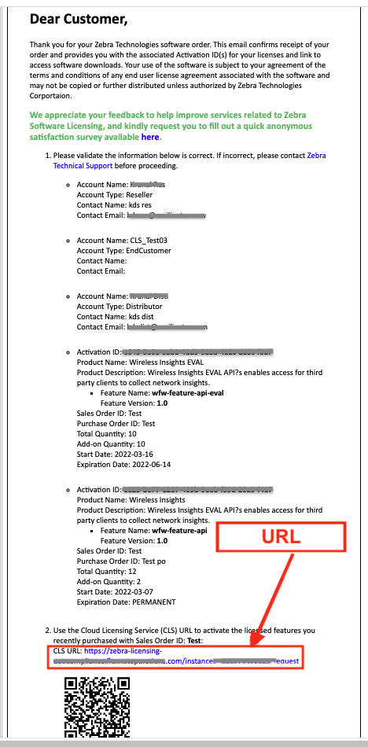
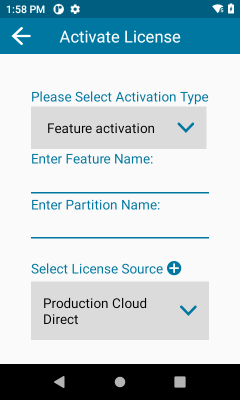
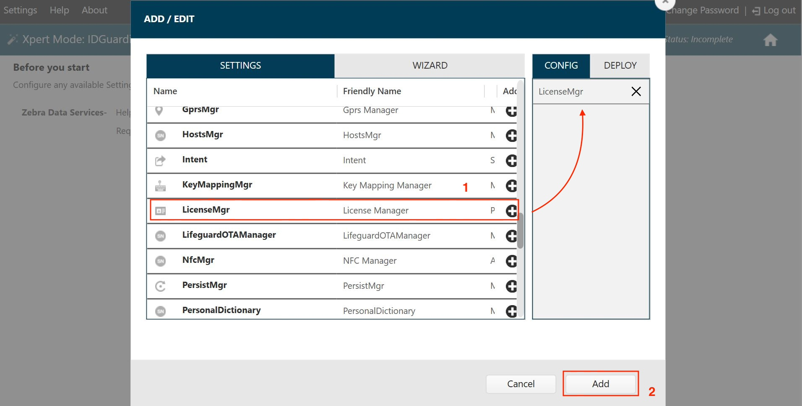
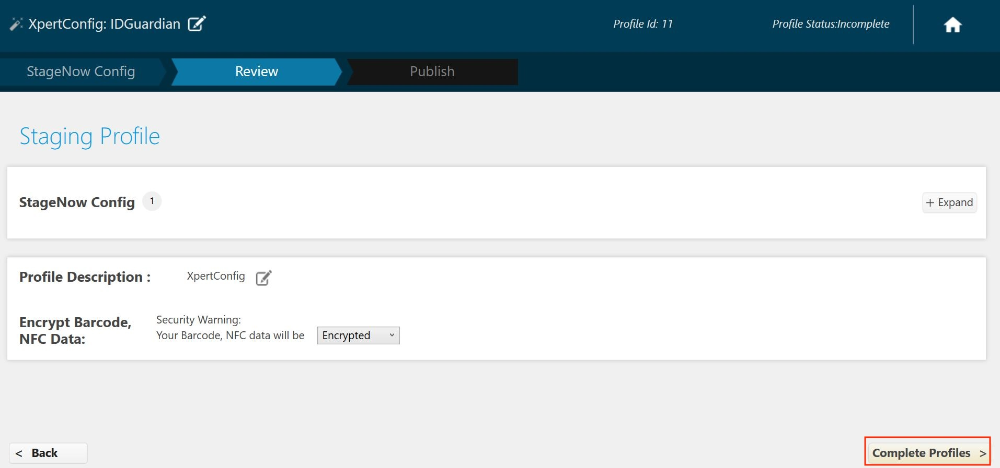

## Overview

For access to advanced features such as facial biometric authentication, single sign-on (SSO) support, and device API support, an Identity Guardian license is necessary. This section covers the acquisition and application of Identity Guardian licenses acquired from Zebra or through a Zebra reseller.

Available License Types:

- **Trial License** (30-day evaluation period)
- **Term-based License**:
  - **1-year** term
  - **3-year** term
  - **5-year** term

<!--
> **Not yet ready to buy**? [Request an evaluation license](#evaluationlicense).

### Licensing Behavior
* After licenses are acquired, **all license allocations are managed in the ZDNA system**.
* **Devices not connected at the time a license action is executed** are updated the next time they come online.
* **If a device was licensed in ZDNA as a part of a group**, disassociating the device from that group automatically reclaims the license and returns it to the pool of available licenses.
* **Removing a Group from the License Allocation screen automatically reclaims licenses from *all* devices in that Group** and returns them to the pool.
* **License actions are executed immediately** upon exiting the ZDNA Licensing section.
-->

### Evaluation License

Zebra offers time-limited trial licenses to allow companies to evaluate the performance of Zebra solutions in their environment.

- **Customers, partners and distributors**: Request through a Zebra account manager or sales engineer
- **Zebra account managers and sales engineers**: Submit requests using [SFDC forms](https://zebra.lightning.force.com/lightning/o/Trial_License_Request__c/new?originalUrl=https%3A%2F%2Fzebra--c.na168.visual.force.com%2Fapex%2FTrial_NFRCreationPage%3FsObjectName%3DTrial_License_Request__c%26save_new_url%3D%252Fa9u%252Fe%26navigationLocation%3DLIST_VIEW%26lexiSObjectName%3DTrial_License_Request__c%26lexiActionName%3Dnew%26sfdc.override%3D1%26vfRetURLInSFX%3D%252Fa9u%252Fo&inContextOfRef=1.eyJ0eXBlIjoic3RhbmRhcmRfX29iamVjdFBhZ2UiLCJhdHRyaWJ1dGVzIjp7Im9iamVjdEFwaU5hbWUiOiJUcmlhbF9MaWNlbnNlX1JlcXVlc3RfX2MiLCJhY3Rpb25OYW1lIjoibGlzdCJ9LCJzdGF0ZSI6eyJmaWx0ZXJOYW1lIjoiUmVjZW50In19&count=1)
- **Zebra engineers and other Zebra employees and contractors**: Submit a request in the Zebra [ServiceNOW](https://zebra.service-now.com/com.glideapp.servicecatalog_cat_item_view.do?v=1&sysparm_id=a6a5c8a60f322700df9ce64be1050e35) portal

---

## I. Contact a Reseller

Zebra licenses are obtained through Zebra resellers or (in some cases) directly from Zebra.

To begin, select an option:

- **[Find a Zebra Partner](https://www.zebra.com/us/en/partners/find-a-zebra-partner.html) -** form for submitting an inquiry via the web
- **[How to Select a Channel Partner](https://www.zebra.com/us/en/partners/find-a-zebra-partner/selecting-the-right-channel-partner.html) -** explains the types of partners that engage with Zebra and some of their technologies and specialties
- **[Partner Interaction Center](https://www.zebra.com/us/en/partners/partner-interaction-center.html) -** info for contacting Zebra's existing global partner network
- **[Zebra Corporate Numbers and Links](https://www.zebra.com/us/en/about-zebra/contact-zebra.html) -** broken down by global region
- **[Global Marketing Contact Center](https://www.zebra.com/us/en/about-zebra/contact-zebra/marketing-contact-center.html) -** broken down by global region and country

---

## II. Access Licensing System

After a licensing agreement is purchased, an email is sent to the license requester containing user credentials for accessing the Zebra Enterprise Software Licensing system.

Visit the [Zebra licensing support page](https://www.zebra.com/us/en/support-downloads/software-licensing.html), register and log into the portal to:

- **Order licenses**
- **Check status** of existing orders
- **Assign licenses** to devices or deployments
- **View inventory and assignments** of current licenses

---

## III. Locate URL

After procuring Identity Guardian licenses, a confirmation email is sent with the **Cloud Licensing Service (CLS) URL.** This URL is required to activate the license in the next step.

 

<!-- For more information, please contact your company administrator, Zebra/reseller contact or other authority.  -->

---

## IV. Activate License

Licenses can be activated either manually or via mass deployment. Use the following **Feature Name** for activation: `idguardian-feature-std`

### Manual

To activate the license on a device:

1. In the Apps screen, launch Licensing Manager.
   
2. Tap the **+** icon at the bottom right to add a license.
   
3. In the "Activate License" screen, enter/select the following:
   - **Select Activation Type:** Feature activation
   - **Enter Feature Name:** idguardian-feature-std
   - **Enter Partition Name:** [Leave blank, no entry required]
   - **Select License Source:** [Opens "Select License Source" screen, see next step]
     
4. In the "Select License Source" screen, enter/select the following and tap **Submit**:
   - **Select License Source:** Cloud/Local Server
   - **Enter URL:** [Copy/paste the CLS URL supplied by Zebra in the confirmation email]
   - **Name:** [Enter a name for the license source]
     
5. Tap **Activate.**
   
6. The license is displayed in the main screen.
   

<!--
<iframe width="560" height="315" type="video/mp4" src="https://www.zebra.com/embed/content/dam/zebra_new_ia/en-us/videos/support/zebra-software-licensing/CLS_Deployment%20Demo_StageNow.mp4/jcr:content/renditions/original" frameborder="0" allow="accelerometer; autoplay; clipboard-write; encrypted-media; gyroscope; picture-in-picture" allowfullscreen></iframe>

<iframe width="560" height="315" type="video/mp4" src="https://www.zebra.com/content/dam/zebra_new_ia/en-us/videos/support/zebra-software-licensing/CLS_Demo_License_Manager.m4v/jcr:content/renditions/original"></iframe>

<video class="vjs-tech" preload="none" id="vjs_video_3_html5_api">
<source type="video/mp4" data-analytics-name="Cloud License Server (CLS) Deployment Method - StageNow" data-analytics-format="video/mp4" data-analytics-tags="asset-type:video-how-to,content-category:solutions-verticals/portfolio-product/software/software-downloads/zebra-software-licensing" src="/content/dam/zebra_new_ia/en-us/videos/support/zebra-software-licensing/CLS_Deployment Demo_StageNow.mp4/jcr:content/renditions/cq5dam.video.firefoxhq.ogg"><track src="/content/dam/zebra_new_ia/en-us/videos/support/zebra-software-licensing/refresh_license.mp4" label="" kind="captions" srclang=""></video> -->

 

### Mass Deployment

Zebra's [StageNow](/stagenow/latest/about) tool can be used to create a staging profile that is consumed by StageNow or an Enterprise Mobility Management (EMM) system to deploy Identity Guardian licenses on devices.

To create a Stagenow profile:

1. Launch StageNow.
2. Select **Create new Profile** from the left-hand pane.
3. Select MX version 10.2 or higher - it must match the MX version on the [device](/mx/mx-version-on-device/). Click **Xpert Mode** and click **Create.**
   
4. Enter a profile name and click **Start.**
   
5. Scroll down and click **LicenseMgr.** LicenseMgr is added to the right side. Click **Add.**
   
6. Under LicenseMgr, select or enter the following:

   - **License action type:** Perform Zebra license action
   - **Zebra license action:** Activate Feature
   - **Feature Name:** idguardian-feature-std
   - **License Source URL:** [Copy/paste the CLS URL supplied by Zebra in the confirmation email]
   - **License Source Friendly Name:** [Enter a name identifier]
     

7. Click **Complete Profile.** The StageNow profile creation is complete.
   

Perform one of the following options based on the desired deployment method:

- **StageNow:** Generate the barcode from the StageNow profile. Open StageNow client on the device and scan the barcode(s) generated.
- **EMM:** Export XML from the StageNow profile. _Do not edit the XML file_ as it can cause unexpected behavior. Push the staging XML profile to the device via EMM using either [OEMConfig](/oemconfig) or [License Manager](/mx/licensemgr) from MX.

<!--
#### To activate license(s), please refer to the [License Manager User Guide](https://www.zebra.com/content/dam/zebra_new_ia/en-us/software---services/license-manager-ug-en.pdf) "License Activation" section for further instructions. -->

---

## See Also

- [About Identity Guardian](../about)
- [Setup](../setup)
- [Managed Configurations](../mc)
- [User Guide](../usage)
- [APIs](../api/)
