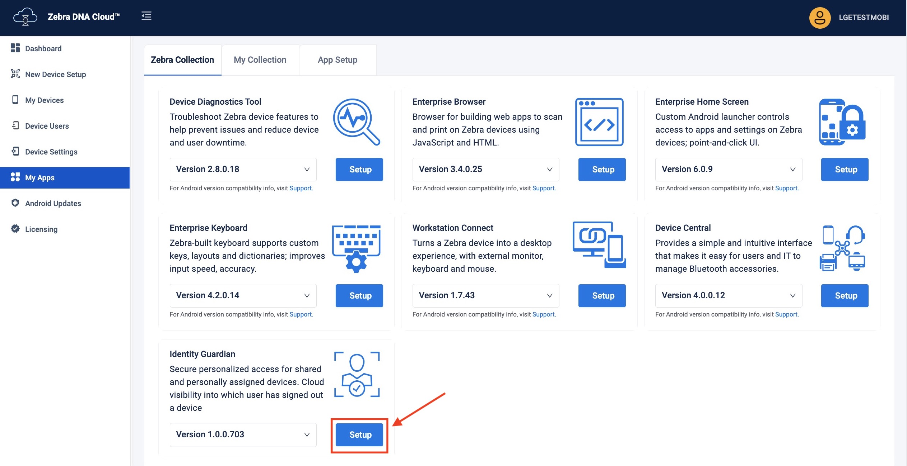

## Overview

**Managed configurations are part of a specification developed by Google and the Android community.** They allow for remote configuration of installed applications and devices via any Enterprise Mobility Management (EMM) system, like ZDNA Cloud, that supports this specification.

**Identity Guardian offers multiple setting categories, each associated with a specific bundle.** _Specific parameters for each configuration are outlined in the tables within this guide._ These settings include the device usage method (shared or personally assigned device), device enrollment, and user authentication. User authentication specifies both the comparison source (like barcode or facial biometrics) and authentication methods (such as facial biometrics or PIN).

<i class="fa fa-exclamation-triangle" style="color:#FFA500;"></i> <b>Enterprise Home Screen:</b>  
Identity Guardian can be used in conjunction with Zebra's **[Enterprise Home Screen (EHS)](/ehs).** If EHS is in use, ensure that the roles defined are consistent with those specified for Identity Guardian.

## ZDNA Cloud

For a detailed guide on how to set up Identity Guardian using Managed Configurations through the [Zebra DNA Cloud](/zebradna) (My Apps > Zebra Collection), refer to the [ZDNA Cloud documentation](/zebradna/latest/usage/#myapps).

## EMM

**The features of a given app that are manageable using Managed Configurations are defined in its _schema_**. The Identity Guardian schema is downloaded when visiting Google Play through the EMM console and selecting **Identity Guardian** for administration. The schema defines the features available for consumption by the EMM, and provides the information necessary to present the app's management UI within the EMM console.&dagger; This data-driven UI method allows delivery of new features and their corresponding UI attributes as soon as they become available, and without the need to download a new `.exe`.

For more information about configuring Zebra devices with managed configurations, see [Zebra OEMConfig](/oemconfig).

<i> &dagger; The Identity Guardian management UI varies slightly depending on the EMM system in use.</i>

---

## Usage Mode

Select how Identity Guardian will be used in this configuration.

<table class="facelift" align="center" style="width:80%" border="1" padding="5px">
<tbody><tr bgcolor="#dce8ef">
<table class="table table-striped">
<tr>
<th>Name</th>
<th>Key</th>
<th>Value(s)</th>
<th>Display Name</th>
<th>Description</th>
</tr>

<tr>
<td>Application Mode</td>
<td>APPLICATION_MODE</td>
<td>ENROLLMENT (default) AUTHENTICATION PERSONALLY_ASSIGNED</td>
<td>ENROLLMENT (default) AUTHENTICATION PERSONALLY ASSIGNED</td>
<td><b>Enrollment -</b> Creates barcodes to enroll users of shared devices <b>Authentication -</b>Sets the app for daily use on shared devices; may be used with SSO <b>Personally Assigned -</b>Sets the app for a single user on a dedicated device; may be used with SSO</td>
</tr>

<tr>
<td>Log Level</td>
<td>logLevel</td>
<td>0 1 (default) 2</td>
<td>0 1 (default) 2</td>
<td>Specify the level of information to log:  <b> • 0 -</b> Debug; logs minimal information for basic troubleshooting <b> • 1 -</b> Informational; logs general system and operational information <b> • 2 -</b>Verbose; logs detailed information, including biometric data which is stored on the device at <code>/data/tmp/public/IdentityGuardian</code>

</td>
</tr>

</tbody>
</table>

---

## Enrollment Configuration

Configure Identity Guardian for user enrollment.

<i>Note: Colored rows indicate a parent option.</i>

<table class="facelift" align="center" style="width:80%" border="1" padding="5px">
<tbody><tr bgcolor="#dce8ef">
<table class="table table-striped">
<tr>
<th>Name</th>
<th>Key</th>
<th>Value(s)</th>
<th>Display Name</th>
<th>Description</th>
</tr>

<tr>
<td>Number of facial images to be enrolled</td>
<td>FACE_VECTOR_COUNT</td>
<td>0 1 2 3</td>
<td>None One Face (default) Two Faces Three Faces</td>
<td>Choose the number of facial images to be provided by the user during enrollment (up to 3)</td>
</tr>

<tr>
<td>Get Role Data?</td>
<td>enableRoleDataUI</td>
<td>1 0</td>
<td>true (default) false</td>
<td>Choose whether to prompt the user to select a "Role" during enrollment</td>
</tr>

<tr>
<td>Allow facial opt-out?</td>
<td>userFaceBiometricOptOut</td>
<td>1 0</td>
<td>true false (default)</td>
<td>Choose whether to allow the user to skip facial enrollment; other methods remain enforced</td>
</tr>

<tr>
<td>Set Expiration Date?</td>
<td>enableExpiryDateUI</td>
<td>1 0</td>
<td>true (default) false</td>
<td>Choose whether to prompt the user for an enrollment expiration date</td>
</tr>

<tr>
<td>List Roles</td>
<td>listOfRoles</td>
<td>[string]</td>
<td>Manager, Associate</td>
<td>Enter a list of roles for selection by enrollee, each role separated by a comma  <b>NOTE:</b>If <a href="/ehs">Enterpise Home Screen</a> is in use, ensure that its roles defined are consistent with those specified here.</td>
</tr>

<tr>
<td>Enable/Disable Corporate PIN</td>
<td>enableDisablePin</td>
<td>1 0</td>
<td>true (default) false</td>
<td>Select whether to require the user to enter a corporate PIN for access</td>
</tr>

<tr>
<td>Corporate PIN</td>
<td>adminCorporatePin</td>
<td>[string]</td>
<td>[enter PIN]</td>
<td>Enter a six-digit numeric PIN for enrollment</td>
</tr>

<tr>
<td>Enrollment Key</td>
<td>enrollmentKey</td>
<td>[string]</td>
<td>[enter enrollment key]</td>
<td>Enter the encrypted public key for enrollment. Use <a href="/det/1-0/guide/about/">Data Encryption Tool</a> to encrypt this key, which is used for encrypting biometric data and is only applicable for shared devices.</td>
</tr>

<tr bgcolor="#D9E7ED">
<td>Passcode Rules</td>
<td>passcodeConfiguration</td>
<td></td>
<td></td>
<td>Specify Rules for Passcode</td>
</tr>

<tr>
<td>Minimum Length</td>
<td>passCodeRuleMinLength</td>
<td>[integer]</td>
<td>6 (default)</td>
<td>Enter the minimum number of characters to accept for the pass code</td>
</tr>

<tr>
<td>Minimum Uppercase Letters</td>
<td>passCodeRuleMinUppercase</td>
<td>0 1</td>
<td>0 (default) 1</td>
<td>Select the minimum number of uppercase letters to accept for the passcode</td>
</tr>

<tr>
<td>Minimum Lower Letters</td>
<td>passCodeRuleMinLowercase</td>
<td>0 1</td>
<td>0 (default) 1</td>
<td>Select the minimum number of lowercase letters to accept for the passcode</td>
</tr>

<tr>
<td>Minimum Numbers</td>
<td>passCodeRuleMinNumbers</td>
<td>0 1</td>
<td>0 (default) 1</td>
<td>Select the minimum amount of numbers to accept for the passcode</td>
</tr>

<tr>
<td>Minimum Symbols</td>
<td>passCodeRuleMinSymbols</td>
<td>0 1</td>
<td>0 (default) 1</td>
<td>Select the minimum number symbols or special characters to accept for the passcode. Acceptable symbols are: <code>!,@,#,$,%,^,&,,-,_,?,</code></td>
</tr>

<tr bgcolor="#D9E7ED">
<td>Custom T&C Configuration</td>
<td>customTCConfiguration</td>
<td></td>
<td></td>
<td>Configure Custom T&C for application</td>
</tr>

<tr>
<td>Display Custom T&C</td>
<td>showCustomTC</td>
<td>1 0</td>
<td>true false (default)</td>
<td>Select whether to display a custom Terms & Conditions tab</td>
</tr>

<tr>
<td>T&C Tab Title</td>
<td>customTCTitle</td>
<td>[string]</td>
<td>[enter T&C title]</td>
<td>Enter a title for the Terms & Conditions tab</td>
</tr>

<tr>
<td>Custom T&C Content</td>
<td>customTCContent</td>
<td>[string]</td>
<td>[enter T&C content]</td>
<td>Enter content to be displayed on the custom Terms & Conditions tab</td>
</tr>

<tr>
<td>Custom T&C URL</td>
<td>customTCUrl</td>
<td>[string]</td>
<td>[enter T&C url]</td>
<td>Enter a URL that contains custom and/or additional Terms & Conditions information</td>
</tr>

</tbody>
</table>

---

## Authentication Configuration

Configure Identity Guardian for user verification and authentication. Create up to four unique authentication schemes, and define the specific options for each one. Then, for any given event option, choose the appropriate authentication scheme to apply. Each authentication scheme includes the following:

- **Primary Authentication Factor -** The initial method used to confirm identity.
- **Secondary Authentication Factor -** An optional second verification step that becomes mandatory when activated, establishing a two-factor authentication process.
- **Fallback Authentication Method -** The alternate method employed for authentication if the primary method fails.

<i>Note: Colored rows indicate a parent option.</i>

<table class="facelift" align="center" style="width:100%" border="1" padding="5px">
<tbody><tr bgcolor="#dce8ef">
<table class="table">
<tr>
<th>Name</th>
<th>Option Name</th>
<th>Key</th>
<th>Value(s)</th>
<th>Display Name</th>
<th>Description</th>
</tr>

<tr>
<td>User Verification Methods</td>
<td></td>
<td>authenticationSchemes</td>
<td></td>
<td></td>
<td>Select the user verification setup method</td>
</tr>

<tr bgcolor="#D9E7ED">
<td></td>
<td>Verification Setup1</td>
<td>authenticationScheme1</td>
<td></td>
<td></td>
<td>Verification Setup1</td>
</tr>

<tr>
<td></td>
<td>Comparison Source</td>
<td>authenticationScheme1ComparisonSource</td>
<td>BARCODE NONE</td>
<td>BARCODE (default) NONE</td>
<td>Select a comparison source for authentication</td>
</tr>

<tr>
<td></td>
<td>Primary Authentication Method</td>
<td>authenticationScheme1PrimaryAuthMethod</td>
<td></td>
<td></td>
<td>Select the user authentication method</td>
</tr>

<tr>
<td></td>
<td>Primary Authentication Factor</td>
<td>authenticationScheme1PrimaryAuthMethodFactor1</td>
<td>FACE PASSCODE SSO NO_COMPARISON</td>
<td>FACE (default) PASSCODE SSO NO_COMPARISON</td>
<td>Set the primary method for user authentication</td>
</tr>

<tr>
<td></td>
<td>Secondary Authentication Factor</td>
<td>authenticationScheme1PrimaryAuthMethodFactor2</td>
<td>FACE PASSCODE SSO NONE</td>
<td>FACE PASSCODE (default) SSO NONE</td>
<td>Set the secondary method for user authentication</td>
</tr>

<tr>
<td></td>
<td>Fallback Authentication Method</td>
<td>authenticationScheme1FallbackAuthMethod</td>
<td>NONE PASSCODE FACE SSO ADMIN BYPASS PASSCODE</td>
<td>NONE PASSCODE (default) FACE SSO ADMIN_BYPASS_PASSCODE</td>
<td>Choose a backup authentication method if the primary one fails: <b>• None -</b> No further authentication <b>• Passcode -</b> User enters a passcode <b>• Face -</b> User provides facial biometrics <b>• SSO -</b> User inputs SSO login <b>• Admin Bypass Passcode -</b> User enters an admin-set bypass code; applicable if Passcode is the primary or secondary authentication</td>
</tr>

<tr>
<td></td>
<td>Primary Authentication Timeout</td>
<td>authenticationScheme1PrimaryAuthTimeout</td>
<td>[Integer]</td>
<td>Integer (default=20000)</td>
<td>Set the timeout (in milliseconds) for primary authentication  Zebra recommends a longer timeout period, such as 300000 (5 minutes), for sufficient user login time.</td>
</tr>

<tr>
<td></td>
<td>Fallback Authentication Timeout</td>
<td>authenticationScheme1FallbackAuthTimeout</td>
<td>[Integer]</td>
<td>Integer (default=20000)</td>
<td>Set the timeout (in milliseconds) for fallback authentication</td>
</tr>

<!-- setup 2 -->

<tr bgcolor="#D9E7ED">
<td></td>
<td>Verification Setup2</td>
<td>authenticationScheme2</td>
<td></td>
<td></td>
<td>Verification Setup2</td>
</tr>

<tr>
<td></td>
<td>Comparison Source</td>
<td>authenticationScheme2ComparisonSource</td>
<td>BARCODE NONE</td>
<td>BARCODE (default) NONE</td>
<td>Select your comparison source for authentication</td>
</tr>

<tr>
<td></td>
<td>Primary Authentication Method</td>
<td>authenticationScheme2PrimaryAuthMethod</td>
<td></td>
<td></td>
<td>Select the user authentication method</td>
</tr>

<tr>
<td></td>
<td>Primary Authentication Factor</td>
<td>authenticationScheme2PrimaryAuthMethodFactor1</td>
<td>FACE PASSCODE SSO NO_COMPARISON</td>
<td>FACE (default) PASSCODE SSO NO_COMPARISON</td>
<td>Set the primary method for user authentication</td>
</tr>

<tr>
<td></td>
<td>Secondary Authentication Factor</td>
<td>authenticationScheme2PrimaryAuthMethodFactor2</td>
<td>FACE PASSCODE SSO NONE</td>
<td>FACE PASSCODE (default) SSO NONE</td>
<td>Set the secondary method for user authentication</td>
</tr>

<tr>
<td></td>
<td>Fallback Authentication Method</td>
<td>authenticationScheme2FallbackAuthMethod</td>
<td>NONE PASSCODE FACE SSO ADMIN BYPASS PASSCODE</td>
<td>NONE PASSCODE (default) FACE SSO ADMIN_BYPASS_PASSCODE</td>
<td>Choose a backup authentication method if the primary one fails: <b>• None -</b> No further authentication <b>• Passcode -</b> User enters a passcode <b>• Face -</b> User provides facial biometrics <b>• SSO -</b> User inputs SSO login <b>• Admin Bypass Passcode -</b> User enters an admin-set bypass code; applicable if Passcode is the primary or secondary authentication</td>
</tr>

<tr>
<td></td>
<td>Primary Authentication Timeout</td>
<td>authenticationScheme2PrimaryAuthTimeout</td>
<td>[Integer]</td>
<td>Integer (default=20000)</td>
<td>Set the timeout (in milliseconds) for primary authentication  Zebra recommends a longer timeout period, such as 300000 (5 minutes), for sufficient user login time.</td>
</tr>

<tr>
<td></td>
<td>Fallback Authentication Timeout</td>
<td>authenticationScheme2FallbackAuthTimeout</td>
<td>[Integer]</td>
<td>Integer (default=20000)</td>
<td>Set the timeout (in milliseconds) for fallback authentication</td>
</tr>

<!-- setup 3 -->

<tr bgcolor="#D9E7ED">
<td></td>
<td>Verification Setup3</td>
<td>authenticationScheme3</td>
<td></td>
<td></td>
<td>Verification Setup3</td>
</tr>

<tr>
<td></td>
<td>Comparison Source</td>
<td>authenticationScheme3ComparisonSource</td>
<td>BARCODE NONE</td>
<td>BARCODE (default) NONE</td>
<td>Select a comparison source for authentication</td>
</tr>

<tr>
<td></td>
<td>Primary Authentication Method</td>
<td>authenticationScheme3PrimaryAuthMethod</td>
<td></td>
<td></td>
<td>Select the user authentication method</td>
</tr>

<tr>
<td></td>
<td>Primary Authentication Factor</td>
<td>authenticationScheme3PrimaryAuthMethodFactor1</td>
<td>FACE PASSCODE SSO NO_COMPARISON</td>
<td>FACE (default) PASSCODE SSO NO_COMPARISON</td>
<td>Set the primary method for user authentication</td>
</tr>

<tr>
<td></td>
<td>Secondary Authentication Factor</td>
<td>authenticationScheme3PrimaryAuthMethodFactor2</td>
<td>FACE PASSCODE SSO NONE</td>
<td>FACE PASSCODE (default) SSO NONE</td>
<td>Set the secondary method for user authentication</td>
</tr>

<tr>
<td></td>
<td>Fallback Authentication Method</td>
<td>authenticationScheme3FallbackAuthMethod</td>
<td>NONE PASSCODE FACE SSO ADMIN BYPASS PASSCODE</td>
<td>NONE PASSCODE (default) FACE SSO ADMIN_BYPASS_PASSCODE</td>
<td>Choose a backup authentication method if the primary one fails: <b>• None -</b> No further authentication <b>• Passcode -</b> User enters a passcode <b>• Face -</b> User provides facial biometrics <b>• SSO -</b> User inputs SSO login <b>• Admin Bypass Passcode -</b> User enters an admin-set bypass code; applicable if Passcode is the primary or secondary authentication</td>
</tr>

<tr>
<td></td>
<td>Primary Authentication Timeout</td>
<td>authenticationScheme3PrimaryAuthTimeout</td>
<td>[Integer]</td>
<td>Integer (default=20000)</td>
<td>Set the timeout (in milliseconds) for primary authentication  Zebra recommends a longer timeout period, such as 300000 (5 minutes), for sufficient user login time.</td>
</tr>

<tr>
<td></td>
<td>Fallback Authentication Timeout</td>
<td>authenticationScheme3FallbackAuthTimeout</td>
<td>[Integer]</td>
<td>Integer (default=20000)</td>
<td>Set the timeout (in milliseconds) for fallback authentication</td>
</tr>

<!-- setup 4 -->

<tr bgcolor="#D9E7ED">
<td></td>
<td>Verification Setup4</td>
<td>authenticationScheme4</td>
<td></td>
<td></td>
<td>Verification Setup4</td>
</tr>

<tr>
<td></td>
<td>Comparison Source</td>
<td>authenticationScheme4ComparisonSource</td>
<td>BARCODE NONE</td>
<td>BARCODE (default) NONE</td>
<td>Select a comparison source for authentication</td>
</tr>

<tr>
<td></td>
<td>Primary Authentication Method</td>
<td>authenticationScheme4PrimaryAuthMethod</td>
<td></td>
<td></td>
<td>Select the user authentication method</td>
</tr>

<tr>
<td></td>
<td>Primary Authentication Factor</td>
<td>authenticationScheme4PrimaryAuthMethodFactor1</td>
<td>FACE PASSCODE SSO NO_COMPARISON</td>
<td>FACE (default) PASSCODE SSO NO_COMPARISON</td>
<td>Set the primary method for user authentication</td>
</tr>

<tr>
<td></td>
<td>Secondary Authentication Factor</td>
<td>authenticationScheme4PrimaryAuthMethodFactor2</td>
<td>FACE PASSCODE SSO NONE</td>
<td>FACE PASSCODE (default) SSO NONE</td>
<td>Set the secondary method for user authentication</td>
</tr>

<tr>
<td></td>
<td>Fallback Authentication Method</td>
<td>authenticationScheme4FallbackAuthMethod</td>
<td>NONE PASSCODE FACE SSO ADMIN BYPASS PASSCODE</td>
<td>NONE PASSCODE (default) FACE SSO ADMIN_BYPASS_PASSCODE</td>
<td>Choose a backup authentication method if the primary one fails: <b>• None -</b> No further authentication <b>• Passcode -</b> User enters a passcode <b>• Face -</b> User provides facial biometrics <b>• SSO -</b> User inputs SSO login <b>• Admin Bypass Passcode -</b> User enters an admin-set bypass code; applicable if Passcode is the primary or secondary authentication</td>
</tr>

<tr>
<td></td>
<td>Primary Authentication Timeout</td>
<td>authenticationScheme4PrimaryAuthTimeout</td>
<td>[Integer]</td>
<td>Integer (default=20000)</td>
<td>Set the timeout (in milliseconds) for primary authentication  Zebra recommends a longer timeout period, such as 300000 (5 minutes), for sufficient user login time.</td>
</tr>

<tr>
<td></td>
<td>Fallback Authentication Timeout</td>
<td>authenticationScheme4FallbackAuthTimeout</td>
<td>[Integer]</td>
<td>Integer (default=20000)</td>
<td>Set the timeout (in milliseconds) for fallback authentication</td>
</tr>

<!-- LockScreen Show Options -->

<tr>
<td>Lock-screen Event Options</td>
<td></td>
<td>LockScreenShowOption</td>
<td></td>
<td></td>
<td>Choose the verification method that is triggered by the event that causes the device screen to lock</td>
</tr>

<tr bgcolor="#D9E7ED">
<td></td>
<td>On Unlock</td>
<td>Bundle_LockScreenShowOptionUnlock</td>
<td></td>
<td></td>
<td>Select the option(s) required following a device event that unlocks the screen</td>
</tr>

<tr>
<td></td>
<td>Verification Setup</td>
<td>on_unlock</td>
<td>authenticationScheme1 authenticationScheme2 authenticationScheme3 authenticationScheme4 NONE</td>
<td>Verification Setup1 (default) Verification Setup2 Verification Setup3 Verification Setup4 None</td>
<td>Select the verification required following a device event that unlocks the screen</td>
</tr>
<!-- // Removed per TUT-92679
<tr>
<td></td>
<td>Automatic Logout</td>
<td>on_unlock_automatic_logout</td>
<td>1 0</td>
<td>true false (default)</td>
<td></td>
</tr>
-->
<tr bgcolor="#D9E7ED">
<td></td>
<td>On Reboot</td>
<td>Bundle_LockScreenShowOptionReboot</td>
<td></td>
<td></td>
<td>Select the option(s) required after a device reboot</td>
</tr>

<tr>
<td></td>
<td>Verification Setup</td>
<td>on_reboot</td>
<td>authenticationScheme1 authenticationScheme2 authenticationScheme3 authenticationScheme4 NONE</td>
<td>Verification Setup1 Verification Setup2 (default) Verification Setup3 Verification Setup4 None</td>
<td>Select the verification required after a device reboot</td>
</tr>
<!-- // Removed per TUT-92679
<tr>
<td></td>
<td>Automatic Logout</td>
<td>on_reboot_automatic_logout</td>
<td>1 0</td>
<td>true false</td>
<td></td>
</tr>
-->
<tr bgcolor="#D9E7ED">
<td></td>
<td>On AC power connected</td>
<td>Bundle_LockScreenShowOptionACPowerCon</td>
<td></td>
<td></td>
<td>Select the option(s) required upon connection to AC power</td>
</tr>

<tr>
<td></td>
<td>Verification Setup</td>
<td>on_ac_power_connected</td>
<td>authenticationScheme1 authenticationScheme2 authenticationScheme3 authenticationScheme4 NONE</td>
<td>Verification Setup1 Verification Setup2 Verification Setup3 (default) Verification Setup4 None</td>
<td>Select the verification required upon connection to AC power</td>
</tr>

<!-- // Removed per TUT-92679
<tr>
<td></td>
<td>Automatic Logout</td>
<td>on_ac_power_connected_automatic_logout</td>
<td>1 0</td>
<td>true false (default)</td>
<td></td>
</tr>
-->

<tr bgcolor="#D9E7ED">
<td></td>
<td>On AC Power Disconnection</td>
<td>Bundle_LockScreenShowOptionACPowerDisCon</td>
<td></td>
<td></td>
<td>Select the option(s) required upon disconnection from AC power</td>
</tr>

<tr>
<td></td>
<td>Verification Setup</td>
<td>on_ac_power_disconnected</td>
<td>authenticationScheme1 authenticationScheme2 authenticationScheme3 authenticationScheme4 NONE</td>
<td>Verification Setup1 Verification Setup2 Verification Setup3 (default) Verification Setup4 None</td>
<td>Select the verification required upon disconnection from AC power</td>
</tr>

<!-- // Removed per TUT-92679
<tr>
<td></td>
<td>Automatic Logout</td>
<td>on_ac_power_disconnected_automatic_logout</td>
<td>1 0</td>
<td>true false (default)</td>
<td></td>
</tr>
-->

<tr bgcolor="#D9E7ED">
<td></td>
<td>On device manual checkin</td>
<td>Bundle_LockScreenShowOptionManualCheckin</td>
<td></td>
<td></td>
<td>Select the option(s) required when the user manually signs in to the device</td>
</tr>

<tr>
<td></td>
<td>Verification Setup</td>
<td>on_device_manual_checkin</td>
<td>authenticationScheme1 authenticationScheme2 authenticationScheme3 authenticationScheme4 NONE</td>
<td>Verification Setup1 Verification Setup2 Verification Setup3 (default) Verification Setup4 None (default)</td>
<td>Select the verification required when a user manually signs in to the device</td>
</tr>

<!-- // Removed per TUT-92679
<tr>
<td></td>
<td>Automatic Logout</td>
<td>on_manual_checkin_automatic_logout</td>
<td>1 0</td>
<td>true false (default)</td>
<td></td>
</tr>
-->

<tr bgcolor="#D9E7ED">
<td></td>
<td>On user change</td>
<td>Bundle_LockScreenShowOptionUserChange</td>
<td></td>
<td></td>
<td>Select the necessary option(s) when a new user signs in to the device after the previous user has been automatically signed out, such as due to a Force Logout action or when the device goes idle.</td>
</tr>

<tr>
<td></td>
<td>Verification Setup</td>
<td>on_device_manual_checkin</td>
<td>authenticationScheme1 authenticationScheme2 authenticationScheme3 authenticationScheme4 NONE</td>
<td>Verification Setup1 (default) Verification Setup2 Verification Setup3 (default) Verification Setup4 None</td>
<td>Select the verification required when a new user signs in to the device</td>
</tr>

<!-- // Removed per TUT-92679
<tr>
<td></td>
<td>Automatic Logout</td>
<td>on_user_change_automatic_logout</td>
<td>1 0</td>
<td>true false (default)</td>
<td>This will delete the complete logged in user session when set to true</td>
</tr>
-->

<!-- Force Logout Options -->

<tr>
<td>Force Logout Options</td>
<td></td>
<td>ForceLogoutShowOption</td>
<td></td>
<td></td>
<td>Choose whether to automatically logout the user based on certain device events.</td>
</tr>

<tr>
<td></td>
<td>On Lock</td>
<td>forceLogout_on_lock</td>
<td>0 1</td>
<td>true false (default)</td>
<td>Choose whether to automatically logout the user when the device screen locks.</td>
</tr>

<tr>
<td></td>
<td>On Reboot</td>
<td>forceLogout_on_reboot</td>
<td>0 1</td>
<td>true false (default)</td>
<td>Choose whether to automatically logout the user when the device reboots</td>
</tr>

<tr>
<td></td>
<td>On AC power connected</td>
<td>forceLogout_on_ac_power_connected</td>
<td>0 1</td>
<td>true false (default)</td>
<td>Choose whether to automatically logout the user when the device is connected to AC power</td>
</tr>

<tr>
<td></td>
<td>On AC power disconnected</td>
<td>forceLogout_on_ac_power_disconnected</td>
<td>0 1</td>
<td>true false (default)</td>
<td>Choose whether to automatically logout the user when the device is disconnected from AC power</td>
</tr>

<!-- // Removed per TUT-92679
<tr>
<td></td>
<td>On Force Lock</td>
<td>forceLogout_on_force_lock</td>
<td>0 1</td>
<td>true false (default)</td>
<td>Choose whether to automatically logout the user when the device is force locked</td>
</tr>
-->

<!-- Expire Barcodes-->

<tr>
<td>Expire Barcodes</td>
<td></td>
<td>expireBarcodes</td>
<td></td>
<td></td>
<td>Choose whether to set an expiration date for the barcode</td>
</tr>

<tr>
<td></td>
<td>Automatic Barcode Expiration</td>
<td>expireBasedOnExpiryDate</td>
<td>1 0</td>
<td>true false (default)</td>
<td>The barcode is valid up to the expiration date. After it expires, the barcode cannot be scanned.</td>
</tr>

<tr>
<td>Authentication Key</td>
<td></td>
<td>authenticationKey</td>
<td></td>
<td></td>
<td>Enter the encrypted private key for decryption. Use <a href="/det/1-0/guide/about/">Data Encryption Tool</a> to encrypt your public key. This is used to decrypt the biometric data and only applies to shared devices.<!-- Enter authentication decrypt key --></td>
</tr>

<tr>
<td>Enable ForceLock After Timeout</td>
<td></td>
<td>enableForceLockAfterTimeout</td>
<td>1 0</td>
<td>true false (default)</td>
<td>Choose whether the device should automatically lock after the timeout period</td>
</tr>

<tr>
<td>Force Lock Timeout</td>
<td></td>
<td>forceLockTimeout</td>
<td>[integer]</td>
<td>240 (default)</td>
<td>Enter the time (in minutes) for the warning notification to appear before the device locks</td>
</tr>

<tr>
<td>Snooze Time</td>
<td></td>
<td>snoozeTimeout</td>
<td>[integer]</td>
<td>120 (default)</td>
<td>Enter the delay time (in seconds) after which the device will lock once the warning notification appaers</td>
</tr>

<tr>
<td>Snooze Title</td>
<td></td>
<td>snoozeTitle</td>
<td>[string]</td>
<td>You will be locked out soon (default)</td>
<td>Enter the title for the device lock warning notification.</td>
</tr>

<tr>
<td>Snooze Desc</td>
<td></td>
<td>snoozeDescription</td>
<td>[string]</td>
<td>[enter text]</td>
<td>Enter the message for the device lock warning notification</td>
</tr>

<tr>
<td>Admin Bypass Passcode</td>
<td></td>
<td>adminSpecifiedPIN</td>
<td></td>
<td></td>
<td>Choose whether to allow the passcode to be bypassed using a special PIN or passcode</td>
</tr>

<tr>
<td>passcodes</td>
<td></td>
<td>pins</td>
<td></td>
<td></td>
<td>Choose whether to permit the use of this passcode. Multiple passcodes can be added, each toggled on/off individually.</td>
</tr>

<tr>
<td>Group Name</td>
<td></td>
<td>key</td>
<td>[string]</td>
<td>[enter string]</td>
<td>Enter the group name to help identify the user's group affiliation when they enter the passcode</td>
</tr>

<tr>
<td>PIN/Passcode</td>
<td></td>
<td>value</td>
<td>[string]</td>
<td>[enter string]</td>
<td>Enter the alternate PIN/passcode for users of this group to use instead of the original one</td>
</tr>

</tbody>
</table>

---

## Facial Authentication Configuration

Configure Identity Guardian for Facial Authentication

<table class="facelift" align="center" style="width:80%" border="1" padding="5px">
<tbody><tr bgcolor="#dce8ef">
<table class="table table-striped">
<tr>
<th>Configuration Name</th>
<th>Key</th>
<th>Value(s)</th>
<th>Display Name</th>
<th>Description</th>
</tr>

<tr>
<td>Liveness Threshold</td>
<td>livenessThreshold</td>
<td>96 94 91 88 86 Custom</td>
<td>High Medium/High (default) Medium Medium/Low Low Custom</td>
<td>Higher values offer greater security; lower values provide faster authentication. <b>• High -</b> Facial algorithm is most strict, ensures liveness and other thresholds are met before granting access. May result in some false positives. <b>• Medium/High (default) -</b> Moderately strict <b>• Medium -</b> Middle ground in strictness <b>• Medium/Low -</b> Slightly strict <b>• Low -</b>  Least strict; best for environments with poor lighting and difficulty identifying users. Best used for low risk environments (e.g. warehouse) since this may result in some spoofing.</td>
</tr>

<tr>
<td>Face Liveness Threshold</td>
<td>faceLivenessThreshold</td>
<td>[integer value]</td>
<td>[enter integer between 80 and 100]</td>
<td>Enter a custom Liveness Threshold (from 80 to 100) for facial authentication.  <b><i>NOTE: Only use this under the guidance of a Zebra technician.</i></b></td>
</tr>

</tbody>
</table>

---

## SSO Authentication Configuration

Configure Identity Guardian for single sign-on (SSO) authentication.

<table class="facelift" align="center" style="width:80%" border="1" padding="5px">
<tbody><tr bgcolor="#dce8ef">
<table class="table table-striped">
<tr>
<th>Configuration Name</th>
<th>Key</th>
<th>Value(s)</th>
<th>Display Name</th>
<th>Description</th>
</tr>

<tr>
<td>Single Sign On Provider</td>
<td>ssoProvider</td>
<td>Microsoft PingId</td>
<td>Microsoft (default) PingId</td>
<td>Select the SSO provider in use</td>
</tr>

<tr>
<td>Authentication Protocol</td>
<td>ssoProtocol</td>
<td>OAuth2.0</td>
<td>OAuth2.0</td>
<td>Select the authentication protocol to use for communication with your SSO server</td>
</tr>

<tr>
<td>Scope</td>
<td>ssoScope</td>
<td>[string]</td>
<td>[enter string]</td>
<td>Enter the SSO scope, which defines limits on the quantity and type of data granted to an access token</td>
</tr>

<tr>
<td>Configuration Settings</td>
<td>ssoConfigSettings</td>
<td>[string]</td>
<td>[enter string]</td>
<td>Enter the JSON-formatted configuration for SSO settings needed to communicate securely with the SSO server. This is taken from the Android app configuration from your SSO provider. Click <a href="./sso-config-settings.txt" download="sso-settings">here</a> to download sample content.</td>
</tr>

<tr>
<td>Userid identifier</td>
<td>ssoUseridIdentifier</td>
<td>[string]</td>
<td>[enter string]</td>
<td>Specify the user key for identifying the signed-in user, which is displayed in the zDNA Cloud and retrievable from the API. The user key, which could be a username, preferred username, or employee ID, can be found in the ID token or user information from the SSO response.</td>
</tr>

<tr bgcolor="#D9E7ED">
<td>Configuration for Role Identification</td>
<td>roleSettings</td>
<td></td>
<td></td>
<td>Enables the recognition and mapping of the Single Sign-On (SSO) response to application-specific roles. It provides the necessary settings to align SSO data with corresponding roles within the application, facilitating seamless integration and effective role-based access control.</td>
</tr>

<tr>
<td>Role Identifier</td>
<td>roleNames</td>
<td></td>
<td></td>
<td>Establishes links between roles in SSO responses and their corresponding roles within the Identity Guardian app. Multiple Role Identifiers can be added, each toggled on/off individually</td>
</tr>

<tr>
<td>Identity Guardian Role Name</td>
<td>roleName</td>
<td>[string]</td>
<td>[enter string]</td>
<td>Enter the Identity Guardian user role to be assigned based on SSO response during user sign-in (e.g. administrator, manager, user).</td>
</tr>

<tr>
<td>Key-value pair for role assignment</td>
<td>ssoResponseKeys</td>
<td></td>
<td>[enter values and toggle on/off]</td>
<td>Add one or more SSO key-value pairs to identify and map users to a predefined Identity Guardian user role.</td>
</tr>

<tr>
<td>SSO Key-Value Pair</td>
<td>ssoResponseKey</td>
<td></td>
<td></td>
<td>Choose whether the SSO response, which contains the user key and values, should be mapped to a corresponding user role in Identity Guardian</td>
</tr>

<tr>
<td>SSO key</td>
<td>roleKey</td>
<td>[string]</td>
<td>[enter string]</td>
<td>Enter the SSO key to map it to an Identity Guardian role.</td>
</tr>

<tr>
<td>SSO value</td>
<td>roleValue</td>
<td>[string]</td>
<td>[enter string]</td>
<td>Enter the SSO value(s) to map to the Identity Guardian role. Use commas to separate multiple entries.</td>
</tr>

</tbody>
</table>

---

## See Also

- [About Identity Guardian](../about)
- [Licensing](../licensing/)
- [Setup](../setup)
- [User Guide](../usage)
- [APIs](../api)
