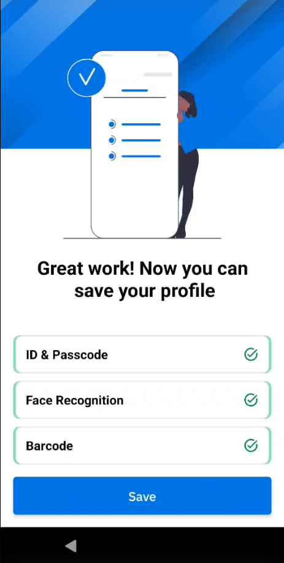
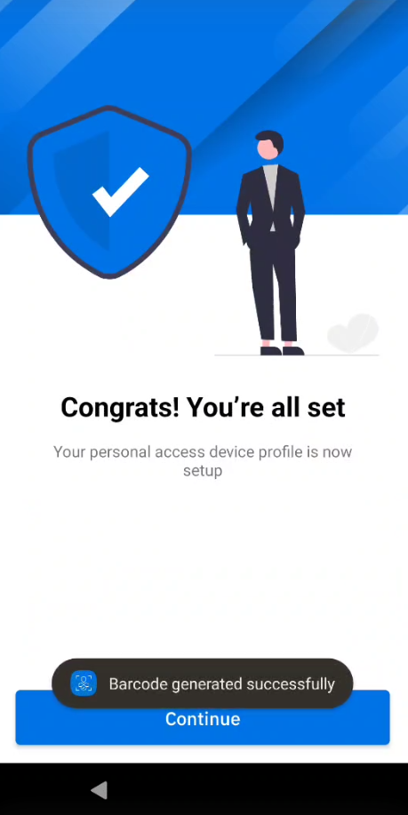
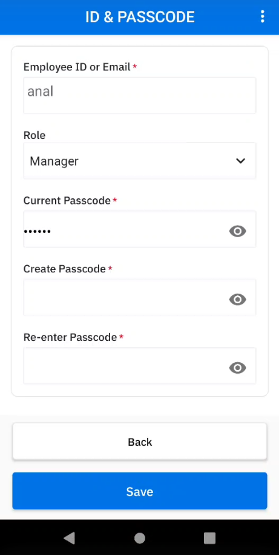
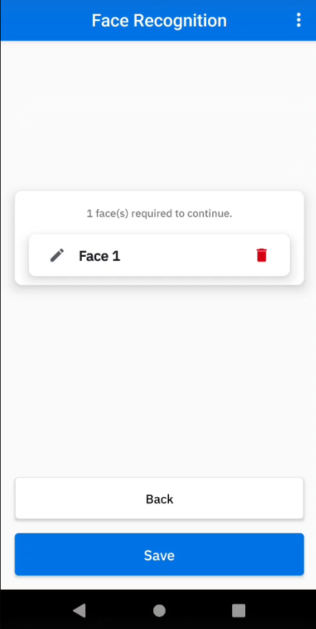
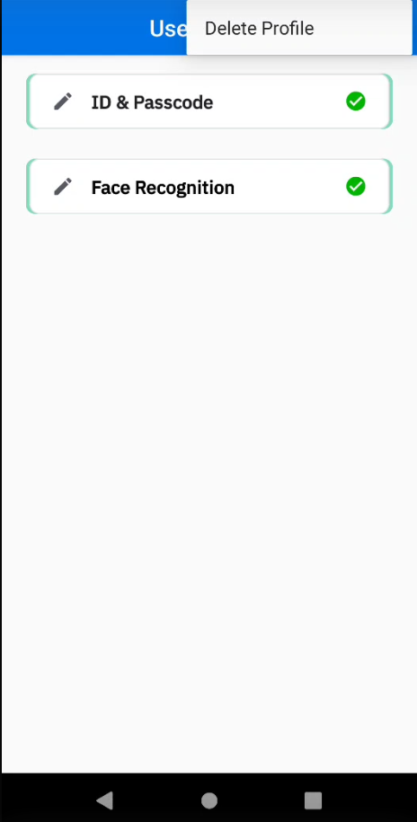
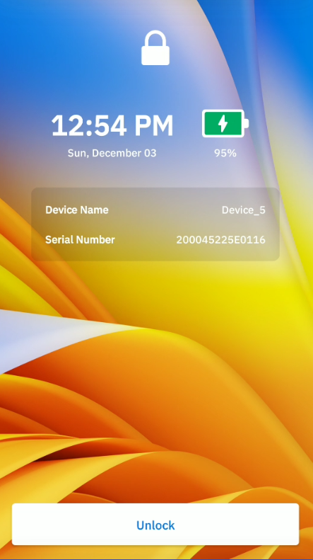

## Overview

Identity Guardian offers 2 types of models for secure and personalized device access:

- **[Shared Device](#shareddevice) -** A device that is designated for use by multiple individuals.
- **[Personally Assigned Device](#personallyassigneddevice) -** A device that is issued and allocated specifically to an individual for their dedicated use.

After the administrator [configures](../setup/#configuration) Identity Guardian, setup the user profiles based on the method of access. For users who opt into using facial biometrics, Identity Guardian provides Terms and Conditions to the user, which they must accept to use the biometric portion of the solution. The Terms & Conditions may be customized by the administrator through ZDNA.

---

## Shared Device

**In shared environments where multiple users utilize the same devices,** Identity Guardian ensures seamless integration without sacrificing security. It simplifies authentication and allows users full control of their information by recognizing users without storing personal data on the device or in the cloud. Users can easily discard the barcode at any point to delete their personal information.

A user's predefined organizational role can be used to offer personalized experiences on shared devices. These devices can recognize an unlimited number of registered users. Each user's data is encrypted and stored within a unique barcode, which the user can manage and store on the device in the `/enterprise/usr/Profiles` folder. Optionally, facial biometrics can be used to generate this barcode. For temporary user profiles, barcodes can be set to automatically expire at a specified date and time.

### User Enrollment

Follow the instructions below for user enrollment. Organizations may choose to walk-through this initial setup with the shared device user:

1. Open **Identity Guardian.**
2. Tap **Start.**
   
3. This is a 6 digit PIN set by the administrator. Tap **Continue.**
   
4. Setup ID and passcode:
   - Enter ID or email
   - (Optional) Select the appropriate user role (options vary based on your adminstrator setup)
   - (Optional) Enter the expiration date for the barcode. This applies for temporary users.
   - Create a passcode, which can contain up to 6 alphanumeric characters.
   - Re-enter the passcode
     
5. (Optional) Capture facial biometrics. _If opting out, tap **Skip** and skip to step 7 below._ Otherwise, tap **Add** and continue with the subsequent steps.
   
6. Read the Terms & Conditions. Tap **Confirm** to accept.
   
7. Position your face within the device screen for the photo capture. Capture 1 to 3 facial photos that may vary based on the individual's look, for example, with eyeglasses, hat, etc. Confirm the photo capture(s). Tap **Add** to capture additional photos. Tap **Next** when done.
   
8. The barcode is generated. Tap **Next.**
   
9. Tap **Save** to save the profile.
   
10. Tap **Continue.** The profile creation is complete.
    

---

## Personally Assigned Device

**For devices assigned to specific users,** set up is hassle-free with data-protection conveniently handled within the Android framework. Users maintain control over their encrypted personal data with the freedom to erase it at will. The organization cannot access this data due to Identity Guardian's sandboxed storage found within Android's access-controlled application platform.

Identity Guardian works in conjunction with identity providers (IdPs) to streamline the authentication process. Users are required to authenticate only once, and single sign-on (SSO) is employed to enhance the process efficiency and security. This permits users to access multiple applications through a single log-in session.

Administrators can monitor the security measures a user has setup on their assigned device, assist with PIN resets, and bypass screen locks for troubleshooting purposes without the need to access personal data.

<!-- Subsequent device unlocks, reboot, etc. requires user entry based on setup : PIN, facial recognition, etc. -->

### User Enrollment

Follow the instructions below for user enrollment:

1. Open **Identity Guardian.**
2. Tap **Start.**
   
3. Enter corporate PIN. This is a 6 digit PIN set by the administrator. Tap **Continue.**
   
4. Setup ID and passcode, then tap **Next.**
   - Enter ID or email
   - (Optional) Select the appropriate user role (options vary based on setup by your adminstrator)
   - Create a passcode, which can contain up to 6 alphanumeric characters.
   - Re-enter the passcode.
     
5. (Optional) Capture facial biometrics. _If opting out, tap **Skip** and skip to step 7 below._ Otherwise, tap **Add** and continue with the subsequent steps.
   
6. Read the Terms & Conditions. Tap **Confirm** to accept.
   
7. To add a facial photo, tap **Add.** Position your face within the device screen for the photo capture. Capture 1 to 3 facial photos that may vary based on the individual's look, for example, with eyeglasses, hat, etc. Confirm the photo capture(s). Tap **Add** to capture additional photos. Tap **Next** when done.
   
8. Tap **Save** to save the profile.
   
9. Tap **Continue.** The profile creation is complete.
   

### Edit Profile

To edit a profile on a personally assigned device:

1. Open Zebra Biometric app.
2. Enter your passcode.
   
3. Select the item to edit:
   - ID & Passcode
   - Face Recognition
     
4. If **ID & Passcode** is selected, make the appropriate edits and tap **Save:**
   - **Role -** select the desired role
   - **Passcode -** enter the current passcode and the new passcode
     
5. If **Face Recognition** is selected, delete the existing facial photo and replace it by capturing a new photo.
   

### Delete Profile

To delete a profile on a personally assigned device:

1. Open Zebra Biometric app.
2. Enter your passcode.
   
3. Tap on the menu icon at the top right and select **Delete Profile.**
   

After the profile is deleted, the enrollment screen appears to re-enroll the device and authenticate the user.

---

## Device Sign In

After a device is setup with the user profile, the lock screen appears based on the lock-screen event option set by the administrator. This could be when a user signs out, locks or restarts the device.

To sign in a device, tap **Unlock.**

The device prompts the user to authenticate via the primary authentication method selected by the administrator, such as facial biometric or passcode entry. If the primary authenticaiton method fails, the secondary authentication method is presented for the user to execute. Unlicensed devices present a passcode to be entered rather than requesting for a facial biometric.

**If Microsoft Authenticator app is in use,** perform the following after the user unlocks the screen:

1. The Microsoft Authenticator app is launched prompting for user authentication. Enter the login credentials:
<table>
    <tr>
        <td></td>
        <td></td>
        <td></td>
    </tr>
</table>

2. After authentication is successful, the user gains access to the device.
3. When a user launches any app that utilizes Microsoft Authenticator app as broker, the app automatically signs in without prompting for user name or password.

---

## Device Sign Out

Sign Out only applies to shared devices. To sign out a device, perform one of the following:

- Open Identity Guardian app (Zebra Biometric) and tap **Sign out.**
  
- Lock the device.
- Restart the device (if configured by the administrator).

After a device is signed out, the lock screen is visible:

---

## ZDNA Cloud

Leveraging the [Zebra DNA Cloud](/zebradna) platform, Identity Guardian empowers administrators with visibility into user activities, monitoring who has signed in and out of devices, what type of security is setup, when it's been used and more. Administrators also have the ability to expire users and reset PINs.

For more information, see the [ZDNA Cloud](https://techdocs.zebra.com/zebradna/latest/usage/) documentation.

---

## See Also

- [About Identity Guardian](../about)
- [Licensing](../licensing/)
- [Setup](../setup)
- [Managed Configurations](../mc)
- [APIs](../api/)
